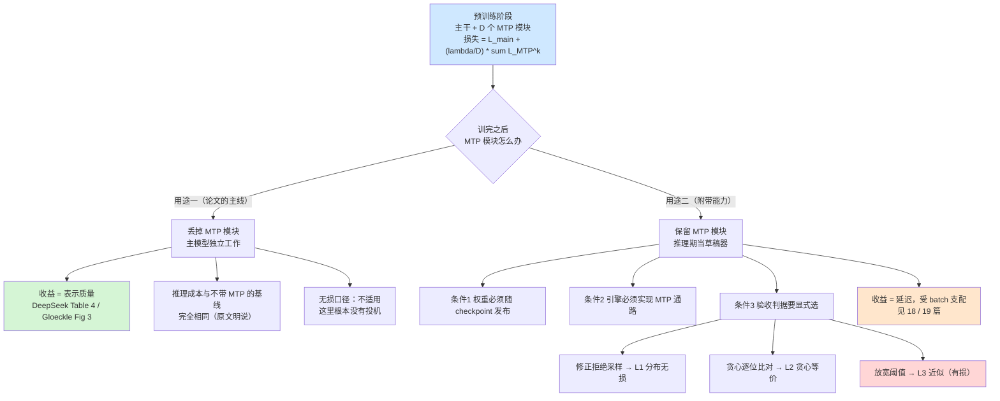

# 14 MTP —— 从训练目标到推理草稿

## 1. 一句话

MTP（multi-token prediction，多 token 预测）**不是**为了加速而发明的：它是 Meta FAIR 在 2024-04 提出的一个**训练目标**，目的是让模型自己变好；
"顺手能拿来当草稿器"是 DeepSeek-V3 在 2024-12 把它**改成串行结构**之后才落地的一个**附带能力**。
本篇要把这两件事彻底分开 —— **训练目标带来的是表示质量，能当草稿用需要额外条件**，两者混为一谈是社区在这条线上最高频的错误（写作规范 §4 点名）。

---

## 2. 前一代卡在哪：草稿头是"训完之后再补的一道工序"

到 2024 年上半年为止，所有已经跑通的草稿器都有同一个结构性问题：**草稿器是骨干模型之外的东西，必须单独训练，而且是在骨干训完之后再对齐。**

| 方案 | 草稿器来源 | 训练时机 | 结构性代价 |
|---|---|---|---|
| Leviathan 2211.17192 / Chen 2302.01318 | 同族小模型（如 T5-small、Chinchilla 7B） | 骨干训完之后另找一个现成小模型 | 小模型和大模型是**两次独立的训练**，没有任何机制保证它们的条件分布接近 |
| Medusa 2401.10774（Cai 等） | 在冻结骨干上新加 $k$ 个线性头 | **骨干训完之后**再训头 | 头只看到骨干的最后一层 hidden state，且**头之间无依赖** |
| EAGLE 2401.15077（Li 等） | 一层 transformer，做 feature 级自回归 | **骨干训完之后**再训 | 需要用骨干在一批 prompt 上生成 hidden state 做蒸馏，采集量可到 PB 级 |

三条线的共同病灶有两个，且**都不是工程勤奋能消掉的**：

1. **额外工程量**：要跑一次数据生成（self-distillation 典型 ~50 万条回答，由巨大的 verifier 生成，算力是主要开销 —— Red Hat 2026-07-06 的说法，见 [[21-草稿模型怎么训-对齐与在线蒸馏]]），再跑一次训练，再做一次格式适配。**骨干发布了不等于能开投机**。
2. **天然的分布不匹配**：草稿器的训练目标是"逼近骨干在某个数据分布上的行为"，但**骨干本身从没为"被人猜"这件事优化过**。骨干的表示里没有任何东西是为"下一个 token 之后那个 token 好不好猜"服务的。草稿器只能事后去拟合一个**并不打算配合它**的目标。

MTP 这条线的历史意义就在这第 2 点上：**它第一次让骨干模型在预训练阶段就为"多看几步"付出了代价** —— 尽管当时提出它的人，写的动机完全不是加速。

---

## 3. 机制拆解：两套 MTP 结构，差别在"并行独立头"还是"串行因果链"

### 3.1 记号

沿用 [[04-拒绝采样修正-无损性的完整证明]] 与 [[06-期望接受长度与加速比模型-完整推导]]：

| 记号 | 含义 | 形状 |
|---|---|---|
| $V$ | 词表大小 | 标量，典型 $32\text{k}\sim129\text{k}$ |
| $d$ | 隐藏维 | 标量 |
| $T$ | 序列长 | 标量 |
| $n$ / $D$ | 一次预测的未来 token 数（Gloeckle 记 $n$，含当前位；DeepSeek 记 $D$，为**额外**深度） | 标量 |
| $z_{t:1}$ | 共享骨干输出的隐表示 | $(T,d)$ |
| $\mathbf h_i^k$ | DeepSeek 第 $k$ 深度、第 $i$ 位的表示 | $(d,)$ |
| $c$ | 草稿一次前向相对目标一次前向的成本 | 标量 |
| $\alpha$ | 期望接受率（口径见 [[05-接受率alpha-定义口径与怎么测]]） | 标量 |

### 3.2 Gloeckle 等（Meta FAIR，2024-04）：并行独立头

- **年月 / arXiv**：**2024-04-30**（v1）· **arXiv:2404.19737**
- **标题**：*Better & Faster Large Language Models via Multi-token Prediction*
- **作者 / 机构**：**Fabian Gloeckle**（**FAIR at Meta**，兼 CERMICS École des Ponts ParisTech）、Badr Youbi Idrissi（FAIR at Meta，兼 LISN Université Paris-Saclay）、Baptiste Rozière、David Lopez-Paz、Gabriel Synnaeve（均 FAIR at Meta）。**五人全部标注 FAIR at Meta**（核实于 arXiv HTML v1 首页 affiliation 块）。

**结构**：一个共享 transformer 主干 $f_s$，$n$ 个**相互独立**的输出头 $f_{h_i}$（每个是一层 transformer），一个**共享**的 unembedding 矩阵 $f_u$：

$$
P_\theta(x_{t+i}\mid x_{t:1})=\mathrm{softmax}\big(f_u(f_{h_i}(f_s(x_{t:1})))\big),\quad i=1,\dots,n
$$

其中 $i=1$ 那一路就是普通的 next-token head。损失是 $n$ 路交叉熵之和：

$$
L_n=-\sum_t\sum_{i=1}^{n}\log P_\theta(x_{t+i}\mid z_{t:1})
$$

**关键工程细节（这一条决定了它"没有训练开销"）**：因为 $V\gg d$，logits 张量 $(n,V)$ 才是显存瓶颈。论文的做法是在主干前向之后**按头顺序做前向/反向**，每个头算完立刻释放它的 logits 与梯度，只在主干处累积 $d$ 维梯度。峰值显存从 $O(nV+d)$ 降到 $O(V+d)$，论文称 **"at no expense in runtime (Table S5)"**。

**为什么多预测几步能改善表示** —— 论文 §5 给了两个论证（原文自称 *"Some speculation"*，即作者自己标为推测，本篇照此转述）：

1. **§5.1 前瞻放大了"选择点"的权重**。文本里不是所有 token 都同等重要：有些是风格性的、可换的，有些是**选择点**（choice point），决定了后文走向。选择点难预测，而**紧跟在选择点之后的那些"无关紧要"的 token 同样变得难预测**。按损失项计数，$n$-token 预测给选择点的隐式权重是 $\frac{n(n+1)}{2}$，给无关紧要的点只有 $n$。
2. **§5.2 信息论分解**。设 $X$ 是下一个 token、$Y$ 是下下个：
   $$H(X)=H(X\mid Y)+I(X;Y),\qquad H(X)+H(Y)=H(X\mid Y)+2I(X;Y)+H(Y\mid X)$$
   丢掉 $H(Y\mid X)$（它在下一个位置会再出现一次），可见 2-token 预测把 $I(X;Y)$ 的权重**乘了 2**。即：**多预测一步，等价于加倍地奖励"预测那些和后文相关的 token"**。

**它对推理说了什么**：论文 §2 "Inference" 一段明确写，最基本的用法是**只用 next-token head、把其它头全部丢掉**；额外的头"可以被利用"来做 self-speculative decoding，点名 blockwise parallel decoding（Stern 等 2018，见 [[08-史前史-2018并行解码与非自回归的失败]]）与 Medusa 式树注意力（Cai 等 2024，见 [[12-Medusa-多头草稿与树注意力的诞生]]）。**注意措辞是"可以"，不是"我们的方法包含"** —— 加速在这篇里是第 3 号贡献，排在质量提升后面。

### 3.3 DeepSeek-V3（2024-12）：串行 MTP 模块，保留完整因果链

- **年月 / arXiv**：**2024-12-27**（v1）· **arXiv:2412.19437**（本篇核实用的是 **v2，2025-02-18**）
- **作者 / 机构**：署名为机构 **DeepSeek-AI**（research@deepseek.com）；**技术报告未单列第一作者**，个人贡献者列在附录 A。按铁律五如实记录：**第一作者未查证（原文即无）**。

**它相对 Gloeckle 新增的机制，原文一句话说得极清楚**（§2.2，逐字）：

> *"Different from Gloeckle et al. 2024, which parallelly predicts $D$ additional tokens using independent output heads, we sequentially predict additional tokens and keep the complete causal chain at each prediction depth."*

Figure 3 的图注同样逐字：*"We keep the complete causal chain for the prediction of each token at each depth."*

**第 $k$ 个 MTP 模块由四件东西组成**：与主模型**共享**的 $\mathrm{Emb}(\cdot)$、与主模型**共享**的 $\mathrm{OutHead}(\cdot)$、一个自己的 transformer block $\mathrm{TRM}_k(\cdot)$、一个投影矩阵 $M_k\in\mathbb R^{d\times 2d}$。前向三步（原文式 21–23）：

$$
\mathbf h_i'^{k}=M_k\big[\mathrm{RMSNorm}(\mathbf h_i^{k-1});\ \mathrm{RMSNorm}(\mathrm{Emb}(t_{i+k}))\big]
$$
$$
\mathbf h_{1:T-k}^{k}=\mathrm{TRM}_k(\mathbf h_{1:T-k}'^{k}),\qquad
P_{i+k+1}^{k}=\mathrm{OutHead}(\mathbf h_i^{k})
$$

$k=1$ 时 $\mathbf h_i^{k-1}$ 就是主模型给出的表示。损失（式 24–25）：

$$
\mathcal L_{\mathrm{MTP}}^{k}=-\frac1T\sum_{i=2+k}^{T+1}\log P_i^k[t_i],\qquad
\mathcal L_{\mathrm{MTP}}=\frac{\lambda}{D}\sum_{k=1}^{D}\mathcal L_{\mathrm{MTP}}^{k}
$$

**$\lambda$ 的实际取值（§4.2 逐字）**：*"The MTP loss weight $\lambda$ is set to 0.3 for the first 10T tokens, and to 0.1 for the remaining 4.8T tokens."* —— 即**训练后期主动把 MTP 的权重调低**。这是一个很硬的信号：MTP 在他们眼里是**辅助损失**，不是主目标。

**三处与 Gloeckle 的具体差异**：

| 维度 | Gloeckle 2404.19737 | DeepSeek-V3 2412.19437 |
|---|---|---|
| 头之间的关系 | $n$ 个**独立并行**头，都吃同一个 $z_{t:1}$ | $D$ 个**串行**模块，第 $k$ 个吃第 $k-1$ 个的输出 $\mathbf h_i^{k-1}$ |
| 因果链 | 深度 $k$ 的预测**看不到**深度 $<k$ 预测出的 token | 深度 $k$ 的输入里**显式拼进了** $\mathrm{Emb}(t_{i+k})$，因果链完整 |
| 头的内容 | 一层 transformer + 共享 unembedding | 一层 transformer + $M_k$ 投影 + **共享 Emb 与 OutHead** |
| 训练期实际深度 | 实验扫 $n\in\{1,2,4,6,8\}$，32k 词表最优 $n=4$ | **$D=1$**（原文 §5.4.3：*"DeepSeek-V3 predicts the next 2 tokens"*） |

论文自己点名了这个结构和谁像（§2.2 逐字）：
> *"Our principle of maintaining the causal chain of predictions is similar to that of EAGLE (Li et al. 2024b), but its primary objective is speculative decoding, whereas we utilize MTP to improve training."*

**这句话是本篇的题眼**：DeepSeek 承认结构上像 EAGLE（见 [[13-EAGLE三代-特征级自回归的演进]]），但**动机是训练，不是投机**。

---

## 4. 逐步走查：同一套权重，两条完全不同的用途



### 4.1 训练期的一个 step 里发生了什么（DeepSeek 版，$D=1$）

1. 主干跑完 $L$ 层，得到 $\mathbf h_{1:T}^{0}$（形状 $(T,d)$），主损失照常算 next-token 交叉熵。
2. MTP 模块 1 取 $\mathbf h_{1:T-1}^{0}$，与 $\mathrm{Emb}(t_{2:T})$ 各过 RMSNorm 后拼接成 $(T-1,2d)$，经 $M_1$ 投影回 $(T-1,d)$。
3. 过 $\mathrm{TRM}_1$（**一层** transformer），得 $\mathbf h_{1:T-1}^{1}$。
4. 过共享的 $\mathrm{OutHead}$ 得 $(T-1,V)$ 的 logits，与**右移两位**的标签算交叉熵，乘 $\lambda$ 加进总损失。
5. 反向传播时，MTP 的梯度**流回主干**。这一步就是"骨干为多看一步付了代价"的物理实现。

**成本记账**：模块参数只有一层 transformer + 一个 $d\times 2d$ 投影。DeepSeek-V3 主干 61 层，故 MTP 模块的前向成本粗估 $c\approx 1/61\approx 0.016$（**这是本篇的估算，不是原文数字；原文未给出 MTP 模块的相对前向成本**）。另外 §3.2.3 说，DualPipe 把最浅层（含 embedding）和最深层（含 output head）放在同一个 PP rank 上，从而让 MTP 模块与主模型**物理共享**这两块参数与梯度 —— 所以 MTP 的显存增量比"多一层"还小。

### 4.2 推理期的一个 step 里发生了什么（当草稿用，$\gamma=1$）

1. 目标模型对已接受前缀跑一次前向，出 $p(\cdot\mid \text{prefix})$，采出 $x_{t+1}$，同时留下 $\mathbf h_t^{0}$。
2. MTP 模块 1 吃 $(\mathbf h_t^{0},\ \mathrm{Emb}(x_{t+1}))$，出 $q(\cdot)$，采出草稿 $\tilde x_{t+2}$。**这一步花 $c$。**
3. 下一轮目标前向把 $[x_{t+1},\tilde x_{t+2}]$ 两个 token 一起喂进去（$q$ 维度 2 的并行验证，几乎免费，理由见 [[03-并行验证为什么几乎免费-算术强度与roofline]]），拿到 $p(\cdot\mid \dots x_{t+1})$ 与 $p(\cdot\mid \dots \tilde x_{t+2})$。
4. 用第 1 个位置的 $p$ 对 $\tilde x_{t+2}$ 做验收。**判据在这里分叉**：走 $\min(1,p/q)$ + 残差重采就是 L1；走 argmax 逐位比对就是 L2；走放宽阈值就是 L3。
5. 接受则本轮白拿 1 个 token，拒绝则用 $p'=\mathrm{norm}(\max(0,p-q))$ 重采 1 个。产出永远 $\ge 1$。

**第 4 步是本篇必须钉死的一件事**：**MTP 只提供 $q$，它不决定无损口径。** 口径由引擎的验收代码决定，与 MTP 本身无关。DeepSeek-V3 技术报告 §5.4.3 **完全没有说**他们用的是哪一种验收判据 —— 所以那个 1.8× 到底是 L1 还是 L2 下测的，**原文未给出**。（同一个数字的负载口径同样缺：**原文未给出 batch size**，硬件、数据集、以及"per-user 还是系统吞吐"也都未给出 —— 七项口径缺四项，逐项清单见 §7.1。）

---

## 5. 小数字算例：$\gamma=1$ 时的天花板，以及它为什么正好卡在 1.9

DeepSeek-V3 的 $D=1$ 意味着当草稿用时 $\gamma=1$（一次只猜 1 个）。代入 [[06-期望接受长度与加速比模型-完整推导]] 的闭式：

$$
E[\tau]=\frac{1-\alpha^{\gamma+1}}{1-\alpha}\Big|_{\gamma=1}=1+\alpha,\qquad
\text{speedup}=\frac{1+\alpha}{c+1}
$$

**天花板是 $1+\alpha$，与 $c$ 无关。** 取原文的 $\alpha\in[0.85,0.90]$：

| $\alpha$ | $E[\tau]=1+\alpha$ | $c=0.016$ | $c=0.05$ | $c=0.10$ |
|---|---|---|---|---|
| 0.85 | 1.850 | **1.820** | 1.762 | 1.682 |
| 0.875 | 1.875 | **1.845** | 1.786 | 1.705 |
| 0.90 | 1.900 | **1.869** | 1.810 | 1.727 |

（实跑：`python _lab/accept.py` 的 `expected_tokens` / `speedup_ideal`，见 §6）

**读法 —— 这是本篇最有信息量的一次对表**：

1. 原文报的 **1.8×** 落在 $\alpha=0.85$、$c\approx0.016$ 那一格（1.820）附近，与理想模型只差百分之一二。
2. 理想模型假设**验证完全免费**。1.8/1.90 = **94.7% 的理想效率**，意味着测这个数时验证确实几乎免费 —— 而按 [[03-并行验证为什么几乎免费-算术强度与roofline]] 与 [[18-batch与吞吐-收益衰减曲线]]，验证免费**只在 memory-bound 区间成立**。**因此可以反推：那个 1.8× 极可能是小 batch / 单流下的数字。** 但**原文未给出 batch size**，所以这是本篇的推断，不是原文陈述。
3. **更关键的一条**：如果目标真是加速，$D=1$ 是一个很差的选择。同样 $\alpha=0.85$、$c=0.016$，最优 $\gamma^*=15$，理想加速比 **4.95×**（实跑见 §6）。DeepSeek 停在 $D=1$，恰恰因为**他们要的是训练收益，$D=1$ 就够了** —— 这是"训练目标"与"推理草稿"目标不一致的最直接证据。

### 5.1 一个 $|V|=5$ 的手算

设某位置目标分布 $p=(0.60,0.20,0.10,0.05,0.05)$，MTP 模块给出 $q=(0.55,0.25,0.10,0.05,0.05)$。

$$
\beta=\sum_x\min(p,q)=0.55+0.20+0.10+0.05+0.05=0.95
$$

$\gamma=1$：$E[\tau]=1+0.95=1.95$。取 $c=0.016$，speedup $=1.95/1.016=1.919$。

拒绝时的残差分布：$\max(0,p-q)=(0.05,0,0,0,0)$，归一化后 $p'=(1,0,0,0,0)$ —— 即一旦拒绝，必然重采到 token 0。总质量 $0.05=1-\beta$，与拒绝概率对上（这条恒等式的验证见 `_lab/test_lossless.py::test_residual_mass_equals_rejection_prob`）。

**注意 $\beta=0.95$ 比 DeepSeek 报的 0.85–0.90 还高，是因为这里假设 $q$ 已经很接近 $p$。真实 MTP 模块只有一层 transformer，$q$ 不可能这么准。**

---

## 6. 代码验证

本篇的所有算术都用库内既有的 `_lab/accept.py` 与 `_lab/speedup.py` 复算，不新增语义。

```
$ cd _lab && python -c "from accept import expected_tokens, speedup_ideal, optimal_gamma; \
  print(expected_tokens(0.85,1), speedup_ideal(0.85,1,0.0164)); \
  print(optimal_gamma(0.85,0.0164))"
1.85 1.8201...
(15, 4.953177708742301)
```

实跑输出（截自本次执行）：

| 场景 | $\alpha$ | $\gamma$ | $c$ | $E[\tau]$ | speedup |
|---|---|---|---|---|---|
| DeepSeek-V3 口径下界 | 0.85 | 1 | 0.0164 | 1.8500 | **1.8201** |
| DeepSeek-V3 口径上界 | 0.90 | 1 | 0.0164 | 1.9000 | **1.8693** |
| 若 $D=3$（MiniMax-M2 的 $K=3$），**忽略逐步衰减** | 0.85 | 3 | 0.0164 | 3.1866 | 3.0372 |
| 同上 | 0.90 | 3 | 0.0164 | 3.4390 | 3.2777 |
| 最优 $\gamma$（$\alpha=0.85$，$c=0.0164$） | 0.85 | **15** | 0.0164 | — | **4.9532** |

⚠️ 第 3、4 行标注得很重：**它们假设每一步的 $\alpha$ 相同，而这在 MTP 上恰恰不成立**（原因见 §7.3）。这两行是"如果衰减不存在会怎样"的上界，**不能当预测用**。

`python _lab/speedup.py --breakeven` 的输出里，`eagle-head (P=0.60B)` 一列在 bs=1/seqlen=1024 处保本所需接受长度是 **1.03**，而 `llama3.2-1b (P=1.24B)` 是 **1.07** —— 这就是"草稿越轻，保本线越低"的物理表现。**MTP 模块只有一层 transformer，比 EAGLE 头还轻**，所以它在保本线上是全库最有利的一档。这条由 `_lab/test_speedup.py::test_lighter_draft_lowers_breakeven` 强制。

---

## 7. 口径与坑

### 7.1 【已核验】DeepSeek-V3 的 "85–90% / 1.8× TPS"：数字真实存在，但口径严重不全

`_research/RS-4` 记录：这两个数字被二手来源极其广泛引用，但**对 arXiv HTML v1/v2/latest 与 ar5iv 镜像做了 4 次定向抽取均未能逐字定位**，其中一次明确报告 *"Content truncated due to length"*，因此标为【待核验】，并规定"写正文时必须人工打开 PDF 核对，不得直接搬运"。

**本篇核实结果：核到了。**

- **核实于**：<https://arxiv.org/html/2412.19437v2>（v2，2025-02-18）
- **原文位置**：**§5.4.3 Multi-Token Prediction Evaluation**（正文倒数第二节，紧接 §5.4.2 Self-Rewarding，其后即 §6 Conclusion）
- **核实方法**：直接 `curl` 落盘完整 HTML（549,352 字节）后本地去标签、正则定位。前四次失败的原因确实是**抽取工具在到达 §5.4.3 之前截断**，而不是原文没有 —— RS-4 当时的判断"极可能确实存在于原文（截断导致抽取失败的可能性最大）"是对的。
- **交叉源复核（2026-08-22，独立重做一次）**：本篇写作时只核了 HTML v2 一个渲染，按本库"关键数字必须换一个源再确认"的规矩，事后又独立取了 **HTML v1**（549,443 字节）与**官方 PDF**（1,887,366 字节 / 53 页，`pdftotext -layout` 抽取）。**三种渲染逐字一致**，且 PDF 上定位到该段落在**第 35 页**。**结论不变，证据从单源升为三源。**

**逐字原文**（三句连续）：

> *"Instead of predicting just the next single token, DeepSeek-V3 predicts the next 2 tokens through the MTP technique. Combined with the framework of speculative decoding (Leviathan et al. 2023; Xia et al. 2023), it can significantly accelerate the decoding speed of the model. A natural question arises concerning the acceptance rate of the additionally predicted token. **Based on our evaluation, the acceptance rate of the second token prediction ranges between 85% and 90% across various generation topics, demonstrating consistent reliability. This high acceptance rate enables DeepSeek-V3 to achieve a significantly improved decoding speed, delivering 1.8 times TPS (Tokens Per Second).**"*

**但按铁律二，这组数字仍然不能横向比较。** 七项口径逐条核对：

| 铁律二要求项 | DeepSeek-V3 §5.4.3 给了吗 |
|---|---|
| 1. batch size | ❌ **原文未给出**（本篇 §5 的推断是"极可能 bs 很小"，仅为推断） |
| 2. $\gamma$ | ✅ 隐含 $\gamma=1$（*"predicts the next 2 tokens"*，$D=1$） |
| 3. $\alpha$ 或平均接受长度 | ✅ 85%–90%，但**定义口径未给**（是逐位接受率？是第二 token 的 argmax 一致率？） |
| 4. draft / target 组合 | ✅ 自带 MTP 模块 + DeepSeek-V3 671B/37B 激活 |
| 5. 硬件与精度 | ❌ **§5.4.3 未给出**（训练用 2048×H800；**该节没说推理硬件**。§3.4 另外描述了线上部署——H800 集群、PD 分离、**解码最小单元 40 节点 320 GPU**、TP4+SP+DP80+EP320——但**论文从未说 §5.4.3 的 1.8× 是在这套配置下测的**，不许替它连线） |
| 6. 测的是什么 | ⚠️ 只写 "TPS"，**未区分单用户输出速度还是总吞吐** |
| 7. 任务分布 | ⚠️ 只写 *"across various generation topics"*，**未给数据集** |

> **2026-08-22 复核时新发现的一处张力，如实记下来。** 上表第 1 行说 batch 未给出、本篇 §5 由"1.8/1.90 = 94.7% 的理想效率"反推**极可能 bs 很小**；而 §3.4.2 描述的线上解码部署是 **DP80 / EP320**，那是一套**为高并发设计**的配置。**两者不是矛盾，因为论文根本没把 §5.4.3 和 §3.4.2 挂钩** —— 但这恰好说明为什么第 1 行的"未给出"是致命缺项：**同一份报告里同时存在"暗示小 batch 的效率反推"和"明确的高并发部署描述"，读者按哪一个理解，这个 1.8× 的含义就完全不同**（per-user 提速 vs 系统吞吐提速，正是上表第 6 行那个未区分项）。**本库对这一点不下结论，只标注"原文未给出、且两处线索指向相反的量级"。**

**结论：数字是真的，标注从【待核验】改为【已核验，口径不全，不可横向比较】。** 特别地 —— **不许把它和 EAGLE-3 的 4.40× 之类放进同一张表比较**（后者是 RTX 3090 / bs=1 / dense 8B 的口径，见 [[19-负收益全解-什么时候投机反而更慢]]）。

### 7.2 "训练目标"与"推理草稿"是两件事 —— 三条硬证据

这是写作规范 §4 点名的高频错误。**它错在哪、以及原文自己怎么说的**：

**证据一：论文自己把两者分开写。** DeepSeek-V3 §2.2 "MTP in Inference" 一段逐字：

> *"Our MTP strategy mainly aims to improve the performance of the main model, so during inference, **we can directly discard the MTP modules** and the main model can function independently and normally. **Additionally**, we can also repurpose these MTP modules for speculative decoding to further improve the generation latency."*

"mainly aims to improve the performance of the main model" + "Additionally" —— **主线是丢掉，投机是附加项**。

**证据二：消融实验是在"丢掉 MTP 模块"的前提下做的。** §4.5.1 逐字：*"Note that during inference, we directly discard the MTP module, so the inference costs of the compared models are exactly the same."* 也就是说，Table 4 里那些质量提升，**全部是在没有任何投机的情况下测的** —— 它证明的是"训练目标有用"，**没有**证明"草稿好用"。

**证据三：训练收益不需要草稿能力，草稿能力需要额外条件。** 要把 MTP 当草稿用，至少要同时满足：
1. **MTP 模块的权重被随 checkpoint 一起发布**（可以不发 —— 训完丢掉是论文的默认路径）；
2. **推理引擎实现了 MTP 通路**（vLLM 的 `mtp` 方法源码是 `self.model = self.target_model_config.model`，即直接从 target checkpoint 里取，**不需要额外训练**，但需要引擎认得这个结构）；
3. **验收判据被显式选定**（MTP 本身不带无损口径，见 §4.2 第 4 步）；
4. **草稿分支与主干在推理期对齐**（训练时 MTP 吃的是 teacher-forced 的 $\mathrm{Emb}(t_{i+k})$，**真实标签**；推理时吃的是主干刚采出来的 token，**可能是错的**。这是一个真实存在的 train/inference 不匹配 —— 只是比"另训一个草稿模型"小得多）。

**一句可判定的判据**：**"这个模型用 MTP 训过"推不出"这个模型能开投机"；反过来"这个模型能开 MTP 投机"必然蕴含"MTP 模块被保留了"。** 两个命题不等价，方向也不对称。

### 7.3 逐步衰减：MTP 模块被反复复用时接受率会掉

$D=1$ 的 MTP 模块只有一层，引擎想拿 $\gamma>1$，唯一办法是**把同一层反复跑**。这会掉接受率，而且**三家引擎里有两家把它写进了源码警告或文档**：

- **vLLM 源码 warning**（`_research/RS-3`）：*"Enabling `num_speculative_tokens > 1` will run multiple times of forward on same MTP layer, which may result in lower acceptance rate"*。
- **昇腾文档**：DeepSeek MTP 在 `num_speculative_tokens >= 3` 时**精度与性能都不保证**（`_research/RS-5` §12.4 记录）。
- **Nebius《LK Losses》（arXiv:2602.23881（2026-02），ICML 2026，作者 Alexander Samarin 等，Nebius）**明确指出：**DeepSeek-V3 的 MTP 模块主要是为"预测第一个额外 token"训练的，推理时却被自回归地反复复用到后面位置，导致后面位置接受率退化。** 证据强度〔B〕（RS-5 记录，本篇未逐字核原文）。

→ 这正是 §6 表格里第 3、4 行必须打警告的原因：**把 $\alpha$ 当常数外推到 $\gamma=3$ 会系统性高估。**

### 7.4 Gloeckle 那篇的 3.0×，是 L2 不是 L1

论文 §3.2 逐字：*"We implement **greedy** self-speculative decoding (Stern et al. 2018)…"* —— **贪心**，且引的是 Stern 2018 的 blockwise parallel decoding。按铁律一，这属于 **L2 贪心等价**，**不是 L1 分布无损**。社区转述这篇时经常直接说"无损加速 3 倍"（原文口径：**batch size = 42**、7B 4-token 预测模型、$k=4$，见下表），**漏掉了"greedy"这个词**，等于把 L2 说成了 L1。

**完整口径（Table S2 / S3，原文给得相当齐）**：

| 项 | 值 |
|---|---|
| 模型 | 7B 参数、**4-token 预测**模型；wikipedia/books 用训了 500B token 的版本，code 用训了 1T token 的版本 |
| 数据 | 4200 条 512-token 的测试序列（未参与训练），生成 512 token |
| batch size | **42（最大 batch）**，原文称 *"constant across batch sizes (Figure S10)"* |
| 判据 | greedy self-speculative decoding（**L2**） |
| $\gamma$ | 用 $k$ 个头，$k\in\{1,2,3,4\}$；**理论上限就是 $k$** |
| 结果（$k=4$） | Code **3.05×**（3.50 token/forward）、Wikipedia **2.74×**（3.12）、Books **2.67×**（3.09） |
| 字节级模型 | 8-byte 预测模型 **6.4×**（Table S3） |
| 硬件 | **原文未给出**（只说用 xFormers 实现） |

**"batch 42 下 3×、且随 batch 恒定"这一条很反常** —— 它与本库 [[18-batch与吞吐-收益衰减曲线]] 的主结论（收益随 batch 衰减）表面冲突。可能的调和：那是 2024-04 的 7B 稠密模型、512 上下文、xFormers 研究原型，**离生产并发（数百到数千）差两个数量级**。本库不据此推翻 18 篇，**但也如实记录这条与主流叙事不一致的一手数据**。

### 7.5 训练收益本身也不是无条件的

MTP 论文常被引成"多预测几步总是更好"，**原文不支持这个说法**：

- **Gloeckle §3.7**：7B 模型在 200B token 自然语言上，2-token 预测在 6 个标准 NLP benchmark 上**与基线持平**，**4-token 预测出现性能退化**（原文逐字：*"The 4-future token prediction model suffers a performance degradation."*）。同一批模型在摘要（ROUGE-L $F_1$）上 $n=2$ 与 $n=4$ **都优于基线**，但**差距随训练数据量增大而缩小**。
- **Gloeckle §3.1**：收益**只在规模上来之后才出现**（原文逐字：*"We believe this usefulness only at scale to be a likely reason why multi-token prediction has so far been largely overlooked…"*）。
- **DeepSeek Table 4**（$D=1$，与基线同数据同架构）：原文说 *"consistently enhances the model performance on **most** of the evaluation benchmarks"* —— **是 most 不是 all**。逐项看确实有掉的：

| Benchmark | Small MoE 基线 → w/ MTP | Large MoE 基线 → w/ MTP |
|---|---|---|
| Pile-test (BPB，越低越好) | 0.729 → 0.729（**持平**） | 0.658 → 0.657 |
| BBH (EM) | 39.0 → 41.4 | 70.0 → 70.7 |
| MMLU (EM) | 50.0 → 53.3 | **67.5 → 66.6（掉 0.9）** |
| DROP (F1) | 39.2 → 41.3 | 68.5 → 70.6 |
| TriviaQA (EM) | 56.9 → 57.7 | 67.0 → 67.3 |
| NaturalQuestions (EM) | **22.7 → 22.3（掉 0.4）** | 27.2 → 28.5 |
| HumanEval (Pass@1) | 20.7 → 26.8 | 44.5 → 53.7 |

（口径：Small MoE 15.7B 总参 / 2.4B 激活 / 1.33T token；Large MoE 228.7B 总参 / 20.9B 激活 / **540B** token。**引用**，来源见文末。）

→ **两篇论文都显示：代码/生成类任务收益最大，选择题类任务收益最小甚至为负。** 这与 [[05-接受率alpha-定义口径与怎么测]] 里"代码任务接受率最高"的规律同源 —— **代码的下一步比自然语言更可预测**。

---

## 8. 失效条件（铁律三）

以下每条都尽量写成可判定形式。

**F1 —— MTP 模块没被发布，或引擎不认。** 判据：`config.json` 里没有 `num_nextn_predict_layers` / `mtp_num_hidden_layers` 一类字段，或引擎启动日志显示 `SpeculativeConfig(method='draft_model', ...)` 而非 `mtp`。此时 MTP 训练收益已经在权重里，**但草稿能力为零**。这是最常见的"以为自己开了 MTP"。

**F2 —— $\gamma$ 被设到 3 以上，且模块只有 $D=1$ 层。** 判据：`num_speculative_tokens >= 3` 且 checkpoint 只有 1 个 MTP 层。vLLM 会打 warning，昇腾文档直接说"精度性能都不保证"。**接受率退化 + 草稿成本线性上涨，双向亏。**

**F3 —— batch 上去了。** TensorRT-LLM 官方 Qwen3.8 MoE 部署指南（口径齐全：**GB300、8192-in/1024-output、FP8 权重 + FP8 KV、controlled accepted-draft count = 2.3、MTP3 即 $\gamma=3$**）：

| 目标 | 投机 | 拓扑 | 并发 | 最佳实测值 |
|---|---|---|---:|---:|
| 低延迟 | 关 | TP16/EP1 | **1** | 133.502 output tok/s/user（7.491 ms median TPOT） |
| 低延迟 | **MTP3** | TP16/EP1 | **1** | **383.051** output tok/s/user（2.611 ms median TPOT） |
| 高吞吐 | 关 | Attention DP32/EP32, Static544 | **3264** | 4059.200 total tok/s/GPU |
| 高吞吐 | **MTP3** | Attention DP32/EP32, Static544 | **2304** | **4118.164** total tok/s/GPU |

**换算：并发 1 时 MTP3 给 2.87× 延迟收益；并发 2304/3264 时只剩 +1.46% 吞吐收益。** 同一个 MTP3、同一台机器、同一个模型 —— **收益差了近两个数量级**。这是本库最干净的一组"同口径下 batch 吃掉全部收益"的证据。（对应地，NVIDIA 自己的部署 YAML 里，latency 档 MTP `max_draft_len: 3`，throughput 档就降到 **1**。）

**F4 —— 目标是超大稀疏 MoE。** EcoSpec（8×H200、**bs=1**、$T=0$）实测：**DeepSeek-V3.1（671B，Top-8）+ MTP 只有 1.10×**，平均激活专家 31.4；对照 dense 的 Llama-3.1-8B + EAGLE-3 是 4.40×。机制：验证多个 token 时激活专家集合取**并集**，验证不再近似免费（见 [[23-与其它优化的相互作用-量化与KVcache与PD分离]]）。

**F5 —— 长上下文 + 高前缀复用。** vllm-ascend Issue #9247（DeepSeek-V4-Flash + MTP）：同一个 46,240 token 的 prompt，不开 MTP 时 prefix cache 命中 32,768 token、需重算 13,472；**开 MTP 后命中掉到 16,384、需重算 29,856**，多付约 16,384 token 的 prefill。报告者原话：*"a small MTP/EAGLE recomputation requirement is amplified into losing a full 16K prefix-cache segment."* 结论：*"the extra prefill cost can outweigh MTP's decode speed benefit"*。状态 closed as not planned。
→ **这是"投机在 prefill 上亏掉、而不是在 decode 上亏掉"的机制性案例。** 多轮对话 / agent 场景必须单独验。

**F6 —— 需要 CUDA graph、结构化输出或滑窗注意力。** vLLM 对 `deepseek_v32` 的 MTP 强制 `enforce_eager = True`（源码 FIXME：*"cudagraph with v32 MTP is not supported"*）；TensorRT-LLM 的特性矩阵里 **MTP × Guided Decoding = No、MTP × Sliding Window Attention = No**；GLM-5 部署指南写 *"MTP is not currently supported with the NVFP4 checkpoint."*；MiniMax-M3 写 *"MTP is not supported on the sparse-attention path in this release."*
→ **判据：如果你的服务开了 guided decoding / tool calling / NVFP4，先查这张兼容矩阵再谈收益。**

**F7 —— PD 分离 + overlap scheduler 同开。** TensorRT-LLM 文档逐字警告：*"Enabling disaggregated serving, MTP, and the overlap scheduler at the same time can lead to accuracy problems."* 这是**正确性**风险，不是性能风险。

---

## 9. MTP 是不是已经成了默认？（如实转述 `_research/RS-5` §4，附证据强度）

`_research/RS-5` 的证据分级：〔A〕一手官方；〔B〕转述可信来源但未逐字核；〔C〕第三方/个人博客。**本篇原样保留分级。**

| 模型 | 证据 | 机制细节 | 级别 |
|---|---|---|---|
| **DeepSeek-V3** | arXiv:2412.19437 §5.4.3 | $D=1$ MTP 模块；85%–90% / 1.8× TPS | 〔**A**〕**本篇已逐字核实，从 RS-5 的〔B〕升级** |
| **MiniMax-M2** | arXiv:2605.26494（v2，2026-07-30） | 62 层 decoder-only，229.9B 总参 / 9.8B 激活；在**持续预训练的 decay 阶段**把 MTP 模块从 1 扩到 **3（$K=3$）**以支持多步投机；MTP 模块**用主模型权重拷贝初始化**而非随机初始化 | 〔**B**〕 |
| **DeepSeek-V4** | vllm-ascend release notes + DSpark 论文 | 生产线原基线就是 **MTP-1** | 〔**A**〕 |
| **Qwen3.5** | 第三方（mlx-lm PR #990、个人博客） | checkpoint 自带 MTP head，config 里 `mtp_num_hidden_layers: 1`；从 $t$ 位 backbone hidden state + token $t$ 的 embedding 预测 $t+2$ | 〔**C**〕—— **官方技术报告未查证** |
| **GLM-5.1** | 第三方博客 | 原生 MTP head；SGLang 里走 `NEXTN`；建议把 MTP 层（第 78 层）留 **BF16**（~19 GB）以保接受率 | 〔**C**〕 |
| **Kimi K2.5** | 第三方 | **没有**原生 MTP，要投机得上 EAGLE | 〔**C**〕 |
| **Kimi K2.6** | vLLM blog | 官方推荐 **EAGLE 3.1 draft**（`lightseekorg/kimi-k2.6-eagle3.1-mla`），**不是**自带 MTP | 〔**A**〕 |

**最硬的落地证据**〔**A**〕：vllm-ascend release notes（<https://docs.vllm.ai/projects/ascend/zh-cn/main/user_guide/release_notes.html>）**v0.23.0（2026.08.16）**：MTP 支持扩展到 **DeepSeek V4、Qwen3.5/3.6、MiniMax 2.x、Step3、Gemma4**。
→ 一个 NPU 后端适配层要为**六个不同厂商的模型族**分别做 MTP 支持，说明"模型自带草稿头"在 2026 年已经是主流开源模型的**标配**，不是 DeepSeek 一家的特色。

**但"自带 MTP"不是终点 —— RS-5 给了三条反证**：

1. **DeepSeek 自己换掉了 MTP-1**：V4 生产线用 DSpark（arXiv:2607.05147（2026-07））取代，per-user 提速 57–85%〔A〕。
2. **训练目标与投机用法本就错配**：Nebius LK Losses（arXiv:2602.23881）的论断，见 §7.3〔B〕。
3. **MTP head 一样有 attention drift**：arXiv:2605.09992 在 Qwen3.5 9B 的 MTP head 上观察到与 EAGLE-3 drafter 相同的漂移〔A〕。

**RS-5 的判断（标为推断，本篇照转）**：**MTP 已经成为"地板"而不是"天花板"** —— 它是模型交付时应当自带的最低配置，但一线厂商的生产线普遍在 MTP 之上再叠一层专门训练的 drafter。参见 [[24-前沿进展-2025到2026]]、[[25-未来判断-哪些方向会活下来]]。

**未深核**：FastMTP（arXiv:2509.18362，2025-09），RS-5 §11.5 只记为"增强的 MTP"，**本篇未查证其机制与数字**。

---

## 10. 它新增了什么 / 什么被后来推翻（铁律五）

### Gloeckle 等（Meta FAIR，2024-04，arXiv:2404.19737）

**新增**：
1. 把"一次预测 $n$ 个未来 token"作为**预训练辅助损失**正式提出并做到规模化（300M–13B，$\ge$91B token 代码）；
2. 一个**零显存开销**的实现（按头顺序前向/反向，峰值 $O(nV+d)\to O(V+d)$，运行时无代价）；
3. 两个解释性论证（选择点权重 $\frac{n(n+1)}{2}$ vs $n$；$I(X;Y)$ 权重加倍）；
4. **指出了额外头可以直接拿来做 self-speculative decoding**（$k$ 个头上限 $k$ 倍，实测 code 3.05× / L2）。

**被后来推翻或修正的**：
- **"独立并行头"这个结构被 DeepSeek-V3 明确否定**：DeepSeek 逐字写 *"Different from Gloeckle et al. 2024, which parallelly predicts D additional tokens using independent output heads, we sequentially predict… and keep the complete causal chain."*
- 更广地，`_research/RS-5` §14.2 记录：**"纯并行、无位置间依赖的草稿（Medusa 式）"整条线正在死掉** —— DSpark 论文给出的位置级曲线显示并行 drafter 在位置 1 更强（0.88 vs 0.81），但位置 2–7 快速衰减（Chat 上 0.72→0.63），自回归 drafter 稳定；DSpark / DFly 都在并行 backbone 之后**补一个轻量因果 head**。
- **"$n$ 越大越好"被论文自己否定**（§3.4：32k 词表最优 $n=4$；§3.7：$n=4$ 在自然语言选择题上退化）。
- **"batch 42 下加速恒定"截至查证日未见被点名推翻**，但也**未见任何后续工作在生产并发下复现**；本库按 [[18-batch与吞吐-收益衰减曲线]] 的口径视为"研究原型区间的结论"。

### DeepSeek-V3（DeepSeek-AI，2024-12，arXiv:2412.19437）

**新增**：
1. **串行 MTP 模块 + 完整因果链**（$\mathbf h_i'^k=M_k[\mathrm{RMSNorm}(\mathbf h_i^{k-1});\mathrm{RMSNorm}(\mathrm{Emb}(t_{i+k}))]$）；
2. **与主模型共享 Emb 与 OutHead**，并靠 DualPipe 把二者放在同一 PP rank 上做**物理共享**，把显存增量压到一层以下；
3. **把"推理期复用 MTP 模块做投机"从一句可能性变成了产品事实** —— 这是"模型自带草稿头"这一形态的真正起点；
4. 给出了这条路上第一组公开的接受率数字（85%–90%，$D=1$）。

**被后来推翻或修正的**：
- **MTP-1 本身被 DeepSeek 自己在 V4 生产线上换成了 DSpark**（半自回归 + 置信度调度验证，arXiv:2607.05147）〔A〕。
- **"MTP 模块可以直接自回归复用到更深位置"被 Nebius 指出是错配**（训练时只优化第一个额外位置）〔B〕；vLLM 与昇腾把它写进了源码警告和文档限制。
- **MTP head 免疫 attention drift 的假设被推翻**（arXiv:2605.09992）〔A〕。
- **"1.8× TPS"没有被推翻，但被证明高度依赖 batch**：同族的 MoE 目标在 bs=1 下只有 1.10×（EcoSpec），在并发 2304 下只剩 +1.46%（TensorRT-LLM GB300）。
- **截至 2026-08-22，未见任何工作推翻"MTP 作为训练目标能提升质量"这一主张。**

---

## 11. 自测题

1. 一个开源模型的技术报告说"我们用了 MTP 训练目标"。你能不能据此断定它支持投机解码？
   <details><summary>答案要点</summary>**不能。** 训练目标只保证质量收益；能当草稿用需要至少四个额外条件：MTP 模块权重随 checkpoint 发布、引擎实现 MTP 通路、验收判据被显式选定、草稿分支与主干在推理期对齐。Gloeckle 与 DeepSeek 两篇都明说"推理时可以直接丢掉 MTP 模块"。反方向才成立：能开 MTP 投机 ⟹ 模块被保留了。</details>

2. DeepSeek-V3 报的 1.8× TPS，你能拿它和 EAGLE-3 论文的 4.40× 放进同一张表比较吗？
   <details><summary>答案要点</summary>**不能**（铁律二）。DeepSeek 那组缺 batch size、硬件、数据集、测的是延迟还是吞吐；EAGLE-3 那组是 RTX 3090 / bs=1 / dense Llama-3.1-8B。七项里至少四项对不上。而且目标模型一个是 671B MoE、一个是 8B dense，MoE 的验证成本模型完全不同（见 F4）。</details>

3. $D=1$ 的 MTP 当草稿用时，理论加速比上限是多少？为什么 DeepSeek 不把 $D$ 做大？
   <details><summary>答案要点</summary>上限是 $E[\tau]=1+\alpha\le 1.90$（$\alpha=0.90$），与 $c$ 无关。不做大是因为**他们要的是训练收益**：$\lambda$ 在后 4.8T token 上还从 0.3 降到 0.1，说明 MTP 是辅助损失。若真为加速，$\alpha=0.85,c=0.016$ 下最优 $\gamma^*=15$、理想加速 4.95× —— 差了 2.7 倍。这正是"训练目标 ≠ 推理草稿"的量化体现。</details>

4. 引擎把 $D=1$ 的 MTP 层反复跑 3 次来拿 $\gamma=3$，会发生什么？
   <details><summary>答案要点</summary>接受率退化。vLLM 源码 warning 逐字："run multiple times of forward on same MTP layer, which may result in lower acceptance rate"；昇腾文档说 $\ge 3$ 时精度性能都不保证；Nebius 给了机理（模块只为第一个额外位置训练过）。代价是双向的：$E[\tau]$ 的增长慢于 $\alpha^k$ 常数假设的预测，而草稿成本 $\gamma c$ 是线性涨的。所以 §6 表里 $\gamma=3$ 那两行只能当上界。</details>

5. Gloeckle 那篇报的 3.0× 是 L1、L2 还是 L3？说清判据。
   <details><summary>答案要点</summary>**L2 贪心等价**。原文 §3.2 逐字 "greedy self-speculative decoding (Stern et al. 2018)"，用的是 blockwise parallel decoding 的逐位 argmax 比对，不是 $\min(1,p/q)$ + 残差重采。社区转述时常漏掉 "greedy" 而说成"无损"，等于把 L2 说成 L1。若把同一套 MTP 头配上标准修正拒绝采样，那才是 L1（见 [[04-拒绝采样修正-无损性的完整证明]]、[[07-无损的三种口径-分布无损不等于结果相同]]）。</details>

6. 你在多轮对话服务上开了 MTP，QPS 反而掉了，decode 侧看不出问题。第一个该查什么？
   <details><summary>答案要点</summary>**prefix cache 命中率**（F5）。vllm-ascend #9247 显示 MTP/EAGLE 丢弃最后一个匹配块，叠加 LCM 对齐块向下取整，会把"少量重算需求"放大成整段 16K 前缀缓存失效 —— 亏在 prefill 不在 decode。次查项：CUDA graph 是否被 `enforce_eager` 关掉（F6）。</details>

---

## 12. 延伸与双链

- 前置物理账：[[01-decode为什么慢-带宽墙与算力空转]]、[[03-并行验证为什么几乎免费-算术强度与roofline]]
- 无损口径（本篇 §4.2 第 4 步的三条分叉）：[[04-拒绝采样修正-无损性的完整证明]]、[[07-无损的三种口径-分布无损不等于结果相同]]
- 本篇 §5 用的闭式与最优 $\gamma$：[[06-期望接受长度与加速比模型-完整推导]]；$\alpha$ 的测法：[[05-接受率alpha-定义口径与怎么测]]
- 前一代草稿头（本篇 §2 的三行表）：[[12-Medusa-多头草稿与树注意力的诞生]]、[[13-EAGLE三代-特征级自回归的演进]]、[[21-草稿模型怎么训-对齐与在线蒸馏]]
- MTP 的史前形态（blockwise parallel decoding，Gloeckle 直接引用它做推理）：[[08-史前史-2018并行解码与非自回归的失败]]
- $\gamma>1$ 时的树化与动态停止：[[16-树形草稿与树注意力-mask构造与验证]]、[[17-动态草稿长度与自适应停止]]
- 失效条件的系统版：[[18-batch与吞吐-收益衰减曲线]]、[[19-负收益全解-什么时候投机反而更慢]]、[[23-与其它优化的相互作用-量化与KVcache与PD分离]]
- 三家引擎怎么实现 MTP（vLLM `mtp` / SGLang `NEXTN` 走 EAGLE 通路 / TensorRT-LLM `MTPDecodingConfig`）：[[20-主流引擎实现-vLLM与SGLang与TensorRTLLM]]
- 谁被淘汰了、2026 的格局：[[15-谱系图与被淘汰的分支]]、[[24-前沿进展-2025到2026]]、[[25-未来判断-哪些方向会活下来]]
- 本篇纠正的社区错误进哪：[[26-社区精彩解释精选-好在哪与错在哪]]、[[27-常见误解与判据]]

---

### 本篇验证

- `_lab/test_accept.py::test_optimal_gamma_decreases_with_cost` —— 验证 §5 的核心论断"草稿越便宜、最优 $\gamma$ 越大"。这是"$D=1$ 对加速而言是次优选择"这一结论的方向性依据：MTP 模块极轻（$c\approx0.016$），最优 $\gamma^*=15$，而 DeepSeek 停在 1。
- `_lab/test_accept.py::test_alpha_is_one_when_draft_equals_target` —— 验证 §3.1 的 $\alpha$ 定义在极限处自洽（草稿等于目标时 $\alpha=1$）。MTP 与 target **共享 Emb 与 OutHead、且吃 target 的 hidden state**，所以它在结构上比独立小模型更靠近这个极限 —— 这条测试给出了那个极限的参照点。
- `_lab/test_speedup.py::test_lighter_draft_lowers_breakeven` —— 验证 §6 的论断"草稿越轻，保本所需接受长度越低"。MTP 模块只有一层 transformer，是全库最轻的一档草稿器，这条测试是它保本线优势的形式化。
- `_lab/test_speedup.py::test_breakeven_always_above_one` —— 保本线恒 $>1$，即 **$\gamma=1$ 的 MTP 也必须真的接受到东西才不亏**；接受率掉到 0 时 MTP 是净亏损（对应 §8 的 F2）。
- `_lab/test_lossless.py::test_exact_distribution_lossless` —— 验证 §4.2 第 4 步的 L1 分支：**只要接上标准修正拒绝采样，MTP 草稿的输出就是目标分布的精确样本**，与草稿从哪来（独立小模型 / EAGLE 头 / MTP 模块）无关。这是"MTP 本身不决定无损口径"这一论断的形式化。
- 可复跑：
  - `cd _lab && python -m pytest -q test_accept.py::test_optimal_gamma_decreases_with_cost test_accept.py::test_alpha_is_one_when_draft_equals_target test_speedup.py::test_lighter_draft_lowers_breakeven test_speedup.py::test_breakeven_always_above_one test_lossless.py::test_exact_distribution_lossless` → 本次实跑 **11 passed in 0.09s**（`test_exact_distribution_lossless` 有 7 组 parametrize）
  - `python _lab/accept.py --table` → $\alpha=0.90$ 行给出 $g=1$ 时 $E[\tau]=1.900$（即 §5 的天花板）；表 2 给出 $\alpha=0.90,c=0.02$ 时 $\gamma^*=19$、speedup 6.365
  - `python _lab/speedup.py --breakeven` → `eagle-head (P=0.60B)` 在 bs=1/seqlen=1024 处保本接受长度 **1.03**，`llama3.2-1b (P=1.24B)` 为 **1.07**

### 本篇来源

- Fabian Gloeckle, Badr Youbi Idrissi, Baptiste Rozière, David Lopez-Paz, Gabriel Synnaeve（**FAIR at Meta**）, *Better & Faster Large Language Models via Multi-token Prediction* — <https://arxiv.org/abs/2404.19737>（**2024-04-30 v1**）。**好在哪**：§2 的显存工程（$O(nV+d)\to O(V+d)$）写得极具体，是"为什么这个辅助损失不要钱"的完整回答；§5.1 的"选择点权重 $\frac{n(n+1)}{2}$ vs $n$"是我见过对"多预测几步为什么改善表示"最干净的解释。**需要注意的地方**：① §5 作者自己标为 *"Some speculation"*，两个论证都是启发式的，不是定理；② §3.2 的 3.0× 是 **greedy**（L2），社区转述时经常漏掉这个词；③ 硬件口径原文未给出；④ §3.7 的自然语言退化结果只出现在正文一句话里，容易被略过。
- DeepSeek-AI, *DeepSeek-V3 Technical Report* — <https://arxiv.org/abs/2412.19437>（**2024-12-27 v1**；本篇核实用 **v2 HTML，2025-02-18**：<https://arxiv.org/html/2412.19437v2>）。**本篇逐字核实位置**：§2.2 Multi-Token Prediction（MTP Modules / MTP Training Objective / MTP in Inference 三小节，式 21–25）、§3.2.3 Shared Embedding and Output Head for Multi-Token Prediction、§4.2 Training Hyper-Parameters（$\lambda$ 取值）、§4.5.1 + Table 4（消融）、**§5.4.3 Multi-Token Prediction Evaluation（85%–90% 与 1.8× TPS 的原文出处）**。**好在哪**：§2.2 明确写出了与 Gloeckle 的结构差异，是本领域少见的"主动划清界限"；"MTP in Inference" 一段把主用途与附带用途分得很清。**不严谨之处**：§5.4.3 的两个数字**七项口径缺四项**（batch、硬件、数据集、延迟还是吞吐），而它们恰恰是全网被引用最多的两个数字 —— 这是铁律二存在的直接理由。
- Yaniv Leviathan, Matan Kalman, Yossi Matias, *Fast Inference from Transformers via Speculative Decoding* — <https://arxiv.org/abs/2211.17192>（2022-11）。本篇 §5 用的 $E[\tau]$ 闭式与最优 $\gamma$ 出处。
- Mitchell Stern, Noam Shazeer, Jakob Uszkoreit, *Blockwise Parallel Decoding for Deep Autoregressive Models* — <https://arxiv.org/abs/1811.03115>（2018-11）。Gloeckle §3.2 的 self-speculative decoding 直接用的就是这套贪心 draft-verify-accept，它是本篇 L2 口径的来源。
- NVIDIA TensorRT-LLM 官方部署指南 `deployment-guide-for-qwen3.8-qwen3.5-on-trtllm.md`（经 `_research/RS-3` 记录）。**好在哪**：这是本库找到的**口径最全**的一组 MTP 数字（GB300 / 8192-in-1024-out / FP8 / TP16/EP1 与 DP32/EP32 / 并发 1 与 2304 / controlled accepted-draft count 2.3 全都写了），§8 的 F3 完全建立在它之上。
- EcoSpec — <https://arxiv.org/html/2607.12696v1>（经 `_research/RS-4` §7.6 记录）。DeepSeek-V3.1 + MTP 在 8×H200 / bs=1 / $T=0$ 下只有 **1.10×**，平均激活专家 31.4。
- vllm-ascend Issue #9247 — <https://github.com/vllm-project/vllm-ascend/issues/9247>（经 `_research/RS-4` §7.2 记录）。§8 的 F5。
- vllm-ascend release notes — <https://docs.vllm.ai/projects/ascend/zh-cn/main/user_guide/release_notes.html>（v0.23.0，2026.08.16）。§9 "六个模型族"的证据。
- Alexander Samarin 等（Nebius）, *LK Losses: Direct Acceptance Rate Optimization for Speculative Decoding* — arXiv:2602.23881（ICML 2026），博客 <https://nebius.com/blog/posts/lk-losses>（经 `_research/RS-5` §4.3/§5.4 记录，**本篇未逐字核原文，证据强度〔B〕**）。它指出 DeepSeek-V3 MTP 的训练/推理错配，是 §7.3 的机理来源。
- 本库调研笔记：`_research/RS-1`（谱系与 arXiv 元数据）、`_research/RS-3`（三家引擎的 MTP 实现、源码 warning、兼容矩阵）、`_research/RS-4` §6.5（本篇接手的【待核验】条目）、`_research/RS-5` §4 与 §12.4/§14.1（MTP 是否已成默认）。**调研笔记不参与双链。**
