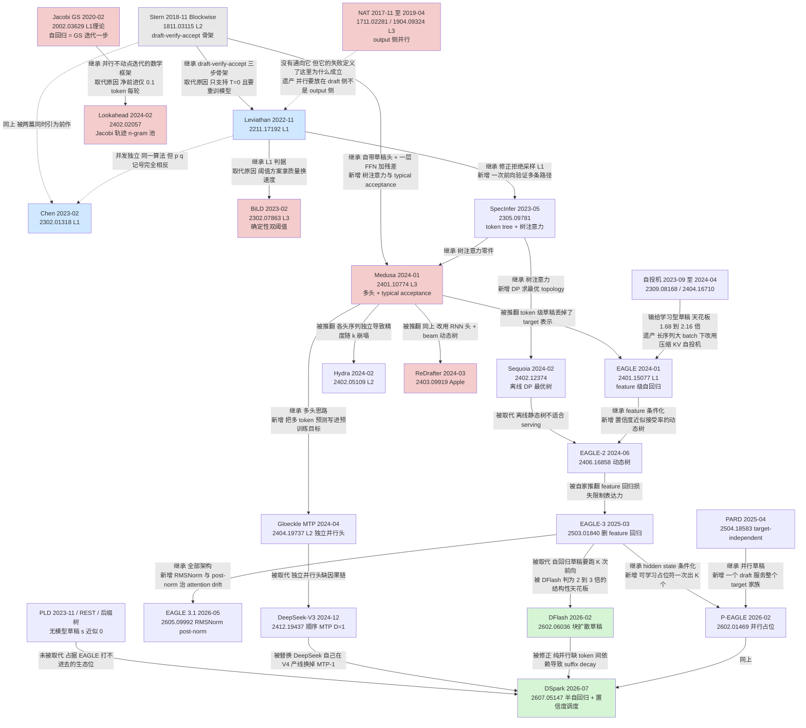

# 15 谱系图与被淘汰的分支

## 1. 一句话

第 08–14 篇每篇讲一条分支，这一篇把它们连成**一张图**和**一份死亡名单**：
2018 到 2026-08 这十年里，谁从谁那里继承了什么零件、谁把谁取代掉、哪几条路是**结构性地**走死的（不是"效果不好"），
以及一条贯穿全篇的尺子 —— **每一代到底是在提高 $E[\tau]/(\gamma+1)$（真收益），还是只在把 memory-bound 区做大（有天花板）。**

---

## 2. 前一代卡在哪：七篇分头讲完之后，还缺两样东西

本库的历史线到这里已经写了七篇：[[08-史前史-2018并行解码与非自回归的失败]]、
[[09-2023奠基-两篇同期论文的异同]]、[[10-自投机-跳层早退与Draft-and-Verify]]、
[[11-无模型草稿-promptlookup与ngram与检索]]、[[12-Medusa-多头草稿与树注意力的诞生]]、
[[13-EAGLE三代-特征级自回归的演进]]、[[14-MTP-从训练目标到推理草稿]]。

**每一篇都把自己那一支讲透了，但七篇加起来仍然缺两样：**

1. **一张能一眼看清"谁继承谁、谁取代谁"的总图。** 分开看，每一支都像是在独立演进；连起来看才会发现
   Medusa 的祖先是 Stern 2018（论文自己写了 "Following the approach of Stern et al. 2018"），
   Lookahead 的祖先是 Song 等 2020 的 Jacobi 迭代，
   而 2026 年 DSpark 的"按 survival probability 分配验证预算"其实是 2023-12 Cascade Speculative Drafting
   那条 Horizontal Cascade 的思路隔三年回魂。**分支之间的血缘关系比分支内部的代际关系更有信息量。**

2. **一份写清死因的死亡名单。** 单篇里写"某方法被超越了"是容易的；难的是把死因写成**结构性的**：
   不是"它慢"，而是"它慢的原因写在它的模型族假设里/写在 KV cache 的语义里/写在它必须付的 FLOPs 账里"，
   因此**加算力、加数据、换硬件都不解决**。这份名单的价值不在于纪念，在于**给判据**：
   一个新方法如果踩中了名单上任何一条的结构性死因，它大概率也会死。

第三件事是本篇自加的：**给每条分支一个统一的定性标签**，否则"这一支活着/死了"永远是感觉而不是判断。
标签用第 25 篇（[[25-未来判断-哪些方向会活下来]]）的三条轴，见下一节。

---

## 3. 机制拆解：先立尺子，再画图

### 3.1 定性判据：三条轴（沿用第 25 篇，用在整条历史线上）

投机采样的定义性交易是：**付出 $\gamma+1$ 份验证算力加上草稿开销 $s$，换回期望 $E[\tau]$ 个 token，且保证 L1 分布无损。**
在深 compute-bound 区（验证不再免费），加速比的极限是

$$
\text{speedup}_{\text{compute-bound}} \longrightarrow \frac{E[\tau]}{\gamma+1}\,(1-s) \;<\; 1 .
$$

**符号约定（本篇统一）**：$\gamma$ = 一次投机提出的草稿 token 数；$\gamma+1$ = 验证前向里的 query token 数
（链式草稿就是 $\gamma+1$；**树形草稿是"树节点数 + 1"**，因为树上每个节点都要占一个 query 位置）；
$E[\tau]$ = 每轮期望产出的 token 数（含 bonus token）；$s$ = 草稿侧算力占目标模型一次前向的比例。
$E[\tau]\le \gamma+1$ 恒成立，所以这条渐近线**恒小于 1**。完整推导见 [[06-期望接受长度与加速比模型-完整推导]] 与 [[18-batch与吞吐-收益衰减曲线]]。

于是每条分支只能落进三格：

| 轴 | 它改的是什么 | 效果 | 天花板 |
|---|---|---|---|
| **【A】** | 提高 $E[\tau]/(\gamma+1)$，或压低 $s$ | **真的抬高渐近线**，各负载区间通吃 | 渐近线恒 $<1$，最好只能"在深 compute 区打平" |
| **【B】** | 扩大"验证仍近乎免费"的负载区间 | **渐近线一点没动**，只是把悬崖往右推 | 悬崖仍在；显存、无损性会先撞上 |
| **【C】** | 不做这笔交易了 | 框架不适用 | 代价是放弃 L1 |

**这条尺子对本篇的用处**：它能解释一件反直觉的事 —— **一条分支可以在自己的论文里赢，在谱系上却死**。
因为论文报的几乎全是 $\text{batch}=1$ 的 latency（RS-1 的核对结论：Stern、Leviathan、Chen、Medusa、
EAGLE 1/2/3、Hydra、Lookahead、CLLM、REST、PLD、HASS、GliDe、Falcon 全部是 bs=1），
而 bs=1 恰好是"验证免费"最成立的那一点，此时 $E[\tau]/(\gamma+1)$ 完全不进入结果。
**轴 A 与轴 B 的区别在 bs=1 上是看不见的。**

### 3.2 时间线图（arXiv v1 年月；每个节点标它属于哪一支）

支的代号：**史前**／**奠基**／**树**（结构化草稿）／**自投机**／**无模型**／**多头**／**EAGLE**／**MTP**／**长上下文**／**并行草稿**／**验证调度**／**反驳**（基准与证伪工作）。

```mermaid
timeline
    title 投机采样十年谱系 2017-11 到 2026-08 按 arXiv v1 排
    section 2017-2021 史前史
        2017-11 : NAT 1711.02281 Gu HKU 史前 L3
        2018-11 : Blockwise Parallel Decoding 1811.03115 Stern Berkeley 史前 L2
        2019-04 : Mask-Predict 1904.09324 Ghazvininejad FAIR 史前 L3
        2020-02 : Jacobi Gauss-Seidel 2002.03629 Song Stanford 史前 L1理论
        2022-05 : Not as Fast as it Seems 2205.01966 Helcl 反驳 判 NAT 死刑
    section 2022-2023 奠基与结构化
        2022-11 : Speculative Decoding 2211.17192 Leviathan Google 奠基 L1
        2023-02 : Speculative Sampling 2302.01318 Chen DeepMind 奠基 L1
        2023-02 : BiLD 2302.07863 Kim Berkeley 奠基分叉 L3
        2023-05 : SpecInfer 2305.09781 Miao CMU 树
        2023-05 : Parallel Jacobi 2305.10427 Santilli Sapienza 史前 L2
        2023-08 : Staged Spec Decoding 2308.04623 Spector Stanford 树
        2023-09 : Draft and Verify 2309.08168 Zhang 浙大 自投机 L1
        2023-10 : SpecTr 2310.15141 Sun Google 树 最优传输
        2023-11 : Prompt Lookup Saxena GitHub 无模型 L2
        2023-11 : REST 2311.08252 He 北大 无模型 L1
        2023-12 : Cascade Spec Drafting 2312.11462 Chen UIUC 树
    section 2024 上半年 多头与 EAGLE
        2024-01 : Medusa 2401.10774 Cai Princeton 多头 L3
        2024-01 : EAGLE 2401.15077 Li 北大 EAGLE L1
        2024-02 : Hydra 2402.05109 Ankner MIT 多头 L2
        2024-02 : Lookahead Decoding 2402.02057 Fu UCSD 无模型 L1
        2024-02 : Sequoia 2402.12374 Chen CMU 树
        2024-02 : Decoding Spec Decoding 2402.01528 Yan UW-Madison 反驳
        2024-02 : CLLM 2403.00835 Kou SJTU 反驳 Jacobi 净前进 0.1
        2024-03 : ReDrafter 2403.09919 Cheng Apple 多头 L1
        2024-03 : Block Verification 2403.10444 Sun Google 反驳 逐token次优
        2024-04 : MTP 2404.19737 Gloeckle Meta FAIR MTP L2
        2024-04 : LayerSkip 2404.16710 Elhoushi Meta 自投机 L1
        2024-04 : TriForce 2404.11912 Sun CMU 长上下文 L1
        2024-04 : Kangaroo 2404.18911 Liu 华为诺亚 自投机 L1
    section 2024 下半年到 2025
        2024-06 : EAGLE-2 2406.16858 Li 北大 EAGLE 动态树
        2024-06 : SmartSpec(v3改名TurboSpec) 2406.14066 Liu Berkeley 验证调度 Goodput
        2024-08 : HASS 2408.15766 Zhang 小红书 EAGLE 训练对齐
        2024-08 : MagicDec 2408.11049 Sadhukhan CMU 长上下文 推翻大batch无用
        2024-11 : SuffixDecoding 2411.04975 Oliaro CMU Snowflake 无模型
        2024-11 : SAM-Decoding 2411.10666 Hu 人大 无模型
        2024-12 : DeepSeek-V3 2412.19437 DeepSeek-AI MTP 生产化
        2025-03 : EAGLE-3 2503.01840 Li 北大 EAGLE 自我推翻
        2025-04 : PARD 2504.18583 An AMD 并行草稿 target-independent
        2025-08 : Llama at Scale 2508.08192 Meta GenAI 并行草稿 生产规模
        2025-10 : OWL 2510.07535 Lee Snowflake 长上下文 EAGLE3 变 0.81x
        2025-10 : Batch SD Done Right 2510.22876 Zhang eBay 反驳 批处理正确性
    section 2026 并行草稿与验证调度
        2026-02 : DFlash 2602.06036 Chen UCSD 并行草稿 块扩散
        2026-02 : P-EAGLE 2602.01469 Hui 机构未查证 并行草稿
        2026-04 : DDTree 2604.12989 Ringel 并行草稿 加树
        2026-05 : Attention Drift 2605.09992 Eldenk EAGLE 3.1 后端论文
        2026-05 : PARD-2 2605.08632 An AMD 并行草稿
        2026-05 : Domino 2605.29707 Huang 并行草稿 因果修正
        2026-06 : CaDDTree 2606.01813 反驳 只优化接受长度是错的
        2026-06 : Bebop 2606.12370 Qwen 团队 MTP RL 下接受率退化
        2026-07 : DSpark 2607.05147 Cheng 北大 DeepSeek 验证调度 半自回归
        2026-07 : Windowed-MTP 2607.21535 反驳 原生MTP在百万上下文净负
        2026-08 : vLLM Adaptive Verification 官方 blog 验证调度 落地
```



> ⚠️ **读这张图的两条纪律**：① **横轴是 arXiv v1，不是发表年**，也不是社区开始用它的时间
> —— EAGLE 仓库的 news log 记 `2023.12.8 EAGLE v1.0 released`，比论文 v1（2024-01-26）早一个半月；
> Together.ai 的 Medusa 博客发于 2023-09-11，比 arXiv v1（2024-01-19）早四个月。
> ② **同一格里的节点不构成先后关系**，2024-01 那一格里 Medusa（01-19）与 EAGLE（01-26）只差 7 天，
> 是同时长出来的两条路，不是先后取代。

### 3.3 机制继承谱系图（边上标"继承了什么"或"因为什么被取代"）



> 粉红 = 本篇死亡名单上的节点；蓝 = 奠基；绿 = 2026-08 在三大引擎主干里的形态。
> 实线 = 继承（边上写继承了什么），虚线 = 取代 / 并发关系（边上写取代原因）。
> NAT 那条虚线是唯一的例外：它读作"这条路没有通向 Leviathan，但它的失败定义了 Leviathan 为什么成立"。

---

## 4. 逐步走查：十八代「前一代卡在哪 → 这一代怎么绕过 → 代价是什么」

这张表是本篇的骨架（在 RS-1 §13 的十五行基础上核对后增补了自投机、无模型草稿、PARD 三行，并新增「代价」列）。
**"代价"这一列是本库铁律三的落地**：没有一行是纯赚的。

| 时间 | 工作 | 前一代卡在哪 | 这一代的机制 | 代价是什么 | 轴 |
|---|---|---|---|---|---|
| **2018-11** | Stern Blockwise，1811.03115 | 自回归每次前向只出 1 个 token，GPU 严重欠载 | $k$ 个辅助头并行提议 + 原模型一次前向验证最长匹配前缀；合并 verify 与 predict 把每步 2 次前向降到 1 次 | 要改模型加头并**重训**；判据是 argmax 相等只能给 **L2**；总运算量随预测数二次增长，$k{=}10$ 时 wall-clock **回落**（Table 4：3.31×@$k{=}8$ → 3.04×@$k{=}10$，bs=1，newstest2014，推理硬件原文未给出） | A |
| **2022-11 / 2023-02** | Leviathan 2211.17192 / Chen 2302.01318 | Stern **只支持 greedy**、**要改并重训模型**、**只保下游指标不保输出** | **修正拒绝采样**：接受概率 $\min(1,p/q)$，拒绝时从 $\mathrm{norm}(\max(0,p-q))$ 重采 → 任意温度/top-k/nucleus 都成立，且输出是 target 分布的精确样本；draft 用**现成**小模型，target **零改动** | Leviathan **Theorem 3.11** 自己写明总运算量**增加**；要维护第二个词表对齐的模型；Chen §8：$K$ 增大**延迟方差**上升，对 P90/P99 SLO 不利 | A |
| **2023-05 / 2023-08** | SpecInfer 2305.09781 / Staged 2308.04623 | 草稿是**一条链**，第 $i$ 个被拒则后面全废，期望产出被 $\frac{1-\alpha^{\gamma+1}}{1-\alpha}$ 卡死 | 把草稿变成**树**，topology-aware causal mask 让一次 target 前向验证多条路径，且不扩 batch 维 | **分母从 $\gamma+1$ 涨到"树节点数 $+1$"** —— 这是全谱系最贵的一次代价，见 §5 | A（小预算）/ 反 A（大树） |
| **2023-09 / 2024-04** | Draft & Verify 2309.08168 / LayerSkip 2404.16710 | 独立 draft model 要额外训练、额外显存、词表要对齐 | 草稿由**跳过自身中间层**或**只跑前 $E$ 层**产生；LayerSkip 让 draft 与 verify **共享前 $E$ 层的 KV 与计算** | draft 与 verify **共享参数**，没法靠"把 draft 做更小"压 $s$，天花板卡在 1.68–2.16×（口径见 §9）；LayerSkip 还要**改训练配方** | A（弱） |
| **2023-11** | PLD（Saxena, GitHub, 无论文）/ REST 2311.08252 | 任何模型草稿都要付 $s$，且每换 target 就重训 | 草稿直接从 prompt 或外部 datastore 里**抄**：n-gram 匹配 / 后缀数组检索 + Trie 验证。**$s\approx 0$、零训练、与 target 完全解耦** | $\alpha$ 完全由负载决定：**prompt 与输出重叠低时收益归零**（PLD 作者自陈 roleplay 基本无增益） | A（极端形态） |
| **2024-01** | Medusa 2401.10774 | 独立 draft model 要单独部署/训练/对齐词表，$s$ 压不下去 | 回到 Stern 的自带草稿头，加 **tree attention** 与 **typical acceptance**；Medusa-1 **冻结 backbone** | 各头**序列独立**导致精度随 $k$ 崩塌；默认判据是 **L3**；最好的 2.83× 要 Medusa-2 **联合微调 backbone**且有质量掉分 | A（但赔了 $E[\tau]$） |
| **2024-02** | Hydra 2402.05109 | Medusa 的 head 彼此序列独立，第 $i$ 个 head 看不见第 $1..i{-}1$ 个草稿 token | Hydra head **条件于前面已提议的 token** | 序列依赖意味着 head **不能一次前向出全部**；且 Hydra++ 训 10 epoch 而基线训 1 epoch，**训练预算不对等是未控制的混淆变量** | A |
| **2024-01** | EAGLE 2401.15077 | Medusa/Hydra 在 **token 层面**做草稿，丢掉 target 已算好的表示；feature 级自回归有采样歧义 | ① 在 **feature（LM head 之前的 hidden state）层面**自回归；② 把**提前一步的 token 序列**喂进去消歧。消融 1.5×→1.9×→**2.8×**（Vicuna-7B / MT-bench / $T{=}0$ / bs=1 / RTX 3090） | 每换一个 target 就要**重训一个 head**；草稿树是**静态**的 | A |
| **2024-06** | EAGLE-2 2406.16858 | EAGLE-1 的静态树隐含"接受率只依赖位置" | 发现 **draft confidence 与接受率强正相关**（<0.05→0.04；>0.95→0.98），据此做 expand + rerank 的 per-request 动态树，**且免训练** | 树预算 48–60 个节点把分母撑到 50+，**深 compute 区渐近线掉到 0.095**（§5）；论文**硬件与 batch size 全文未给出** | A / 反 A |
| **2024-08** | HASS 2408.15766 | EAGLE 训练时永远吃真 feature，推理时从第 2 步起吃自己的输出 → exposure bias；全词表蒸馏与解码目标不一致 | ① 多步训练人为制造推理期才有的不准确 feature；② 只在 target **Top-10** 上算 CE。**零推理开销** | 多步训练**本身**让收敛变难（CORAL 2502.16880 的诊断）；论文只写单数 "H800"，70B 的 GPU 数**未查证** | A |
| **2025-03** | EAGLE-3 2503.01840 | ⭐ **EAGLE 自己的 feature prediction loss 成了瓶颈**：它是额外约束，限制表达力，加数据不涨 | **删掉 feature 回归损失**只做 token 预测；输入改成 low/mid/high **三层融合**；用 **training-time test** 补回多步能力 | 头条 6.5× 里含 **8× 训练数据**，不能全归因给架构；训练要存约 12 TB hidden state；仍有 attention drift | A |
| **2024-04 / 2024-12** | Gloeckle MTP 2404.19737 / DeepSeek-V3 2412.19437 | 所有草稿头都是**事后加装**在只训过 next-token 的 backbone 上 | 把多 token 预测写进**预训练目标**；推理时草稿头是顺手的副产品（DeepSeek-V3 逐字："we can also **repurpose** these MTP modules"） | 必须在预训练/持续预训练阶段介入，**不能给已有 checkpoint 补**；$D{=}1$ 时 $\gamma+1{=}2$，**绝对天花板约 2×** | A |
| **2024-04 / 2024-08** | TriForce 2404.11912 / MagicDec 2408.11049 | 长上下文下瓶颈从**权重加载**转到 **KV cache 加载**，前面所有成本模型失效 | TriForce：分层投机（稀疏 KV 的中间 draft + 更小模型的一级 draft）。MagicDec：论证 KV 瓶颈随 batch 线性增长 → memory-bound **持续存在** → **speedup 随 batch 增大而增大** | **纯轴 B**：渐近线一点没动，只是把悬崖推到长序列去；短序列大 batch 仍是负收益（MagicDec 自报 0.94–1.00×，8×A100，1024 tokens，batch 32–128）；显存会先撞上 | B |
| **2025-10** | OWL 2510.07535 | EAGLE-3 这类 transformer drafter 吃**全部输入 token**，训练窗口 2K，长上下文分布漂移 → **0.81× 负收益**，且多训长序列也救不回（EAGLE3-L 仍只有 3.23 AL） | **LSTM drafter 只吃最后一个 token 的 hidden state** → 架构上与 context length 无关，训练序列 256 就泛化到 64K；加 `[SPEC]` token；tree/non-tree 混合 | 放弃了长程条件化，短上下文上不占优；论文**声称 L1 但未给任何分布等价的实证**（无 KL/χ²/greedy 一致性测试） | B |
| **2025-04 / 2026-05** | PARD 2504.18583 / PARD-2 2605.08632 | EAGLE 系**每个 target 都要单独训一个 head**，适配成本高 | **target-independent 并行草稿**：一个 draft model 服务整个 target 家族；PARD-2 把训练目标从"token 准确率"改成"整体接受长度" | 放弃了"条件化在 target hidden state 上"这条最有效的 $E[\tau]$ 来源；**全部实验口径我未从正文提取，标未查证** | A |
| **2026-02** | P-EAGLE 2602.01469 / DFlash 2602.06036 | ⭐ **自回归草稿的结构性天花板**：出 $K$ 个草稿要跑 $K$ 次 drafter 前向，DFlash 判为 "caps at approximately 2−3×" | **一次 forward 出整块**：P-EAGLE 用可学习的 mask token + 共享 hidden state 占位；DFlash 用块扩散 + 双向 attention + **KV 级特征注入** | 位置间**无依赖**导致 suffix decay（DSpark 的诊断）；P-EAGLE 训练开销随 seq-len × K **二次增长**，N=8192、K=8 时单条样本 65,536 个位置 | A |
| **2026-07 / 2026-08** | DSpark 2607.05147 / vLLM Adaptive Verification | 纯并行草稿缺依赖；且**固定验证长度**在高并发下把算力浪费在高拒绝风险的位置上 | ① **半自回归**（并行 backbone + 轻量序列模块）补回依赖；② **confidence-scheduled 全局 top-B 预算分配**，slot **跨请求竞争** | **唯一一条直接改分母的**，但工程约束硬：需 `AttentionCGSupport.ALWAYS`，**不兼容 `--enforce-eager` / LoRA / pipeline parallelism**，启用时拒绝输出 logprobs | A（改分母） |

> **读完这张表最该记住的一句**：**十八行里没有一行的代价是零，而且代价的形态在变** ——
> 2018–2024 的代价主要是"要训练/要改模型"，2024 之后的代价主要是"分母膨胀"与"工程约束"。
> **谱系的重心从"怎么把 $E[\tau]$ 做高"移到了"怎么不把 $\gamma+1$ 做大"。**

---

## 5. 小数字算例：把每一支放到同一把尺子上

前面所有分支的头条数字互不可比（硬件、batch、基线全不一样，见 §9）。
但 $E[\tau]/(\gamma+1)$ 这把尺子只要两个数就能算，而这两个数**大多数论文都给了**。

**约定**：$q$ = 验证前向里的 query token 数。链式草稿 $q=\gamma+1$；树形草稿 $q = N_{\text{树节点}}+1$。

| 分支代表 | $E[\tau]$ 来源与口径 | $q$ | $E[\tau]/q$ |
|---|---|---|---|
| Stern 2018 blockwise，$k{=}8$ | mean block size **1.76**（冻结基座 + exact greedy 配置；⚠️ 该配置的 wall-clock 论文**从未发布**） | 8 | **0.220** |
| Leviathan T5-XXL + T5-small | $\alpha{=}0.75$、$\gamma{=}7$（EnDe，$T{=}0$，bs=1，单 TPU-v4）代入 $E[\tau]=\frac{1-\alpha^{\gamma+1}}{1-\alpha}$ | 8 | **0.450** |
| Leviathan T5-XXL + T5-large | $\alpha{=}0.82$、$\gamma{=}7$，同上 | 8 | **0.552** |
| DeepSeek-V3 MTP，$D{=}1$ | 第二 token 接受率 85–90%，取 0.875 → $E[\tau]{=}1.875$（⚠️ 原文 batch/硬件/数据集**全部未给出**） | 2 | **0.938** |
| EAGLE-2 Vicuna-13B | $\tau{=}4.83$，树预算 **50** 节点（MT-bench，$T{=}0$；⚠️ 硬件与 batch 原文未给出） | 51 | **0.095** |
| EAGLE-3 链式 10-token | $\tau{=}3.49$（DFlash Table 5，SGLang + 单张 B200，LLaMA-3.1-8B，GSM8K） | 11 | **0.317** |
| **EAGLE-3 树 60-token** | $\tau{=}4.55$（同上，**全表最高的 $\tau$**） | 61 | **0.075** |
| DFlash 块 10-token | $\tau{=}4.32$（同上） | 11 | **0.393** |

**复跑**：`python -c "from accept import expected_tokens; print(expected_tokens(0.75,7)/8)"`（在 `_lab/` 下），
输出 `0.44994...`。全表的生成脚本见 §8。

### 5.1 这把尺子的判别力：它把 DFlash Table 5 的排名预测对了

DFlash Table 5（SGLang + 单张 **B200**，LLaMA-3.1-8B-Instruct，Spec-v1，GSM8K，
基线 TPS 从 c=1 的 249 涨到 c=32 的 5349）实测的 **c=32** 加速比
（⚠️ **这里的 $c$ 是 concurrency，即并发请求数 / batch 规模**，不是本库其它各篇里"草稿单步耗时比"的那个 $c$ —— 记号撞车，原文如此）：

| 方法 | 我算出的 $E[\tau]/q$ | 实测并发 c=1 | **实测并发 c=32** |
|---|---|---|---|
| EAGLE-3（60-token 树） | **0.075**（最低） | 1.9× | **0.6×**（最差） |
| EAGLE-3（10-token 链） | 0.317 | 1.6× | 1.0× |
| DFlash（10-token 块） | **0.393**（最高） | 2.4× | **1.6×**（最好） |

**三个方法的渐近线排序与 c=32 实测排序完全一致，而 $\tau$ 的排序恰好相反**
（$\tau$：4.55 > 4.32 > 3.49；加速比：DFlash > 链 > 树）。
**这就是"$\tau$ 高不等于快"的算术根源**：$\tau$ 只是分子，而树把分母（验证前向的 query token 数 $q$：61 vs 11）乘了 5.5 倍 —— 这三行加速比的口径是**并发 c=32、单张 B200、LLaMA-3.1-8B、GSM8K**，并发越高这笔分母账越致命。

> ⚠️ **诚实降级**：这只是**序**的一致，不是数值预测。渐近线 0.075 对应的实测值是 0.6× 而不是 0.075×，
> 因为 c=32 还远没到"验证完全 compute-bound"的极限。**这把尺子给的是排序与方向，不是预测值。**

### 5.2 两个反直觉的读数

**读数一：MTP 的渐近线是全表最高的 0.938，但它的绝对天花板也是全表最低的。**
$D{=}1$ 意味着 $\gamma+1=2$，即使 $\alpha\to 1$，一轮最多产出 2 个 token，加速上限约 2×。
**MTP 是"几乎不浪费算力，但也没多要多少"的那一档** —— 这与 [[14-MTP-从训练目标到推理草稿]] §5 的结论
（$\gamma=1$ 时天花板正好卡在 1.9 附近）是同一件事的两种算法。
它能成为标配靠的是 $s$ 极低（共享 embedding 与 output head）与**分发方式**，不是算术上的优越。

**读数二：Leviathan 2022 年那张表的渐近线（0.450 / 0.552）比 EAGLE-2 2024 年的（0.095）高得多。**
这不是说 2022 年比 2024 年强 —— 是说**它们在优化不同的东西**：
EAGLE-2 优化的是 bs=1 的 latency（此时 $q$ 涨到 51 几乎不要钱），Leviathan 用的是 $\gamma=7$ 的链。
**"树是进步"这个判断只在 memory-bound 区成立；在 compute-bound 区，同样的 $\tau$，树是纯亏。**
树的完整条件（要赢必须同时满足两条）见 [[16-树形草稿与树注意力-mask构造与验证]]。

---

## 6. 死亡名单

**判据**（写死，可复核）：一条分支判"死"，要同时满足 ①**结构性死因**（不是"效果不好"，而是死因写在它的假设/数学/成本模型里，加算力加数据不解决）与 ②**生产证据**（截至 **2026-08-22**，vLLM / SGLang / TensorRT-LLM 三家官方文档方法清单里已无它，或已被移入 legacy）。

### 6.1 ☠️ 非自回归生成（NAT / Mask-Predict）

- **它是什么**：一次前向并行吐出整个目标序列。Gu 等（**2017-11**，arXiv **1711.02281**，Jiatao Gu，HKU / Salesforce Research，ICLR 2018）、Ghazvininejad 等 Mask-Predict（**2019-04**，arXiv **1904.09324**，Marjan Ghazvininejad，FAIR Seattle，EMNLP-IJCNLP 2019）。**口径：L3**（训练全新模型，条件独立假设直接改变分布）。
- **死在什么时候**：**2022-05**，Helcl、Haddow、Birch，*Non-Autoregressive Machine Translation: It's Not as Fast as it Seems*，arXiv **2205.01966**，NAACL 2022。
- **死因（四条，全部结构性）**：
  1. **multimodality problem 是模型族的表达力缺陷**。Gu 等自己的定义逐字：条件独立分布"cannot allow 'Danke schön.' and 'Vielen Dank.' **without also licensing 'Danke Dank.' and 'Vielen schön.'**"。加算力不解决。
  2. **对 AR teacher 的 sequence-level KD 硬依赖 = 自我拆台**。要加速一个 LLM，得先有 AR LLM 当 teacher，再训一个更差的模型，质量天花板被 teacher 焊死。Mask-Predict 自陈："**CMLMs are heavily dependent on model distillation**"（Table 6，WMT14 EN-DE，$T{=}1$：Raw 10.64 vs Dist 18.05）。
  3. **L3 且必须训练新模型**，不是 drop-in 加速器。
  4. **⭐ 最硬的一条：速度优势只在 bs=1 成立。** Helcl 等 Table 5（A100）：优化过的自回归（Edinburgh base）batched GPU **140 秒**，比 NAR-Large（782s）快 **5.6×**、比 NAR-Micro（311s）快 **2.2×**，**且质量全面更好**（COMET 0.527 vs 0.149 / −0.008）。原文判词："there is currently **no compelling scenario that warrants the deployment of NAR models**."
- **遗产**：multimodality problem 的**定义**本身，以及从它推出的那条设计原则 —— **并行必须放在 draft 侧，不能放在 output 侧**。投机采样赢就赢在它保住了 target 的自回归分布。详见 [[08-史前史-2018并行解码与非自回归的失败]]。

### 6.2 ☠️ vanilla Jacobi 解码

- **它是什么**：把自回归递推写成三角非线性方程组，用 Jacobi 迭代并行求不动点。Song、Meng、Liao、Ermon（**2020-02**，arXiv **2002.03629**，Yang Song，Stanford，ICML 2021，**L1 理论**）；Santilli 等把它用于翻译（**2023-05**，arXiv **2305.10427**，Andrea Santilli，Sapienza University of Rome，ACL 2023，**L2**）。
- **死在什么时候**：**2023-05 就已经写在自己的表里**（Santilli Table 1：纯 Jacobi 在 CPU 上 0.73–0.75×、GPU 上 0.88×，**全线减速**；口径 **batch size = 1**、基线**带 KV cache**、翻译 en↔de、度量 latency，见 [[08-史前史-2018并行解码与非自回归的失败]] §4.5），**2024-02** 由 CLLM（arXiv **2403.00835**，Siqi Kou / Lanxiang Hu，ICML 2024）量化钉死。
- **死因（两条结构性）**：
  1. **净前进约 0.1 token/iteration**。CLLM Table 3：原 fine-tuned 模型在 Spider / Code-Search-Net / GSM8K / ShareGPT 上 fast-forward token count **全部 = 1.1**，而表注明示这 1.1 里的 1.0 是"不用 Jacobi 也白拿的"。机理：attention 下**前缀一错则后续必错**。
  2. **与 KV cache 结构性冲突**。Song 等 2020 §5.3.2 自己就预言了："**parallel Jacobi updates cannot leverage these caches**… one parallel update can be slower than one sequential update"，并在 CIFAR-10 上当场应验（纯 Jacobi 26.16s vs 带 cache 的顺序基线 17.76s）。**LLM 的 KV cache 正是同一机制。**
- **遗产**：**"标准自回归解码 = Gauss-Seidel 迭代一步"这个数学框架活了下来**，给整个并行解码方向提供了统一语言；Lookahead Decoding 用它的**轨迹**攒 n-gram 池。**但 Jacobi 迭代本身作为加速手段已死。**

### 6.3 ☠️ Lookahead Decoding

- **它是什么**：不需要任何 draft model，用 Jacobi 迭代的历史轨迹攒 n-gram 池，每步同时做 lookahead branch 与 verification branch。Yichao Fu（**2024-02**，arXiv **2402.02057**，UC San Diego，与 Hao Zhang 同组；合作者 Ion Stoica，UC Berkeley；ICML 2024；博客更早：lmsys.org，2023-11-21）。**口径：L1 / L2**（verification branch 保分布）。
- **死在什么时候**：**2025 年前后**。Spec-Bench（唯一的同硬件横向基准，条件 **bs=1 / greedy / FP16 / 3 次取均值 / 同设备**）上是**全榜最弱**：A100+Vicuna-13B **1.30×**、RTX 3090+Vicuna-7B **1.13×**、A100+Vicuna-7B **1.34×**、A100+Vicuna-33B **1.25×**。EAGLE-3 论文 Table 1（Vicuna-13B，$T{=}0$，bs=1）也给出均值 **1.62× / τ 1.67**，是那张表的最低值。
- **死因（结构性）**：**没有学习出来的草稿 → 接受率天然低；同时 Jacobi 分支的 FLOPs 要照付。** 用 §3.1 的语言：它同时把 $E[\tau]$ 压低（无学习草稿）和把 $s$ 抬高（Jacobi 分支的额外前向），**两条轴一起做反**，这不是调参能救的。
- **生产证据**：TensorRT-LLM 已把 Lookahead decoding **移入 legacy 文档**；vLLM 与 SGLang 的方法清单里都没有它。
- **遗产**：① "从生成历史里攒候选"这个思路被后缀树/后缀自动机一代接走（SuffixDecoding、SAM-Decoding），做法从 Jacobi 轨迹换成了 O(1) 均摊的后缀索引；② Spec-Bench 榜单注释承认的那条价值：*"PLD, Lookahead, and Recycling are **plug-and-play** methods that require minimal extra parameters"*。
- **⚠️ 同名陷阱**：vLLM 文档里的 "**Lookahead Scheduling**" 是**完全不同的东西**（KV 块预留调度），不要当成 Lookahead Decoding 还活着的证据。

### 6.4 ☠️ 纯 Medusa 式多头（各头独立预测）

- **它是什么**：在 target 最后一层 hidden state 上挂 $K$ 个"一层 FFN + 残差"的头，**第 $i$ 个头不条件于第 $1..i{-}1$ 个草稿 token**。Tianle Cai（**2024-01**，arXiv **2401.10774**，Princeton University / Together AI；合作者含 Tri Dao、Jason D. Lee；ICML 2024）。**口径：L3**（默认 typical acceptance）/ **L2**（$T{=}0$ 特例）。
- **死在什么时候**：**分两步**。① **2024-02** 结构上被 Hydra（arXiv **2402.05109**，Zachary Ankner，MIT · MosaicML，COLM 2024）点名并证伪；② **2026-07** 被 DSpark（arXiv **2607.05147**，Xin Cheng 等 33 人，Peking University + DeepSeek-AI）的**位置级接受率曲线**给出更强证据。
- **死因（结构性，三条）**：
  1. **位置间无条件化 → 边缘对、联合错。** Hydra 逐字："there is **no sequential dependence between draft heads**… this **sequential independence limits the prediction accuracy**." EAGLE-1 §2 实测 Medusa draft accuracy ≈ **0.6** vs EAGLE ≈ **0.8**。
  2. **$E[\tau]$ 只认联合，而联合是连乘。** DSpark Figure 2：并行 drafter 在**位置 1** 上反而更强（0.88 Math vs 自回归 0.81 Math），但位置 2–7 **快速衰减**（Chat 上 0.72 → 0.63）。位置 1 的领先是一阶的，后面的塌方是连乘的，**所以位置 1 赢救不了它**。⚠️ 这两行引的是**不同域**（Math / Chat），**0.88 与 0.63 不能相减**。
  3. **typical acceptance 不保分布**，被 EAGLE 两代直接拿来当排除理由。EAGLE-1 Figure 2 caption 逐字："the non-greedy generation of Medusa **does not guarantee lossless performance**. Therefore, EAGLE is not compared with these methods."；EAGLE-3 Table 1 caption 同样把它排除在 $T{=}1$ 之外。质量上也有独立否证 —— Hydra 论文的 LLM-as-a-judge 实验："**neither Medusa nor Hydra is able to achieve the same quality as random sampling from the base model for any of the posterior thresholds considered**"。
- **遗产（很重）**：**tree attention**（机制本体属于 SpecInfer，普及归 Medusa）、**"草稿头"这个形态**（EAGLE 三代、MTP、P-EAGLE、DFlash、DSpark 全是这个形态的变体）、以及**把有损程度做成显式旋钮**这个做法。
  详见 [[12-Medusa-多头草稿与树注意力的诞生]]。

### 6.5 ⚠️ 必须写准的三条：「被架空」不是「被移除」

这一节是本篇最容易被写错、也最该写对的地方。**"被架空"、"从未实现"、"被移除"是三件不同的事。**

**(a) vLLM 并没有移除 Medusa。** 直接核查 `main` 分支（**2026-08-22**）：

| 检查项 | 结果 |
|---|---|
| `vllm/model_executor/models/medusa.py` | **存在** |
| `vllm/v1/spec_decode/medusa.py` | **存在**（V1 引擎的 proposer） |
| `SpeculativeMethod` 枚举 | **仍含 `"medusa"`** |
| PR #17956 "[Model] vLLM v1 supports Medusa" | **2025-05-11 merged**（是**移植进 V1**，不是丢弃） |
| `[RFC]: Deprecating vLLM V0` (#18571) 的停用清单 | 含 encoder-decoder、draft model-based spec decode、Neuron、HPU… **完全未提 Medusa** |
| 检索 "Medusa deprecation / remove Medusa" | **无结果，该事件不存在** |
| `medusa.py` 近期提交 | 2026-06-14 (#32374)、2026-01-30、2026-01-24、2025-12-10 (#29723) —— **仍在维护** |
| 官方文档方法清单 | **Medusa 一次都不出现** |
| `vllm/model_executor/layers/typical_acceptance_sampler.py` | **404 —— 已随 V0 移除** |

真正的判决在实现里：`vllm/v1/spec_decode/medusa.py` 的 `propose()` 核心只有一行 ——
`draft_tokens = torch.stack([logit.argmax(dim=-1) for logit in logits], dim=1)`。
**每个 head 只取 top-1 拼成一条线性链：无 tree attention、无多候选、无 typical acceptance。**
副作用是它反而变成 **L1**，但接受率被压到论文下限之下。

> ✅ **准确表述**：vLLM 对 Medusa 是「**代码在、能跑、还在修，但已退出官方推荐清单，且实现是无树无 typical acceptance 的最弱形态**」。
> 写成"vLLM 删除/弃用了 Medusa"是**事实错误**。

**(b) SGLang 从未实现过 Medusa。** `SpeculativeAlgorithm` 枚举为
`DFLASH, DSPARK, EAGLE, EAGLE3, FROZEN_KV_MTP, STANDALONE, NGRAM, NONE` —— **无 MEDUSA**。
唯一痕迹是 issue **#859** "[Feature] plan to support medusa?"（2024-08-01 开，已被 stale bot 关闭），
v0.5.18 源码零命中。**"SGLang 移除了 Medusa"同样是事实错误 —— 它从来就没有过。**

**(c) TensorRT-LLM 是三家里最明确的"降级"**：Medusa 已被移入
`docs/source/legacy/advanced/speculative-decoding.md`，不在当前 features 文档中。**这是最硬的一条降级证据。**

### 6.6 ☠️ ReDrafter：有厂商资源也救不活的完整案例

- **它是什么**：RNN 草稿头条件于 LLM hidden state + 对 beam search 结果做**动态树注意力**消除重复前缀 + 知识蒸馏训练。Yunfei Cheng（**2024-03**，arXiv **2403.09919**，**Apple**）。**口径：L1**。
- **厂商投入的证据**：NVIDIA 专门发过集成 blog（*NVIDIA TensorRT-LLM Now Supports Recurrent Drafting*，**2024-12-18**），做了两项改造 —— inflight-batching 兼容、把 validation 与 drafting 搬进 TensorRT engine 内部。报 "up to **2.7×** throughput on **NVIDIA H100** with **TP8**"（⚠️ **batch size / 模型名 / 数据集 / acceptance rate 均未给出**；blog 自带 caveat：最适合 "low-traffic scenarios"）。
- **死在什么时候**：**2026 年的 TensorRT-LLM 已把 ReDrafter 降为 legacy 文档**；vLLM 与 SGLang 从未支持。
- **死因**：⚠️ **无官方声明，以下是推断** —— RNN 草稿头 + beam search + 动态树的组合，在 EAGLE-3 与并行草稿面前**既不更快也不更简单**；且 Apple 的主场（MLX / Apple Silicon）不是数据中心引擎的优化重点。
- **遗产**：**"对 beam 结果动态构树以消除重复前缀"**这个具体技巧；以及一个方法论教训 —— **厂商集成不是存活证据**。

### 6.7 ☠️ 三条"半死"的：机制活了，方案没活

| 分支 | 死掉的部分 | 活下来的部分 |
|---|---|---|
| **BiLD 的确定性双阈值**（Sehoon Kim，**2023-02**，arXiv **2302.07863**，UC Berkeley，NeurIPS 2023，**L3**；⚠️ v1 标题是 "Big Little **Transformer Decoder**"，"Speculative Decoding" 是至迟 v4 才改上去的） | 「确定性阈值优于随机拒绝采样」这一主张。**死因**：它的 2.12× 是**以约 1 个 BLEU/ROUGE 点为代价**换的（无损档只有 1.85×；NVIDIA T4，bs=1），而同期 L1 方法**不花质量**就能拿到更多。三大引擎**均未实现** | fallback / rollback 这两个动作本身，进了自适应停止那一支（[[17-动态草稿长度与自适应停止]]） |
| **SpecTr 的 multi-draft 算法**（Ziteng Sun，**2023-10**，arXiv **2310.15141**，Google Research，NeurIPS 2023，**L1**） | 具体算法**未被任何主流引擎实现**。**死因**：最优 transport plan 的运行时**关于候选数 $k$ 指数级**，实用版只能拿 $(1-1/e)$-最优 | **理论框架活成了标准语言** ——「投机解码 = 带 membership cost 的最优传输 / maximal coupling」 |
| **Sequoia 的离线 DP 静态最优树**（Zhuoming Chen，**2024-02**，arXiv **2402.12374**，CMU / Together AI，**L1**） | 离线求出的静态树。**死因**：serving 场景下负载每时每刻在变，**静态最优 = 处处次优**；被 EAGLE-2 的在线动态树取代（后者还**免训练**） | ⭐ **"硬件感知"这一维 2024–2025 被丢掉了，2026 年回来了** —— CAST（arXiv **2510.26577**，2025-10-30）明确批评 EAGLE-2/3 的树 *"neglect… crucial system variables such as **GPU devices and batch sizes**"*；vLLM 的 Adaptive Verification 本质就是 Sequoia 那个"硬件感知树优化器"的**在线版** |

### 6.8 ⚖️ 独立草稿模型：死而复生（这一条不能写成"死了"）

**取代阶段（2024–2025）的证据**：vLLM 文档逐字 *"Speculative decoding with draft models is **not supported in `vllm<=0.10.0`**"* ——
**V1 引擎在相当长一段时间里根本没有这条路**；V0 停用 RFC (#18571) 的停用清单里明确写着 "draft model-based spec decode"。
原因三条：每个 target 要配一个词表对齐的 draft；draft 自己的 KV cache 占显存（MagicDec 测得可达 target 的 **38~140%**）；
EAGLE draft head <1B 参数、68k 对话就能训好，$s$ 更低。

**回来阶段（2025–2026）的证据**：
- vLLM 已重新支持 `draft_model`，官方选型表标注 **"High gain @ low QPS / Medium gain @ high QPS"**；SGLang 有 `STANDALONE`；TensorRT-LLM 有 `DraftTarget`。
- **PARD / PARD-2（AMD，Zihao An，含 AMD CTO Emad Barsoum）给了它一个 EAGLE 系没有的结构性优势：target-independence** —— "a single draft model to be applied across an entire family of target models"。已被 vLLM 与 TensorRT-LLM 双双收编。
- 跨词表也解决了：vLLM 的 `use_heterogeneous_vocab: true`（⚠️ **仅 `method=draft_model`，且目前只支持 greedy draft sampling**）。

> **准确表述**：**真正被淘汰的是"随便找一个同族小模型当 draft"这种朴素做法**，不是独立 draft model 这个形态。
> 死因有据：*Decoding Speculative Decoding*（arXiv **2402.01528**，Minghao Yan，UW-Madison，NAACL 2025）证明
> **语言建模能力与投机解码表现不强相关，决定性的是 draft 的延迟**，因此 draft 必须是**为投机采样专门设计的浅而宽的模型**。
> Chen 等 2023 早在 Chinchilla 4B（$d_{model}$ 6144 / 48 heads / **仅 8 层**）上就给出了同一结论，理由是通信开销。

---

## 7. 什么被后来推翻（清单）

### 7.1 ⭐ EAGLE-3 推翻了 EAGLE-1 自己标题里的论点

EAGLE-1 的标题就是命题：*"Speculative Sampling **Requires Rethinking Feature Uncertainty**"* —— 主张应在 feature 层面自回归。
**同一批作者（Yuhui Li、Fangyun Wei、Chao Zhang、Hongyang Zhang），相隔 14 个月**，EAGLE-3 §3 逐字：

> "with token prediction as the ultimate goal, **feature prediction can be seen as an additional constraint, which limits the expressiveness of the draft model and makes it difficult to benefit from increased data**."

Figure 1 标题：*"enable an increasing scaling curve, **which was never observed in the previous works**."*

> ⚠️ **必须精确化**：推翻的是**输出端拟合 feature 的约束（$l_{fea}$ 损失）**，**不是 feature 输入**。
> EAGLE-3 §3.2 逐字：*"the input to EAGLE-3 is **completely free**, and it is replaced by a **fusion of features from different layers**"*
> —— **输出端解绑，输入端反而更重了。写成"EAGLE-3 不再用 feature"是事实错误。**

### 7.2 ⭐ Leviathan 本人后来合作证明：逐 token 验证是次优的

*Block Verification Accelerates Speculative Decoding*，arXiv **2403.10444**，v1 **2024-03-15**，
Ziteng Sun、Uri Mendlovic、**Yaniv Leviathan**、Asaf Aharoni、Jae Hun Ro、Ahmad Beirami、Ananda Theertha Suresh。摘要逐字：

> "In prior works, draft verification is performed **independently token-by-token**. **Surprisingly, we show that this approach is not optimal.** … **We prove that the proposed mechanism is optimal in the expected number of tokens produced each iteration** and specifically is **never worse** than the standard token-level verification. Empirically… **5%-8%**… **maintains the strong lossless guarantee**."

这精确回答了"两篇奠基论文的定理有没有被修正"：**接受规则本身没错（L1 成立），但在"每轮期望产出"这个目标上，逐 token 的贪心验证是次优的。**
它同时补上了 [[09-2023奠基-两篇同期论文的异同]] 指出的缺口 —— 两篇的正确性证明**都是单 token 的**，序列/块层面的最优性是一个独立问题。
树解码版本的同一批评：*Traversal Verification for Speculative Tree Decoding*，arXiv **2505.12398**（NeurIPS 2025 poster）。

### 7.3 ⭐ 「高 $\tau$ = 更快」—— 至少被四次独立证伪

| 证据 | 内容（含口径） |
|---|---|
| **DFlash Table 5**（最硬） | 60-token 的 EAGLE-3 树 **$\tau$ 最高（GSM8K 4.55 / HumanEval 4.65 / Alpaca 4.07）**，却在 **c=32** 只有 **0.5–0.6×**（全表最差）。口径：SGLang + 单张 **B200**，LLaMA-3.1-8B-Instruct，Spec-v1，基线 TPS 249→5349 |
| **Falcon**（arXiv **2412.12639**，Bestpay 翼支付；⚠️ 与 TII 的 Falcon LLM 无关） | Vicuna-7B / MT-Bench 上 **$\tau$ 3.34 < EAGLE 3.94，但更快（3.10× vs 2.82×）** —— semi-autoregressive drafting 砍掉的是 **drafter forward 次数** |
| **CORAL**（arXiv **2502.16880**，Lenovo Research AI Lab，ACL 2025 main） | LM head router 让 **$\tau$ 从 4.90 降到 4.63，speedup 反而从 2.68× 升到 2.87×**。⚠️ 硬件 A6000，与 HASS 的 H800 不可比 |
| **EAGLE 3.1**（vLLM PR **#42764**） | 新实现 mean acceptance length **2.346 < 旧实现 2.359**（6590 vs 7431 drafts），但整体是升级。⚠️ 该测试的模型/硬件/数据集 PR 未给出 |
| **Leviathan Table 2**（最早的一次） | T5-large **$\alpha$ 最高（0.82）却最慢（1.7×）**，T5-small $\alpha{=}0.75$ 却 **3.4×**。口径：T5-XXL target，EnDe，$T{=}0$，$\gamma{=}7$，bs=1，单 TPU-v4 |

> **中介变量是 drafter 每步成本与验证算力占用。任何把 $\tau$ / $\alpha$ 当作 speedup 唯一代理的论述都是错的。**
> 算术根源就是 §5：$\tau$ 只是分子。

### 7.4 ⭐ 「草稿越强越好」—— 被 350+ 组实验证伪

*Decoding Speculative Decoding*，arXiv **2402.01528**，v1 **2024-02-02**（v4 2025-02-05，NAACL 2025），
Minghao Yan、Saurabh Agarwal、Shivaram Venkataraman（UW-Madison，⚠️ 机构推断）。**350+ 组实验，LLaMA-65B 与 OPT-66B。** 摘要逐字：

> "the performance of speculative decoding depends heavily on the **latency of the draft model**, and **the draft model's capability in language modeling does not correlate strongly with its performance in speculative decoding**"

反直觉结论：**浅而宽 > 深而窄**。NoFT-Wide-796M（5 层 / 32 heads / hidden 4096）吞吐超过 Sheared-LLaMA-1.3B（24 层 / 16 heads）——
层数砍半、宽度加大 → 接受率基本不变、latency 降 49%。口径：target = LLaMA，**4× A100 80GB，batch size 1，greedy**，MMLU / HellaSwag / Chatbot Arena。
⚠️ 具体层数/head 数来自摘要器，**建议复核原文**。

### 7.5 其余四条（各一句，附口径）

| 当年主张 | 出处 | 推翻证据 |
|---|---|---|
| Medusa「2.3–3.6× 加速」 | arXiv abs 页摘要字段 | **论文自相矛盾**：v3 正文渲染的摘要写 "2.3–2.8×"，**Table 1 最大值仅 2.83×**（3.6× 无表格支撑；最接近的是 Vicuna-7B "Extraction" 单类目 3.62×）。且 Spec-Bench 统一条件下缩水到 **1.44–1.80×**。🔴 Medusa 原文**未给出评测 GPU**（Appendix G 的 roofline 剖析提到 A100-80GB-PCIe / A40 / A6000，但没说 Table 1 用的是哪张）；**batch 只有正文一句 "Our experiments primarily focus on scenarios with a batch size of one"，未逐表标注**（2026-08-22 更正：本行初稿写"未给出评测 batch size"，与第 12 篇 §2.3 逐字核到的这句冲突，按论文原文改成现在的表述） |
| EAGLE-3「通用 SOTA」 | 2503.01840 | **OWL（arXiv 2510.07535）实测长上下文下 EAGLE3 = 0.81×（负收益）**，被 Suffix Decoding(2.18×) / SAMD(2.16×) / PLD(1.59×) 全面击败。口径：Llama-3.3-70B-Instruct，**8×H200，bs=1，fp16**，LongSpecBench 输入 4K–64K。⚠️ 同篇 Table 5 还有**论文内部矛盾**：正文说 RTX3090，caption 写 A100 |
| 「原生 MTP head 最省」 | — | **Windowed-MTP（arXiv 2607.21535，2026-07-23）**：内置 MTP draft head 每个 draft step 都对**整个 KV cache 做 full attention**，读取量随上下文线性增长 → 百万 token 上下文下 *"a deep native draft can turn net-negative, slower than no speculation"*。⚠️ 具体倍数未查证 |
| 「投机采样只在 bs=1 有用」 | vLLM blog 2024-10-17 实测高 QPS 下 **1.4× / 1.8× slowdown**（Llama3-70B，4×H100，ShareGPT / CNN-DailyMail） | **被双向修正**：Gloeckle MTP Table S2 注逐字 "constant across batch sizes"（⚠️ 条件：7B、**greedy blockwise、无树**、batch 上限 **42**）；MagicDec 证明长序列下 speedup **随 batch 增大而增大**；DFlash(10) 在 c=32 仍有 1.6×。**准确表述是"大树在高并发无用"，不是"投机采样在高并发无用"** |

> ⚠️ **两家引擎至今立场分歧，这本身是一条可写进知识库的事实**：TensorRT-LLM 官方文档**仍写**
> *"Speculative decoding is a technique for accelerating LLM inference **at low batch sizes**"* 与
> *"There is currently **no way to dynamically disable speculation**"*；而 vLLM 已上线 dynamic K 与 adaptive verification。
> 引擎侧的完整对照见 [[20-主流引擎实现-vLLM与SGLang与TensorRTLLM]]。

---

## 8. 代码验证

本篇是史论篇，验证的用途是**给分支定性提供判据**，不是重跑各篇的推导。

```bash
# 在 _lab/ 下：复跑 §5 的渐近线表
python -c "
from accept import expected_tokens
rows=[('Stern 2018 k=8',1.76,8),('Leviathan T5-small a=.75 g=7',expected_tokens(0.75,7),8),
      ('Leviathan T5-large a=.82 g=7',expected_tokens(0.82,7),8),('DeepSeek-V3 MTP D=1',1.875,2),
      ('EAGLE-2 tree=50',4.83,51),('EAGLE-3 chain10',3.49,11),('EAGLE-3 tree60',4.55,61),('DFlash block10',4.32,11)]
for n,t,q in rows: print('%-30s E[tau]=%5.2f q=%3d  E[tau]/q=%.3f' % (n,t,q,t/q))
"
```

实跑输出（2026-08-22）：

```
Stern 2018 k=8                 E[tau]= 1.76 q=  8  E[tau]/q=0.220
Leviathan T5-small a=.75 g=7   E[tau]= 3.60 q=  8  E[tau]/q=0.450
Leviathan T5-large a=.82 g=7   E[tau]= 4.42 q=  8  E[tau]/q=0.552
DeepSeek-V3 MTP D=1            E[tau]= 1.88 q=  2  E[tau]/q=0.938
EAGLE-2 tree=50                E[tau]= 4.83 q= 51  E[tau]/q=0.095
EAGLE-3 chain10                E[tau]= 3.49 q= 11  E[tau]/q=0.317
EAGLE-3 tree60                 E[tau]= 4.55 q= 61  E[tau]/q=0.075
DFlash block10                 E[tau]= 4.32 q= 11  E[tau]/q=0.393
```

---

## 9. 口径与坑：画这张图时最容易画错的六处

**坑一：横轴必须是 arXiv v1，而"社区开始用它"往往更早。**
EAGLE 仓库 news log 记 `2023.12.8 EAGLE v1.0 released`（比论文 v1 早一个半月）；
Together.ai 的 Medusa 博客发于 2023-09-11（比 arXiv v1 早四个月）；
BiLD 的 v1 标题里**根本没有 "Speculative Decoding"**（是至迟 v4，2023-10-12 才改上去的）。
**按发表年排会把 2018 的 Stern 排到 NeurIPS 2018、把 Leviathan 排到 ICML 2023，谱系的先后关系会整个错位。**

**坑二：基线漂移，箭头上的百分比不可叠加、不可互比。**
Clover-2 打的是 EAGLE-1；HASS / CORAL / C2T 打的是 EAGLE-2；GTO / P-EAGLE / DFlash / PARD-2 打的是 EAGLE-3；
DDTree / Spec-AUF / CaDDTree 打的是 DFlash。**"比前一代快 X%"连乘起来得不到"比 2023 年快多少倍"。**

**坑三：硬件把这些论文切成互不可比的几组。**
HASS / Falcon / GliDe = H800；CORAL = A6000；GTO / C2T / Hydra = A100；EAGLE-1 = RTX 3090 + 4×A100；
OWL = H200；DFlash / P-EAGLE = B200；DSpark = B300；EAGLE 3.1 = GB200；
**EAGLE-2、EAGLE-3 Table 1、Medusa、Clover 的硬件均未给出。只有表内的 delta 有意义。**

**坑四：命名撞车（五处）。** 投机采样的 **Falcon**（2412.12639，翼支付）≠ TII 的 Falcon LLM；
vLLM 的 "**Lookahead Scheduling**" ≠ Lookahead Decoding；**P-EAGLE 的 P = Parallel，不是 Pipelined**；
**SuffixDecoding 用后缀树，SAM-Decoding 才用后缀自动机**；Clover 另有多篇无关论文。

**坑五：论文自相矛盾要原样带上，不能替作者"修好"。**
Medusa 摘要 2.3–3.6× vs Table 1 最高 2.83×（Table 1 那档的口径是 Vicuna-7B/13B、MT-Bench、**batch size = 1**、基线 HuggingFace 默认实现，**评测 GPU 原文未逐字给出**，见 [[12-Medusa-多头草稿与树注意力的诞生]] §2.3；摘要那个 3.6× **没有任何表格支撑**，所以它连口径都无从谈起）；EAGLE-3 Table 5 正文说 RTX3090 而 caption 说 A100；
Google 官方博客（2024-12-06）称用 "60M T5-small" 而论文里是 **77M**；
Leviathan Appendix A.5 的 lenience 判据印作 $p(x)\le l\cdot\max(p)$，**与其自身数据矛盾**（$l{=}1$ 时该判据恒真 ⇒ $\alpha$ 应为 1.0，而原文报 0.75），**正确形式应为 $\ge$**（已渲染 PDF 目视确认为原文印刷错误）。

**坑六：二手摘要器会编造表格。** 本库调研过程中，一个 WebFetch 摘要器**编造了一张 12 行的 MagicDec 表格**
（含逐行 acceptance rate ~0.85 之类），回原文 grep 无法确认，**已全部剔除**。
**判据：凡是二手摘要给出的表格数字，落笔前必须回原文核对；核不到就写「未查证」。**

---

## 10. 失效条件：这张谱系图本身什么时候会过时

本篇的产出是**一张图 + 一份判决**，所以本节写的是「这张图在什么条件下不再成立」，尽量写成可判定的形式。

**F1｜"活/死"的判据本身有保鲜期，上限约 6 个月。**
本篇的存活判据是 **2026-08-22 三大引擎的官方文档方法清单**。这个清单每个版本都在动，
而且 Medusa 那个例子说明**"从文档消失"与"代码被删"之间可以隔很久**。
**可判定信号**：任一被判死的方法重新出现在 vLLM / SGLang / TensorRT-LLM 的当前 features 文档方法列表里 → 该行作废，重查。

**F2｜如果 memory-bound 区被硬件消灭，图的右半边（轴 B 那一整摊）要重画。**
轴 B 上的每一个节点（TriForce / MagicDec / OWL / 长上下文专用 drafter）都依赖同一个前提：**验证仍近乎免费**。
**三股反向力量正在缩小 memory 区**：权重量化（把权重字节数砍掉，ridge point 右移）、MoE 路由（激活参数变少）、
以及 Blackwell 之后算力涨得比带宽快。
**可判定信号**：在目标硬件上用 `python _lab/speedup.py --roofline` 算出的 ridge point，
若超过典型部署 batch × 序列长度组合所能提供的算术强度，则轴 B 分支在该硬件上全部失效。
本库对这一条已有可执行验证（见 §11）。

**F3｜如果 L1 不再是硬需求，整张图的组织原则就崩了。**
本篇（以及整个第 08–15 篇）按 L1 / L2 / L3 分层组织，前提是**"输出分布不变"是一条不可协商的产品约束**。
一旦厂商普遍接受 L3（例如推理模型思考阶段放宽接受 —— TensorRT-LLM 已有
`use_relaxed_acceptance_for_thinking` 这个开关，配 `relaxed_topk` / `relaxed_delta`，**这是 L3**），
轴 C 会把左边整个吞掉，NAT 那一支甚至可能以别的形式复活。
**可判定信号**：三大引擎中任意一家把某个 L3 方法列为**默认**（而非可选开关）。

**F4｜如果引擎把"方法名"换成"零件组合"，谱系的节点粒度就错了。**
TensorRT-LLM 的 `SA`（Suffix Automaton）已经可以与 Eagle3 / MTP / PARD **叠加**（`use_sa_spec: true`）；
Spec-Bench 上排前列的 `SAMD[EAGLE2]` 本身就是两个方法的组合。
**当叠加成为常态，"方法 A 取代方法 B"这种叙述就不再有意义**，图要从"方法谱系"改写成"零件谱系"
（树注意力 / 隐状态条件化 / 动态预算 / 后缀索引 / 块并行……各自一条线）。
**可判定信号**：某引擎的配置里出现三个以上可自由组合的投机零件开关。

**F5｜本篇的分类轴（§3.1）在两种情况下不适用。**
① **草稿与验证不在同一台设备上**时（边缘-云协同、GPU-NPU 异构双向投机），$s$ 与 $\gamma+1$ 不再共享同一份算力预算，
$\frac{E[\tau]}{\gamma+1}(1-s)$ 这个式子的分母失去意义；
② **验证侧本身被改**时（稀疏 KV 验证一类），验证成本不再正比于 query token 数，分母的定义要重写。
这两类工作在 [[24-前沿进展-2025到2026]] 里都已出现，本篇把它们标为"轴 B 的变体"是一个**简化**，不是精确归类。

---

## 11. 自测题

1. **有人说"vLLM 已经删除了 Medusa"。这句话哪里错了？把正确表述写出来，并给出至少三条一手证据。**
   要点：错在把"从文档方法清单里下掉 + 实现被阉割"说成"删除"。正确表述见 §6.5(a)：代码在（`vllm/v1/spec_decode/medusa.py`）、仍在维护（最近提交 2026-06-14）、`SpeculativeMethod` 枚举仍含 `"medusa"`、V0 停用 RFC #18571 完全未提 Medusa、PR #17956 反而是把它**移植进 V1**。
   真正发生的是：官方文档方法清单里 Medusa 一次都不出现；V1 的 `propose()` 只做每头 argmax（无树、无 typical acceptance）；`typical_acceptance_sampler.py` 已随 V0 移除（404）。另外，SGLang **从未实现过**（≠ 移除），TensorRT-LLM 是**移入 legacy**（≠ 删除）。

2. **DFlash Table 5 里 $\tau$ 最高的那一档（60-token EAGLE-3 树，$\tau{=}4.55$）在 c=32 上是全表最差的 0.6×。用一个不超过三行的算术解释为什么。**
   要点：$\tau$ 是分子，$q$（验证前向的 query token 数）是分母。60 节点树的 $q{=}61$，$E[\tau]/q = 4.55/61 = 0.075$；10-token 链的 $q{=}11$，$3.49/11 = 0.317$。深 compute-bound 区的加速比极限是 $\frac{E[\tau]}{q}(1-s)$，所以树把分母乘了 5.5 倍，$\tau$ 涨的 30% 完全不够补。

3. **NAT 与 vanilla Jacobi 都"死于并行"，但死因不是同一条。分别说清它们的结构性死因，并各指出一条遗产。**
   要点：NAT 死于 **multimodality problem**（条件独立分布无法表示多模目标分布，是模型族的表达力缺陷）+ 对 AR teacher 的 KD 硬依赖 + **速度优势只在 bs=1**（Helcl 2205.01966：优化过的 AR 在 batched GPU 上快 2.2–5.6× 且质量更好）。遗产：并行要放在 draft 侧不是 output 侧。
   Jacobi 死于 **净前进约 0.1 token/iteration**（CLLM Table 3：全部 = 1.1，其中 1.0 是白拿的）+ **与 KV cache 结构性冲突**（Song 等 2020 自己预言并在 CIFAR-10 上应验）。遗产：「自回归解码 = Gauss-Seidel 迭代一步」这个数学框架，以及 Lookahead 用它攒 n-gram 池。

4. **"EAGLE-3 抛弃了 feature"这句话错在哪？给出 EAGLE-3 原文的界定。**
   要点：抛弃的是 **feature prediction（把 feature 当回归目标 / $l_{fea}$ 损失）**，不是 feature 输入。原文 §3.2：*"the input to EAGLE-3 is **completely free**, and it is replaced by a **fusion of features from different layers**"* —— 输出端解绑，输入端从单层升级成 low/mid/high 三层融合，**反而更重了**。

5. **给定一个 2027 年的新方法，只告诉你它的 $\tau$ 和树预算，你能判断它在高并发下会不会亏吗？能到什么程度、不能到什么程度？**
   要点：能判断**排序与方向**（§5.1 的三行实测排名与渐近线排名完全一致），不能给**数值预测**（渐近线 0.075 对应的实测是 0.6× 而非 0.075×，因为 c=32 还没到深 compute-bound 极限）。另外还缺两项才能定论：$s$（草稿侧算力占比）与目标硬件的 ridge point（决定悬崖位置），见 F2 与 F5。

---

## 12. 延伸与双链

- 三条史前分支各自的完整走查与死因推导：[[08-史前史-2018并行解码与非自回归的失败]]
- 两篇奠基论文的记号陷阱、理论差异与实验规模对照：[[09-2023奠基-两篇同期论文的异同]]
- 自投机那一支为什么天花板低：[[10-自投机-跳层早退与Draft-and-Verify]]；无模型草稿的生态位辩护：[[11-无模型草稿-promptlookup与ngram与检索]]
- Medusa 的死与它留下的零件：[[12-Medusa-多头草稿与树注意力的诞生]]；EAGLE 三代的自我推翻：[[13-EAGLE三代-特征级自回归的演进]]；MTP 从训练目标到推理草稿：[[14-MTP-从训练目标到推理草稿]]
- 本篇分类轴的完整版与 2026 年的逐条判断：[[25-未来判断-哪些方向会活下来]]；2025–2026 的落地状态分区：[[24-前沿进展-2025到2026]]
- $E[\tau]$ 与加速比公式的完整推导：[[06-期望接受长度与加速比模型-完整推导]]；$\alpha$ 的定义口径分歧：[[05-接受率alpha-定义口径与怎么测]]
- 树为什么会把分母撑大、以及"树要赢必须同时满足两条"：[[16-树形草稿与树注意力-mask构造与验证]]
- 大 batch 下的收益衰减曲线（轴 B 的悬崖在哪）：[[18-batch与吞吐-收益衰减曲线]]；系统化的负收益全解：[[19-负收益全解-什么时候投机反而更慢]]
- 死亡名单里"生产证据"那一列的完整来源：[[20-主流引擎实现-vLLM与SGLang与TensorRTLLM]]
- L1/L2/L3 三种口径的区别（本篇每个节点的标签依据）：[[07-无损的三种口径-分布无损不等于结果相同]]；拒绝采样为什么保分布：[[04-拒绝采样修正-无损性的完整证明]]
- 验证预算从固定 $\gamma$ 到跨请求分配：[[17-动态草稿长度与自适应停止]]；长上下文那一支：[[22-长上下文下的投机采样]]；草稿怎么训：[[21-草稿模型怎么训-对齐与在线蒸馏]]
- 本篇涉及的社区高频误判（"vLLM 删了 Medusa"、"τ 越高越快"）的判据版：[[27-常见误解与判据]]；全部一手 URL：[[30-附录-优秀文章与资料清单]]

### 本篇验证

- `_lab/test_caliber.py::test_greedy_speculative_equals_greedy` —— 验证 §3.2 图上 **Stern 2018 那一支标 L2 的依据**：$T{=}0$ 时"argmax 相等即接受"的投机解码与直接 greedy **逐 token 完全相同**（$|V|\in\{5,8\}$、多个种子与温度参数下全部通过）。这条钉死了 blockwise parallel decoding 属于 L2 而不是 L1。
- `_lab/test_speedup.py::test_compute_bound_asymptote_equals_wasted_compute_ratio` —— 验证 §3.1 与 §5 分类轴的**定量基础**：compute-bound 极限下 speedup $\to \frac{E[\tau]}{\gamma+1}(1-s)$，且**恒 $<1$**。轴 A 与轴 B 的区分完全建立在这条上。
- `_lab/test_accept.py::test_optimal_gamma_decreases_with_cost` —— 验证 §4 总表里**草稿成本是主轴**这条判断：$c$ 越大最优 $\gamma^\ast$ 越小。谱系上"压 $c$/压 $s$"（Medusa → EAGLE → MTP → 无模型草稿）之所以是一条连贯的主线，数学理由就在这里。
- `_lab/test_prehistory.py::test_jacobi_advances_exactly_one_token_per_iteration` —— 验证 §6.2 **Jacobi 的结构性死因**：无额外运气时每轮净前进恰好 1.0 个 token，迭代数等于序列长度（$T\in\{8,16,32,64\}$）。这与 CLLM Table 3 实测的 1.1 是同一件事。
- `_lab/test_prehistory.py::test_independent_factorization_cost_equals_total_correlation` —— 验证 §6.1 **NAT 的结构性死因**：用独立分解逼近联合分布的最小 KL 代价**恰好等于 total correlation**，即 multimodality problem 的代价是可以算出来的常数，与算力无关。
- `_lab/test_caliber.py::test_typical_acceptance_is_biased` —— 验证 §6.4 **Medusa 判 L3 的依据**：typical acceptance 的输出分布在任何阈值下都不等于 $p$。
- `_lab/test_tree.py::test_budget_needed_grows_as_the_gain_shrinks` —— 验证 §5.2 与 §6.7 **大树死因**：边际覆盖增益**极小**时，现实预算内链都赢。这是"固定大树死了、动态裁剪的树活着"的算术依据。 （2026-08-22 更正：初稿的「增益为 0」是显示精度假象，真实约 $10^{-5}$；$c_k>c_1$ 恒成立，判据是「增益多大 vs 预算多大」）
  （**2026-08-22 更正**：初稿说的"增益为 0"其实是显示精度造成的假象，真实增益约 $10^{-5}$；$c_k>c_1$ 恒成立，正确判据是"增益多大 vs 预算多大"。详见第 16 篇 §5.3 与其勘误。）
- `_lab/test_speedup.py::test_higher_accept_length_raises_but_cannot_save_asymptote` —— 验证 §7.3 **「高 $\tau$ ≠ 更快」**：提高接受长度抬高渐近线但救不了它，$\tau$ 不能单独决定端到端加速比。
- 可复跑：
  - §8 的渐近线表（实跑输出已贴，其中 `EAGLE-3 tree60 = 0.075 < EAGLE-3 chain10 = 0.317 < DFlash block10 = 0.393`，与 DFlash Table 5 在**并发 c=32**（SGLang + 单张 B200，LLaMA-3.1-8B-Instruct，GSM8K）下的实测排名 0.6× < 1.0× < 1.6× 完全一致）
  - `python _lab/speedup.py --roofline` —— F2 那条失效条件用的 ridge point
  - `cd _lab && python -m pytest -q` —— 全库 191 个测试

### 本篇来源

- **Stern, Shazeer, Uszkoreit, Blockwise Parallel Decoding** — https://arxiv.org/abs/1811.03115 （2018-11；NeurIPS 2018）。**好在哪**：三步骨架、$\hat k\ge 1$ 的保底性质、以及"把 verify 与 predict 合并"这个工程技巧，一次给全。**不严谨处**：摘要的 2× / 7× / 4× 三个倍数**对应三种不同口径**（前两个是迭代次数、第三个是超分任务的 wall-clock），且**从未发布"冻结基座 + exact greedy"这一唯一严格保质量配置的 wall-clock 数字**。
- **Helcl, Haddow, Birch, "It's Not as Fast as it Seems"** — https://arxiv.org/abs/2205.01966 （2022-05；NAACL 2022）。**好在哪**：本篇死亡名单上**唯一一条把"死"写成受控实验**的证据 —— 同硬件、同 batch、同质量指标，直接判 NAR 的部署价值为零。**不严谨处**：结论限于机器翻译，作者未讨论对 LLM decode 的迁移边界（迁移是本库的推论）。
- **CLLM** — https://arxiv.org/abs/2403.00835 （2024-02；ICML 2024）。**好在哪**：Table 3 的 fast-forward token count 是"Jacobi 每轮只前进 1 个 token"这句话的**原始出处**，且表注诚实说明 1.1 里的 1.0 是白拿的。**不严谨处**：CLLM 自身**修改了模型权重**，相对原模型是 L3（GSM8K 59.1→56.4），社区常把它当作"Jacobi 能用"的证据，这是误读。
- **Spec-Bench Leaderboard** — https://github.com/hemingkx/Spec-Bench/blob/main/Leaderboard.md （最近更新 2025-04-22）。**好在哪**：目前**唯一的同硬件横向基准**（bs=1 / greedy / FP16 / 3 次取均值 / 同设备），论文自报倍数相对它普遍打对折但**排序完全保持**。**不严谨处**：只覆盖 bs=1，因此对本篇的轴 A / 轴 B 之分**没有判别力**；榜单自带警告 *"model speedup rates may differ across various devices"*。
- **EAGLE-3** — https://arxiv.org/abs/2503.01840 （2025-03；NeurIPS 2025）。**好在哪**：敢于给出"加数据不涨"的负结果并定位到**自家上一代的损失函数**；Table 5 是本库找到的唯一一张明确穿过 1.0× 的公开 batch 扫描表。**不严谨处**：Table 5 **正文说 RTX3090、caption 说 A100**（论文内部矛盾）；Table 1 硬件未给出；6.5× 里含 8× 训练数据，论文自己写了但摘要没写。
- **Block Verification** — https://arxiv.org/abs/2403.10444 （2024-03）。**好在哪**：**Leviathan 本人参与的自我修正**，把"逐 token 验证是次优的"证成定理而不是经验观察，且明确保留 lossless 保证。**不严谨处**：5%–8% 的 wall-clock 增益口径（硬件 / batch / 模型对）我未从正文提取，**标未查证**。
- **Decoding Speculative Decoding** — https://arxiv.org/abs/2402.01528 （2024-02；NAACL 2025）。**好在哪**：350+ 组实验支撑"draft 的语言建模能力与投机表现不强相关"，并给出"浅而宽 > 深而窄"的可操作设计结论。**不严谨处**：具体层数/head 数配置来自摘要器，**未回原文逐字核对**。
- **DFlash** — https://arxiv.org/abs/2602.06036 （2026-02；ICML 2026）。**好在哪**：Table 5 是本篇找到的**"树越大、并发越高、亏得越狠"最干净的一张表**，而且它自己就把"τ 最高的那一档最慢"摆在同一张表里。**不严谨处**：Table 1 的基线是很慢的 Transformers backend（4.86× 均值不可与生产条件下的 Table 3 混用）；**推理时的 diffusion 去噪步数原文未给出**。
- **OWL** — https://arxiv.org/abs/2510.07535 （2025-10）。**好在哪**：给出 EAGLE3 在长上下文下 0.81× 的完整口径（Llama-3.3-70B / 8×H200 / bs=1 / fp16 / 输入 4K–64K），并把归因落到"草稿头训练窗口 2K"这个可检查的工程事实上，还做了"多训长序列也救不回"的对照（EAGLE3-L 仍只有 3.23 AL）。**不严谨处**：**声称 L1 但未给任何分布等价的实证**（无 KL / χ² / greedy 一致性测试）。
- **DSpark** — https://arxiv.org/abs/2607.05147 （2026-07）与 **vLLM Adaptive Verification blog** — https://vllm.ai/blog/2026-08-14-dspark-adaptive-verification （2026-08-14，取回日 2026-08-22）。**好在哪**：blog 把问题陈述写得极好 —— *"the last drafted token of a 7-token block survives less than 10% of the time, against more than 70% for the first"*，并明确指出 *"no static `num_speculative_tokens` is right across concurrencies"*。**不严谨处**：blog **只给 Pareto 前沿图，未给具体 tok/s 或 ms 数值**；DSpark 论文的 +60~85% 我未回原文逐字核对。
- **TensorRT-LLM legacy 文档** — `docs/source/legacy/advanced/speculative-decoding.md` （2026-08-22 核验）。**好在哪**：本篇死亡名单里 Medusa / ReDrafter / Lookahead / EAGLE v1-v2 被降级的**最硬一手证据** —— 不是二手转述，是官方把它们移进了 legacy 目录。**不严谨处**：官方**没有给任何降级理由**，本篇 §6.6 的死因是推断，已如实标注。
- 本篇所有元数据（arXiv v1 日期、作者、机构）、逐字引文与口径核对过程，见本库 `_research/RS-1-历史演化与谱系.md`（该笔记不参与双链）；其中明确列出的「未查证」条目，本篇一律原样保留未查证标记，未做补全。
