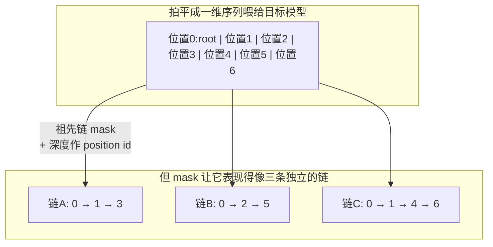

# 16 树形草稿与树注意力 —— mask 构造与验证

## 1. 一句话

树注意力**不是新算子**，它就是一张换了形状的 mask：把树拍平成一维序列，让每个节点只能看见自己的**祖先链**，这一次前向的结果与"把每条根到叶路径分别当成普通因果序列各跑一次"**逐元素相等**（本库实测误差 $4.4\times10^{-16}$）。真正难的不是实现，是回答另一个问题：**同样的验证预算，该排成深链还是宽树？** 本库跑出来的答案比流行说法严格得多 —— 树要赢必须**同时**满足两个条件，缺一不可。

---

## 2. 从哪来

到第 06 篇为止，草稿一直是**一条链**：$x_1\to x_2\to\dots\to x_\gamma$。链有一个结构性弱点：

> **一步错，后面全废。** 第 $i$ 位被拒，$x_{i+1},\dots,x_\gamma$ 全部作废（[[04-拒绝采样修正-无损性的完整证明]] §8 讲了为什么必须作废）。于是 $E[\tau]$ 里那个 $\alpha^k$ 衰减得很快：$\alpha=0.6$ 时第 5 个 token 能拿到的概率只剩 $0.6^5=7.8\%$。

而 [[03-并行验证为什么几乎免费-算术强度与roofline]] 告诉我们：**验证的成本只取决于喂给目标模型的 query token 总数 $n$，与这 $n$ 个 token 排成什么形状无关**（只要还在 memory-bound 区）。

两条放一起，就产生了一个很自然的念头：

> 既然 $n$ 个 token 的验证是同价的，那何必把它们排成一条链？在容易出错的位置多押几个候选，不就把"一步错全废"的概率降下来了吗？

这就是树形草稿。SpecInfer（Miao 等，2023-05，arXiv 2305.09781）把它系统化，Medusa（2024-01）与 EAGLE-2（2024-06）把它变成标配。历史线见 [[12-Medusa-多头草稿与树注意力的诞生]] 与 [[13-EAGLE三代-特征级自回归的演进]]，本篇只管机制与判据。

---

## 3. 机制拆解

### 3.1 树的表示

一棵草稿树用**父指针数组** `parents` 表示就够了：`parents[i]` 是节点 $i$ 的父节点下标，根节点为 $-1$。节点 0 是根（当前已确定的最后一个 token），它的每个后代对应一个"猜测"。

以本库的样例树为例（`python _lab/tree.py --mask`）：

```
parents = [-1, 0, 0, 1, 1, 2, 4]

        0(root)
       /      \
      1        2
     / \        \
    3   4        5
        |
        6
```

### 3.2 三个必须同时正确的量

| 量 | 定义 | 写错的后果 |
|---|---|---|
| **mask** | `mask[i][j] = True` 当且仅当 $j$ 是 $i$ 的祖先（含自己） | 分支互相污染，分布出错 |
| **position id** | 节点的**深度**，不是拍平后的下标 | 位置编码错位，等价性被破坏 |
| **KV 索引** | 每个节点在 KV cache 里的槽位，接受后要按被选中的路径**压实** | cache 与实际前缀不符，后续全错 |

样例树的 mask（实测输出）：

```
        0  1  2  3  4  5  6
   0    1  0  0  0  0  0  0
   1    1  1  0  0  0  0  0
   2    1  0  1  0  0  0  0
   3    1  1  0  1  0  0  0
   4    1  1  0  0  1  0  0
   5    1  0  1  0  0  1  0
   6    1  1  0  0  1  0  1
```

深度（= position id）：`[0, 1, 1, 2, 2, 2, 3]`
根到叶路径：`[0,1,3]`、`[0,2,5]`、`[0,1,4,6]`

**两条要盯死的性质**：

1. 每一行 1 的个数 = 该节点深度 + 1，且**必是一条祖先链**，不是任意前缀。这是树 mask 与因果 mask 的唯一区别 —— 因果 mask 里"前缀"就是"下标小于自己的全部"，树 mask 里则要沿父指针走。
2. **兄弟节点互相看不见**（如 3 和 4，1 和 2）。它们是两个**互斥的猜测**，一条分支绝不能看到另一条 —— 否则被验证的就不是"如果走这条路会怎样"，而是一个根本不存在的混合前缀。



### 3.3 因果 mask 是它的特例

树退化成一条链时（`parents = [-1,0,1,2,3]`），祖先链 mask 就是普通下三角因果 mask，一位不差（`_lab/test_tree.py::test_chain_mask_is_ordinary_causal_mask`）。

**所以"树注意力"这个名字有点误导**：它没有引入新的注意力形式，只是把"可见集合"的定义从"下标序"换成了"祖先序"。工程上它甚至可以复用同一个 kernel —— 只要 kernel 接受任意布尔 mask。真正的工程成本在**构造 mask、维护 position id、以及接受之后压实 KV cache** 这三件杂活上，不在注意力计算本身。

---

## 4. 等价性：把"就是一张 mask"证成一个数

断言："树拍平跑一次" == "每条根到叶路径按普通因果序列各跑一次"。

验证方法（`_lab/tree.py::verify_tree_equals_chains`）：给每个节点一个随机 token embedding、按深度取位置编码，用同一组 $W^Q,W^K,W^V$ 跑真实的缩放点积注意力，比较树里每个节点的输出与它在对应链上那一位的输出。

```python
# 树：拍平一次前向，position id 取深度
X_tree = tok_emb + pos_emb[depths(parents)]
out_tree = _attention(X_tree, build_mask(parents), Wq, Wk, Wv)

# 链：每条根到叶路径单独跑，position id 取 0..L-1
for path in root_to_leaf_paths(parents):
    X_chain = tok_emb[path] + pos_emb[np.arange(len(path))]
    out_chain = _attention(X_chain, np.tril(...), Wq, Wk, Wv)
    # 链上第 t 位 <-> 树里的 path[t]
```

实测最大逐元素误差：

| 树形状 | 最大逐元素误差 |
|---|---|
| 样例树 `[-1,0,0,1,1,2,4]` | $4.441\times10^{-16}$ |
| 退化成链 `[-1,0,1,2,3]` | 机器精度 |
| 一层全展开 `[-1,0,0,0]` | 机器精度 |
| 不规则树 `[-1,0,1,1,2,2,3,3,5]` | 机器精度 |

（复跑：`python _lab/tree.py --mask`；四种形状的断言见 `_lab/test_tree.py::test_tree_attention_equals_per_chain`）

### 4.1 反证：position id 用错会怎样

这是树形草稿实现里最常见的一个 bug —— 用**拍平后的下标**当 position id，而不是节点深度。本库把后果量化了：同一棵树、同一组权重，仅把 `pos_emb[depths]` 换成 `pos_emb[arange(n)]`，输出的最大逐元素偏差 $>10^{-3}$（`_lab/test_tree.py::test_tree_attention_breaks_if_position_ids_wrong`）。

**它的危险在于不会报错。** 形状对、mask 对、程序跑通，只是目标模型算出的 $p_i$ 对应的不再是那条真实前缀 —— 于是 [[04-拒绝采样修正-无损性的完整证明]] §8 第 1 条的对齐前提被破坏，**无损性悄悄失效**，表现只是"接受率莫名偏低"。很多人会去调草稿模型，其实该去查 position id。

> **判据**：树形草稿上线前，先跑一次"树 vs 逐链"的等价性对拍。这是唯一能把这类 bug 一次抓出来的办法，成本极低。

---

## 5. 该深还是该宽：把直觉换成一张表

### 5.1 建模

在**贪心/精确匹配口径（L2）**下建一个最小模型：

- 树按 $k$ 叉、每层全展开；预算 $n$ 个节点时能长到的深度 $D$ 由 $\sum_{d=1}^{D}k^d\le n$ 决定；
- 某一层被"猜中"的概率 = 草稿 top-$k$ 候选**覆盖**目标模型下一个 token 的概率，记 $c_k$；
- 期望接受长度 $=\sum_{d=1}^{D}c_k^{\,d}$。

$k=1$ 就是链。于是"深 vs 宽"变成了一个可算的比较：**加宽度换来 $c_k$ 变大，代价是 $D$ 变小。**

口径：$|V|=2000$，$p\sim$ Zipf(2.0)（top-1 概率 0.61，接近真实 LLM 的置信度水平），草稿 $q=\text{agree}\cdot p+(1-\text{agree})\cdot$ 另一支 Zipf。

### 5.2 实测表

（复跑：`python _lab/tree.py --shape`。**粗体是该预算下的最优。**）

**草稿一致度 agree=0.95**，覆盖率 $c_1{=}0.608,\ c_2{=}0.760,\ c_4{=}0.866,\ c_8{=}0.919$

| 预算 $n$ | 链 ($k{=}1$) | 2 叉树 | 4 叉树 | 8 叉树 |
|---|---|---|---|---|
| 8 | **1.5227** (D=8) | 1.3380 (D=2) | 0.8657 (D=1) | 0.9193 (D=1) |
| 16 | 1.5512 (D=16) | **1.7772** (D=3) | 0.8657 (D=1) | 0.9193 (D=1) |
| 32 | 1.5517 (D=32) | **2.1110** (D=4) | 1.6152 (D=2) | 0.9193 (D=1) |
| 64 | 1.5517 (D=64) | **2.3648** (D=5) | 1.6152 (D=2) | 0.9193 (D=1) |

**草稿一致度 agree=0.80**，覆盖率 $c_1{=}0.608,\ c_2{=}\mathbf{0.608},\ c_4{=}0.828,\ c_8{=}0.890$

| 预算 $n$ | 链 | 2 叉树 | 4 叉树 | 8 叉树 |
|---|---|---|---|---|
| 8 | **1.5227** | 0.9779 | 0.8277 | 0.8900 |
| 16 | **1.5512** | 1.2028 | 0.8277 | 0.8900 |
| 32 | **1.5517** | 1.3395 | 1.5128 | 0.8900 |
| 64 | **1.5517** | 1.4227 | 1.5128 | 0.8900 |

**草稿一致度 agree=0.50**：链在全部预算下都赢（1.5227 / 1.5512 / 1.5517 / 1.5517）。

### 5.3 结论：树要赢，两个条件缺一不可

这张表推翻了两个流行说法。

**流行说法一："树总是比链好，因为验证同价。"** 错。agree=0.95、预算 8 时，链 1.5227 就是最优，二叉树只有 1.3380。**预算太小时，加宽度等于砍深度，砍得不值** —— 二叉树把深度从 8 砍到 2，换来覆盖率从 0.608 升到 0.760，这笔交易亏。

**流行说法二："草稿不准就该把树加宽。"** 也错，而且错得更彻底。看 agree=0.80 那张表：$c_2 = c_1 = 0.608$，**第二候选的边际贡献恰好是 0** —— 草稿整体跑偏时，它的第 2 名和第 1 名一样不靠谱。于是**无论预算多大，链都赢**（`_lab/test_tree.py::test_width_is_worthless_without_marginal_coverage`）。

正确的判据是：

> **宽度值不值钱，取决于边际覆盖率增益 $c_k-c_1$，而不是取决于"草稿好不好"。**
> - agree=0.95：$c_2-c_1=+0.152$ —— 加宽度买得到东西
> - agree=0.80：$c_2-c_1=0.000$ —— 加宽度什么也买不到
>
> 一个"整体跑偏"的草稿，宽度救不了它；一个"知道自己不确定、能把正确答案排进 top-2"的草稿，宽度才有价值。**这两种"不准"完全不同，而流行说法把它们混为一谈了。**

**两个条件合起来**：树赢需要 (i) 边际覆盖率增益显著 **且** (ii) 预算足够大。表里唯一满足两条的是 agree=0.95 且 $n\ge16$ 的格子。

### 5.4 由此推出的工程结论

1. **最优形状不是常数。** 它随预算变（表的行）、随草稿在当前位置的置信度变（表的组）。**静态树一定在某些位置上是错的** —— 这正是 EAGLE-2 之后转向"按草稿置信度动态决定树形状"的原因（[[13-EAGLE三代-特征级自回归的演进]]）。
2. **规则 $k$ 叉树不是最优树。** 本模型假设同层各分支接受概率相同，真实系统里兄弟分支的概率极不均匀（Zipf 尾很长）：第 1 个孩子值 0.6，第 8 个可能只值 0.005，给它一个节点预算纯属浪费。**真实最优树是不规则的** —— 深处窄、浅处宽、按概率剪枝。本表给的是规则树中的最优，是全局最优的**下界**。
3. **"验证预算"本身要挑对。** 上面全部比较都建立在"$n$ 个 query token 同价"之上。一旦 $n$ 大到把验证前向推进 compute-bound 区，成本就跟 $n$ 线性走了，宽树的性价比会急剧恶化。**树越大越接近 compute-bound**，见 [[18-batch与吞吐-收益衰减曲线]]。这也是为什么线上树规模通常只有几十个节点，而不是几百。

---

## 6. 代码验证

```python
# _lab/tree.py
def build_mask(parents):
    """规则只有一条：只能看见自己的祖先（含自己）。"""
    n = len(parents)
    m = np.zeros((n, n), dtype=bool)
    for i in range(n):
        for j in ancestors(parents, i):
            m[i, j] = True
    return m

def depths(parents):
    """每个节点的深度 —— 它同时就是这个节点该用的 position id。"""
    return np.array([len(ancestors(parents, i)) - 1 for i in range(len(parents))])
```

配套断言：mask 每行恰好是祖先集合、对角线全 True、兄弟互不可见、链退化成因果 mask、深度等于 position id、四种形状下树链等价、position id 用错则等价性破坏、覆盖率随 $k$ 单调、预算约束不被突破、树/链在两种条件下各自胜出 —— 共 14 条，全部在 `_lab/test_tree.py`。

---

## 7. 口径与坑

1. **§5 的模型是 L2（贪心/精确匹配）口径。** 它问的是"目标模型的 argmax 在不在候选集里"。带温度采样时，"接受"是随机事件，树的收益要用 [[04-拒绝采样修正-无损性的完整证明]] 的随机判据重算 —— 多候选下还要用 SpecInfer/SpecTr 式的多分支拒绝采样才能保持 **L1 分布无损**。**"树 + 贪心匹配"和"树 + 无损采样"是两套东西**，报数字时必须说清是哪套。
2. **Medusa 的 typical acceptance 是 L3。** 它放宽了接受判据以换取更长的接受长度，分布已经不等于目标模型。把它的 acceptance length 与 L1 方法的直接横比是不公平的（[[12-Medusa-多头草稿与树注意力的诞生]]）。
3. **"接受长度"含不含赠品 token**，不同实现口径不同，横比前必须对齐（[[05-接受率alpha-定义口径与怎么测]]）。
4. **树的成本口径**：树的成本由**节点总数**决定，收益由**被接受路径的深度**决定。这两个量不是一回事，[[06-期望接受长度与加速比模型-完整推导]] 的一维递推 $E[\tau]=(1-\alpha^{\gamma+1})/(1-\alpha)$ 在树上**不适用**，别套。

---

## 8. 失效条件

树形草稿在下列情况下不划算，甚至是负收益：

1. **预算小（$n\lesssim8$）且深度是瓶颈时**：§5.2 第一行，链赢。
2. **草稿整体跑偏（边际覆盖率增益 ≈ 0）时**：§5.3，无论预算多大树都不赢。此时该做的是**换/重训草稿**，不是加宽树。
3. **节点数大到把验证推入 compute-bound 时**：验证不再同价，树的整个立论基础消失。大 batch 下这个临界点来得很早（[[19-负收益全解-什么时候投机反而更慢]]）。
4. **kernel 不支持任意 mask 时**：某些高度优化的 attention kernel（尤其是为因果 mask 特化的）不接受任意布尔 mask，被迫回退到较慢的实现，此时"验证同价"的前提也被打破 —— **不是被算力打破，是被 kernel 选择打破**。
5. **树的构造与维护开销本身**：节点数越多，mask 构造、position id 计算、KV 压实、以及接受后的路径回溯都越贵。这些是纯 CPU/调度开销，在小模型或短生成上占比会变得可观。
6. **position id 或 KV 压实写错时**：不是慢，是**错**（§4.1）。上线前必须做等价性对拍。

---

## 9. 自测题

1. 为什么兄弟节点之间必须互相不可见？如果让它们互相可见会发生什么？
   <details><summary>答案要点</summary>兄弟是互斥猜测，代表"如果这一步选 A"与"如果这一步选 B"两条不同的未来。互相可见等于让目标模型在一个**不存在的混合前缀**上算概率，$p_i$ 不再对应任何一条真实路径，[[04-拒绝采样修正-无损性的完整证明]] 的对齐前提被破坏，无损性失效。</details>

2. 一棵 63 节点的满二叉树（深度 5）和一条 63 个 token 的链，验证成本一样吗？为什么？在什么情况下不一样？
   <details><summary>答案要点</summary>在 memory-bound 区一样：成本只取决于 query token 总数 63。不一样的情况：(a) 总数大到进入 compute-bound（此时两者仍然一样贵，但都变贵了，且"免费"的前提没了）；(b) kernel 对任意 mask 支持不佳，树被迫走慢路径；(c) 树的 mask 构造/KV 压实等 CPU 开销更高。</details>

3. 某团队报告"我们把草稿树从 2 叉加宽到 8 叉，接受长度反而下降了"。给出至少两个可能原因。
   <details><summary>答案要点</summary>(a) 预算固定时加宽必然砍深度，若边际覆盖率增益不足则净亏（§5.2 表里 8 叉树在所有格子都不是最优）；(b) 草稿的第 3–8 候选可能几乎不含概率质量（Zipf 尾），这些节点是纯浪费；(c) 节点数增加把验证推进了 compute-bound，单轮变慢，若他们报的是"每秒 token 数"而不是"每轮接受长度"，还会叠加这一层。</details>

4. 为什么说"真实最优树是不规则的"？给一个具体的构造思路。
   <details><summary>答案要点</summary>因为兄弟分支的概率极不均匀。思路：把节点预算当成一个背包，按"该节点被接受的概率 × 它能带来的期望深度收益"排序贪心分配 —— 高概率路径往深里延，低概率分支早剪。EAGLE-2 的做法即属此类（用草稿模型自己的置信度近似接受概率来动态扩展与重排）。</details>

5. 你接手一个树形投机解码实现，接受率比论文报告低很多。按什么顺序排查？
   <details><summary>答案要点</summary>先排查**正确性**再排查**性能**：① 跑树/逐链等价性对拍（`verify_tree_equals_chains` 那套），能一次抓出 position id 与 mask 的 bug；② 检查接受后 KV cache 有没有按选中路径正确压实；③ 确认采样参数（温度/top-p）在目标与草稿两侧一致；④ 以上都对，再去看树形状与草稿质量（§5 的两个条件）。顺序不能反 —— 正确性 bug 会伪装成性能问题。</details>

---

## 10. 延伸与双链

- 前置：[[03-并行验证为什么几乎免费-算术强度与roofline]]（"同价"从哪来）、[[04-拒绝采样修正-无损性的完整证明]]（对齐前提）
- 一维公式为什么在树上不适用：[[06-期望接受长度与加速比模型-完整推导]]
- 历史：[[12-Medusa-多头草稿与树注意力的诞生]]、[[13-EAGLE三代-特征级自回归的演进]]、[[15-谱系图与被淘汰的分支]]
- 动态形状：[[17-动态草稿长度与自适应停止]]
- 什么时候"同价"不再成立：[[18-batch与吞吐-收益衰减曲线]]、[[19-负收益全解-什么时候投机反而更慢]]
- 引擎里怎么实现：[[20-主流引擎实现-vLLM与SGLang与TensorRTLLM]]
- 误解清单：[[27-常见误解与判据]]

---

### 本篇验证

- `_lab/test_tree.py::test_mask_row_is_exactly_the_ancestor_chain` —— mask 每行恰好是祖先集合，不多不少（验证 §3.2 性质 1）。
- `_lab/test_tree.py::test_siblings_cannot_see_each_other` —— 兄弟互不可见（验证 §3.2 性质 2）。
- `_lab/test_tree.py::test_chain_mask_is_ordinary_causal_mask` —— 链退化时树 mask 就是下三角因果 mask（验证 §3.3）。
- `_lab/test_tree.py::test_depth_equals_position_id` —— 深度 `[0,1,1,2,2,2,3]`。
- `_lab/test_tree.py::test_tree_attention_equals_per_chain` —— **核心等价性**，四种树形状下误差 $<10^{-12}$（验证 §4）。
- `_lab/test_tree.py::test_tree_attention_breaks_if_position_ids_wrong` —— 反证：position id 用拍平下标则等价性破坏（验证 §4.1）。
- `_lab/test_tree.py::test_coverage_increases_with_k`、`::test_kary_depth_respects_budget`、`::test_expected_accept_bounded_by_depth` —— §5.1 模型的自洽性。
- `_lab/test_tree.py::test_chain_beats_tree_at_small_budget` —— 预算小时链赢（验证 §5.3 说法一被推翻）。
- `_lab/test_tree.py::test_tree_beats_chain_at_large_budget` —— 预算大且边际增益足够时树赢。
- `_lab/test_tree.py::test_width_is_worthless_without_marginal_coverage` —— **边际覆盖率增益为 0 时，任何预算下链都不输**（验证 §5.3 说法二被推翻）。
- 可复跑：
  - `python _lab/tree.py --mask` —— §3.2 的 mask、深度、路径，与 §4 的等价性误差 $4.441\times10^{-16}$
  - `python _lab/tree.py --shape` —— §5.2 的三张深宽比较表

### 本篇来源

- Xupeng Miao 等, *SpecInfer: Accelerating Large Language Model Serving with Tree-based Speculative Inference and Verification* — https://arxiv.org/abs/2305.09781 （2023-05）。树形草稿 + 树注意力的系统化出处，也是"多个小模型联合起草"的早期尝试。它讲得好的地方是把树验证写成了可与拒绝采样兼容的形式（保持 L1）；需要注意的是它的加速比数字口径与后来的工作差异较大，横比前要核对 batch 与模型组合。
- Tianle Cai 等, *Medusa: Simple LLM Inference Acceleration Framework with Multiple Decoding Heads* — https://arxiv.org/abs/2401.10774 （2024-01）。把树注意力普及开来。**但它默认的 typical acceptance 是 L3 近似口径**，社区材料经常漏掉这一点（见 [[26-社区精彩解释精选-好在哪与错在哪]]）。
- Yuhui Li 等, *EAGLE-2: Faster Inference of Language Models with Dynamic Draft Trees* — https://arxiv.org/abs/2406.16858 （2024-06）。把"树形状应当动态决定"这件事做实，正是 §5.4 第 1 条的工程对应物。
- Zhuoming Chen 等, *Sequoia: Scalable, Robust, and Hardware-aware Speculative Decoding* — https://arxiv.org/abs/2402.12374 （2024-02）。明确把"最优树形状取决于硬件与预算"当作核心问题来解，与本篇 §5.4 第 3 条同一立场。
