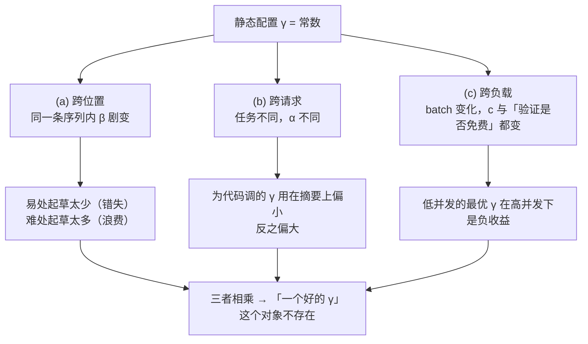
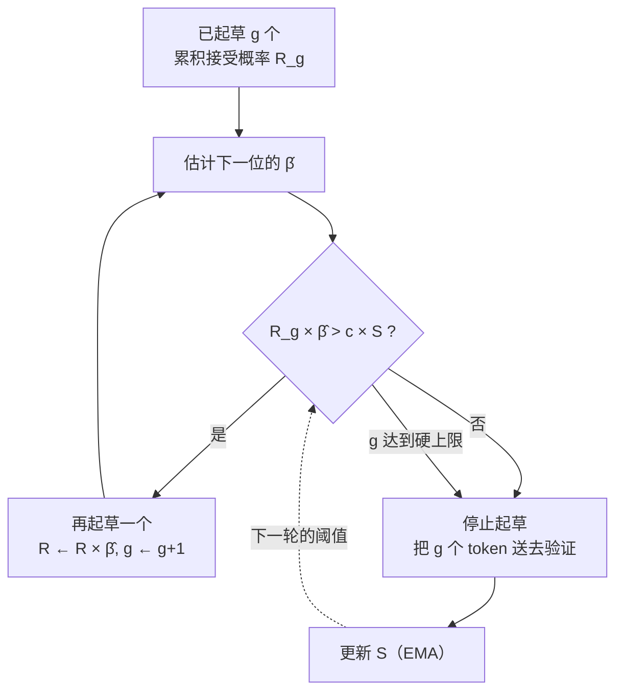

# 17 动态草稿长度与自适应停止

## 1. 一句话

固定的 $\gamma$ 一定是次优的，因为它在**三个互相独立的轴**上被平均掉了：位置（同一条序列里难度剧变）、请求（不同任务的接受率差一倍以上）、负载（batch 变了最优 $\gamma$ 就变）。
本篇把"什么时候该停止起草"化成一个可算的**边际判据**，并且在推导过程中把一条看起来天经地义的判据（"边际收益 $\alpha^{g+1}$ 大于边际成本 $c$ 就继续"）**证伪掉**了 —— 它在本库的全部 16 个测试点上都给出了偏大的 $\gamma$，最差一处让理想加速比损失 **39.8%**。

---

## 2. 从哪来：固定 $\gamma$ 的三重次优性

[[06-期望接受长度与加速比模型-完整推导]] 已经给出了"最优 $\gamma^\*$"的求法，[[16-树形草稿与树注意力-mask构造与验证]] 给出了"最优树形状"的求法。两篇都留了同一个尾巴：**求出来的那个最优值，是对某个平均量而言的最优。**

本篇要说清的是：那个平均量掩盖了三种彼此独立的变化，任何一种单独存在都足以让静态配置失效。



### 2.1 (a) 跨位置：难度在一条序列内部就剧变

接受概率 $\beta_i=\sum_x\min(p_i,q_i)$ 是**上下文的函数**，不是模型对的常数。本库实测（`python _lab/accept.py --iid`，玩具马尔可夫模型，$|V|=8$、target `ToyMarkov(seed=24, temp=1.0)`、draft `perturb(eps=3.0, seed=101)`）：

| $\lvert V\rvert$ | eps | $\alpha$（平稳分布加权） | $\beta_{\min}$ | $\beta_{\max}$ | $\beta_{\max}/\beta_{\min}$ |
|---|---|---|---|---|---|
| 8 | 3.0 | 0.3202 | 0.1763 | 0.4492 | **2.55×** |
| 4 | 3.0 | 0.6833 | 0.3091 | 0.8629 | **2.79×** |
| 8 | 1.5 | 0.5122 | 0.2628 | 0.7402 | 2.82× |

（口径：玩具模型的解析计算，不是真实 LLM；它的作用是把"$\beta$ 会剧变"这件事做成可复算的数，不是给出真实模型的 $\beta$ 分布。）

真实系统上的对应证据，最干净的一条来自 vLLM 的 adaptive verification blog（口径：DeepSeek-V4-Pro-0813、8×NVIDIA B300、TP=8、并发 1–256、880 prompts、temperature 1.0、输出至 2048 token）：

> "the last drafted token of a 7-token block survives less than 10% of the time, against more than 70% for the first."

第 1 位存活 >70%、第 7 位 <10%。$\gamma=7$ 的配置意味着**最后那一次草稿前向有九成概率是白花的**；但把 $\gamma$ 砍到 3，又会在 >70% 的那些位置上白白放弃收益。**固定 $\gamma$ 同时犯这两个错，只是在不同位置上犯。**

更要命的是这种波动不是白噪声：[[06-期望接受长度与加速比模型-完整推导]] §7 已经实测出**难度会连片**（$\beta$ 的一阶自相关 $\rho$ 可达 $+0.812$）。**连片正是"可预测"的另一种说法** —— 上一位难，下一位大概率也难。这是自适应策略的全部收益来源：如果难度是纯白噪声，看着当前状态也预测不了下一步，动态就没有信息优势。

### 2.2 (b) 跨请求：不同任务的接受率差一倍以上

同一对模型换个任务，接受率就换个量级。三组独立证据：

- **SGLang 的 DSpark 混合流量实测**（口径：H200 TP4-DP4 跑 DeepSeek-V4-Flash / B300 TP8 跑 DeepSeek-V4-Pro，混合流量）：**gsm8k 拿到 5.24 token 的验证窗口，poetry 只拿 2.91**。同一个引擎、同一批权重、同一时刻，两类请求的最优草稿长度差 **1.80 倍**。
- **HF `dynamic_speculation_lookahead` 博客的表**（口径：RTX 4090、贪心解码 $T=0$、batch size 未标注但 HF assisted generation 硬性要求 bs=1、固定 $\gamma=5$ 的 heuristic 基线）：`meta-llama/Llama-3.1-8B` + `meta-llama/Llama-3.2-1B` 在 summarization 上是 **1.00×（完全没收益）**，在 code generation 上是 **1.09×**；换成动态 $\gamma$ 后分别是 **1.52×** 和 **1.15×**。
- **llama.cpp PR #10455**（口径：同一台 RTX 3090、同一对模型，只换 prompt）：高可预测 prompt **5.73×**，短 prompt "write snake game in swift" **1.47×**。

第三条尤其值得盯：**硬件、模型全部一样，只换 prompt，加速比差 3.9 倍**（该 PR 未逐条列出两次运行的 $\gamma$，按同一 PR 的对照表理解为同一配置，**口径不全**）。这说明 $\gamma$ 不只是"该按任务调"，而是"按任务调也还不够" —— 同一个任务里的不同 prompt 也在变。

> HF 那张表的第一行要单独拎出来：**同一对模型，固定 $\gamma$ 是 1.00×（白干），动态 $\gamma$ 是 1.52×。** 也就是说，社区里相当一部分"投机解码在我这没用"的结论，真实成因是 **$\gamma$ 没调**，不是方法不行。这条应当写进 [[19-负收益全解-什么时候投机反而更慢]] 的排查清单。

### 2.3 (c) 跨负载：batch 一变，最优 $\gamma$ 跟着变

[[18-batch与吞吐-收益衰减曲线]] 已经把机制推完了：验证成本在 memory-bound 区与 $\gamma$ 无关，在 compute-bound 区正比于 $\gamma+1$。于是**同一套配置在一天之内会从加速走到降速**。

三家引擎独立收敛到了同一个动作 —— **把 $K$ 做成 batch 的函数**：

| 引擎 | 机制 | 具体形态 |
|---|---|---|
| vLLM V1 | `num_speculative_tokens_per_batch_size` | 文档示例 `[ [1,64,3], [65,128,1], [129,512,0] ]`：并发 129–512 时 **K=0，完全不产草稿** |
| SGLang | `--speculative-adaptive` | 内置默认 **BS 8–31 允许 `[1,3]`，BS≥32 锁 `steps=1`** |
| HF transformers | `assistant_confidence_threshold` | 默认 **0.4**，草稿自信度低于它就提前收手 |

vLLM `adaptive_verification.md` 把这件事的结论写得最直白（原文）：

> "The crossover moves with load and with workload-dependent acceptance rates, so **no static `num_speculative_tokens` is right across concurrencies.**"

### 2.4 三重叠加意味着什么

三个轴是**乘性**的：位置 × 请求 × 负载。你可以为某个任务在某个并发下调出一个不错的 $\gamma$，但那个 $\gamma$ 在同一条序列的下一个 token 上就已经不对了。

> **本篇的立场**：不存在"最优的固定 $\gamma$"这个对象，只存在"在某个平均意义下损失最小的固定 $\gamma$"。问题因此从"调参"变成"设计一条停止规则"。

---

## 3. 机制拆解：停止准则的设计空间

### 3.1 四类信号

一次迭代里，我们在每次草稿前向之前要回答同一个问题：**再起草一个 token，值不值？** 可用的信号有四类，代价与可靠性差别很大。

| 类别 | 用什么信号 | 拿得到吗 | 是判据还是启发式 | 主要代价 |
|---|---|---|---|---|
| **A. 草稿自身置信度** | 草稿 logits 的熵 / top-1 概率 / 累计乘积 | 免费（已经在手里） | **启发式**（§3.2） | 每步一次 reduce + 比较；GPU→CPU 同步 |
| **B. 累积接受概率的期望收益** | 对 $\beta_i$ 的估计 + 成本 $c$ | 需要估计器 | **判据**（§4） | 估计器要训练或标定 |
| **C. 外部信号** | 当前 batch、队列长度、SLO 余量 | 免费（调度器已知） | 判据（但粒度粗） | 需要成本模型；跨请求耦合 |
| **D. 树形状动态化** | 逐节点置信度 → 扩展 + 重排 | 需要草稿模型多输出 | 与 A/B 同源 | 树构造/剪枝的 CPU 开销 |

### 3.2 按草稿置信度停：它是启发式，不是判据

这是最便宜、也是被用得最多的一类（HF 的 `assistant_confidence_threshold`、SGLang 的接受率 EMA、各种"熵超过阈值就停"）。它的隐含假设是：

> 草稿模型对自己的预测越有信心，这个 token 越可能被目标模型接受。

**这条假设没有任何数学保证，而且有一个结构性的反例。** 接受概率是

$$
\beta=\sum_x\min\big(p(x),q(x)\big)=1-\mathrm{TV}(p,q)
$$

它是 $p$ 与 $q$ 的**距离**，与 $q$ 自身的熵**完全无关**。两条直接推论：

1. $q$ 高熵（极不自信）但与 $p$ 几乎相同 $\Rightarrow$ $\beta\approx1$。**不自信但必被接受。**
2. $q$ 低熵（极自信）但峰值压在 $p$ 的低概率处 $\Rightarrow$ $\beta\approx0$。**自信但必被拒绝。**

第 2 条就是"草稿可以自信地错"。本库把两条都算成了数（复跑见 §6.1 的第二段命令，模型为 `ToyMarkov(V=8, seed=5)` + `perturb(seed=99)`，置信度按平稳分布加权）：

| 草稿 | 温度 $T$ | $\alpha$（接受率） | 草稿 top-1 置信度 |
|---|---|---|---|
| eps=0.3（好草稿） | 0.02 | 0.6967 | 0.9090 |
| eps=0.3 | 1.00 | 0.8952 | 0.2893 |
| eps=0.3 | 50.0 | **0.9980** | **0.1279** |
| eps=1.2（烂草稿） | 0.02 | **0.0001** | **0.9999** |
| eps=1.2 | 1.00 | 0.6585 | 0.4103 |
| eps=1.2 | 50.0 | 0.9922 | 0.1292 |

盯住两行：**第 3 行草稿只有 12.79% 的置信度（$1/|V|=12.5\%$ 是理论下限），接受率却是 99.80%；第 4 行草稿有 99.99% 的置信度，接受率只有 0.01%。** 在这个族里，置信度与接受率沿温度轴几乎**反向**。

这不是把玩具模型逼到极端才出现的：$T\to\infty$ 时两个分布都趋于均匀，$\alpha\to1$ 而 top-1 概率 $\to 1/|V|$，这是**恒成立**的（`_lab/test_accept.py::test_alpha_goes_to_one_at_high_temperature` 断言 $T=50$ 时 $\alpha>0.97$）。

**但必须同时说清反面**：现实里置信度启发式确实有用 —— DISCO/HF 的默认阈值 0.4 是实测调出来的，说明真实草稿模型上这个相关性通常**是正的**。所以正确的表述不是"置信度没用"，而是：

> **置信度与接受率的相关性是某个具体草稿模型的经验性质，不是定理。** 它可以正、可以零、可以负；换一个草稿模型、换一个温度、换一个任务，它就可能翻号，而且**翻号的时候不会报错**，只表现为"接受长度莫名下降"。

生产系统对这条的应对方式很一致：**不用草稿自己的 softmax，另训一个预测接受的头**。SpecDec++（Huang 等，2024-05，arXiv 2405.19715）叫 acceptance prediction head；vLLM 的 adaptive verification 明确要求 **DSpark 的 confidence head**，并因此只支持 DSpark 一种方法。这个"只支持一种方法"的限制，正是"置信度必须被校准过才敢用"的成本体现。

### 3.3 按累积接受概率的期望收益停

这是 §4 要推的那一条：把"再起草一个"当成一次投资，比较它的边际收益与边际成本。它是唯一能写成判据（而不是阈值调参）的一类，代价是需要一个 $\beta$ 的估计器 —— 也就是回到 §3.2 的问题上。**判据本身是对的，输入可能是错的。**

### 3.4 按外部信号停

粒度最粗，但也最便宜、最可靠，因为信号来自调度器自己（batch、队列长度、剩余 SLO），不需要任何模型输出。§2.3 那三家引擎的做法都属于这一类。

它的局限是**没有位置信息**：它能回答"这一批该不该多投机"，回答不了"这条请求的第 5 个 token 该不该起草"。所以它与 A/B 类是**互补**而非替代：外部信号定预算，置信度/期望收益在预算内分配。vLLM 的 adaptive verification 正是这个两层结构 —— 预算由启动时 profiling 的成本表决定，分配由 survival probability 的全局 top-B 决定。

### 3.5 树形草稿下的"动态形状"

[[16-树形草稿与树注意力-mask构造与验证]] §5.4 已经证到：**最优树形状随预算变、随草稿置信度变，静态树一定在某些位置上是错的**。把 §3.2–3.4 搬到树上，"停不停"就变成"往哪扩、剪哪枝"：

- **扩展**：按当前各叶节点的累计置信度排序，只往最有希望的叶子上再长一层；
- **重排（rerank）**：一层长完后，用全局分数重新挑出预算内的 top-$n$ 个节点做验证。

EAGLE-2（Li 等，2024-06，arXiv 2406.16858）就是这个做法的代表。注意它与链式动态停止的**结构差别**：链式只有"继续/停止"一个自由度，树有"深度/宽度/预算"三个，所以树的动态化更有收益空间，但决策开销也更大（§7.2）。

---

## 4. 逐步推导：一个可算的边际判据

### 4.1 一条看起来显然的判据

沿用 [[06-期望接受长度与加速比模型-完整推导]] 的记号：$E[\tau](\gamma)=\sum_{k=0}^{\gamma}\alpha^k$，$\text{speedup}(\gamma)=E[\tau](\gamma)/(\gamma c+1)$。

把 $\gamma$ 从 $g$ 加到 $g+1$：

- **收益增量**：多出的那一项是 $\alpha^{g+1}$ —— 它正是"前 $g+1$ 个全被接受，于是第 $g+2$ 个位置能白拿到"的概率；
- **成本增量**：一次草稿前向，$c$（以目标模型一次前向为单位）。

于是"边际收益 > 边际成本"给出

$$
\alpha^{g+1}>c
\tag{4.1}
$$

读法很顺：**累积接受概率降到草稿成本以下就该停。** 这条判据在社区讲解里很常见。

### 4.2 它是错的：比率最大化里，边际要跟平均比

(4.1) 的问题在于它把目标当成了**差值**（收益减成本），而我们真正要最大化的是**比值**：

$$
\text{speedup}(\gamma)=\frac{N(\gamma)}{D(\gamma)},\qquad N=E[\tau],\ D=\gamma c+1
$$

对比值而言，加一步是否划算的条件是

$$
\frac{N+\Delta N}{D+\Delta D}>\frac{N}{D}
\iff D\,\Delta N>N\,\Delta D
\iff \frac{\Delta N}{\Delta D}>\frac{N}{D}
\tag{4.2}
$$

**边际比要大于当前平均比**，这是比率最大化的基本形态（推导只用到 $D>0$ 与交叉相乘）。代入 $\Delta N=\alpha^{g+1}$、$\Delta D=c$：

$$
\boxed{\ \alpha^{g+1}>c\cdot\text{speedup}(g)\ }
\tag{4.3}
$$

(4.1) 是 (4.3) 在 $\text{speedup}=1$ 时的特例。而我们开投机就是为了 $\text{speedup}>1$，所以 **(4.1) 系统性地过于宽松，一定给出偏大的 $\gamma$**。

**它的物理含义比代数更重要**：多花 $c$ 那份时间的**机会成本不是零**。你本可以就此结束这一轮、开始下一轮，而下一轮的产出速率就是当前的 $\text{speedup}$。所以再起草一个 token 必须比"用同样的时间按当前速率继续干活"更划算。**(4.1) 忘了算机会成本。**

### 4.3 与暴力搜索的交叉检验

判据 (4.3) 是逐步的贪心停止；`_lab/accept.py::optimal_gamma` 是在 $[1,64]$ 上的暴力搜索。两者该不该一致，是可以直接跑出来的。

**粗网格（$\alpha\in\{0.5,0.7,0.8,0.9\}$，$c\in\{0.02,0.05,0.1,0.2\}$，共 16 格）**：

| $\alpha$ | $c$ | 暴力 $\gamma^\*$ | (4.1) 给的 $\gamma$ | (4.3) 给的 $\gamma$ | $S(\gamma^\*)$ | $S(\gamma_{(4.1)})$ | (4.1) 的损失 |
|---|---|---|---|---|---|---|---|
| 0.50 | 0.02 | 4 | 5 | **4** | 1.7940 | 1.7898 | −0.2% |
| 0.70 | 0.05 | 6 | 8 | **6** | 2.3529 | 2.2849 | −2.9% |
| 0.80 | 0.05 | 8 | 13 | **8** | 3.0921 | 2.8970 | −6.3% |
| 0.80 | 0.20 | 4 | 7 | **4** | 1.8676 | 1.7338 | −7.2% |
| 0.90 | 0.02 | 19 | 37 | **19** | 6.3654 | 5.6423 | −11.4% |
| 0.90 | 0.05 | 13 | 28 | **13** | 4.6741 | 3.9704 | **−15.1%** |

16 格全部的结论：**(4.1) 与暴力搜索 16/16 全不一致，且每一次都偏大；(4.3) 与暴力搜索 16/16 全一致。**

**细网格（$\alpha\in[0.05,0.99]$ 步长 0.01，$c\in[0.005,0.50]$ 步长 0.005，共 9494 格，$\gamma$ 上限 200）**：

- (4.3) 与暴力搜索**只有 1 格不同**：$(\alpha,c)=(0.5,0.2)$ 处，暴力给 $\gamma^\*=1$、判据给 2。核对这一格：$S(1)=1.5/1.2=1.25$，$S(2)=1.75/1.4=1.25$ —— **完全并列**，差别只在暴力搜索用严格 `>` 保留了先出现的那个。这不是判据失效，是并列最优的取舍。
- (4.1) 在细网格上最差的一格是 $(\alpha,c)=(0.98,0.05)$：暴力 $\gamma^\*=37$（$S=9.402$），(4.1) 给 $\gamma=148$（$S=5.659$），**理想加速比损失 39.8%**。

> **这条证伪值得记住的形式**：$\alpha$ 越高、$c$ 越小（也就是投机越划算的场景），(4.1) 的错误越大。**它恰好在最需要它的地方最不准。** 原因就在 (4.3) 里：$\text{speedup}$ 越大，被忽略的机会成本越大。

### 4.4 动态版：把 $\alpha^{g+1}$ 换成已实现的累积接受概率

(4.3) 里的 $\alpha^{g+1}$ 是"平均接受率的 $g+1$ 次方"，它假设每个位置一样难 —— 而 §2.1 说了这条不成立。动态化只需要把它换成**当前这一轮真实的累积接受概率**。

关键的时序细节：**决定要不要起草第 $i$ 个 token 时，第 $i$ 个位置的上下文已经确定了**（就是前 $i-1$ 个草稿 token 接在一起），所以 $\beta_i$ 原则上此刻可估。记

$$
R_g=\prod_{i=1}^{g}\beta_i\quad(\text{已起草的 }g\text{ 个全被接受的概率}),\qquad
\Delta N=R_g\cdot\hat\beta_{g+1}
$$

判据变成

$$
\boxed{\ R_g\cdot\hat\beta_{g+1}>c\cdot S\ }
\tag{4.4}
$$

其中 $S$ 是**当前实际达到的产出速率**（token / 目标前向）。注意 (4.4) 是个**不动点**：$S$ 取决于策略，策略又由 $S$ 决定。工程上迭代两三次就收敛（§6.2 实测 2 次内）。

三点值得说清：

1. **左边正是引擎里说的 "survival probability"。** vLLM adaptive verification 的原文是 "the running product of that request's per-position confidences" —— 就是 $R_g\hat\beta_{g+1}$。
2. **右边给了阈值一个物理量纲。** 社区里"累计概率低于 0.3 就停"这类做法，阈值一直是拍出来的；(4.4) 说它应该等于 $c\cdot S$ —— 草稿相对成本 × 当前速率。草稿变便宜（$c$ 降）该多起草，当前速率变高（$S$ 升）反而该少起草（机会成本变贵了）。
3. **它自动覆盖了 §2 的三个轴**：位置进 $R_g$，请求进 $\hat\beta$，负载进 $c$ 与 $S$（compute-bound 下验证不再免费，$S$ 塌下去，阈值随之变松 —— 但那时正确的动作是**整体关掉投机**，见 §8）。



### 4.5 与第 06 篇公式的关系

[[06-期望接受长度与加速比模型-完整推导]] §8 第 4 条已经点名：动态 $\gamma$ 下 $E[\tau]=(1-\alpha^{\gamma+1})/(1-\alpha)$ 失效。这里把"失效"具体化。

那条闭式是这么来的：$E[A]=\sum_{k=1}^{\gamma}\Pr[A\ge k]$，求和上限 $\gamma$ 是**常数**，再用"沿链不相关 + 起点无偏"把 $\Pr[A\ge k]$ 换成 $\alpha^k$。动态停止破坏的是最外层：

1. **求和上限成了随机变量。** $\gamma$ 由 $\beta_1,\dots,\beta_g$ 决定，$\{\gamma\ge k\}$ 与 $\{A\ge k\}$ 都依赖同一批 $\beta$，**二者强正相关**（易区起草得长，也接受得多）。$E[\tau]$ 不再是 $\gamma$ 的函数，它是**策略的泛函**。
2. **"用平均 $\alpha$ 代入"变得更不可信。** 静态时那一步只要求不相关；动态策略是**故意**去利用相关性的，所以把 $\alpha$ 当常数正是把这条策略的全部收益抹掉。
3. **成本也成了随机变量。** 分母不再是 $\gamma c+1$，而是 $E[\gamma]c+1$，且 $\gamma$ 的**方差**会通过批处理传导成额外损失（§7.3）——这一项闭式里根本没有位置。

> **工程上的可操作结论**：动态 $\gamma$ 上线后，**不要再报 $\alpha$，也不要再套那条闭式**。该报的是三个直接可测量：平均接受长度 $E[\tau]$、**平均草稿长度 $E[\gamma]$**、以及两者之比 $E[\tau]/(E[\gamma]+1)$（算力有效利用率，[[18-batch与吞吐-收益衰减曲线]] §4 推论 3 的那个量）。只报第一个会让"多起草换来的长度"看起来像是白赚的。

---

## 5. 小数字算例：$\alpha=0.8$，$c=0.05$

**用 (4.1)（错的那条）**：找最大的 $\gamma$ 使 $\alpha^{\gamma}>c$。
$0.8^{13}=0.05498>0.05$，$0.8^{14}=0.04398<0.05$，于是 $\gamma_{(4.1)}=13$。
$E[\tau](13)=(1-0.8^{14})/0.2=4.7801$，分母 $13\times0.05+1=1.65$，**$S=2.8970$**。

**用 (4.3)（对的那条）**：逐步走。

| 从 $g$ 到 $g+1$ | 边际收益 $\alpha^{g+1}$ | 门槛 $c\cdot S(g)$ | 继续？ |
|---|---|---|---|
| 6 → 7 | $0.8^7=0.20972$ | $0.05\times3.0396=0.15198$ | 是 |
| 7 → 8 | $0.8^8=0.16777$ | $0.05\times3.0823=0.15412$ | 是（余量只剩 0.0136） |
| 8 → 9 | $0.8^9=0.13422$ | $0.05\times3.0921=0.15460$ | **否，停** |

于是 $\gamma^\*=8$，$E[\tau](8)=4.3289$，分母 $1.4$，**$S=3.0921$**。与 [[06-期望接受长度与加速比模型-完整推导]] §4.5 表里 $(\alpha{=}0.80,c{=}0.05)$ 那一格的 $\gamma^\*=8$、$3.092$ 完全对上。

**两条判据的差距**：$\gamma$ 13 vs 8（多起草 62%），理想加速比 2.8970 vs 3.0921（**损失 6.3%**）。
换到 $\alpha=0.9$：$\gamma$ 28 vs 13，加速比 3.9704 vs 4.6741，**损失 15.1%**。

（口径：全部为 [[06-期望接受长度与加速比模型-完整推导]] (4.4) 的理想模型 —— 假设"验证免费"、batch 隐含为 1 且落在 memory-bound 区、不计任何工程开销。**这些是上界，不是实测加速比。**）

---

## 6. 代码验证

### 6.1 边际判据 vs 暴力搜索（可复跑）

在 `_lab/` 目录下执行（依赖已有的 `accept.py`，不新增文件）：

```python
python -c "
from accept import speedup_ideal, optimal_gamma
def g_naive(a,c,gmax=200):      # 判据 (4.1)：alpha^(g+1) > c
    g=1
    while g<gmax and a**(g+1)>c: g+=1
    return g
def g_ratio(a,c,gmax=200):      # 判据 (4.3)：alpha^(g+1) > c*speedup(g)
    g=1
    while g<gmax and a**(g+1)>c*speedup_ideal(a,g,c): g+=1
    return g
bad_n=bad_r=0
for a in (0.5,0.7,0.8,0.9):
    for c in (0.02,0.05,0.1,0.2):
        gb,_=optimal_gamma(a,c)
        bad_n += g_naive(a,c)!=gb
        bad_r += g_ratio(a,c)!=gb
print('mismatch: (4.1)=%d/16   (4.3)=%d/16'%(bad_n,bad_r))
"
```

实跑输出：`mismatch: (4.1)=16/16   (4.3)=0/16`。

§3.2 那张温度表的复跑（同目录）：

```python
python -c "
from spec import ToyMarkov, perturb
from accept import alpha_expected, _retemp, stationary
base=ToyMarkov(8,seed=5,temp=1.0)
for eps in (0.3,1.2):
    d=perturb(base,eps=eps,seed=99)
    for T in (0.02,1.0,50.0):
        b2,d2=_retemp(base,T),_retemp(d,T); pi=stationary(b2.T)
        conf=sum(pi[s]*d2.dist(s).max() for s in range(8))
        print('eps=%.1f T=%-6.2f alpha=%.4f conf=%.4f'%(eps,T,alpha_expected(b2,d2),conf))
"
```

关键两行实跑输出：`eps=0.3 T=50.00 alpha=0.9980 conf=0.1279` 与 `eps=1.2 T=0.02 alpha=0.0001 conf=0.9999`。

### 6.2 动态 vs 固定 vs 置信度启发式

用 [[06-期望接受长度与加速比模型-完整推导]] §7.2 造的「黏性双区制」玩具模型（`_lab/regime.py::make_regime_pair`，$|V|=8$、`eps_hard=3.0`、`seed=11`）跑三种策略，$c=0.05$，每种策略 20 000 次迭代，随机种子 5。**下面这段是本篇的一次性对照实验，不常驻 `_lab`**（把它保存到 `_lab/` 目录下，再补上末尾注释说明的 `step_conf` 与驱动循环，即可复跑）：

```python
import sys, numpy as np
from spec import beta_overlap, residual_dist
from regime import make_regime_pair
from accept import stationary

def verify(target, last, xs, qs, rng):          # 与 spec.speculative_step 的验证段等价
    g = len(xs); ps, cur = [], last
    for i in range(g + 1):
        ps.append(target.dist(cur));  cur = xs[i] if i < g else cur
    out = []
    for i in range(g):
        a = min(1.0, ps[i][xs[i]] / qs[i][xs[i]]) if qs[i][xs[i]] > 0 else 0.0
        if float(rng.random()) < a: out.append(xs[i])
        else:
            r = residual_dist(ps[i], qs[i])
            out.append(int(rng.choice(len(r), p=r))); return out, g
    out.append(int(rng.choice(len(ps[g]), p=ps[g]))); return out, g

def step_fixed(target, draft, last, rng, gamma):
    xs, qs, cur = [], [], last
    for _ in range(gamma):
        q = draft.dist(cur); x = int(rng.choice(len(q), p=q))
        xs.append(x); qs.append(q); cur = x
    return verify(target, last, xs, qs, rng)

def step_marginal(target, draft, last, rng, thresh, gmax=24):   # 判据 (4.4)，oracle 的 β
    xs, qs, cur, R = [], [], last, 1.0
    while len(xs) < gmax:
        p_h, q_h = target.dist(cur), draft.dist(cur)
        if R * beta_overlap(p_h, q_h) <= thresh: break
        x = int(rng.choice(len(q_h), p=q_h))
        xs.append(x); qs.append(q_h); R *= beta_overlap(p_h, q_h); cur = x
    if not xs:                                   # 至少起草 1 个
        q_h = draft.dist(last); xs.append(int(rng.choice(len(q_h), p=q_h))); qs.append(q_h)
    return verify(target, last, xs, qs, rng)
# step_conf(...)：同上，但把 beta_overlap(p_h,q_h) 换成 q_h.max()（草稿自己的 top-1 概率）
```

产出速率的口径统一为 **token / 目标模型前向当量**：$\text{rate}=\sum\text{tokens}\big/\sum(\gamma_i c+1)$。

| 粘性 sticky | $\alpha$ | A 最优固定 $\gamma$ | A rate | B 判据 (4.4) 的 $\theta=cS$ | B rate | B $E[\gamma]$ | B $\mathrm{sd}(\gamma)$ | **B vs A** | C 置信度最好阈值 | C rate | **C vs A** |
|---|---|---|---|---|---|---|---|---|---|---|---|
| 0.50 | 0.6831 | 5 | 2.3215 | 0.1269 | 2.5384 | 3.08 | 2.02 | **+9.3%** | 0.05 | 1.6924 | **−27.1%** |
| 0.90 | 0.7312 | 6 | 2.4048 | 0.1387 | 2.7749 | 3.63 | 4.95 | **+15.4%** | 0.50 | 1.6394 | **−31.8%** |
| 0.99 | 0.7439 | 6 | 2.4762 | 0.1461 | 2.9211 | 4.18 | 6.31 | **+18.0%** | 0.50 | 1.6645 | **−32.8%** |

（口径：玩具马尔可夫模型的蒙特卡洛，$c=0.05$ 为设定值不是实测，"最优固定 $\gamma$"是在 $1..12$ 上逐个跑出来取最好，C 的阈值在 $\{0.05,\dots,0.60\}$ 上取最好。**这不是任何真实模型的加速比。**）

四条结论：

1. **动态确实赢，而且赢的幅度随"难度连片程度"上升**（+9.3% → +18.0%）。这与 §2.1 的机制预测一致：难度越可预测，看当前状态做决策的信息优势越大。作为量级参照，DISCO 论文（Mamou 等，2024-05，arXiv 2405.04304）报的是"相对**最好的**静态 SL 基线平均提速 10%"，本实验的 +9.3% ~ +18.0% 落在同一量级 —— 但两者口径完全不同，**不可横比**。
2. **$\mathrm{sd}(\gamma)$ 与 $E[\gamma]$ 同量级甚至更大**（3.63±4.95、4.18±6.31）。这不是噪声，是策略的本质：易区一路顶到上限 24，难区起草 1 个就收手。**这个方差就是 §7.3 要付的代价。**
3. **不动点收敛很快**：$\theta$ 从 $c\cdot S_{\text{fixed}}$ 出发，2 次迭代内稳定。
4. **理论阈值 $\theta=cS$ 接近最优但不等于最优**：把 $\theta$ 在 $[0.04,0.30]$ 上以 0.01 为步长扫一遍，最好格点相对 $\theta=cS$ 的增益是 $+0.5\%$（sticky=0.50）、$+2.1\%$（0.90）、$+0.6\%$（0.99）。**差距的来源是 (4.4) 是一步贪心，它没有计入"这一轮在哪结束会改变下一轮从哪开始"** —— 也就是 [[06-期望接受长度与加速比模型-完整推导]] §7.3 那个更新过程的长度偏置。判据给的是近似最优，不是最优。**如实记下来。**

### 6.3 置信度启发式在这个模型里为什么翻车

C 列输给最优固定 $\gamma$ 27%–33%，原因在数据里写着：三种粘性下，草稿 top-1 置信度与 $\beta$ 在 8 个状态上的皮尔逊相关分别是 **−0.977 / −0.975 / −0.970**。

| 状态 | 0 | 1 | 2 | 3 | 4 | 5 | 6 | 7 |
|---|---|---|---|---|---|---|---|---|
| $\beta$（sticky=0.99） | 0.985 | 0.983 | 0.975 | 0.966 | 0.783 | **0.396** | **0.389** | 0.581 |
| 草稿 top-1 置信度 | 0.397 | 0.334 | 0.285 | 0.323 | 0.648 | **0.896** | **0.992** | 0.661 |

**必须说清这是怎么来的，否则就是拿构造好的反例冒充普遍规律。** `make_regime_pair` 在难区把草稿的 log 概率加上 $\varepsilon=3.0$ 的高斯噪声再 softmax；$e^3\approx20$，于是噪声的最大值把分布压得很尖 —— **难区的草稿因此又尖又错**。这个模型是为 [[06-期望接受长度与加速比模型-完整推导]] §7.2 写的（当时只关心 $\beta$ 的粘性），置信度反相关是它的**副产品**，不是为本篇定制的。但它终究是一个玩具，**不能当作"真实草稿模型上置信度是反相关的"的证据**。

它能支持的结论只有一条，而这一条已经够硬：**置信度启发式的正确性依赖一个可以被违反的经验假设，违反时它会输给什么都不做（固定 $\gamma$）30% 左右，且不报错。**

---

## 7. 口径与坑，以及自适应的代价

### 7.1 口径

1. **动态 $\gamma$ 下"加速比"必须同时报 $E[\gamma]$。** 只报 $E[\tau]$（接受长度）时，动态策略天然占便宜：它在易区把 $\gamma$ 顶满，接受长度自然好看，成本却藏在没报的 $E[\gamma]$ 里。**横比两套配置前必须核对 $E[\gamma]$。**
2. **无损口径不受影响，但要主动声明。** 动态停止只改变"起草多少个"，不改变接受判据，所以仍是 **L1 分布无损**。DISCO 论文自己说的是 "generating the exact same text" —— 那是贪心下的 **L2**（它的实验是 $T=0$）。两者不是一回事，引用时不能混。**真正会破坏无损的是另一类开关**：HF 的 `assistant_ensemble_weight`（按 $w\,p+(1-w)\,q$ 验证）是显式的 **L3**，它常和动态 $\gamma$ 在同一段文档里出现，别读串了。
3. **"最优固定 $\gamma$"这个基线容易被做低。** §6.2 的 A 列是在 $1..12$ 上逐个实跑取最好，这是**很强**的基线。很多报"动态 vs 静态"的表用的静态基线是论文默认值（如 $\gamma=5$），那样的对比会高估动态的收益。看到"动态提升 X%"先问：静态基线调过没有。
4. **引擎报的 acceptance length 含不含 bonus token**，各家口径不同（[[05-接受率alpha-定义口径与怎么测]]）；动态 $\gamma$ 下这个差别被放大，因为 $\gamma$ 小的迭代里 bonus token 占比更高。

### 7.2 代价一：决策本身要花时间，而 decode 是微秒级循环

这是最容易被论文忽略、被工程师第一天就撞上的一条。

一次 decode step 在大模型上是**毫秒级**，但在小模型或高并发下可以低到**几百微秒**；而"每步算个熵、比个阈值、改一下调度"要付的是：

- **一次 reduce**（对 $|V|$ 维 logits 求 max 或熵），$|V|=128k$ 时不是零成本；
- **一次 GPU→CPU 同步**，如果停止判断在 host 侧做 —— 这一条最贵，它会**打断 CUDA graph 的重放**，让整段 decode 退回逐 kernel launch；
- **一次调度决策**，可能触发 batch 重组、KV 分配调整。

有一个直接可引的量级：SuffixDecoding（Qiao 等，Snowflake，2024-11，arXiv 2411.04975）报告它的投机决策在 **CPU 上要 20–30 微秒/token**，并且在**并发 64 时被 CPU 卡住**成为瓶颈，之后靠定制 hashmap（投机快 3.4×）与两级链表（再快 2.2×）才解决。**这是一个纯 CPU 侧的决策逻辑，就足以成为并发 64 的瓶颈。**

引擎侧的应对是把决策**搬进 GPU、并且批量化**：vLLM 的 adaptive verification 明确要求"attention backends 必须支持 device-decided query lengths"、"Full cudagraphs are required"，代价是不兼容 LoRA、pipeline parallelism（"cost curves and confidences exist only on the last rank"）和 output logprobs。**这些限制不是实现懒，是"要让决策免费就必须让它留在设备侧"的直接后果。**

> **判据**：如果你的动态策略需要把任何东西同步回 CPU 才能决定草稿长度，先测一遍**关掉投机时**的单步耗时。同步开销占单步 5% 以上时，动态带来的那点收益会被吃掉。

### 7.3 代价二：批内不齐，破坏批处理的规整性

这一条比 7.2 更结构性。静态 $\gamma$ 下，一批 $B$ 条请求每轮各产 $\gamma$ 个草稿 token，验证前向的 query 张量是规整的 $B\times(\gamma+1)$。动态 $\gamma$ 下它变成 $B$ 条各不相同的长度 —— §6.2 实测 $\mathrm{sd}(\gamma)$ 能达到 $E[\gamma]$ 的 1.5 倍。后果分三层：

1. **padding 浪费或 ragged kernel。** 补齐到 $\max_i\gamma_i$ 意味着按最长的那条付钱，而 $\max$ 在 $B$ 大时会顶到硬上限；用 ragged/变长 kernel 则要求 attention 后端支持变长 query，并且**每一步的形状都不同 → CUDA graph 需要按形状分桶捕获**（这就是为什么这类特性普遍要求 full cudagraph 且限制后端）。
2. **同步点变多。** 一批里最先停止起草的请求要等最后一条 —— 静态 $\gamma$ 下大家同时停，动态下不是。
3. **在分布式下它可以直接死锁，不只是变慢。** vLLM 的 `dynamic_speculative_decoding.md` 写得很清楚：不兼容 data parallelism，因为不同 DP rank 可能选到不同的 $K$，导致 collective 发散与死锁 —— 引擎的处理是**在开了 DP 时自动禁用动态投机、回退静态 $K$** 并打 warning。

> **这条改变了设计的形状**：正因为"每条请求各自决定长度"在批处理里代价高，工业界的实现普遍不是 per-request 独立决策，而是**全局预算 + 跨请求竞价**。vLLM 的原文是："Slots compete across requests: position 5 of a confident request can outrank position 1 of a doubtful one." —— 预算是全局固定的（形状规整），变的只是这些槽位分给谁。**用"分配"替代"各自伸缩"，是把不规整性挡在 kernel 之外的标准手法。**（同方向：D-cut 的跨请求剪枝、ECHO 把整个 batch 当成一棵 super-tree 做预算调度。）

### 7.4 代价三：可观测性与可复现性变差

静态 $\gamma$ 下，"接受长度掉了"只有草稿质量一个解释。动态 $\gamma$ 下，同样的现象至少有四个来源：草稿质量、$\beta$ 估计器漂了、阈值/成本模型标定过期、负载变了。**排查空间从 1 维涨到 4 维，而三家引擎默认都不打逐步的草稿长度指标**（vLLM 的 `--per-request-spec-decode-metrics` 默认 `none`，`detailed` 才给 `per_step_accepted` / `per_step_drafted` 两个逐步数组）。

上线动态 $\gamma$ 之前把这两个数组的采集打开，否则出问题时你手上只有一个聚合后的平均值，什么也定位不了。

---

## 8. 失效条件

动态草稿长度在下列情形下不划算，甚至是负收益：

1. **GPU 已进入 compute-bound（最严重）。** 此时正确动作是**把 $\gamma$ 降到 0**（关掉投机），不是"更聪明地选 $\gamma$"。理由在 [[18-batch与吞吐-收益衰减曲线]] §4：compute 区加速比上界是 $E[\tau]/(\gamma+1)\cdot(1-s)<1$，**任何 $\gamma>0$ 都在亏**，动态只能少亏。三家引擎的做法也是这个 —— vLLM 的 K=0 区间、SGLang 的 BS≥32 锁 steps=1。**判据：先按 batch 决定开不开，再谈开多长。**
2. **决策开销占单步耗时 >5%。** §7.2。目标模型越小、并发越高，这条越容易触发。
3. **$\beta$ 的估计器没被校准过。** §3.2、§6.3：用未校准的草稿 softmax 当接受概率，实测可以比固定 $\gamma$ 差 30%。**没有校准过的估计器，宁可用静态 $\gamma$。**
4. **难度不连片时收益很薄。** §6.2 里 sticky=0.50（$\beta$ 一阶自相关仅 $+0.041$）只有 +9.3%，而 sticky=0.99 有 +18.0%。**如果你的负载上 $\beta$ 近似独立，动态带来的信息优势很小，未必抵得过 §7.2–7.3 的开销。**
5. **数据并行开启时。** vLLM 直接禁用动态投机以避免 DP rank 间的 collective 死锁（§7.3）。这是"不能开"，不是"开了不划算"。
6. **需要严格可复现的场景。** 动态 $\gamma$ 仍是 L1 分布无损，但**每次的迭代切分不同**；在 [[07-无损的三种口径-分布无损不等于结果相同]] 的意义上，这会让"两次运行逐 token 相同"这种更强的期待更难满足（浮点归约顺序随形状变）。要 bit-wise 复现的场景（合规、回归对拍）应当锁静态 $\gamma$。
7. **静态基线根本没调过时。** 这条是给读者的：先把静态 $\gamma$ 扫一遍。§6.2 的 A 列（扫 $1..12$ 取最好）已经很强，动态相对它只多 9%–18%；如果你的静态基线是随手写的 5，那么"上动态"带来的收益里有一大半其实是"把参数调对"。

---

## 9. 自测题

1. 判据 $\alpha^{g+1}>c$ 错在哪？给出它成立的唯一情形。
   <details><summary>答案要点</summary>它把目标当成差值最大化，忽略了机会成本：那 $c$ 份时间本可以按当前速率 $S$ 产出 $cS$ 个 token。正确判据是边际比大于平均比，即 $\alpha^{g+1}>c\cdot S(g)$。$S=1$（投机完全不赚）时两者才重合。实测：在 16 个 $(\alpha,c)$ 格点上 $\alpha^{g+1}>c$ 全部给出偏大的 $\gamma$，最差一格（$\alpha=0.98,c=0.05$）理想加速比损失 39.8%。</details>

2. 某草稿模型在某位置的 top-1 概率是 0.12（很不自信），另一个位置是 0.99（很自信）。哪个位置更该继续起草？
   <details><summary>答案要点</summary>信息不足，无法判断。$\beta=1-\mathrm{TV}(p,q)$ 只取决于 $p$ 与 $q$ 的差，与 $q$ 的熵无关：$q$ 高熵但与 $p$ 几乎相同时 $\beta\approx1$；$q$ 极尖但峰值压在 $p$ 的低概率处时 $\beta\approx0$。本库实测两端都有（$T=50$ 时置信度 0.1279 / $\alpha=0.9980$；$T=0.02$ 且草稿差时置信度 0.9999 / $\alpha=0.0001$）。要回答这个问题，需要的是**校准过的接受概率估计**，不是置信度。</details>

3. 你把动态 $\gamma$ 上线，接受长度 $E[\tau]$ 从 3.0 涨到 3.6，于是宣布提速 20%。这个结论有什么问题？
   <details><summary>答案要点</summary>没报 $E[\gamma]$。动态策略在易区把 $\gamma$ 顶满换来更长的接受长度，成本藏在草稿前向次数里。真实速率是 $E[\tau]/(E[\gamma]c+1)$；若 $E[\gamma]$ 同时从 4 涨到 8、$c=0.05$，则 $3.0/1.2=2.50$ vs $3.6/1.4=2.57$，实际只有 +2.8%。**动态 $\gamma$ 的报数必须同时给 $E[\tau]$ 与 $E[\gamma]$。**</details>

4. 为什么工业界的实现普遍是"全局预算 + 跨请求竞价"，而不是"每条请求自己决定起草多长"？
   <details><summary>答案要点</summary>后者让批内草稿长度不齐，代价有三：padding 浪费或需要 ragged kernel + 按形状分桶捕获 CUDA graph；批内同步点增多；在 data parallel 下不同 rank 选到不同 $K$ 会造成 collective 发散甚至死锁（vLLM 因此在开 DP 时自动禁用动态投机）。全局预算把总 query token 数固定住，形状规整，变的只是槽位分给谁 —— 不规整性被挡在 kernel 之外。</details>

5. 判据 (4.4) 里的阈值是 $c\cdot S$。草稿模型换成更便宜的（$c$ 减半），阈值怎么变？系统负载升高导致 $S$ 下降，阈值又怎么变？后一条的方向合理吗？
   <details><summary>答案要点</summary>$c$ 减半 → 阈值减半 → 起草更长，合理（草稿便宜就多赌几把）。$S$ 下降 → 阈值下降 → **起草更长**。这条方向在判据内部是自洽的（当前速率低，继续起草的机会成本就低），但**在 compute-bound 场景下会给出错误的动作**：那里 $S$ 下降的原因是验证不再免费，此时该做的是关掉投机而不是起草更长。这正是 §8 第 1 条 —— 边际判据只在"验证近乎免费"的前提内有效，负载维度必须由外层的开关来管，不能交给同一个判据。</details>

---

## 10. 延伸与双链

- 前置：[[06-期望接受长度与加速比模型-完整推导]]（$E[\tau]$ 与最优 $\gamma$ 的来历、两次自我证伪）、[[05-接受率alpha-定义口径与怎么测]]（$\beta$ 与 $\alpha$ 的口径）
- 树上的对应问题（形状而非长度）：[[16-树形草稿与树注意力-mask构造与验证]]
- 什么时候该整体关掉：[[18-batch与吞吐-收益衰减曲线]]、[[19-负收益全解-什么时候投机反而更慢]]
- 引擎里的具体开关与默认值：[[20-主流引擎实现-vLLM与SGLang与TensorRTLLM]]
- 动态树形状的历史来源：[[13-EAGLE三代-特征级自回归的演进]]、[[12-Medusa-多头草稿与树注意力的诞生]]
- 无草稿模型路线的动态长度（后缀树）：[[11-无模型草稿-promptlookup与ngram与检索]]
- 接受概率估计器怎么训：[[21-草稿模型怎么训-对齐与在线蒸馏]]
- 复现性与"结果相同"的口径：[[07-无损的三种口径-分布无损不等于结果相同]]
- 2025–2026 的自适应工作全景：[[24-前沿进展-2025到2026]]、[[25-未来判断-哪些方向会活下来]]
- 误解清单（"累计概率低于 0.3 就停"这类拍脑袋阈值）：[[27-常见误解与判据]]

---

### 本篇验证

- `_lab/test_accept.py::test_optimal_gamma_decreases_with_cost`、`::test_optimal_gamma_increases_with_alpha` —— 守住 §4.3 交叉检验所用的 `optimal_gamma` 的方向性行为（$c$ 升 $\gamma^\*$ 降、$\alpha$ 升 $\gamma^\*$ 升）；本篇的边际判据 (4.3) 必须与它一致，否则判据错。
- `_lab/test_accept.py::test_alpha_goes_to_one_at_high_temperature` —— **验证 §3.2 的核心断言**：$T=50$ 时两个分布都趋于均匀，$\alpha>0.97$，而此时草稿 top-1 置信度只有 $1/|V|$ 量级（实测 0.1279）。**接受率与置信度是两个量。**
- `_lab/test_accept.py::test_alpha_at_low_temperature_tracks_argmax_agreement` —— 反向：$T\to0$ 时 $\alpha$ 由 argmax 一致率决定，而草稿置信度趋于 1，两者可以完全脱钩（实测 $\alpha=0.0001$ 对置信度 0.9999）。
- `_lab/test_accept.py::test_formula_accurate_when_uncorrelated`、`::test_formula_overestimates_when_sticky` —— §2.1 的前提：$\beta$ 沿链的相关性是真实存在且可控的，这是动态策略收益的来源。
- `_lab/test_accept.py::test_hard_region_iterations_are_shorter` —— §6.2 第 4 条自我批评的机制来源：难区起点的迭代更短，一步贪心判据没有计入这一项，所以 $\theta=cS$ 只是近似最优。
- `_lab/test_tree.py::test_chain_beats_tree_at_small_budget`、`::test_tree_beats_chain_at_large_budget`、`::test_budget_needed_grows_as_the_gain_shrinks` —— §3.5 的依据：最优形状随预算与边际覆盖率增益改变，**静态树一定在某些位置上是错的**。
- 可复跑：
  - `python _lab/accept.py --table` —— §4.3、§5 的 $\gamma^\*$ 与理想加速比（$\alpha=0.80,c=0.05$ 给 $\gamma^\*=8$、3.092）
  - `python _lab/accept.py --iid` —— §2.1 的 $\beta_{\min}/\beta_{\max}$（$|V|=8$、eps=3.0 时 0.1763 / 0.4492，比值 2.55；这是接受概率之比，**不是加速比**）
  - `python _lab/accept.py --temp` —— §3.2 温度表的 $\alpha$ 列
  - `python _lab/regime.py --sweep` —— §2.1 的 $\beta$ 一阶自相关（$\rho$ 从 $+0.041$ 到 $+0.812$）
  - `python _lab/tree.py --shape` —— §3.5 引用的"最优形状不是常数"
  - §6.1 的两段 `python -c`（在 `_lab/` 下直接跑）—— 实跑输出 `mismatch: (4.1)=16/16   (4.3)=0/16`
  - §6.2 的内联脚本（保存到 `_lab/`，按正文的速率口径 $\text{rate}=\sum\text{tokens}/\sum(\gamma_i c+1)$ 补上驱动循环即可跑）—— 动态 vs 固定 vs 置信度的三行表

### 本篇来源

- Jonathan Mamou, Oren Pereg, Daniel Korat, Moshe Berchansky, Nadav Timor, Moshe Wasserblat, Roy Schwartz, *Dynamic Speculation Lookahead Accelerates Speculative Decoding of Large Language Models* — https://arxiv.org/abs/2405.04304 （v1 2024-05-07）。提出 **DISCO**（DynamIc SpeCulation lookahead Optimization）。摘要自报"相对**最好的**静态 SL 基线平均提速 10%，且生成完全相同的文本"。它好在**基线选的是调过的最优静态 SL**（§7.1 第 3 条说的正是这件事）；要注意"完全相同的文本"是 $T=0$ 下的 **L2 口径**，不能读成 L1。
- Kaixuan Huang, Xudong Guo, Mengdi Wang, *SpecDec++: Boosting Speculative Decoding via Adaptive Candidate Lengths* — https://arxiv.org/abs/2405.19715 （v1 2024-05-30）。把"$K$ 该取多少"形式化，并用**训练出来的 acceptance prediction head** 而不是草稿自身的 softmax 来做停止决策 —— 正是 §3.2 说的那条修补路线。摘要自报 2.04×–2.26×，**口径（硬件/batch/任务）需回原文核对，本篇未引用其加速比**。
- Hugging Face blog, *Faster Assisted Generation with Dynamic Speculation*（Intel Labs + HF，2024-10-08）— https://huggingface.co/blog/dynamic_speculation_lookahead 。§2.2 那张跨任务表的出处（RTX 4090、贪心 $T=0$、bs=1、静态基线 $\gamma=5$）。它好在**把"固定 $\gamma$ 时 1.00× / 0.89×"这种负结果原样放进表里**，没有只报好看的行。要留意的是：**batch size 未在博客中标注**，本篇按 HF assisted generation 硬性要求 bs=1 推断，这属于口径不全。
- HF transformers 文档，`assistant_confidence_threshold`（默认 **0.4**）与 `num_assistant_tokens_schedule`（`heuristic` = 全对就 +2、否则 −1）。文档自称是 DISCO 的 "unsupervised version"。**它同时也是铁律一的正面教材**：`assistant_ensemble_weight` 被明确标注为"以受控的分布偏差换更高接受率"，默认 `None` 才是 lossless —— 把 L1/L3 做成了显式开关。
- vLLM 文档 `docs/features/speculative_decoding/adaptive_verification.md` — https://github.com/vllm-project/vllm/tree/main/docs/features/speculative_decoding 。机制原文："Every (request, position) draft slot is scored by its *survival probability*, the running product of that request's per-position confidences"；预算"comes from a cost model profiled at startup... picks the token count that maximizes expected accepted tokens per second"。**这与本篇 (4.4) 是同一条判据的两种写法**（前者是竞价形式，后者是阈值形式）。限制原文：只支持带 confidence head 的 DSpark，要求 full cudagraphs 与 device-decided query lengths，不兼容 LoRA / pipeline parallelism / output logprobs。
- vLLM blog, *Adaptive Verification* — https://vllm.ai/blog/2026-08-14-dspark-adaptive-verification （2026-08-14）。§2.1 那条"第 1 个草稿 token 存活 >70%、第 7 个 <10%"的出处（口径：DeepSeek-V4-Pro-0813、8×B300、TP=8、并发 1–256、880 prompts、$T=1.0$、输出至 2048 token）。**它难得地拒绝给单一加速倍数**，只说"全 sweep 保持在 Pareto 前沿"，比多数引擎 blog 克制。
- vLLM 文档 `dynamic_speculative_decoding.md` — 同上仓库路径。`num_speculative_tokens_per_batch_size` 的语义与示例 `[ [1,64,3], [65,128,1], [129,512,0] ]`；**不兼容 data parallelism**（不同 rank 选到不同 $K$ → collective 发散与死锁，引擎自动回退静态 $K$）—— §7.3 第 3 点的出处。
- SGLang：`--speculative-adaptive` / `--speculative-adaptive-config`，文档自述内置默认 **BS 8–31 允许 `[1,3]`、BS≥32 锁 `steps=1`**，且"At high batch sizes, the cost of each wasted draft step is multiplied across all sequences in the batch, so the optimal step count is often lower than at low batch sizes."；限制：只支持 EAGLE/EAGLE3 且 `topk=1`，否则**静默回退静态配置**。DSpark 混合流量数据（gsm8k 5.24 vs poetry 2.91 token 验证窗口）出自 LMSYS blog `lmsys.org/blog/2026-07-06-dspark-sglang`（2026-07-06；H200 TP4-DP4 / B300 TP8）。
- Yuhui Li 等, *EAGLE-2: Faster Inference of Language Models with Dynamic Draft Trees* — https://arxiv.org/abs/2406.16858 （2024-06）。§3.5 动态树形状（扩展 + 重排）的代表工作。
- Aurick Qiao 等, *SuffixDecoding* — https://arxiv.org/abs/2411.04975 与 https://www.snowflake.com/en/engineering-blog/suffixdecoding-arctic-inference-vllm/ （2025-12-02）。§7.2 的量化开销出处：投机决策在 **CPU 上 20–30 微秒/token**，**并发 64 时被 CPU 卡住**，靠定制 hashmap 与两级链表分别再快 3.4× 与 2.2×。这是本次调研里唯一一条把"自适应决策本身的开销"报成具体数字的一手材料。
- llama.cpp PR #10455 — https://github.com/ggml-org/llama.cpp/pull/10455 。§2.2 第三条证据（同硬件同模型，仅换 prompt，3090 上 5.73× vs 1.47×）。
- 本库既有材料：[[06-期望接受长度与加速比模型-完整推导]] §4.5 的 $\gamma^\*$ 扫描表与 §7.3 的长度偏置机制被本篇 §4.3、§6.2 直接复用；[[16-树形草稿与树注意力-mask构造与验证]] §5.4 的"静态树一定在某些位置上是错的"是 §3.5 的直接前置。**本篇新增的是**：把 (4.1) 这条流行判据证伪、给出 (4.3)/(4.4) 并与暴力搜索交叉检验、以及把"自适应的代价"（决策开销 + 批内不齐）写成可判定的形式。
- **未查证的部分**（不写进结论）：本篇没有找到任何一手来源，把"动态 $\gamma$ 相对**调过的**静态 $\gamma$ 的收益"在**大 batch 生产环境**下量化成端到端数字（DISCO 的 10% 是 bs=1 贪心口径；vLLM 的 blog 拒绝给倍数）。§6.2 的 +9.3%~+18.0% 是玩具模型的蒙特卡洛，**不是对真实系统的预测**。
