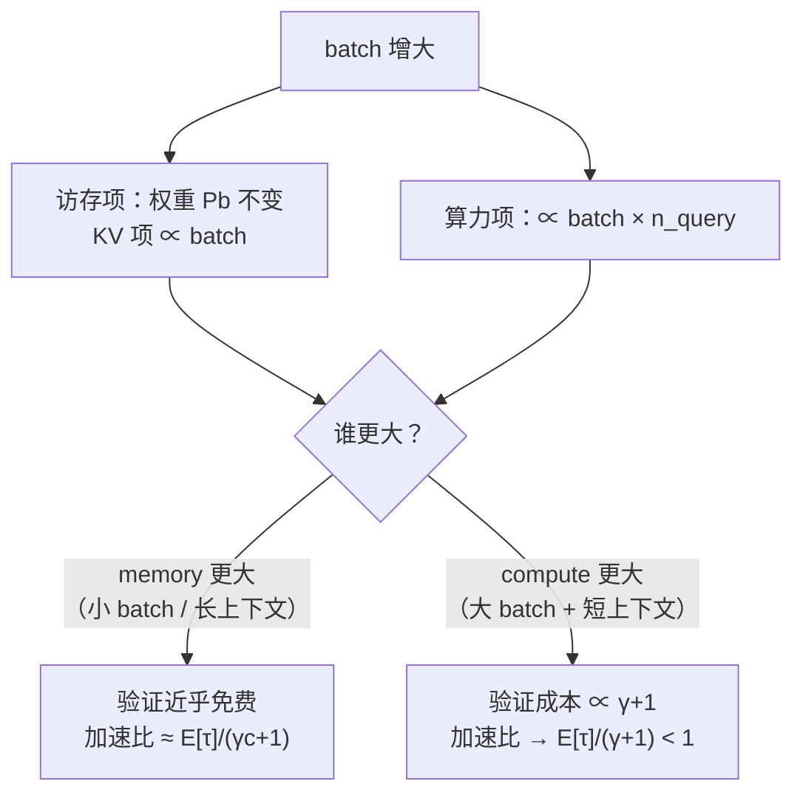

# 18 batch 与吞吐 —— 收益衰减曲线

## 1. 一句话

投机采样的加速比不是一个常数，它是 batch 的**单调递减函数**，而且这条曲线有一个可以算出来的**渐近线**：一旦验证前向进入 compute-bound 区，加速比收敛到

$$
\frac{E[\tau]}{\gamma+1}\times\big(1-\text{草稿开销占比}\big)\ <\ 1
$$

这个极限**恒小于 1**，而且**调参救不了** —— 即使把接受长度顶到理论上限 $\gamma+1$，也只能勉强打平。

**但这条渐近线有一个前提，本篇初稿把它漏了（2026-08-22 经对抗审稿查出并补上）**：它要求**基线前向也进入 compute-bound 区**。batch 足够大时访存项与算力项**都正比于 batch，batch 被约掉**，于是谁主导只由 seqlen 决定。本篇配置下 seqlen 超过约 **2 960** 时，**交叉点根本不存在** —— batch 加到 $10^6$ 加速比仍是 2.14。所以正确的表述是：**短上下文下"投机解码在大 batch 会亏"是算术，长上下文下它根本不成立**。详见 §4.6。

---

## 2. 从哪来

[[06-期望接受长度与加速比模型-完整推导]] 给出的 $\text{speedup}=E[\tau]/(\gamma c+1)$ 里，分母那个 $1$ 代表"一次目标模型前向"，并**默认它与生成 1 个 token 同价**。[[03-并行验证为什么几乎免费-算术强度与roofline]] 说明了这条只在 memory-bound 区成立。

本篇要回答的就是：**离开那个区之后会怎样，以及边界在哪。**

这不是一个学术问题。线上服务的 batch 由 QPS 决定，而 QPS 是波动的：凌晨 batch=2，高峰 batch=200。**同一套配置在一天之内会从"加速 2.8 倍"走到"降速 40%"**，而多数团队只在低负载下测过。

---

## 3. 机制拆解

### 3.1 三条时间线

一次投机迭代包含两段（模型见 `_lab/speedup.py`）：

$$
T_{\text{iter}}=\underbrace{\sum_{i=0}^{\gamma-1}T_{\text{draft}}(\text{batch},\ \text{seqlen}+i,\ 1)}_{\gamma\ \text{次串行草稿前向}}
+\underbrace{T_{\text{target}}(\text{batch},\ \text{seqlen},\ \gamma+1)}_{1\ \text{次验证前向}}
$$

其中

$$
T(\cdot)=\max\!\left(\frac{P b+\text{batch}\cdot\text{seqlen}\cdot\text{kv}}{\text{BW}},\ \frac{\text{batch}\cdot n_q\cdot(2P+4L\,\text{seqlen}\,d_{\text{model}})}{\text{peak}}\right)
$$

基线是 $T_{\text{target}}(\text{batch},\text{seqlen},1)$ 产出 batch 个 token。（$L$ 为层数；attention 项必须乘 $L$，见文末勘误记录。）

### 3.2 关键的标度差异



**注意 $n_q$ 只出现在算力项里。** 这一条不对称同时解释了投机采样为什么能赢、以及为什么最终必输：

- memory 区：$n_q$ 不影响时间 → 验证 $\gamma+1$ 个 token 白送 → 赢；
- compute 区：时间 $\propto n_q=\gamma+1$ → 花了 $\gamma+1$ 份算力只换来 $E[\tau]$ 个 token → **算力利用率降为 $E[\tau]/(\gamma+1)$** → 输。

---

## 4. 逐步推导：渐近线

设已深入 compute 区（算力项主导）。此时

$$
T_{\text{target}}(\text{batch},\text{seqlen},n_q)=\frac{\text{batch}\cdot n_q\cdot F}{\text{peak}},\qquad F:=2P+4L\,\text{seqlen}\,d_{\text{model}}
$$

**基线吞吐**（tokens/s，全 batch 合计）：

$$
\text{TPS}_{\text{base}}=\frac{\text{batch}}{T_{\text{target}}(\cdot,1)}=\frac{\text{peak}}{F}
$$

**投机吞吐**：

$$
\text{TPS}_{\text{spec}}=\frac{\text{batch}\cdot E[\tau]}{T_{\text{iter}}}
=\frac{\text{batch}\cdot E[\tau]}{T_{\text{draft,total}}+\dfrac{\text{batch}(\gamma+1)F}{\text{peak}}}
$$

把分子分母同除 batch，令 $s:=T_{\text{draft,total}}/T_{\text{iter}}$ 为草稿占迭代的比例：

$$
\text{TPS}_{\text{spec}}=\frac{E[\tau]}{(1-s)^{-1}\cdot\dfrac{(\gamma+1)F}{\text{peak}}}
=\frac{\text{peak}}{F}\cdot\frac{E[\tau]}{\gamma+1}\cdot(1-s)
$$

两式相除：

$$
\boxed{\ \lim_{\text{batch}\to\infty}\text{speedup}=\frac{E[\tau]}{\gamma+1}\,(1-s)\ }
\tag{4.1}
$$

**三条推论，逐条都很硬**：

1. **$\text{TPS}_{\text{spec}}$ 与 batch 无关**（batch 被约掉了）—— 投机吞吐在 compute 区**封顶**。
2. **$E[\tau]/(\gamma+1)\le 1$ 恒成立**（$\tau$ 的上界就是 $\gamma+1$），再乘上 $(1-s)<1$，**在本节的前提下极限严格小于 1**。
3. **$E[\tau]/(\gamma+1)$ 就是"算力有效利用率"**：你让目标模型算了 $\gamma+1$ 个位置，只有 $E[\tau]$ 个变成了产出，其余是**为了买信息而故意浪费的算力**。memory 区里这份浪费不要钱，compute 区里它按全价收费。

> **一句话总结机制**：投机采样是拿"算力"去买"延迟"。算力免费时（memory-bound）这笔交易稳赚；算力开始收费时（compute-bound），你买的东西一分没变，价格却涨到了全价。

### 4.6 上面那条推导漏了一个前提（2026-08-22 修正）

**本篇初稿在这里犯了一个错，必须原样交代。** §4 开头写的是"设已深入 compute 区（算力项主导）"，然后把**基线**也按 compute 区的公式写成 $\text{TPS}_{\text{base}}=\text{peak}/F$。**这一步偷偷多用了一个前提**：基线前向也得是 compute-bound。

为什么这是个真前提？把 batch 很大时的两项写出来：

$$
T_{\text{mem}}\approx\frac{\text{batch}\cdot\text{seqlen}\cdot\text{kv}}{\text{BW}},
\qquad
T_{\text{cmp}}=\frac{\text{batch}\cdot n_q\cdot F}{\text{peak}}
$$

（权重项 $Pb$ 与 batch 无关，batch 大时可忽略。）**两项都正比于 batch，batch 被约掉了。** 于是"谁主导"由一个**与 batch 无关**的比值决定：

$$
\frac{T_{\text{cmp}}}{T_{\text{mem}}}=\frac{n_q\,F}{\text{seqlen}\cdot\text{kv}}\cdot\frac{\text{BW}}{\text{peak}}
=\frac{n_q\,(2P+4L\,\text{seqlen}\,d_{\text{model}})}{\text{seqlen}\cdot\text{kv}\cdot(\text{peak}/\text{BW})}
\tag{4.5}
$$

（记号说明：$F$ 里的 attention 项严格说是 $4L\,	ext{seqlen}\cdot n_h d_h$，本篇的 llama3-70b 恰好 $n_h d_h=64	imes128=8192=d_{	ext{model}}$，两者相等；**MoE 上不相等**，见 [[23-与其它优化的相互作用-量化与KVcache与PD分离]] §4.7 与 `_lab/moe.py`。）

令 (4.5) 等于 1 解出临界 seqlen，本篇配置（llama3-70b，8×H100，$\gamma=4$）：

| | 临界 seqlen | 含义 |
|---|---|---|
| $n_q=1$（基线） | **1 499** | 超过它，**基线**无论 batch 多大都留在 memory 区 |
| $n_q=\gamma+1=5$（验证） | **8 437** | 超过它，**验证**也无论 batch 多大都留在 memory 区 |

于是 batch$\to\infty$ 的极限加速比按 seqlen 分成三段（复跑：见 §6 的 `_limit()`）：

| seqlen | 基线 / 验证 | batch$\to\infty$ 极限加速比 |
|---|---|---|
| 512 | compute / compute | 0.584 |
| 1 024 | compute / compute | **0.569** ← §4 那条渐近线，只在这一段成立 |
| 1 499 | compute / compute | 0.556 |
| 2 048 | memory / compute | 0.732 |
| **2 960** | memory / compute | **1.000** ← 极限跨过 1 的临界点 |
| 4 096 | memory / compute | 1.295 |
| 8 192 | memory / compute | 2.104 |
| 8 437 起 | memory / memory | **2.143（此后恒定）** |

**三条修正后的结论**：

1. **(4.1) 那条渐近线 $E[\tau]/(\gamma+1)(1-s)$ 只在 seqlen $<1\,499$ 时成立**（那时基线也 compute-bound）。§5 的 seqlen=1024 表正落在这一段，所以它的 0.566 与预测吻合 —— 那不是普适验证，是**区间内**的验证。
2. **seqlen $>2\,960$ 时交叉点根本不存在。** 不是"翻转点很远"，是**没有翻转点**：batch 加到 $10^6$，加速比仍是 2.14 并且已经收敛（`_lab/test_speedup.py::test_batch_cancels_out_at_large_batch`）。
3. 所以推论 1 原来的"交叉点必然出现，只是早晚"**是错的**，正确说法是：**短上下文下必然出现；长上下文下不会出现。**

**这条为什么值得单独写出来**：本库其实**早就有它的反证** —— `_lab/test_speedup.py::test_long_context_still_no_crossover_even_quantized` 断言的就是"长上下文下扫到 batch 8192 都没有交叉点"。**测试对了，正文的一般化说过头了。** 这提醒了一件事：`--tests` 只检查"引用的测试存在"，**不检查"正文的一般化没有超出测试覆盖的范围"** —— 后者只能靠人（或对抗审稿）看出来。

---

## 5. 模型输出表（解析模型，非硬件实测）

口径（**全表统一，不可与其它来源的数字横比**）：target = llama3-70b，draft = llama3.2-1b，$\gamma=4$，$E[\tau]=3.0$ 固定，fp16 权重与 KV，硬件 **8×H100 SXM5（TP=8，带宽/算力/容量按 8 倍线性放大，忽略通信）**，报的是**吞吐**（tokens/s，全 batch 合计）。70B fp16 权重 141 GB，单卡 80 GB 装不下，故必须多卡。**本模型忽略 TP 通信、norm/softmax、kernel launch 与调度，是乐观上界，真实翻转点只会更早。**

复跑：`python _lab/speedup.py --batch`

### seqlen = 1024（短上下文）

| batch | 基线 tok/s | 投机 tok/s | 加速比 | 验证阶段 | 草稿占迭代 | 显存 |
|---|---|---|---|---|---|---|
| 1 | 189.4 | 530.4 | **2.801** | memory | 6.6% | 144 GB |
| 16 | 2 925.6 | 8 109.0 | **2.772** | memory | 7.6% | 150 GB |
| 64 | 10 543.7 | 28 397.8 | **2.693** | memory | 10.2% | 167 GB |
| 128 | 18 628.3 | 30 367.7 | 1.630 | **compute** | 8.0% | 191 GB |
| 256 | 30 210.6 | 30 818.7 | 1.020 | compute | 6.6% | 238 GB |
| 384 | 38 108.6 | 30 972.1 | **0.813** ⚠ | compute | 6.2% | 285 GB |
| 512 | 43 839.2 | 31 049.3 | **0.708** ⚠ | compute | 5.9% | 333 GB |
| 768 | 51 598.1 | 31 127.0 | **0.603** ⚠ | compute | 5.7% | 427 GB |
| 1024 | 55 016.4 | 31 165.9 | **0.566** ⚠ | compute | 5.6% | 522 GB |

**请盯住"投机 tok/s"那一列**：从 batch=128 到 batch=1024，batch 涨了 8 倍，投机吞吐只从 30 368 涨到 31 166（**+2.6%**）—— 它封顶了，正如 (4.1) 推论 1 所言。而基线从 18 628 涨到 55 016（**+195%**），一路把投机甩在身后。

再验一次 (4.1)（**注意 seqlen=1024 落在 §4.6 的适用区间内**）：$E[\tau]/(\gamma+1)=3.0/5=0.600$，草稿占比 $s=5.6\%$，预测极限 $0.600\times0.944=\mathbf{0.566}$ —— 与表中 batch=1024 的实测值**完全一致**（`_lab/test_speedup.py::test_compute_bound_asymptote_equals_wasted_compute_ratio`）。

### seqlen = 16384（长上下文）

| batch | 基线 tok/s | 投机 tok/s | 加速比 | 验证阶段 | 草稿占迭代 | 显存 |
|---|---|---|---|---|---|---|
| 1 | 182.8 | 506.8 | **2.772** | memory | 7.6% | 150 GB |
| 16 | 1 888.2 | 4 740.2 | **2.510** | memory | 16.3% | 238 GB |
| 64 | 3 538.0 | 8 139.6 | **2.301** | memory | 23.3% | 522 GB |
| 128 | — | — | — | — | — | 900 GB **装不下** |
| ≥256 | — | — | — | — | — | 1 656 GB+ **装不下** |

**这一段不翻转 —— 而且不是"翻转点够不着"，是根本没有翻转点。**

初稿在这里把不翻转归因成"显存装不下大 batch"，**那个归因是错的**（2026-08-22 修正）。按 §4.6，seqlen=16384 远超临界值 8 437，验证前向**无论 batch 多大都留在 memory 区**：把 batch 放到 $10^6$（早已远超任何硬件能装下的规模），极限加速比仍是 **2.143** 并且已收敛。**显存是另一条独立的约束，不是不翻转的原因。**

两件事要分开说：

- **物理上**：seqlen $>2\,960$ 时交叉点不存在（`_lab/test_speedup.py::test_no_crossover_at_all_above_critical_seqlen`）。
- **工程上**：能开多大 batch 另受显存限制（表中 batch$\ge$128 装不下，`::test_long_context_large_batch_may_not_fit`）。

于是流行说法"投机解码在大 batch 下没用"必须补上前提：**条件是短上下文（本配置下 seqlen $\lesssim3\,000$）**。这条与 MagicDec 等工作的结论方向一致，详见 [[22-长上下文下的投机采样]]。

---

## 6. 代码验证

```python
# _lab/speedup.py
def spec_throughput(target, draft, hw, batch, seqlen, gamma, accept_len):
    base = fwd_time(tm, hw, batch, seqlen, 1)
    t_draft = sum(fwd_time(dm, hw, batch, seqlen + i, 1)["t"] for i in range(gamma))
    t_verify = fwd_time(tm, hw, batch, seqlen, gamma + 1)["t"]
    t_iter = t_draft + t_verify
    return dict(base_tps=batch / base["t"],
                spec_tps=batch * accept_len / t_iter,
                speedup=(accept_len / t_iter) * base["t"], ...)
```

三条关键断言：

- 渐近线等于"算力浪费比"（§4 的 (4.1)）：`::test_compute_bound_asymptote_equals_wasted_compute_ratio`
- 投机吞吐封顶而基线继续涨（推论 1）：`::test_spec_throughput_saturates_while_baseline_keeps_climbing` —— batch 涨 8 倍投机吞吐涨不到 10%，基线涨超过 150%
- 加速比对 batch 单调递减：`::test_speedup_is_monotone_decreasing_in_batch`

---

## 7. 口径与坑

1. **本表报的是吞吐，不是延迟。** 这两者在大 batch 下会给出**相反**的结论：batch=384 时投机的吞吐是 0.813 倍（亏），但**单请求的 TPOT 仍然可能更好**（每轮产出 3 个 token）。所以"投机解码在大 batch 下有没有用"这个问题**问得不完整**，必须先说清优化目标是延迟还是吞吐。SLO 里若写的是 P99 TPOT，结论可能与本表相反。
2. **$E[\tau]=3.0$ 是假设值不是实测值。** 真实的 $E[\tau]$ 还会随 batch 变化（不同请求处在不同难度的位置，一批里的接受长度由最短的那条拖累 —— 见 §8 第 3 条），所以真实曲线比本表更陡。
3. **本模型忽略 TP 通信。** all-reduce 在 decode 阶段占比可观，而投机验证的 activation 是 $\gamma+1$ 倍大，通信量也随之上升。计入之后翻转点更早。
4. **不要把本表的数字与论文/blog 的加速比横比。** 本表是解析模型的乐观上界，口径也不同（吞吐 vs 延迟、模型组合、硬件）。铁律二在这里是硬约束。
5. **"草稿占迭代"随 seqlen 显著变化**（1024 下约 6%，16384 下升到 23%）。原因是草稿模型也要读自己的 KV cache，长上下文下这笔开销按比例放大。**草稿不是永远便宜的**。

---

## 8. 失效条件（本篇结论本身什么时候不适用）

1. **优化目标是延迟而非吞吐时**：见 §7 第 1 条，结论可能相反。
2. **长上下文时**：seqlen 超过临界值（本配置约 2 960）后**交叉点不存在**，§4 的渐近线整条不适用（§4.6）。显存是另一条独立约束，别把两者混为一谈。
3. **一批请求难度不齐时**：本模型假设整批共享同一个 $E[\tau]$。真实系统里一批里既有简单续写也有复杂推理，**同步验证意味着整批要等最慢的那条**，实际接受长度比单条平均值更低。这条会让真实曲线比本表更差，属于本模型**没有覆盖**的恶化因素。
4. **量化改变账本时**：权重量化到 int4 会把访存项砍到 1/4，屋脊点右移，**翻转点提前**（更容易 compute-bound）；KV cache 量化则相反地缓解长上下文的访存压力。见 [[23-与其它优化的相互作用-量化与KVcache与PD分离]]。
5. **MoE 模型 —— 有一个真实反例，必须写明。** 有效激活参数远小于总参数，访存与算力的比值整个变了：路由使得"每 token 的算力"按激活参数算，而"权重读取"在大 batch 下趋近全量，两者的比值远比稠密模型友好。本库调研（`_research/RS-2-社区讲解盘点与评点.md`）记录到 Red Hat 于 2026-04 报告，在 **gpt-oss-120b（MoE + MXFP4 量化）+ EAGLE3** 上并发到 **200 仍有约 +20% 吞吐** —— 这与本篇稠密模型的曲线方向相反。

   所以本篇 §4 的渐近线结论**有明确的适用范围**：它推的是"消耗 $\gamma+1$ 份算力换 $E[\tau]$ 个 token"这笔账，在稠密模型上成立；MoE 把"一份算力"的定义改了，账要重列。

   **2026-08-22 补**：本库已把 MoE 单独建模（`_lab/moe.py`），结论是**两头都和本篇相反**：
   MoE 上 batch=1 时投机反而**亏**（0.804×，因为 5 个 token 激活了 18.8 个专家而基线只激活 4 个，多读 3.6 倍权重），
   而在本篇稠密 70B 早已跌到 0.566× 的 batch=1024 上，MoE 仍有 **2.12×**。
   完整推导与四张表见 [[23-与其它优化的相互作用-量化与KVcache与PD分离]] §4.7，
   测试见 `_lab/test_moe.py::test_moe_sweet_spot_is_mid_batch_unlike_dense` 与 `::test_moe_still_profitable_where_dense_already_lost`。

---

## 9. 自测题

1. 为什么 compute 区里"投机吞吐与 batch 无关"？用 §4 的推导说明。**追问**：基线吞吐是不是也与 batch 无关？什么条件下是、什么条件下不是？
   <details><summary>答案要点</summary>compute 区里 $T_{\text{verify}}\propto\text{batch}\cdot(\gamma+1)$，而吞吐 $=\text{batch}\cdot E[\tau]/T_{\text{iter}}$，batch 在分子分母同时出现被约掉。物理含义：算力已经打满，产出速率由"每份算力能换几个 token"决定，与并发数无关。</details>

2. 某团队把 $\gamma$ 从 4 降到 2 来"减少大 batch 下的浪费"。假设 $E[\tau]$ 相应从 3.0 降到 2.0，compute 极限下的加速比会变好吗？
   <details><summary>答案要点</summary>$E[\tau]/(\gamma+1)$ 从 $3/5=0.60$ 变成 $2/3=0.667$，**确实变好了**，但仍然 <1。降 $\gamma$ 能减轻亏损但不能扭亏 —— 因为只要 $E[\tau]<\gamma+1$ 就有浪费。极限情况 $\gamma\to0$ 时退化成不开投机（比值→1）。**这说明大 batch 下正确的动作是关掉投机，而不是调小 $\gamma$。**</details>

3. 如果把接受长度顶到理论上限 $E[\tau]=\gamma+1$（全部接受），compute 极限下加速比是多少？
   <details><summary>答案要点</summary>$E[\tau]/(\gamma+1)=1$，再乘 $(1-s)$，得到略小于 1 —— 只能**打平偏亏**，亏掉的正是草稿的开销。本库实测该情形加速比落在 0.9–1.0 之间（`_lab/test_speedup.py::test_higher_accept_length_raises_but_cannot_save_asymptote`）。含义：compute 区里投机采样**在吞吐意义上最好也就是不亏**。</details>

4. 表里 batch=256 时加速比 1.020，几乎打平。如果你是这套服务的负责人，会怎么设置策略？〔2026-08-22 对抗审稿修正：本题原写 1.038 与 0.827，是 attention FLOPs 漏乘层数那个 bug 修复**之前**的旧值，与 §5 表格（1.020 / 0.813）及文末勘误记录不一致。〕
   <details><summary>答案要点</summary>关键在于此处曲线很陡（256→384 就掉到 0.813），且真实系统比模型更差（§8 第 3、5 条）。合理做法是**按当前 batch 动态开关投机**，阈值设在明显低于模型给出的翻转点处（因为模型是乐观上界），并且监控的应当是实测吞吐与 P99 TPOT 两条线，而不是理论加速比。相关实践见 [[19-负收益全解-什么时候投机反而更慢]] 与 [[20-主流引擎实现-vLLM与SGLang与TensorRTLLM]]。</details>

5. 为什么长上下文那张表里"草稿占迭代"从 6% 升到 23%？这说明了什么？
   <details><summary>答案要点</summary>草稿模型也要读自己的 KV cache，KV 流量 $\propto$ batch·seqlen，长上下文下草稿的访存开销按比例放大，而它的权重很小、原本主要成本就是访存。含义：**"草稿很便宜"这个前提在长上下文下会松动**，选草稿时要看的不只是参数量，还有它的 KV 结构（层数 × KV 头数）。</details>

---

## 10. 延伸与双链

- 物理地基与"免费"的边界：[[03-并行验证为什么几乎免费-算术强度与roofline]]
- 分母那个 $1$ 的来历：[[06-期望接受长度与加速比模型-完整推导]]
- 完整的负收益判定清单：[[19-负收益全解-什么时候投机反而更慢]]
- 长上下文为什么不翻转：[[22-长上下文下的投机采样]]
- 量化/MoE/PD 分离如何改写这本账：[[23-与其它优化的相互作用-量化与KVcache与PD分离]]
- 树规模也算进 query token 数：[[16-树形草稿与树注意力-mask构造与验证]]
- 引擎里的自适应开关：[[20-主流引擎实现-vLLM与SGLang与TensorRTLLM]]
- 误解清单：[[27-常见误解与判据]]

---

### 本篇验证

- `_lab/test_speedup.py::test_asymptote_formula_holds_only_when_baseline_is_compute_bound` —— **§4.6 的核心**：渐近线只在基线也 compute-bound（seqlen<1499）时成立，seqlen=16384 时极限反而 >2。
- `_lab/test_speedup.py::test_batch_cancels_out_at_large_batch` —— batch 被约掉，极限是只依赖 seqlen 的常数。
- `_lab/test_speedup.py::test_no_crossover_at_all_above_critical_seqlen`、`::test_crossover_still_exists_at_short_context`、`::test_critical_seqlen_is_around_3000` —— 三段式的边界。
- `_lab/test_speedup.py::test_verify_returns_to_memory_bound_at_very_long_context` —— seqlen>8437 后极限恒定。
- `_lab/test_speedup.py::test_compute_bound_asymptote_equals_wasted_compute_ratio` —— **验证 §4 的 (4.1)**：compute 极限下加速比 = $E[\tau]/(\gamma+1)\times(1-s)$，实测 0.566 与预测吻合到 0.01 以内。
- `_lab/test_speedup.py::test_spec_throughput_saturates_while_baseline_keeps_climbing` —— 验证推论 1：batch 涨 8 倍，投机吞吐涨不到 10%，基线涨超过 150%。
- `_lab/test_speedup.py::test_higher_accept_length_raises_but_cannot_save_asymptote` —— 验证推论 2：$E[\tau]$ 顶到 $\gamma+1$ 也只能打平偏亏。
- `_lab/test_speedup.py::test_speedup_collapses_at_large_batch_short_context` —— 短上下文大 batch 下加速比 <1 且验证已 compute-bound。
- `_lab/test_speedup.py::test_speedup_is_monotone_decreasing_in_batch` —— 加速比对 batch 单调递减。
- `_lab/test_speedup.py::test_long_context_keeps_speedup_at_large_batch` —— 长上下文下不翻转。
- `_lab/test_speedup.py::test_long_context_large_batch_may_not_fit` —— 但受显存约束。
- `_lab/test_speedup.py::test_verify_stops_being_free_in_compute_bound_region` —— compute 区里验证时间随 query token 数线性涨（机制）。
- `_lab/test_moe.py::test_moe_sweet_spot_is_mid_batch_unlike_dense`、`::test_moe_still_profitable_where_dense_already_lost` —— **本篇结论的适用边界**：MoE 上最优区间不在小 batch，且能一直赚到稠密早已翻转的 batch。
- 可复跑：`python _lab/speedup.py --batch` —— §5 的两张实测表

### 本篇勘误记录

本篇初稿的数字由 `_lab/speedup.py` 的早期版本算出，那个版本的 attention 浮点数写成
$4\,s\,d_{\text{model}}$，**漏乘了层数 $L$**（正确为 $4L\,s\,d_{\text{model}}$）。
该 bug 在写第 03 篇的过程中被查出并已修复，本篇表格已用修正后的模型重算。

影响：seqlen=1024 下 attention 项只占 $2P$ 的约 0.02%，故加速比只有第三位小数级变化
（如 batch=256 从 1.038 变为 1.020），**交叉点位置与 §4 的渐近线结论均未改变**；
seqlen=16384 的可行行仍全部落在 memory 区，结论不变。
回归测试：`_lab/test_speedup.py::test_attention_flops_include_layer_count`。

**第二处勘误（2026-08-22，对抗审稿查出）**：§4 的渐近线推导**漏写了一个前提** —— 它要求基线前向也 compute-bound。
初稿据此在 §1 与推论 1 里把"交叉点必然出现""极限恒小于 1"写成了普适结论，
而实际上 seqlen 超过约 2 960 时交叉点根本不存在（batch 加到 $10^6$ 仍是 2.14×）。
§4.6 已补齐推导与三段式的极限表，§1、§5、§8 的相应表述已改。
本库其实早有反证（`::test_long_context_still_no_crossover_even_quantized`）——**测试是对的，正文的一般化说过头了**。
新增 6 条回归测试锁住修正后的结论：`::test_batch_cancels_out_at_large_batch`、
`::test_asymptote_formula_holds_only_when_baseline_is_compute_bound`、
`::test_no_crossover_at_all_above_critical_seqlen`、`::test_crossover_still_exists_at_short_context`、
`::test_critical_seqlen_is_around_3000`、`::test_verify_returns_to_memory_bound_at_very_long_context`。

### 本篇来源

- 本篇的模型与数字全部来自本库自建的解析模型 `_lab/speedup.py`，**不是硬件实测**。它的价值在于把"为什么必然翻转"讲成可推导、可复算的形式；它的局限在 §7、§8 已逐条声明。真实硬件上的实测数据见 [[19-负收益全解-什么时候投机反而更慢]] 收集的第三方基准。
- 硬件规格：NVIDIA H100 SXM5，HBM3 带宽 3.35 TB/s，BF16 **稠密**峰值 989.5 TFLOPS（含稀疏的 1979 TFLOPS 不适用于本场景）。屋脊点 $989.5/3.35\approx295$ FLOP/Byte。
- 本仓库既有材料：`MLOPS/02-推理服务案例/推理08-投机解码的负收益.md` 记录了单个案例；本篇补的是**为什么必然如此**的解析推导与渐近线闭式。
