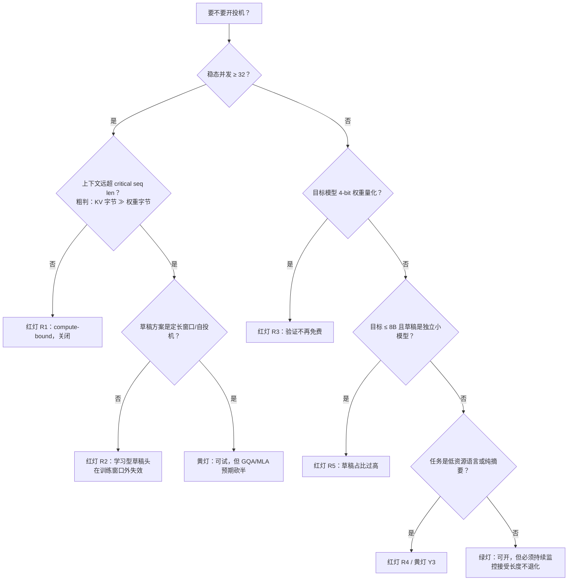
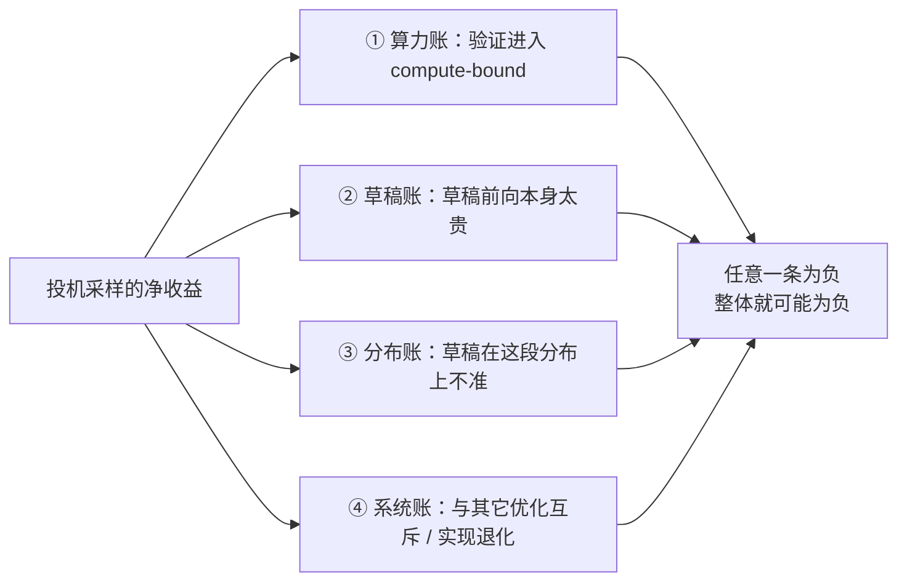

# 19 负收益全解 —— 什么时候投机反而更慢

## 1. 一句话

投机采样是一笔**用算力换延迟**的交易，这笔交易经常是亏的。本篇不讲"可能效果不好"，只做一件事：把"什么时候亏"写成**可测量的判定清单**，再用公开基准数据一条条钉死 —— 包括那张唯一明确穿过 1.0× 的批大小扫描表，和三条"接受率很高但仍然比不开还慢"的硬证据。

---

## 2. 判定清单（本篇的结论，放在最前面）

先给清单，再讲为什么。每条都给**可测量的触发条件**，不给"视情况而定"。

### 2.1 红灯：符合任意一条，默认关闭投机，除非你有**本机实测**反证

| # | 触发条件（可测量） | 机制 | 证据 |
|---|---|---|---|
| **R1** | 稳态 batch size / 并发 **≥ 32**，且上下文 **< 4K** | 验证前向从 memory-bound 掉进 compute-bound，草稿 token 不再免费 | §5（EAGLE 在 bs=32 为 0.93×、bs=56 为 0.71×） |
| **R2** | 草稿头**训练窗口 < 实际输入长度**（典型：公开 EAGLE-3 checkpoint 训练窗口 2048，请求 8K+） | 草稿头外推失败，接受长度塌到约 1.3，草稿开销纯亏 | §8.2（OWL：EAGLE3 在 4K–64K 输入、batch size=1 下 **0.81×**） |
| **R3** | 目标模型是 **4-bit 权重量化**（W4A16 / W4A8） | 量化已把权重加载时间砍掉，验证的额外算力再无处可藏 | §4.4（W4A16 8B + EAGLE-2 在 RTX 3090 单批下**零加速增益**） |
| **R4** | 主要负载是**低资源语言 / 多语言翻译** | 小草稿模型的多语言能力塌方，ᾱ≈0.30–0.54 | §7.2（11 种低资源语言，ᾱ=0.40 → **1.02×**） |
| **R5** | 草稿是**独立小模型**且目标模型 **≤ 8B** | 草稿前向在 batch size=1 时可占执行时间 **47%**，且草稿自带 KV cache 挤掉批容量 | §4.2、§7.3 |
| **R6** | 目标是**超大 MoE**，且在 batch size=1 就只有约 1.1× | 验证多个 token 会激活更多专家，验证不再近似免费 | §4.4 |
| **R7** | **消费级 GPU**，算力与带宽同时不足 | 没有可挪用的闲置算力 | §4.1（2×RTX 5060 Ti：88.3 → 88.2 tok/s，0%） |

### 2.2 黄灯：必须先做 A/B 实测，不许直接上线

| # | 条件 | 要测什么 |
|---|---|---|
| **Y1** | 并发在 **8–32** 之间波动 | 测**你自己**的交叉点。公开来源的交叉点从 batch size 8 到 128+ 都有（§12.5），**没有通用阈值** |
| **Y2** | 业务温度 **T≈0.6–1.0** | 同一套配置 T=0→1 加速比掉 3.6%–30.2%（§7.4） |
| **Y3** | 任务分布里**摘要 / 开放对话**占比高 | 摘要是接受长度最差的一档（同表内 CNN/DM 3.65× vs HumanEval 4.85×，batch size=1） |
| **Y4** | 同时开了 **prefix caching**，且是长上下文高前缀复用场景 | 监控 TTFT 与 prefix cache 命中率，不要只看 TPOT（§9.3） |
| **Y5** | 用了 **FlashMLA** 或特定 attention backend | 确认 decode 路径支持 `query_len > 1`，否则多 token 投机被迫走 prefill kernel（§9.4） |
| **Y6** | 服务要**连续跑数小时不重启** | 接受长度存在随运行时间单调退化的未修复 bug（§9.2）——**短时压测结论不可信** |

### 2.3 绿灯：这些场景收益最稳

| # | 条件 | 证据 |
|---|---|---|
| **G1** | batch size 1–4 的低延迟单请求（本地助手、IDE 补全） | §5.1 全表最高档 |
| **G2** | 输入输出**高度重叠**的任务（代码编辑、RAG 改写、agent 循环） | n-gram 在 InstructCoder 上平均接受 7.27 token（batch size=1，H100，每步 3 草稿 token） |
| **G3** | **长上下文 + 大批**，且草稿侧用**定长窗口 / 自投机** | §8.1（MagicDec：batch 32–128、32K prefill 下 1.91–2.0×，MHA 模型） |
| **G4** | 推理 / 长思维链生成 | §7.1（SAM[EAGLE-3] 多轮思考 3.97×，batch size=1） |

### 2.4 决策树



> **一条元规则**：投机解码的收益**不是模型属性**，是「模型 × 硬件 × 负载 × 任务」四元组的属性。同一个方法（EAGLE 系）在公开来源里的实测值域是 **0.71× ~ 4.40×**。**任何不带这四项的加速比宣称，都应当按营销文案处理。**

---

## 3. 从哪来：为什么必须有这一篇

[[18-batch与吞吐-收益衰减曲线]] 已从解析模型证明"交叉点必然存在"，[[06-期望接受长度与加速比模型-完整推导]] 已说明加速比公式的分母什么时候崩掉。那两篇是**推导**。本篇是它们的**实证与工程对应物**，回答推导答不了的三件事：

1. **交叉点在实测里长什么样？** 模型能证明它存在，但它在你那台机器上落在哪，模型说了不算。
2. **除了 batch，还有哪些独立的亏损通道？** 模型只有一条（算力账），真实系统有四条，其中两条压根不在 decode 上。
3. **怎么在上线前判定？** 这是清单的价值，也是本库区别于原理讲解的地方。

本篇的实测数字全部来自第三方公开来源，**逐条带口径**；解析数字来自本库 `_lab/speedup.py`，**明确标注为模型而非实测**。两者并排放，但**不合表**（铁律二）。

---

## 4. 机制拆解：负收益有四个**独立**的来源

多数讨论只讲第一条。真实事故里另外三条至少占一半。



### 4.1 ① 算力账：投机需要的不是 memory-bound，是「**闲置算力**」

流行说法是"decode 是 memory-bound，所以投机有用"。准确的说法是：**投机需要有算力可以白拿**。memory-bound 只是"有闲置算力"的常见充分条件，不是等价条件。反证来自消费级硬件 —— 口径：2×NVIDIA RTX 5060 Ti（16GB×2）、llama.cpp、Q4_K_M、8K 上下文、n-gram（`--draft-max 64 --draft-min 48`）、单请求（未给 batch size，推定为 1）。**【口径不全，不可横向比较】**

| 模型 | 基线 | 开 ngram-mod | 变化 |
|---|---|---|---|
| Gemma 4 26B-A4B（MoE） | 88.3 tok/s | 88.2 tok/s | **0%** |
| Qwen3-32B（Dense） | 20.4 tok/s | 20.6 tok/s | **+1%** |

跨 8 个不同 prompt 测试，作者结论是 *"Zero improvement"*；只有**重复同一 prompt** 第 10 次才出现约 5× 加速（那是 n-gram 缓存命中，不是泛化收益）。作者诊断：瓶颈是 *"memory bandwidth, not compute"*，消费级卡**缺少 A100/H100 那样的算力/带宽比**。来源：https://dev.to/defilan/i-tested-speculative-decoding-on-my-home-gpu-cluster-heres-why-it-didnt-help-3ej6

> 机制讲清了：投机赚的是**算力/带宽比高的卡上那份用不掉的算力**。卡本身算力就不够时，没有东西可挪用。

### 4.2 ② 草稿账：草稿前向可以吃掉一半时间

口径：H100、vLLM v0.10.1.1、每步提议 3 个草稿 token。来源：SpecDecode-Bench，https://arxiv.org/html/2601.11580v1 （2026-01）

| 草稿方案 | 草稿阶段占执行时间 | GPU 显存开销 |
|---|---|---|
| n-gram | **< 2%** | **0** |
| EAGLE / EAGLE-3（单层草稿头） | 原文未单列百分比 | 权重 + KV cache **< 10%** |
| 独立 draft model（Qwen3-0.6B 配 Qwen3-8B） | **batch size=1 时 47%**，batch size=512 时 16% | per-token 显存 **×1.77** |

验证阶段占 **42%–95%**。**读法**：独立小模型在**低批**（投机最该发光的区间）把接近一半时间花在草稿上，还把每 token 显存抬到 1.77 倍，从另一个方向压缩批容量、伤吞吐。这是红灯 R5 的依据，也是业界从"独立小模型"转向"单层草稿头"的第一动因（见 [[13-EAGLE三代-特征级自回归的演进]]）。

### 4.3 ③ 分布账：草稿在这段分布上准不准

草稿准不准不是模型的固有属性，而是"草稿 × 这段负载"的属性。三个已被实测的塌方通道：**低资源语言**（§7.2）、**训练窗口外的长上下文**（§8.2）、**任务类型切换**（摘要 vs 代码，§7.4）。

### 4.4 ④ 系统账：亏在 decode 之外

这一类最难自查，因为你监控的指标可能根本看不到它。

**4-bit 权重量化** —— *Speculative Decoding Meets Quantization*（https://arxiv.org/html/2505.22179v1 ，2025-05）。口径：EAGLE-2；Llama-3-8B-Instruct / Llama-3-70B-Instruct；A100 80GB 与 RTX 3090；**单批**。核心结论逐字：*"applying EAGLE-2 on 4-bit weight quantized models (W4A16 and W4A8) yields limited additional speedups"*；最强负结果是 **RTX 3090 上 W4A16 的 8B 模型 + EAGLE-2 → 无加速增益（单批）**。定量：**60 个草稿 token 时 W4A16 的 verification ratio 达 1.8，FP16 / W8A8 为 1.2**（理想值 1.0）—— "验证近似免费"这个前提直接破产。归因逐字：*"the heavy computation time required during draft verification undermines the memory efficiency gained by 4-bit weight quantization."* **W8A8-FP8 下的同类定量数字，本库未查到，标「未查证」。**

**MoE 的专家足迹膨胀** —— 验证成本取决于所有被验 token 激活专家的**并集**。EcoSpec（https://arxiv.org/html/2607.12696v1 ，2026-07）口径 8×H200、**batch size=1**、T=0：Qwen3-235B-A22B + EAGLE-3 = **1.22×**；GPT-OSS-120B + EAGLE-3 = **1.14×**；DeepSeek-V3.1 671B + MTP = **1.10×**。对照：dense 的 Llama-3.1-8B + EAGLE-3 在 batch size=1 是 4.40×（EAGLE-3 论文 Table 1）。

> ⚠️ MoE 上"更受益还是更受损"在公开来源里是**四方混战**（Cohere 说 batch size=1 就有 1.95×，MoESD 说中等 batch 更受益，Meta 说 400B MoE 加速比随 batch 下降，EcoSpec 说超大 MoE 只有 1.10–1.22×），差异全在 MoE 规模稀疏度、所处 batch 区间、对照基准三项没对齐。**唯一可执行的判据**：测「验证 γ+1 个 token 时激活的专家并集」÷「验证 1 个 token 时激活的专家数」。比值≈1 → MoE 比 dense 更受益；比值接近 γ+1 → 差得多。**不要用别人的 MoE 结论。**

**其余系统账**：prefix cache 被破坏（§9.3）、CUDA Graph 回退 / 走 prefill kernel（§9.4）、批量对齐开销（§13.3）。

---

## 5. 逐步走查（一）：解析模型说必然翻转，Table 5 说确实翻转

这是本篇最重要的一节：把**推导**与**实测**并排放，看它印证了什么、又在哪不一样。

### 5.1 实测侧：目前唯一一张明确穿过 1.0× 的公开批大小扫描表

**口径**：GPU = RTX 3090；目标 = LLaMA-Instruct 3.1 8B；基线 = 未开投机的 vLLM，归一化为 1.00×；指标 = **吞吐比**。**口径缺项**：原文该表**未给出** γ / 树规模、逐 batch 接受长度、温度、数据集、精度。→ **【口径不全，不可与其它来源横比】** 来源：EAGLE-3 论文 Table 5，https://arxiv.org/html/2503.01840 （2025-03）

| batch size | 2 | 4 | 8 | 16 | 24 | 32 | 48 | 56 |
|---|---|---|---|---|---|---|---|---|
| **EAGLE** | 1.30× | 1.25× | 1.21× | 1.10× | **1.03×** | **0.93×** | 0.82× | **0.71×** |
| **EAGLE-3** | 1.75× | 1.68× | 1.58× | 1.49× | 1.42× | 1.36× | 1.21× | 1.01× |

三条读数：① **EAGLE 的盈亏平衡点落在 batch size 24 与 32 之间**，bs=32 起是净亏损，bs=56 时**比不开投机慢 29%**；② **EAGLE-3 把平衡点推到 batch size 56 附近**（1.01× ≈ 打平）；③ **两行都在单调下降，没有回升迹象**。

> ⚠️ **该论文正文与自己的表格自相矛盾**：正文写 *"EAGLE shows the maximum throughput improvement at a batch size of 24"*，但表里 EAGLE 的最大值在 bs=2（1.30×），bs=24 只有 1.03×。正文大概率想说"保持正收益的最大 batch 是 24"。**引用时以表为准**（详见 §12.2）。

### 5.2 理论侧：解析模型早就预言了这三条

[[18-batch与吞吐-收益衰减曲线]] §4 推出的 compute 极限（此处不重复推导）：

$$
\lim_{\text{batch}\to\infty}\text{speedup}=\frac{E[\tau]}{\gamma+1}\,(1-s),\qquad s=\frac{T_{\text{draft}}}{T_{\text{iter}}}
$$

由于 $E[\tau]\le\gamma+1$ 恒成立、$(1-s)<1$，这个极限**严格小于 1**。三条推论正好对上三条读数：

| 解析模型的预言 | Table 5 的实测 | 对上了吗 |
|---|---|---|
| 加速比对 batch 单调递减 | EAGLE 行 1.30→1.25→1.21→1.10→1.03→0.93→0.82→0.71，**严格单调** | ✅ |
| 极限 < 1，故**交叉点必然存在且有限** | EAGLE 在 batch size 24–32 之间穿过 1.0× | ✅ |
| 交叉点位置由 $E[\tau]$、$\gamma$、$s$ 共同决定，**不是常数** | 同硬件同模型，只换草稿方案，交叉点从约 28 移到约 56 | ✅ |

对应验证：`_lab/test_speedup.py::test_speedup_collapses_at_large_batch_short_context`、`_lab/test_speedup.py::test_compute_bound_asymptote_equals_wasted_compute_ratio`。

### 5.3 差异在哪：模型是**乐观上界**，真实交叉点更早，位置不可搬运

**第一，两者口径完全不同，数值不可比。** 本库解析模型的口径：target=llama3-70b、draft=llama3.2-1b、γ=4、$E[\tau]$=3.0 固定、fp16、**8×H100（TP=8，忽略通信）**、seqlen=1024、报吞吐。Table 5 的口径：**单张 RTX 3090**、8B 目标、EAGLE / EAGLE-3 草稿头、γ 与温度未给出。**把这两组数字放进同一张表比较是违反铁律二的**，本节只比**形状**。

**第二，形状高度一致，batch 轴被拉伸。** 下表为本篇用**当前版** `_lab/speedup.py` 复算（该文件的 attention 算力项已修正为含层数 $L$，修正后模型不那么乐观、翻转更早；[[18-batch与吞吐-收益衰减曲线]] 若仍显示修正前的数值，以本表为准）：

| 解析模型（8×H100，70B，seqlen=1024）batch | 128 | 256 | 384 | 512 |
|---|---|---|---|---|
| 加速比 | 1.630 | 1.020 | **0.813** | **0.708** |

| Table 5（RTX 3090，8B，EAGLE）batch | 16 | 24 | 48 | 56 |
|---|---|---|---|---|
| 加速比 | 1.10 | 1.03 | **0.82** | **0.71** |

取值序列高度接近（0.813 / 0.82、0.708 / 0.71），只是 batch 轴差了约 8–9 倍 —— 解析模型跑的是 70B 在 8 张卡上，屋脊点对应的 batch 自然大得多。但**这条对齐不能当成定量结论**（口径不同，且 $E[\tau]$=3.0 是假设值不是实测值）。它能支持的结论只有一条：**解析模型给对的是曲线的形状，给不了你自己那台机器的交叉点位置。**

**第三，真实交叉点只会比模型算出来的更早**，因为模型系统性忽略了：TP all-reduce 通信（验证的 activation 是 γ+1 倍大）、一批请求难度不齐（同步验证要等最慢那条）、批量投机的**对齐开销**（batch size=1 约 13% → batch size=32 接近 40%，见 §13.3）、kernel launch / 调度 / CUDA Graph 回退（§9.4）。

> **可执行结论**：把解析模型算出的翻转点当作**上界**，实际开关阈值设在明显更低处，并且**必须在自己的硬件与负载上扫并发画曲线**。交叉点在公开来源里分布于 batch size 8 到 128+（§12.5），**取平均值当阈值是错的用法**。

---

## 6. 逐步走查（二）：改进草稿质量**不能消除**交叉点，只能把它右移

这是 §5.1 那张表能支撑的最强结论，而且可以**在同一张表内部**验证，不需要跨来源（铁律二安全）。

### 6.1 论证：模型说"提高 $E[\tau]$ 是给整条曲线乘常数"

两个区的加速比表达式（来自 [[06-期望接受长度与加速比模型-完整推导]] 与 [[18-batch与吞吐-收益衰减曲线]]）：memory 区 $\text{speedup}\approx E[\tau]/(\gamma c+1)$；compute 区 $\text{speedup}\to E[\tau]/(\gamma+1)\cdot(1-s)$。

**两个式子都对 $E[\tau]$ 线性。** 所以若 $\gamma$ 与草稿成本 $c$ 不变、只把草稿变准，整条加速比-batch 曲线应当被**乘上一个近似常数** $E[\tau]'/E[\tau]$，而不是改变形状。一条乘了常数的单调递减曲线，只可能把 1.0 交叉点**往右挪**，不可能挪到无穷远 —— 因为渐近线也被同样地乘了，而它的上限是 $1\cdot(1-s)<1$。

### 6.2 实测：Table 5 内部的倍率确实近似常数

逐格算 EAGLE-3 ÷ EAGLE（算术直接在 §5.1 的表上做，可手算复核）：

| batch size | 2 | 4 | 8 | 16 | 24 | 32 | 48 | 56 |
|---|---|---|---|---|---|---|---|---|
| EAGLE-3 / EAGLE | 1.346 | 1.344 | 1.306 | 1.355 | 1.379 | 1.462 | 1.476 | 1.423 |

倍率在 **1.31–1.48** 之间，全表均值 1.386 —— **近似常数，正如模型预言**。（大 batch 端略高，方向上说得通：那里两条曲线都接近各自渐近线，比值趋于 $E[\tau]_3/E[\tau]_1$。）

### 6.3 一次样本外预测：用小 batch 的倍率，预测 EAGLE-3 的交叉点

为避免循环论证，**只用 EAGLE 尚未跌破 1.0 的那一段**（batch size 2–24）估倍率：$\bar r=(1.346+1.344+1.306+1.355+1.379)/5=1.3458$。

若 EAGLE-3 曲线 ≈ $\bar r\times$ EAGLE 曲线，则 EAGLE-3 跌破 1.0 的位置，就是 EAGLE 曲线跌到 $1/\bar r=0.743$ 的位置。在 EAGLE 行上线性插值（batch size=48 是 0.82，batch size=56 是 0.71）：

$$
b^\*\approx 48+\frac{0.82-0.743}{0.82-0.71}\times 8=\mathbf{53.6}
$$

**实测**：EAGLE-3 在 batch size=48 是 1.21、batch size=56 是 1.01，按同样插值外推，跌破 1.0 在 **batch size ≈ 56.4**。

> **预测 53.6，实测 56.4，误差约 5%。** 倍率只用了 batch size=2–24 的五格，而交叉点落在 48–56 之间，是一次真正的样本外核对。它说明：**"把草稿做得更准"在数据上就是"给曲线乘一个常数"，交叉点因此右移了约 2 倍，但它还在那儿。**

### 6.4 硬墙：大到某个 batch，**接受率再高也保不了本**

模型给出更强的一条：`_lab/speedup.py` 可直接算**保本所需的接受长度**。口径：target=llama3-70b，draft=llama3.2-1b，γ=4，seqlen=1024，8×H100（TP=8），fp16。**解析模型，非实测。**

| batch size | 64 | 128 | 256 | 384 | 512 | 768 | 1024 |
|---|---|---|---|---|---|---|---|
| 保本所需 $E[\tau]$ | 1.11 | 1.84 | 2.94 | 3.69 | 4.24 | 4.97 | **5.30** |
| 占理论上限 $\gamma+1=5$ 的比例 | 22% | 37% | 59% | 74% | 85% | 99% | **106%** ⚠ |

**batch size=1024 那一格保本线 5.30，超过 γ+1=5 的理论上限** —— 在那个工作点上，**哪怕草稿 100% 被接受、每轮吃满 5 个 token，仍然亏本**。把 $E[\tau]$ 顶到 5 复算得到的加速比是 **0.944**（`_lab/test_speedup.py::test_higher_accept_length_raises_but_cannot_save_asymptote`、`_lab/test_speedup.py::test_breakeven_can_exceed_theoretical_max`）。

> **两条合起来才是完整结论**：① 提高草稿质量把交叉点右移（§6.3，实测约 2 倍）；② 但右移有尽头 —— 过了某个 batch，**上限本身低于保本线**，此时唯一正确的动作是**关掉投机**，不是调参。
> 顺带回答一个常见问题：把 γ 从 4 调到 2 能救吗？$E[\tau]/(\gamma+1)$ 从 3/5=0.60 变成 2/3=0.667，**减亏但不扭亏**；γ→0 就是不开投机。**大 batch 下正确的动作是关，不是调小 γ。**

---

## 7. 反例：接受率很高但**仍然亏** —— 三条硬证据

这一节直接推翻一个极普遍的做法：**看接受率做决策**。先钉死三个量的区别（详见 [[05-接受率alpha-定义口径与怎么测]]）：**接受率 α**（每个草稿 token 被接受的概率）、**接受长度 τ**（一次目标前向平均产出几个 token）、**加速比**（实测墙钟时间之比，已扣掉草稿与验证开销）。**前两个是过程指标，只有第三个是收益指标。**

### 7.1 反例一：接受长度全表最高 7.07，加速比 **0.87×**

**口径**：单张 RTX A6000 48GB；16-core Xeon Silver 4309Y；float16；**batch size=1**；目标 = DeepSeek-R1-Distill-Llama-8B（DSL-8B）与 Qwen3-8B（QW3-8B）；共 9 种方法对比。来源：*Scaling Up, Speeding Up*，https://arxiv.org/html/2509.04474v1 （2025-09）

| 方法 / 场景 | 平均接受 token（MAT） | 加速比 |
|---|---|---|
| **模型型 SpS** | **7.07（全表最高）** | **0.87×（比不开还慢 13%）** |
| SAM[EAGLE-3]，多轮思考，T=0，DSL-8B | 4.72 | 3.97× |
| EAGLE-3，多轮思考，T=0，QW3-8B | 4.38 | 2.91× |
| SAM[EAGLE-3]，Best-of-N，T=0.6，QW3-8B | 3.91 | 2.77× |

原文归因：*"draft generation … overhead … limits overall acceleration."* **读法**：接受长度第一名，加速比倒数第一 —— 两个指标在同一张表里**排序完全相反**。同源另一条：n-gram 类方法在 T 从 0 升到 0.6 时加速比下降 **22%**（原文未逐方法给出对应 α 变化，**【口径不全】**）。

### 7.2 反例二：低资源语言 α=0.40 → **1.02×**（等于白干）

**口径**：verifier = Qwen 3.5 9B；draft = Qwen 3.5 0.8B；任务 = 英译 11 种低资源语言（Amharic、Berber、Cherokee、Guarani、Hawaiian、Igbo、Nepali、Occitan、Quechua、Yoruba、Tamazight）；草稿前向约 0.033 s，n-gram 约 0.001 s。**原文未给 batch size，推定为 1；亦未给硬件与 γ。【口径不全】** 来源：*Speculative Decoding Across Languages*，https://arxiv.org/html/2605.30580v1 （2026-05）

| 场景 | 平均接受率 ᾱ | 平均加速 f̄ |
|---|---|---|
| 翻译（域内），通用草稿 | **0.40**（值域 0.30–0.54） | **1.02×** |
| 翻译（域内），任务特定蒸馏草稿 | 0.60 | 1.28× |
| 故事生成（域外），任务特定蒸馏草稿 | 0.43 | **1.03×** |
| 故事生成（域外），**n-gram** | **0.30**（更低） | **1.39×**（却更快） |

同源另一条：接受率与"模型在该语言上的能力"相关性**很弱**（r = 0.170）—— **不能用"模型这个语言好不好"来预测投机收益**。

### 7.3 反例三：α 低 30%，却快 35% —— 因为草稿便宜 33 倍

上表最后两行是最干净的一组对照：**同一任务、同一目标模型**，蒸馏草稿 ᾱ=0.43 / 加速 1.03× / 草稿前向 **0.033 s**，n-gram ᾱ=0.30 / 加速 **1.39×** / 草稿前向 **0.001 s**。**接受率低 30%（相对），加速比高 35%（相对），唯一原因是草稿成本差 33 倍。**

独立同向证据：*Decoding Speculative Decoding*（NAACL 2025，https://arxiv.org/html/2402.01528v3 ，2024-02），口径 4×A100 80GB、**batch size 全程固定为 1**、贪心、目标 = OPT-66B / LLaMa-65B：增大草稿模型**持续提升接受率却持续降低吞吐**，OPT-350M / 1.3B / 6.7B 的端到端吞吐**都不如 OPT-125M**。核心结论逐字：*"The key bottleneck in speculative decoding is the draft model's latency."* ⚠️ 该文**全程 batch size=1**，**不能**用来论证批大小效应。

### 7.4 所以该看什么

| 不要拿它决策 | 换成看这个 |
|---|---|
| 接受率 α | 实测墙钟吞吐 + P99 TPOT，**两条一起看** |
| 接受长度 τ | $\tau/(\gamma+1)$（算力有效利用率）与草稿前向占比（>30% 危险） |
| 别人论文的加速比 | 你自己那台机器的并发扫描曲线 |

一条可直接计算的方法选择判据（本库找到的唯一一条）：**当 prompt-output 重叠的 BLEU-4 超过约 0.6 时，n-gram 稳定优于 EAGLE / EAGLE-3。** 口径：H100、vLLM v0.10.1.1、每步 3 个草稿 token。来源：SpecDecode-Bench，https://arxiv.org/html/2601.11580v1

温度与任务维度（同一篇论文同一套口径，**可以**横比；**batch size=1**）：Llama-3.1-8B 在 MT-bench 上 T=0→1 加速比 4.40×→3.07×（**−30.2%**）、τ 6.13→4.24（−30.8%）；Llama-3.3-70B 在 MT-bench 上只掉 −3.6%；同模型 HumanEval 4.85× vs CNN/DM 3.65×（**代码最高、摘要最低**）。**温度惩罚不是常数**，必须在自己的采样设置下测。来源：EAGLE-3 论文 Table 1，https://arxiv.org/html/2503.01840

---

## 8. 长上下文：MagicDec 与 OWL 的两派之争与调和

### 8.1 一派：长上下文 + 大批下，投机**重新**有收益

MagicDec 的核心论断逐字：*"For every model and hardware pair, there exists a **critical sequence length** beyond which LLM inference becomes memory bound even for large batch sizes."* 机制：KV cache 大小 ∝ batch × seqlen，而**注意力对 KV 的算术强度是常数**；当 KV 搬运时间超过权重搬运 + GEMM 时间，前向重新被钉回 memory-bound，闲置算力又出现了。

**口径**：8×A100 / 8×H100；目标 = LLaMA-2-7B-32K 与 LLaMA-3.1-8B；草稿 = TinyLlama-1.1B 或**自投机 + StreamingLLM（滑窗 + attention sink）**；**batch 32–128**。**口径缺项**：未逐格给出 γ、接受率、温度。**【口径不全】**

| 硬件 | 目标模型 | prefill 长度 | batch 32–128 加速比 |
|---|---|---|---|
| 8×A100 | Llama-2-7B（**MHA**） | 8K | 1.18× – 1.63× |
| 8×A100 | Llama-2-7B（**MHA**） | **32K** | **1.91× – 2.0×** |
| 8×A100 | Llama-3.1-8B（**GQA**） | 32K | 1.22× – 1.47× |
| 8×H100 | Llama-2-7B（**MHA**） | 32K | up to 1.64× |
| 8×H100 | Llama-3.1-8B（**GQA**） | 32K | 1.23× – 1.43× |

（上表每一行的加速比区间对应的都是 batch size 32–128 这个区间，不是单请求。）
来源：https://infini-ai-lab.github.io/MagicDec/ 、https://infini-ai-lab.github.io/MagicDec-part2/ 、https://www.together.ai/blog/speculative-decoding-for-high-throughput-long-context-inference （**arXiv 编号本库未查证**）

**引用 MagicDec 时最容易踩的坑（论文自陈的失效条件）**，原文逐字：*"For the GQA target model, the speed-up is expected to be lower because of better arithmetic intensity."* 翻译成判据：GQA/MQA 砍掉 KV head → KV cache 变小 → 算术强度变高 → **需要更长的序列才能重新掉回 memory-bound**。表里 GQA 的 Llama-3.1-8B 全面低于 MHA 的 Llama-2-7B（32K 下 1.22–1.47× vs 1.91–2.0×）。**而今天的主流模型全是 GQA / MLA，MagicDec 最亮眼的数字来自 MHA 的 Llama-2 —— 引用时请把预期砍半。** 另注：**H100 上的数字整体低于 A100**，与"算力/带宽比更高的卡，memory-bound 窗口更窄"一致；推广到 Blackwell 应当更不利，**但本库未查到 B200/GB200 上的任何实测，标「未查证」**。

### 8.2 另一派：EAGLE3 在长上下文上**慢到 0.81×**

**口径**：目标 = Llama-3.1-8B-Instruct（1×H200）与 Llama-3.3-70B-Instruct（8×H200）；**batch size = 1**；benchmark = LongSpecBench，200 条样本，**输入长度 4K–64K**，取自 WildChat-4.8M。来源：OWL，https://arxiv.org/abs/2510.07535 （2025-10，作者含 Aurick Qiao、Samyam Rajbhandari，Snowflake Arctic Inference 团队）

| 方法 | 平均接受长度 τ（8B / 70B） | 加速比 |
|---|---|---|
| **EAGLE3** | **1.28 / 1.35** | **0.81×** |
| OWL | 4.00 / 4.27 | 2.35× |
| HOWL | 6.14 / 5.31 | 3.08× |

**归因**：EAGLE3 的公开草稿头**训练窗口是 2048**，而常用 benchmark（SpecBench 等）输入普遍在 2K 以内。一旦输入超出训练窗口，草稿头外推失败，τ 塌到约 1.28（几乎等于不投机），此时草稿开销 + 验证开销全是净亏。论文归因逐字：*"small acceptance length and drafting overhead"*。旁证：Red Hat 的 EAGLE-3 实践文提到当时可得的投机模型有 *"a 2048 context length cap"*（https://developers.redhat.com/articles/2025/07/01/fly-eagle3-fly-faster-inference-vllm-speculative-decoding ，2025-07）。

### 8.3 调和：它们是**两个独立的乘子**，不矛盾

> **投机解码收益 ≈ (硬件侧：前向是否 memory-bound) × (算法侧：草稿在这段分布上准不准) − 开销**

**MagicDec 谈的是第一个乘子**：它用的草稿是 StreamingLLM 定长窗口 / 自投机，这类草稿**不存在训练窗口外推问题**，因为它本来就只看固定窗口。**OWL 谈的是第二个乘子**：硬件侧就算给了闲置算力，学习型草稿头在训练窗口外**交不出货**。

还有第三条看似反向的观察：SqueezeBits 实测输入 **1K→2K 让交叉点从并发 32 降到 16**（口径：Llama-3.1-70B-Instruct、BF16、TP=4、4×A100-SXM-80G、vLLM v0.6.3 / TensorRT-LLM v0.14.0、Dynamic-Sonnet、输出 128 token、草稿 Qwama-0.5B-Instruct、接受率约 53.5%–54.0% @1K 与 50.9% @2K；https://blog.squeezebits.com/vllm-vs-tensorrtllm-11-speculative-decoding-37301 ）。**不矛盾**：2K **远未到 critical sequence length**，这个区间里长输入只是增加 KV 读取与调度压力、并压低接受率，还没到"KV 主导"的拐点。**几 K 的输入不算长上下文。**

**三条可执行判据**：

1. 长上下文能救投机的前提是 **KV cache 搬运真正主导前向时间** —— 粗略地说 `batch × seqlen` 要大到 KV 字节数远超权重字节数。**注意"batch 够大"这个条件不能省**：本库解析模型显示，`tokens_to_saturate`（翻进 compute-bound 之前还能白吃多少 query token）在 **batch=1** 时随上下文变长反而**变小**（seqlen=1024 时 291 → seqlen=8192 时 261），因为 batch=1 下 KV 访存只有 $1\times\text{seqlen}\times\text{kv}$、而 attention 算力项按 $L\times\text{seqlen}$ 涨，分母涨得更快；要到 batch=32 才转为随上下文变大（312 → 412）。见 `_lab/test_speedup.py::test_free_budget_shrinks_with_context_at_batch_one` 与 `_lab/test_speedup.py::test_free_budget_grows_with_context_length`。**这条同时给了 §8.1 与 §8.2 一个硬件侧的额外解释**：MagicDec 测的是 batch 32–128，OWL 测的是 batch size=1 —— 后者即使不考虑草稿窗口问题，硬件侧也拿不到"长上下文红利"。
2. 长上下文场景下**必须换草稿方案**（自投机 / 定长窗口 / 检索式，或在长序列上训过的草稿头）。**把 2K 训练窗口的 EAGLE3 直接拿到 32K 上用，是本库找到的最确定的负收益配方。**
3. GQA / MLA 模型把预期砍半。

本库解析模型方向与 MagicDec 一致：长上下文那一段**不翻转**（`_lab/test_speedup.py::test_long_context_keeps_speedup_at_large_batch`），但换来另一个约束 —— **显存装不下大 batch**（`_lab/test_speedup.py::test_long_context_large_batch_may_not_fit`）。细节见 [[22-长上下文下的投机采样]]。

---

## 9. 生产陷阱：四条会让你的压测结论失效的实现问题

### 9.1 陷阱一：不要假设引擎会在高负载时自动关掉投机

V0 时代 vLLM 有 `speculative_disable_by_batch_size`：入队请求数超阈值就对新请求关闭投机。**但** vLLM Issue #25112（vLLM **v0.10.1**）报告：配置 `"disable_by_batch_size": 12` **完全没有效果**，用户在代码库里搜索后发现 *"the parameter is nowhere used"*，称其为 *"a very useful feature to prevent throughput regressions at higher batch sizes with spec decoding"*。**状态：closed as not planned / stale，无维护者实质答复。** 来源：https://github.com/vllm-project/vllm/issues/25112

> **本库标注**：该 issue 基于 v0.10.1，**vLLM V1 当前版本是否已重新实现该功能，本库未查证。** 上线前请在**你自己的版本**上实测：把阈值设成极小值，压测看行为是否变化。

**可执行结论**：如果它不生效，负载保护必须做在**网关 / 路由层** —— 按并发把流量路由到"开投机"与"不开投机"两组实例池。按决策层看现成实现：

| 决策层 | 决策内容 | 现成实现 |
|---|---|---|
| 请求级 | 这条请求要不要投机、γ 取多少 | SmartSpec（研究）；vLLM RFC #4565 明确说当前**做不到** per-request |
| 批级 | 本批 γ 取多少 | SGLang `--speculative-adaptive`（限 EAGLE/EAGLE3 且 `--speculative-eagle-topk 1`；**文档未给任何 benchmark 数字，【口径不全】**） |
| 实例级 | 超过某并发就关投机 | SGLang `--speculative-disable-by-batch-size`；**vLLM V1 疑似未实现（上文）** |
| 集群/网关级 | 高并发流量路由到不开投机的实例池 | 无现成实现；在 vLLM 上目前是最可靠的兜底 |

vLLM RFC #4565（2024-05-02，**closed as not planned**）动机段逐字：*"under conditions of high request rates or low speculation accuracy, latency may actually increase."* 来源：https://github.com/vllm-project/vllm/issues/4565 、https://docs.sglang.io/advanced_features/adaptive_speculative_decoding.html

### 9.2 陷阱二（最重要）：接受长度**随运行时间单调退化**，只有重启能恢复

**vLLM Issue #41838，状态 Open（未解决）。口径**：Model A 约 250GB（BF16 权重 + KV cache），EAGLE2 与 EAGLE3；Model B、C 为 FP8 权重/激活/KV + EAGLE3；vLLM **0.17.1**，在 **0.19.1** 上复现依旧存在。**现象**：接受长度（AL）*"smoothly and monotonically regresses over time"*，**不会自行恢复，只有重启服务才立刻回到初始值**。来源：https://github.com/vllm-project/vllm/issues/41838

| 模型 | 起始 AL | 退化后 AL | 条件 |
|---|---|---|---|
| Model A | ~3.07 | ~2.8（数小时内） | 未给 batch size |
| Model B | ~4.5 | **~2.8** | **batch = 4** |
| Model B | ~4.2 | ~3.8 | **batch = 2** |
| Model C | ~3.9 | ~3.5 | vLLM |
| Model C | 稳定 | 稳定 | **TensorRT-LLM（不退化）** |

猜测根因：投机解码下 KV cache 状态处理问题（报告者关联到 #14649，涉及近似隐藏状态与 KV cache 覆写）。

**为什么这条最重要 —— 它意味着短时压测结论不可信。** 把 §6.1 的线性关系反过来用：两个区的加速比都对 $E[\tau]$ **线性**，所以 Model B 在 batch=4 下 AL 从 4.5 掉到 2.8（**−38%**），**在同一工作点上加速比也应当掉约 38%**。（这是**基于本库解析模型的推断，不是该 issue 报告的实测** —— 原 issue 只给 AL，未给吞吐。）后果：你压测 10 分钟看到"加速 1.8×"，跑几小时后实际收益可能只剩约 1.1×，而**监控上看不到任何报错**，因为它不是错误，是缓慢的性能漂移。

**可执行动作**：① 把 **AL 作为一等监控指标持续打点**（引擎都能打），设"AL 相对启动值下降超过 X%"的告警；② **压测必须跑到与生产同量级的时长，只测一次不算测过**（黄灯 Y6）；③ 若你的交叉点分析显示"当前 batch 下加速比 1.3×，安全"，请把 AL 退化幅度算进安全裕度 —— §5.1 的曲线在交叉点附近很陡，1.3× 距离 1.0× 并不远。

### 9.3 陷阱三：亏在 prefill，不在 decode

vllm-ascend Issue #9247，DeepSeek-V4-Flash + MTP：

| 配置 | prefix cache 命中 | 46,240 token 的 prompt 需重算 |
|---|---|---|
| 不开 MTP | 32,768 token | 13,472 token |
| **开 MTP** | **16,384 token** | **29,856 token** |

多付出约 **16,384 token 的重算**。成因：`HybridKVCacheCoordinator` 的 LCM 对齐块 + MTP/EAGLE 丢弃最后一个匹配块 + 后续 LCM 向下取整，三者叠加。报告者原话：*"a small MTP/EAGLE recomputation requirement is amplified into losing a full 16K prefix-cache segment."* 报告结论：*"the extra prefill cost can outweigh MTP's decode speed benefit"*。状态：closed as not planned / stale。来源：https://github.com/vllm-project/vllm-ascend/issues/9247

**这是"上线变慢"里最难自查的一类**：你监控 TPOT 会看到改善，监控 TTFT 才发现总账是亏的。更坑的是 vLLM 论坛答复指出 *"in some versions (including 0.9.1), prefix cache hit statistics may not be logged when speculative decoding is active"* —— **你以为 prefix cache 没生效，其实只是没打日志，别据此做决策**（https://discuss.vllm.ai/t/can-speculative-decoding-and-prefix-caching-take-effect-simultaneously/1291/4 ）。

同类资源互斥还有 **chunked prefill**：它的目的就是把 prefill 的算力**填进 decode batch 的闲置算力**，而投机的收益也来自**同一份闲置算力** —— 二者物理上抢同一个资源，**即使工程上兼容，开了 chunked prefill 投机收益也会被系统性削薄**。**削薄的定量幅度、以及各 vLLM 版本的完整支持矩阵，本库未查证。** 相关 issue：https://github.com/vllm-project/vllm/issues/5016 、https://github.com/vllm-project/vllm/issues/10276

### 9.4 陷阱四：CUDA Graph 被禁用 / 多 token 投机走了 prefill kernel

投机解码使**每步 token 数可变**（接受 0..γ 个），而 CUDA Graph 要求静态形状。vLLM PR #23679 逐字：*"The cudagraph ability of the EAGLE(3) model in V1 has been broken for a while since the launch of [PR #20059] …"* —— 即 **EAGLE(3) 的 CUDA Graph 能力在 vLLM V1 中曾长期失效**；该 PR 让主模型与 drafter **各自一个 dispatcher**，并把 capture size 约束为能被 `1 + num_spec_tokens` **整除**（https://github.com/vllm-project/vllm/pull/23679 ）。vLLM Issue #21984 逐字：*"FlashMLA currently assumes decode operations have `query_len=1`, forcing multi-token speculation requests to use the inefficient prefill path."*（https://github.com/vllm-project/vllm/issues/21984 ）

**可执行判据**：开投机前确认 (a) attention backend 支持 `query_len > 1` 的 decode 路径；(b) 开投机后 CUDA Graph 仍然生效（看是否回退 eager）。**这两条任一不满足，投机解码的账基本算不过来。** 引擎侧细节见 [[20-主流引擎实现-vLLM与SGLang与TensorRTLLM]]。

---

## 10. 小数字算例：一台机器的保本线怎么手算

设某工作点已进入 compute 区，γ=4，草稿占迭代 s=6%，实测 $E[\tau]$=3.4。

**第一步，算渐近线**：$\dfrac{E[\tau]}{\gamma+1}(1-s)=\dfrac{3.4}{5}\times 0.94=0.680\times 0.94=\mathbf{0.639}$ —— 这个工作点上 batch 再涨，投机吞吐会稳定在基线的 **64%**（亏 36%）。

**第二步，反推还剩多少空间**：要打平需要 $E[\tau]\ge\dfrac{\gamma+1}{1-s}=\dfrac{5}{0.94}=\mathbf{5.32}>\gamma+1=5$。**5.32 超过 γ+1=5 的理论上限** —— **无论把草稿做得多准都不可能保本**。唯一有效的动作是把 batch 压回 memory 区，或者关掉投机。

**第三步，换算成清单**：这正是红灯 R1 的形式化版本 —— "稳态并发 ≥ 32 且上下文 < 4K"是在描述"验证前向已进 compute 区"的一个**可观测代理**。如果你能直接测（profile 一次前向，看 query token 数从 1 变成 γ+1 时耗时涨多少），就用直接测的：**耗时几乎不涨 = memory 区（可以开）；耗时按 γ+1 线性涨 = compute 区（关掉）。** 对照 §4.4：W4A16 下 60 个草稿 token 的 verification ratio 是 **1.8**（理想 1.0），说明 4-bit 量化已经把这个前提破坏掉了近一半。

---

## 11. 代码验证

```python
# _lab/speedup.py —— 保本线：E[tau] 至少要多大，投机才不亏
def breakeven_accept_len(target, draft, hw, batch, seqlen, gamma) -> float:
    base    = fwd_time(tm, hw, batch, seqlen, 1)["t"]
    t_draft = sum(fwd_time(dm, hw, batch, seqlen + i, 1)["t"] for i in range(gamma))
    t_verify= fwd_time(tm, hw, batch, seqlen, gamma + 1)["t"]
    return (t_draft + t_verify) / base      # > gamma+1 时：怎么调都亏
```

实跑输出（`python _lab/speedup.py --breakeven`，口径 target=llama3-70b、γ=4、TP=4、fp16；节选）：

```
--- draft = llama3.2-1b (P=1.24B) ---     --- draft = eagle-head (P=0.60B) ---
batch    sl=1024  sl=8192  sl=32768       batch    sl=1024  sl=8192  sl=32768
1           1.07     1.08      1.09       1           1.03     1.03      1.04
32          1.09     1.20    装不下        32          1.04     1.04    装不下
128         1.84   装不下    装不下        128         1.73   装不下    装不下
256         2.94   装不下    装不下        256         2.79   装不下    装不下
```

**读法**：草稿越轻（0.60B 草稿头 vs 1.24B 小模型），保本线越低、可用区间越宽 —— batch size=1 时 1.03 vs 1.07，batch size=256 时 2.79 vs 2.94。这正是 §4.2 那张开销表的另一面。§6.4 的 5.30 那一格是同一函数在 TP=8 下算出来的（见 `_lab/test_speedup.py::test_breakeven_can_exceed_theoretical_max`）。

> **口径说明**：本篇 §5.3、§6.4、§11 的解析数字均为 **2026-08 用修正后的 `_lab/speedup.py` 复算**。此前该文件的 attention 浮点数项漏乘了层数 $L$，导致模型比实际更乐观、翻转点偏右。修正后受影响的数字：batch=384 的加速比 0.827→**0.813**，batch=512 的 0.721→**0.708**；保本线 batch=128 的 1.81→**1.84**、256 的 2.89→**2.94**、512 的 4.16→**4.24**。**结论一条都没变**（交叉点存在、渐近线 <1、batch=1024 保本线仍 >γ+1）—— 这本身说明本篇的论证不依赖某个具体数值。

---

## 12. 口径混乱名人堂：读投机解码论文时如何不被骗

同一件事在不同来源被报成差异很大的数字，几乎全部来自**没对齐的口径**。挑最有代表性的六条。

### 12.1 冠军：τ（接受长度）被当成加速比

**事实**：EAGLE 在 Vicuna-7B / MT-bench / T=0 / **batch size=1**（RTX 3090）下，**τ = 3.94，加速比约 2.90×**（EAGLE 论文，https://arxiv.org/html/2401.15077 ，2024-01）。**混乱来源**：EAGLE 系论文的表格把 Speedup Ratio 和 τ **并排放**，两列数值量级接近（都在 3–7 之间），极易串行 —— 本库调研时自动摘要工具第一次抽取就把 T=0 的 τ=3.94 和 T=1 的 τ=3.17 输出成了"两个温度下的加速比"。**判别方法**：看到任何 3–7 之间的"投机解码加速比"，**先怀疑它是 τ**；若同一篇里代码任务的数字比对话高、且各模型间数值高度接近，多半是 τ。

### 12.2 亚军：EAGLE-3 论文正文与自己的 Table 5 打架

正文说 *"EAGLE shows the maximum throughput improvement at a batch size of 24"*；Table 5 说 EAGLE 在 batch size=2 是 1.30×（全表最高），batch size=24 只有 1.03×。**差异来源**：正文大概率想说"保持正收益的最大 batch 是 24"，被写成了 "maximum throughput improvement"。**处理：以表为准**，引用时说"盈亏平衡点在 batch size 24 与 32 之间"。

### 12.3 季军：转述时的 batch size 对不上

Meta（https://arxiv.org/html/2508.08192 ，2025-08）逐字：*"when the batch size is increased from 2 to 48, the speed-up (measured using vLLM) of EAGLE-based speculative decoding … drops from 1.3× to 0.7×"*；而 EAGLE-3 Table 5 里 batch size=2 → 1.30×、batch size=**48** → **0.82×**、batch size=**56** → **0.71×**。1.3× 对得上，**0.7× 对应的是 56 而不是 48**。Meta 要么独立测过（口径不同），要么转述时写错了数，原文未标注该数据来源。**处理：两条分别记录、各带各的口径，不要合并成"EAGLE 在 batch size=48 会掉到 0.7×"。**（Meta 同文另给出：经其自身优化后，生产规模 8×H100 上大批加速比为 **1.4×–2.0×**；Tokens-Per-Call 表口径为 MT-Bench、chain-like draft、**T=0 / top-p=0.9 / speculation length=3**，Llama3.1 8B 为 2.78、Llama4 Maverick 为 2.75 —— **TPC ≈ τ，不是加速比**。）

### 12.4 "并发 1"的数字被当成服务化收益

Snowflake Arctic 的吞吐表（8×H100，Llama 3.1-70B）在 SWE-Bench 上 suffix decoding 达 286 tok/s vs 无投机 75.8 tok/s，**但主 benchmark 是 max_concurrency = 1 下测的**，且其插件自带 `disable_by_batch_size: 64` —— **他们自己清楚大批下要关。【口径不全，不可当作服务化收益】**（https://www.snowflake.com/en/engineering-blog/fast-speculative-decoding-vllm-arctic/ ）同类：SmartSpec 的 *"reduces average request latency by up to 3.2×"*，**原文未指明这个 3.2× 出现在哪个模型对 / 哪个 QPS / 哪个数据集，【口径不全，不可引用为代表性数字】**（https://arxiv.org/html/2406.14066v2 ，2024-06）。**处理：任何投机解码加速比，第一件事是找 batch size；找不到就默认它是 1**，并按 §5.1 的衰减曲线打个对折以上的折扣。

### 12.5 交叉点：**没有统一答案**，禁止取平均

| 来源 | 交叉点 / 收益消失点 | 硬件 | 目标模型 | 口径完整度 |
|---|---|---|---|---|
| EAGLE-3 Table 5 | EAGLE 在 batch size 24→32 之间穿过 1.0× | RTX 3090 | Llama-3.1-8B | 缺 γ/τ/温度/数据集 |
| EAGLE-3 Table 5 | EAGLE-3 在 batch size 56 打平 | RTX 3090 | Llama-3.1-8B | 同上 |
| Meta 2508.08192 | batch size 48 时 0.7× | vLLM（原始 EAGLE 实现） | Llama 系 | 缺具体硬件说明 |
| SqueezeBits | 并发 32（1K 输入）/ 16（2K 输入） | 4×A100 | Llama-3.1-70B | 较完整 |
| Batch SD Done Right | batch size 8 以后负向缩放（EqSpec 对齐方案） | A100 | 多个 | 较完整 |
| SpecDecode-Bench | 到 batch size 128 仍 > 1.0× | H100 | 多个 | 完整 |
| Nightjar | 高 QPS 下最多比 vanilla 慢 **30.25%** | RTX 4090 | 7B | 较完整 |

**正确用法**：证明"交叉点存在且分布极广（batch size 8 ~ 128+）"，**不是**用来取平均值当阈值。（Nightjar 口径：DeepSeek-R1-Distill-Qwen-7B / Vicuna-13B，草稿 0.5B / 68m，RTX 4090 / A100 / 双 L20，**请求率 1–35 QPS 泊松到达**；γ=3 在 15 QPS 时带来 15.5% 吞吐提升，高负载下 vanilla 反超；https://arxiv.org/html/2512.22420v5 ，2025-12。SpecDecode-Bench 则明确陈述 *"Across all workloads, every SD variant outperforms the no-SD baseline."*）

### 12.6 两条**本库明确标记为「待核验」**的高流传数字，以及一批无出处数字

**以下标注必须原样保留，不得当成事实引用：**

1. **【待核验】DeepSeek-V3 MTP 的"第二个 token 接受率 85%–90% / 约 1.8 倍 TPS"。** 这两个数字在中英文二手资料中被极其广泛引用，归因于 DeepSeek-V3 技术报告（https://arxiv.org/html/2412.19437 ，2024-12）。本库对 arXiv HTML v1/v2/latest 与 ar5iv 镜像做了 **4 次定向抽取，均未能逐字定位**；其中一次明确报告文档在到达该章节前被截断。极可能确实存在于原文，但**要引用必须人工打开 PDF 核对章节号与原句**。该报告**确定包含**的一句是：*"we can also repurpose these MTP modules for speculative decoding to further improve the generation latency"*。→ 一个数字被引用一万次，不等于有人核对过原文。
2. **【待核验】SpecDecode-Bench "树验证 k=21（分支因子 4）在 batch size=64 跌破 1× 加速"。** 该说法出现在项目**网站**摘要（https://specdecode-bench.github.io/ ），但对**论文正文**定向抽取的结果称论文未包含该树验证敏感性分析、且明确说所有变体都优于基线，两次抽取互相矛盾。**处理：以论文正文为准，本条不得作为证据引用。** → 项目主页的"亮点摘要"和论文正文经常不是同一套实验，引用请指向论文。

**无出处的"经验数字"**（逐条溯源均失败，**仅作反面教材存档，不可引用**）："并发 4–8 以上投机解码就没用了"、"α=0.6 → 2.4×；α=0.8 → 3.7×；α<0.5 就不划算"、"EAGLE-3 在所有生成位置保持 70–80% 接受率"。其中第二条与 §7.2 的实测**直接矛盾**（α=0.30 的 n-gram 跑出 1.39×，batch size 推定为 1）。

> **α 到加速比之间没有通用换算公式。** 那个换算必须知道草稿成本、验证成本、框架开销三项，而这三项是硬件与实现相关的。**任何给出"α → 加速比"通用对照表的文章，可以直接判定为不可信。**

---

## 13. 失效条件：**本篇结论自己**什么时候不成立

### 13.1 当优化目标是**延迟**而非吞吐时，红灯 R1 可能是错的

§5.1 与 §6 的曲线报的都是**吞吐比**。吞吐与延迟在大 batch 下会给出**相反**的结论：一个工作点上投机的吞吐可能是 0.81 倍（亏），但**单请求的 TPOT 仍然可能更好**，因为每轮产出多个 token。如果你的 SLO 写的是 P99 TPOT 而不是集群吞吐，**用吞吐曲线设阈值会关掉本该开着的投机**。SqueezeBits 的结论逐字也是 *"speculative decoding excels at reducing TPOT, but only under scenarios with very small batch sizes"* —— 注意它说的是 TPOT。**正确做法**：先说清优化目标，再选曲线；两条都监控。

### 13.2 硬件换代后，本篇引用的所有交叉点位置全部作废

交叉点位置由**算力/带宽比**决定。RTX 3090、A100、H100、H200 的这个比值各不相同，本篇引用的每一个交叉点都只属于它自己那台机器。**Blackwell（B200 / GB200 / GB300）上的投机解码实测，本库未查证。** 按 §8.1 的逻辑，算力/带宽比继续升高应当让交叉点**左移**、收益窗口**变窄**，但这是推理不是数据 —— **不许当成结论引用**。§11 的口径说明也给了一个同方向的教训：**连本库自己的解析模型改一处系数，所有具体数值都会动**。

### 13.3 本篇没有覆盖的恶化项（会让真实情况比本篇还差）

**批量投机的对齐开销** —— *Batch Speculative Decoding Done Right*（https://arxiv.org/html/2510.22876v3 ，2025-10；口径 A100 80GB，Vicuna-7B/68M、Qwen3-8B/0.6B、GLM-4-9B/0.6B，batch 1–32）指出 "ragged tensor problem"：*"sequences in the same batch accept different numbers of draft tokens, desynchronizing position IDs, attention masks, and KV-cache state."* 修正它要付钱：对齐开销 batch size=1 时约 13% → **batch size=32 时接近 40%**，且 *"EqSpec exhibits negative scaling beyond BS=8"*。**即使算力账算得过来，"把批量投机做对"这件事本身就是一笔随 batch 增长的开销。**

**这同时是一条口径警告** —— 该论文主张现有批量投机实现普遍破坏**输出等价性**（批量下输出与逐条推理不一致）。按 [[07-无损的三种口径-分布无损不等于结果相同]] 的口径说：投机采样的 **L1 分布无损**是一条**理论性质**（[[04-拒绝采样修正-无损性的完整证明]] 已证），**不是实现保证**；批量实现层面能否守住 **L2 贪心等价**，要看具体实现。（另需分清：Medusa 的 typical acceptance 属于 **L3 近似**，本来就不保证分布相等，见 [[12-Medusa-多头草稿与树注意力的诞生]]。）**一份权威的、逐框架的"greedy 下投机 vs 非投机输出逐 token 一致性"测试报告，本库未查证。**

**接受长度随 batch 变化** —— 本篇多处引用的 τ 都在 batch size=1 下测得，而一批里请求难度不齐时，同步验证要等最慢那条，实际接受长度低于单条平均。**这一项本篇未量化。**

### 13.4 本库尚未查证、因此不许在本篇推测填补的清单

① Blackwell（B200 / GB200 / GB300）上的实测；② **FP8（W8A8-FP8）**下投机收益衰减的定量数字（§4.4 只覆盖 W8A8-SmoothQuant / W4A16 / W4A8）；③ **PD 分离**架构下投机的定量收益，以及 decode 节点开投机后对 KV 传输与批容量的影响；④ **draft tensor parallel size** 的定量选择依据（draft TP=1 vs 8 的实测对比）；⑤ **结构化输出 + 投机**同开时的净收益实测（vLLM PR #14702 只确认了功能兼容）；⑥ **α 随 top-p / top-k 变化**的实测曲线（§7.4 只有温度维度）；⑦ **chunked prefill 与各类投机方法的完整版本支持矩阵**，以及同开时收益被削薄的定量幅度；⑧ **病理输入**（长数字串、随机 token 串）上的接受率实测；⑨ **vLLM V1 当前是否已重新实现 `disable_by_batch_size`**（§9.1 基于 v0.10.1 的 issue）。

---

## 14. 自测题

1. 有人说"我们的草稿接受率有 76%，所以投机肯定划算"。请用本篇证据反驳，并给出他该改看什么。
   <details><summary>答案要点</summary>接受率是过程指标不是收益指标。三条反例：① SpS 接受长度 7.07（全表最高）加速比 0.87×（batch size=1，RTX A6000）；② 低资源语言 ᾱ=0.40 → 1.02×；③ n-gram 的 ᾱ=0.30 反而比蒸馏草稿 ᾱ=0.43 快 35%，因为草稿前向 0.001 s vs 0.033 s。改看：实测墙钟吞吐 + P99 TPOT 两条线，以及草稿前向占单步时间的比例（>30% 危险）。</details>

2. EAGLE-3 相对 EAGLE 把交叉点从 batch size 约 28 推到约 56。若再出一代把倍率从 1.35 提到 1.8，交叉点会推到哪？会消失吗？
   <details><summary>答案要点</summary>用 §6.3 的方法：新交叉点 = EAGLE 曲线跌到 1/1.8 = 0.556 的位置。Table 5 最右端 batch size=56 才 0.71，所以要往更右外推 —— 但这**只能外推、不能宣称**，因为表里没有那段数据。交叉点**不会消失**：渐近线是 $E[\tau]/(\gamma+1)\times(1-s)$ 而 $E[\tau]\le\gamma+1$，极限严格小于 1，无论草稿多准。</details>

3. 某长上下文服务（平均输入 32K，batch 64）想开投机，同事引用 MagicDec 的"1.91–2.0×"。指出这个引用的两个问题。
   <details><summary>答案要点</summary>① 那个数字来自 **MHA 的 Llama-2-7B**，而论文自陈 *"For the GQA target model, the speed-up is expected to be lower"*；同表里 GQA 的 Llama-3.1-8B 在 32K 下只有 1.22–1.47×，今天主流模型全是 GQA/MLA。② MagicDec 用的草稿是 **StreamingLLM 定长窗口 / 自投机**；若打算用 2K 训练窗口的 EAGLE3 草稿头，适用的是 OWL 的结论（0.81×，batch size=1，4K–64K 输入）。补充：长上下文红利还要求 batch 够大（§8.3 判据 1）。</details>

4. 压测显示开投机后吞吐 +45%，于是上线。三周后用户抱怨变慢，但监控无报错、无 OOM、GPU 利用率正常。先查哪三处？
   <details><summary>答案要点</summary>① **接受长度是否随运行时间退化**（vLLM #41838，Open；Model B 在 batch=4 下 AL 从 ~4.5 掉到 ~2.8，只有重启能恢复）—— 看 AL 历史曲线，或直接重启一次对比。② **稳态并发是否已越过交叉点**（业务量涨了）—— 扫并发画曲线。③ **prefix cache 命中是否被投机破坏**（vllm-ascend #9247）—— 监控 TTFT 与命中率而不只是 TPOT；注意某些版本开投机后压根不打 prefix cache 命中日志。</details>

5. §10 算出保本线 5.32 > γ+1 = 5。有人提议"把 γ 从 4 调到 8，上限变成 9，就有空间了"。对吗？
   <details><summary>答案要点</summary>不对。渐近线是 $E[\tau]/(\gamma+1)(1-s)$，调大 γ 同时抬高分子上限和分母，而 $E[\tau]=\sum_{k=0}^{\gamma}\alpha^k$ 随 γ **指数饱和**、分母**线性增长**，所以 $E[\tau]/(\gamma+1)$ 随 γ **单调下降** —— 调大 γ 只会在 compute 区亏得更多。反方向（调小 γ）能减亏但不能扭亏（γ=4→2 时 0.60→0.667，仍 <1）。compute 区唯一正确的动作是**关掉投机**。</details>

---

## 15. 延伸与双链

- 本篇的理论对应物（渐近线怎么推出来）：[[18-batch与吞吐-收益衰减曲线]]；加速比公式与它的两条前提：[[06-期望接受长度与加速比模型-完整推导]]
- α、τ、加速比三者怎么测才不串：[[05-接受率alpha-定义口径与怎么测]]；"验证免费"的物理边界：[[03-并行验证为什么几乎免费-算术强度与roofline]]
- L1/L2/L3 三种口径：[[07-无损的三种口径-分布无损不等于结果相同]]、[[04-拒绝采样修正-无损性的完整证明]]
- 长上下文专题（MagicDec / OWL / TriForce）：[[22-长上下文下的投机采样]]；量化 / KV cache / PD 分离怎么改写这本账：[[23-与其它优化的相互作用-量化与KVcache与PD分离]]
- 引擎里的开关与自适应实现：[[20-主流引擎实现-vLLM与SGLang与TensorRTLLM]]、[[17-动态草稿长度与自适应停止]]
- 便宜草稿为什么常常赢：[[11-无模型草稿-promptlookup与ngram与检索]]、[[21-草稿模型怎么训-对齐与在线蒸馏]]
- 草稿头路线的由来：[[12-Medusa-多头草稿与树注意力的诞生]]、[[13-EAGLE三代-特征级自回归的演进]]、[[14-MTP-从训练目标到推理草稿]]；树规模也算进 query token 数：[[16-树形草稿与树注意力-mask构造与验证]]
- 这些数字在社区里怎么被传歪：[[26-社区精彩解释精选-好在哪与错在哪]]、[[27-常见误解与判据]]

---

### 本篇验证

- `_lab/test_speedup.py::test_speedup_collapses_at_large_batch_short_context` —— **验证 §5.2 第一条**：大 batch + 短上下文下加速比 < 1，且验证前向已进入 compute-bound。红灯 R1 的解析对应物。
- `_lab/test_speedup.py::test_compute_bound_asymptote_equals_wasted_compute_ratio` —— **验证 §6.1 与 §10**：compute 极限下加速比 = $E[\tau]/(\gamma+1)\times(1-s)$，恒 < 1。
- `_lab/test_speedup.py::test_higher_accept_length_raises_but_cannot_save_asymptote` —— **验证 §6.4**：把 $E[\tau]$ 顶到理论上限 $\gamma+1$，compute 区加速比仍只有 0.944，**只能打平偏亏**。
- `_lab/test_speedup.py::test_breakeven_can_exceed_theoretical_max` —— **验证 §6.4 的"硬墙"**：8×H100、batch size=1024、seqlen=1024、γ=4 下保本线 5.30 > γ+1 = 5，即**无论接受率多高都不可能保本**。
- `_lab/test_speedup.py::test_spec_throughput_saturates_while_baseline_keeps_climbing` —— **验证 §5.2 第二条**：投机吞吐在 compute 区封顶（batch 涨 8 倍涨不到 10%），基线继续涨，故交叉点必然出现。
- `_lab/test_speedup.py::test_long_context_keeps_speedup_at_large_batch` —— **验证 §8.3**：长上下文那一段不翻转，方向与 MagicDec 一致。
- `_lab/test_speedup.py::test_long_context_large_batch_may_not_fit` —— **验证 §8.3 的代价**：长上下文换来显存约束，大 batch 装不下。
- `_lab/test_speedup.py::test_free_budget_shrinks_with_context_at_batch_one` 与 `_lab/test_speedup.py::test_free_budget_grows_with_context_length` —— **验证 §8.3 判据 1 的限定条件**：长上下文红利需要 batch 够大；batch=1 时上下文变长反而缩小免费额度。
- `_lab/test_accept.py::test_formula_overestimates_when_sticky` —— **验证 §13.3 的裕度理由**：难度连片时接受长度公式**高估**（实测/公式落在 0.85–0.97），说明用公式预估的收益本身偏乐观，清单应留裕度。
- 可复跑：`python _lab/speedup.py --breakeven`（§11 的保本线表）、`python _lab/speedup.py --batch`（§5.3 的解析扫描：0.813 @ batch=384、0.708 @ batch=512）、`python _lab/speedup.py --roofline`（§10 第三步"耗时涨不涨"直接测法的解析版）

### 本篇来源

**基准与论文（一手）**

- EAGLE-3 — https://arxiv.org/html/2503.01840 （2025-03）。**Table 5 是本篇核心证据**，目前唯一一张明确穿过 1.0× 的公开批大小扫描表。**不严谨处（本篇已指出）**：正文 *"maximum throughput improvement at a batch size of 24"* 与自己的 Table 5 冲突；该表**未给 γ / 接受长度 / 温度 / 数据集 / 精度**，属【口径不全】。
- EAGLE — https://arxiv.org/html/2401.15077 （2024-01）。τ 与加速比分列两栏讲得清楚；但两栏数值量级接近，成了"τ 被当成加速比"这个最高频错误的源头（§12.1）。
- Meta *Efficient Speculative Decoding for Llama at Scale* — https://arxiv.org/html/2508.08192 （2025-08）。机制陈述极准：*"at large batch sizes, decoding becomes compute-bound"* / *"At large context lengths, attention dominates … the workload stays memory-bound"*，一句话把 §5 与 §8 都讲了。**不严谨处**：转述 EAGLE 退化时把 0.7× 系到 batch size=48，与 Table 5 的 56 对不上，且未标数据来源（§12.3）。
- OWL — https://arxiv.org/abs/2510.07535 （2025-10，Aurick Qiao、Samyam Rajbhandari 等，Snowflake）。§8.2 全部数据。价值在于它是**唯一给出"训练窗口外草稿头塌方"完整定量链条**（τ=1.28 → 0.81×）的来源。
- MagicDec — https://infini-ai-lab.github.io/MagicDec/ 、https://infini-ai-lab.github.io/MagicDec-part2/ 、https://www.together.ai/blog/speculative-decoding-for-high-throughput-long-context-inference （**arXiv 编号本库未查证**）。"critical sequence length"是 §8.3 调和框架的地基。**引用坑**：最亮眼数字来自 MHA 的 Llama-2，论文自己写明 GQA 会更低。
- SpecDecode-Bench — https://arxiv.org/html/2601.11580v1 、https://specdecode-bench.github.io/ （2026-01）。§4.2 开销分解、§7.4 的 BLEU-4>0.6 判据出自此。**网站摘要与论文正文对"树验证 k=21"说法冲突，本篇标【待核验】不引用（§12.6）。**
- *Scaling Up, Speeding Up* — https://arxiv.org/html/2509.04474v1 （2025-09）。§7.1 的 7.07 / 0.87× 反例。
- *Speculative Decoding Across Languages* — https://arxiv.org/html/2605.30580v1 （2026-05）。§7.2、§7.3 的多语言反例。**【口径不全：缺 batch size / 硬件 / γ】**
- *Decoding Speculative Decoding*（NAACL 2025）— https://arxiv.org/html/2402.01528v3 （2024-02）。*"The key bottleneck … is the draft model's latency."* **引用坑**：全程 batch size=1，不能用来论证批大小效应。
- *Speculative Decoding Meets Quantization* — https://arxiv.org/html/2505.22179v1 （2025-05）。红灯 R3 依据（verification ratio 1.8 vs 1.2）。
- EcoSpec — https://arxiv.org/html/2607.12696v1 （2026-07）。§4.4 的 MoE 数据（batch size=1，8×H200）。MoE 的四方分歧还涉及 MoESD（https://arxiv.org/pdf/2505.19645 ，2025-05；**本库只采其机制论断，不采其数字**）与 Cohere（https://cohere.com/blog/mixture-of-experts-models-get-more-from-speculative-decoding ）。
- *Batch Speculative Decoding Done Right* — https://arxiv.org/html/2510.22876v3 （2025-10）。§13.3 的对齐开销与输出等价性警告。
- Nightjar — https://arxiv.org/html/2512.22420v5 （2025-12）。§12.5 的 30.25% 退化数字，是"服务化收益随负载变化"最完整的定量证据。
- SmartSpec — https://arxiv.org/html/2406.14066v2 （2024-06）。goodput 定义（只算被接受的 token + bonus token）值得采纳；**"up to 3.2×"未指明配置，【口径不全】**。
- DeepSeek-V3 技术报告 — https://arxiv.org/html/2412.19437 （2024-12）。**其"85–90% 接受率 / 1.8× TPS"本库 4 次抽取未能逐字定位，标【待核验】，本篇不作为证据使用。**

**框架文档与工程博客**

- vLLM 投机解码文档 — https://docs.vllm.ai/en/latest/features/speculative_decoding/ 。诚实地写下 *"real gains depend on your model family, traffic pattern, hardware, and sampling settings"* —— 这句话本身就是本篇的立场。
- SGLang 自适应投机解码 — https://docs.sglang.io/advanced_features/adaptive_speculative_decoding.html 。*"one static step count is rarely optimal."* 讲得对；**但文档未给任何 benchmark 数字，【口径不全】**。
- SqueezeBits vLLM vs TensorRT-LLM #11 — https://blog.squeezebits.com/vllm-vs-tensorrtllm-11-speculative-decoding-37301 。§8.3 的 1K→2K 交叉点左移，是少数把并发阈值直接写出来的第三方评测。（小瑕疵：同一篇内同一配置的接受率两处记作 53.5% 与 54.0%。）
- Red Hat *Fly Eagle(3) fly* — https://developers.redhat.com/articles/2025/07/01/fly-eagle3-fly-faster-inference-vllm-speculative-decoding （2025-07）。最有价值的一句是翻译任务上 *"Eagle performs so poorly that the optimal draft length is 1, or even 0"* —— **最优策略是关闭投机**。**【口径不全：未给逐数据集接受率与 QPS 取值】**
- Snowflake Arctic Inference — https://www.snowflake.com/en/engineering-blog/fast-speculative-decoding-vllm-arctic/ 、https://www.snowflake.com/en/engineering-blog/suffixdecoding-arctic-inference-vllm/ 。工程优化幅度扎实；**但主 benchmark 是 max_concurrency=1，引用时必须带这个口径**（§12.4）。
- dev.to 家用集群实测 — https://dev.to/defilan/i-tested-speculative-decoding-on-my-home-gpu-cluster-heres-why-it-didnt-help-3ej6 。C 级来源但结论有价值：把"memory-bound ≠ 有闲置算力"讲对了（§4.1）。**口径不全，仅作方向性参考。**

**GitHub Issue / PR（一手现场，口径普遍残缺，价值在"这类事真的会发生"）**

- vLLM #41838（EAGLE 接受长度随时间单调退化，**Open**）— https://github.com/vllm-project/vllm/issues/41838 。**§9.2，生产价值最高的一条。**
- vLLM #25112（`disable_by_batch_size` 疑似未实现，v0.10.1，closed as not planned）— https://github.com/vllm-project/vllm/issues/25112
- vllm-ascend #9247（MTP 让 prefix cache 命中减半）— https://github.com/vllm-project/vllm-ascend/issues/9247
- vLLM #23679（spec-decode CUDA Graph 重构 PR）— https://github.com/vllm-project/vllm/pull/23679 ；#21984（FlashMLA 强制多 token 投机走 prefill path）— https://github.com/vllm-project/vllm/issues/21984
- vLLM #4565（RFC 自动化投机解码，2024-05-02，closed as not planned）— https://github.com/vllm-project/vllm/issues/4565 ；#5016（chunked prefill 结合，2024-05-23，closed/stale）— https://github.com/vllm-project/vllm/issues/5016 ；#10276（spec + TP + chunked prefill 同开崩溃）— https://github.com/vllm-project/vllm/issues/10276 ；#14702（投机 + 结构化输出 PR）— https://github.com/vllm-project/vllm/pull/14702
- vLLM 论坛（prefix caching 命中统计不打日志）— https://discuss.vllm.ai/t/can-speculative-decoding-and-prefix-caching-take-effect-simultaneously/1291/4

**本库自身**

- 调研底稿 `_research/RS-4-负收益与基准数据.md` —— 本篇所有第三方数字的出处与证据等级标注均在其中，含"未查证清单"11 条。
- 解析模型 `_lab/speedup.py` —— §5.3、§6.4、§10、§11 的数字（**2026-08 修正 attention 算力项漏乘层数后复算**，见 §11 口径说明）。**它是解析模型不是硬件实测**，且系统性忽略通信、调度、对齐开销，因此是**乐观上界**。
- 本仓库既有材料：`MLOPS/02-推理服务案例/推理08-投机解码的负收益.md` 记录了单个案例；本篇做的是**系统化的判定清单 + 理论与实证对照**。
