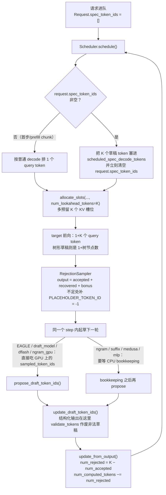

# 20 主流引擎实现 —— vLLM 与 SGLang 与 TensorRT-LLM

## 1. 一句话

论文里的投机采样是一个独占 GPU 的 `while` 循环；引擎里它必须**寄生在连续批处理的调度循环内部**， 于是它变成了三件杂活：**多预留 K 个 KV 槽位、把草稿 token 混进本步的 query、拒绝之后把计数器回退**。 本篇把这三件事在 vLLM V1 里逐行走一遍，给出五个栈的参数名与默认值对照（**逐条核实到源码 dataclass/pydantic 声明，抄不到的一律标「未查证」，全篇 32 处**）， 并把各家官方自己写下的"什么时候不该开"原文摆出来 —— 其中 SGLang 把这条判断**直接写死进了默认并发上限（48）**， 而 TensorRT-LLM 那句被广泛引用的"无法动态关闭投机"**在它自己的最新源码里已经过期**。

---

## 2. 从哪来：V0 时代的常识已经整段作废

多数中文教程里关于"投机解码在引擎里怎么用"的说法，来自 vLLM V0（2024 年）。**截至 vLLM v0.27.1（2026-08-11 发布，2026-08 核验）这些说法逐条为假**：

| V0 时代的常识 | 依据（V0 字段/默认值） | v0.27.1 的真相 |
|---|---|---|
| 「开投机就拿不到 logprobs」 | V0 `disable_logprobs` 默认 **`True`** | **假**。字段已删，官方兼容矩阵 logprobs 标 ✅ |
| 「投机和 chunked prefill 不能同时开」 | V0 内部字段 `enable_chunked_prefill`，注释写着 "Used for raising an error since it's not yet compatible with speculative decode" | **假**。字段已删，CP × SD 标 ✅ |
| 「用 `disable_by_batch_size` 在大 batch 下自动关投机」 | V0 有此参数 | **假**。**参数已不存在**；取而代之的是 `num_speculative_tokens_per_batch_size`（Dynamic SD） |
| 「Medusa 的 typical acceptance 有开关」 | V0 `acceptance_method="typical_acceptance_sampler"`，`posterior_threshold` 默认 `0.09`、`posterior_alpha` 默认 `0.3` | **假**。三个字段在 V1 全部删除，**L3 近似口径在 vLLM V1 里没有对应开关了** |
| 「投机和 pipeline parallel 互斥」 | v0.9.2 文档顶部 warning 原文 | **口径变了**：当前文档写的是 "as of `vllm<=0.15.0`"，而 release 已到 v0.27.1。v0.27.1 的 `VllmConfig` 里未见全局拦截，但 **EAGLE3+PP（V2 runner）与 adaptive verification+PP 明确不可用**。EAGLE/MTP+PP 能否正常工作，**未查证** |

这张表是本篇存在的第一个理由：**投机解码是全库演化最快的一块，任何超过一年的工程结论都要重新核**。 本篇所有版本号都写成「截至 vX.Y.Z（2026-08 核验）」，就是为了让下一个读者知道该从哪里开始重核。

第二个理由是：数学篇（[[04-拒绝采样修正-无损性的完整证明]]）与建模篇（[[18-batch与吞吐-收益衰减曲线]]）讲的都是"一次投机迭代"， 而线上系统里根本没有"一次迭代"这个东西 —— 只有**一个 step 里 128 条请求各自处在不同阶段**。 把前者塞进后者，才是本篇要讲的机制。

---

## 3. 机制拆解：五个栈的配置面

### 3.1 谁支持什么

> **读法**：✅=文档/源码明确支持；❌=文档/源码明确不支持；「未查证」=本次核验没找到证据，**不代表不支持**。 各栈版本锚点见每列脚注。**本表是"支持与否"表，不是性能表，不可据此排序。**

| 引擎（版本锚点） | ngram / lookup | 独立 draft model | Medusa | EAGLE / EAGLE3 | MTP | 其它自有方法 |
|---|---|---|---|---|---|---|
| **vLLM** v0.27.1（2026-08-11） | ✅ `ngram`、`ngram_gpu` | ✅ `draft_model` | ⚠️ 枚举里still在，**但文档目录已无 Medusa 专页** | ✅ `eagle` / `eagle3` | ✅ `mtp`（22 个模型族别名已折叠为 `mtp`） | `suffix`、`dflash`、`dspark`、`mlp_speculator`、`custom_class`、`extract_hidden_states`、PARD（`parallel_drafting`） |
| **SGLang** v0.5.18（GitHub release `2026-08-22T00:09:15Z`；PyPI 同版 `2026-08-21T20:58:46`；源码取同日 `main` 快照） | ✅ `NGRAM`（v0.5.18 新增 `--speculative-ngram-external-corpus-path`） | ✅ `STANDALONE` | **❌ 不在 builtin 枚举里** | ✅ `EAGLE` / `EAGLE3` | ✅ `NEXTN`（另有 `FROZEN_KV_MTP`） | `DFLASH`、`DSPARK`、多层 EAGLE、decoupled spec（draft/verify 拆成两个引擎） |
| **TensorRT-LLM** 最新 stable **v1.2.1**（2026-04-20）；本篇源码取 tag **`v1.3.0rc24`**（2026-08-12） | ✅ `NGram` | ✅ `DraftTarget`（默认走 one-model 路径） | 源码里有 `MedusaDecodingConfig` 类，但**文档的 `decoding_type` 列表里没有** | ✅ `Eagle3`（`Eagle` 是向后兼容别名；**EAGLE v1/v2 checkpoint 不兼容**；**2-model 变体已预告 1.4 移除**） | ✅ `MTP` | `PARD`、`DFlash`、`SA`（Suffix Automaton）、`UserProvided`、`AUTO`；**源码里另有 `DSparkDecodingConfig`，文档未列** |
| **llama.cpp** b10576 / **v0.2.0**（均 2026-08-22） | ✅ 四种：`ngram-simple` / `ngram-map-k` / `ngram-map-k4v` / `ngram-mod` / `ngram-cache` | ✅ `draft-simple` | **❌ 全仓库 grep 无 medusa** | ✅ `draft-eagle3`（EAGLE v1/v2 未查证） | ✅ `draft-mtp` | `draft-dflash`、`draft-dspark` |
| **HF transformers** v5.15.1（2026-08-19） | ✅ `prompt_lookup_num_tokens` | ✅ `generate(assistant_model=...)`，另有跨 tokenizer 的 universal assisted | **❌ grep 无 medusa** | **❌ grep 无 eagle** | ✅ `use_mtp=True` | early-exit 自投机（`assistant_early_exit`）、`speculation_type="dflash"`、**静态集成校验 `assistant_ensemble_weight`（L3 有损）** |

> ⚠️ **llama.cpp 的 v0.2.0 是它第一个语义化版本号**（release note 原文："This version marks the beginning of consistent semantic versioning for `llama.cpp`."）， `bNNNNN` 仍是逐 commit 的 nightly。引用 llama.cpp 版本时必须说清是哪一套。

**其它六个栈的一行速查**（全部 2026-08-22 核验）：**LMDeploy** ✅ 但官方自标 experimental，`--speculative-algorithm` 的 choices 恰好只有 `['eagle','eagle3','deepseek_mtp','hy3_mtp','qwen3_5_mtp']`（**无 ngram、无通用 draft model**），且只演示 PyTorch 后端（TurboMind 未查证）； **vllm-ascend** 覆盖面最广（10 种方法），但有昇腾硬约束 **`num_speculative_tokens + 1 ≤ 16`**（算子每轮 decode 最多 16 token）； **Arctic Inference** 是 vLLM plugin，`method="arctic"`，Suffix Decoding 的出处（arXiv 2411.04975）； **MLC-LLM** `--speculative-mode` 取值 `disable/small_draft/eagle/medusa`，文档原话 "We only support one additional model for speculative decoding now."； **Ollama** 有自己的一套（`draft_num_predict`，独立 draft 默认 **4**，Modelfile `DRAFT` 指令），**不是 llama.cpp 参数透传**； **TGI 仓库已于 2026-03-21 归档只读**，它的 `--speculate` 只支持 Medusa 或 n-gram 回退 —— **一个已经停更的栈，正好留下了"Medusa 时代"的化石。**

**四条一眼可见的结构性差异**：

1. **Medusa 在所有仍在维护的引擎里都已出局**（vLLM 留着枚举不留文档；SGLang、llama.cpp、HF transformers 的枚举里根本没有； TRT-LLM 的 PyTorch backend 枚举里没有）。**唯二还留着 Medusa 的是 MLC-LLM 与已归档的 TGI。** 这与 [[12-Medusa-多头草稿与树注意力的诞生]] 的历史判断一致：**它的历史贡献是树注意力，不是它自己**。
2. **五个栈在同一时间点同时长出了 `dflash`/`dspark` 分支**（vLLM、SGLang、TRT-LLM、llama.cpp、HF transformers 全有）。 这不是巧合 —— 串行起草 K 次是 EAGLE 系加速比的主要损耗项，见 [[13-EAGLE三代-特征级自回归的演进]]。
3. **无模型草稿（ngram / lookup / suffix / SA）无一例外全有**，因为它零权重、零训练、零显存，是唯一能"随手开"的方法（[[11-无模型草稿-promptlookup与ngram与检索]]）。
4. **EAGLE 是唯一被"下沉"到端侧栈的神经草稿方法**：llama.cpp 在 2026-06 才加进 `draft-eagle3`（PR #18039）， 而 HF transformers 到 v5.15.1 **仍然没有 EAGLE**。这说明 EAGLE 的门槛不在算法，在**它要求引擎能把 target 的隐状态喂给草稿头**。

### 3.2 参数名与默认值对照

> **纪律**：下表每一格都抄自源码 dataclass / pydantic 字段声明或官方文档表格，**不是转述**。 vLLM 抄自 `vllm/config/speculative.py` @ tag `v0.27.1`；SGLang 抄自 `python/sglang/srt/server_args.py` 与 `arg_groups/speculative_hook.py` @ `main`（**非 tag，复核时内容可能已变**）；TRT-LLM 抄自 `docs/source/features/speculative-decoding.md` @ `main`。

**vLLM**（统一入口 `--speculative-config` JSON，别名 `-sc`；Python 侧 `LLM(..., speculative_config={...})`）

| 字段 | 默认值 | 备注 |
|---|---|---|
| `method` | `None` | 不给则推断：像类路径→`custom_class`；`"ngram"`/`"[ngram]"`→`ngram`；**否则一律当 `draft_model`** |
| `model` | `None` | draft model / EAGLE head 路径；`ngram`/`suffix`/`mtp` 可省 |
| `num_speculative_tokens` | 无默认（`gt=0`） | 能从 draft config 的 `n_predict` 推出，否则必填 |
| `draft_tensor_parallel_size` | `None` | **只能是 1 或 target 的 TP size**，否则 raise |
| `tensor_parallel_size` | `None` | **陷阱字段，存在只为报错**：传了就提示改用 `draft_tensor_parallel_size` |
| `draft_sample_method` | **`"greedy"`** | `greedy` 把 draft 概率当 one-hot；`probabilistic` 用完整 draft logits 做概率比检验，**代价是额外显存** |
| `rejection_sample_method` | **`"standard"`** | `block`=整块联合验证；**`synthetic`=按标定接受率人为接受，用于性能建模，不是无损（属 L3 之外的"根本不验证"）** |
| `parallel_drafting` | **`False`** | 只兼容 EAGLE 与 `draft_model`；`dflash`/`dspark` 会被强制置 `True` |
| `disable_padded_drafter_batch` | **`False`** | 只影响 EAGLE |
| `use_local_argmax_reduction` | **`False`** | 通信从 O(vocab) 降到 O(2·tp_size)；**只对贪心、非树形草稿生效** |
| `use_heterogeneous_vocab` | **`False`** | TLI 跨词表；**只兼容 `draft_model` 且只支持 `draft_sample_method="greedy"`** |
| `prompt_lookup_min` / `prompt_lookup_max` | **两者都不给时都置 `5`** | ⚠️ 见下面的"文档 vs 源码打架" |
| `suffix_decoding_max_tree_depth` | **`24`** | 需装 Arctic Inference（源码 raise 指名 `arctic-inference==0.1.1`） |
| `suffix_decoding_max_cached_requests` | **`10000`** | 设 `0` 关掉全局 suffix tree |
| `suffix_decoding_max_spec_factor` | **`1.0`** | `max_spec_tokens = factor × prefix_match_length` |
| `suffix_decoding_min_token_prob` | **`0.1`** | 低于此频率估计概率的 token 不投机 |
| `num_speculative_tokens_per_batch_size` | `None` | Dynamic SD，每项 `(range_start, range_end, K)` 闭区间 |
| `--per-request-spec-decode-metrics`（独立 flag） | **`none`** | 可选 `summary` / `detailed` |

> ⚠️ **文档与源码打架，以源码为准**：`prompt_lookup_min` 的 docstring 写的是 "Defaults to 1."， 但 `__post_init__` 的实际逻辑是两者都为 `None` 时**都置 5**，只给一个时另一个**镜像**成相同值，`min > max` 直接 raise。 源码那行注释值得原样抄下来：`# TODO(woosuk): Tune these values. They are arbitrarily chosen.` —— **这个默认值没有调优依据**，谁把它当"官方推荐值"谁就错了。

> 另注：RS-3 调研笔记里列出的 `enable_adaptive_verification`、`dspark_draft_topk` 两个字段， 本篇在 `vllm/config/speculative.py` @ `v0.27.1` 里 **grep 不到**（adaptive verification 这个*特性*确实存在且有独立文档页）。 **该特性的确切开关名本篇标「未查证」**，不照抄。

**SGLang**（一组独立 CLI flag，无统一 JSON）

| flag | 默认值 | 备注 |
|---|---|---|
| `--speculative-algorithm` | `None` | builtin 取值原文：`EAGLE, EAGLE3, NEXTN, STANDALONE, NGRAM, DFLASH, DSPARK`（外加 `SpeculativeAlgorithm.register` 注册的自定义算法）。**没有 Medusa** |
| `--speculative-draft-model-path` | `None` | 别名 `--speculative-draft-model` |
| `--speculative-num-steps` | `None` | 草稿自回归步数 |
| `--speculative-eagle-topk` | `None` | 每步从草稿采几个（树宽） |
| `--speculative-num-draft-tokens` | `None` | 草稿 token 总数（树规模） |
| `--speculative-accept-threshold-single` | **`1.0`** | 原文："Accept a draft token if its probability in the target model is greater than this threshold." |
| `--speculative-accept-threshold-acc` | **`1.0`** | 原文："The accept probability of a draft token is raised from its target probability p to min(1, p / threshold_acc)." |
| `--speculative-use-rejection-sampling` | **`False`** | 原文："Use rejection sampling for speculative decoding (**requires topk=1**)." |
| `--speculative-attention-mode` | **`"prefill"`** | 可选 `decode`；同时作用于 target verify 与 draft extend |
| `--speculative-adaptive` | **`False`** | "dynamically adjusts num_steps based on acceptance rate" |
| `--speculative-token-map` | `None` | 草稿模型的小词表映射表（EAGLE3 常用） |
| `--speculative-ngram-max-bfs-breadth` | **`10`** | NGRAM 专属；`min` 为 `1` |
| `--speculative-ngram-match-type` | **`"BFS"`** | 可选 `PROB` |
| `--speculative-ngram-max-trie-depth` | **`18`** | |
| `--speculative-ngram-capacity` | **`10_000_000`** | |
| `--speculative-num-draft-tokens`（NGRAM 未给时） | **自动置 `12`** | 且 `topk` 被强制设成 `ngram_max_bfs_breadth`，`num_steps = num_draft_tokens // topk` |

> ⭐ **这里有一条对本库最重要的发现（对应铁律一）**：
> SGLang 的 **Leviathan 式拒绝采样是 opt-in 的**（`--speculative-use-rejection-sampling` 默认 `False`）， 而且**开了之后只支持 topk=1，即只支持链式草稿、不支持树**。 源码 `spec_utils.py::sample_draft_proposal` 的 docstring 把无损条件写得很清楚：
> > "Leviathan draft proposal: q = softmax(logits / T), X ~ q. ... The verify's accept test `coin*q(X) < p(X)` is **unbiased only if q is exactly the distribution X was drawn from**, so callers must hand the returned q (not a recomputed one) to the verify."
>
> 这正是 [[04-拒绝采样修正-无损性的完整证明]] §3 的对齐条件被写进工程代码的样子 —— **q 必须是真正采样时用的那个 q，不能事后重算**。 至于**默认路径（阈值式树验证）的分布口径究竟是 L1 / L2 / L3 中的哪一个，本篇未查证**，不下结论。 但可以确定的判据是：**如果你需要 L1 分布无损，在 SGLang 上必须显式开 `--speculative-use-rejection-sampling` 并接受 topk=1 的限制。**

**TensorRT-LLM**（**v1.2 起 TensorRT backend 已整体移除，PyTorch 是唯一后端**；`trtllm-serve` / `trtllm-bench` 走 YAML `speculative_config.decoding_type`）

> 下表默认值抄自 `tensorrt_llm/llmapi/llm_args.py` @ tag **`v1.3.0rc24`** 的 pydantic 字段声明（**不是文档转述** —— 文档只给字段名不给默认值）。

| 配置类 | 字段 → 默认值 |
|---|---|
| `DecodingBaseConfig`（公共） | `max_draft_len=None`、`max_total_draft_tokens=None`、`speculative_model=None`（`speculative_model_dir` **只是它的 validation alias，不是独立字段**）、`max_concurrency=None`、`draft_len_schedule=None`、`acceptance_rate_threshold=None`、`acceptance_rate_window_size=None`、`use_rejection_sampling=**False**`（prototype）、`enable_penalty=**False**` |
| `NGramDecodingConfig` | `max_matching_ngram_size=**2**`、`is_keep_all=**True**`、`is_use_oldest=**True**`、`is_public_pool=**True**`；`max_total_draft_tokens` 被强制等于 `max_draft_len`（源码注释 "Current NGram only supports linear tree"） |
| `MTPDecodingConfig` | `use_relaxed_acceptance_for_thinking=**False**`、`relaxed_topk=**1**`、`relaxed_delta=**0.0**`、`mtp_eagle_one_model=**True**`、`use_dynamic_tree=**False**`、`sa_config=None` |
| `Eagle3DecodingConfig`（继承 `EagleDecodingConfig`） | **`eagle3_one_model=True`**、`use_dynamic_tree=**False**`、`eagle_choices=None`、`greedy_sampling=**True**`、`dynamic_tree_max_topK=None`、`sa_config=None` |
| `SADecodingConfig`（独立 SA） | `max_matching_ngram_size=**-1**`（−1 = 用后缀自动机取最长匹配，**与 NGram 的默认 2 不同**）、`enable_global_pool=**False**` |
| `SAEnhancerConfig`（挂在 MTP/Eagle3/PARD 上） | `threshold=**4**`、`enable_global_pool=**False**` |
| `PARDDecodingConfig` / `DFlashDecodingConfig` | `mask_token_id=None`、`target_layer_ids=None`；DFlash 的 `attention_backend` 默认 **`"VANILLA"`**（`"TRTLLM"` 需 FlashInfer + Blackwell SM100/SM103） |
| `UserProvidedDecodingConfig` | `drafter` **必填无默认**、`resource_manager=None` |

> ⭐ **本篇核到的最严重一处「文档 ≠ 源码」**：官方文档教你写 `use_sa_spec=True, sa_spec_threshold=4` 来开 Suffix Automaton 增强，
> 但 **`use_sa_spec` 与 `sa_spec_threshold` 这两个字段在源码里根本不存在**（rc18–rc24 全部 0 命中）；真字段是 `sa_config=SAEnhancerConfig(threshold=4)`。
> 而所有 config 都继承 `StrictBaseModel`（`extra = "forbid"`），**照文档写会被 pydantic 直接拒绝，不是被忽略**。
> 这条正是本库反复强调的纪律的活教材：**默认值与字段名一律回源码 dataclass/pydantic 声明，文档只能当线索。**

> ⚠️ **两个 L3 近似口径的开关**（都默认关，但一旦打开就**不能再叫无损**，见 [[07-无损的三种口径-分布无损不等于结果相同]]）：
> ① `use_relaxed_acceptance_for_thinking`（默认 `False`）—— 文档原文 "a draft token may be accepted **if it appears in a candidate set** constructed with `relaxed_topk` and `relaxed_delta`"，即把 $\min(1,p/q)$ 换成"在 top-k 候选集里就收"，输出分布不再等于 $p$；官方注明只支持 DeepSeek-R1、且只在 thinking 阶段生效。
> ② **两模型投机 + overlap scheduler**：源码里的 warning 原文是
> "Overlap scheduler is enabled for two-model speculative decoding. **Rejection sampling will fallback to greedy sampling.**"
> —— **这是一条会静默把 L1 降级成 L2 的路径**：你什么都没改，只是开着默认打开的 overlap scheduler，$T>0$ 下的分布保证就没了。

> 另一处过期字段：`num_nextn_predict_layers`。文档仍写 "Number of MTP modules to use. Currently must match `max_draft_len`"，
> 但 rc24 源码里它是 `init=False` 的内部字段（"Auto-populated from the model's pretrained config. **Do not set manually.**"），
> 传了会被 validator 改名成 `max_draft_len` 并打 deprecation 警告。

**llama.cpp**（抄自 `common/common.h` 的 `common_params_speculative_draft` 与 `tools/server/README.md` @ tag `b10576`）

| flag | 默认值 | 备注 |
|---|---|---|
| `--spec-type` | **`none`** | 取值：`none,draft-simple,draft-eagle3,draft-mtp,draft-dflash,draft-dspark,ngram-simple,ngram-map-k,ngram-map-k4v,ngram-mod,ngram-cache` |
| `--spec-draft-n-max` | **`3`** | 最大草稿长度 |
| `--spec-draft-n-min` | **`0`** | 最小草稿长度 |
| `--spec-draft-p-split` | **`0.10`** | |
| `--spec-draft-p-min` | **`0.00`** | 草稿置信度下限（0 = 贪心，不早停） |
| `--spec-draft-backend-sampling` | **enabled** | 把草稿采样下放到后端 |
| `--spec-draft-ngl`（`-ngld`） | **`-1`（auto）** | draft 放几层进显存；`all` = `-2` |
| `--spec-draft-type-k` / `-type-v` | **`f16` / `f16`** | **draft 的 KV 精度独立于 target** |
| `--spec-ngram-mod-n-min` / `-n-max` / `-n-match` | **`48` / `64` / `24`** | `--spec-default` 就是打开 `ngram-mod` 并设成这三个值 |

> ⭐ **两条会让老教程直接跑不起来的变更（截至 b10576，2026-08-22 核验）**：
> ① `--draft` / `--draft-n` / `--draft-max` / `--draft-min` / `--draft-n-min` **全部已删除**，源码里留了报错桩：
> "the argument has been removed. use `--spec-draft-n-max` or `--spec-ngram-mod-n-max"`。`--spec-replace` 与 `-cd/--ctx-size-draft` 同样已删。 ② **默认值改了两处**：`n_max` 从 **16 → 3**，`p_min` 从 **0.75 → 0.0**。 也就是说照着 2024 年的 PR 说明写 `--draft-max 16 --draft-min 5`，今天会**直接报错退出**。
>
> llama.cpp 的词表兼容检查是本篇见到的最严的一家（`common/speculative.cpp`，不满足直接 `throw`）：
> vocab type 相同 + add_bos/bos_id 相同 + add_eos/eos_id 相同 + **词表大小差 ≤ `SPEC_VOCAB_MAX_SIZE_DIFFERENCE = 128`**
> + 从 `SPEC_VOCAB_CHECK_START_TOKEN_ID = 5` 起**逐 token `strcmp` 必须完全一致**。
> 结论：同族不同尺寸（Qwen2.5-32B + Qwen2.5-0.5B）能过，跨家族一律不行，而且**以前用 `--spec-replace` 做字符串翻译绕开的路已经没了**。

**HF transformers**（抄自 `src/transformers/generation/configuration_utils.py` @ tag `v5.15.1`）

| 字段 | 默认值 | 备注 |
|---|---|---|
| `assistant_model` | — | 不是 config 字段，是 `generate()` 的 kwarg |
| `num_assistant_tokens` | **`20`** | ⚠️ `__init__` 里是 `kwargs.pop(..., None)`，**真默认值在同文件另一个 dict 里（L637-641）** |
| `num_assistant_tokens_schedule` | **`"constant"`** | 另有 `"heuristic"`（全中 +2、否则 −1，跨 generate 调用持久）与 `"heuristic_transient"` |
| `assistant_confidence_threshold` | **`0.4`** | |
| `assistant_lookbehind` / `target_lookbehind` | **`10` / `10`** | 跨 tokenizer 对齐用 |
| `prompt_lookup_num_tokens` | `None`（不设即不启用） | |
| `max_matching_ngram_size` | config 里 `None`，**实际取 `2`**（`... or 2`） | |
| `assistant_early_exit` | `None` | 需要模型训练时支持中间层早退 |
| `use_mtp` | `None` | 只能用于带 MTP 层的 checkpoint，**草稿深度等于 checkpoint 的 MTP 层数，不可调** |
| `assistant_ensemble_weight` | **`None`（= L1 分布无损）** | 设成 $(0,1)$ 的值即切到 L3，见下 |

> ⭐ **HF 是唯一把"无损（L1）vs 有损（L3）"做成一个连续旋钮、并把代价写进文档的栈**，文档原文：
> > "Standard speculative decoding is *lossless* — it guarantees the **output distribution matches the target model exactly**.
> > Static ensemble verification relaxes this by verifying against a **mixture** of the target and draft distributions,
> > increasing the acceptance rate (faster inference) **at the cost of making the output distribution a mixture rather than the exact target distribution**."
>
> 前半句是标准的 **L1 分布无损**；`assistant_ensemble_weight=w ∈ (0,1)` 把验证分布换成 $v(x)=w\,p(x)+(1-w)\,q(x)$， **这是明确的 L3 近似口径**，源码 docstring 自己写了 "controlled distributional bias"。默认 `None` 即 L1。
>
> **另一条只有读源码才看得到的分岔**（`generation/utils.py`）：HF 的接受判据有**两条路**—— 拿得到草稿 logits 时（标准 assistant model）走 Leviathan Algorithm 1 的拒绝采样（**L1**）； 拿不到草稿分布时（prompt lookup / early exit），`do_sample=True` 走的是"**从 target 分布采一个，再逐 token 比对是否等于候选**"。 后者每个吐出的 token 仍采自 $p$，**分布意义上仍是 L1，但接受率严格低于 Algorithm 1** —— 因为它丢掉了 $\min(1,p/q)$ 里那份"$q$ 低估时也接受"的概率。 这正是 [[04-拒绝采样修正-无损性的完整证明]] §2 讨论的那种"看起来对、也确实无偏、但更慢"的写法。

### 3.3 草稿权重从哪来

| 方法 | 权重来源 | 要不要训 |
|---|---|---|
| ngram / lookup / suffix / SA | **无权重**，纯算法 | 否 |
| MTP / NEXTN / DSpark | **target checkpoint 内自带**（vLLM 源码直接 `self.model = self.target_model_config.model`） | 否 |
| EAGLE / EAGLE3 | 独立 HF 仓库 | 是，但现成权重多 |
| MLP speculator（仅 vLLM） | `ibm-ai-platform/*-accelerator`、`ibm-granite/*-accelerator` | 是（IBM 已放出） |
| 独立 draft model | 任何**同族同 tokenizer**小模型 | 否 |
| PARD | `amd/PARD-*`（AMD 已放出） | 是 |

现成 EAGLE 权重的三个官方点名来源：`https://huggingface.co/yuhuili`（EAGLE 作者本人）、 `https://huggingface.co/collections/RedHatAI/speculator-models`、`https://huggingface.co/collections/nvidia/speculative-decoding-modules`。 两家的官方训练框架分别是 **vLLM 的 `vllm-project/speculators`** 与 **SGLang 的 SpecForge**（SpecForge 的仓库地址与版本**未查证**）。 速查判据：**MTP 免费（权重自带），EAGLE 要么下现成的要么自己训，ngram 什么都不要但接受长度最低。** 训练细节见 [[21-草稿模型怎么训-对齐与在线蒸馏]]。

---

## 4. 逐步走查：一个请求在 vLLM V1 里走一遍

以下每一条都对应 `v0.27.1` 的具体源码位置，不是示意。



### 4.1 投机插在调度循环的哪一步

**不是"在 decode 前面加一段"，而是把草稿 token 变成本 step 的 query token。** 具体地：

- 调度阶段（`Scheduler.schedule()`）：如果 `request.spec_token_ids` 非空，就把它切进 `scheduled_spec_decode_tokens[req_id]`， 然后**立刻清空** `request.spec_token_ids`（源码注释："New spec tokens will be set in `update_draft_token_ids` before the next step when applicable."）。 于是这一步该请求的 query token 数从 1 变成 $1+K$ —— 对调度器而言，**这就是一个"稍微长一点的 decode"，其它什么都没变**。
- **`prefill chunk` 的草稿直接丢弃**（`update_draft_token_ids` 里 `if request.is_prefill_chunk: request.spec_token_ids = []`）。 这一行就是 chunked prefill × 投机能共存的全部秘密：**没有"两个阶段"要协调，只有"这一 chunk 不投机"。**

### 4.2 草稿的 KV cache 怎么管：预留，不是另开一份

`Scheduler.__init__` 里算出一个 `num_lookahead_tokens`：

| 方法 | `num_lookahead_tokens` | 源码给的理由 |
|---|---|---|
| EAGLE 系 / `draft_model` | $K$ | — |
| `dflash` | $K+1$ | "uses in-fill-style decoding instead of standard next-token sampling, so it has a query for the last sampled token plus queries for each draft token" |
| `dspark` | $K$ | "the anchor itself is the first prediction position (no separate bonus query)" |

它被传进 `KVCacheManager.allocate_slots(..., num_lookahead_tokens=...)`，作用是把该请求需要的槽位数抬到 `min(total_computed_tokens + num_new_tokens + num_lookahead_tokens, max_model_len)`。 **含义：草稿 token 用的就是目标模型自己的 KV cache，只是提前占了 K 个坑。** 没有第二份 KV 表，也没有"草稿 KV 池"。

**与 prefix caching 的接口在这里**，源码注释一句话讲清：

> NOTE: for new tokens which include both verified and unverified draft tokens, **we only cache the verified tokens** (by capping the number at `request.num_tokens`).

即：**未验证的草稿 token 占 KV 槽位，但绝不进前缀缓存**。否则一次错误的猜测会污染全局 radix/hash 树， 让后续所有命中该前缀的请求都读到一段"模型从未真正生成过"的 KV —— 那是静默的正确性事故，不是性能问题。

### 4.3 接受之后怎么"回滚/压实"：回退计数器，不搬 KV

`RejectionSampler` 的输出布局（类 docstring 原文）：

> output tokens = **accepted tokens + recovered tokens + bonus tokens**

—— 正好是 [[04-拒绝采样修正-无损性的完整证明]] 的三种产物：接受的、从残差分布 $p'=\mathrm{norm}(\max(0,p-q))$ 重采的、以及全接受时白拿的赠品。 不足 $K+1$ 的位置补 `PLACEHOLDER_TOKEN_ID = -1`，并有硬上限 `MAX_SPEC_LEN = 128`（**单请求单步最多 128 个草稿 token**）。

回滚发生在 `update_from_output()`：

```python
num_draft_tokens = len(scheduled_spec_token_ids)
num_accepted = max(len(generated_token_ids) - num_sampled, 0)
num_rejected = num_draft_tokens - num_accepted
if request.num_computed_tokens > 0:
    request.num_computed_tokens -= num_rejected
if request.num_output_placeholders > 0:
    request.num_output_placeholders -= num_rejected
```

**这就是全部的"压实"。** 没有 memcpy、没有搬 KV block：被拒绝的草稿留在原来的 KV 槽位里， 只是 `num_computed_tokens` 被回退了 `num_rejected`，于是**下一步写入时自然覆盖掉它们**。 这个设计的代价是那几个槽位在被覆盖前一直被占着，收益是回滚成本 O(1)。

> **对照 [[16-树形草稿与树注意力-mask构造与验证]]**：链式草稿的"压实"退化成上面这一行减法； 树形草稿才需要真正沿被选中路径重排 KV 索引。**这也是为什么"链改树"的工程成本远高于它看起来的样子。**

**SGLang 走的是同一条路，而且把这条路推得更远**（源码核实：`run_eagle_verify` 全函数体**一次 allocator free 都没有**）：
每步 decode 按最坏情况超额预留 `2 × max(topk × steps, num_draft_tokens)` 个槽位，验证后只涨 `kv_committed_len`，
**`kv_allocated_len` 一动不动**；被拒的尾部槽位原地留着（源码注释：`"trailing unaccepted slots stay and are freed as overshoot."`），
**真正的 free 要等请求结束或被 retract 时才发生**。`topk=1` 时连搬都不用搬（accepted 链本就在块首，"identity transform"）；
`topk>1` 才调 `move_kv_cache(...)` 把被选中路径物理搬到块首 —— **和上面那句"链退化成一行减法、树才要搬"完全对应**。

> ⭐ **这条改的是显存的心智模型，容量规划时比参数表更要紧**：投机解码的额外显存**不是峰值瞬时占用，是常驻超额占用**。
> 用"常驻多占一块"换掉"每步 free/alloc 的开销"，代价按并发线性放大 —— 这正是 §8.1 里 SGLang 把
> `--max-running-requests` 默认压到 48 的物理原因。另有一条容易漏的：**EAGLE 会把 radix 前缀键强制切成 bigram**
> （`RadixKey(..., is_bigram=self.is_eagle, ...)`），**前缀复用的命中率不能直接沿用非投机场景的经验值**。

### 4.4 与连续批处理共存：草稿是在同一个 step 里为下一步准备的

最容易被讲错的一点：**vLLM 不是"起草→停→验证"两个 step，而是一个 step 内"验证完立刻起草"。** `gpu_model_runner` 里的分叉决定了这件事的时机，而这个分叉**恰好解释了官方那条异步调度白名单**：

| 起草器 | 何时起草 | 源码原话 |
|---|---|---|
| EAGLE / DraftModel / DFlash / ExtractHiddenStates / Gemma4 / NgramGPU | 采样一出结果**立刻**在 GPU 上起草 | "can use the GPU sampled tokens as inputs, and **does not need to wait for bookkeeping to finish**" |
| ngram / suffix / medusa / mlp_speculator / custom_class | 等 CPU bookkeeping 完成后再起草 | "These drafters **consume CPU sampled tokens**, so they run after bookkeeping." |

vLLM 的 `--async-scheduling` 报错原文是：

> "Currently, async scheduling is only supported with **EAGLE/MTP/Draft Model/NGram GPU/DSpark** kind of speculative decoding"

**两张名单是同一张。** 异步调度的全部意义就是"不等 CPU"，而第二类起草器**天生要等 CPU**， 所以它们不是"暂时没做适配"，是**结构上不可能**。不显式指定时 vLLM 自动关掉 async 并 warn。

### 4.5 三家的分叉点：谁必须放弃 overlap / CUDA graph

| 引擎 | 与"重叠调度"的关系 | 证据 |
|---|---|---|
| **vLLM** | 异步调度只对 GPU-token 起草器开放（见 4.4）；**开了异步投机会强制关掉 cascade attention**（"not yet compatible with async speculative decoding"）——长共享前缀场景的实打实损失 | `vllm/config/vllm.py` @ v0.27.1 |
| **SGLang** | "speculative decoding **always runs the V2 worker**. Use `--disable-overlap-schedule` to select the non-overlap (synchronous) path."；CPU 设备上 overlap 直接被关（"Overlap schedule is not implemented for speculative decoding on CPU."） | `arg_groups/speculative_hook.py` @ `main` |
| **TensorRT-LLM** | overlap 默认**开**（`disable_overlap_scheduler=False`）。判据写死在 `support_overlap_scheduler()` 里：MTP/EAGLE3 的 one-model 与 two-model、DraftTarget、SA、PARD/DFlash/DSpark **都支持**；**只有 `NGRAM` 与 `USER_PROVIDED` 不支持，而且引擎会自动关掉并 warn，用户不必手动传** —— 也就是说文档示例里那两处 `disable_overlap_scheduler=True` 是**历史遗留**。 | `_torch/speculative/interface.py`、`_torch/pyexecutor/py_executor_creator.py` @ `v1.3.0rc24` |

CUDA graph 侧有两个具名的硬约束（都在 vLLM v0.27.1 源码里）：

1. **DeepSeek-V3.2 的 MTP 强制 `enforce_eager = True`**（源码注释：`# FIXME(luccafong): cudagraph with v32 MTP is not supported`）—— 这是"开了 MTP 就失去 CUDA graph"的具体实例。
2. **Dynamic SD 在 V1 model runner 下把 `cudagraph_mode` 降级为 `PIECEWISE`**，理由是"changes the target verification length at runtime"。 官方文档的 Limitations 同时说 "Full Cudagraph only works with Model Runner V2"， **但 V2 runner 又把 `ngram`/`ngram_gpu`/`draft_model`/`medusa`/`mlp_speculator`/`suffix`/`custom_class` 全部排除在外**， 而官方 Dynamic SD 的示例命令行里写的偏偏是 `VLLM_USE_V2_MODEL_RUNNER=0`。**这是一个真实存在的两难，不是我编的。**

---

## 5. 小数字算例：一个 step 的账

设 `num_speculative_tokens = K = 3`，EAGLE 草稿，某请求此刻 `num_computed_tokens = 100`，`num_tokens = 101`（100 个已算 + 1 个待算）， 上一步产出的草稿 `spec_token_ids = [a, b, c]`。

| 步骤 | 数字 | 依据 |
|---|---|---|
| 调度：query token 数 | $1 + 3 = 4$ | 最后一个真 token + 3 个草稿 |
| KV 槽位预留 | $\min(100 + 4 + \mathbf{3},\ \text{max\_model\_len}) = 107$ | `num_lookahead_tokens = K = 3`（为**下一轮**草稿留坑） |
| 进入前缀缓存的 token 数 | **最多 101**，不是 104 | "only cache the verified tokens (capping at `request.num_tokens`)" |
| target 前向 | 一次，4 个 query 位置，拿到 $p_1,\dots,p_4$ | [[03-并行验证为什么几乎免费-算术强度与roofline]] |
| 假设 $a,b$ 接受、$c$ 拒绝 | `generated_token_ids = [a, b, y]`，$y\sim p'_3$ | recovered token，不是 bonus |
| 记账 | `num_accepted = 3 − 1 = 2`；`num_rejected = 3 − 2 = 1` | `num_sampled = 1` |
| 回滚 | `num_computed_tokens: 104 → 103` | 减 `num_rejected` |
| 本轮净产出 | **3 个 token**（$a,b,y$），花了 **1 次 target 前向 + 3 次草稿前向** | |
| vLLM 口径的接受长度 | $1 + \dfrac{\text{num\_accepted}}{\text{num\_drafts}} = 1 + \dfrac{2}{1} = 3.0$ | `acceptance_length = 1 + (num_accepted_tokens / num_drafts)` |

> ⚠️ **口径警告（本篇最容易被抄错的一格）**：vLLM 官方脚本算的 `acceptance_length` 是 **`1 + 接受的草稿数/起草轮数`，含 bonus token**， 取值范围 `[1.0, K+1]`。**很多论文报的"平均接受 token 数"不含那个 1，两者差整整 1。** 拿 vLLM 的 2.07 去和论文的 2.07 比，等于拿 3.07 比 2.07。完整辨析见 [[05-接受率alpha-定义口径与怎么测]]。

**全部接受时**：`generated = [a,b,c,d]`，`num_accepted = 4−1 = 3`，`num_rejected = 0`，不回滚，本轮产出 4 个 token， `acceptance_length = 1 + 3/1 = 4.0 = K+1`（理论上限）。这一格能直接告诉你：$K=3$ 时接受长度**永远落在 [1.0, 4.0]**， 报出 4.5 的人一定用了别的口径。

---

## 6. 代码验证：上线前该做的两个对拍

**本篇是工程篇，没有属于自己的数学命题**（本篇的可核验方式是 §来源里的 URL 与版本号，见「本篇验证」）。 但本库 `_lab/` 里有两个工具，**恰好是投机解码上线前必做的两件事**：

**(a) 正确性对拍 —— 换引擎/换树形状/改 kernel 之后先跑这个**

```python
# _lab/tree.py::verify_tree_equals_chains
out_tree  = _attention(tok_emb + pos_emb[depths(parents)], build_mask(parents), Wq, Wk, Wv)
for path in root_to_leaf_paths(parents):
    out_chain = _attention(tok_emb[path] + pos_emb[np.arange(len(path))], np.tril(...), Wq, Wk, Wv)
```

`_lab/test_tree.py::test_tree_attention_equals_per_chain` 在四种树形状下都把"树拍平跑一次"与"每条链各跑一次"对到 $<10^{-12}$。 **它的工程意义是给你一个可迁移的对拍模板**：拿你的引擎跑一棵小树，再把每条根到叶路径当普通序列各跑一次， 比较 logits。**mask、position id、KV 压实三者只要有一个写错，这个对拍就会红**， 而线上表现只会是"接受率莫名偏低"——一个会被误判成"草稿模型不好"的正确性 bug（[[16-树形草稿与树注意力-mask构造与验证]] §8 第 6 条）。

**(b) 收益判据 —— 决定"什么时候该关掉"**

`_lab/test_speedup.py::test_speedup_collapses_at_large_batch_short_context` 断言的是： **短上下文 + 大 batch 下加速比 <1，且验证已进入 compute-bound**。这条测试就是 §8 那些官方"负收益"表述的可执行版本。 配套的 `python _lab/speedup.py --breakeven` 会直接打印**你需要多大的接受长度才能打平**（口径：target=llama3-70b，draft=llama3.2-1b，$\gamma=4$，8×H100 解析模型，测吞吐）：

| batch | seqlen=1024 需要的 $E[\tau]$ | seqlen=8192 |
|---|---|---|
| 1 | 1.07 | 1.08 |
| 64 | 1.11 | 装不下 |
| 128 | **1.81** | 装不下 |
| 256 | **2.89** | 装不下 |

$\gamma=4$ 时 $E[\tau]$ 的理论上限是 5。**batch=256 需要 2.89 才打平，而真实 EAGLE3 在 ShareGPT 上实测只有 2.07**（口径见 §7.2）—— **这个减法就是"该不该开"的第一道闸门**，比任何定性建议都硬。

---

## 7. 口径与坑

### 7.1 冲突矩阵

> **只填有证据的格子。** ✅/❌ 来自官方兼容矩阵或源码 raise；「未查证」是本次核验没找到明确表述。 vLLM 列的 ✅/❌ 抄自 `docs/features/README.md` @ v0.27.1 与 `vllm/config/vllm.py`；SGLang 列抄自 `server_args.py` / `speculative_hook.py` @ `main`。

| 特性 × 投机解码 | vLLM v0.27.1 | SGLang（`main`） | TensorRT-LLM `v1.3.0rc24` |
|---|---|---|---|
| **chunked prefill** | ✅（prefill chunk 的草稿被丢弃） | ⚠️ **mixed chunked prefill（`--enable-mixed-chunk`）被强制关闭**，所有算法一律 | ✅（矩阵三列全 Yes） |
| **prefix caching / KV reuse** | ✅，但**只缓存已验证 token** | ⚠️ **PD 模式下 decode 服务器的 radix cache 与投机解码不兼容**（原文 "Incompatible with --enable-hisparse, speculative decoding, ..."） | ✅（`kvcache.md`："Reuse across requests is supported by all speculative decoding models"）；**但 NVIDIA 自己两份 Eagle3 部署 guide 都写 `enable_block_reuse: false`，未给理由** |
| **CUDA graph** | ✅，但 DeepSeek-V3.2 MTP 强制 eager；Dynamic SD 在 MRv1 下降级为 piecewise | ✅ 而且是**三张图**：draft-decode（把整个 multi-step 草稿循环 capture 成一张）、draft-extend、以及跑在 target runner 上的 target-verify（`ForwardMode.TARGET_VERIFY`）。把 verify 图与 draft 图融成一张的 PR #10866 **尚未合入** | ✅（矩阵三列全 Yes）。**代价写在源码里**：两模型必须把 `py_draft_tokens` padding 到最大草稿长度，"This is a CUDA graph limitation" |
| **量化** | ✅（`speculative_config.quantization` 单独指定 draft 权重量化） | ✅（`--speculative-draft-model-quantization`，不给则继承 target；`--speculative-draft-kv-cache-dtype` 单独设 draft KV 精度） | **未查证**（矩阵无量化行、`quantization.md` grep 无 "specul"）；只有间接实证：官方自己跑过 FP4/FP8/MXFP4 + MTP/EAGLE3 |
| **PD 分离** | **官方文档全文未出现 "speculative"** → **未查证**，不要替它下结论 | 有 `decoupled_spec_role`（`verifier`/`drafter` 拆成两个引擎，ZMQ IPC 连接）；但 `--enable-unified-memory` 明确 "not yet compatible with PD disaggregation or speculative decoding" | ✅（矩阵三列全 Yes；release notes 亦有 "Support n-gram speculative decoding with disagg"）。但 `disagg-serving.md` 全文 grep 无 "specul"，**注意事项未查证** |
| **logprobs** | ✅（V0 时代的 `disable_logprobs=True` 已删）；**但 adaptive verification 不支持 output logprobs（"to be fixed"）** | 未查证 | **未查证**（找不到官方明文）。但矩阵里 **Logits Post Processor × 三列投机 = No** |
| **n > 1** | 引擎层支持，**但逐请求接受率指标为 `null`**（"reported only for single-sequence requests"） | 未查证 | 未查证 |
| **beam search** | **❌**（issue #6137）；`best_of` 同样 ❌ 且 V1 已整体移除 | 未查证 | **❌ 硬 raise**：`sampler.py` 里 `if max_total_draft_tokens > 0 and max_beam_width > 1: raise ValueError("TorchSampler does not support beam search with speculative decoding")` |
| **结构化输出** | ✅ 能一起开，**但草稿会被语法作废**：`update_draft_token_ids` 里调 `grammar.validate_tokens(spec_token_ids)`，指标 `num_draft_tokens` 的定义是 "after subtracting drafts invalidated by structured-output constraints" | 未查证 | ✅ 但**分两套实现**：两模型/NGram 走 `GuidedDecoder`，one-model 走 `CapturableGuidedDecoder`；不在任一集合里的模式**直接 raise** |
| **LoRA** | **❌**（兼容矩阵，无 tracking issue） | 未查证 | 矩阵三列全标 **Untested** |
| **多模态** | ❔ Unknown/TBD（多模态 EAGLE 支持是 #33458，仍未做） | 未查证 | 未查证 |
| **三种投机方式互相** | — | — | **互斥**：矩阵里 Linear × Dynamic Trees × Legacy(NGram/user-provided) 两两为 No |
| **data parallel** | Dynamic SD **不兼容 DP**（自动降级为静态 K，理由是各 rank 会选不同 K 导致 collective 发散/死锁） | **NGRAM / STANDALONE / DFLASH 明确不支持 DP attention**（raise） | ✅ Attention DP 三列全 Yes |
| **pipeline parallel** | EAGLE3 + PP（V2 runner）❌；adaptive verification + PP ❌；其余**未查证** | DFLASH 只支持 `pp_size == 1`（raise） | **❌ 矩阵三列全 No**（Helix Parallelism 同样全 No）。这是矩阵里最硬的一条否定 |
| **CPU 后端** | **❌**（issue #28384 仍是 feature request） | ✅ NGRAM 支持 CPU，但 overlap schedule 被关 | 不适用（v1.2 起只剩 PyTorch/GPU 后端） |

**另两个栈的硬约束（不进上表是因为它们不是"矩阵"，是一句话的拦截）**：

- **HF transformers 到 v5.15.1 仍然硬性只支持 batch = 1**：`generation/utils.py` 里 `if batch_size > 1: raise ValueError("assisted generate is only supported for batch_size = 1")`， 文档同步写着 "Speculative decoding supports greedy search and sampling **but not batched inputs**"。 同时 **beam search 一律被忽略**（只 warn 不报错：assisted generate "is only supported with Greedy Search and Sample"）。 **含义：HF 的 assisted generation 是本地单请求工具，不是服务栈**，任何拿它的加速比去推服务端收益的做法都错了。
- **llama.cpp 的草稿深度被 `n_batch` 与 `-np` 共同挤压**：`per_seq = 1 + n_draft`、`total = n_parallel × per_seq`，两者都要 `min(n_batch, ...)`。 即**并行槽位越多，每槽能塞的草稿越短** —— 这是 §8.2 那条 `BS×K` 判据在一个单机引擎里的具体形态。 与 `--cont-batching`、GGUF 量化的显式冲突说明：官方 README 与源码断言里**未找到**，标「未查证」。

**三条"互相抵消收益"（不是互斥，但一起开会亏）**：

1. **投机 + 异步调度 → 失去 cascade attention**（vLLM 显式 warn）。长共享前缀场景（同一套 system prompt 的高并发服务）里， cascade attention 的收益可能大于投机的收益 —— **这是要实测比较的一笔交易，不是可以两个都要的功能**。
2. **投机 + top-p/top-k + 大词表**。`rejection_sampler.py::apply_sampling_constraints` 确实对 target logits 做了 temperature/top-k/top-p， 但同文件留了一句性能告警："`apply_top_k_top_p` uses sorting to calculate the mask, **which is slow for large vocab sizes**." 排序开销按草稿长度放大 $K$ 倍 —— 15 万词表的模型上这是一条隐藏的负收益来源。
3. **投机 + 结构化输出**。两者不冲突，但语法约束会**直接作废一部分草稿**，接受率被打折。 反过来说，语法越严（如强制 JSON schema），能被作废的越多 —— **在强约束场景下，ngram/suffix 这类"照抄前文"的草稿反而更容易活下来**。

### 7.2 加速比：三组官方数字，两组不能放进同一张表

RS-3 核到两组 Red Hat 实测，**结论方向相反**。按铁律二逐项列出后就明白了：

| 口径项 | (g) gpt-oss 组 | (h) EAGLE3 组 |
|---|---|---|
| 硬件 | NVIDIA H200-PCIe-141GB，单卡为主（另测 TP=2） | A100：8B 单卡，70B 用 4 卡 |
| target | `openai/gpt-oss-120b`（**MoE，MXFP4**） | `Llama-3.1-8B-Instruct` / `Llama-3.3-70B-Instruct`（dense） |
| draft | `nvidia/gpt-oss-120b-Eagle3-v2` | `yuhuili/EAGLE3-LLaMA3.3-Instruct-70B` |
| 引擎版本 | **vLLM v0.13.0**（发布于 2025-12-19，而文章发表于 2026-04-16 —— **测的是当时已落后约 4 个月的引擎**） | **vLLM 0.9.1** |
| $K$ | 测 2/3/4，选定 3 | 3 |
| 负载刻画 | **并发数** 1/5/25/50/100/200 | **请求率**（只有定性的 low / high，**具体 QPS 原文未给出**；**batch size 原文未给出**） |
| 数据集 | ShareGPT / MLPerf / SWE-bench，各 600 prompt | MT-Bench，输出截到 1024 token |
| 测的是什么 | output throughput + TTFT P95 + ITL P95 | **端到端 request latency** |
| 接受率 / 接受长度 | ShareGPT：K=2→45.4%/1.91；K=3→35.6%/**2.07**；K=4→28.3%/**2.13** | **原文未给出** |
| 结果 | ShareGPT 吞吐 +20.7%；SWE-bench 吞吐 +20.5%、每百万 token 成本 −19.4% | 整体 "up to 2.5×"（batch/并发口径缺失）；70B 低请求率 "up to 1.6×"，**高请求率下延迟上升** |

> **禁止横比**：硬件不同、模型架构不同（MoE-MXFP4 vs dense）、引擎版本差 14 个 minor、 测量对象不同（吞吐+P95 延迟 vs 端到端延迟）、负载刻画不同（并发数 vs 请求率）。 **(h) 组的 "up to 2.5×" 属于口径不全（缺 batch/并发、缺接受长度），本库标注「不可横向比较」，不洗白。**

它们唯一能一起说明的事是：**"大 batch 下投机还有没有收益"没有普适答案，判据不是并发数，是"GPU 有没有进入 compute-bound"。** (g) 组能在 200 并发下仍然赚，是因为 **MoE + MXFP4 的每 token 激活参数极少，memory-bound 区间被拉得极宽**—— 这与 [[18-batch与吞吐-收益衰减曲线]] §8 第 5 条"本模型未覆盖 MoE"完全对得上，不是反例，是**同一条曲线的横轴被拉长了**。

顺带一条藏在 (g) 表里的硬结论：$K$ 从 3 涨到 4，接受率从 35.6% 掉到 28.3%， 而**平均接受长度只从 2.07 涨到 2.13（+2.9%）**，边际收益近乎为零，而边际算力成本是线性的。 **这就是 [[17-动态草稿长度与自适应停止]] 存在的全部理由。**

**(i) 一组口径接近完整的官方数字，值得单独立为正面样板**（NVIDIA tech blog 02，MTP + DeepSeek-R1，原文）：

> "We tested the min-latency (**batch size = 1**) performance of the **DeepSeek-R1-FP4** model with different MTP next-n on a **B200 node**. The **MLA runs with TP=8, and the MoE runs with EP=2**. And there are **ten different requests with ISL/OSL=1K/2K**. … **MTP=3** can help get the best min-latency performance on **8 B200 GPUs**, which can bring **2.16x speedup** compared with the baseline nextn=0. And with the help of the **relaxed acceptance**, the min-latency performance can be further improved to achieve a **2.33x speedup**."

按铁律二逐项对照：batch ✅（=1）、$K$ ✅（=3）、模型组合 ✅（DeepSeek-R1-FP4 + 自带 MTP 头）、硬件与精度 ✅（8×B200，FP4）、
测的是什么 ✅（min-latency，bs=1 下与 TPS/user 等价）、任务分布 ✅（ISL/OSL=1K/2K，10 条请求）、**接受长度 ❌ 原文未给出**。
七项里给全六项 —— 这是本篇核到的最好的一组。**同时要标清楚：那个 2.33 倍里的 relaxed acceptance 是 L3 近似口径**（§3.2），
把 2.16 与 2.33 并列报出而不注明口径变了，就是把"更快"和"换了个模型"混为一谈。

### 7.3 坑清单（都有具名出处）

**三个"不是慢，是错"的静默故障**（最该先排查的一类）：

1. **DSpark 的 $K$ 小于 checkpoint block size**：vLLM 源码原话 "yields **incorrect (garbled) output rather than merely lower acceptance**"。
2. **SGLang 的 `--speculative-eagle-topk > 1` + `page_size > 1`**：只有 `flashinfer` 后端支持，其它 paged 后端上源码原话是 "is unstable and **produces incorrect results**"。
3. **EAGLE 草稿的 rotary cache 越界**（vLLM #48894）：draft 的 `max_position_embeddings` 小于 target 时 rotary cache 被开小 （`yuhuili/EAGLE3-LLaMA3.1-Instruct-8B` 是 **2048**）。v0.27.1 已自动抬高，**老版本上是真崩溃**。

**三个"只是慢/只是坑"**：

4. **MTP 的 `num_speculative_tokens > 1` 会掉接受率**（vLLM 源码 warning）： "will run multiple times of forward on same MTP layer, which may result in lower acceptance rate"。
5. **词表不一致**：vLLM 非 TLI 模式直接 raise（"can cause out-of-bounds errors"）；llama.cpp 直接 `throw`（§3.2 的四条检查）； TRT-LLM 只警告后果 —— "make sure that the draft and target models were trained with the same tokenizer, else the **acceptance rate is extremely low and performance is regressed**"。
6. **公开数字与文档链接都会过期**：vLLM 官方 blog 宣称的 2.8 倍被用户报告复现不出来（issue #10318，**原文亦未给 batch/并发与接受长度口径**）； #28135 是"为投机解码建立端到端回归测试"的 RFC，说明此前回归覆盖不足； 而 vLLM 的旧文档 URL `features/spec_decode.html`、llama.cpp 的 `--draft-max` 系列参数**都已失效**，网上大量教程仍在指向它们。

7. **投机会打穿 prefix caching —— 不崩、不错，只是吞吐掉到 1/3**（SGLang #32459，open，2026-07-27，社区用户报告）。
   标题本身就是判据：*"no crash, **silent 97%→40-53% reuse collapse**"*。
   报告原文："enabling EAGLE speculative decoding **collapses radix prefix reuse for multi-turn agentic traffic — at any draft length**"，
   而且 "The engine keeps serving but behaves as if cached prefixes are not reused（TTFT and throughput match full re-prefill）"、
   "HiCache on/off does not change the result — **the regression tracks EAGLE alone**"。

   | 配置（GLM-DSA NVFP4，v0.5.16，TP=8，**硬件型号原文未给**） | Input tok/s | TTFT p50 | Cache Hit（≥20K prompt） |
   |---|---|---|---|
   | 不开投机 | 43,981 | 0.54 s | **97%** |
   | EAGLE steps=5 / draft=6 | 12,881 | 2.15 s | **53%** |
   | EAGLE steps=3 / draft=4 | 16,811 | 2.68 s | **40%** |

   ⚠️ **可信度**：**用户报告，页面未见维护者回复，本库未复现**。放进来是因为它是"投机 × prefix caching 相互作用"
   目前最有冲击力的一组公开数字，展开见 [[23-与其它优化的相互作用-量化与KVcache与PD分离]]。
   机制上与 §4.3 那条对得上：**EAGLE 会把 radix 前缀键强制切成 bigram**（`RadixKey(..., is_bigram=self.is_eagle, ...)`）——
   前缀复用的命中率**不能沿用非投机场景的经验值**。这也是本篇反复强调的那件事：
   **投机解码的成本不止在它自己那一格，它会去动别的优化的收益。**

---

## 8. 失效条件：官方自己承认的部分

### 8.1 原文引用（这一节的价值就在"是他们自己说的"）

**vLLM，`docs/features/speculative_decoding/README.md` 第一句**就把适用区间圈死了：

> This document shows how to use Speculative Decoding with vLLM to reduce inter-token latency **under medium-to-low QPS (queries per second), memory-bound workloads**.

**vLLM，`adaptive_verification.md` 开头**——这是我在所有引擎文档里找到的、对"投机是一笔用算力换延迟的交易"最直白的官方表述：

> Speculative decoding buys fewer decode steps with more compute. **At batch size 1 that is a good trade**: the GPU is memory-bound with spare compute, so the extra draft tokens are close to free. **At batch size 256 it is a much more delicate one.** Draft tokens now compete with real tokens for the same compute, and **every rejected token is compute wasted; with enough of them, throughput drops.**
>
> That matters because **per-position acceptance decays fast.** While the GPU is memory-bound that slot is effectively free and worth the gamble; **once it saturates the gamble has a real throughput cost.** The crossover moves with load and with workload-dependent acceptance rates, so **no static `num_speculative_tokens` is right across concurrencies.**

**TensorRT-LLM，`speculative-decoding.md` 的 Quick Start 第二段**（这段被大量二手材料引用，但**它已经过期了** —— 见紧随其后的更正）：

> For all speculation algorithms, when speculation is enabled, a single sequence of draft tokens with length `max_draft_len` is created for every request. **There is currently no way to dynamically disable speculation, thus speed ups are only observable at low batch sizes.**

> ⚠️ **但这句话在 `v1.3.0rc24` 上已经不成立 —— 本篇必须同时说出这一点，否则就是拿过期文档当结论。** rc24 的 `DecodingBaseConfig` 提供了三种动态关闭机制，实现就在 `Drafter.should_use_spec_decode()` 里：① `max_concurrency`（"speculation will be disabled at batch sizes above this value"）；② `draft_len_schedule`（如 `{4:4, 8:2, 32:1}`，按活跃 batch 调草稿长度）；③ `acceptance_rate_threshold` + `acceptance_rate_window_size`（"speculation will be disabled **permanently** once the rolling average drops below this value"）。**第 ③ 条比 vLLM 的 Dynamic SD 更进一步**：vLLM 按并发调 K，TRT-LLM 还能按**实测接受率**永久关掉。
> 教训：**引擎文档的"限制"章节比参数表更容易过期**，因为限制解除时没人记得回去删那句话。本篇能抓到它，靠的正是"默认值一律回源码"这条纪律。

**SGLang 把这条判断写进了默认值**（`arg_groups/speculative_hook.py`，EAGLE / NGRAM / DFLASH / DSPARK / FROZEN_KV_MTP **五个 handler 里各写了一遍**）：

```python
if server_args.max_running_requests is None:
    server_args.max_running_requests = 48
    logger.warning("Max running requests is reset to 48 for speculative decoding. ...")
```

> **一开投机，默认并发上限被砍到 48。** 这是几家里最强硬的表态：SGLang 不是"提醒你大 batch 下没收益"， 而是**直接不让你进入大 batch**。反过来说，如果你显式设了 `--max-running-requests 256` 又开着投机， 你就是在覆盖引擎作者的默认判断 —— 那必须有自己的实测数据兜底。

**HF transformers blog 的三句**（`huggingface.co/blog/assisted-generation`，原文）——它诚实得几乎不像宣传材料：

> "assisted generation can deliver significant latency reductions in diverse settings, but **it is not a silver bullet – you should benchmark it before applying it to your use case**." "Drawing samples from a probability distribution for the next token will cause our greedy assistant to fail more often, **reducing its latency benefits**." "**If the assistant has poor quality, you get the cost of using the assistant model with little to no benefits.**"

### 8.2 可判定形式

vLLM `dynamic_speculative_decoding.md` 给了一个粗糙但可操作的判据（原文）：

> SD methods need to verify K tokens for each sequence during decoding. As BS increases, the effective BS becomes **BS\*K** which increases the compute requirement during verification. **When this BS\*K goes beyond a critical BS then SD negatively impacts the decode speed (TPOT).**

把它和 [[18-batch与吞吐-收益衰减曲线]] 的闭式解并排看：官方的 "critical BS" 就是那条曲线的翻转点， 而本库给出了它的渐近线 $E[\tau]/(\gamma+1)\cdot(1-s)<1$ —— **恒小于 1，且调参救不了**。 两者不矛盾：官方说"越过某点会亏"，本库说"越过之后亏多少、以及为什么必然亏"。

### 8.3 反向证据（必须一起写，否则是选择性引用）

Red Hat 2026-04-16 的 gpt-oss 实测明确写了打脸传统认知的一句：

> Crucially, **these gains persist up to 200 concurrent requests, contradicting the conventional expectation that speculative decoding majorly helps in low-QPS scenarios.**

口径见 §7.2 的 (g) 列。**结论不是"官方错了"，是"并发数不是判据"**： MoE + 低精度权重把 memory-bound 区间拉得很宽，200 并发时那张 H200 仍未 compute-bound。 **换成 dense fp16 模型，同样的 200 并发早就翻车了。**

**llama.cpp PR #10455 下的第三方实测则给出另一种"判据不是你以为的那个"**——同一套硬件、同一对模型， **只差一个 `cache_prompt` 开关，结论就从"全线变慢"翻成"数倍加速"**：

| 配置 | 不开 `cache_prompt` | 开 `cache_prompt: true` |
|---|---|---|
| 3090 | 34 → **31 tps（变慢）** | **5.73 倍** |
| P40 | 11.22 → **10.52 tps（变慢）** | **4.45 倍** |
| 3×P40 | 10.6 → **9.8 tps（变慢）** | **4.17 倍** |

> 口径（按铁律二，缺项照实标）：target `Qwen2.5-Coder-32B-Instruct-Q4_K_M` + draft `Qwen2.5-Coder-0.5B-Instruct-Q4_K_M`， `--draft-max 16 --draft-min 5`（**当时的参数名与默认值，今天已废**），`top_k=1` 贪心； **batch size 原文未给出**、**接受率原文未给出**、**测的是 tps（吞吐口径的 tokens/s）**； 数据来自 PR 页评论者 mostlygeek 的实测，**不是官方基准**；PR 作者本人在讨论里提醒连续多次运行会因草稿上下文复用而虚高。 **同一 PR 另一组**：3×P40 上 `Llama-3.1-70B-Q4_K_L` + `Llama-3.2-1B-Q4_K_M`，9.80 → 12.27 tps（**1.25 倍**，batch 未给出）。
>
> **不可与 §7.2 的任何一列横比**（消费级 GPU、GGUF 量化、单机、口径大量缺项）。它能说明的唯一一件事是：
> **投机解码的收益极度依赖"重复的前缀不用重算"这个前提** —— 每次都重跑 prompt 时，草稿模型那点开销足以把收益吃光。 这条与 §4.2 的"未验证 token 不进前缀缓存"是同一枚硬币的两面：**投机与前缀缓存互相成就，而不是互相竞争。**

### 8.4 七条可判定的失效条件

1. **短上下文 + 大 batch**：`_lab/test_speedup.py::test_speedup_collapses_at_large_batch_short_context` 的场景。 判据是"验证前向是否 compute-bound"，不是并发数本身。
2. **需要 beam search 或 `best_of`**：vLLM 直接 ❌（issue #6137）。**不是慢，是不能一起开。**
3. **需要 L1 分布无损 + 树形草稿 + SGLang**：`--speculative-use-rejection-sampling` 要求 `topk=1`， **两个需求在 SGLang 上目前只能二选一**（截至 `main` @ 2026-08-22 核验）。
4. **需要 cascade attention 的长共享前缀场景 + vLLM 异步投机**：两者互斥，收益要实测比较。
5. **TensorRT-LLM 上三个动态开关一个都没设时**：`max_concurrency` / `draft_len_schedule` / `acceptance_rate_threshold` 都为 `None` 时，`should_use_spec_decode()` 直接 `return True` —— **投机永远开着，高峰期没有任何引擎侧止损**。
6. **前缀不复用的场景**（每请求 prompt 全新、或关掉了 prompt/prefix cache）：见 §8.3 的 llama.cpp 实测，**三种硬件上全部变慢**。
7. **需要 batch > 1 或 beam search + HF transformers**：`raise ValueError("assisted generate is only supported for batch_size = 1")`，**不是慢，是跑不了**。

### 8.5 上手清单

**开之前先测（不测就别开）**

| 要测的 | 怎么测 | 判据 |
|---|---|---|
| 你的负载在目标 batch 下是 memory-bound 还是 compute-bound | `python _lab/speedup.py --roofline` 先算理论翻转点，再实测 | compute-bound 就别开 |
| 打平需要多大的接受长度 | `python _lab/speedup.py --breakeven` | 见 §6 的表 |
| 你实际能拿到多大的接受长度 | vLLM：`--per-request-spec-decode-metrics summary` 读 `mean_acceptance_length`；llama.cpp server 日志里直接打 `draft acceptance = ... mean len = ...` **并带逐位置接受率**；TRT-LLM 用 `acceptance_rate_window_size` | 若 < 打平值，**直接关** |
| 正确性 | §6(a) 的树/链等价性对拍 + 贪心（$T=0$）下开关投机输出是否逐 token 相同（**这是 L2 口径的检查，不是 L1**） | 不同即 bug |

**开了之后监控（四个指标，缺一不可）**

1. **`mean_acceptance_length`**（vLLM 口径含 bonus，范围 `[1, K+1]`）—— 掉下来说明分布漂了或任务变了。
2. **每轮实际草稿 token 数**（`vllm:spec_decode_num_draft_tokens_total` / `num_drafts_total`）—— 结构化输出会让它比 $K$ 小。
3. **TPOT P99**，不是均值 —— 投机把延迟分布拉得更重尾（一轮产 1 个 vs 一轮产 4 个）。
4. **总吞吐 tokens/s** —— **必须和 TPOT 一起看**：[[18-batch与吞吐-收益衰减曲线]] §7 已经证明这两个指标在大 batch 下会给出相反结论。

**按什么条件动态开关**

vLLM 的 Dynamic SD 给了官方形式，直接抄它的 EAGLE3 阶梯当起点（原文）：

```bash
--speculative-config '{
    "method": "eagle3", "model": "yuhuili/EAGLE3-LLaMA3.1-Instruct-8B",
    "num_speculative_tokens": 3,
    "num_speculative_tokens_per_batch_size": [
      [1, 16, 5], [17, 32, 4], [33, 64, 3], [65, 128, 1], [129, 512, 0]
    ]
  }'
```

**读法：并发 ≥129 时 $K=0$，即完全不产草稿 —— 官方自己给的"什么时候该关掉"就是这一行。** 三条使用纪律：(a) 这些数字是**示例不是推荐值**，必须用你自己的 breakeven 表重标； (b) Dynamic SD 与 data parallel 不兼容（自动降级为静态 $K$），DP 部署下只能退回网关层双实例（投机实例 + 非投机实例）按 QPS 分流； (c) **另两家有各自的等价物**：TensorRT-LLM 用 `max_concurrency` / `draft_len_schedule`（形如 `{4:4, 8:2, 32:1}`），而且**多一条按实测接受率永久关闭的 `acceptance_rate_threshold`**；SGLang 有 `--speculative-adaptive`（"dynamically adjusts num_steps based on acceptance rate"，默认 `False`）。 **按并发调 K 是最低配，按接受率调才是对的方向** —— 因为 §8.1 那段官方原话已经说了，翻转点同时随负载与接受率移动。

---

## 9. 自测题

1. vLLM 里被拒绝的草稿 token，它占的 KV cache block 什么时候被回收？ <details><summary>答案要点</summary>**不被"回收"，是被覆盖。** `update_from_output` 只把 `num_computed_tokens` 回退 `num_rejected`，KV block 仍归该请求所有，下一步写入时自然覆盖。设计取舍：回滚成本 O(1)，代价是那几个槽位在被覆盖前一直被占。真正需要重排 KV 索引的是**树形**草稿（沿被选中路径压实），链式不需要。</details>

2. 为什么 vLLM 的异步调度只对 EAGLE/MTP/Draft Model/NGram-GPU/DSpark 开放，而 ngram/suffix/medusa 不行？ <details><summary>答案要点</summary>因为前一组起草器直接消费 **GPU 上的** `sampled_token_ids`（源码："does not need to wait for bookkeeping to finish"），后一组消费 **CPU 上的** sampled tokens（"run after bookkeeping"）。异步调度的全部意义就是不等 CPU bookkeeping，所以第二组不是"没做适配"，是结构上不可能。两张名单是同一张。</details>

3. 某团队在 SGLang 上开了 EAGLE3 + `--speculative-eagle-topk 8`，同时要求"输出分布与不开投机时严格一致"。这个需求能满足吗？ <details><summary>答案要点</summary>**先纠正需求本身**：L1 分布无损保证的是分布相同，**不保证结果相同**（见 [[07-无损的三种口径-分布无损不等于结果相同]]）。若他们真正要的是 L1：SGLang 的 Leviathan 拒绝采样路径是 `--speculative-use-rejection-sampling`，而它**要求 topk=1**，与 topk=8 的树形草稿互斥，截至 `main` @ 2026-08-22 只能二选一。若他们要的是 L2（$T=0$ 逐 token 相同），那就把温度设 0 并做贪心对拍。</details>

4. 你在 TensorRT-LLM 文档里读到 "there is currently no way to dynamically disable speculation"，于是准备在网关层做双实例切换。这个方案对不对？ <details><summary>答案要点</summary>**先别急着实现 —— 那句话已经过期了。** `v1.3.0rc24` 的 `DecodingBaseConfig` 有 `max_concurrency`（超过该 batch 就关投机）、`draft_len_schedule`（按 batch 调草稿长度）、`acceptance_rate_threshold`（接受率跌破就永久关），实现在 `Drafter.should_use_spec_decode()`。正确做法是先按版本核实文档结论、优先用引擎自带机制；网关层双实例只在这些机制不可用或需要跨版本兜底时才上。**更一般的教训：引擎文档的"限制"章节比参数表更容易过期，因为限制解除时没人回去删那句话。**</details>

5. 你在 vLLM 上量到 `acceptance_length = 2.07`，同事拿论文里的 "average accepted tokens = 2.07" 说"我们持平了"。哪里不对？ <details><summary>答案要点</summary>口径差 1。vLLM 官方脚本算的是 `1 + num_accepted_tokens / num_drafts`，**含 bonus token**；多数论文报的"平均接受 token 数"不含那个 1。同一台机器上，vLLM 的 2.07 对应论文口径的约 1.07。横比前必须先对齐口径，见 [[05-接受率alpha-定义口径与怎么测]]。</details>

6. 结构化输出（强制 JSON schema）和投机解码一起开，接受率会往哪个方向走？为什么这个答案不唯一？ <details><summary>答案要点</summary>两个方向都可能。**往下**：vLLM 在 `update_draft_token_ids` 里用 `grammar.validate_tokens` 作废非法草稿，指标 `num_draft_tokens` 的定义就是"减掉被结构化约束作废的部分"，所以有效草稿数变少。**往上**：语法约束大幅收窄了合法 token 集合，目标模型的分布被削尖，对**照抄前文型**草稿（ngram/suffix）反而更友好。净效果取决于草稿类型与 schema 严格程度，**必须实测**。</details>

---

## 10. 延伸与双链

- **数学前置**：验证为何"几乎免费" [[03-并行验证为什么几乎免费-算术强度与roofline]]；三种输出 token 的出处 [[04-拒绝采样修正-无损性的完整证明]]；`acceptance_length` 的 +1 口径分歧 [[05-接受率alpha-定义口径与怎么测]]；本篇多处引用的三口径 [[07-无损的三种口径-分布无损不等于结果相同]]
- **方法本体**：[[11-无模型草稿-promptlookup与ngram与检索]]（ngram/suffix/SA）、[[12-Medusa-多头草稿与树注意力的诞生]]（为什么出局）、[[13-EAGLE三代-特征级自回归的演进]]（为什么同时长出并行草稿）、[[14-MTP-从训练目标到推理草稿]]（权重为什么自带）
- **工程姊妹篇**：[[16-树形草稿与树注意力-mask构造与验证]]（对拍方法）、[[17-动态草稿长度与自适应停止]]（Dynamic SD 的算法侧）、[[18-batch与吞吐-收益衰减曲线]]（翻转点闭式解）、[[19-负收益全解-什么时候投机反而更慢]]（负收益全景）
- **周边**：[[21-草稿模型怎么训-对齐与在线蒸馏]]、[[22-长上下文下的投机采样]]、[[23-与其它优化的相互作用-量化与KVcache与PD分离]]、[[27-常见误解与判据]]

---

### 本篇验证

> **本篇是工程篇，没有属于自己的数学命题。** 它的可核验方式是「本篇来源」里的 **URL + 版本号/分支名**：每一条参数名、默认值、原文引用都可以在指定 tag 的源码或文档里 grep 到； **凡是 grep 不到的，正文里一律写了「未查证」**（全篇共 32 处）。 下面两个测试不是本篇断言的证明，而是**上线前该做的两件事的工具指引**：

- `_lab/test_tree.py::test_tree_attention_equals_per_chain` —— **上线前的等价性对拍模板**（§6a）。 它在四种树形状下验证"树拍平跑一次 == 每条根到叶路径各跑一次"，误差 $<10^{-12}$。 换引擎、换 attention backend、改 mask kernel 之后先跑这一类对拍；mask / position id / KV 压实任一处写错都会红， 而线上表现只是"接受率莫名偏低"——一个会被误诊成"草稿模型不好"的正确性 bug。
- `_lab/test_speedup.py::test_speedup_collapses_at_large_batch_short_context` —— **"什么时候该关掉"的判据来源**（§6b、§8.2）。 它断言短上下文 + 大 batch 下加速比 <1 且验证已进入 compute-bound，是 §8.1 那些官方定性表述的可执行版本。
- 可复跑： - `python _lab/speedup.py --breakeven` —— §6 的"需要多大接受长度才打平"表（batch=256 / seqlen=1024 需 $E[\tau]=2.89$） - `python _lab/tree.py --mask` —— §6a 对拍模板的最小可跑例 - 复核本篇参数表：`curl -s https://raw.githubusercontent.com/vllm-project/vllm/v0.27.1/vllm/config/speculative.py | grep -n "suffix_decoding_max_tree_depth\|draft_sample_method"`

### 本篇来源

> 取证方法：GitHub 原始文件一律用 `raw.githubusercontent.com/<org>/<repo>/<tag>/<path>` 直取。 **能带 tag 的都带了 tag**（vLLM、llama.cpp、HF）；SGLang 与 TensorRT-LLM 本次只取到 `main`，**复核时内容可能已变，已在正文标注**。

**vLLM（v0.27.1，2026-08-11 发布；2026-08-22 核验）** —— 前缀均为 `https://raw.githubusercontent.com/vllm-project/vllm/v0.27.1/`

- `vllm/config/speculative.py` —— §3.2 默认值表逐条出处。**它好在把约束写成 raise 而不是文档**（如 `tensor_parallel_size` 这个"存在只为报错"的字段）；**不严谨处**：`prompt_lookup_min` 的 docstring 写 "Defaults to 1."，与 `__post_init__` 的实际行为（置 5）矛盾，本篇以源码为准并点名。
- `vllm/v1/core/sched/scheduler.py` —— §4.1/§4.3 的调度插入点、`num_lookahead_tokens`、回滚三行、`grammar.validate_tokens`。
- `vllm/v1/core/kv_cache_manager.py` —— §4.2 的"只缓存已验证 token"注释。**这句注释是全篇最有价值的一行**：它把"投机 × prefix caching"的正确性边界写死了。
- `vllm/v1/worker/gpu_model_runner.py` —— §4.4 两类起草器的分叉。**§4.4 的推论（异步调度白名单 = GPU-token 起草器名单）是本篇自己做的对照，不是官方明说的**，但两张名单逐项相同。
- `vllm/v1/sample/rejection_sampler.py` —— `MAX_SPEC_LEN=128`、`PLACEHOLDER_TOKEN_ID=-1`、"accepted + recovered + bonus"、`apply_top_k_top_p` 性能告警。**一处文档级错误值得点名**：类 docstring 说 top-p/top-k "spec decode does not support"，同文件 `apply_sampling_constraints()` 却明确做了 —— 以代码为准。本篇另确认该文件全文不含 `min_p`/`logit_bias`，但"官方是否声明过不支持"**未查证**。
- 文档目录 `docs/features/speculative_decoding/`（README / dynamic_speculative_decoding / adaptive_verification / acceptance_metrics）— https://github.com/vllm-project/vllm/tree/main/docs/features/speculative_decoding ，渲染版 https://docs.vllm.ai/en/latest/features/speculative_decoding/ 。§8.1/§8.2/§8.5 原文引用出处。**旧 URL `features/spec_decode.html` 已失效。**
- Red Hat, *Performance improvements with speculative decoding in vLLM for gpt-oss*（2026-04-16）— https://developers.redhat.com/articles/2026/04/16/performance-improvements-speculative-decoding-vllm-gpt-oss 。§7.2 的 (g) 列。**它好在把 K=2/3/4 的接受率与接受长度都列了**，是少见口径较全的公开基准；**但用的引擎是 vLLM v0.13.0，发表时已落后约 4 个月**，引用必须带这句。
- Red Hat, *Fly Eagle(3) fly*（2025-07-01）— https://developers.redhat.com/articles/2025/07/01/fly-eagle3-fly-faster-inference-vllm-speculative-decoding 。§7.2 的 (h) 列。**它诚实地写了 "latency increases at higher request rates due to compute saturation"**；**但 "up to 2.5×" 缺 batch/并发与接受长度口径，本库标注不可横向比较、不洗白。**

**SGLang（`main`，2026-08-22 取；对应 release tag 未查证）** —— 前缀 `https://raw.githubusercontent.com/sgl-project/sglang/main/python/sglang/srt/`

- `server_args.py` —— §3.2 的 SGLang 默认值表、§7.1 的多条 raise 原文（Flex Attention、unified memory、PD decode radix cache、DWDP）。
- `arg_groups/speculative_hook.py` —— §8.1 的 `max_running_requests = 48`（五个 handler 里各写一遍）、`enable_mixed_chunk` 强制关闭、"speculative decoding always runs the V2 worker"、NGRAM 的 `num_draft_tokens = 12`。**这是本篇最强的一条证据**：一家引擎把"投机是低并发特性"直接写成了默认值。
- `speculative/spec_utils.py` —— §3.2 里 `sample_draft_proposal` 的 docstring。**它把 [[04-拒绝采样修正-无损性的完整证明]] 的对齐条件写得比多数论文还清楚**（"unbiased only if q is exactly the distribution X was drawn from"）。
- **未查证**：SGLang 官方文档页与 release tag、SpecForge 仓库地址、默认（非拒绝采样）验证路径的分布口径、以及 §7.1 里 SGLang 那几个空格子。

**TensorRT-LLM（docs `main`，2026-08-22 取；对应 release tag 未查证）**

- `docs/source/features/speculative-decoding.md` @ `v1.3.0rc24` — https://raw.githubusercontent.com/NVIDIA/TensorRT-LLM/v1.3.0rc24/docs/source/features/speculative-decoding.md 。§3.1 的方法清单、§8.1 那句 "no way to dynamically disable speculation"、`use_relaxed_acceptance_for_thinking`。**它好在开门见山承认限制**，比很多引擎的市场话术诚实；**但本篇核出它至少三处与同 tag 源码不符**：`use_sa_spec`/`sa_spec_threshold` 字段不存在、"无法动态关闭投机"已过期、正文两处 `#developer-guide` 锚点是死链（该节只存在于 v1.2.1）。
- `tensorrt_llm/llmapi/llm_args.py`、`_torch/speculative/{interface,drafter,model_drafter}.py`、`_torch/pyexecutor/{py_executor_creator, sampler/sampler}.py` @ `v1.3.0rc24`（前缀 https://raw.githubusercontent.com/NVIDIA/TensorRT-LLM/v1.3.0rc24/ ）—— §3.2 的默认值表、§4.5 的 `support_overlap_scheduler()`、§7.1 的 beam search 硬 raise、以及"两模型 + overlap → rejection sampling 降级为 greedy"那句 warning 的出处。
- `docs/source/features/feature-combination-matrix.md` @ `v1.3.0rc24` — https://raw.githubusercontent.com/NVIDIA/TensorRT-LLM/v1.3.0rc24/docs/source/features/feature-combination-matrix.md 。§7.1 的 TRT-LLM 列几乎全部出自这张表。**它是几家里唯一一张把投机解码按 Linear / Dynamic Trees / Legacy 拆成三列的兼容矩阵**，粒度最细；**但它没有量化行、没有 beam search 行、没有 logprobs 行**，那三格本篇标「未查证」或另找源码证据。
- 版本信息取自 https://github.com/NVIDIA/TensorRT-LLM/releases.atom 与 https://github.com/NVIDIA/TensorRT-LLM/releases/tag/v1.2.1 （GitHub REST API 匿名限流，改用 atom feed 与页面 `datetime` 属性）。
- NVIDIA tech blog *DeepSeek R1 MTP Implementation and Optimization* — https://github.com/NVIDIA/TensorRT-LLM/blob/v1.3.0rc24/docs/source/blogs/tech_blog/blog02_DeepSeek_R1_MTP_Implementation_and_Optimization.md 。§7.2 的第三组数字。**这是本篇见到的口径最完整的一组官方数字**（GPU 型号+数量、精度、并行方式、batch、ISL/OSL 全给了），唯一缺项是接受长度。

**llama.cpp（tag `b10576` 与 `v0.2.0`，均 2026-08-22）** —— 前缀 `https://raw.githubusercontent.com/ggml-org/llama.cpp/b10576/`

- `common/common.h`（`common_speculative_type` 枚举与 `common_params_speculative_draft` 默认值）、`common/arg.cpp`（已删除参数的报错桩）、`common/speculative.cpp`（`common_speculative_are_compatible` 的四条词表检查）、`tools/server/README.md`（§3.2 的 flag 表）。**版本信息取自 https://github.com/ggml-org/llama.cpp/releases.atom** —— ⚠️ GitHub releases 的 HTML 页经工具渲染会给出**错误年份**，日期一律以 atom feed 的 ISO 时间戳为准。
- PR #10455 *server : add speculative decoding support*（ggerganov，2024-11-25）— https://github.com/ggml-org/llama.cpp/pull/10455 。§8.3 的 `cache_prompt` 对照实测出自该页**评论**（mostlygeek），**不是官方基准**；PR 正文本身**没有任何加速比数字**。

**HuggingFace transformers（tag `v5.15.1`，2026-08-19）** —— 前缀 `https://raw.githubusercontent.com/huggingface/transformers/v5.15.1/`

- `src/transformers/generation/configuration_utils.py` —— §3.2 的默认值表。**这里有一个必须点名的坑**：`__init__` 里这些字段全是 `kwargs.pop(..., None)`，**真默认值写在同文件另一个 dict（L637-641）**；只读 `__init__` 会得出"全部默认 None"的错误结论。
- `src/transformers/generation/utils.py` —— `batch_size > 1` 的硬 raise、以及 §3.2 那两条接受判据分岔（Algorithm 1 vs "从 target 采样再逐 token 比对"）。
- `docs/source/en/assisted_decoding.md` 与 blog *Assisted Generation: a new direction toward low-latency text generation* — https://huggingface.co/blog/assisted-generation 。§3.2 的 L1/L3 表述与 §8.1 的三句自我限定。**文档好在把无损做成了带旋钮的连续量并写清了代价**；**blog 的加速比 "up to 3x / 2x / 10x" 则完全没有模型对、硬件与接受率口径（batch 固定为 1），属裸奔数字，本篇不引用为结论。**

**其它栈（各一条，2026-08-22 核验）**

- LMDeploy — https://raw.githubusercontent.com/InternLM/lmdeploy/main/docs/en/advance/spec_decoding.md （官方自标 "This is an experimental feature in lmdeploy."）
- vllm-ascend — https://docs.vllm.ai/projects/ascend/en/latest/user_guide/feature_guide/speculative_decoding.html （昇腾硬约束 `num_speculative_tokens + 1 ≤ 16`）
- Arctic Inference / Suffix Decoding — https://raw.githubusercontent.com/snowflakedb/ArcticInference/main/README.md ；论文 https://arxiv.org/abs/2411.04975
- MLC-LLM — https://raw.githubusercontent.com/mlc-ai/mlc-llm/main/python/mlc_llm/serve/config.py
- Ollama — https://docs.ollama.com/modelfile （`draft_num_predict`，独立 draft 默认 4）
- TGI（**仓库已于 2026-03-21 归档只读**）— https://raw.githubusercontent.com/huggingface/text-generation-inference/main/docs/source/reference/launcher.md

**本仓库既有材料**

- `_research/RS-3-引擎实现现状.md` —— 本篇 vLLM 部分的主要素材。本篇在其基础上补了 §4 的源码级走查、SGLang 全列、llama.cpp/HF 全列与 §8.3 的 llama.cpp 实测；**并做了一处更正**：RS-3 列出的 `enable_adaptive_verification` / `dspark_draft_topk` 两个字段在 `v0.27.1` 的 `speculative.py` 里 grep 不到，本篇标「未查证」。
- `MLOPS/02-推理服务案例/推理08-投机解码的负收益.md` 给了单个负收益案例；本篇补的是**引擎作者自己写下的负收益表述与它们对应的源码位置**。
