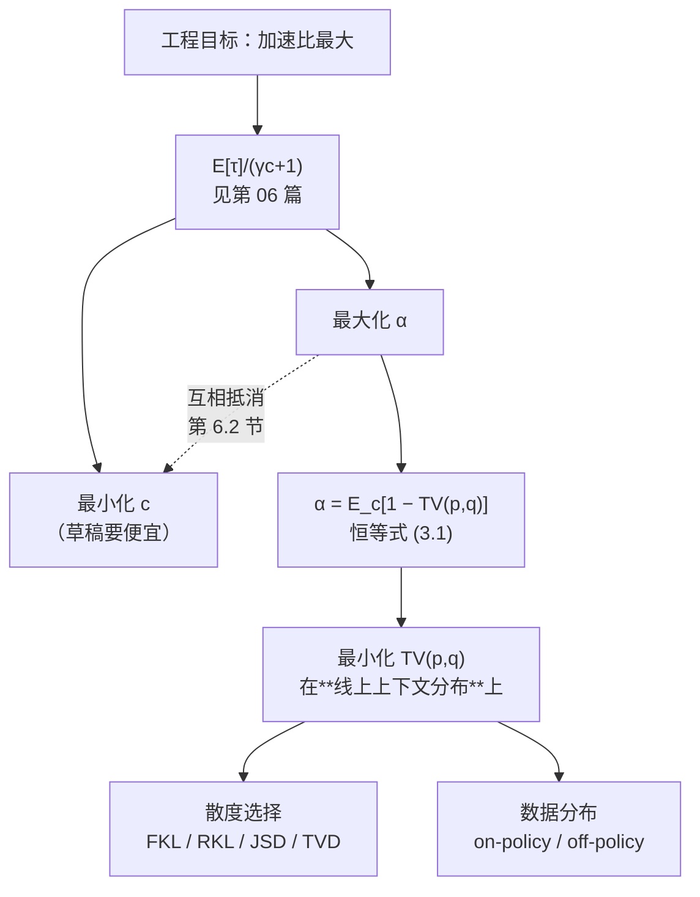
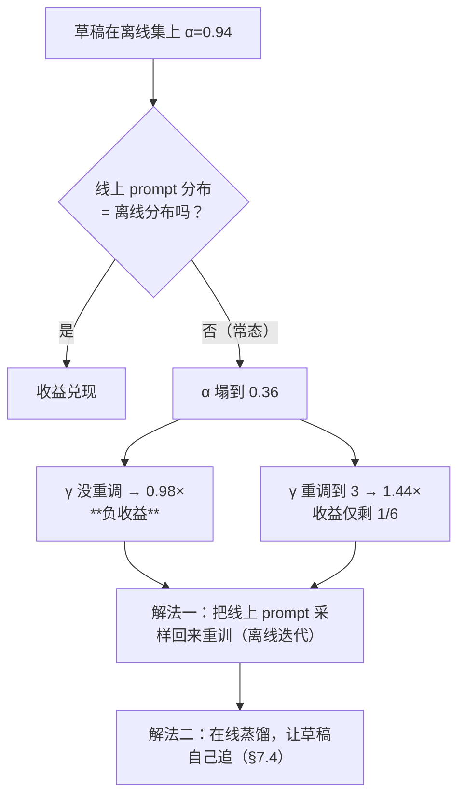

# 21 草稿模型怎么训 —— 对齐与在线蒸馏

## 1. 一句话

草稿模型的训练目标**不是"把语言建模做好"，而是"把自己的分布压到目标模型的分布上"**；
由 $\beta=\sum_x\min(p,q)=1-\mathrm{TV}(p,q)$，**最大化接受率等价于最小化总变差距离**——
而这件事，通用语料上的交叉熵**做不到**，甚至会把它推向反方向。

---

## 2. 从哪来：草稿训练是**纯性能工程**，不是正确性工程

先把一件最容易被搞混的事钉死。

[[04-拒绝采样修正-无损性的完整证明]] 已经精确枚举证明：只要接受判据是
$\min\!\big(1,\,p(x)/q(x)\big)$、拒绝后从 $p'=\mathrm{norm}(\max(0,p-q))$ 重采，
**无论草稿分布 $q$ 是什么**，输出流的分布逐点等于目标模型 $p$ 的链式概率。
测试 `_lab/test_lossless.py::test_lossless_holds_for_terrible_draft` 把草稿弄到
接受率 $<0.4$，逐点误差仍是机器精度 $<10^{-12}$；
`::test_lossless_holds_for_adversarial_draft` 更狠，把草稿的几乎全部质量押在目标最不可能的
token 上（接受率 $<0.15$），结论不变。

**这条在 L1（分布无损 / exact）口径下成立**，含义有三层，一层比一层重要：

1. 草稿训坏了，**输出仍然是对的**，只是慢；
2. 于是**草稿训练不需要正确性回归测试**——你不必担心"新草稿会不会让模型说错话"；
3. 于是**草稿权重可以在线热更新**（第 7.4 节的在线蒸馏就建立在这条上）。

> ⚠️ 三条边界，必须同时说清，否则第 2、3 条会被滥用：
> - **只在 L1 口径下成立。** 若你同时放宽了接受判据（Medusa 的 typical acceptance、各种置信度阈值），
>   那是 **L3 近似无损**，草稿质量会直接改变输出分布，训练就重新变成正确性工程了（见 [[07-无损的三种口径-分布无损不等于结果相同]]）。
> - **L1 不等于 L2。** 换一个草稿，同一个 prompt 的输出**会变**（采样路径不同），
>   只是**分布**不变。把"无损"理解成"结果一样"是社区最高频的错误，换草稿后线上文本变了不是 bug。
> - **热更新有一个致命的实现细节**：接受判据里的 $q$ 必须是**实际产生该 token 的那份权重**算出来的 $q$。
>   如果在起草与验证之间热插拔了权重、验证时用新 $q$ 去算 $\min(1,p/q)$，
>   分布立刻有偏（与 `test_threshold_rule_is_biased` 展示的是同一类错误：判据与采样分布不匹配）。
>   这条是 [[04-拒绝采样修正-无损性的完整证明]] 定理的直接推论，**本库未单独写测试**，
>   读者可用 `spec.py` 的 `first_token_dist` variant 机制自行构造反例。

**所以本篇通篇讨论的是速度，不是正确性。** 这也是为什么草稿训练在工程上被长期低估：
它不会让你半夜被叫起来救火，只会让你的 GPU 账单悄悄多一倍。

---

## 3. 机制拆解：训练目标的第一性依据

### 3.1 恒等式与它的直接后果

设在某个上下文 $c$ 下，目标模型给出分布 $p(\cdot\mid c)$，草稿给出 $q(\cdot\mid c)$。
[[05-接受率alpha-定义口径与怎么测]] 已经证明的恒等式：

$$
\beta(c)\;=\;\sum_x \min\big(p(x\mid c),\,q(x\mid c)\big)\;=\;1-\mathrm{TV}\big(p(\cdot\mid c),q(\cdot\mid c)\big)
\tag{3.1}
$$

其中 $\mathrm{TV}(p,q)=\tfrac12\|p-q\|_1=\sum_x\max(0,p-q)$。
验证：`_lab/test_lossless.py::test_beta_equals_one_minus_tv`（100 组随机 Dirichlet 分布，误差 $<10^{-12}$）。

把它对上下文取期望，就是训练目标：

$$
\boxed{\;\max_{\theta}\;\alpha(\theta)=\mathbb E_{c\sim\mathcal D}\big[1-\mathrm{TV}\big(p(\cdot\mid c),\,q_\theta(\cdot\mid c)\big)\big]
\;\Longleftrightarrow\;
\min_{\theta}\;\mathbb E_{c\sim\mathcal D}\big[\mathrm{TV}(p,q_\theta)\big]\;}
\tag{3.2}
$$

这个式子里有**两个**被忽略的自由度，本篇后面两大节各处理一个：

- $\mathrm{TV}$ 本身**不可微、也不是常用损失**（第 4 节：用哪个散度代理它）；
- $\mathcal D$ 是**上下文的分布**，它到底是训练语料还是线上流量（第 7 节：数据从哪来）。



### 3.2 为什么"通用语料上的交叉熵"不是这个目标

在语料 $\mathcal C$ 上做标准语言建模，最小化的是

$$
\mathcal L_{\text{LM}}(\theta)=\mathbb E_{c\sim\mathcal C}\big[-\log q_\theta(y_c\mid c)\big]
$$

其中 $y_c$ 是**语料里真实出现的下一个 token**。它的最优解是**语料的真条件分布 $r(\cdot\mid c)$**，
不是目标模型的 $p(\cdot\mid c)$。而 $p\ne r$ ——目标模型有它自己的偏好、自己的错误、自己的风格。

于是就出现了本篇最反直觉的一句话：

> **一个更好的语言模型，可以是一个更差的草稿。**

第 5 节用 $|V|=5$ 把这句话算成具体数字（$\beta$：$0.40$ vs $0.95$）。

### 3.3 四种候选散度

| 记号 | 定义 | 最优解的行为 | 训练时需要什么 |
|---|---|---|---|
| **FKL**（前向 KL） | $\mathrm{KL}(p\|q)=\sum p\log\frac pq$ | **覆盖模式**（mass-covering / zero-avoiding）：$p>0$ 处 $q$ 不许为 0，否则损失发散 | 目标模型的 soft logits；对**任意**上下文可算 |
| **RKL**（反向 KL） | $\mathrm{KL}(q\|p)=\sum q\log\frac qp$ | **求模式**（mode-seeking / zero-forcing）：$p=0$ 处 $q$ 必须为 0；可以整块丢掉次要模式 | 需要**从 $q$ 采样**（或全词表求和） |
| **JSD** | $\tfrac12\mathrm{KL}(p\|m)+\tfrac12\mathrm{KL}(q\|m)$，$m=\tfrac{p+q}2$ | 折中，有界（$\le\log 2$） | 两侧都要 |
| **TVD** | $\tfrac12\|p-q\|_1$ | **正是 (3.2) 的目标本身** | 两侧都要；梯度分片常数，优化性质差 |

注意一件事：**只有 TVD 是真目标，其余三个都是代理。**
但代理不是随便选的——Pinsker 不等式给了它们合法性（下一节）。

---

## 4. 逐步推导：前向 KL 与反向 KL，哪个更利于提高 $\sum\min(p,q)$

### 4.1 两个方向都是**合法**代理（Pinsker）

Pinsker 不等式（本库约定 $\mathrm{TV}=\tfrac12\|p-q\|_1$）：

$$
\mathrm{TV}(p,q)\;\le\;\sqrt{\tfrac12\,\mathrm{KL}(p\|q)}
\tag{4.1}
$$

因为 $\mathrm{TV}$ 对称，把 $p,q$ 互换同样成立，于是

$$
\beta \;=\;1-\mathrm{TV}(p,q)\;\ge\;1-\sqrt{\tfrac12\min\big\{\mathrm{KL}(p\|q),\,\mathrm{KL}(q\|p)\big\}}
\tag{4.2}
$$

**结论一**：**把任一方向的 KL 压到 0，接受率就趋于 1。** 两个方向都是"零点一致"的代理。
LK Losses 论文（arXiv:2602.23881（2026-02），ICML 2026，Nebius）把这句话写成了原文：
*"KL divergence and acceptance rate share the same global optimum."*

**结论二（这才是关键）**：(4.2) 只是**下界**，而且是很松的下界。
**代理与真目标只在全局最优处重合；一旦草稿容量不够、只能停在次优点上，两者就分道扬镳。**
LK Losses 的后半句正是这个：*"small draft models often converge to suboptimal solutions where minimizing KL divergence doesn't maximize acceptance rate."*

所以问题不是"哪个 KL 是对的"，而是"**草稿的容量在哪里绷断，绷断时哪个方向的失败模式更便宜**"。

### 4.2 容量绷断时会发生什么（本节是**我的分析**，附玩具实测）

把"草稿容量不足"建模成一个可计算的极端情形：**目标 $p$ 是双峰的，而草稿只能表示单峰。**
这是散度方向差异的教科书场景，也正好能算出 $\beta$。

设 $|V|=16$，$p$ 是两个高斯峰（位置 3 与 12，$\sigma=1$）的混合；
草稿族限定为**离散高斯** $q_{\mu,\sigma}\propto\exp\!\big(-(x-\mu)^2/2\sigma^2\big)$，在 $(\mu,\sigma)$ 上网格搜索。
分别求 FKL 最优、RKL 最优、以及**直接最大化 $\beta$** 的最优，比较三者的 $\beta$。

实测（复跑命令见 §6.0；玩具分布，**batch 概念不适用**，与任何真实模型无关）：

| $p$ 的形状 | 训练目标 | $\mu^\*$ | $\sigma^\*$ | $\beta$ | FKL | RKL |
|---|---|---|---|---|---|---|
| 对称双峰 0.5/0.5 | 前向 KL | 7.50 | 12.000 | **0.4918** | 0.6638 | 1.6295 |
| | 反向 KL | 3.00 | 1.005 | **0.5000** | 12.7583 | 0.6932 |
| | 直接最大化 $\beta$ | 3.50 | 1.977 | **0.5034** | 4.2344 | 1.3538 |
| 不对称 0.7/0.3 | 前向 KL | 0.00 | 8.824 | **0.4927** | 0.6647 | 1.6298 |
| | 反向 KL | 3.00 | 1.005 | **0.7000** | 7.4600 | 0.3567 |
| | 直接最大化 $\beta$ | 3.30 | 1.395 | **0.7001** | 5.2811 | 0.5321 |
| 强主峰 0.85/0.15 | 前向 KL | 1.40 | 5.179 | **0.5017** | 0.6504 | 1.5857 |
| | 反向 KL | 3.00 | 1.005 | **0.8500** | 3.6128 | 0.1625 |
| | 直接最大化 $\beta$ | 3.15 | 1.160 | **0.8500** | 3.4154 | 0.1976 |

**读法（三条，第三条最重要）**：

1. **前向 KL 的最优解把 $\sigma$ 撑爆了**（$\sigma^\*=5$–$12$，而词表只有 16 个位置——
   等于把 $q$ 压平成接近均匀分布）。机制很直白：FKL 在 $p>0$ 而 $q\to0$ 处损失发散，
   为了避开这个无穷惩罚，$q$ 必须去覆盖两个峰，可它只有一个峰可用，于是只能把自己摊平。
   **而 $\beta=\sum\min(p,q)$ 对"摊平"是线性收费的**：摊到谷底的那部分质量，
   既不在 $p$ 的高处、又占用了归一化预算，**一分钱接受率也换不回来**。
2. **反向 KL 的最优解锁定主峰**，$\beta$ 直接等于主峰的质量（0.5 / 0.70 / 0.85），
   在不对称与强主峰两种情形下**几乎追平了 $\beta$ 的理论最优**（0.7000 vs 0.7001；0.8500 vs 0.8500）。
3. **$p$ 越尖锐、越不对称，RKL 的优势越大**：对称双峰时两者只差 0.008，
   强主峰时差到 **0.4918 vs 0.8500（1.73 倍）**。而真实 LLM 的下一 token 分布，
   在绝大多数位置上正是"一个主峰 + 一条长尾"——**这一侧的 $p$ 恰好落在 RKL 占优的区域**。

> **我的推断（标为推断，非文献结论）**：
> 在**草稿容量显著小于目标**、且**目标分布尖锐**（低温、代码/结构化输出）的场景下，
> **反向 KL 比前向 KL 更利于提高 $\sum\min(p,q)$**，因为 $\beta$ 惩罚的是"质量花在了没用的地方"，
> 而这正是前向 KL 的强制覆盖行为所制造的浪费。
> **反过来，在高温采样、$p$ 本身接近平坦**时，覆盖模式的浪费变小、求模式的丢峰损失变大，前向 KL 会追回来。
> 这与 [[05-接受率alpha-定义口径与怎么测]] §6 的温度实测是同一个几何：$\alpha$ 的形状由分布的尖锐程度决定。
>
> ⚠️ **这条推断的边界必须说清**：上表用的是一个**硬参数族**（单峰高斯），
> 而真实草稿是高容量神经网络，容量限制不是"只能单峰"，而是"深度/宽度/上下文压缩"造成的更微妙的约束。
> 上表说明的是**机制**（$\beta$ 如何为覆盖行为收费），**不是**对真实 drafter 的定量预测。

### 4.3 文献怎么说：**没有普适赢家，而且方向依赖解码设置**

这个问题在公开文献里被系统做过一次，就是 **DistillSpec**：

> **DistillSpec: Improving Speculative Decoding via Knowledge Distillation**
> arXiv:2310.08461，v1 **2023-10-12**
> 作者：Yongchao Zhou, Kaifeng Lyu, Ankit Singh Rawat, Aditya Krishna Menon, Afshin Rostamizadeh,
> Sanjiv Kumar, Jean-François Kagy, Rishabh Agarwal（**完整机构清单未逐一核对**）

它做了两件本篇最需要的事：

**(a) 论文把 (3.1) 明写了出来**：$\beta(x,y_{<t})=1-D_{\mathrm{TVD}}\big(p(y_t),q(y_t)\big)$。
所以"最小化 TVD 直接最大化接受率"是论文自己的说法，不是本库的发挥。

**(b) 它把 FKL / RKL / JSD / TVD 四个散度做了对照**，结论逐字是
*"the choice of the most suitable divergence is highly task-dependent"*、
*"which divergence function and data construction lead to the largest block efficiency improvements highly depends on the task"*。具体三行：

| 设置 | 最好的组合 |
|---|---|
| 贪心解码 + XSum | **JSD** 略胜其余 |
| 贪心解码 + GSM8K | **FKL + 仅用草稿自己生成的数据**（on-policy 于草稿） |
| 温度采样 $T=1$ | **RKL + 用目标模型 $\mathcal M_p$ 生成的数据** |

论文整体口径：相对标准投机解码 **10–45% 提速**，贪心与非贪心采样都测了；
**具体模型/任务/batch/硬件未在摘要给出，本篇不做横向比较**（铁律二）。

**这张表有两个值得盯的地方**：

1. **温度采样下赢的是 RKL** —— 与 §4.2 的机制分析方向一致（采样时真正要抢的是主峰附近的质量重合）。
2. **真目标 TVD 并没有普遍赢。** 一个直接优化目标本身的损失，实测打不过它的代理，
   这在优化里并不罕见（TVD 的梯度是分片常数，优化景观差），
   但它把"代理 vs 真目标"的关系彻底翻了个面：
   **代理不是无奈的妥协，代理有时候就是更好的优化路径。**

2026 年这一侧的最新进展就是冲着这条缝去的：**LK Losses**（arXiv:2602.23881，ICML 2026，Nebius；
博客 <https://nebius.com/blog/posts/lk-losses>）设计**直接以接受率为目标**的损失，
覆盖 **4 种草稿架构 × 6 个目标模型（8B–685B）**，报告
**平均接受长度提升最高 8–10%**（general / coding / math 三类域；**batch 与硬件口径原文未给出**），
且宣称无额外计算开销、可直接插进现有训练框架。

### 4.4 一条实践上更重要的、经常被略过的理由

**前向 KL 是"免费"的，反向 KL 不是。**

- 拿目标模型跑一遍数据、把每步的 soft logits（或 top-k）存下来，用交叉熵训草稿——
  这就是前向 KL（准确说是 $H(p)+\mathrm{KL}(p\|q)$，$H(p)$ 与 $\theta$ 无关）。
  **一次数据生成，可以反复训很多轮**，这是离线蒸馏流水线的全部经济性所在。
- 反向 KL 要在**当前 $q$** 上求期望，$q$ 每更新一步、采样分布就变，
  等价于一个 on-policy 的过程；要么全词表求和（要目标 logits 常驻显存），要么频繁重采样。

所以工业界的**默认**是前向 KL / 交叉熵，**不是因为它更好，而是因为它更便宜**。
EAGLE 系列、Medusa、MTP 头的公开训练配方，主干都是这一路（见 [[12-Medusa-多头草稿与树注意力的诞生]]、
[[13-EAGLE三代-特征级自回归的演进]]、[[14-MTP-从训练目标到推理草稿]]）。
Aurora（§7.4）之所以要把训练重述成 RL，本质就是要把"反向"那一侧的信号买回来。

---

## 5. 小数字算例：一个更好的语言模型，是一个更差的草稿

$|V|=5$。某个上下文下：

- **语料真值** $r=(0.10,\,0.10,\,0.10,\,0.10,\,0.60)$ —— 第 5 个 token 才是"人类真正会写的那个"；
- **目标模型** $p=(0.50,\,0.25,\,0.15,\,0.07,\,0.03)$ —— 它自信地押在第 1 个 token 上（**它就是这么想的，对不对不归我们管**）；
- **草稿 A**：在通用语料上用交叉熵训到收敛 $\Rightarrow q_A\approx r$；
- **草稿 B**：拿目标模型 $p$ 蒸馏，但没训完美 $q_B=(0.45,\,0.28,\,0.16,\,0.08,\,0.03)$。

逐项手算 $\beta=\sum\min(p,q)$：

$$
\beta(p,q_A)=\min(.5,.1)+\min(.25,.1)+\min(.15,.1)+\min(.07,.1)+\min(.03,.6)
=.10+.10+.10+.07+.03=\mathbf{0.40}
$$
$$
\beta(p,q_B)=.45+.25+.15+.07+.03=\mathbf{0.95}
$$

四个数放一起（实测复跑见 §6.0）：

| 草稿 | $\beta$ | $\mathrm{TV}(p,q)$ | 对**语料真值**的交叉熵 | 对**目标 $p$** 的交叉熵 |
|---|---|---|---|---|
| A（通用语料 CE） | **0.4000** | 0.6000 | **1.2275**（好） | 2.2488 |
| B（蒸馏 $p$） | **0.9500** | 0.0500 | 2.7469（差 2.24×） | **1.2744**（好） |

**草稿 A 是明显更好的语言模型，却是差得多的草稿。**
换算成收益（口径：理想模型、假设"验证免费"、隐含 bs=1 且在 memory-bound 区、$c=0.02$；
公式与前提见 [[06-期望接受长度与加速比模型-完整推导]]，**这是上界不是实测**）：

| 草稿 | $\alpha$ | $\gamma^\*$ | $E[\tau]@\gamma^\*$ | 理想加速比 | 固定 $\gamma=5$ 时 |
|---|---|---|---|---|---|
| A | 0.4000 | 3 | 1.6240 | **1.5321×** | 1.5089× |
| B | 0.9500 | 31 | 16.1258 | **9.9542×** | 4.8165× |

**同一个目标模型、同一份硬件预算，只因为草稿的训练目标选错了，理想加速比差 6.5 倍。**（口径：理想模型 $E[\tau]/(\gamma c+1)$，**batch size = 1 且落在 memory-bound 区**，$c=0.02$，假设"验证免费"；这是上界不是实测，与上表同口径。）
这就是本篇存在的理由。

---

## 6. 代码验证

### 6.0 复跑命令

三段都在 `_lab` 目录下运行，**不新增文件**：

```bash
cd _lab

# (1) §5 的 |V|=5 算例
python -c "
import numpy as np
from spec import beta_overlap, total_variation
from accept import expected_tokens, speedup_ideal, optimal_gamma
p=np.array([0.50,0.25,0.15,0.07,0.03]); r=np.array([0.10,0.10,0.10,0.10,0.60])
qA=r.copy(); qB=np.array([0.45,0.28,0.16,0.08,0.03])
for n,q in [('A',qA),('B',qB)]:
    print(n, 'beta=%.4f TV=%.4f CE_r=%.4f CE_p=%.4f'%(beta_overlap(p,q), total_variation(p,q),
          -float((r*np.log(q)).sum()), -float((p*np.log(q)).sum())),
          'gamma*,speedup=', optimal_gamma(beta_overlap(p,q),0.02))
"

# (2) §4.2 的 FKL / RKL / beta 三种最优解（网格搜索，约 10 秒）
python -c "
import numpy as np; V=16; x=np.arange(V)
bim=lambda w,s=1.0:(lambda z:z/z.sum())(w*np.exp(-(x-3.)**2/(2*s*s))+(1-w)*np.exp(-(x-12.)**2/(2*s*s)))
qf=lambda mu,sg:(lambda z:z/z.sum())(np.exp(-(x-mu)**2/(2*sg*sg))+1e-12)
MU=np.linspace(0,15,301); SG=np.exp(np.linspace(np.log(.3),np.log(12),181))
FKL=lambda p,q:float((p*np.log(p/q)).sum()); RKL=lambda p,q:float((q*np.log(q/p)).sum())
NB =lambda p,q:-float(np.minimum(p,q).sum())
for w in (0.5,0.7,0.85):
    p=bim(w)
    for tag,ob in [('FKL',FKL),('RKL',RKL),('maxBeta',NB)]:
        b=min(((ob(p,qf(m,s)),m,s) for m in MU for s in SG))
        q=qf(b[1],b[2]); print(w,tag,'mu=%.2f sg=%.3f beta=%.4f'%(b[1],b[2],np.minimum(p,q).sum()))
"

# (3) §6.1 分布漂移 与 §6.2 (alpha,c) 对照
python -c "
import numpy as np
from spec import ToyMarkov, perturb, beta_overlap
from accept import optimal_gamma, expected_tokens, speedup_ideal
V=8; tgt=ToyMarkov(V,seed=5,temp=1.0)
good=perturb(tgt,eps=0.15,seed=99); bad=perturb(tgt,eps=3.0,seed=99)
drf=ToyMarkov.__new__(ToyMarkov); drf.V=V; drf.T=np.vstack([good.T[:4],bad.T[4:]])
b=np.array([beta_overlap(tgt.dist(s),drf.dist(s)) for s in range(V)]); print('beta/state',np.round(b,4))
for n,w in [('train',np.array([.25]*4+[0]*4)),('serve',np.array([0]*4+[.25]*4)),('mix',np.array([.125]*8))]:
    a=float(w@b); print(n,'alpha=%.4f'%a, optimal_gamma(a,0.02), 'g=6 -> %.4f'%speedup_ideal(a,6,0.02))
print('搬 gamma=29 到线上:', round(speedup_ideal(0.3557,29,0.02),4))
for a,c in [(0.75,0.02),(0.85,0.10)]:
    g,s=optimal_gamma(a,c); print('a=%.2f c=%.2f g*=%d E=%.4f S=%.4f'%(a,c,g,expected_tokens(a,g),s))
"
```

### 6.1 分布漂移：接受率的头号杀手（实测）

造一个"训练分布内很准、训练分布外很烂"的草稿：
玩具一阶马尔可夫链 $|V|=8$，草稿在状态 0–3 上几乎完美（`eps=0.15`），在状态 4–7 上没学过（`eps=3.0`）。
逐状态 $\beta$：

```
[0.9188 0.9650 0.9639 0.9336 | 0.2419 0.4680 0.5760 0.1369]
   <-------- 训练见过 -------->   <------ 线上才遇到 ------>
```

| 上下文分布 | $\alpha$ | $\gamma^\*$ | 理想加速比 | 固定 $\gamma=6$ 时 |
|---|---|---|---|---|
| **训练分布**（全落在 0–3） | 0.9453 | 29 | **9.4350×** | 5.3136× |
| **线上分布**（全落在 4–7） | 0.3557 | 3 | **1.4408×** | 1.3848× |
| 混合 50/50 | 0.6505 | 7 | 2.4296× | 2.4290× |

（口径：玩具马尔可夫模型，seed 固定；理想加速比模型、假设"验证免费"、隐含 bs=1；
**这些是上界，不是任何真实系统的实测值**。复跑见 §6.0 第 (3) 段。）

**最刺眼的一格不在表里**：
把在训练分布上调好的 $\gamma^\*=29$ **原样搬到线上分布**，理想加速比 = **0.9823×**。

> **不是"收益变小"，是收益变成负的。** 而这还是在"验证免费"这个最宽容的假设下算出来的
> —— 真实系统里再叠上验证开销、调度开销、batch 挤占（[[18-batch与吞吐-收益衰减曲线]]），
> 会更难看（[[19-负收益全解-什么时候投机反而更慢]]）。

两条可执行结论：

1. **草稿的接受率与 $\gamma$ 必须在线上分布上重新测、重新调**，离线数字不能搬。
2. **草稿训练与 $\gamma$ 调参是耦合的**：训练分布一变，最优 $\gamma$ 从 29 掉到 3。
   静态 $\gamma$ 是脆的，这也是 [[17-动态草稿长度与自适应停止]] 存在的理由。

### 6.2 本篇要求的对照：训得更准（$\alpha\uparrow$）通常意味着草稿更大（$c\uparrow$），两者互相抵消

由 [[06-期望接受长度与加速比模型-完整推导]] 的 (4.4)：$\text{speedup}=\dfrac{1-\alpha^{\gamma+1}}{(1-\alpha)(\gamma c+1)}$。
把"小而糙"和"大而准"两个草稿放一起算（口径同上：理想模型 / 验证免费 / bs=1 / 无工程开销）：

| 草稿 | $\alpha$ | $c$ | $\gamma^\*$ | $E[\tau]@\gamma^\*$ | **理想加速比** |
|---|---|---|---|---|---|
| **小而糙** | 0.75 | 0.02 | 9 | 3.7747 | **3.1989×** |
| **大而准** | 0.85 | 0.10 | 7 | 4.8501 | **2.8530×** |

**小而糙赢 12.1%。**

而且这不是 $\gamma^\*$ 选法造成的假象——**固定同一个 $\gamma$ 逐点比，小而糙也全线领先**：

| $\gamma$ | 3 | 5 | 7 | 9 | 12 |
|---|---|---|---|---|---|
| $(\alpha{=}0.75,\,c{=}0.02)$ | 2.5796 | 2.9892 | 3.1575 | **3.1989** | 3.1492 |
| $(\alpha{=}0.85,\,c{=}0.10)$ | 2.4512 | 2.7682 | **2.8530** | 2.8180 | 2.6639 |

注意 $E[\tau]$ 的方向是**反的**：大而准的草稿一次能多吐 1.08 个 token（4.85 vs 3.77），
**接受长度赢了，加速比却输了**。

> **这条是铁律二在训练场景下的直接后果**：
> **单独报「平均接受长度从 2.77 涨到 3.05」是没有意义的**，
> 除非同时报出草稿成本 $c$ 有没有变。
> 接受长度是**分子**；把分母搞大 20%，分子涨 10% 就是净亏。

### 6.3 等收益线：$\alpha$ 每涨一档，$c$ 最多能涨到多少？

固定基准 $(\alpha{=}0.75,\,c{=}0.02)$ 的理想加速比 3.1989×，二分求"让收益打平"的最大 $c$：

| 目标 $\alpha$ | 允许的最大 $c$ | 相对基准的**倍数** | 该点的 $\gamma^\*$ | 达成的加速比 |
|---|---|---|---|---|
| 0.75 | 0.0200 | 1.00× | 9 | 3.1989 |
| 0.80 | 0.0442 | **2.21×** | 8 | 3.1989 |
| 0.85 | 0.0752 | **3.76×** | 8 | 3.1989 |
| 0.90 | 0.1151 | **5.76×** | 9 | 3.1989 |
| 0.95 | 0.1703 | **8.52×** | 11 | 3.1989 |

**这张表就是训练草稿时的记账本，读法有三条：**

1. **想把 $\alpha$ 从 0.75 拉到 0.85，你的成本预算只有 3.76 倍。**
   由于 $c$ 大致正比于草稿的前向开销（层数 × 宽度），
   "多训几轮 / 换更好的散度 / 换更好的数据"是**几乎不增加 $c$ 的手段**，永远优先；
   "把草稿从 1 层加到 4 层"是**直接乘 $c$ 的手段**，必须先查这张表。
2. **边际预算是递减的（乘法意义上）**：每 +0.05 的 $\alpha$，允许的成本倍数依次是
   $2.21\to1.70\to1.53\to1.48$。**你已有的 $\alpha$ 越高，为再提一点而多花的钱就越不划算。**
3. **绝对预算是递增的**（$+0.024\to+0.031\to+0.040\to+0.055$）。
   两条一起看，结论是：**在 $\alpha$ 低的时候扩草稿最划算；$\alpha$ 高了以后应该转向压 $c$。**
   这正好解释了这一行业的方向性转变：从"独立小模型当草稿"（$c\sim0.1$）
   转向"单层草稿头 + 特征复用"（$c\sim0.02$），见 [[13-EAGLE三代-特征级自回归的演进]]。

---

## 7. 口径与坑

### 7.1 数据从哪来：四种配方

$\mathcal D$（上下文分布）与标签（谁生成的续写）是两个正交维度，组合出四种配方：

| 配方 | prompt 从哪来 | 续写由谁生成 | 优点 | 致命处 |
|---|---|---|---|---|
| **固定语料（off-policy）** | 公开数据集 | **语料里的人类文本** | 最便宜 | 学的是 $r$ 不是 $p$（§3.2、§5） |
| **self-distillation** | 公开 prompt | **目标模型自己**生成 | 分布完全对齐 $p$ | 生成 ~50 万条续写是主要算力开销 |
| **cross-distillation** | 公开 prompt | **更大的模型**生成 | 复用已有数据，省掉生成 | 分布不是 $p$ 的，理论上有偏 |
| **在线（on-policy，§7.4）** | **线上真实流量** | 目标模型在线产生 | $\mathcal D$ 就是线上分布本身 | 需要训练-服务闭环 |

**一条反直觉的实测**：cross-distillation 竟然**赢了** self-distillation。
Red Hat（<https://developers.redhat.com/articles/2026/07/06/smarter-data-generation-faster-speculator-training>，
**2026-07-06**，2026-07-09 更新）用 50 万条 prompt-response（30 万 Magpie + 20 万 UltraChat）、
训 3–4 个 epoch：

- 目标 **Qwen3-30B-A3B**，用 **Qwen3-235B-A22B** 生成的回答做 cross-distillation，
  **平均接受长度 2.77 → 3.05（约 +10%）**，七个负载全面胜过 self-distillation；
- 增益最大的是 **math reasoning 与 HumanEval**（非推理模式变体上 coding +37%、math reasoning +47%）。
- **batch / 硬件 / 温度口径原文未给出**，本篇不与其它来源横向比较（铁律二）。

> **为什么会这样？（我的推断）** 更大的模型生成的续写**质量更高、更"典型"**，
> 于是覆盖到的是目标模型在真实高质量对话里**实际会走的那条路径**；
> 而 self-distillation 会把目标模型自己的低质量、发散的输出也一并学进去。
> 换句话说：**分布对齐得越死，不一定越好——因为你要对齐的是"线上会遇到的 $p$"，不是"$p$ 的全部支撑"。**
> 这条与 §3.1 里 $\mathcal D$ 那个自由度是同一件事。

### 7.2 训练-解码错位：off-policy 的第二种形态

即使数据全部来自目标模型，还有一层错位：**草稿在训练时看到的上下文，和它在解码时看到的不一样。**

EAGLE 系草稿在推理时是**自回归地**用**自己上一步的输出**继续起草（第 2、3、4 个草稿 token 的输入
全是草稿自己造出来的），而训练时喂的是**目标模型的真实特征**（teacher forcing）。
这就是经典的 exposure bias，落到投机解码上就是：**草稿位置越靠后，接受率掉得越快。**

**HASS**（*Learning Harmonized Representations for Speculative Sampling*，arXiv:2408.15766，
v1 **2024-08-28**，ICLR 2025；作者 Lefan Zhang, Xiaodan Wang, Yanhua Huang, Ruiwen Xu；**机构未查证**）
把它拆成两条并分别修：

- **objective misalignment**：训练目标与解码目标不一致 → harmonized objective distillation；
- **context misalignment**：训练时的上下文（hidden state / KV）与解码时不一致 → harmonized context alignment。

报告：三个数据集平均 **2.81×–4.05× 墙钟加速**，比 EAGLE-2 提升 **8%–20%**，四个 LLaMA 模型。
**口径缺项**：batch size 未给出（按 [[15-谱系图与被淘汰的分支]] 的普遍规律，这类头条倍数几乎都是 bs=1 的延迟数字）、
硬件与温度未在摘要给出 —— **不可与本库其它来源的倍数横向比较**。

同一根病灶在 MTP 上也犯：LK Losses 论文指出，**DeepSeek-V3 的 MTP 模块主要是为"预测第一个 token"训练的，
推理时却被自回归地反复复用到后面的位置**，导致后面位置接受率退化（见 [[14-MTP-从训练目标到推理草稿]]）。

### 7.3 分布漂移：数字见 §6.1，这里给判据



可判定的判据（自己填阈值）：

- **上线前**：在**线上 prompt 的真实采样**（不是公开 benchmark）上测 $\alpha$，
  与离线集上的 $\alpha$ 相差 > 0.10 就不要上线，先补数据。
- **上线后**：把**平均接受长度 (acceptance length, AL)** 做成一等监控指标持续打点。
  AL 相对启动值下降超过 X%（建议 10%）告警。理由见下一节。

### 7.4 在线蒸馏 / 持续训练：收益、机制、以及一条已确认的生产陷阱

**代表工作：Aurora**（Together AI 等）

> **Aurora: Adaptive Speculative Training for LLMs** —— arXiv:**2602.06932**，**ICML 2026**
> 项目页 <https://aurora-spec-ai.github.io/>；博客 <https://www.together.ai/blog/aurora>；代码 github.com/togethercomputer/aurora
> 作者含 Junxiong Wang、Avner May、Ce Zhang、**Tri Dao**、**Percy Liang**、Ben Athiwaratkun、Xiaoxia Wu 等（主机构 Together AI）

**机制（相对离线蒸馏新增了什么）**：把在线 speculator 学习**重述成异步强化学习问题**。

- **草稿 = 策略 $\pi$，目标模型 + 验证器 = 环境**；
- 每个请求的**被接受 token 与被拒绝 token 都**流回分布式 data buffer
  —— 原文：*"accepted tokens provide positive feedback, while rejected speculator proposals provide implicit negative feedback."*
- 两个损失：**acceptance loss**（在被接受 token 上的交叉熵，≈ 前向 KL 那一侧）
  \+ **rejection loss**（基于 KL 的目标，把概率质量推离被拒的预测，≈ 反向那一侧的信号）；
  → **这正好是 §4.4 说的"把反向那一侧的信号买回来"**；
- 推理服务器（SGLang）与训练服务器解耦，训练在草稿副本上更新、**热插拔权重回服务，不中断请求**；
  **lazy synchronization** 在"适应速度"和"服务稳定"之间取平衡。

**数字**（口径见括号，缺项照实标）：

| 场景 | 模型 | batch | 结果 | 硬件 |
|---|---|---|---|---|
| **Day-0 从零** | MiniMax M2.1 (229B) / Qwen3-Coder-Next (80B) | 4/8 | **约 1.5× 吞吐** | **原文未给出** |
| 域漂移下 vs 静态 speculator | Qwen3-8B | 多 batch | **额外 1.25×** | **原文未给出** |
| 域漂移恢复 | Qwen3-8B | 4 | 约 **10,000 个请求**内恢复 | **原文未给出** |

**三条经验结论（博客明说）**：① 简单的在线微调就能拿到大部分可得收益；
② lazy synchronization 平衡最好；③ **day-0 从零部署可行**——没训过的 speculator 在几千个请求内
就能达到有竞争力的接受率，**离线预训练这个瓶颈可以被绕过**（它想干掉的是离线蒸馏那条
可能到 PB 级的 activation 采集与 replay 流水线）。

vLLM 侧的对应能力：**Speculators v0.5.0（2026-05-28）新增 DFlash 支持与在线训练**
（<https://blog.vllm.ai/blog/2026-05-28-speculators-v050>；**具体机制本篇未抓到，标为未查证**）。

#### 风险：草稿侧的"状态"在生产中确实会漂 —— vLLM issue #41838（**已核实**）

这条是本节最该被记住的东西，因为它说明**在线更新草稿并不是唯一会漂的东西，不更新也会漂**。

> **[Bug]: Eagle 2/3 acceptance length regression over time** —— vLLM issue **#41838**，
> <https://github.com/vllm-project/vllm/issues/41838>，**状态：Open（未解决）**
> （本篇于 2026-08 直接打开 issue 页逐字核对）

报告逐字：*"Speculative decoding acceptance length (AL) smoothly and monotonically regresses over time
when serving models with Eagle/Eagle3 draft models."*

| 模型 | 配置 | 起始 AL | 退化后 AL |
|---|---|---|---|
| Model A | EAGLE-2，BF16 | ~3.07 | ~2.8（数小时内） |
| Model B | EAGLE-3，FP8，**batch=4** | ~4.5 | **~2.8** |
| Model B | EAGLE-3，FP8，**batch=2** | ~4.2 | ~3.8 |

（**模型名、硬件、温度、任务分布原报告均未给出**，只能按"同一部署内的时间序列"读，
**绝对值不可与任何其它来源比较**。）

三条关键观察，逐字：

- *"AL never recovers — only a full service restart resets it to the initial high value"* —— 且重启后立刻恢复，
  **与当时的流量水平无关**；
- 只有**高流量的 prompt 类型**受影响；
- vLLM **0.17.1** 与 **0.19.1** 均复现；
- **TensorRT-LLM 对照**：*"TRT-LLM: slight AL regression at peak traffic but recovers during low traffic.
  vLLM only regresses, never recovers"* —— 即 TRT-LLM 在峰值时也会轻微退化但**会自行恢复**，
  vLLM 只退不回。（本库 `_research/RS-4` 早期记录把这一格写成"TensorRT-LLM 不退化"，
  **本篇按 issue 原文修正为"会退但会恢复"**。）

报告者猜测根因与投机解码下的 KV cache 状态处理有关（关联 #14649，涉及近似隐藏状态与 KV cache 覆写）。

> **为什么这条对"草稿怎么训"这一篇至关重要**：
> 1. **它证明草稿侧存在真实的运行时状态漂移**，而不只是"训练分布 ≠ 线上分布"这种静态错配。
>    在线蒸馏要在一个**本身就在漂**的系统上做闭环，这会让"是训练在起作用还是引擎在退化"变得难以归因。
> 2. **它让所有短时压测数字失效**：你压测 10 分钟看到 AL=4.5、算出 1.8×，
>    跑几小时后 AL 掉到 2.8，收益腰斩，**而监控上没有任何报错**。
> 3. **可执行动作**：把 AL 做成持续打点的一等指标 + 设"相对启动值下降 > X%"的告警；
>    验收草稿头时，**只测一次不算测过**（见 §7.6 清单 E 项）。

### 7.5 训练框架现状与官方权重（截至 2026-08）

**这一层在 2025–2026 完成了从"手工活"到"基础设施"的转变**，标志是三件事同时发生：
格式标准化、框架产品化、训练在线化。

| 框架 | 归属 | 首发 | 一句话 |
|---|---|---|---|
| **SpecForge** | LMSYS / SGLang | 2025-07-25 | 双模式训练（online / offline），跨厂商（AMD ROCm 官方教程收录） |
| **Speculators** | vLLM 项目 / Red Hat | 2025 起 | 解决**格式**问题：HF 兼容 checkpoint，`speculators_config` 一插即用 |
| **TorchSpec** | 与 EAGLE 团队 / vLLM 合作 | 2026-05-26 | EAGLE 3.1 及后续算法的训练基础设施 |
| **DeepSpec** | （见 [[24-前沿进展-2025到2026]]） | 2026 | 内含 Eagle3 / DFlash / DSpark 三种实现 |
| **AngelSpec** | Tencent | 2026-07 | arXiv:2607.25852，按负载分化结构与训练数据 |

**SpecForge 的两种模式**是这一层最该被记住的设计（blog <https://www.lmsys.org/blog/2025-07-25-spec-forge/>，2025-07-25，**已核实**）：

- **Online**：*"generates hidden states on the fly"* —— 冻结 target 边跑边生成 aux hidden state，
  同时训 draft。**磁盘需求低，但目标模型大时要更多 GPU。**
- **Offline**：*"precomputes hidden states once and reuses them efficiently"* ——
  先把 hidden state 全部生成并落盘，再单独训 draft。**最少 1 张 GPU 就能训，但吃海量磁盘
  （原文举例：UltraChat + ShareGPT 约 12TB）。**

> **这两行是本节最有工程价值的一句话**：**训草稿的真正瓶颈不是算力，是"目标模型的中间激活往哪放"。**
> 你要么用 GPU 换磁盘（online），要么用磁盘换 GPU（offline）。
> Aurora 想干掉的，正是 offline 这条路上那个 PB 级的存储账单。

SpecForge blog 报告的数字：**Llama 4 Maverick 在 MT-Bench 上 2.18×、Llama 4 Scout 2.0×**
（**batch size / 硬件 / 温度原文未给出，口径不全，不可横向比较**）。
本库 `_research/RS-5` 另记有 SpecForge 论文（arXiv:**2603.18567**）报告
Qwen3-235B-A22B 的 EAGLE-3 训练最高快 9.9×、端到端最高 4.48× ——
**该 arXiv 编号与数字本篇未独立复核，且原文未给 batch/硬件口径，仅作转述。**

**vLLM 还给了一条"自己造训练数据"的官方通道**：`method="extract_hidden_states"`。
它不是投机方法，而是借投机配置的口子让 vLLM 在推理时把中间层激活 dump 成 `.safetensors`，
用来训 EAGLE 系草稿头。**硬限制（文档原文）**：*"Chunked prefill is not compatible with this feature and must be disabled."*
详见 [[20-主流引擎实现-vLLM与SGLang与TensorRTLLM]]。

**要不要自己训？先查有没有现成权重。** 按 vLLM v0.27.1 文档：

| 方法 | 权重来源 | 需要训练吗 |
|---|---|---|
| `ngram` / `suffix` | 无权重，纯算法 | **否**（见 [[11-无模型草稿-promptlookup与ngram与检索]]） |
| `mtp` / `dspark` | **target checkpoint 内自带** | **否** |
| `draft_model` | 任何同族小模型（`Qwen3-8B` + `Qwen3-0.6B`） | **否**（但 $\alpha$ 通常不如专训的） |
| `eagle` / `eagle3` | 独立 HF 仓库（`yuhuili/*`、`RedHatAI/speculator-models`、`nvidia/gpt-oss-120b-Eagle3-v2`） | 是，但**有大量现成权重** |
| `mlp_speculator` | `ibm-ai-platform/*-accelerator` 等 9 个 | 是（IBM 已放出） |
| PARD | `amd/PARD-Qwen3-0.6B` 等 | 是（AMD 已放出） |

> **判据**：**你的目标模型如果有官方 EAGLE-3 权重，先用它测出基线 $\alpha$，
> 再决定要不要自己训。** 自训的唯一正当理由，是"你的线上分布与公开配方差得足够远"
> —— 而这件事是可以先测的（§7.3）。

### 7.6 怎么评估一个草稿头训好了没有：可执行清单

**关键：不能只测一个温度、一个任务。** 理由是硬的，不是习惯问题：

- [[05-接受率alpha-定义口径与怎么测]] §6 实测证明 **$\alpha$ 随温度的曲线形状不是常数**，
  它取决于草稿与目标的 **argmax 一致率**：好草稿呈 **U 形**（贪心处高、中温有低谷、高温回升），
  烂草稿**单调上升**（`test_good_draft_alpha_is_non_monotone_in_temperature` /
  `test_poor_draft_alpha_is_monotone_in_temperature`）。
  **推论：在 $T=0$ 上比出来的"草稿 A 好于草稿 B"，在 $T=0.7$ 上可能反过来。**
- DistillSpec 的三行表（§4.3）实测证明**最优散度本身就是任务依赖的**。
  推论：**在 XSum 上选出来的训练配方，在 GSM8K 上不是最优的。**

**验收清单（逐条打勾，缺项即视为未验收）：**

**A. 扫温度**（至少 4 个点，必须包含线上实际用的那个）
- $T\in\{0,\,0.2,\,0.7,\,1.0\}$ + 线上真实的 top-p / top-k / min-p 组合；
- **top-p / top-k 截断必须与线上一致**：截断改的是 $p$ 与 $q$ 本身，$\alpha$ 会明显变化
  （L1 无损仍成立，只是"目标分布"换成了带采样参数的那个，见 [[05-接受率alpha-定义口径与怎么测]] §7.2）；
- 记下曲线形状（U 形还是单调）—— 形状本身就是"草稿好不好"的一个指标。

**B. 扫任务**（至少 4 类，且必须含线上占比最大的那类）
- 代码 / 数学推理 / 开放对话 / 摘要 / 工具调用（JSON）/ RAG 长上下文；
- **$\alpha$ 在任务间差 2 倍以上是常态**，用单任务平均值验收等于没验收。

**C. 扫 $\gamma$，并报 $\gamma^\*$，不要只报固定 $\gamma$ 的接受率**
- §6.1 已证：分布一变，$\gamma^\*$ 从 29 掉到 3；
- 报 $\gamma$-接受长度曲线，而不是一个数（`test_optimal_gamma_decreases_with_cost` 给出方向性保证：$c\uparrow\Rightarrow\gamma^\*\downarrow$）。

**D. 同时报 $c$，不许只报接受长度**
- §6.2 已证：接受长度 +28% 而加速比 −12% 是完全可能的；
- $c$ 的测法：在**同一 batch、同一上下文长度**下测草稿单次前向 / 目标单次前向的耗时比，**不要拿参数量比估算**。

**E. 时间维度：跑够长**
- 由 vLLM #41838（§7.4），**短时压测的 AL 会系统性偏高**；
- 至少跑到"AL 曲线在数小时尺度上稳定"，或明确记录"本次只测了 N 分钟"。

**F. batch 维度**
- $\alpha$ 本身与 batch 无关，但**收益强依赖 batch**（[[18-batch与吞吐-收益衰减曲线]]）；
- 至少测 bs $\in\{1,\,8,\,\text{线上典型并发}\}$，并同时报 **TPOT 与吞吐两条线**
  ——延迟涨了吞吐也可能跌。

**G. 统计纪律**
- 接受长度是"每轮一个观测"的随机变量，**必须多轮平均并报不确定度**（$s/\sqrt N$）；
- 固定并记录随机种子；
- **不要用 [[06-期望接受长度与加速比模型-完整推导]] 的闭式反推 $\alpha$** ——
  难度"连片"时公式会**高估** $E[\tau]$（`test_formula_overestimates_when_sticky`：$\alpha$ 相关性强时实测/公式低到 0.85），
  用它验收会把一个烂草稿判成合格。

**H. 一条负向对照（最容易被跳过）**
- 拿 `ngram` / `prompt-lookup` 这种**零训练成本**的草稿做基线。
  如果你辛苦训的草稿头赢不过它，那这次训练的正确结论是"不要训，用 n-gram"。

---

## 8. 失效条件（铁律三）

**什么时候"把草稿训得更好"是负收益？** 尽量写成可判定的形式。

| # | 条件 | 机制 | 证据 |
|---|---|---|---|
| **F1** | **提升 $\alpha$ 所付的 $c$ 倍数，超过 §6.3 等收益线** | $\text{speedup}=E[\tau]/(\gamma c+1)$，分母线性、分子饱和 | §6.2/§6.3 实测：$\alpha$ 0.75→0.85 若 $c$ 涨过 3.76×（0.02→0.0752）就是净亏 |
| **F2** | **训练分布 ≠ 线上分布，且 $\gamma$ 没有随之重调** | $\alpha$ 塌 + $\gamma$ 停在离线最优 | §6.1 实测：$\alpha$ 0.945→0.356，搬用 $\gamma=29$ → **0.9823×，负收益** |
| **F3** | **草稿容量已经绷断，而你还在用前向 KL / 通用语料 CE 继续训** | FKL 强制覆盖 → $q$ 摊平 → $\beta$ 线性受损 | §4.2 实测：强主峰下 FKL 最优解 $\beta=0.4918$，RKL 最优解 $\beta=0.8500$ |
| **F4** | **只在 $T=0$ 上调参，线上跑 $T\ge0.7$** | $\alpha$-温度曲线形状不是常数 | `test_good_draft_alpha_is_non_monotone_in_temperature`；[[05-接受率alpha-定义口径与怎么测]] §6 实测 0.697→0.657 |
| **F5** | **线上 batch 已经把 GPU 推进 compute-bound 区** | 验证不再免费，(4.4) 的分母假设失效 | [[18-batch与吞吐-收益衰减曲线]]、[[19-负收益全解-什么时候投机反而更慢]] |
| **F6** | **目标模型本身很小**（如 ≤2B），草稿前向 + 调度开销占比过高 | $c$ 无法压到足够小 | 本库 `_research/RS-4` §9.1 记录的 vLLM 生产 issue（1.7B 目标 + 135M 草稿） |
| **F7** | **长上下文负载**：$\alpha$ 高也救不了 verify 侧的 KV 读带宽 | 瓶颈换位置了，草稿再准也没用 | OWL（arXiv:2510.07535，2025-10）实测长上下文下 EAGLE-3 掉到 **0.81×**；见 [[22-长上下文下的投机采样]] |
| **F8** | **在线蒸馏跑在一个本身就在漂的引擎上** | 无法归因是训练在起作用还是引擎在退化 | vLLM **#41838**（Open，已核实）：AL 单调退化，只有重启能恢复 |
| **F9** | **用 §7.6-G 的闭式反推 $\alpha$ 来验收** | 难度连片时公式**高估** $E[\tau]$ | `test_formula_overestimates_when_sticky`（$\alpha$ 强相关时实测/公式 = 0.85–0.97） |

> **一条总的判据**：**训练草稿之前，先把 §6.3 的等收益线按你自己的基线算一遍。**
> 如果算下来"允许的成本倍数"小于你计划改动带来的 $c$ 增幅，
> 那这次训练在开始之前就已经输了 —— 无论 $\alpha$ 涨多少。

---

## 9. 自测题

**Q1.** 有人说："我们的草稿模型训练脚本要加一道输出质量回归测试，否则草稿训坏了模型会说错话。"
这句话对不对？在什么口径下对、什么口径下错？

<details><summary>答案要点</summary>

**在 L1 分布无损口径下错**：由 [[04-拒绝采样修正-无损性的完整证明]]，
只要接受判据是 $\min(1,p/q)$ + 残差重采，草稿再烂输出分布仍精确等于 $p$
（`test_lossless_holds_for_terrible_draft`：$\alpha<0.4$ 时逐点误差 $<10^{-12}$）。
草稿训练是纯性能工程。
**在 L3 口径下对**：若同时用了 typical acceptance / 置信度阈值这类放宽判据，
草稿质量直接改变输出分布，就必须做质量回归。
**还有一个独立的坑**：热插拔权重时，接受判据里的 $q$ 必须是**实际产生该 token 的那份权重**算的，
否则分布有偏 —— 这是实现 bug，不是训练问题。
</details>

**Q2.** 草稿 A 在通用语料上的困惑度比草稿 B 低一半。哪个更可能是更好的草稿？

<details><summary>答案要点</summary>

**不能判断，而且低困惑度往往是坏信号。** 语料交叉熵的最优解是语料真条件分布 $r$，
不是目标模型 $p$；训练目标应该是最小化 $\mathrm{TV}(p,q)$。
§5 的算例：$q_A\approx r$ 的语料交叉熵 1.2275（好），$\beta=0.40$；
$q_B$ 蒸馏自 $p$，语料交叉熵 2.7469（差 2.24 倍），$\beta=0.95$。
理想加速比（$c=0.02$，验证免费，bs=1）1.53× vs 9.95×。
</details>

**Q3.** 从第一性原理看，最该用的训练损失是 TVD（因为 $\beta=1-\mathrm{TV}$）。
为什么工业界几乎都在用交叉熵 / KL？

<details><summary>答案要点</summary>

三条，缺一不可：
① **优化性质**：TVD 梯度是分片常数，优化景观差；Pinsker 保证任一方向 KL 压到 0 则 TV 也到 0，
所以 KL 是**零点一致**的合法代理；
② **实测代理有时更好**：DistillSpec（arXiv:2310.08461）四散度对照里 TVD 并未普遍获胜，
最优散度**任务依赖**（贪心 XSum → JSD；贪心 GSM8K → FKL+草稿数据；$T=1$ → RKL+目标数据）；
③ **经济性**：前向 KL 只需目标 logits，数据生成一次可反复训多轮；
反向 KL / TVD 需要在当前 $q$ 上求期望，等价 on-policy，贵得多。
补充：LK Losses（arXiv:2602.23881，ICML 2026）正是冲这条缝去的 ——
KL 与接受率**同一个全局最优**，但小草稿停在次优点时两者分道扬镳。
</details>

**Q4.** 你把草稿从 1 层扩到 4 层，接受长度从 3.0 涨到 3.6（+20%）。这次改动值不值？还需要哪个数？

<details><summary>答案要点</summary>

**还缺 $c$。** 加速比是 $E[\tau]/(\gamma c+1)$，接受长度只是分子。
§6.2 的反例：$(\alpha{=}0.85,c{=}0.10)$ 的 $E[\tau]@\gamma^\*=4.85$，
比 $(\alpha{=}0.75,c{=}0.02)$ 的 3.77 高 28%，**加速比却低 12%**（2.853× vs 3.199×），
而且在 $\gamma=3,5,7,9,12$ 上全线落后。
正确做法是查 §6.3 的等收益线：由 0.75 抬到 0.85，$c$ 的预算只有 **3.76 倍**；
1 层扩到 4 层通常远超这个数。
</details>

**Q5.** 你们的 EAGLE-3 上线首日压测 AL=4.5、加速 1.8×，一周后用户反馈变慢，但监控无报错、AL 现在是 2.8。
最可能是什么？怎么区分"引擎问题"和"用户流量变了"？

<details><summary>答案要点</summary>

**首选怀疑 vLLM #41838**（Open，已核实）：EAGLE-2/3 的 AL 随运行时间**单调退化**，
**只有重启服务能立刻恢复**，且恢复与当时流量水平无关；vLLM 0.17.1 / 0.19.1 均复现。
**区分办法就是重启**：重启后 AL 立刻回到 ~4.5 → 引擎侧状态问题；
重启后仍是 2.8 → 流量分布真的变了，走 §7.3 的分布漂移路径。
对照信息：TRT-LLM 在峰值时也会轻微退化但**低流量时会自行恢复**，vLLM 只退不回。
**根本教训**：短时压测数字系统性偏高，AL 必须做成持续打点的一等指标（§7.6-E）。
</details>

---

## 10. 延伸与双链

- 训练目标的第一性依据（$\beta=1-\mathrm{TV}$ 的恒等式与四种 $\alpha$ 口径）：[[05-接受率alpha-定义口径与怎么测]]
- 为什么草稿好坏只影响速度：[[04-拒绝采样修正-无损性的完整证明]]、[[07-无损的三种口径-分布无损不等于结果相同]]
- $\alpha$ 与 $c$ 的权衡公式与最优 $\gamma$：[[06-期望接受长度与加速比模型-完整推导]]
- 各代草稿架构（决定 $c$ 的下限）：[[12-Medusa-多头草稿与树注意力的诞生]]、[[13-EAGLE三代-特征级自回归的演进]]、[[14-MTP-从训练目标到推理草稿]]
- 零训练成本的对照基线：[[11-无模型草稿-promptlookup与ngram与检索]]
- $\gamma$ 随分布变化必须重调 → 动态草稿长度：[[17-动态草稿长度与自适应停止]]
- 训得再好也救不回来的场景：[[18-batch与吞吐-收益衰减曲线]]、[[19-负收益全解-什么时候投机反而更慢]]、[[22-长上下文下的投机采样]]
- 引擎侧怎么加载与配置草稿权重：[[20-主流引擎实现-vLLM与SGLang与TensorRTLLM]]
- 训练侧的 2026 全景与走向：[[24-前沿进展-2025到2026]]、[[25-未来判断-哪些方向会活下来]]
- "接受长度涨了就是好"这类判据错误：[[27-常见误解与判据]]

---

### 本篇验证

- `_lab/test_lossless.py::test_beta_equals_one_minus_tv` ——
  验证 §3.1 的恒等式 $\beta=\sum\min(p,q)=1-\mathrm{TV}(p,q)$（100 组随机 Dirichlet，误差 $<10^{-12}$）。
  **这是本篇整个训练目标的第一性依据**：最大化接受率 $\equiv$ 最小化 TV 距离。
- `_lab/test_lossless.py::test_lossless_holds_for_terrible_draft` ——
  验证 §2 的断言：接受率 $<0.4$ 的烂草稿，输出分布仍逐点精确等于目标（**L1 分布无损**）。
  **草稿训练是纯性能工程，不是正确性工程。**
- `_lab/test_accept.py::test_alpha_is_one_when_draft_equals_target` ——
  验证训练目标的上界：$q=p$ 时 $\alpha=1$（误差 $<10^{-12}$）。即 §4.1 说的"KL 与接受率同一个全局最优"。
- `_lab/test_accept.py::test_alpha_drops_with_perturbation` ——
  验证"离目标越远、接受率越低"的单调性（`eps` 0→6 时 $\alpha$ 单调不增），
  即 §3.2 的"训练就是把 $q$ 往 $p$ 上压"。
- `_lab/test_accept.py::test_good_draft_alpha_is_non_monotone_in_temperature` 与
  `::test_poor_draft_alpha_is_monotone_in_temperature` ——
  验证 §7.6-A：**$\alpha$-温度曲线的形状不是常数**（好草稿 U 形、烂草稿单调），
  所以**只测一个温度的验收是无效的**。
- `_lab/test_accept.py::test_optimal_gamma_decreases_with_cost` ——
  验证 §6.2/§6.3 的方向性：草稿越贵（$c\uparrow$），最优 $\gamma^\*$ 越小。
- `_lab/test_accept.py::test_formula_overestimates_when_sticky` ——
  验证 §7.6-G / F9：难度"连片"时闭式公式**高估** $E[\tau]$（实测/公式低至 0.85），
  所以不能用公式反推 $\alpha$ 来验收草稿。

**可复跑**（三段 `python -c` 全文见 §6.0，均在 `_lab/` 下运行，纯 numpy，秒级）：

```
# §5 算例
A(语料CE)  beta=0.4000  TV=0.6000  CE_vs_语料=1.2275  CE_vs_目标p=2.2488  gamma*=3   ideal=1.5321
B(蒸馏p)   beta=0.9500  TV=0.0500  CE_vs_语料=2.7469  CE_vs_目标p=1.2744  gamma*=31  ideal=9.9542

# §6.1 分布漂移
逐状态 beta = [0.9188 0.9650 0.9639 0.9336 | 0.2419 0.4680 0.5760 0.1369]
训练分布 alpha=0.9453  gamma*=29  ideal=9.4350
线上分布 alpha=0.3557  gamma*=3   ideal=1.4408
把 gamma=29 搬到线上分布 -> 0.9823   （负收益）

# §6.2 (alpha,c) 对照
alpha=0.75 c=0.02 -> gamma*= 9  E[tau]=3.7747  ideal speedup=3.1989
alpha=0.85 c=0.10 -> gamma*= 7  E[tau]=4.8501  ideal speedup=2.8530   <- 接受长度更高，加速比更低
```

其余已有 demo：`python _lab/accept.py --table`（$\alpha\times\gamma$ 扫描）、
`python _lab/accept.py --temp`（温度对 $\alpha$ 的影响，§7.6-A 的依据）。

---

### 本篇来源

- **DistillSpec: Improving Speculative Decoding via Knowledge Distillation** —
  <https://arxiv.org/abs/2310.08461>（v1 **2023-10-12**；作者 Yongchao Zhou, Kaifeng Lyu, Ankit Singh Rawat,
  Aditya Krishna Menon, Afshin Rostamizadeh, Sanjiv Kumar, Jean-François Kagy, Rishabh Agarwal；**完整机构清单未逐一核对**）。
  **好在哪**：它是公开文献里唯一系统对照过 FKL / RKL / JSD / TVD 四个散度的工作，
  而且把 $\beta=1-D_{\mathrm{TVD}}$ 明写在论文里，给了训练目标的第一性依据。
  结论诚实：*"the choice of the most suitable divergence is highly task-dependent"*。
  **不严谨之处**：摘要给的 "10–45% 提速" 与 "6–10× latency reduction" **未给 batch / 硬件口径**，
  按本库铁律二，这两个数字**不可与其它来源横向比较**。
- **LK Losses: Direct Acceptance Rate Optimization for Speculative Decoding** —
  <https://arxiv.org/abs/2602.23881>（**ICML 2026**；作者 Alexander Samarin, Sergei Krutikov, Anton Shevtsov,
  Sergei Skvortsov, Filipp Fisin, Alexander Golubev；机构 Nebius，博客 <https://nebius.com/blog/posts/lk-losses>）。
  **好在哪**：一句话讲清了代理与真目标的关系 ——
  *"KL divergence and acceptance rate share the same global optimum"*，
  但 *"small draft models often converge to suboptimal solutions where minimizing KL divergence doesn't maximize acceptance rate."*
  这正是本篇 §4.1 结论二的文献依据。报告 4 种草稿架构 × 6 个目标模型（8B–685B），
  平均接受长度提升最高 **8–10%**。**batch / 硬件口径原文未给出。**
- **Learning Harmonized Representations for Speculative Sampling (HASS)** —
  <https://arxiv.org/abs/2408.15766>（v1 **2024-08-28**，ICLR 2025；
  作者 Lefan Zhang, Xiaodan Wang, Yanhua Huang, Ruiwen Xu；**机构未查证**）。
  **好在哪**：把 EAGLE 系的训练-解码错位拆成 **objective misalignment** 与 **context misalignment** 两条分别修，
  是本篇 §7.2 的骨架。报告 2.81×–4.05× 墙钟加速、比 EAGLE-2 提升 8%–20%，四个 LLaMA 模型。
  **口径缺项**：batch size / 硬件 / 温度未在摘要给出，**不可横向比较**。
- **Aurora: Adaptive Speculative Training for LLMs** —
  <https://arxiv.org/abs/2602.06932>（v1 2026-02，**ICML 2026**；Together AI 等；
  项目页 <https://aurora-spec-ai.github.io/>，博客 <https://www.together.ai/blog/aurora>，代码 github.com/togethercomputer/aurora）。
  **好在哪**：把在线 speculator 学习重述成**异步 RL**，
  *"accepted tokens provide positive feedback, while rejected speculator proposals provide implicit negative feedback"* ——
  这句话把 §4.4 里"前向 KL 便宜但拿不到负向信号"的缺口补上了。
  数字：day-0 从零约 **1.5×**，域漂移下比静态 speculator 额外 **1.25×**。**硬件口径原文未给出。**
- **SpecForge（LMSYS / SGLang）** — <https://www.lmsys.org/blog/2025-07-25-spec-forge/>（**2025-07-25**）。
  **好在哪**：把"训草稿的真正瓶颈是激活往哪放"讲成了两个可选模式 ——
  online *"generates hidden states on the fly"*（省磁盘、费 GPU）vs
  offline *"precomputes hidden states once and reuses them efficiently"*（1 张卡可训、UltraChat+ShareGPT 约 12TB 磁盘）。
  数字：Llama 4 Maverick MT-Bench **2.18×**、Scout **2.0×**。**batch / 硬件 / 温度未给出，口径不全。**
  （本库 `_research/RS-5` 另记 SpecForge 论文 arXiv:**2603.18567** 与 Qwen3-235B 的 9.9× / 4.48× 两个数字，
  **本篇未独立复核，仅作转述**。）
- **Red Hat: Smarter data generation for faster speculator training** —
  <https://developers.redhat.com/articles/2026/07/06/smarter-data-generation-faster-speculator-training>
  （**2026-07-06**，2026-07-09 更新）。
  **好在哪**：给了 self- vs cross-distillation 的一手对照数字 ——
  50 万条 prompt-response（30 万 Magpie + 20 万 UltraChat）、3–4 epoch；
  Qwen3-30B-A3B 用 Qwen3-235B-A22B 的回答做 cross-distillation，
  **平均接受长度 2.77 → 3.05（约 +10%）**，math reasoning 与 HumanEval 增益最大。
  **口径缺项**：batch / 硬件 / 温度未给出。
- **vLLM issue #41838 — [Bug]: Eagle 2/3 acceptance length regression over time** —
  <https://github.com/vllm-project/vllm/issues/41838>（**状态：Open**，本篇 2026-08 直接打开页面逐字核对）。
  **好在哪**：它是本库找到的**最有生产价值的一条**：AL *"smoothly and monotonically regresses over time"*，
  *"AL never recovers — only a full service restart resets it to the initial high value"*；
  Model B（EAGLE-3, FP8, batch=4）从 ~4.5 掉到 ~2.8；vLLM 0.17.1 / 0.19.1 均复现。
  **修正本库既往记录**：RS-4 早期把 TRT-LLM 那一格记成"不退化"，
  issue 原文实为 *"TRT-LLM: slight AL regression at peak traffic but recovers during low traffic. vLLM only regresses, never recovers"*
  —— 即**会退但会恢复**。
  **口径缺项**：模型名、硬件、温度、任务分布原报告均未给出，绝对值不可跨来源比较。
- **vLLM Speculators（训练框架与 checkpoint 格式）** —
  <https://docs.vllm.ai/projects/speculators/en/latest/>、<https://github.com/vllm-project/speculators>；
  v0.5.0（**2026-05-28**）新增 DFlash 支持与**在线训练**
  （<https://blog.vllm.ai/blog/2026-05-28-speculators-v050>，**具体机制本篇未查证**）。
  **好在哪**：把"投机细节收进 `config.json` 的 `speculators_config`"，训完的 checkpoint 直接插进服务栈。
- **Leviathan et al., Fast Inference from Transformers via Speculative Decoding** —
  <https://arxiv.org/abs/2211.17192>（v1 **2022-11-30**，Google Research，ICML 2023 Oral）。
  本篇只用它的 Theorem 3.8（$E[\tau]$ 闭式）与加速比模型，完整推导与两次自我证伪见 [[06-期望接受长度与加速比模型-完整推导]]。
- **OWL（长上下文下 EAGLE-3 变 0.81×）** — <https://arxiv.org/abs/2510.07535>（v1 **2025-10-08**；
  Jaeseong Lee、Seung-won Hwang（SNU）、Aurick Qiao、Gabriele Oliaro、Ye Wang、Samyam Rajbhandari（Snowflake AI Research）等）。
  本篇只引它的 F7 判据，详见 [[22-长上下文下的投机采样]]。
</content>
</invoke>
