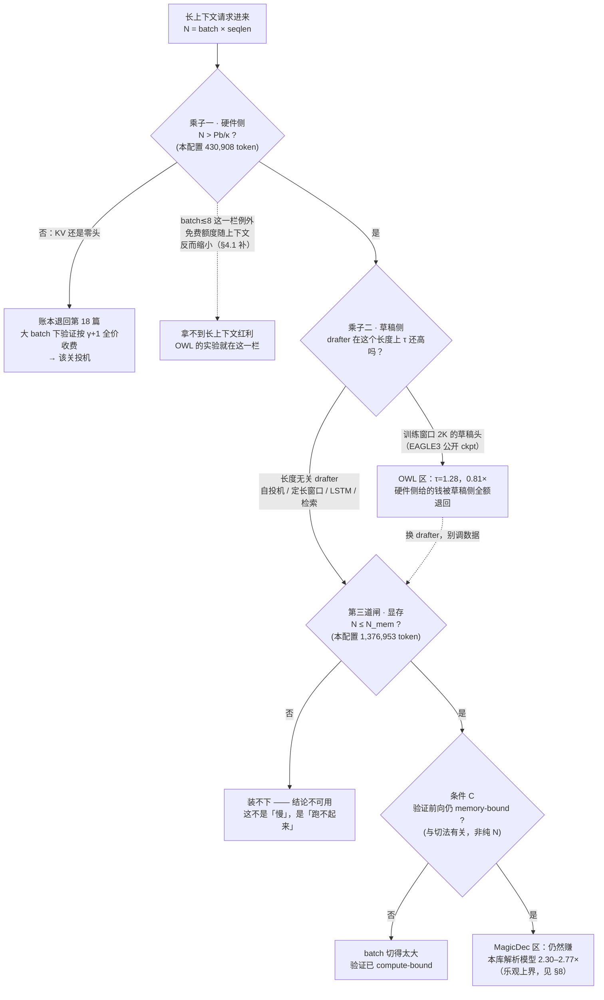

# 22 长上下文下的投机采样

## 1. 一句话

长上下文把投机采样的账本改写了两次，而**两次改写方向相反**：硬件侧把"验证几乎免费"的有效区间**往右推**（利好），草稿侧把接受长度**往下砸**（利空）。这两件事被不同的论文分别观测到，于是社区里长期存在"长上下文救投机 / 长上下文杀投机"的对撞——它们谈的是同一个乘积里的**两个不同乘子**。而在这两个乘子之外，还有第三条谁都绕不开的硬边界：**显存**。

---

## 2. 从哪来 / 要解决什么

两派证据摆在一起，看上去直接矛盾：

| 立场 | 代表工作 | 自报数字 | 完整口径 |
|---|---|---|---|
| 长上下文**救**投机 | MagicDec（arXiv:2408.11049，2024-08-20，Ranajoy Sadhukhan、Jian Chen、Beidi Chen 等，CMU / Meta AI / Moffett AI） | Llama-2-7B、32K prefill、**1.91×–2.0×** | 8×A100，batch **32–128**，草稿 = TinyLlama-1.1B 或自投机+StreamingLLM。**γ / 接受率 / 温度未逐格给出【口径不全】** |
| 长上下文**杀**投机 | OWL（arXiv:2510.07535，2025-10-08，Jaeseong Lee、Seung-won Hwang（SNU）、Aurick Qiao、Gabriele Oliaro、Ye Wang、Samyam Rajbhandari（Snowflake AI Research / CMU）） | EAGLE3 **0.81×**（负加速），τ=1.28→1.35 | **batch = 1**，8×H200（70B）/ 1×H200（8B），fp16，tree size 60 / depth 8 / top-k 10，LongSpecBench 200 条、输入 **4K–64K** |

两边都是一手论文自报，都不是笔误。**照抄任何一派的结论上线，都会在另一派的场景里翻车。**

本篇要给的就是把两者装进同一个式子的框架，以及它带来的三条可执行判据。

> **边界声明（避免与已有篇目重复）**
> - [[01-decode为什么慢-带宽墙与算力空转]] 已经算出 batch=1 下 KV 流量追平权重流量的临界长度 $S^{*}$（70B 要 430,908 token），并指出"长上下文让 decode 更 memory-bound"。**本篇不重推那条式子**，只把它推广到二维 $(\text{batch},\text{seqlen})$ 并读出它的服务化含义。
> - [[18-batch与吞吐-收益衰减曲线]] 已经给出 seqlen=16384 那张"不翻转"的表与 compute 区渐近线。**本篇不重复那张表的推导**，只借它的最后一列（显存）做本篇的第三条约束，并新增"草稿开销随 seqlen 的走势"这张表。
> - 本篇的新增量是三件：**① 把两派对撞化归成一个乘积式；② 证明硬件侧条件与显存条件都只依赖同一个标量 $N=\text{batch}\times\text{seqlen}$，因而 MagicDec 的可用区间是一个宽度可算的窗口（本配置下 3.20 倍）；③ 把 OWL 的 τ=1.28 直接代进本库的保本线，看硬件侧给的钱被草稿侧退回多少。**

---

## 3. 机制拆解：两个乘子 + 一条硬边界

### 3.1 框架

$$
\text{投机收益}\ \approx\ \underbrace{M_{\text{hw}}}_{\substack{\text{硬件侧：这次前向}\\\text{还在 memory-bound 区吗}}}\ \times\ \underbrace{M_{\text{draft}}}_{\substack{\text{草稿侧：drafter 在}\\\text{这个长度上还准吗}}}\ -\ \text{开销}
\qquad\text{且整体受限于}\ \underbrace{C_{\text{mem}}}_{\text{装得下吗}}
\tag{3.1}
$$

- **MagicDec 谈的是 $M_{\text{hw}}$**：长上下文 + 大 batch 让 KV 搬运主导前向时间，闲置算力重新出现。它用的草稿是**自投机 / StreamingLLM 定长窗口**——这类草稿**天然不存在训练窗口外推问题**，所以它的 $M_{\text{draft}}$ 没塌，实验里只看见 $M_{\text{hw}}$ 变好。
- **OWL 谈的是 $M_{\text{draft}}$**：EAGLE3 这类**学习型草稿头**在训练窗口外失效。它的实验是 **batch=1**，$M_{\text{hw}}$ 本来就一直是好的（bs=1 永远 memory-bound），所以它只看见 $M_{\text{draft}}$ 塌了。
- **两者一次实验都没有同时改动两个乘子**，所以它们从来没有真正对话过。

### 3.2 三条边界，只跟两个量打交道

设 $P$ 为目标模型参数量、$b$ 为权重字节数/参数、$\kappa$ 为每 token 的 KV 字节数、$N:=\text{batch}\times\text{seqlen}$ 为**在飞 token 预算**。

**条件 A（硬件侧乘子起效：KV 流量超过权重流量）**

$$
N\cdot\kappa > P\,b
\quad\Longleftrightarrow\quad
\boxed{\,N > N_{\text{KV}} := \frac{P\,b}{\kappa}\,}
\tag{3.2}
$$

**注意右边是常数**——它与你把 $N$ 切成"小 batch 长序列"还是"大 batch 短序列"**完全无关**。[[01-decode为什么慢-带宽墙与算力空转]] 给的 $S^{*}=Pb/(B\kappa)$ 是它在固定 batch 下的切片。

**条件 B（显存装得下）**

$$
P\,b + P_{d}\,b + N\,(\kappa+\kappa_{d}) \le \text{HBM}
\quad\Longleftrightarrow\quad
\boxed{\,N \le N_{\text{mem}} := \frac{\text{HBM}-(P+P_d)b}{\kappa+\kappa_d}\,}
\tag{3.3}
$$

下标 $d$ 是草稿模型。**这也只依赖 $N$。** 于是条件 A 与条件 B 一起，把"MagicDec 区"夹成了 $N$ 轴上的一个**窗口**：

$$
N_{\text{KV}} \;<\; N \;\le\; N_{\text{mem}}
\tag{3.4}
$$

**条件 C（验证前向真的还是 memory-bound）**

这一条**不是** $N$ 的函数。算力项是 $\text{batch}\cdot q\cdot(2P+4S d_{\text{model}})$，其中 $q=\gamma+1$；它对 batch 与 seqlen 的依赖不对称，所以同样的 $N$、不同的切法，结论可以不同（§5 会给出具体反例）。

### 3.3 决策图



---

## 4. 逐步走查

### 4.1 方向一（硬件侧，利好）：长上下文把前向钉回 memory 区

**口径（本节所有数字统一）**：target = llama3-70b（GQA，80 层，KV 320 KiB/token），draft = llama3.2-1b，$\gamma=4$，$E[\tau]=3.0$ **固定假设值**，fp16 权重与 KV，硬件 **8×H100 SXM5（TP=8，带宽/算力/容量按 8 倍线性放大，忽略通信）**，报的是**吞吐**（tokens/s，全 batch 合计）。
**这些是 `_lab/speedup.py` 解析模型的输出，不是硬件实测；模型忽略 TP 通信、norm/softmax、kernel launch 与调度，因此是乐观上界，真实边界只会更早到来。** 复跑：`python _lab/speedup.py --batch`。

先算 (3.2) 的两个常数：

$$
N_{\text{KV}}=\frac{70.6\times10^{9}\times 2}{327680}=\mathbf{430{,}908}\ \text{token},\qquad
N_{\text{mem}}=\frac{640\times10^{9}-143.68\times10^{9}}{327680+32768}=\mathbf{1{,}376{,}953}\ \text{token}
$$

$$
\frac{N_{\text{mem}}}{N_{\text{KV}}}=\mathbf{3.20}
$$

**"长上下文救投机"这件事，在这套配置上只有 3.20 倍宽的活动空间。** 换成更轻的草稿头（`eagle-head`，0.6B、单层）窗口变成 $1{,}499{,}807/430{,}908=\mathbf{3.48}$ 倍——**换草稿只能把窗口拓宽 8.8%，因为窗口的分母是目标模型的 KV，草稿动不了它。**

KV 在总访存里的占比（同上口径）：

| batch | seqlen | $N$ | KV 字节 | 权重字节 | KV 占访存 | 条件 A |
|---|---|---|---|---|---|---|
| 1 | 1 024 | 1.0 K | 0.3 GB | 141.2 GB | 0.2% | 否 |
| 1 | 16 384 | 16 K | 5.4 GB | 141.2 GB | 3.7% | 否 |
| 64 | 1 024 | 65 K | 21.5 GB | 141.2 GB | 13.2% | 否 |
| 256 | 1 024 | 262 K | 85.9 GB | 141.2 GB | 37.8% | 否 |
| 16 | 16 384 | 262 K | 85.9 GB | 141.2 GB | 37.8% | 否 |
| 64 | 16 384 | 1.05 M | 343.6 GB | 141.2 GB | **70.9%** | **是** |

**第 4 行与第 5 行是同一个 $N$、同一个 KV 占比**——这就是 (3.2) 说的"与切法无关"。而 [[18-batch与吞吐-收益衰减曲线]] 的两张表里，前者（bs=256/1K）加速比 1.020、后者（bs=16/16K）2.510，**差别不在条件 A，在条件 C**。

至于"seqlen=16384 那一列不翻转"的完整表格，见 [[18-batch与吞吐-收益衰减曲线]] §5，本篇不重复。这里只留一句结论：在**能装下的全部 batch 范围内**（1 / 16 / 64）加速比分别是 2.772 / 2.510 / 2.301，验证阶段全程 memory-bound（`_lab/test_speedup.py::test_long_context_keeps_speedup_at_large_batch`）。

### 4.1 补 · batch=1 的长上下文场景**拿不到**这份红利

"长上下文让前向更 memory-bound"这句话本身需要一个前提：**batch 要够大**。用 `speedup.py::tokens_to_saturate`（这一批在翻进 compute-bound 之前还能吃下多少个 query token，即"免费额度"）扫一遍，方向在 batch=1 与 batch≥32 上**是相反的**：

| batch | seqlen=1024 | seqlen=8192 | seqlen=32768 | 方向 |
|---|---|---|---|---|
| **1** | **291** | **261** | **198** | **随上下文变长而缩小** ↓ |
| 8 | 295 | 295 | 295 | 几乎不动（枢轴） |
| 32 | 312 | 412 | 631 | 变大 ↑ |
| 64 | 334 | 568 | 1 077 | 变大 ↑ |
| 128 | 378 | 880 | 1 971 | 变大 ↑ |

**机制**：免费额度 = 访存时间 / 每 query token 的算力时间。分子里 KV 项是 $B\!\cdot\!S\!\cdot\!\kappa$，分母里 attention 项是 $4LSd_{\text{model}}$——**分子对 $S$ 的增长带一个因子 $B$，分母不带**。所以 $B=1$ 时分母涨得比分子快，额度反而缩水；$B$ 大到一定程度，分子才反超。（该量在本模型里与 TP 度无关：带宽与算力同时按卡数放大，比值不变。）
测试：`_lab/test_speedup.py::test_free_budget_shrinks_with_context_at_batch_one` 与 `::test_free_budget_grows_with_context_length`。

> **这条对 §3.1 的两个乘子框架是一个有力补强，因为它说明 MagicDec 与 OWL 在硬件侧也不冲突**：
> OWL 的全部实验是 **batch=1**——**那正是"长上下文红利"根本不存在的那一栏**（额度从 291 掉到 198）。所以 OWL 观测到的 0.81× 里，硬件侧不但没帮忙，**还在轻微地帮倒忙**；而 MagicDec 跑的是 **batch 32–128**，恰好落在额度随上下文单调变大的那几栏。
> 换句话说：**两派连"硬件侧乘子"这一项都没测在同一个 regime 上**，谈何矛盾。**"长上下文救投机"完整的说法是"长上下文 + 足够大的 batch 才救投机"**，而这个"足够大"又被 §3.2 的条件 B 从上方封死（§5）。

### 4.2 引用 MagicDec 时必须写的那句话：GQA

MagicDec 论文原文逐字：

> *"For the GQA target model, the speed-up is expected to be lower because of better arithmetic intensity."*

它自己的表就是证据（口径：8×A100，batch 32–128，prefill 32K，**γ / 接受率 / 温度未逐格给出【口径不全】**，来源 <https://infini-ai-lab.github.io/MagicDec/>）：

| 目标模型 | 注意力结构 | 32K prefill、batch 32–128 |
|---|---|---|
| Llama-2-7B | **MHA** | **1.91× – 2.0×** |
| Llama-3.1-8B | **GQA** | **1.22× – 1.47×** |

机制很直白：GQA 把 KV head 数砍掉，$\kappa$ 变小，于是 (3.2) 的 $N_{\text{KV}}=Pb/\kappa$ **变大**——需要更长、更多的 token 才能让 KV 重新主导。**MHA 时代的 critical sequence length 不能搬到 GQA 时代用。**

**而今天在产的主流模型几乎全是 GQA 或 MLA。** MagicDec 最亮眼的 1.91–2.0× 来自一个 2023 年的 MHA 模型。**引用 MagicDec 却不写这一句，是本主题最高频的引用事故。**

> **本篇的一个自我披露**：`_lab/speedup.py` 的 `MODELS` 里三个模型的 `kv_per_tok` 都是按 **GQA** 配置的（70B：$2\times80\times1024\times2$ 字节，即 8 个 KV head × 128 维），由 `_lab/test_speedup.py::test_model_specs_self_consistent` 校验。所以 §4.1 的 $N_{\text{KV}}=430{,}908$ **已经是 GQA 口径**，不需要再打折；但它也因此**不能**用来复现 MagicDec 的 MHA 数字。

> ⚠️ **一处口径冲突，本篇不合表**：arXiv:2408.11049 的摘要（本篇于 2026-08 直接抓取 <https://arxiv.org/abs/2408.11049> 核验）写的是 *"up to 2.51x speedup for Llama3.1-8B when serving batch sizes ranging from 32 to 256"*，而上表（来自项目页）给 Llama-3.1-8B / 32K / 8×A100 的是 1.22–1.47×。两者的硬件、上下文长度、草稿策略未必一致，**且论文有多个版本**。按铁律二，**两组数字各自保留原始出处，禁止放进同一张表比较**。

> ⚠️ **未查证**：Blackwell（B200 / GB200 / GB300）上的同类实测。按 (3.2) 的逻辑，算力/带宽比继续升高会让条件 C 更难满足、窗口更窄，但**我未查到任何 Blackwell 实测数据**，不做外推。

### 4.3 方向二（草稿侧，利空）：训练窗口是草稿头的悬崖

**OWL 的完整口径**：target = Llama-3.1-8B-Instruct（1×H200）与 Llama-3.3-70B-Instruct（8×H200）；**batch size = 1**；fp16；tree size 60、depth 8、top-k 10；SAMD 框架 static cache；benchmark = LongSpecBench（从 WildChat-4.8M 采样 200 条，输入 **4K–64K token**）。草稿训练：8×H200、batch 2048、lr 1e-3、3000 iter、**训练序列仅 256 token**、数据 Ultrachat-200k + Magicoder。来源 <https://arxiv.org/abs/2510.07535>（2025-10-08，仅 v1，本篇 2026-08 抓取 abs 页复核，确认无 v2）。

**平均接受长度 τ**（论文 Table 1）：

| 方法 | Llama-3.1-8B | Llama-3.3-70B |
|---|---|---|
| PLD | 2.75 | 2.24 |
| Suffix Decoding | 3.41 | 2.61 |
| Token Recycling | 3.16 | 2.97 |
| **EAGLE3** | **1.28** | **1.35** |
| **OWL** | **4.00** | **4.27** |
| **HOWL**（树/非树混合） | **6.14** | **5.31** |

**加速比**（论文 Table 2，**整列都是 Llama-3.3-70B，不是 8B**）：baseline 1.00× ｜ PLD 1.59× ｜ Suffix Decoding 2.18× ｜ Token Recycling 1.75× ｜ **EAGLE3 0.81×** ｜ OWL 2.35× ｜ **HOWL 3.08×**。

**归因**：EAGLE3 的公开草稿头**训练窗口是 2K**，而 SpecBench 一类基准的输入普遍在 2K 以内，于是没人在基准上看见问题。一旦输入超出训练窗口，草稿头外推失败，τ 塌到 1.28（**几乎等于不投机**），此时草稿开销 + 验证开销全成净亏，于是 0.81×。论文归因逐字：*"small acceptance length and drafting overhead"*。

**最硬的那张表是 Table 4**，它证伪了最流行的那个解释：

| 配置 | LongSpecBench 接受长度 |
|---|---|
| EAGLE3（训练 ctx **2,048**，短数据） | 1.28 |
| **EAGLE3-L（训练 ctx 32,768，LongAlign + LongWriter 长数据）** | **3.23** |
| **OWL（训练 ctx 仅 256，短数据）** | **4.00** |

> **把 EAGLE3 也拿长文本训（而且训到 32K，再长就 OOM），仍然打不过用 256 token 短数据训的 OWL。**
> **病根不是"训练数据不够长"，是 drafter 架构对窗口有依赖。** 想反驳这条，得先解释这个对照。

跨基准泛化（Table 3，同上口径，**batch=1**，报的是接受长度不是加速比）：EAGLE3 在 SpecBench 上 5.79、在 LongSpecBench 上 1.28（**掉 4.5 倍**）；OWL 是 4.14 / 4.00（**几乎不掉**）。

**旁证（工程侧的独立证词）**：Snowflake Arctic Inference 的 blog（2025-05-01，<https://www.snowflake.com/en/engineering-blog/fast-speculative-decoding-vllm-arctic/>）写道 *"EAGLE 无法在 SWE-Bench 与 Mixed 上跑，因为其 draft model 只支持 2K 序列长度"*；Red Hat 的 EAGLE-3 实践文（<https://developers.redhat.com/articles/2025/07/01/fly-eagle3-fly-faster-inference-vllm-speculative-decoding>）也提到当时可得的投机模型有 *"a 2048 context length cap"*。

> **铁律一：这里的"失效"是效率问题，不是正确性问题。**
> EAGLE3 在长上下文下**仍然是 L1 分布无损**的——拒绝采样修正与输入长度无关（见 [[04-拒绝采样修正-无损性的完整证明]] 与 [[07-无损的三种口径-分布无损不等于结果相同]]）。塌掉的是**接受长度 τ**，不是分布。0.81× 意味着"你花了钱买了一个没用的猜测"，不意味着"输出变差了"。
> **把 OWL 这类结论讲成"长上下文下投机解码会输出错的东西"，是对它的误读。** 反过来，把"L1 无损"当成"所以开着不亏"，是同一枚硬币的另一面——**无损保的是分布，不保的是钱**。

> ⚠️ **口径校正（RS-5 按其表格自算，非原文表述）**：OWL 摘要说"比 EAGLE3 接受长度高约 5×"。核算 Table 1：**OWL 单独是 $4.00/1.28=3.13\times$；$6.14/1.28=4.80\times\approx5\times$ 对应的是 HOWL，不是 OWL。** 引用这条必须写清是哪个变体。

> ⚠️ **未查证**：OWL 的正式代码仓库与 LongSpecBench 数据集地址。v1 只给了匿名链接 `anonymous.4open.science/r/owl-BFB8`，论文承诺 *"release all code and datasets"*，**发布位置未查证**。

### 4.4 草稿侧的第三笔账：草稿自己的 KV 开销也在涨

"草稿很便宜"这个前提在长上下文下会**松动**，而且不需要接受率变化就会松动——因为草稿模型**也要读自己的 KV cache**。

口径同 §4.1（8×H100 TP=8，70B + 1B 草稿，γ=4，$E[\tau]=3.0$，解析模型乐观上界）：

| batch | seqlen | $N$ | 加速比 | 草稿占迭代 | 显存 | 验证阶段 |
|---|---|---|---|---|---|---|
| 16 | 1 024 | 16 K | 2.772 | **7.6%** | 150 GB | memory |
| 16 | 4 096 | 66 K | 2.693 | 10.2% | 167 GB | memory |
| 16 | 16 384 | 262 K | 2.510 | 16.3% | 238 GB | memory |
| 16 | 65 536 | 1.05 M | 2.301 | **23.3%** | 522 GB | memory |
| 64 | 16 384 | 1.05 M | 2.301 | **23.3%** | 522 GB | memory |
| 64 | 32 768 | 2.10 M | — | — | 900 GB **装不下** | — |

从 1K 到 64K，**草稿开销占整个投机迭代的比例从 7.6% 涨到 23.3%，涨了 3 倍**；加速比对应从 2.772 降到 2.301（**−17%**）。这一段掉的加速比与接受率毫无关系（$E[\tau]$ 全程固定 3.0），**纯粹是草稿侧的访存变贵了**。

换成更轻的 `eagle-head`（0.6B、**单层**，KV 只有 4 KiB/token）同一组 batch=64 的三点：

| seqlen | 加速比 | 草稿占迭代 |
|---|---|---|
| 1 024 | 2.895 | 3.5% |
| 4 096 | 2.884 | 3.9% |
| 16 384 | 2.870 | **4.3%** |

**层数少的草稿头几乎不受影响**（3.5% → 4.3%），因为它的 KV 是按"层数 × KV 头数"计的。

> **可执行推论**：长上下文场景下选草稿，**看参数量是不够的，要看 $\kappa_d/\kappa$（草稿 KV 与目标 KV 之比）**。llama3.2-1b 的 $\kappa_d/\kappa=32768/327680=10\%$，eagle-head 是 $4096/327680=1.25\%$。前者在 64K 上下文下会吃掉近四分之一的迭代时间，后者不到二十分之一。

`--breakeven` 的表给出同一件事的另一个视角（口径：**4×H100（TP=4）**，target=llama3-70b，γ=4；复跑 `python _lab/speedup.py --breakeven`）：

| batch | draft | seqlen=1024 | seqlen=8192 | seqlen=32768 |
|---|---|---|---|---|
| 1 | llama3.2-1b | 1.07 | 1.08 | 1.09 |
| 8 | llama3.2-1b | 1.08 | 1.11 | **1.19** |
| 32 | llama3.2-1b | 1.09 | 1.20 | 装不下 |
| 1 | eagle-head | 1.03 | 1.03 | 1.04 |
| 8 | eagle-head | 1.03 | 1.04 | 1.04 |
| 32 | eagle-head | 1.04 | 1.04 | 装不下 |

**保本所需的 $E[\tau]$ 随 seqlen 上升**（batch=8：1.08 → 1.19），且上升幅度**由草稿的 KV 结构决定**（eagle-head 几乎纹丝不动）。这条恒 >1 的性质由 `_lab/test_speedup.py::test_breakeven_always_above_one` 保证：**草稿总要花时间，所以 $E[\tau]=1$ 时投机必然纯亏。**

---

## 5. 小数字算例：两个乘子相乘，硬件侧给的钱被退回多少

现在把 §4.3 的 τ=1.28 直接代进 §4.1 的模型。**注意这是一次跨口径的"如果"推演，不是复现 OWL**：OWL 测的是 batch=1、H200、Llama-3.3-70B、tree 60；这里是 8×H100 解析模型、γ=4 链式、70B+1B。**τ 是唯一被搬运过来的量，且它本身随硬件不变。** 结果只用来回答一个定性问题：**草稿侧塌方能不能吃掉硬件侧的全部收益。**

口径同 §4.1，seqlen=16384，只扫 $E[\tau]$：

| $E[\tau]$ | batch=16 加速比 | batch=64 加速比 |
|---|---|---|
| 3.00（§4.1 的假设值） | **2.510** | **2.301** |
| 2.00 | 1.674 | 1.534 |
| 1.50 | 1.255 | 1.150 |
| **1.28（OWL 报的 EAGLE3）** | **1.071** | **0.982** ⚠ |
| 1.00（等于不投机） | 0.837 | 0.767 |
| **保本线**（该配置下 $E[\tau]$ 至少要多大） | **1.195** | **1.304** |

**逐步读这张表**：

1. **硬件侧给的钱是真的**：$E[\tau]=3.0$ 时，batch=64、16K 上下文下加速 2.301×，验证全程 memory-bound——这正是 MagicDec 的立论。
2. **草稿侧能把它全额退回**：同一套硬件、同一个 batch，只把 $E[\tau]$ 从 3.0 换成 1.28，加速比从 2.301 掉到 **0.982**——**穿过 1.0，变成负收益**。
3. **保本线随 batch 上升**（1.195 → 1.304），因为草稿的 KV 开销随 $N$ 涨（§4.4）。**所以"长上下文 + 大 batch"这个 MagicDec 最看好的组合，恰恰是对草稿塌方最不宽容的组合。**
4. 这解释了为什么 OWL 在 **batch=1** 下都能测出 0.81×：bs=1 时硬件侧乘子是满分，**0.81× 里没有一分钱是硬件的锅，全是草稿侧的**。

**再走一遍容量规划（把三条边界一次用全）**，配置同上：

- 你要服务 **64K 上下文**：$N_{\text{mem}}/65536 = 1{,}376{,}953/65{,}536 = \mathbf{21}$ → **batch 最多 21**。
- 你要服务 **batch=64**：$1{,}376{,}953/64 = \mathbf{21{,}514}$ → **上下文最多约 21.5K**。
- 这两个点的 $N$ 都是 $1.38\times10^{6} > N_{\text{KV}}=430{,}908$，**条件 A 满足**。
- 条件 C 呢？逐 batch 扫"验证前向从 compute 翻回 memory 所需的最小 seqlen"，与"显存能装下的最大 seqlen"对撞：

| batch | 条件 C 门槛（最小 seqlen） | 条件 B 上限（最大 seqlen） | 相容？ |
|---|---|---|---|
| 32 | 64 | 43 008 | 是 |
| 64 | 704 | 21 504 | 是 |
| 128 | 4 544 | 10 752 | 是 |
| 192 | 5 888 | 7 168 | 是 |
| **216** | **6 144** | **6 144** | **是（临界）** |
| 218 | 6 176 | 6 144 | **否** |
| 256 | 6 528 | 5 120 | 否 |
| 512 | 7 488 | 2 560 | 否 |

> **算例的落点**：在这套配置上，**batch ≈ 216 是"长上下文救投机"这句话的物理上限**。再往上，"让验证重回 memory 区所需的上下文长度"已经超过"显存能装下的上下文长度"——两个条件**在数轴上错开了**，无论怎么调 seqlen 都不可能同时满足。
> 这就是本篇标题里那句"改写是相反的"的最终形态：**硬件侧要你把 $N$ 做大，显存不让你把 $N$ 做大；它们争的是同一个 $N$。**
> 复跑：`_lab/test_speedup.py::test_long_context_large_batch_may_not_fit` 固化了 batch=512 / seqlen=16384 这一格装不下的事实。

---

## 6. 代码验证

本篇用到的三条模型性质，在 `_lab/speedup.py` 里各自有一行代码对应：

```python
# 权重只读一次，与 query token 数无关 —— 投机能成立的全部理由
mem_bytes = model["P"] * bytes_per_param + batch * seqlen * model["kv_per_tok"]
#                                          ^^^^^^^^^^^^^^  这一项就是 N·κ，(3.2) 的左边

# 算力却与 query token 数成正比 —— 大 batch 下崩塌的全部理由
flops = n_q * (2 * model["P"] + 4 * model["layers"] * seqlen * model["d_model"])
#                                   ^^^^^^^^^^^^^^^^^ 层数 L —— 初稿漏乘，见文末勘误记录

# 显存：权重 + KV（+ 草稿的权重与 KV）—— (3.3)
need = model["P"] * bytes_per_param + batch * seqlen * model["kv_per_tok"]
if draft is not None:
    need += draft["P"] * bytes_per_param + batch * seqlen * draft["kv_per_tok"]
```

对应断言（全部实跑通过，`python -m pytest -q _lab/test_speedup.py`）：

- `::test_verify_is_nearly_free_in_memory_bound_region` —— memory 区里验证 5 个 token 与 1 个的耗时比 **< 1.01**，这是 $M_{\text{hw}}=1$ 的形式化。
- `::test_weights_read_once_regardless_of_query_tokens` —— 访存字节与 $q$ 无关（差值 < 1e-15），(3.2) 分母那个 $Pb$ 不随验证宽度变化。
- `::test_long_context_keeps_speedup_at_large_batch` —— batch=512、seqlen=16384 时验证仍 memory-bound 且加速比 > 2.0（**注意：这一格并不满足条件 B**，见下一条；测试断言的是物理，不是可部署性）。
- `::test_long_context_large_batch_may_not_fit` —— 同一格 `feasible()` 返回 False。**这两个测试放在一起，就是本篇 §5 那张对撞表的最小形式。**
- `::test_breakeven_always_above_one` —— 保本线恒 > 1，$E[\tau]=1$ 时必亏。

实跑输出摘录（`python _lab/speedup.py --batch`，seqlen=16384 段）：

```
batch    基线 tok/s      投机 tok/s      加速比     验证阶段    草稿占迭代   显存占用
1        182.8         506.8         2.772   memory      7.6%     150GB
16       1888.2        4740.2        2.510   memory     16.3%     238GB
64       3538.0        8139.6        2.301   memory     23.3%     522GB
128      -             -             -       -            -       900GB 装不下
```

---

## 7. 长上下文专用方案：各自绕开哪一条约束

把 §3.2 的三条约束当坐标，2024 以来的长上下文投机工作可以干净地分类。**这张表是"谁绕开了什么"，不是性能横比——各行口径不同，禁止跨行比较（铁律二）。**

> **与 [[24-前沿进展-2025到2026]] 的分工**：那一篇按**时间线与落地状态**编目全部前沿工作（含机制细节、作者、venue、是否进引擎主干），信息更全。**本节只做一件那一篇不做的事：把每个方案挂到 §3.2 的三条约束上**，回答"它到底绕开了哪一条"。要查某个工作的完整履历，去 24 篇。

| 工作 | 年月 / arXiv | 作者·机构 | 绕开哪条 | 机制（新增了什么） | 数字 + 完整可得口径 |
|---|---|---|---|---|---|
| **TriForce** | 2024-04-18，2404.11912 | Hanshi Sun、Zhuoming Chen、Xinyu Yang、Yuandong Tian、Beidi Chen（CMU / Meta AI） | **条件 B（显存）** | **分层投机**：原模型权重 + 检索式动态稀疏 KV 当中间层草稿，再被更小模型投机 | Llama2-7B-128K，**A100** 上 up to **2.31×**；2×RTX 4090 offloading 下 0.108 s/token，称比优化过的 offloading 快 **7.78×**；单张 4090 比 DeepSpeed-Zero-Inference 快 **4.86×**。动机数字：Llama2-7B-128K 的 KV 达 **64 GB** 而权重仅 14 GB。**batch / 接受率 / 温度未统一给出【口径不全】**，多为小批 offloading 场景，与服务化大批不可比 |
| **MagicDec** | 2024-08-20，2408.11049 | Ranajoy Sadhukhan、Beidi Chen 等（CMU / Meta AI / Moffett AI） | **条件 A（吃到硬件红利）** | 指出存在 **critical sequence length**；用**稀疏 KV 草稿 + full-KV 验证**（保持 L1 无损） | 见 §4.1 与 §4.2。**GQA 上收益显著更低（论文自陈）** |
| **LongSpec** | 2025-02-24（v4 2026-04-08），2502.17421 | Penghui Yang、Cunxiao Du、Tianyu Pang、Chao Du、Bo An（Sea AI Lab / NTU） | **条件 B + 草稿侧乘子** | ① **常数大小 KV cache 的草稿模型**（不随上下文增长）② 新 position index 缓解短训长推 mismatch ③ attention aggregation：快速前缀计算 + 标准 tree attention。自称 **lossless** | 5 个长上下文理解数据集**最高 3.26×**（vs Flash Attention baseline）；QwQ 在 AIME24 上 **2.25×** wall-clock。**硬件 / batch / 上下文长度摘要未给出【口径不全】**。代码 github.com/sail-sg/LongSpec |
| **SpecExtend** | 2025-05（v4 2026-01），2505.20776 | Jungyoub Cha、Hyunjong Kim、Sungzoon Cho（首尔大学） | **草稿侧乘子** | **免训练 drop-in**：① FlashAttention + Hybrid Tree Attention 加速 prefill/verify ② **Cross-model Retrieval**——用 target 的 attention score 给 draft 做 KV 选择 | 16K 长文摘要**最高 2.84×**；长推理任务**最高 3.86×**。**硬件 / batch 摘要未给出【口径不全】** |
| **OWL / HOWL** | 2025-10-08，2510.07535 | 见 §4.3 | **草稿侧乘子** | ① **LSTM drafter**——只吃最后一个 token 的 hidden state $h_N$，**不看窗口**，训练序列 256 token 即可 ② `[SPEC]` 特殊 token 塞进 **verifier**（不是 drafter），在传给 verifier 的 token 数不变、latency intact 的前提下提升接受长度 ③ **HOWL** = 树/非树混合，按分数阈值路由到 SuffixDecoding | 见 §4.3（bs=1，H200） |
| **Dustin** | 2026-06-23，2606.24957，**ICML 2026** | WenHung Lee、Chi-Chih Chang 等（NYCU + TU Darmstadt + Cornell） | **条件 A 的极端形式：直接砍掉 verify 的 KV 读** | draft 的 lookahead attention + target 历史 attention 混合打分选 KV；Semantic Retrieval Heads 稀疏估计把打分开销降到全量的 **约 0.8%** | **H200 / bf16 / 4×H200 pipeline parallel**；Qwen2.5-72B（target）+ Qwen2.5-0.5B（draft）；KV budget 512；**32K、batch 16：9.17×**（25.70 → 235.81 tok/s，接受长度 2.2）。**代价：不再无损（L3）**，LongBench 55.81% → 55.23%（**−0.58%**） |
| **Vegas**（v1 名 SpecAttn，**改过名**） | 2026-02（v2 2026-05），2602.07223 | Yikang Yue、Yuqi Xue、Jian Huang；**ICML 2026 poster** | 坚持 L1：稀疏只用在 draft | verification-guided sparse attention：**KV entry 的重要性在 verify 时本来就算出来了**，当副产物捞出来给下一轮起草用 | **2×H100 NVL(94GB)**；Qwen3-4B/8B/30B-A3B-FP8；稀疏率 7%；γ=5–9。**短上下文**（输入 ~182 token，batch 至 128）：1.25×–2.81×；**长上下文**（LongBench-v2，96K–120K，batch 4–20）：**仅 +18%–29%** |

**这张表最重要的一行是最后两行的对照**（Dustin 论文自己给的同硬件同模型对照，Qwen2.5-72B，32K，batch 16，4×H200）：

| 稀疏用在哪 | 是否无损 | 加速比 |
|---|---|---|
| ClassicSD：**不稀疏**，full-KV 验证 | **L1** | 1.76 – 1.91× |
| MagicDec：**只稀疏 draft**，full-KV 验证 | **L1** | 1.70 – 1.96× |
| Dustin：**把稀疏推进 verify** | **L3（LongBench −0.58%）** | **9.17×** |

> **这 5 倍的差距，就是长上下文下 verify 侧 KV 读取所占的规模。**
> **判据（可直接用于评审论文与选型）**：任何声称「长上下文 + 无损 + 大幅加速」三者兼得的说法，先去查它**把稀疏用在了 draft 还是 verify**。
> 坚持 L1 的（Vegas / VeriCache / LongSpec / OWL）只能稀疏 draft，长上下文收益立刻缩水——**Vegas 自己的数据最诚实：短上下文 1.25–2.81×，96K–120K 上只剩 +18%–29%。**

> ⚠️ **未查证 / 口径冲突汇总（本节）**
> - **LongSpec 的 venue**：arXiv comment 字段写 *"Accepted by ACL'25 (Main)"*（本篇 2026-08 抓取 abs 页复核，字段确实如此），而 RS-5 记录 ACL Anthology 收录号为 **2026.acl-long.83（ACL 2026）**。**冲突未消解**，本篇两边都列出，不选边。
> - **QuantSpec**（2502.10424，2025-02，自投机 + 分层 4-bit 量化 KV，报告接受率 >90%、端到端最高约 2.5×）：**硬件 / 模型对 / batch 未从原文核实**，本篇不入表。
> - **SparseSpec-L**（2607.27735，2026-07）：摘要 *"up to ___ speedup"* **数值位缺失（疑似排版占位符未填）**，全部实验条件**未查证**。
> - **RACER**（2604.14885）与 **Graft**（2605.20104）的数字都来自**短上下文**基准（Spec-Bench / HumanEval / MGSM-ZH），与本篇主题相关性存疑；Graft 的作者与机构**未核验**。
> - **同名撞车**：arXiv:2510.27641《SpecAttn: Speculating Sparse Attention》（2025-10，单作者 Harsh Shah）与 arXiv:2602.07223 的 SpecAttn/Vegas **是完全不同的两篇**，引用须区分。
> - **引擎侧的阴性结论**：vLLM 官方投机解码文档（<https://docs.vllm.ai/en/latest/features/speculative_decoding/>）**全文对长上下文行为、稀疏 KV 与投机的交互、长上下文接受率衰减、长上下文专用 drafter 零陈述**。截至 RS-5 查证日，**三大引擎主干里没有任何一个长上下文专用的投机实现**——上表所有工作要么只有论文，要么只有独立仓库。详见 [[20-主流引擎实现-vLLM与SGLang与TensorRTLLM]]。

---

## 8. 口径与坑

1. **本篇所有 `speedup.py` 数字是解析模型的乐观上界，不是硬件实测。** 模型只算 GEMM 与 attention 主项，忽略 norm/softmax/kernel launch/调度/TP 通信，显存只算权重 + KV（忽略激活、碎片、paged 分配的块内浪费）。**因此真实的 $N_{\text{mem}}$ 更小、真实的条件 C 门槛更高、真实的 batch≈216 那个上限只会更低。** 它的价值是给出结构与量级，不是给出可直接照抄的阈值。**本篇初稿曾因基座模型漏乘层数而把这个上限高估到 244，见文末「本篇勘误记录」——这恰好是"乐观上界会往哪个方向错"的一次真实示范。**

2. **"长上下文"这个词本身是个口径陷阱。** SqueezeBits 的实测（4×A100，Llama-3.1-70B-Instruct BF16 TP=4，vLLM v0.6.3，草稿 Qwama-0.5B，Dynamic-Sonnet，输出 128 token；<https://blog.squeezebits.com/vllm-vs-tensorrtllm-11-speculative-decoding-37301>）显示：输入从 **1K 变 2K**，投机开始劣于标准解码的并发阈值从 **32 降到 16**，接受率从 53.5% 降到 50.9%——**方向与 MagicDec 相反**。不矛盾：2K **远未到 critical sequence length**，这个区间里长输入只增加了 KV 读取与调度压力、并压低了接受率，还没到 KV 主导的拐点。**几 K 的输入不算长上下文。** 用 (3.2) 判定，别用直觉。

3. **两种"τ 衰减"要分开。** 本篇讲的是**输入长**导致的塌方（OWL）。另有一条**输出长**导致的衰减：Test-Time Speculation（arXiv:2605.09329，**2026-05**）测出 MATH-500 上接受长度从前 10K token 的 3.7 掉到后 10K 的 1.5，EAGLE-3 在 ~20K token 后掉到 1.1（等于没有加速）；attention drift 论文（arXiv:2605.09992，**2026-05**）给了残差未归一化导致 hidden state 幅度随链深增长的机制解释。**这两件事都会压低 $M_{\text{draft}}$，但成因与解法不同**，详见 [[13-EAGLE三代-特征级自回归的演进]] 与 [[24-前沿进展-2025到2026]]。

4. **vLLM blog 的"长上下文接受长度最多 2×"不能直接引用。** RS-5 记录：那句话出自 EAGLE 3.1 相关 blog，而对应论文给出的**长上下文**数字是 **1.18×**，**2× 出现在 template perturbation 场景**——两者不是同一个实验。

5. **长上下文的负收益可能根本不在 decode 上。** vllm-ascend Issue #9247（DeepSeek-V4-Flash + MTP）：开 MTP 后 prefix cache 命中从 32,768 token 掉到 **16,384**，46,240 token 的 prompt 需重算量从 13,472 涨到 **29,856**。报告者原话：*"a small MTP/EAGLE recomputation requirement is amplified into losing a full 16K prefix-cache segment"*，结论 *"the extra prefill cost can outweigh MTP's decode speed benefit"*（状态：closed as not planned / stale）。**长上下文 + 高前缀复用（多轮对话、agent）必须单独验证这一项**，它不出现在任何 roofline 模型里。见 [[23-与其它优化的相互作用-量化与KVcache与PD分离]]。

6. **无损口径必须逐个方案标。** §7 表里：TriForce / MagicDec / LongSpec / OWL / Vegas / VeriCache 是 **L1 分布无损**（稀疏只用在 draft，verify 读 full KV）；Dustin / SpecPV / STS / SSV 是 **L3 近似**（把稀疏推进 verify，分布已不等于 $p$）。**Dustin 的 9.17× 与 MagicDec 的 1.9× 不是同一个口径的东西**，前者用 0.58% 的 LongBench 精度换来。见 [[07-无损的三种口径-分布无损不等于结果相同]]。

7. ⚠️ **未查证**：vLLM issue #37435（2026-03-18，「投机/MTP 的 draft config 丢失 target 的 `--hf-overrides`，导致长上下文 YaRN/RoPE 扩展失效，超出原生上下文后 draft 接受率塌到 ~0%」）——这是 RS-5 找到的**唯一一条引擎侧长上下文投机的真实 bug 报告**，但抓取被网络策略拦截，**仅来自搜索摘要，未核验 issue 正文与状态**。若属实，这是"配置层面的 $M_{\text{draft}}$ 塌方"，与 OWL 的架构层面塌方是两回事。

---

## 9. 失效条件（铁律三）

本篇给的是"长上下文下投机可能仍然赚"的框架。它在下面这些情形下**不成立或不可用**：

1. **$N=\text{batch}\times\text{seqlen}\le Pb/\kappa$ 时不成立。** 本配置下 $N\le 430{,}908$ token 即视为"不算长上下文"，账本退回 [[18-batch与吞吐-收益衰减曲线]]：大 batch 下验证按 $\gamma+1$ 全价收费，加速比渐近到 $E[\tau]/(\gamma+1)\cdot(1-s)<1$。

2. **草稿头训练窗口 < 实际输入长度时，直接判负收益。** 可判定形式：**若 drafter 是学习型（EAGLE/Medusa/MTP 类）且其训练 ctx < 你的 P50 输入长度，预期 τ→1.3 量级，加速比 ≈ 0.8×**（证据：OWL Table 2，bs=1，8×H200，Llama-3.3-70B，LongSpecBench 4K–64K）。**这是本库找到的最确定的负收益配方。** 解法是换 drafter（自投机 / 定长窗口 / 检索 / LSTM 类），**不是**拿长数据重训——OWL Table 4 已证伪后者（EAGLE3-L 训到 32K 只到 3.23，仍不敌 256 token 训出的 OWL 的 4.00）。

3. **$N > N_{\text{mem}}$ 时结论不可用**（本配置 1,376,953 token）。这不是"慢"，是"起不来"。**注意这一条在大 batch 下先于条件 C 触发**：本配置 batch ≳ 216 时，条件 B 与条件 C 已经在数轴上错开，**无论怎么调 seqlen 都不可能同时满足**（§5）。

4. **目标模型是 GQA / MLA 时，预期至少砍半。** MagicDec 自陈：*"For the GQA target model, the speed-up is expected to be lower because of better arithmetic intensity."* 其表内 MHA 的 Llama-2-7B 是 1.91–2.0×，GQA 的 Llama-3.1-8B 是 1.22–1.47×（同为 32K / 8×A100 / batch 32–128）。**MLA 的 $\kappa$ 更小，$N_{\text{KV}}$ 更大，本篇未查到 MLA 上的实测，标未查证。**

5. **草稿的 $\kappa_d/\kappa$ 偏大时，长上下文本身会吃掉收益。** 可判定形式：**若 $\kappa_d/\kappa>5\%$ 且 seqlen > 16K，草稿开销占迭代将超过 15%**（本模型：llama3.2-1b 在 $\kappa_d/\kappa=10\%$、64K 下占 23.3%）。此时保本线上移（batch=8、32K 下从 1.08 升到 1.19）。

6. **优化目标是吞吐还是延迟，会给出相反结论。** §4–§5 报的全是**吞吐**。同一格里单请求 TPOT 可能仍然更好。SLO 写的是 P99 TPOT 时，本篇的阈值不可直接套用。见 [[19-负收益全解-什么时候投机反而更慢]]。

7. **开了 chunked prefill 时，本框架高估收益。** chunked prefill 的目的就是把 prefill 的算力填进 decode batch 的闲置算力里，而投机的收益来自**同一份闲置算力**——两者在物理上抢同一个资源，即使工程上兼容。

8. **本框架完全未覆盖 MoE。** MoE 的有效激活参数远小于总参数，(3.2) 里的 $P$ 要换成"每 token 实际激活的参数量"，$N_{\text{KV}}$ 随之大幅下降；同时路由本身带来额外开销。**本篇的所有常数对 MoE 无效。**

9. **本框架未覆盖 Blackwell 及之后的硬件。** 算力/带宽比继续升高会让条件 C 更难满足，**但我未查到任何 B200/GB200/GB300 上的投机解码实测，不做外推**。

---

## 10. 自测题

1. 为什么 (3.2) 的右边 $N_{\text{KV}}=Pb/\kappa$ 与 batch、seqlen 各自的取值无关，只与它们的乘积有关？这对容量规划意味着什么？
   <details><summary>答案要点</summary>KV 访存字节 = $\text{batch}\cdot\text{seqlen}\cdot\kappa$，权重访存字节 = $Pb$，两者相等解出的是乘积而非任一因子。含义：**"bs=256 / 1K 上下文"与"bs=16 / 16K 上下文"在条件 A 上完全等价**（§4.1 表第 4、5 行 KV 占访存都是 37.8%）。但它们在条件 C 上不等价（前者验证 compute-bound、加速 1.020，后者 memory-bound、加速 2.510），因为算力项对 batch 与 seqlen 的依赖不对称。所以容量规划要**同时**看 $N$（条件 A、B）与 batch 本身（条件 C）。</details>

2. 有人说"OWL 证明了长上下文下 EAGLE3 是有损的"。错在哪？
   <details><summary>答案要点</summary>混淆了 L1 与效率。拒绝采样修正与输入长度无关，EAGLE3 在 64K 上仍是 **L1 分布无损**；塌掉的是**接受长度 τ**（1.28），导致 0.81× 的**效率负收益**。用户看到的输出分布是对的，只是钱白花了。反过来说，"L1 无损"也不保证不亏——无损保的是分布，不保的是钱。见 [[07-无损的三种口径-分布无损不等于结果相同]]。</details>

3. 团队打算把 EAGLE3 草稿头拿 32K 长数据重训来解决长上下文塌方。给出反对意见与替代方案。
   <details><summary>答案要点</summary>OWL Table 4 已经做过这个实验：EAGLE3-L（训练 ctx 32,768，LongAlign+LongWriter）接受长度只到 **3.23**，仍不敌用 **256 token 短数据**训出的 OWL 的 **4.00**；且原文说训到 32K 已经 OOM，再长训不动。**病根是 drafter 架构对窗口有依赖，不是数据不够长。** 替代方案：换成长度无关的 drafter（OWL 的 LSTM——只吃最后一个 token 的 hidden state）、自投机 + 定长窗口（MagicDec 的 StreamingLLM 草稿）、或无模型草稿（检索 / suffix / n-gram，见 [[11-无模型草稿-promptlookup与ngram与检索]]）。</details>

4. 某长上下文方案报"9.17× 且长上下文无损"。按本篇的判据，第一件要查的事是什么？
   <details><summary>答案要点</summary>**查它把稀疏用在 draft 还是 verify。** 同硬件同模型对照（Qwen2.5-72B，32K，batch 16，4×H200）：只稀疏 draft（MagicDec）1.70–1.96×，把稀疏推进 verify（Dustin）9.17×——**9.17× 这个量级只能来自 verify 侧稀疏，而 verify 侧稀疏必然破坏 L1**（Dustin 的 LongBench 掉 0.58%）。所以"9.17× + 无损"是自相矛盾的组合，除非它换了 batch/上下文口径。</details>

5. §5 算出 batch≈216 是本配置的物理上限。如果换成 8 张 HBM 容量翻倍的卡（其余不变），这个上限会怎么变？
   <details><summary>答案要点</summary>$N_{\text{mem}}$ 按 (3.3) 大致翻倍（分子里 HBM 翻倍、权重项不变，实际略超两倍），窗口宽度从 3.20× 涨到约 6.5×，条件 B 的曲线整体上移，**batch 上限随之上移**。但条件 C 的门槛不变（它由带宽/算力比决定，与容量无关），所以**上限提高的幅度由条件 B 单独决定**。反之，如果换成算力/带宽比更高的卡（如 Blackwell 方向），条件 C 门槛上移而条件 B 不变，**上限会下降**——这正是 §9 第 9 条不敢外推的原因。</details>

---

## 11. 延伸与双链

- 临界上下文长度 $S^{*}$ 的原始推导（batch=1 切片）：[[01-decode为什么慢-带宽墙与算力空转]]
- "验证几乎免费"的 roofline 地基与它的边界：[[03-并行验证为什么几乎免费-算术强度与roofline]]
- batch 轴上的完整衰减曲线与 compute 区渐近线：[[18-batch与吞吐-收益衰减曲线]]
- $E[\tau]$ 与加速比的闭式关系（本篇 §5 扫的就是这条曲线）：[[06-期望接受长度与加速比模型-完整推导]]
- τ 到底怎么测、口径分歧在哪：[[05-接受率alpha-定义口径与怎么测]]
- 为什么 OWL 的 0.81× 不是"输出变差"：[[07-无损的三种口径-分布无损不等于结果相同]]
- EAGLE 系列的训练窗口从何而来、3.1 的 post-norm 补丁：[[13-EAGLE三代-特征级自回归的演进]]
- 长上下文首选的两类替代草稿：[[10-自投机-跳层早退与Draft-and-Verify]]、[[11-无模型草稿-promptlookup与ngram与检索]]
- 草稿该怎么训才不塌（以及为什么长数据救不了）：[[21-草稿模型怎么训-对齐与在线蒸馏]]
- 按当前长度动态调 γ / 直接关掉：[[17-动态草稿长度与自适应停止]]
- 完整负收益判定清单：[[19-负收益全解-什么时候投机反而更慢]]
- 引擎侧对长上下文的零覆盖：[[20-主流引擎实现-vLLM与SGLang与TensorRTLLM]]
- 量化 / KV cache 压缩 / prefix cache / PD 分离如何改写这本账：[[23-与其它优化的相互作用-量化与KVcache与PD分离]]
- 2025–2026 的长上下文专线全景：[[24-前沿进展-2025到2026]]、[[25-未来判断-哪些方向会活下来]]
- 树规模也计入 query token 数（影响条件 C）：[[16-树形草稿与树注意力-mask构造与验证]]
- 高频误解清单：[[27-常见误解与判据]]

---

### 本篇验证

- `_lab/test_speedup.py::test_long_context_keeps_speedup_at_large_batch` —— 验证 §4.1 的方向一：batch=512、seqlen=16384 下验证前向仍 `memory`-bound 且加速比 > 2.0，即长上下文把"验证几乎免费"延伸到了短上下文早已翻转的 batch 区间。
- `_lab/test_speedup.py::test_long_context_large_batch_may_not_fit` —— 验证 §3.2 条件 B 与 §5 的对撞：**同一格** `feasible()` 返回 False。这两条测试并列，就是本篇"硬件说赚、显存说不行"的最小可执行形式。
- `_lab/test_speedup.py::test_verify_is_nearly_free_in_memory_bound_region` —— 验证 $M_{\text{hw}}=1$ 的形式化：memory 区里验证 5 个 token 与 1 个的耗时比 < 1.01。
- `_lab/test_speedup.py::test_weights_read_once_regardless_of_query_tokens` —— 验证 (3.2) 的结构前提：访存字节与 query token 数无关（差值 < 1e-15），所以 $N_{\text{KV}}=Pb/\kappa$ 里的 $Pb$ 不随验证宽度变化。
- `_lab/test_speedup.py::test_breakeven_always_above_one` —— 验证 §4.4 的保本线性质：$E[\tau]$ 的保本值恒 > 1，草稿总要花时间，$E[\tau]=1$ 时投机必然纯亏。
- `_lab/test_speedup.py::test_free_budget_shrinks_with_context_at_batch_one` —— 验证 §4.1 补的反向结论：**batch=1 时免费额度随上下文变长而缩小**（291 → 261 → 198），即 batch=1 的长上下文场景拿不到硬件侧红利。
- `_lab/test_speedup.py::test_free_budget_grows_with_context_length` —— 验证同一张表的另一半：batch≥32 时额度随上下文变大（312 → 412 → 631）。**这两条测试并列，才是"MagicDec 与 OWL 在硬件侧也不冲突"的可执行形式。**
- `_lab/test_speedup.py::test_attention_flops_include_layer_count` —— 守住本篇全部条件 C 数字的前提：attention 的浮点数必须乘层数 $L$（见文末勘误记录）。
- 可复跑：
  - `python _lab/speedup.py --batch` —— §4.1 / §4.4 / §6 的 seqlen=16384 表（1 / 16 / 64 → 2.772 / 2.510 / 2.301；草稿占迭代 7.6% / 16.3% / 23.3%；batch=128 起 900 GB 装不下）
  - `python _lab/speedup.py --breakeven` —— §4.4 的保本线表（llama3.2-1b、batch=8：1.08 → 1.11 → 1.19；eagle-head 同行 1.03 → 1.04 → 1.04）
  - `python _lab/speedup.py --roofline` —— H100 屋脊点 295.4 FLOP/Byte，以及 70B 在 256×32768 下 q=1 与 q=5 的 `t_mem` 都是 862.680 ms（**该表用的是单卡口径，那一格在容量上不可实现**，正是 §5 那张对撞表的动机）

> **本篇 §4.1 / §4.4 / §5 的所有数字均来自本库自建解析模型 `_lab/speedup.py`，是乐观上界，不是硬件实测**；口径与已知偏乐观的方向已在 §8 第 1 条逐项声明。§4.2 / §4.3 / §7 的数字全部为第三方一手来源，**保留其原始口径标注，不与本库数字合表**。

### 本篇来源

- **MagicDec: Breaking the Latency-Throughput Tradeoff for Long Context Generation with Speculative Decoding** — <https://arxiv.org/abs/2408.11049>（2024-08-20，Ranajoy Sadhukhan、Jian Chen、Zhuoming Chen、Vashisth Tiwari、Ruihang Lai、Jinyuan Shi、Ian En-Hsu Yen、Avner May、Tianqi Chen、Beidi Chen；项目页 <https://infini-ai-lab.github.io/MagicDec/> 与 part2）。**好在哪**：第一次把"critical sequence length"这个概念说清，并给了"KV 搬运的算术强度是常数"这条机制解释——本篇 (3.2) 就是它的形式化。**不严谨之处**：项目页表格未逐格给 γ / 接受率 / 温度（口径不全）；**且其摘要的 "up to 2.51× for Llama3.1-8B, bs 32–256" 与项目页表里 Llama-3.1-8B 32K 的 1.22–1.47× 不是同一组条件**，社区常把两者混引。**最容易被漏掉的一句是它自己写的 GQA 免责声明**，见 §4.2。
- **OWL: Overcoming Window Length-Dependence in Speculative Decoding for Long-Context Inputs** — <https://arxiv.org/abs/2510.07535>（2025-10-08，仅 v1，本篇 2026-08 抓取 abs 页复核；Jaeseong Lee、Seung-won Hwang（SNU）、Aurick Qiao、Gabriele Oliaro、Ye Wang、Samyam Rajbhandari（Snowflake AI Research / CMU））。**好在哪**：Table 4 那个对照（EAGLE3-L 用 32K 长数据训 3.23 < OWL 用 256 token 短数据训 4.00）是本主题里最干净的一次因果分离，直接证伪"数据不够长"这个流行解释。**需要小心的地方**：摘要的"约 5× 接受长度"对应的是 **HOWL**（4.80×），OWL 单独只有 3.13×；Table 2 那一整列都是 Llama-3.3-70B，不是 8B；全部实验是 **batch=1**，**不能**用来推断服务化大批下的行为。**未查证**：正式代码仓库与 LongSpecBench 数据集地址。
- **TriForce: Lossless Acceleration of Long Sequence Generation with Hierarchical Speculative Decoding** — <https://arxiv.org/abs/2404.11912>（2024-04-18，Hanshi Sun、Zhuoming Chen、Xinyu Yang、Yuandong Tian、Beidi Chen；项目页 <https://infini-ai-lab.github.io/TriForce/>；本篇 2026-08 抓取 abs 页复核标题、作者、日期与摘要）。**好在哪**：它是第一个把"长上下文下 KV 才是瓶颈"当成设计前提的投机系统，摘要里 Llama2-7B-128K 的 KV 64 GB vs 权重 14 GB 是本主题最好用的动机数字。**局限**：主要战场是 offloading / 小批场景，**batch 未统一给出**，与服务化大批不可比。
- **LongSpec: Long-Context Lossless Speculative Decoding with Efficient Drafting and Verification** — <https://arxiv.org/abs/2502.17421>（v1 2025-02-24，v4 2026-04-08；Penghui Yang、Cunxiao Du、Fengzhuo Zhang、Haonan Wang、Tianyu Pang、Chao Du、Bo An，Sea AI Lab / NTU；代码 <https://github.com/sail-sg/LongSpec>）。**好在哪**：把长上下文投机的困难拆成三条（草稿 KV 显存、短训长推 mismatch、tree attention 在长序列上的低效），拆得比谁都清楚。**⚠️ venue 冲突未消解**：arXiv comment 字段写 *"Accepted by ACL'25 (Main)"*（本篇复核确认），RS-5 记录 ACL Anthology 收录号为 2026.acl-long.83（ACL 2026）。
- **SpecExtend** — <https://arxiv.org/abs/2505.20776>（2025-05，v4 2026-01；Jungyoub Cha、Hyunjong Kim、Sungzoon Cho，首尔大学）。**好在哪**：免训练 drop-in，且"用 target 的 attention score 给 draft 做 KV 选择"这个 cross-model retrieval 思路很直接。**口径不全**：硬件 / batch 摘要未给出。
- **Dustin**（arXiv:2606.24957，2026-06-23，ICML 2026；NYCU + TU Darmstadt + Cornell）与 **Vegas**（arXiv:2602.07223，ICML 2026 poster，代码 github.com/platformxlab/vegas）—— 二者构成 §7 那张"稀疏用在 draft 还是 verify"的对照。**Dustin 的 9.17× 是 L3（LongBench −0.58%），Vegas 的长上下文 +18%–29% 是 L1**，这组对照是本篇 §7 判据的全部依据。**注意 Vegas 的 v1 名为 SpecAttn，与 arXiv:2510.27641 的同名论文是完全不同的两篇。**
- **SqueezeBits: vLLM vs TensorRT-LLM #11 Speculative Decoding** — <https://blog.squeezebits.com/vllm-vs-tensorrtllm-11-speculative-decoding-37301>。**好在哪**：口径给得很全（4×A100、Llama-3.1-70B-Instruct BF16 TP=4、vLLM v0.6.3、Dynamic-Sonnet、输出 128 token），是"1K→2K 让交叉点从 32 降到 16"这条反向证据的唯一来源，正好用来说明"几 K 的输入不算长上下文"。
- **Snowflake Arctic Inference blog** — <https://www.snowflake.com/en/engineering-blog/fast-speculative-decoding-vllm-arctic/>（2025-05-01）。那句 *"EAGLE 无法在 SWE-Bench 与 Mixed 上跑，因为其 draft model 只支持 2K 序列长度"* 是长上下文问题**最早的工程侧证词之一**，比 OWL 早半年。
- **Red Hat: Fly Eagle3 fly — faster inference with vLLM speculative decoding** — <https://developers.redhat.com/articles/2025/07/01/fly-eagle3-fly-faster-inference-vllm-speculative-decoding>（2025-07-01）。提到当时可得投机模型的 *"2048 context length cap"*，与上一条互为旁证。
- **vLLM 官方投机解码文档** — <https://docs.vllm.ai/en/latest/features/speculative_decoding/>。**这里引用的是一个阴性结论**：全文对长上下文行为零陈述。RS-5 由此得出"三大引擎主干里没有任何长上下文专用投机实现"，这是本主题学研与工程之间最大的落差。
- **vllm-ascend Issue #9247** — <https://github.com/vllm-project/vllm-ascend/issues/9247>（DeepSeek-V4-Flash + MTP 导致 prefix cache 命中减半、prefill 重算翻倍；状态 closed as not planned / stale）。**好在哪**：它是"开投机反而变慢，但亏在 prefill 不在 decode"的干净机制性案例，任何 roofline 模型都抓不到它。
- **本仓库既有材料**：`attention-optimization/26-speculative-decoding.md` 给出了 roofline 动机与拒绝采样证明，**本篇不重复**；`MLOPS/02-推理服务案例/推理08-投机解码的负收益.md` 记录了单个负收益案例。本篇补的是它们都没有的**二维 $(\text{batch},\text{seqlen})$ 可用窗口与显存这条硬边界**。

---

### 本篇勘误记录

**本篇初稿使用的 `_lab/speedup.py` 有一个 bug**：`fwd_time` 里 attention 的浮点数写成 `4 * seqlen * d_model`，**漏乘了层数 $L$**（正确是 `4 * layers * seqlen * d_model`）；`tokens_to_saturate` 里同一处也漏了。该 bug 由写 [[03-并行验证为什么几乎免费-算术强度与roofline]] 的过程中查出并修复，本篇随后按修正版全量重跑。

**影响方向**：修正后算力项变大（70B 在 $S=32768$ 时该项此前被低估约 80 倍，attention FLOPs 从占 $2P$ 的 0.8% 升到 60% 以上），**模型比初稿更不乐观，条件 C 的门槛整体上移**。按本库"保留修正过程、不偷偷改数"的约定，逐项如实记录如下。

**A. 变了的数字**

| 位置 | 初稿 | 修正后 |
|---|---|---|
| §5 条件 C 门槛，batch=64 | 576 | **704** |
| §5 条件 C 门槛，batch=128 | 3 968 | **4 544** |
| §5 条件 C 门槛，batch=192 | 5 120 | **5 888** |
| §5 条件 C 门槛，batch=256 | 5 632 | **6 528** |
| §5 条件 C 门槛，batch=512 | 6 464 | **7 488** |
| §5 的物理上限 batch | ≈ **244** | ≈ **216**（降 11.5%） |
| §4.1 引用的短上下文对照点（bs=256 / 1K）加速比 | 1.038 | **1.020** |

**B. 没变的数字（这一点很重要，它说明 bug 的作用面在哪）**

- $N_{\text{KV}}=Pb/\kappa=430{,}908$ token —— (3.2) 只比 **KV 访存字节与权重访存字节**，**不含算力项**，因此结构上不可能受影响。
- $N_{\text{mem}}=1{,}376{,}953$ token、窗口宽度 **3.20×**（eagle-head 1,499,807 / **3.48×**）—— (3.3) 是**纯容量**式子，同样不含算力项。
- **整张 seqlen=16384 表**（§4.1 / §4.4 / §6）：加速比 2.772 / 2.510 / 2.301，草稿占迭代 7.6% / 16.3% / 23.3%，batch=128 起装不下 —— 逐格**一位数字都没变**。原因：那一段深在 memory-bound 区，$T=\max(t_{\text{mem}},t_{\text{cmp}})=t_{\text{mem}}$，**取 max 的时候算力项根本没被选中**。
- §4.4 的 eagle-head 组（3.5% → 4.3%）、§4.4 保本线表列出的 batch=1/8/32 各格。
- §5 的 τ 敏感性表全部（2.510 / 1.674 / 1.255 / **1.071** / 0.837 与 2.301 / 1.534 / 1.150 / **0.982** / 0.767）与保本线 **1.195 / 1.304**。
- §4.1 的 KV 占访存比例表；§5 的容量规划（64K → batch ≤ 21；batch=64 → seqlen ≤ 21.5K）。

**C. 结论层面：一条都没变**

本篇的六条主结论——两个乘子的框架、条件 A/B 都只依赖 $N$、窗口宽度只有 3.20 倍、草稿 KV 开销随上下文放大、OWL 的 τ=1.28 会把硬件侧收益全额退回、"稀疏用在 draft 还是 verify"的判据——**全部不受影响**。唯一被改写的是**定量的物理上限从 244 降到 216**，方向与"修正后模型更不乐观"一致。

**D. 修正反而带来一个新结论（初稿的模型给不出）**

§4.1 补那张"免费额度"表是**修正之后才成立的**。用漏乘 $L$ 的旧式重算，batch=1 那一行是 **296 → 300 → 315（随上下文变大）**；修正后是 **291 → 261 → 198（随上下文缩小）**——**bug 把这一行的符号弄反了**。而正是这个反号支撑了 §4.1 补的推论：**OWL 的 batch=1 实验本就落在"拿不到长上下文红利"的那一栏**，所以它与 MagicDec 连硬件侧都不冲突。

> **这条勘误本身就是本篇 §8 第 1 条的活教材**：解析模型的"乐观上界"性质是有方向的——算错时它几乎总是往**更乐观**的方向错。本篇初稿的 244 就比真值高了 11.5%，而真实系统（含 TP 通信、调度、碎片）只会比修正后的 216 更低。
