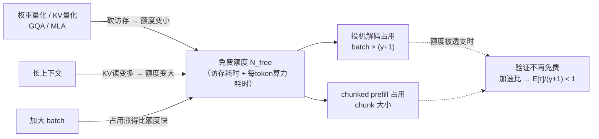

# 23 与其它优化的相互作用 —— 量化、KV cache、PD 分离

## 1. 一句话

投机采样与其它推理优化**多数不是叠加关系，而是竞争关系**：它们抢的是同一份东西 —— **decode 阶段那份"访存已经付过钱、算力还闲着"的冗余**。谁先把这份冗余用掉，后来者就要按全价付费。本篇给出一个统一的记账方式（"免费额度"），并用它把量化、KV 压缩、chunked prefill、CUDA graph、PD 分离逐一算清楚。

---

## 2. 从哪来

线上系统从来不是只开一个优化。真实配置往往是：

> int4 权重量化 + fp8 KV cache + GQA + continuous batching + chunked prefill + prefix caching + CUDA graph + PD 分离 + **投机解码**

于是一个很自然的期待是"每个优化各提速一点，乘起来"。**这个期待在投机采样这里是错的**，而且错得有规律：

- [[03-并行验证为什么几乎免费-算术强度与roofline]] 说明，投机采样的全部收益来自"前向处在 memory-bound 区，多喂几个 query token 不要钱"。
- 而**上面一半的优化，本质工作就是把访存量砍下去** —— 也就是把前向往 compute-bound 推。

**它们在削减投机采样赖以为生的那份冗余。**

---

## 3. 记账方式：把冗余量化成"免费额度"

定义一个可算的量：

> **免费额度 $N_{\text{free}}$** = 这一批前向在从 memory-bound 翻进 compute-bound 之前，还能再吃下多少个 query token。

$$
N_{\text{free}}=\frac{\big(P\,b_w+\text{batch}\cdot\text{seqlen}\cdot\text{kv}\cdot s_{kv}\big)\big/\text{BW}}
{\big(2P+4L\,\text{seqlen}\,d_{\text{model}}\big)\big/\text{peak}}
$$

分子是访存耗时，分母是**每个 query token** 的算力耗时（$L$ 为层数）。（实现见 `_lab/speedup.py::tokens_to_saturate`。）

这个量把所有优化放进了同一本账：

| 动作 | 对 $N_{\text{free}}$ 的影响 | 与投机采样的关系 |
|---|---|---|
| 权重量化（$b_w\downarrow$） | **减小** | **竞争** |
| KV 量化 / GQA / MLA（$s_{kv}\downarrow$ 或 kv$\downarrow$） | **减小** | **竞争** |
| 加大 batch | 增大（分子的 KV 项涨），但**分母也涨**，净效果是额度的**占用**涨得更快 | **竞争** |
| 拉长上下文（seqlen$\uparrow$） | **增大** | **互补** |
| chunked prefill | 不改额度，但**占用**额度 | **竞争（最直接）** |
| 投机解码本身 | 占用 $\text{batch}\times(\gamma+1)$ | —— |



**口径声明（全篇统一）**：以下数字来自本库解析模型 `_lab/speedup.py`，target = llama3-70b，draft = llama3.2-1b，$\gamma=4$，$E[\tau]=3.0$，硬件 8×H100 SXM5（TP=8，带宽/算力/容量按 8 倍线性放大，**忽略通信**），BF16 稠密峰值 989.5 TFLOPS、带宽 3.35 TB/s。模型忽略 norm/softmax/kernel launch/调度/反量化开销，**是乐观上界，不是硬件实测**。真实翻转点只会更早。

---

## 4. 逐条算清

### 4.1 权重量化：把投机的可用区间砍掉 4 倍

实测交叉点（加速比跌破 1.0 的最小 batch，seqlen=1024，复跑 `python _lab/speedup.py --quant`）：

| 权重精度 | KV 精度 | 基线 tok/s (bs=1) | bs=1 加速比 | **跌破 1.0 的 batch** |
|---|---|---|---|---|
| fp16 (2 B) | fp16 | 189.4 | 2.801 | **265** |
| fp16 (2 B) | fp8 | 189.6 | 2.802 | 207 |
| fp8 (1 B) | fp16 | 377.8 | 2.799 | **133** |
| fp8 (1 B) | fp8 | 378.7 | 2.801 | 104 |
| int4 (0.5 B) | fp16 | 752.1 | 2.795 | **67** |
| int4 (0.5 B) | fp8 | 755.6 | 2.799 | **52** |

三条读法：

1. **bs=1 的加速比几乎不变（2.795–2.802）。** 只看小 batch 的基准测试，会得出"量化和投机完全兼容"的结论 —— 这正是这个坑难被发现的原因。
2. **可用 batch 区间从 265 塌到 52，缩小 5.1 倍。** 权重量化砍掉访存，前向更早进 compute 区，"验证免费"更早失效（`_lab/test_speedup.py::test_weight_quantization_shrinks_the_usable_batch_range`）。
3. **但量化让基线本身快了 4 倍**（189.4 → 755.6 tok/s）。

第 3 条决定了正确的比较方式：

> **不要比"加速比有没有变小"，要比"两条路各自的绝对吞吐哪个高"。**
> 一个 int4 的基线（755.6）已经比 fp16 开投机（530.4）更快。在这种情况下问"投机还有没有加速"是问错了问题 —— 该问的是"在给定显存与精度预算下，哪个组合的绝对吞吐/延迟最好"。

（`_lab/test_speedup.py::test_quantization_speeds_up_the_baseline_too`）

### 4.2 KV 量化 / GQA / MLA：同方向，但主要吃长上下文

KV 侧的压缩砍的是 $\text{batch}\cdot\text{seqlen}\cdot\text{kv}$ 那一项。短上下文下权重项占主导，影响较小（265 → 207）；**长上下文下这一项才是主导**，压缩的影响就大得多。

这条给了一个常被忽略的推论：

> **GQA/MLA 这类 KV 压缩，削弱了"长上下文对投机采样友好"这个结论。**

这与实证对得上：本库调研记录到 MagicDec 自陈其在 GQA 模型上的收益显著更低（见 [[22-长上下文下的投机采样]]），而今天主流模型**全是** GQA 或 MLA。所以引用"长上下文 + 大 batch 下投机仍有收益"这类结论时，**必须核对被测模型的 KV 结构**，MHA 时代的数字不能直接搬到 GQA/MLA 上。

（`_lab/test_speedup.py::test_kv_quantization_also_shrinks_the_range`）

### 4.3 chunked prefill：最直接的冲突

chunked prefill 把 prefill 的一个 chunk 混进 decode 的同一次前向。**prefill token 与投机的 query token 消耗的是同一份免费额度。**

实测（复跑 `python _lab/speedup.py --chunked`，seqlen=1024/8192，$\gamma=4$）：

| batch | seqlen | 本批免费额度（token） | 投机需要 batch×5 | 留给 prefill chunk |
|---|---|---|---|---|
| 1 | 1024 | 291 | 5 | 286 |
| 8 | 1024 | 295 | 40 | 255 |
| 32 | 1024 | 312 | 160 | 152 |
| 64 | 1024 | 334 | 320 | **14** |
| 128 | 1024 | 378 | 640 | **已透支 262** |
| 8 | 8192 | 295 | 40 | 255 |
| 32 | 8192 | 412 | 160 | 252 |
| 128 | 8192 | 880 | 640 | 240 |

两条结论：

1. **免费额度只有几百个 query token 的量级**（`_lab/test_speedup.py::test_free_budget_is_a_few_hundred_query_tokens`）。而主流引擎的 prefill chunk 大小通常在 512–2048 —— **一个 chunk 就足以把它吃光**。
2. **batch=128、seqlen=1024 时，投机解码自己就把额度透支了 262 个 token**，一个 prefill token 都塞不下（`::test_spec_alone_can_exhaust_the_free_budget`）。

含义：两者同时开启时，**谁都不再免费**。这不是说不能共存 —— 而是说**收益不叠加，调优必须放在一张账本上算**：chunk 大小、batch、$\gamma$ 三者要一起定，分开调必然次优。

反过来，最后三行说明**长上下文把额度撑大了**（batch=32 时从 312 涨到 412，batch=128 时从 378 涨到 880，`_lab/test_speedup.py::test_free_budget_grows_with_context_length`），所以长上下文场景下两者共存的余地大得多。

**但这条有一个必须加的限定：它只在 batch 够大时成立。** batch=1 时额度反而从 291 掉到 261 —— 此时 KV 访存项只有 $1\times\text{seqlen}\times\text{kv}$，而 attention 算力项按 $L\cdot\text{seqlen}$ 增长，分母涨得比分子快（`_lab/test_speedup.py::test_free_budget_shrinks_with_context_at_batch_one`）。

所以「长上下文对投机友好」这句话的完整形式是：**长上下文 + 足够大的 batch 才友好**，两个条件缺一不可。这个反转是在修正 attention 浮点数漏乘层数的 bug 之后才显现出来的 —— 漏乘时算力项被低估了近两个数量级，看不出来。

### 4.4 CUDA graph：与"动态"天然冲突

CUDA graph 靠**固定的执行图**消除 kernel launch 开销，前提是**形状稳定**。而投机采样的现代形态恰恰在往"动态"走：

- 动态草稿长度（[[17-动态草稿长度与自适应停止]]）→ 每步 query token 数变化
- 动态树形状（EAGLE-2 之后的标配，见 [[16-树形草稿与树注意力-mask构造与验证]]）→ mask 形状变化
- 按接受结果回滚 KV → 有效长度变化

工程上的通行折中是**把形状分桶（bucketing）**：只允许有限几种草稿长度/树规模，为每种捕获一张图。代价是分桶把"动态"的收益削掉一部分 —— **你想要的自适应粒度越细，能复用的图越少**。

各引擎的具体支持与限制以官方文档为准，见 [[20-主流引擎实现-vLLM与SGLang与TensorRTLLM]]；本篇不复述版本细节（它们变化很快）。

### 4.5 PD 分离：方向相反的两个效应

把 prefill 与 decode 拆到不同实例（Prefill-Decode disaggregation）对投机采样有**两个方向相反**的影响：

**利好**：decode 实例不再被 prefill chunk 抢额度（§4.3 的冲突消失），而且可以为 decode 单独选硬件与配置 —— 例如给 decode 实例配带宽更高的卡，把 memory-bound 区做大。

**利空**：decode 实例专门化之后，为了打满利用率，**decode 侧的 batch 通常被推得更大** —— 而大 batch 正是投机采样的死穴（[[18-batch与吞吐-收益衰减曲线]]）。

净效果取决于哪一边更强，**没有一般性答案**，必须在目标负载上实测。一个可操作的判断顺序：先测 decode 实例的稳态 batch 分布，再对照 §4.1 那张表里对应精度的交叉点，看落在哪一侧。

### 4.6 prefix caching：基本中性

prefix caching 减少的是**重复前缀的 prefill 计算**，不改变 decode 的访存-算力比。所以它与投机采样基本正交，是本篇少数**不冲突**的组合。

间接影响有一条：prefix caching 让 prefill 变便宜，系统更容易接更多并发 → decode batch 变大 → 又回到 §4.5 的利空路径。**这是一条二阶效应，不要当成直接冲突。**

### 4.7 MoE：不是"未建模"，而是**两头都和稠密相反**

（本节 2026-08-22 补写。此前本篇只能标注"未建模"，现由 `_lab/moe.py` 补上。）

MoE 把 §3 那个记账方式的**两项都改了**，而且改的方向不同：

- **访存项**：要读多少权重，取决于**这一批激活了多少个不同的专家**。这个数随 token 数 $N$ 饱和（券收集问题）：
  $$\mathbb E[\text{激活专家数}]=E\left(1-\left(1-\tfrac{k}{E}\right)^{N}\right)$$
- **算力项**：每个 token 只走 $k$ 个专家，$\text{FLOPs/token}=2(P_{\text{dense}}+k\,P_{\text{expert}})$，与总参数量 $E\,P_{\text{expert}}$ **无关**。

gpt-oss-120b（117B 总参 / 5.1B 激活 / 128 专家 top-4）的饱和曲线（复跑 `python _lab/moe.py --experts`）：

| token 数 $N$ | 1 | 4 | 16 | 64 | 200 | 1000 |
|---|---|---|---|---|---|---|
| 激活专家数 | 4.0 | 15.3 | 51.0 | 111.2 | 127.8 | 128.0 |
| 占全部专家 | 3.1% | 11.9% | 39.8% | 86.9% | 99.8% | 100% |

**投机采样把 $N$ 乘上 $\gamma+1$，落在这条曲线的哪一段，决定了它是被罚还是白赚。**

#### 后果一（小 batch）：MoE 上投机要**多读权重**，稠密模型上没有这一项

batch=1、$\gamma=4$ 时，基线只激活 4.0 个专家，投机的 5 个 token 激活了 18.8 个 —— **权重字节多读 3.62 倍**（`python _lab/moe.py --penalty`）：

| batch | 基线激活专家 | 投机激活专家 | 多读权重 |
|---|---|---|---|
| 1 | 4.0 | 18.8 | **3.62 倍** |
| 4 | 15.3 | 60.2 | 3.65 倍 |
| 8 | 28.7 | 92.1 | 3.09 倍 |
| 16 | 51.0 | 117.9 | 2.27 倍 |
| 32 | 81.7 | 127.2 | 1.55 倍 |

于是 **"权重只读一次、与 query token 数无关"这条在 MoE 上是个大 batch 性质，小 batch 下不成立**（`_lab/test_moe.py::test_small_batch_penalty_exists_only_in_moe`、`::test_penalty_vanishes_at_moderate_batch`）。

> **口径**：这条惩罚是**上界**。模型假设每个 token 独立均匀地选专家，而真实路由里同一序列相邻 token 的上下文相似、路由相关，实际多激活的专家数**不会高于**这个值。所以真实惩罚比表里小，但方向是确定的。

#### 后果二（大 batch）：MoE 的免费额度大一个数量级

专家全激活之后访存不再涨，而 MoE 每 token 的算力极低（5.1B 而非 117B），于是 $N_{\text{free}}$ 被撑得很大（复跑 `python _lab/moe.py --budget`，8×H100 TP=8，seqlen=1024）：

| 模型 | 权重精度 | batch=1 | batch=64 | batch=200 |
|---|---|---|---|---|
| llama3-70b（稠密） | fp16 | 291 | 334 | 428 |
| gpt-oss-120b | MXFP4≈4.25bit | **1 726** | **1 858** | **2 144** |
| gpt-oss-120b | fp16 | 6 508 | 6 640 | 6 926 |
| deepseek-v3 | fp8 | 2 585 | 2 603 | 2 641 |

> **规格勘误（2026-08-22）**：DeepSeek-V3 那一行初稿把 KV 按「分开的 K 和 V」算成 $2\times61\times512\times2$ 字节，但它用的是 **MLA —— KV cache 存的是一个联合压缩潜向量**，每层每 token 只有 `kv_lora_rank(512) + qk_rope_head_dim(64) = 576` 个元素，正确值是 $61\times576\times2=70\,272$ 字节（原值比正确值高出约 78%）；同时 $P_{\text{dense}}$ 由 13.0B 改为 17.0B —— 旧值反推出的激活参数量只有 33.6B，与官方公布的 37B 对不上。两处都已核 `config.json` 修正，表中为修正后的值。
>
> **这个错是新增一条「用官方激活参数量反查分解」的测试才抓出来的**（`_lab/test_moe.py::test_expert_decomposition_matches_published_active`）——原来那条测试只查「稠密部分 + 全部专家 = 总参」这个内部恒等式，而那是**怎么填 $P_{\text{dense}}$ 都成立的空检查**。又一次印证本库的老教训：**把可执行验证当论证基础，就必须同时怀疑自己的验证。**

**注意这里和 §4.1 的方向相反**：稠密模型上量化**缩小**可用区间，而 MoE 即使量化到 MXFP4，免费额度仍是稠密 fp16 的 **5.0–5.9 倍**（1726/291 = 5.93、1858/334 = 5.56、2144/428 = 5.01）—— 因为决定分母的是**激活参数量**，不是总参数量。〔2026-08-22 对抗审稿修正：原写"4–5 倍"，与本表自身的三组比值都对不上；文末「本篇验证」写的"5 倍以上"与测试断言 `moe > 5 * dense` 一致，正文这句是唯一的偏差项。〕

#### 后果三：最优区间整个挪了位置

把两条合起来（`python _lab/moe.py --redhat`，$\gamma=4$、$E[\tau]=3.0$、草稿开销占迭代 5%）：

| batch | 1 | 8 | 32 | 128 | 200 | 512 | 1024 | 2048 |
|---|---|---|---|---|---|---|---|---|
| 访存比（投机/基线） | 3.546 | 3.003 | 1.515 | 1.015 | 1.001 | 1.000 | 1.000 | 1.000 |
| 加速比 | **0.804** ⚠ | **0.949** ⚠ | 1.881 | 2.808 | **2.846** | 2.850 | 2.156 | 1.676 |

> **MoE 上小 batch 是投机解码最不划算的区间，与稠密模型恰好相反**（稠密的最优就在 batch=1，见 [[18-batch与吞吐-收益衰减曲线]]）。
> 而在稠密 70B 早已跌破 1.0 的 batch=1024 上，MoE 仍有 2.16×（`_lab/test_moe.py::test_moe_sweet_spot_is_mid_batch_unlike_dense`、`::test_moe_outlasts_dense_by_an_order_of_magnitude`）。

#### 这解释了那个反例

本库调研记录到 Red Hat 于 2026-04 报告 gpt-oss-120b（MoE + MXFP4）+ EAGLE3 在**并发 200** 时仍有约 +20% 吞吐 —— 此前本库只能把它当成"未建模的例外"标着。现在机制清楚了：并发 200 时专家已经激活满（127.8/128），访存比回到 1.001，而 $N_{\text{free}}\approx2\,144$ 远大于 $200\times5=1\,000$，**验证仍在 memory 区，仍然免费**（`_lab/test_moe.py::test_moe_still_profitable_at_concurrency_200`）。

模型给出 2.85× 而报告是 +20%，差距很大 —— 因为本模型忽略了路由开销、专家并行的 all-to-all 通信、以及真实 $E[\tau]$ 低于 3.0。**方向一致、量级不可直接比**，引用时要说清这一点。

---

## 5. 一张冲突矩阵

| | 与投机采样的关系 | 机制 | 该怎么办 |
|---|---|---|---|
| 权重量化 (fp8/int4) | **强竞争** | 砍访存 → 可用 batch 区间缩小 5.1 倍 | 比绝对吞吐，不比加速比 |
| KV 量化 / GQA / MLA | **竞争**（长上下文下更强） | 砍 KV 流量 | 引用长上下文结论时核对 KV 结构 |
| 加大 batch | **强竞争** | 占用涨得比额度快 | 按 batch 动态开关 |
| chunked prefill | **强竞争** | 直接抢同一份额度 | chunk 大小、batch、γ 一起定 |
| CUDA graph | **机制冲突** | 需要固定形状 vs 动态草稿 | 分桶，接受粒度损失 |
| PD 分离 | **两个方向都有** | 免于抢额度 vs decode batch 变大 | 实测 decode 侧稳态 batch |
| prefix caching | **基本中性** | 只影响 prefill | 注意二阶效应 |
| 长上下文 | **互补（需 batch 够大）** | KV 读撑大额度；batch=1 时反而缩小 | 见第 22 篇 |
| MoE | **两头与稠密相反** | 访存随激活专家数饱和；算力只按激活参数算 | 小 batch 反而亏，中大 batch 才是甜区 |

---

## 6. 代码验证

```python
# _lab/speedup.py
def tokens_to_saturate(model, hw, batch, seqlen, wbytes=2.0, kv_scale=1.0):
    """这一批还能再塞多少个 query token 才会从 memory-bound 翻进 compute-bound。"""
    mem = (model["P"] * wbytes + batch * seqlen * model["kv_per_tok"] * kv_scale) / hw["bw"]
    per_token = (2 * model["P"] + 4 * model["layers"] * seqlen * model["d_model"]) / hw["peak"]
    return mem / per_token

def crossover_batch(target, draft, hw, seqlen, gamma, accept_len, wbytes=2.0, kv_scale=1.0):
    """二分找加速比跌破 1.0 的最小 batch。"""
```

7 条断言覆盖本篇的定量结论，见文末「本篇验证」。

---

## 7. 口径与坑

1. **"bs=1 加速比没变"不能证明兼容。** §4.1 的表里六种精度组合的 bs=1 加速比都在 2.80 附近，但可用区间差了 5.1 倍（265→52）。〔2026-08-22 修正：原写 5.2 倍，与 §4.1 和 §5 冲突矩阵里的 5.1 倍不一致。〕**只在 bs=1 做兼容性测试，会系统性地漏掉所有这些冲突。**
2. **比较对象要选对。** 开了量化之后，正确的对照是"量化基线"而不是"fp16 基线"。拿 fp16 基线去衬托"量化+投机"的加速比，会把量化的功劳算到投机头上。
3. **本篇全部数字是解析模型的乐观上界**，忽略了通信、反量化、kernel 效率、调度。真实系统的冲突比这里更严重，不会更轻。
4. **不要把本篇的交叉点数字当成配置建议。** 它们依赖具体的模型/硬件/精度组合，换一套要重算（`_lab/speedup.py` 里改 `MODELS` 与 `scale()` 即可）。
5. **"竞争关系"不等于"不该一起用"。** 量化 + 投机在小 batch 下仍然都是净收益，只是收益不叠加、且可用区间变窄。结论是**要一起调**，不是"二选一"。

---

## 8. 失效条件

本篇结论在下列情况下不适用：

1. **MoE 的路由开销与专家并行通信**：§4.7 的模型只算了权重访存与算力主项，未计路由 gating、all-to-all 通信、专家负载不均。这些都让真实收益低于模型值（模型给 2.85× 而公开报告是 +20%）。
2. **硬件的带宽/算力比大幅变化时**：屋脊点 $\text{peak}/\text{BW}$ 是所有结论的基准。若某代硬件带宽增长快于算力，屋脊点左移，memory-bound 区变大，投机采样的可用区间会重新变宽 —— 本篇的所有交叉点都要重算。
3. **优化目标是延迟而非吞吐时**：本篇（与第 18 篇）的交叉点按吞吐定义。按 P99 TPOT 定义时结论可能不同。
4. **草稿侧结构特殊时**：本篇假设草稿是一个小的稠密模型。若草稿是单层草稿头（EAGLE 类），其访存与算力占比都很小，§4.3 的额度占用只由 $\gamma+1$ 决定，草稿侧的开销可忽略 —— 结论方向不变但数值不同。
5. **推测执行以外的验证方式**：若未来的方案不再是"多喂 query token 去验证"（例如把验证做进稀疏 attention，见 [[24-前沿进展-2025到2026]]），本篇的记账方式需要重建。

---

## 9. 自测题

1. 团队在 bs=1 上测得"int4 + 投机"和"fp16 + 投机"加速比都是 2.8×，据此认为量化不影响投机收益。错在哪？
   <details><summary>答案要点</summary>bs=1 时两者都在 memory-bound 区深处，验证都免费，所以加速比相同。但 int4 把交叉点从 batch 265 拉到 67 —— 差别只在大 batch 才显现。**兼容性测试必须扫 batch，不能只测 bs=1。**</details>

2. 为什么说"GQA/MLA 削弱了长上下文对投机采样的友好度"？
   <details><summary>答案要点</summary>长上下文对投机友好，是因为 KV 读把前向钉在 memory-bound 区（额度大）。GQA/MLA 大幅压缩 KV/token，正是在削减这一项。所以 MHA 时代测出的"长上下文 + 大 batch 仍有收益"不能直接搬到 GQA/MLA 模型上 —— MagicDec 自陈的 GQA 收益更低与此一致。</details>

3. chunked prefill 的 chunk 设成 512，decode batch 是 64，$\gamma=4$，seqlen=1024。这一批还够用吗？
   <details><summary>答案要点</summary>不够。免费额度约 340，投机已占 $64\times5=320$，只剩 20，而 chunk 要 512。整批深度进入 compute-bound，投机验证按全价付费，加速比向 $E[\tau]/(\gamma+1)$ 收敛。可选动作：减小 chunk、减小 $\gamma$、或对含 prefill chunk 的那些 step 关掉投机。</details>

4. PD 分离对投机采样是好是坏？
   <details><summary>答案要点</summary>两个方向都有：利好是 decode 侧不再被 prefill chunk 抢额度；利空是 decode 实例为打满利用率往往把 batch 推得更大。没有一般性答案，要测 decode 侧的稳态 batch 分布，再对照对应精度的交叉点。</details>

5. 如果下一代 GPU 的带宽翻倍而算力只涨 20%，本篇的结论会怎么变？
   <details><summary>答案要点</summary>屋脊点 $\text{peak}/\text{BW}$ 从约 295 降到约 177，memory-bound 区变大，免费额度变大，所有交叉点右移 —— **投机采样的可用区间变宽**。这也说明本篇的全部数字都绑定在当代硬件的带宽/算力比上，不是永久结论（§8 第 2 条）。</details>

---

## 10. 延伸与双链

- 记账方式的物理基础：[[03-并行验证为什么几乎免费-算术强度与roofline]]、[[01-decode为什么慢-带宽墙与算力空转]]
- 交叉点与渐近线：[[18-batch与吞吐-收益衰减曲线]]
- 实证与生产陷阱：[[19-负收益全解-什么时候投机反而更慢]]
- 长上下文那一侧的账：[[22-长上下文下的投机采样]]
- 动态形状与 CUDA graph 的具体冲突：[[17-动态草稿长度与自适应停止]]、[[16-树形草稿与树注意力-mask构造与验证]]
- 各引擎的实际兼容性矩阵：[[20-主流引擎实现-vLLM与SGLang与TensorRTLLM]]
- 未来硬件如何改写这本账：[[25-未来判断-哪些方向会活下来]]

---

### 本篇验证

- `_lab/test_speedup.py::test_weight_quantization_shrinks_the_usable_batch_range` —— **§4.1 核心**：交叉点 fp16→fp8→int4 单调左移且缩小 3 倍以上。
- `_lab/test_speedup.py::test_kv_quantization_also_shrinks_the_range` —— §4.2：KV 量化同方向。
- `_lab/test_speedup.py::test_quantization_speeds_up_the_baseline_too` —— §4.1 第 3 条：基线吞吐随精度下降而上升 3.5 倍以上。
- `_lab/test_speedup.py::test_free_budget_is_a_few_hundred_query_tokens` —— §4.3：免费额度是几百 token 量级。
- `_lab/test_speedup.py::test_spec_alone_can_exhaust_the_free_budget` —— §4.3 第 2 条：batch=128 时投机自己就透支额度。
- `_lab/test_speedup.py::test_free_budget_grows_with_context_length` —— §4.3 末：长上下文撑大额度（batch=32）。
- `_lab/test_speedup.py::test_free_budget_shrinks_with_context_at_batch_one` —— **反向条件**：batch=1 时长上下文反而缩小额度。
- `_lab/test_speedup.py::test_attention_flops_include_layer_count` —— 回归测试：attention 浮点数必须乘层数（本篇数字用的是修正后的模型）。
- `_lab/test_moe.py::test_active_experts_saturates` —— §4.7：激活专家数随 token 数单调饱和到专家总数。
- `_lab/test_moe.py::test_small_batch_penalty_exists_only_in_moe` —— §4.7 后果一：batch=1 时投机多读 3 倍以上权重，因而亏。
- `_lab/test_moe.py::test_penalty_vanishes_at_moderate_batch` —— 后果一的边界：batch=200 时访存比回到 1。
- `_lab/test_moe.py::test_moe_free_budget_far_exceeds_dense` —— 后果二：MoE 免费额度是同量级稠密的 5 倍以上。
- `_lab/test_moe.py::test_moe_sweet_spot_is_mid_batch_unlike_dense` —— 后果三：MoE 的最优 batch 不在 1，与稠密相反。
- `_lab/test_moe.py::test_moe_outlasts_dense_by_an_order_of_magnitude` —— batch=1024 时稠密已亏而 MoE 仍赚。
- `_lab/test_moe.py::test_moe_still_profitable_at_concurrency_200` —— 解释 Red Hat 那个反例的机制。
- `_lab/test_moe.py::test_expert_decomposition_is_self_consistent` —— MoE 规格自洽（稠密部分 + top_k 专家 = 官方激活参数量）。
- `_lab/test_speedup.py::test_long_context_still_no_crossover_even_quantized` —— 长上下文下即使 int4+fp8 KV，扫到 batch 8192 仍未见交叉点。
- `_lab/test_speedup.py::test_compute_bound_asymptote_equals_wasted_compute_ratio` —— 额度被透支后加速比收敛到哪（第 18 篇的渐近线）。
- 可复跑：
  - `python _lab/speedup.py --quant` —— §4.1 的六组精度组合与交叉点
  - `python _lab/speedup.py --chunked` —— §4.3 的免费额度表
  - `python _lab/moe.py --experts` / `--penalty` / `--budget` / `--redhat` —— §4.7 的四张表

### 本篇来源

- 本篇的模型与数字全部来自本库自建解析模型 `_lab/speedup.py`，**不是硬件实测**，其简化与乐观性在 §3 口径声明与 §7、§8 逐条列明。
- 硬件规格：NVIDIA H100 SXM5，HBM3 带宽 3.35 TB/s，BF16 **稠密**峰值 989.5 TFLOPS（NVIDIA 官方规格页给出的 1 979 TFLOPS 带 `* With sparsity` 脚注，不适用于本场景）。
- MagicDec 在 GQA 模型上收益显著更低这一条，转引自本库 `_research/RS-4-负收益与基准数据.md` 的取证结果，原始出处与口径见 [[22-长上下文下的投机采样]]。
- 各引擎对 CUDA graph / chunked prefill 与投机解码共存的具体支持情况，见 [[20-主流引擎实现-vLLM与SGLang与TensorRTLLM]]，本篇不复述版本细节。
