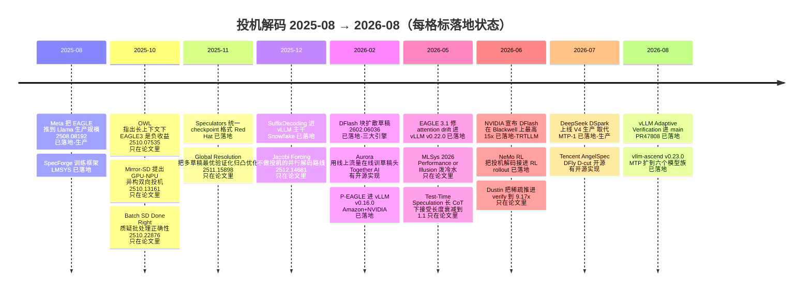
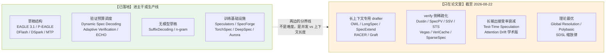

# 24 前沿进展 —— 2025 到 2026

## 1. 一句话

**写作与核验日：2026-08-22。** 从 2025 年 8 月到 2026 年 8 月这一年，投机解码的战场从「怎么把草稿做准」搬到了「**怎么在真实并发下不亏钱**」：草稿器从自回归换成**块扩散**（DFlash → DSpark → DFly），$\gamma$ 从「每请求固定」换成**跨请求全局分配的验证预算**（vLLM `enable_adaptive_verification`），草稿头训练从发版前的一道工序变成**吃线上流量的在线服务**（Aurora）。

本篇只管「发生了什么」：逐条给年月、arXiv 编号或 URL、作者/机构、相对前作新增的**机制**，并把每一条明确划进【已落地】或【只在论文里】。**哪些方向会活下来是 [[25-未来判断-哪些方向会活下来]] 的事，本篇不做判断。** EAGLE 前三代的演进见 [[13-EAGLE三代-特征级自回归的演进]]，本篇只讲 EAGLE-3 **之后**。

---

## 2. 从哪来：2025 年年中，三个问题没有答案

到 2025 年年中，投机解码的「第一层」问题已经收敛：**L1 分布无损**有完整证明（[[04-拒绝采样修正-无损性的完整证明]]），树注意力有标准实现（[[16-树形草稿与树注意力-mask构造与验证]]），EAGLE-3 与 MTP 是事实上的两条主流。但**三件事当时没有公开答案**：

1. **换个 chat template、换个 system prompt，加速比就掉** —— 现象被反复报告，但**没有被归因到具体机制**；
2. **并发一高就不赚钱** —— [[18-batch与吞吐-收益衰减曲线]] 从算术上证明了必然翻转，但引擎侧当时只有「按 batch 一刀切关掉投机」这种粗粒度开关；
3. **长上下文与长输出下会发生什么** —— 当时的公开评测（SpecBench 典型 ≤2K 上下文）根本测不到。

这一年的全部进展，可以按这三个缺口对号入座。**第 3 个缺口至今只被学术界填上，引擎侧是空的** —— 这是本篇最该被记住的一条。

---

## 3. 机制拆解：三条轴，一张分区图

### 3.1 这一年的变化可以压缩成三条正交的轴

| 轴 | 2025 中的默认做法 | 2026-08 的默认做法 | 代表工作 |
|---|---|---|---|
| **草稿的产生方式** | 自回归：跑 $K$ 次 drafter 前向出 $K$ 个 token | **一次前向出一整块**（并行占位 / 块扩散），后面再补一个轻量因果修正 | P-EAGLE、DFlash、DSpark、DFly |
| **验证预算的分配** | 每请求固定 $\gamma$ | **全 batch 全局排序草稿槽，按 profiled step cost 选 top-B** | DSpark scheduler、D-cut、ECHO、vLLM Adaptive Verification |
| **草稿头的来源** | 离线蒸馏一次，随模型发版 | 格式标准化（Speculators）+ 训练框架产品化 + **用线上流量在线训练** | Speculators、SpecForge、TorchSpec、DeepSpec、Aurora |

**这三条轴上，每一条的移动方向都一致：把原本固定的东西改成随负载变化的东西。**

### 3.2 落地状态的判据（本篇的核心区分）

本篇沿用调研笔记 `_research/RS-5-前沿与未来.md` 的分级，判据写死如下，**每条结论都可以按这个判据复核**：

- **【已落地】**：满足任一条且有**可查的官方文档 / release note / PR 号 / 官方 blog**——(a) 进了 vLLM、SGLang、TensorRT-LLM、vllm-ascend 中至少一家的主干或官方方法列表；(b) 厂商公开声明**已在生产线上服务真实用户流量**。
- **【有开源实现】**：有官方 repo 或 HF checkpoint，但截至 2026-08-22 未见进入上述任一引擎主干。
- **【只在论文里】**：只有 arXiv 或匿名代码链接。



### 3.3 分区总览：一张图看清哪边是空的



**读这张图的正确方式**：左边（已落地）全部在解**高并发下的验证预算分配**，右边（论文）大半在解**长上下文/长输出下的 KV 读带宽与接受率衰减**。**引擎侧对右边那一整摊是零覆盖的** —— vLLM 官方投机解码文档页全文没有任何一句关于长上下文行为、稀疏 KV 与投机的交互、或长上下文接受率衰减（<https://docs.vllm.ai/en/latest/features/speculative_decoding/>，页面标 latest developer preview，**无版本号**，核验日 2026-08）。

---

## 4. 逐条走查

### 4.1 EAGLE-3 之后：两个改动，一个诊断

#### EAGLE 3.1（2026-05）**【已落地】**

- **出处**：vLLM 官方 blog《EAGLE 3.1: Advancing Speculative Decoding Through Collaboration Between the EAGLE Team, vLLM, and TorchSpec》，2026-05-26，<https://vllm.ai/blog/2026-05-26-eagle-3-1>。
- **署名**：blog 正文只署 "EAGLE Team, vLLM Team, and TorchSpec Team"，**未列个人作者名**（GitHub 上的 markdown 源文件 `_posts/2026-05-26-eagle-3-1.md` 同样只有团队署名）。
- **它诊断的病：attention drift**。blog 给的两条根因是——(1) 融合输入表示随投机推进变得不平衡，**高层 hidden state 主导 drafter 的输入**；(2) 残差路径没有归一化，**hidden state 幅度随投机步数增长**。结果是随投机深度增加，drafter 的注意力**从 sink token 移开、转向它自己刚生成的 token**。
- **新增的机制（两处结构改动）**：① **FC normalization**——在每个 target hidden state 之后、进 FC 层之前加一层 LayerNorm；② **post-norm hidden states**——把归一化**后**的 hidden state 喂进下一个解码步，而不是原始 state。blog 对这个设计的解释值得原样记住：这让 drafter 表现得像**反复调用自己**，而不是简单地在 target 上再叠几层。
- **口径**：验收算法未改，仍是 [[04-拒绝采样修正-无损性的完整证明]] 那套拒绝采样，**L1 分布无损**。
- **数字（完整口径）**：target `nvidia/Kimi-K2.6-NVFP4` + draft `lightseekorg/kimi-k2.6-eagle3.1-mla`；vLLM，**TP=4，GB200**，non-disaggregated；SPEED-Bench coding；`num_speculative_tokens: 3`；指标是 **per-user output throughput（TPS）加速比**。C=1 **2.03×**，C=4 **1.71×**，C=16 **1.66×**。
  ⚠️ **口径不全**：blog 的图注**未明写基线是 vs AR 还是 vs EAGLE 3**，不可与本篇其它加速比横比。
- **工程属性**：合并进 main，随 **vLLM v0.22.0** 发布；`method` 仍写 `eagle3`，**与已有 EAGLE 3 checkpoint 完全向后兼容**。配套训练基础设施叫 **TorchSpec**。
- **一处必须点名的问题**：**blog 全文未声明任何遗留局限** —— 按本库铁律三，这是一份不完整的发布说明。它给的「长上下文接受长度最多 2× 于 EAGLE 3」是**定性表述，未给具体表**。

#### Attention Drift 的学术版（2026-05）**【只在论文里】**

- **arXiv:2605.09992v1**，2026-05-11，《Attention Drift: What Autoregressive Speculative Decoding Models Learn》。
- **作者/机构**：Doğaç Eldenk（Northwestern University）、Payal Mohapatra（Northwestern）、Yigitcan Comlek（GE Aerospace）、Kaan Oktay（fal）、**Hongyang Zhang（University of Waterloo，EAGLE 系列共同作者）**、Stephen Xia（Northwestern）。代码 github.com/Dogacel/Attention-Drift。
- **相对 vLLM blog 新增了什么**：把 drift **量化**了——可视化 query×key 注意力热图，统计投机深度上 **sink token 注意力占比 vs 最近生成 token 注意力占比**的此消彼长；并且发现 **EAGLE-3 drafter 和 Qwen3.5 9B 的 MTP head 都有这个毛病**。→ 这条很重要：**drift 不是 EAGLE 特有，而是「自回归 drafter 吃自己输出」这类设计的通病**（[[14-MTP-从训练目标到推理草稿]] 的方案同样中招）。
- **数字**：vs pre-norm EAGLE-3，template perturbation 场景接受长度**最高 2×**；长上下文任务 **1.18×**；七个标准 benchmark（chat/math/coding）**1.10×**；训练成本上 TTT 深度从 8 降到 4 而不掉精度。**原文未给出硬件与 batch**，不可横比。
- ⚠️ **口径冲突，必须点破**：vLLM blog 说「长上下文下接受长度最多 2×」，而这篇论文的长上下文数字是 **1.18×**，**2× 出现在 template perturbation 场景**。两者不是同一个实验。把 blog 的「2×」写成「长上下文 2×」是错的。

#### P-EAGLE（2026-03）**【已落地】**

- **出处**：vLLM blog《P-EAGLE: Faster LLM inference with Parallel Speculative Decoding in vLLM》，2026-03-13，<https://vllm.ai/blog/2026-03-13-p-eagle>；论文 **arXiv:2602.01469**。
- **作者/机构**：Amazon（Xin Huang, Florian Saupe, Jaime Campos Salas, Ashish Khetan, George Karypis）+ NVIDIA（Benjamin Chislett, Max Xu, Zeyuan Yang, Kaihang Jiang, Xin Li, Omri Almog）。
- **前一代卡在哪**：EAGLE 的 drafter 是**自回归**的，要出 $K$ 个草稿 token 就得跑 $K$ 次 drafter 前向，drafting 开销随 $K$ 线性增长。
- **新增的机制**：**一次 drafter 前向出全部 $K$ 个 token**。位置 1 走 NTP（用新 token 的 embedding + target 对它的 hidden state `h_context`）；位置 $2..K$ 走 MTP，因为未来 token 还不存在，用**可学习的共享 mask token embedding + 共享 hidden state `h_shared`** 占位；$K$ 个位置一次性过 drafter 的 transformer 层。与 Medusa 的差别在于 P-EAGLE 仍走 EAGLE-3 的 target-hidden-state 条件化路线，只是把序列展开换成了并行占位（[[12-Medusa-多头草稿与树注意力的诞生]] 的多头是不吃 target hidden state 的）。
- **口径**：L1 分布无损。
- **数字（完整口径）**：单卡 **NVIDIA B200**；GPT-OSS 20B；$K\in\{3,5,7\}$；并发 C ∈ {1,2,4,8,16,32,64}（最大 1024 seq，100k max batched tokens）；**基线是 vs EAGLE-3，不是 vs AR**。

  | 数据集 | C=1 | C=4 | C=16 | C=64 |
  |---|---|---|---|---|
  | MT-Bench | 1.55× | 1.35× | 1.27× | 1.05× |
  | HumanEval | 1.55× | 1.45× | 1.31× | 1.23× |
  | SPEED-Bench | 1.69× | 1.54× | 1.40× | 1.25× |

  ⚠️ blog 表格标为「峰值加速」，**未明写是延迟还是吞吐**，口径不全。
- **反直觉的一条**：接受长度（$K=7$）P-EAGLE vs EAGLE-3 = HumanEval 3.94 vs 3.03、SPEED-Bench 3.38 vs 2.59、MT-Bench 3.70 vs 3.27 —— **并行草稿不但没掉接受长度，反而涨了 13–31%**。blog 给的解释是：并行 drafter 可以做得更深，把原本花在 $K$ 次串行前向的算力堆进一次更深的前向。
- **工程属性**：vLLM **v0.16.0** 起支持（PR #32887），配置 `"parallel_drafting": true`；HF 官方 checkpoint `amazon/gpt-oss-120b-p-eagle`、`amazon/GPT-OSS-20B-P-EAGLE`、`amazon/Qwen3-Coder-30B-A3B-Instruct-P-EAGLE`。SGLang 有 feature request（issue #23171），**截至 2026-08-22 未合入**。
- **blog 主动写出的三条代价**（这是本次调研里口径最诚实的一篇引擎 blog）：① **必须专门训练**，不能复用 vanilla EAGLE-3 checkpoint；② 训练显存爆炸——$N=8192,K=8$ 时注意力要 65K×65K 元素，bf16 下约 **8 GB**；③ **收益随并发衰减**（1.69× @C=1 → 1.05–1.25× @C=64）。

### 4.2 本年最大的结构性变化：草稿从自回归换成块扩散

#### DFlash（2026-02）**【已落地，三大引擎全支持】**

- **arXiv:2602.06036**（v1 2026-02-05，v2 2026-05-28）《DFlash: Block Diffusion for Flash Speculative Decoding》。
- **作者**：Jian Chen、Yesheng Liang、Zhijian Liu（z-lab）。代码 github.com/z-lab/dflash。**作者的机构归属我未在论文首页逐字确认，标为未查证。**
- **新增的机制**：用一个**轻量块扩散（block diffusion）模型**做 drafter，一次前向出一整块草稿 token；drafter 内部用**双向注意力**；关键是**以 target 模型抽出的 context feature 为条件**——这是它能把扩散模型的草稿质量拉到可用的原因。abstract 原句：*"Diffusion LLMs offer a promising alternative by enabling parallel generation, but current diffusion models typically underperform compared with autoregressive models."*
- **口径**：论文**自称 lossless（对应本库 L1）**，但我**未逐行核对它的验收算法，标为「作者自称 L1，未独立复核」**。
- **论文数字**：Qwen3-8B、greedy、Transformers backend 平均 **4.9× vs AR**，接受长度 $\tau=6.54$；Qwen3-8B + SGLang **5.1×**；temperature=1 时 $\tau=5.48$；$\tau$ 跨任务范围 4.24–7.87（GSM8K/Math500/AIME25/HumanEval/MBPP/LiveCodeBench/MT-Bench）。⚠️ **batch size 原文未给出**，从「Transformers backend / greedy」推测是 bs=1（**推断，非原文**）。
- **NVIDIA 官方 blog 数字**（2026-06-23，《Boost Inference Performance up to 15x on NVIDIA Blackwell Using DFlash Speculative Decoding》，作者 Elmeleegy, Chislett, Xiong, Iovine, Almog, Zhang, Liu，<https://developer.nvidia.com/blog/boost-inference-performance-up-to-15x-on-nvidia-blackwell-using-dflash-speculative-decoding/>）：
  - **「15×」的完整口径**：gpt-oss-120b；**8× NVIDIA DGX B300（Blackwell Ultra）**；**TensorRT-LLM**；SPEED-Bench coding；**在 500–600 tok/s/user 的高交互性区间**下的**聚合吞吐**提升；基线是 AR 解码。
  - ⚠️ **「15×」不是加速比意义上的 15×**。它是**固定 per-user 交互性下的吞吐提升**：AR 解码要维持 500–600 tok/s/user 只能跑极低并发，分母被压得极低。**引用这个数字不带这句解释就是裸奔。**
  - 其它同 blog 数字：gpt-oss-120b vs EAGLE-3（等并发）平均 **2.3×** 交互性；Llama 3.1 8B Instruct vs EAGLE-3 平均 **2.8×**；跨数据集 vs EAGLE-3 范围 1.5×–3.1×；Gemma 4 31B + **vLLM** + 单卡 Blackwell Ultra + **batch 1**：Math500 5.8× / HumanEval 5.6× / GSM8K 5.3×（vs AR）；Qwen3-8B + **SGLang** + 单卡 **B200** + **batch 1**：Math500 5.1× / HumanEval 4.2×（vs AR）。
- **工程属性**：HF 上 20 个 checkpoint（z-lab collection）；SGLang / vLLM / TensorRT-LLM 三家都支持；NVIDIA 的说法是「把 EAGLE-3 checkpoint 换成 DFlash checkpoint，**无需改代码**」；vLLM 侧通过 `speculators` 库集成，`method: dflash`。

#### DSpark（2026-07）**【已落地：DeepSeek V4 生产线 + SGLang/vLLM 主干】**

**这是本次调研里唯一一个明确写着「已经替换掉生产环境旧方案、在真实用户流量上跑」的工作。**

- **arXiv:2607.05147v1**，2026-07-06，《DSpark: Confidence-Scheduled Speculative Decoding with Semi-Autoregressive Generation》。
- **作者/机构**：Xin Cheng、Xingkai Yu、Chenze Shao、Jiashi Li、Yunfan Xiong 等 20+ 人，**Peking University + DeepSeek-AI**。
- **前一代卡在哪——「suffix decay」**：纯并行 drafter（DFlash、P-EAGLE）每个位置**独立预测**、不以前面已采样的 token 为条件，于是发生**多模态碰撞（multi-modal collision）**——模型在多个都合理的续写之间做边缘化，吐出像 "of problem" 这样自相矛盾的组合。论文 Figure 2 给的**位置级证据**是整条线的关键：位置 1 上并行 drafter（DFlash）0.88 **强于**自回归 drafter（Eagle3）0.81（因为架构更深），但位置 2–7 上并行 drafter **快速衰减**（Chat 上 0.72→0.63），自回归 drafter **稳定**。
- **新增的机制（五件，缝合两者）**：① **并行阶段**——基于 DFlash 的深层并行 backbone，一次前向出全部 $\gamma$ 个位置的 hidden state 与 base logits；② **串行阶段**——一个**轻量因果模块**给每个位置加 per-position transition bias，两种变体：**Markov head**（低秩分解 $r=256$ 近似一阶转移 $B(x_{k-1},\cdot)=W_1[x_{k-1}]W_2$）与 **RNN head**（块内维护递归状态）；③ **confidence head**——输出 $c_k\in(0,1)$，估计「在前面都被接受的条件下位置 $k$ 通过验证的条件概率」，训练目标用 draft/target 分布的 **total variation distance** 推出的解析接受率（这与 [[05-接受率alpha-定义口径与怎么测]] 的 $\beta=1-\mathrm{TV}(p,q)$ 是同一个量）；④ **Sequential Temperature Scaling**——对累积乘积 $\prod_{i\le k}c_i$ 从左到右后校准，把 ECE 压到约 1%；⑤ **Hardware-Aware Prefix Scheduler**——算每个请求每个前缀的存活概率 $a_{r,j}=\prod_{i\le j}c_{r,i}$，**跨请求全局排序**，贪心把 token 填进验证预算以最大化 $\Theta=\tau^*\cdot\mathrm{SPS}(B)$（$\mathrm{SPS}(B)$ 是**实测**的 batch=$B$ 下 steps-per-second），吞吐开始掉就 early stop。
- **口径**：L1（**未独立复核**）。
- **离线数字**：Qwen3-4B/8B/14B、Gemma4-12B，math/code/chat 共 9 个集。接受长度 vs 自回归 Eagle3：+30.9% / +26.7% / +30.0%（4B/8B/14B）；vs 并行 DFlash：+16.3% / +18.4% / +18.3%。领域差异 **math/code 约 5.5τ、chat 约 3.5τ**。
- **生产数字**（DSpark-5，$\gamma=5$，**vs 生产基线 MTP-1**，DeepSeek-V4-Flash / V4-Pro preview，**live user traffic**）：V4-Flash 在 80 tok/s/user SLA 下**聚合吞吐 +51%**；等吞吐下 **per-user 生成速度 +60%~+85%**；V4-Pro 在 35 tok/s/user SLA 下**聚合吞吐 +52%**，50 tok/s/user 等系统容量下 **per-user +57%~+78%**。负载自适应：中并发（V4-Flash <200 请求 / V4-Pro <150）分配 4–6 token 验证预算，高并发自动收缩以保批量。⚠️ **硬件原文未给出**（生产集群配置未披露）。
- **工程属性**：checkpoint 发在 HF；训练框架 **DeepSpec** 开源（内含 Eagle3 / DFlash / DSpark 三种实现）；训练数据 Open-PerfectBlend（1.3M 条：chat 17.6%、math 39.4%、code 38.9%、instruction 4.1%）。**已进 SGLang main（PR #30261，commit `692c5f7d`，LMSYS blog 2026-07-06）与 vLLM main（Adaptive Verification，PR #47808，2026-08-14）。**
- 📌 **这条对「MTP 是不是终点」是决定性的**：**DeepSeek 自己在 V4 生产线上把 MTP-1 换掉了**。提出 MTP 的那家公司亲手否掉了「模型自带 MTP 头 = 投机解码问题已解决」。

#### Tencent AngelSpec / DFly / D-cut（2026-07）**【有开源实现 + 腾讯线上流量验证】**

- **arXiv:2607.25852v2**，2026-07-29，《AngelSpec: Towards Real-World High Performance Inference with Speculative Decoding》；配套 **arXiv:2607.14647**（2026-07-16）《D-cut: Adaptive Verification Depth Pruning for Batched Speculative Decoding》。
- **作者/机构**：Hong Liu, Rui Cen, Junhan Shi, Guangshuo Qin, Jiebin Zhang, Tianyu Liu, Runzhi Fan, Guoliang Zhao, Ruobing Xie, Kai Zhang, Song Liu, Guanghua Yu, Jianchen Zhu（**Tencent Inc**）。代码 github.com/Tencent/AngelSpec。
- **新增的核心论点**：**没有任何一种草稿结构在所有真实负载上都最好**。MTP（自回归，3 token）适合**高熵对话**（对话里接受率衰减快，短候选反而划算）；DFly（块并行扩散，8 token）适合 **code/math** 这类结构化负载。于是 AngelSpec 把「负载异质性」当成一等设计约束：**结构、训练数据、验证深度全部按负载分化**。
- **DFly 相对 DFlash 新增的三处机制**：① **hybrid target-conditioning backbone**（全局跨层变换 + 层特定 target view，让不同草稿层用适配自己深度的 target 特征）；② **predecessor-conditioned autoregressive head**（用更早草稿位置已选定的 token 修正边缘预测，与 DSpark 同源）；③ **acceptance-aware 训练目标**（直接优化多 token 接受）。
- **D-cut 新增的机制**：把 target 验证当成**批级共享资源**——用 token confidence 估各请求接受概率，先估各种 keep depth 的收益，再结合 profile 出的运行时代价，从 4 档预算比（0.25–1.00）里按当前 batch size 与实测 step latency 选吞吐/成本比最大的工作点。
- **数字（完整口径）**：target **Hy3-A21B**（295B MoE，激活 21B）；**8× NVIDIA H20，TP=8**；**T=1**；基线 AR 解码。

  | 并发 | DFly vs AR | MTP vs AR | DFly vs DFlash |
  |---|---|---|---|
  | c4 | 1.98× | 1.60× | +10.5% |
  | c16 | 2.50× | 1.64× | +11.6% |
  | c32 | **2.75×** | 1.86× | +11.6% |
  | c64 | 2.44× | 2.08× | +11.8% |

  D-cut 线上：等 per-user 速度 ~15.3 tok/s 时聚合吞吐 **981 tok/s vs DFly 858 tok/s（+14%）**，代价是接受率平均掉 1.5%（c64 掉 2.8%）。平均接受长度 MTP ~3.0、DFly ~4.8、DFly+D-cut ~4.6。
- ⚠️ **这张表的形状和 P-EAGLE / MLSys 那两张相反**：加速比在 c32 达到峰值而不是单调下降。**最可能的原因是 Hy3-A21B 是 21B 激活的 MoE，在 H20 上 decode 长期处于带宽瓶颈，带宽红利延续到更高并发**（这句因果解释是**我的推断**，论文未如此陈述）。不讲清这条，读者会得到「投机在高并发也很好」的错觉，而 [[18-batch与吞吐-收益衰减曲线]] 的算术说的是反面。

### 4.3 MTP 成为模型原生能力：已经是标配，但不是终点

#### 已确认把 MTP 写进预训练/后训练的模型

| 模型 | 证据 | 机制细节 | 证据级别 |
|---|---|---|---|
| **DeepSeek-V3** | arXiv:2412.19437 技术报告 **§5.4.3**（PDF 第 35 页） | MTP 模块；报告称第二 token 接受率 **85%–90%**、TPS **1.8×** | **A**（原为 B，2026-08-22 复核已在 HTML v1/v2 与官方 PDF 三种渲染上逐字定位并对到页码；**但 batch 与推理硬件原文未给出，不可与其它加速比合表**，见 [[14-MTP-从训练目标到推理草稿]] §7.1）|
| **MiniMax-M2** | **arXiv:2605.26494**（v2 2026-07-30）| 62 层 decoder-only，229.9B 总参 / 9.8B 激活；在**持续预训练的 decay 阶段**把 MTP 模块**从 1 个扩到 3 个（K=3）**；MTP 模块**用主模型权重拷贝初始化**而非随机初始化 | B |
| **DeepSeek-V4** | vllm-ascend release notes + DSpark 论文 | 生产线原基线就是 **MTP-1** | A |
| **Qwen3.5** | 第三方（mlx-lm PR #990、个人博客）| checkpoint 自带 MTP head，config 里 `mtp_num_hidden_layers: 1`；从 $t$ 位置 backbone hidden state + token $t$ 的 embedding 预测 **$t+2$** | C ——**官方技术报告我未查证** |
| **GLM-5.1** | 第三方博客 | 原生 MTP head；SGLang 里走 **NEXTN** 算法；建议把 MTP 层（第 78 层）留 BF16（~19 GB）以保接受率 | C ——**官方文档未查证** |
| **Kimi K2.6** | vLLM blog | **没有自带 MTP**，官方推荐 EAGLE 3.1 draft | A |

#### 最硬的落地证据：一个 NPU 后端为六个模型族做 MTP

vllm-ascend release notes（<https://docs.vllm.ai/projects/ascend/zh-cn/main/user_guide/release_notes.html>）：**v0.23.0（2026.08.16）把 MTP 支持扩展到 DeepSeek V4、Qwen3.5/3.6、MiniMax 2.x、Step3、Gemma4**。一个国产 NPU 适配层要为**六个不同厂商的模型族**分别做 MTP，说明**「模型自带草稿头」在 2026 年已经是主流开源模型的标配**，而不是 DeepSeek 一家的特色。

#### 但「自带 MTP」不是终点 —— 四条反证

1. **DeepSeek 自己换掉了 MTP-1**（§4.2 DSpark，per-user 提速 57–85%）。
2. **MTP 的训练目标与投机用法错配**：Nebius 的 **LK Losses**（arXiv:2602.23881（2026-02），ICML 2026，作者 Alexander Samarin, Sergei Krutikov, Anton Shevtsov, Sergei Skvortsov, Filipp Fisin, Alexander Golubev）明确指出——**DeepSeek-V3 的 MTP 模块主要是为「预测第一个 token」训练的，推理时却被自回归地反复复用到后面位置，导致后面位置接受率退化**。
3. **MTP head 一样有 attention drift**：arXiv:2605.09992 在 Qwen3.5 9B 的 MTP head 上观察到与 EAGLE-3 drafter 相同的漂移。
4. **昇腾官方文档给了硬约束**：DeepSeek MTP 在 `num_speculative_tokens > 1`（尤其 ≥3）时「**精度与性能都无法有效保证**」，原因是**只暴露了单层权重**。

### 4.4 训练侧：从手工活到基础设施

| 工作 | 年月 / 出处 | 作者/机构 | 新增的机制 | 落地状态 |
|---|---|---|---|---|
| **SpecForge** | blog 2025-07-25 <https://www.lmsys.org/blog/2025-07-25-spec-forge/>；论文 **arXiv:2603.18567** | LMSYS / SGLang | **两种训练模式**：**Online**（冻结 target，边跑边生成 aux hidden state，需多卡但不落盘）与 **Offline**（先用 target 把 hidden state 全生成并**存盘**，**最少一张卡**能训但吃海量磁盘）；target-draft 解耦、混合并行 | **【已落地】** AMD ROCm 官方教程收录 |
| **Speculators** | github.com/vllm-project/speculators；v0.5.0 2026-06-04 | vLLM 项目 / Red Hat | 解决的是**格式**问题：基于标准 HF 模型格式，把所有投机细节收进 `config.json` 的 `speculators_config`，训完的 checkpoint **直接插进 vLLM 投机流水线，服务栈不用改一行**。v0.5.0 新增 **DFlash 支持与在线训练** | **【已落地】** |
| **TorchSpec** | vLLM EAGLE 3.1 blog | EAGLE Team / vLLM / TorchSpec Team | 为 EAGLE 3.1 及后续投机算法提供高效训练支持；Kimi K2.6 的 EAGLE 3.1 草稿模型即用它训练并开源 | **【已落地】** |
| **DeepSpec** | DSpark 论文（2607.05147）| PKU + DeepSeek-AI | 一个框架内含 Eagle3 / DFlash / DSpark 三种实现 | **【已落地】** |
| **Aurora** | **arXiv:2602.06932（2026-02）**，ICML 2026；<https://www.together.ai/blog/aurora>；github.com/togethercomputer/aurora | Junxiong Wang, Fengxiang Bie, ... **Tri Dao**, **Percy Liang**, ...（**Together AI** 主导）| 见下 | **【有开源实现】** 基于 SGLang，未进 SGLang 主干 |

**Aurora 是「用线上流量持续训练草稿头」的直接答案**，它新增的机制是把在线 speculator 学习**重述成异步强化学习问题**：SGLang 推理服务器 + 异步训练服务器两组件解耦；每个请求的**被接受 token 和被拒绝 token 都**流进分布式 data buffer；形式化为 **draft model = 策略 $\pi$，target + verifier = 环境**；两个损失——**acceptance loss**（被接受 token 上的交叉熵）与 **rejection loss**（基于 KL 的目标，用 Discard Sampling 把概率质量推离错误预测）；训练服务器在 draft 的副本上更新，**热插拔（hot-swap）**权重回推理服务器**不中断请求**，靠 **lazy synchronization** 在适应速度与服务稳定之间取平衡。

**数字**：Qwen3-Coder-Next-FP8、**batch 8**、day-0 从零起步，接受长度 3.0、**1.21× 吞吐**，收敛需 ~1k warmup + 10k steps；MiniMax M2.1、batch 4/8，接受长度 2.8、**1.45× 吞吐**；Qwen3-8B 域漂移后约 **10,000 请求内恢复**；vs 已训好的静态 speculator **额外 1.25×**；前沿模型混合数据生产设置 **1.57×**。⚠️ **硬件原文未给出。**

**Red Hat 的 cross-distillation 数据配方**（<https://developers.redhat.com/articles/2026/07/06/smarter-data-generation-faster-speculator-training>，2026-07-06）：训 speculator 的标准做法是 **self-distillation**（用 verifier 自己生成回答让 speculator 学），典型要 **~50 万条**样本，让巨大的 verifier 生成这么多回答是主要算力开销。Red Hat 试了用**更大的模型**生成的回答来训（cross-distillation）：Qwen3-30B-A3B 用 Qwen3-235B 的数据，**七个负载全面胜过 self-distillation**，平均接受长度 **2.77 → 3.05（约 +10%）**，增益最大的是 math reasoning 与 HumanEval。⚠️ **硬件/batch 口径原文未给出。**

细节与训练目标的展开见 [[21-草稿模型怎么训-对齐与在线蒸馏]]。

### 4.5 长上下文专用方案：学术界推到 9.17×，引擎侧一个都没接

#### OWL / HOWL（2025-10）**【只在论文里】**

- **arXiv:2510.07535**，**2025-10-08，仅 v1**（请求 v2 返回 404，可确认截至查证日无 v2）。**论文页未标注任何会议**，仍是 preprint。代码 v1 只给匿名链接 `anonymous.4open.science/r/owl-BFB8`，**正式 GitHub 与 LongSpecBench 数据集地址未查证**。
- **作者/机构**：Jaeseong Lee、Seung-won Hwang（**首尔大学 SNU**）、Aurick Qiao、Gabriele Oliaro、Ye Wang、Samyam Rajbhandari（**Snowflake AI Research**，另有 CMU）。
- **它捅破的窗户纸**：benchmark 通常假设短上下文（SpecBench 典型 ≤2K），真实负载是长上下文；**在长上下文上 EAGLE3 会把生成速度拖慢到 0.81×，即负收益**。为此建了 **LongSpecBench**——从 WildChat-4.8M（真实 ChatGPT 对话日志）采样 200 条，上下文 4K–64K token。
- **三项新增机制**：① **LSTM drafter（长度无关的起草器）**——用 LSTM 替换 EAGLE3 的 transformer draft head，**只吃最后一个 token 的 hidden state $h_N$**（$E(t_{N+1})$ + $h_N$ 经 $W^f/W^i/W^o/W^c$ 投影进标准 LSTM 门），**因为不看窗口，训练序列只要 256 token 就能支撑长上下文推理**；② **`[SPEC]` 特殊 token 塞进 verifier（不是塞进 drafter）**——在 **target LLM** 输入里追加 `[SPEC]`，让大模型自己吐出一个「超出已接受 token 之后」的富表示再喂给 drafter，靠改写 position id 与 attention mask 实现，**传给 verifier 的 token 数不变**；③ **HOWL = 树/非树混合解码**——把 OWL 的 tree decoding 与 SuffixDecoding 的非树方法按分数阈值路由。
- **数字（完整口径）**：**batch size = 1**、tree size 60、tree depth 8、top-k 10、**fp16**、**1×H200（8B）/ 8×H200（70B）**、SAMD 框架 static cache；训练用 8×H200、batch 2048、lr 1e-3、3000 iter、**训练序列仅 256 token**。

  LongSpecBench 接受长度：EAGLE3 **1.28**（8B）/ 1.35（70B）；OWL **4.00 / 4.27**；HOWL **6.14 / 5.31**；Suffix Decoding 3.41 / 2.61；PLD 2.75 / 2.24。
  token/s（**这一列全部是 Llama-3.3-70B**）：baseline 1.00× ｜ **EAGLE3 0.81×（负加速）** ｜ Suffix Decoding 2.18× ｜ OWL 2.35× ｜ **HOWL 3.08×**。
  ⚠️ **口径校正（按其表格自算，非原文表述）**：摘要说「比 EAGLE3 接受长度高约 5×」，但 **OWL 单独只有 4.00/1.28 = 3.13×**，**4.80×≈5× 对应的是 HOWL**。引用必须写清是哪个变体。
- **Table 4 是全文最硬的一张表**：EAGLE3（训练 ctx 2,048，短数据）1.28；**EAGLE3-L（训练 ctx 32,768，LongAlign+LongWriter 长数据）3.23**；**OWL（训练 ctx 仅 256，短数据）4.00**。→ **把 EAGLE3 也拿长文本训（训到 32K，再长就 OOM），仍然打不过用 256 token 短数据训的 OWL。这条直接证伪了「长上下文投机不行是因为训练数据不够长」。病根在架构对窗口的依赖。**

#### Dustin（2026-06）**【只在论文里】**：把稀疏推进 verify，代价是不再无损

- **arXiv:2606.24957**，2026-06-23，**已被 ICML 2026 接收**。
- **作者/机构**：WenHung Lee, Jian-Jia Chen, Xiaolin Lin, Pei-Shuo Wang, Chi-Chih Chang, Chun-Che Yang, Ning-Chi Huang, Grace Li Zhang, Kai-Chiang Wu —— **国立阳明交通大学（NYCU）+ TU Darmstadt + Cornell**。
- **问题陈述**：多 batch 长上下文下投机被 **verification bottleneck** 卡住，**KV cache 读取主导 latency**；现有 KV 压缩在这个 regime 都不行——静态驱逐因 saliency shift 掉精度，动态选择在验证路径上开销过高。
- **新增机制**：① **Draft-Augmented 混合打分**——把 **draft model 跨 $\Gamma$ 个草稿 token 的 lookahead attention 信号**与 target 上一次 forward 的历史 attention 聚合；关键点是**单靠 target 的历史 attention 无法预知多步验证窗口内哪些 token 会变重要，draft 的前瞻正好补上**；② 分层预算分配（先保 attention sink + recent window，再填 top-m draft 选中，最后填 target 选中）；③ **Semantic Retrieval Heads 稀疏估计**——不物化完整 attention 张量，每层只在离线选出的极少数 head 上算重要性分数，Qwen2.5-72B/0.5B 配置下开销降到全量混合计算的 **约 0.8%**。
- **口径**：**不再无损**（既非 L1 也非 L2；接受判据本身没变，但 verify 读的 KV 被裁剪，$p$ 本身被改动了）。
- **数字（完整口径）**：**NVIDIA H200，bfloat16**；72B/70B 用 **pipeline parallel 4×H200**；模型对 **Qwen2.5-72B（target）/ Qwen2.5-0.5B（draft）**；KV budget 典型 512。**32K 上下文、batch 16**：25.70 → 235.81 tok/s，**9.17×**，接受长度 2.2；16K/batch16 **7.06×**；8K/batch16 **4.76×**。精度代价（LongBench，KV budget 512）：Qwen2.5-72B Dustin 55.23% vs Vanilla 55.81%（**−0.58%**）；budget 降到 128 时掉到 52.41%。
- 📌 **决定性的对照**：同硬件同模型下，**ClassicSD（full-KV 验证）只有 1.76–1.91×，MagicDec（稀疏起草 + full-KV 验证）只有 1.70–1.96×，而 Dustin 是 9.17×。这 5 倍的差距就是长上下文下 verify 侧 KV 读取所占的规模。**

#### 长上下文这条线的其余工作（全部【只在论文里】）

**坚持无损（口径为 L1，除 VeriCache 另标；稀疏只用在 draft，verify 仍读 full KV）**：

- **LongSpec**（arXiv:2502.17421，2025-02，v4 2026-04；Yang Penghui, Cunxiao Du, Fengzhuo Zhang, Haonan Wang, Tianyu Pang, Chao Du, Bo An，Sea AI Lab / NTU；**ACL 2026 Long**，⚠️ arXiv comment 字段写 "ACL'25"，与 Anthology 卷号冲突）：新增**常数大小 KV cache 的 draft model**（不随上下文增长）+ 新 position index 缓解短训长推 mismatch + attention aggregation。5 个长上下文理解数据集**最高 3.26×**（vs Flash Attention baseline）；QwQ 在 AIME24 上 **2.25× wall-clock**。⚠️ **硬件/batch/上下文长度原文摘要未给出。**
- **SpecExtend**（arXiv:2505.20776，2025-05；Jungyoub Cha, Hyunjong Kim, Sungzoon Cho，首尔大学）：**免训练 drop-in**，新增 **Cross-model Retrieval**——**用 target 模型的 attention score 给 draft 模型做 KV 驱逐/选择**。16K 长文摘要**最高 2.84×**，长推理任务**最高 3.86×**。⚠️ **硬件/batch 原文摘要未给出。**
- **Vegas**（arXiv:2602.07223，v1 2026-02 名为 SpecAttn，v2 2026-05 改名，**引用须注意**；Yikang Yue, Yuqi Xue, Jian Huang；**ICML 2026 poster**；github.com/platformxlab/vegas）：新增 **verification-guided sparse attention**——核心洞察是**每个 KV entry 的重要性在 verify 时本来就已经被算出来了**，把它当**副产物**捞出来给下一轮起草用。**2×H100 NVL(94GB)**，稀疏率 7%，$\gamma=5$–9：**短上下文**（AIME25/CodeElo，输入 ~182 token，batch 至 128）比默认 vLLM 吞吐 **1.25×–2.81×**；**长上下文**（LongBench-v2，**96K–120K token**，batch 4–20）**仅 +18%–29%**。**基于 vLLM 实现但明确未上游。**
- **VeriCache**（arXiv:2605.17613，2026-05；Jiayi Yao, Samuel Shen, Kuntai Du 等，LMCache / 芝加哥大学系）：新增「**把有损 KV 压缩变成无损推理**」——用压缩 KV 起草、full KV 验证，工程关键是**把压缩 KV 解码（HBM 带宽 bound）与 full KV 换入（PCIe/网络 bound）重叠**。**最高 4× 吞吐**且**输出逐字相同**（这是 **L2 口径**的表述）。⚠️ **硬件/模型/batch/上下文长度原文摘要未给出。**
- **SparseSpec**（arXiv:2512.01278，2025-12；Yilong Zhao, Jiaming Tang, Kan Zhu 等，MIT/UW/Berkeley/清华）：自投机 + **PillarAttn**，复用 verification 阶段信息选关键 token，配 **delayed verification** 做 CPU/GPU overlap。**最高 2.13× 吞吐**。⚠️ **硬件/模型/上下文/batch 原文摘要未给出。**

**接受有损（把稀疏推进 verify 本身）**：Dustin（见上）、**SpecPV**（arXiv:2512.02337，2025-12，西安交大 Zhendong Tan 等，partial KV 快速验证 + 周期性插入 full 验证消除累积误差，**最高 6×**，"minor degradation"，硬件/上下文/batch 未给出）、**SSV**（arXiv:2605.19893，2026-05，南京大学 Zhibin Wang 等，指出**投机验证与动态稀疏注意力存在结构性不兼容**——投机依赖 **cross-query 规整性**，动态稀疏引入 query-specific layout 破坏它；**NVIDIA H100** 上端到端吞吐**最高 3.49×**，模型/上下文/batch 未给出）、**STS**（arXiv:2605.15508，2026-05，Ceyu Xu 等，把 draft 的 attention score 复用成稀疏 mask 直接剪 target 的 attention，**2.67×**、约 90% 稀疏度、NarrativeQA，硬件/模型/batch 未给出）。

⚠️ **两个容易撞车的坑**：(1) arXiv:2510.27641《SpecAttn: Speculating Sparse Attention》（2025-10，单作者 Harsh Shah，NeurIPS 2025 Workshop）与 arXiv:2602.07223 的 SpecAttn/Vegas **是完全不同的两篇**；(2) arXiv:2606.30389《PRR: Predict, Reuse, and Repair》投机的是 **attention block 的选择**，不是 token，**是投机执行不是投机解码**。

这条线的完整展开见 [[22-长上下文下的投机采样]]。

### 4.6 大规模服务化：从「按并发关投机」升级到「跨请求分配验证预算」

#### vLLM 官方支持矩阵（核验日 2026-08）**【已落地】**

<https://docs.vllm.ai/en/latest/features/speculative_decoding/>（页面标 latest developer preview，**无版本号**）列出：EAGLE、MTP、Draft Model、**PARD**、MLP speculator、N-Gram、**Suffix Decoding**、Hidden State Extraction、Custom Proposer Backend（实验）、**Dynamic Speculative Decoding**、**Adaptive Verification**、**Per-Request Acceptance Metrics**。

**Dynamic Speculative Decoding**：配置键 **`num_speculative_tokens_per_batch_size`**，取值是 `[start_bs, end_bs, optimal_K]` 的列表，例如 `[ [1,64,3], [65,128,1], [129,512,0] ]` —— 即并发 1–64 用 $K=3$，65–128 用 $K=1$，**129–512 用 $K=0$（完全关闭投机）**。另有 `eagle_dynamic` 方法自适应调 $k$。**官方文档明确说测过的只有 Eagle / Eagle-3 / DFlash**，其它方法不保证 out of the box；限制是 Full CUDA Graph 只在 Model Runner V2 下工作。**该文档页未给任何 benchmark 数字。**

#### Adaptive Verification（2026-08）**【已落地，vLLM main】**

- **出处**：vLLM 官方 blog，2026-08-14，<https://vllm.ai/blog/2026-08-14-dspark-adaptive-verification>；**PR #47808**（blog 测于 commit `73b8394`）。
- **新增的机制**：用 **DSpark 的 confidence head** 给每个草稿 token 打「存活概率」→ 按位置累乘得前缀存活概率 → **在全 batch 范围内全局选 top-B 个草稿槽**（预算来自 profiled step cost）→ 用 PyTorch/Triton kernel 分配回各请求。效果上**低并发时表现得像长固定 block，高并发时像短 block**，**免去手调 `num_speculative_tokens`**。
- **测量条件**：**8× NVIDIA B300（SM100）**、TP=8、EP 开启、**DeepSeek-V4-Pro-0813**、FP8 KV cache、`max_model_len 16384`、880 prompts、temperature 1.0、输出至 2048 token、**并发 1–256**。
- **结论表述**：「全 sweep 保持在 Pareto 前沿」，**未给出单一加速倍数**——这点比多数 blog 诚实。
- **最有用的一个数**：**第 1 个草稿 token 存活 >70%，第 7 个 <10%**（§5 会用它算一遍账）。
- ⚠️ profiling 用的是「合成 KV context，默认 8192 token」，**未单独 benchmark 长上下文输入**。

**SGLang 侧**：DSpark 已合入（PR #30261），LMSYS blog 2026-07-06。测量条件 **H200（TP4-DP4）跑 DeepSeek-V4-Flash、B300（TP8）跑 DeepSeek-V4-Pro**；**B300 上 batch=1 达 383.7 tok/s，接受长度 ≈5**。混合流量下的按请求差异化很说明问题：**gsm8k 拿到 5.24-token 的验证窗口，poetry 只拿 2.91-token**。SGLang 支持 EAGLE / EAGLE3 / **DFLASH** / STANDALONE / NGRAM + DSpark；2026 Q2 roadmap（issue #23005）六项里**没有任何一项针对长上下文、稀疏 KV 或验证成本**。

#### SuffixDecoding（2025-12 进 vLLM 主干）**【已落地】**

- Snowflake AI Research，NeurIPS 2025 Spotlight（论文 arXiv:2411.04975）；生产化 blog <https://www.snowflake.com/en/engineering-blog/suffixdecoding-arctic-inference-vllm/>，2025-12-02，作者 Aurick Qiao、Gabriele Oliaro、Samyam Rajbhandari。
- **相对 n-gram 新增的三点**（blog 明说）：① 能同时对 **prompt 和历史生成**做模式匹配；② 用**频次**选最可能的续写；③ **每请求每步自适应投机长度**。固定树深 64 token。
- **数字（完整口径）**：投机延迟 **20–30 微秒/token，在 CPU 上**；优化前并发 64 时被 CPU 卡住，优化后自定义 hashmap 让投机速度 3.4×、更新 1.5×、内存 −2.3×，两级链表再 2.2×。Spec-Bench 并发 1：~5.6 ms vs N-gram[5,5] 5.63 ms；并发 64：~11.57 ms vs N-gram[3,5] 13.14 ms（**1.11–1.17× vs n-gram**）。BlazeEdit（代码编辑）**1.96×–3.12×** vs 原生解码。**遗留开销：并发 64 时仍有 ~10%（CPU 受限的投机与树更新）** —— 这种把遗留问题写出来的做法，是本篇引用的所有 blog 里工程诚实度最高的。
- **工程属性**：vLLM PR #25784，配置 `{"method": "suffix", "num_speculative_tokens": 32}`，**需同时装 vLLM 与 Arctic Inference**；SGLang "coming soon"。无模型草稿这条线的基础见 [[11-无模型草稿-promptlookup与ngram与检索]]。

#### 学术侧的自适应工作（全部【只在论文里】）

**ECHO**（arXiv:2604.09603（2026-04），**ICML 2026**，已集成进 SGLang）把投机执行重述成**预算调度问题**，用 sparse confidence gating 把整个 batch 当成**一棵统一的 super-tree**，在深度与宽度之间弹性调配预算。**Nightjar**（arXiv:2512.22420（2025-12），Rui Li, Zhaoning Zhang, Libo Zhang, Huaimin Wang, Xiang Fu, Zhiquan Lai）用**多臂老虎机 planner** 按当前 batch size 连续调投机深度，判定不划算时**主动关掉投机**，并在显存吃紧时**把草稿模型 offload 到 CPU** 把显存还给 KV cache；比标准投机解码最高 **+14.76% 吞吐、−20.18% 延迟**，**硬件/模型口径未拿到**。**Learning to Draft**（arXiv:2603.01639（2026-03），**ICLR 2026**）把「草稿深度」与「验证规模」做成 RL 环境里两个共同适应的策略，直接优化每个 draft-and-verify 周期的吞吐；加速 2.24×–4.32×，最高比 Eagle3 高 36.4%，**硬件/batch 口径未拿到**。

动态 $\gamma$ 的原理与判据见 [[17-动态草稿长度与自适应停止]]，引擎实现细节见 [[20-主流引擎实现-vLLM与SGLang与TensorRTLLM]]。

#### 一条被长期忽视的坑：批处理下的正确性 **【只在论文里】**

**arXiv:2510.22876（2025-10）**《Batch Speculative Decoding Done Right》（代码 github.com/eBay/spec_dec）主张：投机解码必须产出**与标准自回归逐点相同的分布**，这是**有效性的定义**而不是优化目标（正是本库 L1 的立场，见 [[07-无损的三种口径-分布无损不等于结果相同]]）。它指出的 **ragged tensor 问题**是：同一 batch 里不同序列接受的草稿 token 数不同，导致 **position id、attention mask、KV-cache 状态失同步**。贡献是形式化同步不变量 + **EQSPEC**（第一个保证输出等价的算法，对齐开销**超线性增长，最高吃掉 40% 计算**）+ EXSPEC。
⚠️ **该文主张「所有现有的批量投机解码实现都违反了输出等价性」，但这个说法的覆盖范围我未核实** —— vLLM 的 rejection sampler 是按 L1 设计的，是否落在其批评范围内需要单独确认。**不要照搬这句话。**

### 4.7 推理模型时代：长 CoT 让投机解码更值钱还是更不值钱

**直觉说更值钱**：推理模型输出动辄上万 token，decode 阶段的绝对时长暴涨，而 decode 是带宽瓶颈（[[01-decode为什么慢-带宽墙与算力空转]]），投机的价值应当放大。

**但实测说：随着输出变长，投机会自己失效。**

**Test-Time Speculation，arXiv:2605.09329**（v1 2026-05-10，v2 2026-05-20）**【只在论文里】**，作者 Avinash Kumar、Sujay Sanghavi、Poulami Das（通讯邮箱后缀 `@utexas.edu`，**机构我按邮箱推断为 UT Austin，未在论文首页确认**）。**核心发现：接受长度随输出位置单调衰减。**

| 观测 | 数字 | 口径 |
|---|---|---|
| MATH-500 / Qwen3-8B | 平均接受长度**前 10K 输出 token 为 3.7，最后 10K 掉到 1.5** | 硬件/batch **原文未给出** |
| EAGLE-3 跨任务 | 生成约 **20K token 后接受长度掉到 ~1.1**，**实际上已经没有加速** | 同上 |
| 被测 speculator | **EAGLE-3、DFlash、PARD 三者都有这个现象** | — |
| AIME-2025 / Qwen3.6-35B | 检索摘要给「接受长度从 15 降到 1.7」 | **该条数字我未在原文核实，标为未查证** |
| 原因 | 论文**没有给出完整的因果解释**，只指出后段位置的预测更发散 | — |

📌 **这把「长 CoT 对投机是利好还是利空」的问题打了个对折**：长 CoT 让 decode 变长 → 投机的**绝对收益基数**变大；但接受长度**随位置衰减** → 投机的**边际收益**趋零。**两个效应方向相反。**
（它与 attention drift 是不是同一个病？我的推断是很可能是——输出越长，drafter 可依附的自身生成内容越多、prompt 占比越小，drift 越严重。**但没有论文把这两件事连起来，这是一个未被验证的假说。**）

**领域差异上，两份证据互相矛盾**：**DSpark**（2607.05147，PKU+DeepSeek，Qwen3-4B/8B/14B + Gemma4-12B，9 个数据集）测出 **math/code ~5.5τ 优于 chat ~3.5τ**；而 **Acceptance Dynamics Across Cognitive Domains**（arXiv:2604.14682，2026-04-16，Saif Mahmoud，Al Ain University UAE，**TinyLlama-1.1B draft + Llama-2-7B-Chat-GPTQ target**，树深≤3、分支≤2，200 prompt / 99,768 节点）测出 **chat 0.565 > code 0.538 > reasoning 0.532 > math 0.518**。
**怎么调和（我的判断，标为推断）**：两者用的是完全不同世代的模型。2604.14682 的 **1B 草稿根本不会算数**（该文自己也给了这个解释：数学域对 token 数值正确有强约束，1B 草稿缺乏算术精度）；DSpark 用的是同族、专门训练、以 target hidden state 为条件的现代 drafter。→ **「推理任务好不好投机」不是任务属性，而是「drafter 有没有被训到能跟上这个任务」的属性。**

2604.14682 另有两个值得记的发现（但要记住它的小规模/老模型局限）：**熵与接受率只是弱负相关**（$\rho\in[-0.20,-0.15]$，高熵**不能**可靠预测拒绝）；**「Chat 悖论」**——chat 同时是熵最高和接受率最高的域，因为 draft 与 target **在同一批常用对话 token 上峰值重合**。→ **接受率取决于「峰值是否对齐」，不取决于「分布是否尖锐」**，这条对 [[05-接受率alpha-定义口径与怎么测]] 很有用。

**面向 reasoning 的专门方案**：**Lookahead Reasoning**（arXiv:2506.19830，2025-06-24，**NeurIPS 2025**，Yichao Fu、Rui Ge、Zelei Shao、Zhijie Deng、Hao Zhang，Hao AI Lab @ UCSD）**【只在论文里】**新增的机制是利用**第二层并行性——步骤级**：轻量 draft 提出若干未来推理步骤，target 一个 batched pass 展开每个提案，verifier 保留**语义上正确**的步骤。GSM8K 上把 token 级投机的峰值加速从 1.4× 提到 2.1×（组合后），**硬件/batch 口径未拿到**。
⚠️ **口径警告**：「每个步骤只需要**语义正确**，不需要 token 精确匹配」——**Lookahead Reasoning 的验收是 L3 近似，不是 L1**。它的 2.1× 和 EAGLE 的 2× **不能放进同一张表**。

**投机解码进 RL rollout**（2026 年的新战场）：**NVIDIA NeMo RL**（2026-04-21，<https://research.nvidia.com/labs/nemotron/rl-speculative-decoding/>，作者 Hayate Iso, Tiyasa Mitra, ... Benjamin Chislett, ... Bita Rouhani）**【已落地】**自称「投机解码第一次被集成进开源生产级 RL 框架」。**正确性口径写得很清楚**：原文 "the rejection procedure guarantees rollouts still follow the verifier policy"、"verifier-exact semantics are preserved" → **rollout 仍严格服从 verifier 策略分布（L1）**，这对 on-policy RL 的正确性是必要条件。核心结论是「**draft-policy 对齐是主变量**」：把训练数据换成 in-domain 后训练数据，RL-Zero 的加速从 **1.5× 提到 1.8×**。数字（8B 模型）：RL-Zero rollout 延迟 100.0 s → **56.6 s（1.8×）**/step；RL-Think 133.6 s → **87.0 s（1.5×）**/step；端到端 RL step RL-Zero 1.4×、RL-Think 1.3×；rollout 占 step 时间基线下 65–72%。⚠️ **235B 规模的「~2.5× 端到端，512× GB200，同步 RL」是外推投影，不是实测。**

同方向【只在论文里】的两条：**SPEC-RL**（arXiv:2509.23232，2025-09-27，Bingshuai Liu 等）新增的机制很巧——**把上一个 epoch 的轨迹片段当成投机前缀**用 draft-and-verify 延展，因为相邻 epoch 之间轨迹本来就大量重叠；rollout 时间**减少 2–3×**（AIME24/MATH-500/OlympiadBench/MMLU-STEM），**未报告策略质量下降**，硬件/batch 原文未给出。**EfficientRollout**（arXiv:2606.18967，2026-06-17，Minseo Kim 等，github.com/furiosa-ai/EfficientRollout）指出 RL 特有的两个难点：**target 策略在演化**导致任何固定 drafter 越来越不匹配；**rollout 过程中活跃 batch 会不断缩小**，系统**从 compute-bound 漂移到 memory-bound**；机制是从 target 模型诱导出一个**量化的 drafter（自投机）**天然跟着策略走（[[10-自投机-跳层早退与Draft-and-Verify]] 的现代变体）。

### 4.8 硬件与国产栈

**NVIDIA Blackwell** 是 2026 年所有旗舰投机数字的测试平台：EAGLE 3.1（GB200，TP=4）、P-EAGLE（B200）、DFlash（8×DGX B300 与单卡 B200）、Adaptive Verification（8×B300）。**NVFP4 与投机解码组合已是官方演示配置**（`nvidia/Kimi-K2.6-NVFP4` + EAGLE 3.1）。

**AMD**：vLLM 官方 blog《EAGLE-3 Speculative Decoding on AMD Instinct GPUs: Training and Serving with vLLM and AMD Quark》，2026-07-13（<https://vllm.ai/blog/2026-07-13-eagle-3-amd-instinct>）——⚠️ **该页详情我未抓取，机制与数字未查证**。SpecForge 有 AMD ROCm 官方教程；**PARD** 出自 **AMD-AGI**（github.com/AMD-AGI/PARD，ICLR 2026）。

**昇腾 / Ascend —— 国产栈里唯一有硬证据的一家【已落地】**。vllm-ascend 官方文档（<https://docs.vllm.ai/projects/ascend/en/main/user_guide/feature_guide/speculative_decoding.html>）的方法矩阵：`ngram`、`suffix`（需 Arctic Inference）、`medusa`、`eagle`/`eagle3`、`mtp`、**`dflash`**（描述为 "Block diffusion-based parallel draft model"）、**`dspark`**（描述为半自回归块草稿 + Markov logit-bias head）、`draft_model`、`extract_hidden_states`。
**一个 NPU 后端在 2026-08 已经把 DFlash 和 DSpark 这两个 2026 年才出的方法都做进去了，说明国产栈在投机解码上的跟进速度基本与上游同步。**

**它写出来的限制（这份文档难得地把限制写全了）**：① **`(num_speculative_tokens + 1) ≤ 16`，原因是 NPU attention 算子的限制** —— 这是一条硬的硬件约束，**直接限制了树的规模**（[[16-树形草稿与树注意力-mask构造与验证]]）；② DeepSeek MTP 在 `num_speculative_tokens ≥ 3` 时精度性能都不保证；③ DSpark dynamic 模式只针对 model runner v1，DSpark 系模型里只支持 Qwen 系；④ **文档未给硬件支持矩阵，也未给性能数字**。
版本时间线：v0.18.0（2026.04.30）Eagle3 支持 **QuaRot 量化**（不含 embedding）；v0.21.0rc1（2026.06.16）DeepSeek V4 的 **MTP 层 KV cache 分片**、**Eagle3 + chunked pipeline parallelism**；v0.22.1rc1（2026.06.30）**P-Eagle 与 PARD** 列为 stable；v0.23.0（2026.08.16）MTP 扩到六个模型族、**MTP/Eagle3 支持 zero-bubble 异步调度**。
⚠️ release notes 里另有 "DFlash backend FULL_DECODE_ONLY mode"、"multimodal DFlash" 等条目，**"DFlash" 在昇腾语境下可能同时是一个 attention backend 的名字和一个投机方法的名字，我无法判断哪些条目指的是投机解码，不把它们当作证据**。

**其它国产芯片（寒武纪 / 摩尔线程 / 海光 / 沐曦 / 壁仞）对投机解码的支持情况：未查证。** 中文检索返回的全是市值/业绩/选型类文章，**没有任何一条涉及这些厂商推理栈对投机解码的支持**。这本身是一个信息透明度问题。
**FlashInfer / FlashAttention 对 tree mask / spec mask 的原生支持情况：未查证。**
**芯片层面为投机验证做的专门优化：未查证（倾向于「没有」）。** 最接近的 **Mirror-SD**（arXiv:2510.13161（2025-10），**Apple**，<https://machinelearning.apple.com/research/mirror>）**【只在论文里】**新增的机制是**打破 draft/verify 的串行依赖**——从 early-exit 信号发起 branch-complete rollout 与 target 处理后缀并行，并**显式把计算映射到异构加速器（GPU 与 NPU）**；但它是**调度层**的异构映射，不是硬件改造。

### 4.9 理论侧：四个新结果

| 工作 | 年月 / 编号 | 作者 / venue | 新增了什么 | 状态 |
|---|---|---|---|---|
| **典范分解** | 2024-10，arXiv:**2410.18234** | ICLR 2025 | 把 SpecTr（Ziteng Sun 等，NeurIPS 2023）的最优传输视角推进一步：**最优传输可拆成 importance sampling + 单草稿投机采样两步** | 【只在论文里】 |
| **MDSD 的对偶** | 2025-02，arXiv:**2502.18779** | 《Towards Optimal Multi-draft Speculative Decoding》 | 讨论 OT 问题的**对偶**，从而能高效计算最优接受率；在词表规模上千的情形下**测出 MDSD 效率的理论上界**。发现：**草稿采样方式强烈影响最优接受率，无放回采样优于有放回采样** | 【只在论文里】 |
| **Global Resolution** | 2025-11-19，arXiv:**2511.15898** | Rahul Krishna Thomas、Arka Pal；**ICLR 2026** | 证明现有 importance sampling 与 subset selection **等价于一个指数规模的松弛 OTLP，所以依然不可解**；新做法是把 subset selection **反向工程成 max-flow 问题**，再用 **polymatroid 理论**归约成**至多 $V$ 个变量的凸优化**（$V$=词表大小） | 【只在论文里】 |
| **SDSL 缩放律** | 2026-02-25，arXiv:**2603.11053** | Amirhossein Bozorgkhoo、Igor Molybog | 把「选草稿模型」从调参问题变成**可预测的系统问题**：在预训练之前就能预测吞吐最优的超参 | 【只在论文里】 |

⚠️ **Global Resolution 是「理论解决 ≠ 工程可用」的标本**：它给的数字是「90% 接受率，每生成 token 开销**不到 100 ms**，与目标分布偏差可忽略」。**现代引擎的整个 decode step 也就 5–20 ms** —— 100 ms/token 的开销在工程上是灾难性的。

⚠️ **SDSL 的头条结论「吞吐最优的草稿模型比 target 小约 200×」（对 Llama-3-70B 是一个 189M 参数的模型，而不是从业者常用的 1B–8B）容易被读成社区旧说法「草稿模型越小越好」的平反**。**前提是「吞吐最优」而不是「延迟最优」** —— 这两个目标的最优草稿大小不同（[[06-期望接受长度与加速比模型-完整推导]]）。不分开讲会造出一条新的社区误解。

另两条【只在论文里】的理论线：**Polybasic**（arXiv:2510.26527（2025-10），ICML 2025，Ruilin Wang 等）指出现有工作都是**二元 draft-verify** 框架且缺乏理论基础，提出 **polybasic（多元）**框架并证明刻画多模型投机系统最优推理时间的定理，给出**「何时值得再加一个模型」的条件**；LLaMA/Vicuna 上 3.16×–4.43×，**batch/硬件口径未拿到**。**Speculative Speculative Decoding**（arXiv:2603.03251（2026-03），Tanishq Kumar、Tri Dao、Avner May，代码 github.com/tanishqkumar/ssd，实现名 Saguaro）**让 draft 模型预测「验证会得到什么结果」并针对这些结果提前并行生成投机**，于是 drafting 延迟被藏进 verification 的计算里；比优化过的投机基线最高 2×，比标准 AR 最高 5×，**口径未拿到**。

---

## 5. 小数字算例：用官方实测的逐位置存活率，把「固定 γ」算死

vLLM Adaptive Verification blog 给了一个可以直接下手算的数（口径见 §4.6：8×B300、TP=8、DeepSeek-V4-Pro-0813、并发 1–256）：**第 1 个草稿 token 存活 >70%，第 7 个 <10%**。

**第一步：这两个数其实在说「几何衰减」。** 设逐位置接受率恒为 $\alpha$，则前缀存活概率 $a_k=\alpha^k$。取 $\alpha=0.70$：

$$a_7 = 0.70^7 = 0.0824 < 0.10\ \checkmark$$

**两个观测值同时被 $\alpha=0.70$ 的简单几何模型解释。** 这说明 confidence head 的价值**不在于发现平均意义上的非几何衰减**，而在于**逐 token 的方差**（有的 token 存活 0.95，有的 0.2）—— 全局排序才有意义。

**第二步：算 $E[\tau]$ 与 compute-bound 渐近线。** 按 [[06-期望接受长度与加速比模型-完整推导]]，$E[\tau]=1+\sum_{k=1}^{\gamma}\alpha^k$；按 [[18-batch与吞吐-收益衰减曲线]] 的 (4.1)，compute-bound 极限下加速比收敛到 $\frac{E[\tau]}{\gamma+1}(1-s)$，其中 $E[\tau]/(\gamma+1)$ 就是「算力有效利用率」。

| $\gamma$ | 第 $\gamma$ 槽的边际产出 $a_\gamma=0.7^\gamma$ | $E[\tau]$ | $E[\tau]/(\gamma+1)$ |
|---|---|---|---|
| 1 | 0.7000 | 1.7000 | **0.8500** |
| 2 | 0.4900 | 2.1900 | 0.7300 |
| 3 | 0.3430 | 2.5330 | **0.6332** |
| 4 | 0.2401 | 2.7731 | 0.5546 |
| 5 | 0.1681 | 2.9412 | 0.4902 |
| 6 | 0.1176 | 3.0588 | 0.4370 |
| 7 | **0.0824** | 3.1412 | **0.3926** |

（实测，复跑：`python -c "from accept import expected_tokens; print(expected_tokens(0.70,7))"`，在 `_lab/` 下运行；输出 3.1411733…）

**第三步：读表。**

1. **第 7 个草稿槽只买回 0.082 个 token，却要付 1 份 query token 的算力。** 在 memory-bound 区这份算力免费（[[03-并行验证为什么几乎免费-算术强度与roofline]]），所以 $\gamma=7$ 是对的；一旦进 compute-bound 区它按全价收费，算力利用率被拖到 **0.39**。
2. **这张表直接推出 vLLM 官方默认配置的形状**：`[ [1,64,3], [65,128,1], [129,512,0] ]` —— 低并发（memory-bound）给 $K=3$，中并发给 $K=1$（利用率 0.85 才勉强够本），高并发直接 $K=0$。**官方那张表不是拍脑袋，是这一列除法的结果。**
3. **Adaptive Verification 相对固定 $\gamma$ 多赚在哪**：固定 $\gamma$ 只能选表里的一行，而全 batch 里请求的 $\alpha$ 千差万别（SGLang 实测：**gsm8k 拿到 5.24-token 窗口，poetry 只拿 2.91-token**）。全局排序等于**让每个请求各自停在自己那条曲线的边际收益 = 系统边际成本的位置上**，而不是所有请求停在同一个 $\gamma$。

**这一节的意义**：本篇列的所有 2026 年新方法，**没有一个能绕过这张表**。它们能做的只有两件事——把 $\alpha$ 抬高（EAGLE 3.1、DFlash、DSpark），或者把 $\gamma$ 的分配做得更聪明（Adaptive Verification、D-cut、ECHO）。**$E[\tau]/(\gamma+1)\le 1$ 这个上界谁都改不了。**

---

## 6. 代码验证

**本篇是调研篇，它的主体断言是「谁在什么时候做了什么」，这类断言只能由 §来源里的 URL 与核验日期（2026-08）核验，没有对应的数学测试。** 本库的可执行验证层只能验证一件事——**任何新方法都逃不掉的那条渐近线**：

```python
# _lab/test_speedup.py::test_compute_bound_asymptote_equals_wasted_compute_ratio
# 断言：compute-bound 极限下 speedup → E[τ]/(γ+1) × (1-s)，且恒 < 1
```

跑出来的数（口径：target llama3-70b、draft llama3.2-1b、$\gamma=4$、$E[\tau]=3.0$、fp16、8×H100 SXM5、seqlen 1024、报吞吐）：batch=1024 时实测加速比 **0.566**，与预测 $0.600\times0.943=0.566$ 一致。

**这条渐近线是本篇所有加速比数字的验伪器**：凡是声称「在高并发下也有大幅加速」的工作，要么它没进 compute-bound 区（长上下文、MoE 低激活、带宽紧张的硬件——AngelSpec 在 8×H20 上 c32 达 2.75× 峰值就属这一类），要么它的加速比是**在固定 per-user 交互性下的吞吐**（NVIDIA 的 15×），要么它已经不是 L1（Dustin、Lookahead Reasoning）。**这三个出口之外没有第四个。**

- 可复跑：`python _lab/speedup.py --batch` —— 打印 §5 引用的那条衰减曲线
- 可复跑：`python _lab/accept.py --table` —— $E[\tau]$ 与最优 $\gamma$ 的扫描表

---

## 7. 口径与坑

**这一年新增的加速比数字里，至少有五类会被错误引用。逐条列清。**

1. **「长上下文接受长度 2×」**（EAGLE 3.1）。vLLM blog 的定性表述是 2×，但学术版论文（2605.09992）给的长上下文数字是 **1.18×**，**2× 出现在 template perturbation 场景**。两者不是同一个实验。
2. **「Blackwell 上 15×」**（DFlash）。它是**在 500–600 tok/s/user 的固定交互性下的聚合吞吐提升**，AR 基线为了维持这个交互性只能跑极低并发，分母被压得极低。**这不是加速比。**
3. **「比 EAGLE3 接受长度高 5×」**（OWL）。按 Table 1 自算：**OWL 单独 4.00/1.28 = 3.13×**，**6.14/1.28 = 4.80× 对应的是 HOWL**（含 SuffixDecoding 混合）。
4. **把 L3 的数字和 L1 的数字放一张表**。Lookahead Reasoning 的 2.1× 是**步骤级语义验收（L3）**；Dustin 的 9.17× 是**裁剪了 verify 侧 KV（已非无损，LongBench 掉 0.58%）**；Jacobi Forcing 的 4× 原文写 "with minimal generation quality degradation"（**L3**）。这些数字与 EAGLE 3.1 的 2.03×（**L1**）含义完全不同。
5. **加速比随并发的形状不是普适的**。P-EAGLE（B200，GPT-OSS 20B，dense）与 MLSys 2026 实测都是**单调递减**；AngelSpec（8×H20，Hy3-A21B，21B 激活 MoE）在 **c32 达到 2.75× 峰值**。看到「高并发也很好」的曲线，先查它的**模型激活量 / 硬件带宽比**，别当成普遍规律。

**另外三条本篇自己声明的口径缺陷（不洗白）**：

- **DFlash 的 L1 声明是作者自称，我未逐行核对其验收算法**；DSpark 同理。
- **DFlash 论文的 batch size 原文未给出**，「bs=1」是我从「Transformers backend / greedy」的**推断**。
- **一条社区实测与论文矛盾且未复现**：Medium 上 Allen Kuo 的本地实测称 DFlash 在 greedy(T=0) 下首位接受率 ~80%、约 3× 加速，但 **T≥0.7 时接受率掉到 ~5%、加速比崩塌**。这与 DFlash 论文自己给的 T=1 时 $\tau=5.48$、以及 DSpark 论文里 T=1 的表格**直接矛盾**。**我倾向于本地配置问题，但未复现，两边都照原样记录。**

**RS-5 调研笔记里标了「未查证」的条目，本篇一并保留**（见 §4.8 的国产芯片、FlashInfer、芯片层优化，§4.3 的 Qwen3.5/GLM-5.1 官方文档，§4.7 的 AIME-2025 数字，§4.4 的 LK Losses 具体数值，§4.6 的 EQSPEC 覆盖范围）。另有两条本篇**判定为存疑**：**StreamServe**（arXiv:2604.09562，Satyam Kumar 等）声称「相对张量并行 vLLM 基线降低延迟 **11–18×**」（硬件 4× A800-40GB），**这个量级远超本领域其它所有工作，且其检索摘要给的提交日期 2026-02-11 与 arXiv 编号 2604 互相矛盾** —— **量级异常，未经独立复现，本篇不采信为结论**。

---

## 8. 失效条件（每个新方法各自的适用边界）

**铁律三要求每个「它很好」配一条可判定的「它什么时候是负收益」。逐个列。**

| 方法 | 明确的失效条件 | 依据 |
|---|---|---|
| **EAGLE 3.1** | blog **未声明任何局限**，而学术版给的长上下文增益只有 **1.18×** —— 在长上下文/长输出上它**缓解症状而非治本**：Test-Time Speculation 测出 EAGLE-3 系在生成 ~20K token 后接受长度掉到 ~1.1（**已无加速**），EAGLE 3.1 未证明能改变这条曲线 | 2605.09992 / 2605.09329 |
| **P-EAGLE** | ① 必须**专门训练**，不能复用 vanilla EAGLE-3 checkpoint；② 训练显存 $N=8192,K=8$ 时约 **8 GB** 注意力；③ **C=64 时相对 EAGLE-3 只剩 1.05×**（MT-Bench）—— 并发一高，它省下的 drafting 开销本来就不重要了 | vLLM blog 明说 |
| **DFlash / DSpark / DFly（块并行草稿）** | 位置 1 强、**位置 2 之后独立预测会衰减**（DSpark Fig.2：Chat 上 0.72→0.63）。**纯并行、无位置间依赖的草稿在高熵负载上会被自回归 drafter 反超** —— 这正是 DSpark 与 DFly 都要补一个轻量因果 head 的原因 | 2607.05147 Fig.2 |
| **MTP（模型自带）** | `num_speculative_tokens ≥ 3` 时**精度与性能都不保证**（昇腾官方文档，原因是只暴露单层权重）；训练目标与自回归复用**本身错配**（LK Losses） | vllm-ascend 文档 / 2602.23881 |
| **Adaptive Verification / D-cut / ECHO** | 它们优化的是**吞吐**。D-cut 的代价写得很直白：接受率平均掉 1.5%（c64 掉 2.8%）换吞吐 +15.7%。**若 SLO 写的是 P99 TPOT 而非聚合吞吐，这类调度可能是负收益**（[[18-batch与吞吐-收益衰减曲线]] §7 的延迟/吞吐分歧） | 2607.14647 |
| **SuffixDecoding** | 依赖**重复性**：Spec-Bench 上相对 n-gram 只有 1.11–1.17×，真正的优势出现在 agentic / 代码编辑（BlazeEdit 1.96–3.12×）。**并发 64 时仍有 ~10% 的 CPU 侧遗留开销** —— 低重复负载 + 高并发 = 纯亏 | Snowflake blog |
| **Aurora（在线训练）** | 需要**持续的线上流量**与一套异步训练服务器；day-0 收敛需 ~1k warmup + 10k steps。**流量稀疏或域极度分散时，在线信号可能永远达不到收敛量** | 2602.06932 |
| **长上下文 drafter（OWL/LongSpec/SpecExtend）** | **全部未进任何引擎主干**（截至 2026-08-22）。OWL 的 `[SPEC]` 需要改 verifier 的 position id 与 attention mask，**与现有引擎的 paged KV / chunked prefill 的兼容性无公开证据** | §4.5 |
| **verify 侧稀疏（Dustin/SpecPV/STS/SSV）** | **代价是不再无损**（Dustin LongBench −0.58%，budget 降到 128 时 −3.4pp）。**任何声称「长上下文 + 无损 + 大幅加速」三者兼得的说法，先查它把稀疏用在了 draft 还是 verify** | 2606.24957 |
| **无损但只稀疏 draft（Vegas/VeriCache）** | 长上下文收益立刻缩水。Vegas 自己的数据最诚实：**短上下文 1.25–2.81×，长上下文（96K–120K）只剩 +18%–29%** | 2602.07223 |
| **Global Resolution（理论最优多草稿）** | **每 token 开销不到 100 ms，而现代 decode step 只有 5–20 ms** —— 理论问题解决，工程上完全不可用 | 2511.15898 |
| **Lookahead Reasoning** | 验收是 **L3**。**凡是对输出分布有严格要求的场景（可复现评测、on-policy RL rollout）不能用** | 2506.19830 |
| **昇腾栈上的任何树形方案** | **`(num_speculative_tokens + 1) ≤ 16`** 是 NPU attention 算子的硬约束，直接封死了大树 | vllm-ascend 文档 |

**一条覆盖全部的元失效条件**：§5 那张表。**无论新方法把 $\alpha$ 抬到多高，compute-bound 区里加速比的上界都是 $E[\tau]/(\gamma+1)<1$。** 2026 年的所有进展都发生在这个上界之下。

---

## 9. 自测题

1. 有人给你看一张表，把 DFlash 的「15×」、EAGLE 3.1 的「2.03×」、Dustin 的「9.17×」并排比较，说 Dustin 最强、DFlash 次之。指出这张表至少三处错误。
   <details><summary>答案要点</summary>① 15× 不是加速比，是**固定 per-user 交互性（500–600 tok/s/user）下的聚合吞吐**，分母是被压到极低并发的 AR；② Dustin 的 9.17× **不是无损**（裁剪了 verify 侧 KV，LongBench −0.58%），而 EAGLE 3.1 / DFlash 是 L1（DFlash 为作者自称），三者口径不同；③ 硬件与场景完全不同（8×DGX B300 / GB200 TP=4 / 4×H200 + 32K 上下文 + batch 16），铁律二的 7 项没有一项对齐；④ 附加：EAGLE 3.1 那个 2.03× 的**基线是 AR 还是 EAGLE 3，blog 图注没写**。</details>

2. DeepSeek 在 V4 生产线上用 DSpark 替换了 MTP-1。这件事对「模型自带 MTP 头，投机解码问题已解决」这个说法意味着什么？
   <details><summary>答案要点</summary>它是最强的反证——**提出 MTP 的那家公司亲手换掉了它**，per-user 生成速度 +60%~+85%（V4-Flash，等吞吐）。加上另外三条：LK Losses 指出 MTP 训练目标与自回归复用错配；attention drift 论文在 Qwen3.5 MTP head 上观察到同样漂移；昇腾文档写明 MTP 在 ≥3 token 时精度性能都不保证。**结论：自带 MTP 是地板不是天花板。**</details>

3. OWL 的 Table 4 里，EAGLE3-L 用 32K 长数据训只到 3.23，OWL 用 256 token 短数据训就到 4.00。这条对照证伪了什么？
   <details><summary>答案要点</summary>证伪了「长上下文投机不行是因为训练数据不够长」这个最常见的解释。病根在 **drafter 架构对窗口有依赖**——OWL 的 LSTM drafter 只吃最后一个 token 的 hidden state，所以对上下文长度不敏感。想反驳这条，得先解释这个对照。另注：原文说训 EAGLE3 长上下文版**最大只能到 32K，再长就 OOM**。</details>

4. 为什么 AngelSpec 在 8×H20 上的加速比曲线在 c32 达到峰值，而 P-EAGLE 在 B200 上单调递减？这是否说明「投机在高并发也很好」？
   <details><summary>答案要点</summary>不说明。最可能的机制是 Hy3-A21B 是 21B 激活的 MoE，在 H20 上 decode 长期停在带宽瓶颈里，验证仍然近乎免费，所以带宽红利延续到更高并发（这句因果是**推断**，论文未如此陈述）。P-EAGLE 测的是 dense 的 GPT-OSS 20B + B200，更早进 compute-bound。→ **曲线形状取决于「模型激活量 / 硬件带宽比」，不是普适规律。** 带宽相对算力越紧张的硬件，投机的有效并发区间越长。</details>

5. 假设你要给一个「长上下文 + 高并发 + 要求输出与不开优化时逐点同分布」的服务选投机方案。按本篇的证据，你能选什么？
   <details><summary>答案要点</summary>**几乎没得选**，而这正是本篇最该被记住的结论：(a) 长上下文专用 drafter（OWL/LongSpec/SpecExtend）全部未进任何引擎主干；(b) 收益最大的 verify 侧稀疏（Dustin 9.17×）**不再无损**，被 L1 要求直接排除；(c) 坚持无损的 Vegas/VeriCache 在 96K–120K 上只剩 +18%–29%，且 Vegas 明确未上游。可行做法只有：用引擎主干里已有的 EAGLE 3.1/DFlash + Adaptive Verification，接受长上下文下收益缩水，并**实测确认没有掉到 1× 以下**（OWL 测出 EAGLE3 在长上下文上是 0.81×）。</details>

---

## 10. 延伸与双链

- 本篇只讲 EAGLE-3 **之后**；三代的演进见 [[13-EAGLE三代-特征级自回归的演进]]，纯多头草稿的起点见 [[12-Medusa-多头草稿与树注意力的诞生]]
- MTP 从训练目标到草稿的完整链路：[[14-MTP-从训练目标到推理草稿]]
- 本篇 §4.4 的训练侧展开：[[21-草稿模型怎么训-对齐与在线蒸馏]]
- 本篇 §4.5 的长上下文展开：[[22-长上下文下的投机采样]]
- 本篇 §4.6 的引擎实现细节：[[20-主流引擎实现-vLLM与SGLang与TensorRTLLM]]、[[17-动态草稿长度与自适应停止]]
- §5 那张表的两个来源：[[06-期望接受长度与加速比模型-完整推导]]、[[18-batch与吞吐-收益衰减曲线]]
- 「已落地 vs 论文里」的分界线为什么落在并发与上下文长度上：[[03-并行验证为什么几乎免费-算术强度与roofline]]、[[19-负收益全解-什么时候投机反而更慢]]
- L1/L2/L3 口径的完整辨析：[[07-无损的三种口径-分布无损不等于结果相同]]、[[04-拒绝采样修正-无损性的完整证明]]
- 昇腾的 `num_spec+1 ≤ 16` 为什么是树的硬约束：[[16-树形草稿与树注意力-mask构造与验证]]
- 量化/MoE/PD 分离与投机的交互：[[23-与其它优化的相互作用-量化与KVcache与PD分离]]
- 本篇不做的那部分判断：[[25-未来判断-哪些方向会活下来]]
- 谱系与被淘汰的分支：[[15-谱系图与被淘汰的分支]]
- 引用时容易翻的车：[[27-常见误解与判据]]、[[26-社区精彩解释精选-好在哪与错在哪]]
- 全部原文链接归档：[[30-附录-优秀文章与资料清单]]

---

### 本篇验证

**本篇是调研篇，主体断言是史料而非数学命题，它的可核验方式是 §本篇来源里的 URL 与核验日期（2026-08）** —— 每一条【已落地】都可以按 §3.2 的判据回到官方文档、release note 或 PR 号复核；每一条【只在论文里】都可以按 arXiv 编号复核其是否仍无引擎主干实现。**这类断言没有对应的数学测试，本篇不为它们伪造验证。**

本篇唯一可被代码判真假的断言是 §5 与 §6 的那条上界：

- `_lab/test_speedup.py::test_compute_bound_asymptote_equals_wasted_compute_ratio` —— 验证 **compute-bound 极限下 speedup $\to E[\tau]/(\gamma+1)\times(1-s)$ 且恒 $<1$**，即「任何新方法都逃不掉的渐近线」。实测（target llama3-70b、draft llama3.2-1b、$\gamma=4$、$E[\tau]=3.0$、fp16、8×H100 SXM5、seqlen 1024、报吞吐）batch=1024 时加速比 **0.566**，与预测 $0.600\times0.943$ 吻合。**本篇 §5 的整张表、§6 的三个出口、§8 的元失效条件全部建立在这条断言上。**
- 可复跑：`python _lab/speedup.py --batch`（§6 引用的衰减曲线）
- 可复跑：在 `_lab/` 下 `python -c "from accept import expected_tokens; print(expected_tokens(0.70,7))"` → **3.1411733…**，即 §5 表格 $\gamma=7$ 那一行的 $E[\tau]$

### 本篇来源

**官方 blog / 文档（A 级，核验日 2026-08）**

- **EAGLE 3.1** — <https://vllm.ai/blog/2026-05-26-eagle-3-1>（2026-05；attention drift 的机制讲得很清楚，**但加速比图注的基线口径没写明，且全文未列任何局限**，引用时须补口径）
- **P-EAGLE** — <https://vllm.ai/blog/2026-03-13-p-eagle>（2026-03；**本篇引用的所有引擎 blog 里口径最完整的一篇**：硬件、$K$、并发、接受长度全给了，还主动写了训练显存爆炸这个代价，是「怎么写加速比」的正面范例）
- **NVIDIA DFlash** — <https://developer.nvidia.com/blog/boost-inference-performance-up-to-15x-on-nvidia-blackwell-using-dflash-speculative-decoding/>（2026-06-23；**标题的「15×」是等交互性下的吞吐提升，不是加速比，有误导性**，好处是正文里把 500–600 tok/s/user 这个前提写出来了）
- **vLLM Adaptive Verification** — <https://vllm.ai/blog/2026-08-14-dspark-adaptive-verification>（2026-08-14；**「全 sweep 保持在 Pareto 前沿」而不给单一倍数，比多数 blog 诚实**；缺点是未单独 benchmark 长上下文）
- **vLLM Dynamic Speculative Decoding** — <https://docs.vllm.ai/en/latest/features/speculative_decoding/dynamic_speculative_decoding/>（配置语义清楚，**一个 benchmark 数字都没有**）
- **vllm-ascend 投机解码指南** — <https://docs.vllm.ai/projects/ascend/en/main/user_guide/feature_guide/speculative_decoding.html> + release notes <https://docs.vllm.ai/projects/ascend/zh-cn/main/user_guide/release_notes.html>（**国产栈唯一的一手材料，也是本篇里把限制写得最全的一份**：`num_spec+1 ≤ 16`、DeepSeek MTP 在 ≥3 时不保证；缺点是无硬件矩阵、无性能数字）
- **Snowflake SuffixDecoding** — <https://www.snowflake.com/en/engineering-blog/suffixdecoding-arctic-inference-vllm/>（2025-12-02；**连 CPU 侧微秒级开销和遗留的 10% 开销都写了，工程诚实度最高**）
- **Together AI Aurora** — <https://www.together.ai/blog/aurora> + <https://aurora-spec-ai.github.io/>（ICML 2026）
- **LMSYS SpecForge** — <https://www.lmsys.org/blog/2025-07-25-spec-forge/>（2025-07-25）
- **Red Hat cross-distillation** — <https://developers.redhat.com/articles/2026/07/06/smarter-data-generation-faster-speculator-training>（2026-07-06；**硬件/batch 口径未给**）
- **NVIDIA NeMo RL 投机解码** — <https://research.nvidia.com/labs/nemotron/rl-speculative-decoding/>（2026-04-21；**明确写了 verifier-exact，是 RL 场景下少见的把正确性口径讲清楚的材料**；但 235B 的 2.5× 是外推投影，标注得不够醒目）
- **MLSys 2026《Speculative Decoding: Performance or Illusion?》** — <https://arxiv.org/abs/2601.11580>（**v1 2025-12-31 / v2 2026-03-18**）+ <https://specdecode-bench.github.io/>（Xiaoxuan Liu、Jiaxiang Yu、Jongseok Park、Ion Stoica、Alvin Cheung，UC Berkeley 系；Oral + 最佳论文荣誉提名。它测出**验证吃掉 42%–95% 执行时间**；~~Qwen3-8B+EAGLE+tree(k=21) 在 bs=128 是负收益~~ **2026-08-22 复核更正：原文（v2「Tree-Style Verification」节）写的是 k=21 的树到 batch size 64 就在两个模型的全部负载上跌破 1×，且那组树实验跑在 SGLang v0.5.9 而非 vLLM；bs=128 是外推。** 是本篇 §8 的主要依据之一；详细展开在 [[19-负收益全解-什么时候投机反而更慢]] §12.5–§12.6）

**论文（arXiv 编号 + 年月）**

2508.08192（2025-08，Meta，Llama at Scale，38 作者）｜2510.07535（2025-10，OWL/LongSpecBench）｜2510.13161（2025-10，Mirror-SD，Apple）｜2510.22876（2025-10，Batch SD Done Right，eBay）｜2510.26527（2025-10，Polybasic）｜2511.15898（2025-11，Global Resolution，ICLR 2026）｜2512.01278（2025-12，SparseSpec）｜2512.02337（2025-12，SpecPV）｜2512.22420（2025-12，Nightjar）｜2502.17421（2025-02，LongSpec，ACL 2026 Long）｜2502.18779（2025-02，Towards Optimal MDSD）｜2505.20776（2025-05，SpecExtend）｜2506.19830（2025-06，Lookahead Reasoning，NeurIPS 2025，**L3**）｜2509.23232（2025-09，SPEC-RL）｜2410.18234（2024-10，典范分解，ICLR 2025）｜2411.04975（2024-11，SuffixDecoding，NeurIPS 2025 Spotlight）｜2602.01469（2026-02，P-EAGLE）｜2602.06036（2026-02，**DFlash**）｜2602.06932（2026-02，**Aurora**，ICML 2026）｜2602.07223（2026-02，Vegas，**v1 名 SpecAttn，改过名**）｜2602.23881（2026-02，LK Losses，ICML 2026，Nebius）｜2603.01639（2026-03，Learning to Draft，ICLR 2026）｜2603.03251（2026-03，Speculative Speculative Decoding）｜2603.11053（2026-02，SDSL 缩放律）｜2603.18567（2026-03，SpecForge 论文）｜2604.09603（2026-04，ECHO，ICML 2026）｜2604.14682（2026-04，Acceptance Dynamics Across Cognitive Domains）｜2605.09329（2026-05，**Test-Time Speculation**）｜2605.09992（2026-05，**Attention Drift**）｜2605.15508（2026-05，STS）｜2605.17613（2026-05，VeriCache）｜2605.19893（2026-05，SSV）｜2605.26494（2026-05，MiniMax-M2）｜2606.18967（2026-06，EfficientRollout）｜2606.24957（2026-06，**Dustin**，ICML 2026）｜2607.05147（2026-07，**DSpark**，PKU+DeepSeek）｜2607.14647（2026-07，D-cut，Tencent）｜2607.25852（2026-07，**AngelSpec/DFly**，Tencent）｜2412.19437（2024-12，DeepSeek-V3 技术报告）

**C 级来源（引用须标注，本篇均已标）**

- Allen Kuo（Medium）关于 DFlash 在高温度下接受率崩塌的本地实测 —— **与论文数据矛盾，未复现**
- local-inference-lab/rtx6kpro 仓库文档中关于 Qwen3.5 MTP head 配置、GLM-5.1 MTP 层保 BF16 的说法 —— **官方文档未查证**

**本篇的未查证清单（不洗白，逐条列出）**：DFlash 作者机构归属｜Qwen3.5 与 GLM-5.1 的 MTP 官方技术报告｜Test-Time Speculation 的「AIME-2025/Qwen3.6-35B 接受长度 15→1.7」｜LK Losses 的具体数值增益｜Batch SD Done Right 「所有现有实现都错」的覆盖范围是否含 vLLM rejection sampler｜AMD Instinct + EAGLE-3 + Quark blog 的机制与数字｜FlashInfer/FlashAttention 对 tree mask 的原生支持｜除昇腾外的国产芯片栈（寒武纪/摩尔线程/海光/沐曦/壁仞）对投机解码的支持｜芯片层面为投机验证做的专门优化（倾向于「没有」）｜StreamServe 的提交日期与其 11–18× 的可信度｜Graft（2605.20104）的作者与机构｜SparseSpec-L（2607.27735）摘要中数值位缺失的加速比｜「投机解码是过渡性 hack」的点名批评者（检索无果）｜投机解码在 PD 分离下的 hidden-state/KV 传输代价（检索无果，判断为真空白）
