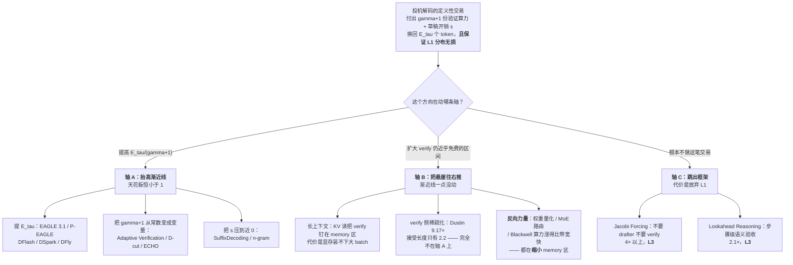

# 25 未来判断 —— 哪些方向会活下来

> **判断日：2026-08-22。** 本篇是本库的亮立场篇，不是综述。每条判断都标了证据等级（**A** = 有实测或官方文档支持；**B** = 有论文支持但未见第三方复现；**C** = 我的推断，无直接证据），并在 §8 给出**「如果我错了，会先看到什么信号」**。
> 事实侧（2025–2026 到底发生了什么）在 [[24-前沿进展-2025到2026]]，本篇只管判断。

---

## 1. 一句话

投机解码在 2026 年不是变得更重要或更不重要，而是**变了形态**：从「一个可选的推理加速开关」变成「模型交付规格的一部分 + 服务调度器的一个预算维度」。它面临的真正威胁不是扩散 LLM（扩散已经被吸收成了草稿器），而是**任何愿意放弃 L1 分布无损的并行解码路线** —— 因为**投机解码的护城河从来不是速度，是那个分布保证**。而它面临的真正难题也不是「草稿不够准」，是**长输出下接受率会自己衰减到 1**。

---

## 2. 从哪来：为什么"判断"这件事在这个主题上是可做的

多数技术预测是不可证伪的修辞。投机解码不一样，因为它有一条**算术上的硬边界**：

[[18-batch与吞吐-收益衰减曲线]] §4 推出，一旦验证前向进入 compute-bound 区，加速比收敛到

$$
\lim_{\text{batch}\to\infty}\text{speedup}=\frac{E[\tau]}{\gamma+1}\,(1-s)\ <\ 1
\tag{2.1}
$$

其中 $s$ 是草稿前向占迭代时间的比例。这个极限**只取决于两件事**：你让目标模型算了 $\gamma+1$ 个位置，其中只有 $E[\tau]$ 个变成了产出。

这条渐近线**任何新方法都逃不掉**，只要它还在做同一笔交易 —— **消耗 $\gamma+1$ 份验证算力，换来 $E[\tau]$ 个 token**。EAGLE 3.1 逃不掉，DFlash 逃不掉，DSpark 逃不掉。这给了我们一把可以拿去量所有新方向的尺子，而不必等它们各自的 benchmark。

所以本篇的做法是：**先用 (2.1) 把 2025–2026 的所有方向做一次强制分类，再下判断。** 分类本身就是判断的一半。

---

## 3. 分析框架：两条轴，和一条框架外的路

### 3.1 任何方向只能动三样东西

把 (2.1) 拆开，能被人为改变的只有三个量：$E[\tau]$、$\gamma+1$、以及**你在什么负载区间里工作**（memory-bound 还是 compute-bound）。于是所有方向落进三格：

| | 它改的是什么 | 对渐近线的效果 | 天花板 |
|---|---|---|---|
| **轴 A** | 提高 $E[\tau]/(\gamma+1)$ 或压低 $s$ | **真的抬高渐近线** | $E[\tau]\le\gamma+1$，所以**渐近线恒 $<1$**，最好只能打平 |
| **轴 B** | 扩大「验证仍近乎免费」的负载区间 | **渐近线一点没动**，只是把悬崖往右推 | 悬崖仍在，且有别的约束（显存 / 无损性）会先撞上 |
| **轴 C** | 不再做这笔交易 | 框架不适用 | 代价是放弃 L1 |

### 3.2 一个把框架变具体的小算例

拿 P-EAGLE blog 里那张接受长度表直接算（口径：单卡 **NVIDIA B200**，模型 **GPT-OSS 20B**，$K=\gamma=7$，基线是 EAGLE-3 而非 AR，HumanEval；来源 <https://vllm.ai/blog/2026-03-13-p-eagle>，2026-03，Amazon + NVIDIA）：

| 方法 | $E[\tau]$（AL，HumanEval） | $\gamma+1$ | compute 极限渐近线 $E[\tau]/(\gamma+1)$ |
|---|---|---|---|
| EAGLE-3 | 3.03 | 8 | **0.379** |
| P-EAGLE | 3.94 | 8 | **0.493** |

P-EAGLE 把渐近线抬高了 **30%**，这是实打实的轴 A 进步 —— 但 0.493 仍然意味着**在深 compute-bound 区，开投机会让吞吐掉一半**。这个算术推断和 P-EAGLE 自己实测的形状完全对得上：它 vs EAGLE-3 的加速比从**并发 C=1** 的 1.55–1.69× 一路衰减到**并发 C=64** 的 1.05–1.25×（口径同上表：单卡 B200、GPT-OSS 20B、$K=\gamma=7$、基线是 EAGLE-3 而非 AR；MT-Bench / HumanEval / SPEED-Bench 三个集）。

**这就是本篇的分析主轴**：轴 A 上的每一分进步都是真的，但它买的是「亏得更少 + 悬崖更靠右」，不是「在任何负载下都赚」。

---

## 4. 逐条判断

### 4.1 哪些方向已经赢了（成为默认配置）

**J1｜「模型交付时自带草稿头」已经是默认配置。 —— 等级 A**

vllm-ascend v0.23.0（2026-08-16，官方 release notes <https://docs.vllm.ai/projects/ascend/zh-cn/main/user_guide/release_notes.html>）一次性把 MTP 支持扩到 **DeepSeek V4、Qwen3.5、Qwen3.6、MiniMax 2.x、Step3、Gemma4** 六个模型族。一个 NPU 后端愿意为六个不同厂商的模型族分别做 MTP 适配，说明这已经不是 DeepSeek 一家的特色。MiniMax-M2（arXiv:2605.26494 v2，2026-07-30，「**B**」）更进一步，在**持续预训练的 decay 阶段**把 MTP 模块从 1 个扩到 3 个（K=3），并用主模型权重拷贝初始化。

**框架位置**：这条**不在任一轴上**。自带 MTP 只是把草稿开销 $s$ 压到接近 0（共享 embedding、单层头），并没有改变 $E[\tau]/(\gamma+1)$。**它是分发方式的胜利，不是算术的胜利。** 机制细节见 [[14-MTP-从训练目标到推理草稿]]。

**J2｜「以 target hidden state 为条件」赢了；「独立小模型当草稿」输了。 —— 等级 A**

EAGLE-3（arXiv:2503.01840）→ EAGLE 3.1（vLLM v0.22.0，2026-05）→ P-EAGLE（vLLM v0.16.0，PR #32887，2026-03）全在 vLLM 主干；这个条件化设计被 DFlash、DSpark、DFly **全部继承**。MLSys 2026 的《Speculative Decoding: Performance or Illusion?》（Xiaoxuan Liu, Jiaxiang Yu, Jongseok Park, Ion Stoica, Alvin Cheung，UC Berkeley 系，最佳论文荣誉提名，<https://specdecode-bench.github.io/>）给独立 draft model 留下的唯一生态位是「target 足够大」：draft 前向占 target 的 **~12.5%（70B）** vs **~37.5%（8B）**（口径：H100 80GB，vLLM v0.10.1.1，8B 单卡 / 70B·106B 用 TP=4，每步提议 3 个草稿 token）。

**框架位置**：轴 A 的双打 —— 条件化提高 $E[\tau]$，一两层的头压低 $s$。演进线见 [[13-EAGLE三代-特征级自回归的演进]]。

**J3｜「一次前向出一块」赢了纯串行草稿 —— 但只赢了 backbone 那一半。 —— 等级 A**

P-EAGLE 在 $K=7$ 下接受长度反而**高于**串行的 EAGLE-3（HumanEval 3.94 vs 3.03，SPEED-Bench 3.38 vs 2.59，MT-Bench 3.70 vs 3.27；口径同 §3.2）。这条反直觉，原因 blog 说得很清楚：并行 drafter 可以做得更深 —— 原本花在 $K$ 次串行前向上的算力，被堆进了一次更深的前向。DFlash（arXiv:2602.06036（2026-02），Jian Chen / Yesheng Liang / Zhijian Liu，z-lab）用块扩散做 drafter，已被 vLLM / SGLang / TensorRT-LLM / vllm-ascend **四家全部支持**。

**"只赢了一半"的意思见 J7** —— backbone 可以并行，但位置间的因果依赖不能丢。

**J4｜验证预算从「固定 γ」升级成「跨请求全局分配」。 —— 等级 A**

vLLM 把动态 K 做进官方配置（`num_speculative_tokens_per_batch_size`，取值是 `[start_bs, end_bs, optimal_K]` 三元组的列表，例如并发 1–64 用 K=3、65–128 用 K=1、**129–512 用 K=0 即完全关闭投机**）。更进一步，DSpark 的 confidence 调度 **2026-07 进 SGLang 主干（PR #30261，commit 692c5f7d）、2026-08 进 vLLM 主干（`enable_adaptive_verification`，PR #47808）**。

支撑这个转变的一个数（vLLM 官方 blog 2026-08-14 实测，<https://vllm.ai/blog/2026-08-14-dspark-adaptive-verification>；口径：**8×NVIDIA B300（SM100）**，TP=8，EP 开启，DeepSeek-V4-Pro-0813，FP8 KV cache，`max_model_len 16384`，880 prompts，temperature=1.0，输出至 2048 token，并发 1–256）：**第 1 个草稿 token 存活 >70%，第 7 个 <10%。**

**框架位置：这是唯一一条直接改分母的。** 固定 $\gamma=7$ 意味着你为第 7 个位置付了整整一份验证算力，买回来的期望产出不到 0.1 个 token —— 那一份算力有 90% 以上是纯浪费。跨请求分配就是把这份算力挪给另一条请求的第 2 个位置。同方向还有 D-cut 的跨请求剪枝（arXiv:2607.14647，Tencent）、ECHO 的 super-tree 预算（arXiv:2604.09603，ICML 2026，已集成进 SGLang）。工程细节见 [[17-动态草稿长度与自适应停止]] 与 [[20-主流引擎实现-vLLM与SGLang与TensorRTLLM]]。

值得记的一个对照（LMSYS blog 2026-07-06，<https://www.lmsys.org/blog/2026-07-06-dspark-sglang>，混合流量）：**gsm8k 拿到 5.24-token 的验证窗口，poetry 只拿 2.91-token。** 这是"按请求分配预算"最直观的证据。

**J5｜高重复负载上，无模型草稿打得过神经网络 drafter。 —— 等级 A**

SuffixDecoding（Snowflake AI Research，arXiv:2411.04975，NeurIPS 2025 Spotlight）已进 vLLM 主干（PR #25784，配置 `{"method":"suffix","num_speculative_tokens":32}`，需同时装 Arctic Inference）。投机开销 **20–30 微秒/token，在 CPU 上**（生产化 blog 2025-12-02，Aurick Qiao / Gabriele Oliaro / Samyam Rajbhandari）。MLSys 2026 给了触发条件：**prompt-output 的 BLEU-4 重合度 > ~0.6 时，n-gram 比 EAGLE/EAGLE-3 最高快 100%**。

**框架位置**：轴 A 的极端形态 —— 把 $s$ 压到近 0（CPU 上的后缀树几乎不占 GPU 时间），同时在高重复负载上 $E[\tau]$ 极高。**在 agentic / 代码编辑 / RL rollout 这类负载上，一棵 CPU 后缀树打得过神经网络 drafter。** 详见 [[11-无模型草稿-promptlookup与ngram与检索]]。

**J6｜训 drafter 从研究项目变成了流水线。 —— 等级 B**

五套开源训练栈同时存在：SpecForge（LMSYS，arXiv:2603.18567，blog 2025-07-25）、TorchSpec（EAGLE 3.1 用它训 Kimi K2.6 草稿）、DeepSpec（DeepSeek，含 Eagle3/DFlash/DSpark 三种实现）、AngelSpec（Tencent，github.com/Tencent/AngelSpec）、Speculators（vLLM 项目 / Red Hat，把投机细节收进 `config.json` 的 `speculators_config`）。Red Hat 的 cross-distillation 配方（2026-07-06，<https://developers.redhat.com/articles/2026/07/06/smarter-data-generation-faster-speculator-training>）把 Qwen3-30B-A3B 的平均接受长度从 **2.77 提到 3.05（+10%）**，办法只是把训练数据从 self-distillation 换成 Qwen3-235B 生成的数据 —— **硬件/batch 口径原文未给出，不可横比**。

降级到 B 的理由：五套框架的**独立第三方复现我没有见到**，各家的加速数字都是自报。训练细节见 [[21-草稿模型怎么训-对齐与在线蒸馏]]。

### 4.2 哪些方向正在死掉，死因是什么

**J7｜纯并行、位置间无依赖的多头草稿（Medusa 式）这一档已经死了。 —— 等级 A（本篇最硬的一条）**

判决书是 DSpark 论文（**arXiv:2607.05147v1，2026-07-06**，Xin Cheng、Xingkai Yu、Chenze Shao、Jiashi Li、Yunfan Xiong 等 20+ 人，**Peking University + DeepSeek-AI**）Figure 2 给出的**位置级接受率曲线**：

| 位置 | 自回归 drafter（Eagle3） | 并行 drafter（DFlash） |
|---|---|---|
| 位置 1 | 0.81（Math） | **0.88（Math）** —— 并行更强 |
| 位置 2–7 | **稳定** | **快速衰减**（Chat 上 0.72 → 0.63） |

> ⚠️ **口径不全**：这两行引的是**不同域**（位置 1 是 Math，衰减那行是 Chat），所以它不是一条干净的同域曲线。原文的定性结论是明确的，但**不能把 0.88 和 0.63 直接相减**。

**死因，DSpark 给了名字：suffix decay / multi-modal collision。** 纯并行 drafter 的每个位置**独立预测**、不以前面已采样的 token 为条件，于是模型在多个都合理的续写之间做**边缘化**，吐出像 "of problem" 这样自相矛盾的组合 —— 各位置单看都对，连起来不成话。

**为什么位置 1 领先救不了它**：$E[\tau]$ 是位置 $1..\gamma$ 上的**累积存活**，不是各位置的平均。位置 1 上 +0.07 对 $E[\tau]$ 的贡献是一阶的，位置 2–7 的塌方却是**连乘**衰减。这也正是 §4.1 J4 那个数（第 1 位 >70%、第 7 位 <10%）的另一面。

**两家独立收敛到同一个形状，这是最强的一类证据**：DSpark 用**并行 backbone + 轻量因果 head**（两种变体：Markov head 做低秩一阶转移近似 $B(x_{k-1},\cdot)=W_1[x_{k-1}]W_2$，$r=256$；或 RNN head 在块内维护递归状态）；Tencent 的 DFly（AngelSpec，**arXiv:2607.25852v2，2026-07-29**，Hong Liu 等，Tencent Inc）独立地做了 **predecessor-conditioned autoregressive head** —— 用更早草稿位置已选定的 token 修正边缘预测。**同源思路，两家分头到达。**

**离线收益**（DSpark，口径：Qwen3-4B/8B/14B、Gemma4-12B，math/code/chat 共 9 个集，**硬件与 batch 原文未给出**）：

| 对照 | Qwen3-4B | Qwen3-8B | Qwen3-14B |
|---|---|---|---|
| vs 自回归 Eagle3（接受长度） | +30.9% | +26.7% | +30.0% |
| vs 纯并行 DFlash（接受长度） | +16.3% | +18.4% | +18.3% |

**必须区分的两件事**：死的是 **Medusa 的多头结构**（无位置间条件化），**不是 Medusa 的树注意力** —— 树注意力活得好好的，见 [[16-树形草稿与树注意力-mask构造与验证]]。Medusa 另有一条独立的死因：它的 **typical acceptance 是 L3 近似**，本库 `_lab/test_caliber.py::test_typical_acceptance_is_biased` 已判定其输出分布在任何阈值下都不等于 $p$。历史脉络见 [[12-Medusa-多头草稿与树注意力的诞生]] 与 [[15-谱系图与被淘汰的分支]]。

**J8｜固定形状的大树死了；活下来的是「按预算动态裁剪的树」。 —— 等级 A（原为 B；2026-08-22 核到一手原文后回升，见 §7 第 4 条）**

> **这条原为 B 级，理由是"本库两份调研笔记对这条数打架"。2026-08-22 复核：打架的不是两个来源，是两个版本 —— RS-5 记的是 arXiv:2601.11580 **v2**，RS-4 抽的是 **v1**，而 v1 里根本没有这节。核到 v2 原文后，证据回到一手正文，等级从 B 回升到 A。** 保留这段说明，不把降级过程抹掉。

**一手原文（arXiv:2601.11580 v2，2026-03-18 修订新增的 "Tree-Style Verification" 节 + Figure 2）逐字**：*"By batch size 64, the k=21 tree falls below 1× speedup on all workloads for both models, whereas the chain remains above 1× throughout."*

**全口径**：SGLang v0.5.9（**不是 vLLM** —— 原文自陈 vLLM 当时的 draft-tree 通路"尚未优化到可公平比较"）；H100 80GB（Qwen3-8B 单卡 / Llama3-70B TP=4）；GSM8K / CNN-DailyMail / ShareGPT / InstructCoder 四个非推理负载；**树深固定 3**；chain 基线 k=3，树 k=6（分支因子 2）、k=21（分支因子 4，≈EAGLE 的树）；chain 用 FlashAttention-3、树用 FlashInfer；测**吞吐比**（generated tokens/sec，开 SD vs 不开）；batch=1/16/64/128。**bs=1 时树是赢的**：Qwen3-8B/GSM8K chain **1.65×** → k=21 **1.85×**；Llama3-70B/ShareGPT **1.81× → 2.03×**。⚠️ 原文未指明这组数字属于 EAGLE 还是 EAGLE-3。

**为什么这组数字恰好证的是 J8 而不是"树死了"**：宽树买到的接受长度是**用崩塌的接受率换的** —— Qwen3-8B/GSM8K 接受长度 2.25→2.92（+30%），接受率 0.415→**0.095**（−77%）。**多验的那些分支绝大多数必被拒**，而验证本就吃掉 42%–95% 的执行时间。所以死的是**"固定的大树"**（宽度是常数、不看预算），不是树本身：在 bs=1 它仍然是全场最快的配置。[[16-树形草稿与树注意力-mask构造与验证]] 的可执行验证给的是同一条结论的机制侧——**树要赢必须同时满足两个条件，缺一不可**，而固定大树两个都不保证。

**框架位置**：树的宽度只加 $\gamma$，只有在**边际覆盖为正**时才加 $E[\tau]$。在 compute 区，无效宽度是纯分母膨胀。活下来的形态是 D-cut / ECHO 那种按实测 step latency 动态裁剪的树。

**J9｜「离线训一次 drafter 就发版」的做法死了。 —— 等级 B**

Aurora（**arXiv:2602.06932（2026-02-06）**，论文标题《When RL Meets Adaptive Speculative Training》，会议与机构**均未查证** 〔2026-08-22 核：arXiv abs 页 Comments 与 Journal-ref **均为空**，Together AI 博客也**未提任何会议**，故 ICML 2026 降级为「未查证」；论文与博客均未列作者机构，「Together AI 主导」同样**未经证实**，只能说博客发布于 Together AI 站点〕；作者含 **Tri Dao、Percy Liang**；代码 github.com/togethercomputer/aurora）把在线 speculator 学习重述成异步 RL：draft model = 策略 $\pi$，target + verifier = 环境；被接受与被拒绝的 token 都流进 data buffer；训练服务器在副本上更新后**热插拔**权重回推理服务器，不中断请求。

数字（**硬件口径原文未给出**）：Qwen3-Coder-Next-FP8、batch 8，**day-0 从零起步**，约 1k warmup + 10k steps 后接受长度 3.0、吞吐 **1.21×**；MiniMax M2.1、batch 4/8 达 **1.45×**；域漂移下 Qwen3-8B 约 **10,000 个请求内恢复**；对比训好的静态 speculator **额外 1.25×**。

**推断**：离线训 drafter 会退化成「冷启动」而不是「交付物」。降级到 B 的理由：Aurora 是我找到的**唯一一家**做在线训练并给出数字的，没有第二家复现。

**J10｜「自带 MTP = 投机解码问题已解决」这个说法死了 —— 但 MTP 本身没死。 —— 等级 A**

四条反证，其中第一条是决定性的：

1. **DeepSeek 自己在 V4 生产线上把 MTP-1 换掉了。** DSpark-5（γ=5）vs 生产基线 MTP-1，**live user traffic**：V4-Flash 在 80 tok/s/user SLA 下**聚合吞吐 +51%**，等吞吐下 **per-user 生成速度 +60%~+85%**；V4-Pro 在 35 tok/s/user SLA 下**聚合吞吐 +52%**。（**硬件口径未披露**。）**提出 MTP 的那家公司，亲手把它从生产线上换了下来。**
2. Nebius 的 LK Losses（**arXiv:2602.23881，ICML 2026**，Alexander Samarin 等，「**B**」）指出 DeepSeek-V3 的 MTP 模块**主要是为「预测第一个 token」训练的**，推理时却被自回归地反复复用到后面位置，导致后面位置接受率退化 —— **训练目标与推理用法本来就错配**。
3. MTP head **一样有 attention drift**：arXiv:2605.09992（2026-05-11，Doğaç Eldenk 等，Northwestern + Waterloo，含 EAGLE 系共同作者 Hongyang Zhang）在 **Qwen3.5 9B 的 MTP head** 上观察到与 EAGLE-3 drafter 相同的漂移。
4. vllm-ascend 官方文档写明：**DeepSeek MTP 在 `num_speculative_tokens > 1`（尤其 ≥3）时「精度与性能都无法有效保证」**，原因是**只暴露了单层权重**。

**判决：MTP 是地板，不是天花板。** 它是模型交付时应当自带的最低配置，但一线厂商的生产线普遍在 MTP 之上再叠一层专门训练的 drafter。

**J11｜不带口径的加速比宣传死了。 —— 等级 A**

MLSys 2026 abstract 原句：*"its real-world effectiveness remains unclear as prior evaluations rely on research prototypes and unrealistically small batch sizes."* 这篇拿了最佳论文荣誉提名。**这条社区规范正在被强制建立** —— 本库铁律二押对了。

坦白说：这是我最有把握、也最不重要的一条判断。

### 4.3 三个真正的开放问题

**O1｜长输出下接受率的衰减，能不能治？** —— 见 §5.3，这是本篇认为的**头号存亡问题**。

**O2｜验证侧的 oracle 缺口。**

MLSys 2026 测出：**验证吃掉 42%–95% 的执行时间**；Llama-3-70B、bs=512、n-gram 时验证占 **~95%**，drafting 基本免费。同一篇的 oracle 分析（InstructCoder，bs=1）：**oracle ~2.75×，而固定提案方法只有 ~2.1×；Oracle Combine 最高 4.9×，而最好的单方法 oracle 只有 ~2.2×。**

**这个 2.2× → 4.9× 的落差是本领域现在最大的一块明牌**：它说的不是"把草稿做得更准"，而是**"每个请求每个位置该用哪种投机、验多深"**。DSpark 的 confidence scheduler、D-cut 的跨请求剪枝、ECHO 的 super-tree 预算是第一批答案，**且已经进了 vLLM/SGLang 主干**（J4），但离 4.9× 还很远。

**长上下文子问题（证据已经很硬）**：Dustin（**arXiv:2606.24957，2026-06-23，ICML 2026**，WenHung Lee 等，NYCU + TU Darmstadt + Cornell）在**同硬件同模型**下给了一组决定性对照 —— 口径：**NVIDIA H200，bfloat16，pipeline parallel 4×H200**，Qwen2.5-72B（target）/ Qwen2.5-0.5B（draft），**32K 上下文，batch 16**，KV budget 512：

| 方案 | 稀疏用在哪 | 加速 |
|---|---|---|
| ClassicSD（full-KV 验证） | 无 | 1.76–1.91× |
| MagicDec（稀疏起草 + full-KV 验证） | 只在 draft | 1.70–1.96× |
| **Dustin** | **推进 verify** | **9.17×** |

**这 5 倍的差距（同为 32K 上下文、batch 16、4×H200、Qwen2.5-72B+0.5B），就是长上下文下 verify 侧 KV 读取所占的规模。** 代价是**不再无损**（L1 → L3；LongBench 掉 0.58%）。而**三大引擎主干里一个长上下文专用实现都没有** —— vLLM 官方投机文档全文对长上下文零陈述，SGLang 2026 Q2 投机 roadmap（issue #23005）六项里也没有任何一项针对长上下文或验证成本。**这是当前学研与工程之间最大的一块「已知在哪、但没人捡」的钱**，挡路的不是不知道怎么做，是**捡起来就不再是 L1 了**。详见 [[22-长上下文下的投机采样]]。

**O3｜PD 分离下的状态传输。 —— 这条我最有把握是「真空白」**

EAGLE 系 drafter 依赖 target 的 hidden state，自投机依赖 target 的 KV。在 prefill-decode 分离架构下，**这些中间量要么跨节点传输、要么重算**。已知的只有两条边角：TensorRT-LLM 用 two-model 方式支持 EAGLE3 + disaggregated serving（「**B**」）；StreamServe（arXiv:2604.09562）提出 SpecuStream 做运行时自适应投机深度 —— 但它声称相对张量并行 vLLM 基线降低延迟 **11–18×**（硬件 4×A800-40GB，评测 ALPACA/GSM8K/HUMANEVAL/SUM 各 80 条共 320 条；**batch size / 并发、γ、接受长度全部未给出，口径严重不全**），**这个量级远超本领域其它所有工作，我判断为高度存疑，未经独立复现**。另注：该文的 arXiv 编号（2604 → 2026-02（v1））与检索摘要给的提交日期互相矛盾，**日期未查证**。

**我没有找到任何一篇专门研究「投机解码在 PD 分离下的 hidden-state / KV 传输代价」的论文。** 随着 PD 分离成为大规模服务的标配，这会变成一个必须回答的系统问题。相关账本见 [[23-与其它优化的相互作用-量化与KVcache与PD分离]]。

---

## 5. 三个具体案例：把框架用在真事上

### 5.1 案例一：EAGLE-3 相对 EAGLE —— 轴 A 的教科书实例

EAGLE-3 论文（arXiv:2503.01840）Table 5 是目前**唯一一张明确穿过 1.0× 的公开批大小扫描表**。口径：**GPU = RTX 3090**，目标模型 = LLaMA-Instruct 3.1 8B，基线 = 未开投机的 vLLM 归一化为 1.00×，指标 = 吞吐比。**口径缺项：γ / 树规模 / 逐 batch 接受长度 / 温度 / 数据集 / 精度全部未给 → 不可与其它来源横比。**

| batch size | 2 | 4 | 8 | 16 | 24 | 32 | 48 | 56 |
|---|---|---|---|---|---|---|---|---|
| **EAGLE** | 1.30× | 1.25× | 1.21× | 1.10× | 1.03× | **0.93×** | 0.82× | **0.71×** |
| **EAGLE-3** | 1.75× | 1.68× | 1.58× | 1.49× | 1.42× | 1.36× | 1.21× | **1.01×** |

**读法**：EAGLE 从 bs32 起净亏，bs56 时比不开投机慢 29%。EAGLE-3 把打平点推到 bs56 附近。

> **EAGLE-3 相对 EAGLE 做的事，是把交叉点从 bs32 推到 bs56 —— 它没有消除交叉点，它把交叉点搬了个家。**

这正是 §3 框架预言的形状：轴 A 上的进步抬高了渐近线（更高的 $E[\tau]$），于是曲线整体上移、与 1.0 的交点右移；但渐近线仍恒 $<1$，所以交点必然存在。本库 `_lab/test_speedup.py::test_spec_throughput_saturates_while_baseline_keeps_climbing` 用解析模型给出同一条机制：batch 涨 8 倍，投机吞吐涨不到 10%，基线涨超过 150% —— **投机吞吐封顶而基线不封顶，交叉点是算术必然。**

**推论（等级 A）**：任何"我们把接受长度提高了 X%"的工作，**它买到的是交叉点右移，不是交叉点消失**。评价这类工作的正确问题是"新的交叉点在哪"，不是"加速比多少"。

### 5.2 案例二：Dustin 的 9.17× —— 一个完全不在轴 A 上的胜利

Dustin 的接受长度只有 **2.2**（见 O2 的口径表），DFlash 的接受长度是 **6.54**（Qwen3-8B，greedy，Transformers backend，平均 4.9× vs AR；**batch 原文未给出，从"Transformers backend / greedy"推测是 bs=1，标为推断**）。按轴 A 的尺子，Dustin 应该被 DFlash 吊打。**结果 Dustin 拿到 9.17×，DFlash 拿到 4.9×。**

矛盾吗？不矛盾 —— **它们在两条不同的轴上**：

- DFlash 走轴 A：提高 $E[\tau]$，让每份验证算力换回更多 token；
- Dustin 走轴 B：**把每份验证算力本身变便宜**。长上下文下 decode 的瓶颈从"读权重"变成"读 KV cache"，而读 KV 的成本随被验证 token 数**成正比**增长 —— [[03-并行验证为什么几乎免费-算术强度与roofline]] 里"并行验证几乎免费"这个前提直接失效。Dustin 把稀疏推进 verify，等价于把 memory-bound 区往外推了很远。

**这个案例是本篇框架最有用的地方**：它给出一条可判定的判据 ——

> **看到一个加速比，先问它是靠 $E[\tau]$ 赢的还是靠"每份验证算力更便宜"赢的。接受长度和加速比在轴 B 上会脱钩，此时用接受长度去预测加速比会错得离谱。**

代价那一栏也要写清楚：Dustin **不是 L1**（LongBench 掉 0.58%，Qwen2.5-72B，KV budget 512；budget 降到 128 时掉到 52.41%）。**目前把稀疏推进 verify 的（Dustin / SpecPV / STS / SSV）全部有损；坚持 L1 的（Vegas / VeriCache / SparseSpec-L）只能稀疏 draft，长上下文收益立刻缩水** —— Vegas（arXiv:2602.07223（2026-02），ICML 2026 poster，v1 名为 SpecAttn，**改过名**）自己的数据最诚实：短上下文 1.25–2.81×，长上下文（96K–120K token，batch 4–20，2×H100 NVL）**只剩 +18%–29%**。

### 5.3 案例三：长 CoT —— 「推理模型时代投机解码更重要」是错的

**直觉说更重要**：推理模型输出动辄上万 token，decode 阶段绝对时长暴涨，而 decode 是带宽瓶颈，投机的价值应当放大。

**实测说它会自己失效**。Test-Time Speculation（**arXiv:2605.09329**，v1 2026-05-10 / v2 2026-05-20，Avinash Kumar、Sujay Sanghavi、Poulami Das；**机构按通讯邮箱后缀 `@utexas.edu` 推断为 UT Austin，未在论文首页确认**）：

| 观测 | 数字 | 口径 |
|---|---|---|
| MATH-500 / Qwen3-8B | 平均接受长度 **前 10K 输出 token 为 3.7**，**最后 10K 输出 token 掉到 1.5** | **硬件/batch 原文未给出** |
| EAGLE-3，跨任务 | 生成约 **20K token 后接受长度掉到 ~1.1** —— **实际上已经没有加速** | 同上 |
| 被测 speculator | **EAGLE-3、DFlash、PARD 三者都有这个现象** | — |

（另有一条 "AIME-2025 / Qwen3.6-35B 接受长度从 15 降到 1.7" 来自检索摘要，**未在原文核实，本篇不作为论据**。）

**机制要讲清楚 —— 关键在于两个效应不是相加，是相乘：**

- 效应 ①（放大）：长 CoT 让 decode 的绝对时长暴涨 → 投机的**收益基数**变大；
- 效应 ②（归零）：接受长度随输出位置**单调衰减** → 投机的**边际收益**趋零。

把 $E[\tau]$ 写成输出位置的函数 $E[\tau](t)$，(2.1) 就变成一条随位置下滑的曲线。当 $E[\tau](t)\to 1.1$ 而 $\gamma=7$ 时：

$$
\frac{E[\tau](t)}{\gamma+1}=\frac{1.1}{8}=0.1375
$$

**即使在 memory-bound 区，加速比也只剩 $1.1/(\gamma c+1)$ 量级（$c$ 为草稿相对成本）；一旦进 compute 区，渐近线掉到 0.14 —— 长 CoT 的后段，投机是纯亏。**

> **正确的表述是**：长 CoT 让投机解码**在输出的前 5–10K token 更值钱，在 20K token 之后基本失效**。收益从"按输出长度线性增长"退化成**"有上限的一次性红利"**。 —— 等级 **A**（J16）

**衰减的因果机制未定 —— 这是 O1 的核心。** 三个候选，证据强度差别很大：

1. **Attention drift**（arXiv:2605.09992）：投机步之间的残差连接**没有归一化**，hidden state 幅度随链深单调增长，drafter 的注意力逐渐从 sink token 挪到自己刚生成的 token。**输出越长，drafter 可依附的自身生成内容越多、prompt 占比越小，drift 应当越严重。** —— 但**没有任何论文明确把 Test-Time Speculation 的位置衰减与 attention drift 连起来**。这是一个**未被验证的假说**，等级 **C**。
2. **任务本身在后段变难**：推理后段是收束与计算，本来就更不可预测。—— **没有论文把这两个因素分开测过**（等级 **B**，这是一条基于检索无果的否定性判断，J17）。
3. **drafter 训练数据的长度分布不够**：—— **输入侧的同类解释已经被证伪**。OWL（arXiv:2510.07535，2025-10-08 仅 v1，Jaeseong Lee / Seung-won Hwang（SNU）+ Snowflake AI Research + CMU）Table 4，口径 LongSpecBench（WildChat-4.8M 采样 200 条，上下文 4K–64K），**batch=1**、tree size 60、depth 8、top-k 10、fp16、**1×H200（8B）**：

| 配置 | 接受长度 |
|---|---|
| EAGLE3（训练 ctx 2,048，短数据） | 1.28 |
| EAGLE3-L（**训练 ctx 32,768，LongAlign+LongWriter 长数据**） | 3.23 |
| **OWL（训练 ctx 仅 256 token，短数据）** | **4.00** |

**把 EAGLE3 也拿长文本训（而且训到 32K，再长就 OOM），仍然打不过用 256 token 短数据训的 OWL。病根是架构对窗口的依赖，不是数据。** 如果输出侧同理，加长训练数据也救不了。

**EAGLE 3.1 是第一个针对性修补**（FC normalization + post-norm hidden states，vLLM v0.22.0），但它给的长上下文增益只有 **1.18×**（见 §7 口径纠正）。**症状被缓解，没有证据表明根因已被解决。**

**一条可立即开工的工程空白（等级 C，J18）**：当前三大引擎的动态投机策略，要么按 **batch size** 分配（vLLM `num_speculative_tokens_per_batch_size`），要么按**跨请求 confidence** 分配（Adaptive Verification / D-cut / ECHO），**没有一个是按「这条请求已经生成了多少 token」分配的**。而 Test-Time Speculation 说的恰恰是接受率随**输出位置**衰减。**长 CoT 服务应当把投机做成"按输出位置衰减的开关"** —— 这是一个具体的、现在就能做的东西。

---

## 6. 什么条件会让投机解码整体变得不重要

### 6.1 论证：护城河不是速度，是 L1

**第一步：把投机解码的定义性交易写清楚。**

投机解码付出的是「$\gamma+1$ 份验证算力 + 草稿开销 $s$」，换回的是两样东西：

- **速度**：$E[\tau]$ 个 token 一次拿到；
- **保证**：这 $E[\tau]$ 个 token 的联合分布与目标模型自回归分布**逐点相等**（**L1 分布无损**，证明见 [[07-无损的三种口径-分布无损不等于结果相同]]）。

(2.1) 已经说明第一样东西**在越来越大的负载区间里是亏的**。所以：**在纯速度维度上，投机解码是一笔越来越差的买卖。它今天还站得住，靠的是第二样东西。**

**第二步：如果只要速度不要 L1，有更便宜的买法。**

**Jacobi Forcing**（**arXiv:2512.14681**，2025-12，《Fast and Accurate Causal Parallel Decoding using Jacobi Forcing》，**Hao AI Lab @ UCSD**，github.com/hao-ai-lab/JacobiForcing，「**B**」）：

- **诊断**：现有并行解码方法加速有限，因为存在 **pretrain-to-posttrain 失配**；而 dLLM 依赖**双向注意力**，与预训练学到的因果先验冲突，**也妨碍精确的 KV cache 复用**。
- **机制**：**渐进蒸馏** —— 训练模型沿着**它自己的 Jacobi 解码轨迹**去处理带噪的未来块，**保留因果 AR backbone**，从而保住精确 KV cache 复用。
- **效果**：得到的 AR 模型「表现得像扩散式解码器 —— 一次出多个 token，但仍然从左到右」，**最高 4× 以上**。⚠️ **口径几乎全缺**：**原文未给出 batch / 并发**，也未给出硬件与基线实现（本库调研到的只有这一个"最高"值）。所以这个 4× 只能当**方向性信号**读，**不许与本篇任何标了负载口径的加速比放进同一张表**。
- **口径（关键）**：原文说 *"with minimal generation quality degradation"* —— **它不是无损的，是 L3。**

**框架位置：Jacobi Forcing 整个跳出了 (2.1)。** 它不消耗 $\gamma+1$ 份算力去买信息，它把"一次出多 token"**直接烧进权重**。**渐近线对它不适用** —— 这就是它危险的地方，也是它与所有轴 A / 轴 B 工作的本质区别：**它不需要 drafter，不需要验证，KV cache 语义干净。它唯一放弃的就是 L1。**

**第三步：扩散不是威胁，因为它被吸收成了草稿器。**

这是本判断最完整的一条证据链：

| 工作 | 出处 | 扩散扮演什么角色 | 落地状态 |
|---|---|---|---|
| **DFlash** | arXiv:2602.06036 | **块扩散做 drafter**，AR 模型做 verifier | 进 vLLM / SGLang / TensorRT-LLM / vllm-ascend |
| **DSpark** | arXiv:2607.05147 | 并行（扩散式）backbone + 轻量因果 head | **DeepSeek V4 生产线** |
| **DFly**（AngelSpec） | arXiv:2607.25852 | 块并行扩散草稿 | Tencent Hy3 线上流量验证 |
| **DEER** | arXiv:2512.15176（2025-12） | 《Draft with Diffusion, Verify with Autoregressive Models》—— 标题即结论 | 论文 |
| **FailFast** | arXiv:2512.20573（2025-12）（Rui Pan, Zhuofu Chen, Hongyi Liu, Arvind Krishnamurthy, Ravi Netravali） | **明确论证**：dLLM 单独用受制于效率-质量权衡，但**用作 drafter 是优势** —— 并行解码大幅降低"被拒绝"的代价，从而**让长草稿第一次真正可行**（很多情况下一次接受 **70 个 token**） | 论文 |

再加一条独立的质量证据：**ParallelBench**（arXiv:2510.04767（2025-10），**ICLR 2026**，furiosa-ai，「**B**」）论证 dLLM 的**条件独立假设**使并行解码**必然忽略 token 之间的依赖**，依赖强时质量必然退化；而 **math/coding 这类标准 benchmark 根本抓不出这种退化**，所以现有评测高估了 dLLM。

> **结论：扩散提供"一次前向出一块"的能力，自回归验证提供 L1 保证。两者是互补件，不是替代品。** FailFast 那句话是最佳注脚：**并行草稿让"猜错"变便宜，于是"猜长"第一次变得划算。** 而 Jacobi Forcing 危险的地方在于，它把这两件事**都吞掉了**。

### 6.2 「放弃 L1」到底是放弃什么：一个定量的锚

社区里"L3 也就差一点点"这个感觉是错的。用本库的可执行验证量一下 —— Medusa 式 typical acceptance（绝对阈值判据），$|V|=5$ 的玩具马尔可夫链，随机种子固定，`_lab/test_caliber.py::test_typical_acceptance_is_biased`：

| 阈值 $\varepsilon$ | 与目标分布 $p$ 的最大逐点偏差 | TV 距离 |
|---|---|---|
| 0.00（无条件接受） | 0.1719 | 0.2004 |
| 0.05 | 0.1719 | 0.2004 |
| 0.20 | 0.2201 | 0.2608 |
| 0.50 | **0.6598** | **0.6598** |

复跑：`cd _lab && python -m pytest test_caliber.py -q`（本次实跑 11 passed）。

**两条读数**：① 放弃 L1 不是"差一点点"，是**换了一个分布**；② `::test_raising_threshold_makes_bias_worse_not_better` 显示，**把阈值调保守，偏差反而变大** —— 因为拒绝后的补偿路径 $p'=\mathrm{norm}(\max(0,p-q))$ 是为 $\min(1,p/q)$ 配套设计的，**判据与补偿必须成对更换，只改判据是修不好的**。

### 6.3 判据与两条"不可协商"的 L1 需求

> **判据（可证伪）**：当"并行解码模型的质量损失"降到**用户与评测都感知不到**的程度时，投机解码在该场景下的边际价值 → 0。

但 L1 在两类场景里是**硬需求**，这两类不会被淘汰：

1. **可复现 / 可审计的输出**：同 seed 同结果（[[07-无损的三种口径-分布无损不等于结果相同]] 讲清了这只有 $T=0$ 的 L2 能给），以及监管场景下"这个输出确实来自这个模型"的可辩护性。
2. **on-policy RL rollout —— 这是 L1 唯一一个数学上不可协商的应用。** NVIDIA NeMo RL（2026-04-21，<https://research.nvidia.com/labs/nemotron/rl-speculative-decoding/>，「**A**」）原文写得很清楚：*"the rejection procedure guarantees rollouts still follow the verifier policy"*、*"verifier-exact semantics are preserved"*。**如果 rollout 的分布不等于 policy 分布，梯度就是错的** —— 这不是质量问题，是正确性问题。数字（8B 模型）：RL-Zero rollout 延迟 100.0 s → **56.6 s（1.8×）**/step；RL-Think 133.6 s → **87.0 s（1.5×）**/step；端到端 RL step 分别 1.4× / 1.3×；rollout 在基线下占 step 时间 **65–72%**。（口径：8B 那组的 **rollout batch size 与硬件原文未给出**，报的是每个 RL step 的 rollout 墙钟时间；**235B 的 ~2.5× 标了 512× GB200 + 同步 RL，但那是外推投影，不是实测。**）

> **所以我的判断（J20，等级 C）：投机解码不会消失，会分裂。** 在 chat / agent 这类不追究分布的场景里，它会被 Jacobi 式方法逐步蚕食；在 RL rollout 与需要可审计输出的场景里，它是**唯一选项**。**赌"投机解码会消失"的人，实际上是在赌"没有人需要 L1"。**

---

## 7. 口径与坑

**1. vLLM 的「长上下文接受长度 2×」是错位引用。** EAGLE 3.1 blog（2026-05-26）说"长上下文下接受长度最多 **2×** 于 EAGLE 3"，但 Attention Drift 论文（arXiv:2605.09992）原文给的**长上下文数字是 1.18×**，**2× 出现在 template perturbation 场景**；七个标准 benchmark（chat/math/coding）上是 **1.10×**。两者不是同一个实验。**引用 EAGLE 3.1 的长上下文改进，必须用 1.18×。**（另注：该 blog 的加速比图注**未明写基线是 AR 还是 EAGLE 3**，口径不全。）

**2. NVIDIA 的「15×」不是加速比。** 完整口径（<https://developer.nvidia.com/blog/boost-inference-performance-up-to-15x-on-nvidia-blackwell-using-dflash-speculative-decoding/>，2026-06-23）：gpt-oss-120b，**8× NVIDIA DGX B300（Blackwell Ultra）**，**TensorRT-LLM**，SPEED-Bench coding，**在 500–600 tok/s/user 的高交互性区间下的聚合吞吐提升**，基线是 AR 解码。AR 要维持 500–600 tok/s/user 只能跑极低并发，**分母被压到了极低**。同一篇 blog 里等并发 vs EAGLE-3 的数字是 **2.3×**（gpt-oss-120b）、**2.8×**（Llama 3.1 8B Instruct）。**引用 15× 必须带上这句解释。**

**3. OWL 的「~5×」是 HOWL 的，不是 OWL 的。** 按 OWL Table 1 核算：**OWL 单独是 4.00/1.28 = 3.13×**；4.80×（≈5×）对应的是**混合版 HOWL**（OWL 的 tree decoding 与 SuffixDecoding 的非树方法按分数阈值路由）。另一个连带的坑：**OWL Table 2 的加速比那一整列都是 Llama-3.3-70B，不是 8B**（其中 **EAGLE3 只有 0.81×，是负加速** —— 铁律三的头号素材，见 [[19-负收益全解-什么时候投机反而更慢]]）。

**4. ~~本库两份调研笔记对 MLSys 2026 的树数据打架 —— 本篇按低的那个采信。~~ 【2026-08-22 已核实原文，此条改写；原文照录不删】** 原记载是：RS-5 按 A 级记录了「Qwen3-8B + EAGLE + tree(k=21)，GSM8K，bs=1 1.65× → bs=128 < 1×」与「树在 bs=64 掉到 1× 以下」；但 RS-4 对同一篇（arXiv:2601.11580）做定向抽取时，结果称**论文正文明确写 "Across all workloads, every SD variant outperforms the no-SD baseline."、且不含该树敏感性分析**，并把「k=21 跌破 1×」标为【待核验】、明令正文不得引用；**处理是 J8 降到 B 级**。

**复核结论：那不是两个来源打架，是两个版本。谁对谁错都不是重点 —— 重点是我把"版本差"读成了"矛盾"。**

- **RS-5 方向对**：树的这组数据确实在原文里，出处是 **arXiv:2601.11580 v2（2026-03-18 修订）新增的 "Tree-Style Verification" 节 + Figure 2**。逐字：*"By batch size 64, the k=21 tree falls below 1× speedup on all workloads for both models, whereas the chain remains above 1× throughout."*
- **RS-4 对 v1 也没抽错**：**v1（2025-12-31）确实完全不含树实验**（全文 `Tree-Style` 0 次、`k=21` 0 次、`SGLang` 0 次）。本库当时四处引用的都是写死版本号的 `…/html/2601.11580v1`，**从未打开过 v2**。
- **那句 "every SD variant outperforms the no-SD baseline" 也不与之冲突**：它在**引言**里，讲的是 **vLLM 上链式 k=3** 的五种变体主实验；**树实验是另一套、跑在 SGLang v0.5.9 上的**。**我把一句引言当成了全文范围的断言。**
- **RS-5 的具体数字则标错了一处**：**1.65× 是 chain(k=3) 的数字，k=21 的树在 bs=1 是 1.85×**；且穿破 1× 的阈值原文写的是 **bs=64**，不是 bs=128。两份笔记已就地更正（RS-4 §2.4/§6.5/§10.4/§10.6、RS-5 §12.1），保留修正痕迹。

**处理：J8 从 B 回升到 A**（论据改为一手正文 v2 + 官方 PDF + 项目网站三源一致），[[16-树形草稿与树注意力-mask构造与验证]] 的可执行判据从"主要论据"退回"机制侧佐证"。

**这条坑要记的教训，和我原先写的那条不是一回事。** 原先记的是"**同一个项目的网站摘要与论文正文可以互相矛盾**"——**在这里这句是错的，而且它把我导向了错误动作：以"论文正文优先"的名义禁用了一条真数据。** 该记的是三条：① **网站与论文"打架"时，先查是不是同一版本**（`abs/` 页会写 *"last revised …(this version, v2)"*）；② **别把版本号焊死进正文 URL** —— `…/html/xxxxv1` 等于让自己永远读不到修订；③ **"论文里没有 X"这类否定断言，必须连同"核的哪个版本、哪天核的"一起记** —— 否定断言的保质期比肯定断言短得多。

**5. L1 与 L3 的数字不许合表。** Lookahead Reasoning（arXiv:2506.19830（2025-06），NeurIPS 2025，Hao AI Lab @ UCSD）把 GSM8K 上的峰值加速从 1.4× 提到 **2.1×**，但它的验收是**步骤级语义正确**，不要求 token 精确匹配 —— **L3**。Jacobi Forcing 的 4× 同样是 L3。Dustin 的 9.17× 是 L3（LongBench −0.58%）。这三个数**都不能**和 EAGLE 的 2×（token 级 **L1**）放进同一张表。

**6. DFlash 的「lossless」是作者自称，本库未独立复核。** 论文声明 lossless（对应 L1），但 RS-5 未逐行核对其验收算法，本篇一律标注「**作者自称 L1，未独立复核**」。另有一条社区实测与它矛盾（Medium 上 Allen Kuo 称 DFlash 在 T≥0.7 时接受率掉到 ~5%、加速比崩塌，「**C**」），**与论文自己给的 T=1 时 τ=5.48 及 DSpark 的 T=1 表格冲突，未复现**，仅作为踩坑记录。

**7. 接受长度不能预测加速比（轴 B 上）。** 见 §5.2：Dustin AL=2.2 → 9.17×，DFlash AL=6.54 → 4.9×。**AL 只在同一条轴上可比。**

---

## 8. 失效条件：我这些判断错了的话，会先看到什么

### 8.1 逐条判断的反证信号

| 判断 | 等级 | 如果我错了，会先看到什么信号 | 在哪能最先看到 |
|---|---|---|---|
| **J1** 自带草稿头成默认 | A | ≥2 家不同厂商的下一代旗舰开源模型，config 里**不带** MTP/draft head，且官方推荐外挂 EAGLE | HF model card 的 `config.json`；vllm-ascend release notes 停止新增 MTP 模型族 |
| **J2** hidden-state 条件化赢 | A | 某主流引擎把 `draft_model` 重新设为**推荐**配置；或跨 tokenizer 的混合服务变主流把独立草稿模型拉回来 | vLLM `features/speculative_decoding/` 文档的推荐顺序 |
| **J3** 并行 backbone 赢 | A | 2027 年某主干实现**回到纯串行 drafter** 且报出更高 AL（同 γ 同硬件） | SGLang / vLLM 的方法列表 |
| **J4** 跨请求分配验证预算赢 | A | vLLM/SGLang 把 adaptive verification **默认关掉或标 deprecated**，理由是调度开销 > 收益 | vLLM PR #47808 之后的 revert / issue |
| **J5** 无模型草稿在高重复负载赢 | A | agentic 负载因工具调用格式标准化而重复度下降，**BLEU-4 重合普遍跌破 0.6** | SuffixDecoding 在 vLLM 里被降级为 optional plugin |
| **J6** 训练基础设施化 | B | Speculators 格式被主流引擎放弃；或五套框架里三套停止维护 | github.com/vllm-project/speculators 的 commit 频率 |
| **J7** 纯并行多头死了 | A | 某方案用**纯并行头**（无位置间条件化）报出**位置 2–7 上不衰减**的接受率曲线；或有人证明 DSpark Fig.2 里的 DFlash 对照是欠训练的 | arXiv 上任何给出**位置级**接受率曲线的新论文 |
| **J8** 固定大树死了 | A（原 B，2026-08-22 核到 v2 原文后回升） | 某引擎把**固定形状**的大树设为默认，并给出 **bs≥64 的正收益实测**（同口径：报吞吐、同硬件、树深与 k 明示） | SGLang / vLLM 的默认 `speculative_num_draft_tokens` 与树策略；以及是否有人在 k=21 量级复现出 bs≥64 的正收益 |
| **J9** 离线训一次就发版死了 | B | Aurora 之外无第二家做在线训练；或有工作实测热插拔在高并发下引发接受率抖动、得不偿失 | ICML/NeurIPS 2027 是否出现在线 speculator 的独立复现 |
| **J10** MTP 是地板不是天花板 | A | DeepSeek 在 V5 上**退回** MTP-N 并报告优于 DSpark | DeepSeek 技术报告 + vllm-ascend 的 `dspark` method 是否被弃用 |
| **J12/J13** 交叉点不可消除 | A | 有人给出 **compute-bound 区内 speedup > 1** 的**同口径实测**（同 batch、同 seqlen、同硬件、报吞吐） | 任何声称"大 batch 下投机也加速"的工作，先看它报的是吞吐还是 TPOT |
| **J14** 轴 B 上 AL 不预测加速比 | A | 出现一个**同时**大幅提高 AL 与大幅降低每 token 验证成本的方法（那样两条轴就不再正交） | 长上下文投机的新论文 |
| **J16** 长 CoT 让投机失效 | A | 有工作在 **20K+ 输出**上实测出**不衰减**的接受长度（同 speculator 家族） | arXiv 上 Test-Time Speculation 的引用者 |
| **J18** 按输出位置调 γ 是空白 | C | vLLM/SGLang 加入以 `num_generated_tokens` 为输入的投机开关 —— **这条空白就被填了** | vLLM `dynamic_speculative_decoding` 文档的配置键 |
| **J19** 护城河是 L1 | B | 某并行解码模型在标准 benchmark + 人类偏好上与其 AR teacher **统计上不可区分**，且不需要 drafter | Jacobi Forcing 的后继工作是否给出分布层面的检验，而不只是 benchmark 分数 |
| **J20** 投机会分裂不会消失 | C | RL 框架开始接受 L3 rollout（比如证明重要性采样修正足以吸收 drafter 偏差） | NeMo RL / veRL 的 spec decoding 配置是否出现 `lossy` 选项 |

### 8.2 整篇框架什么时候不适用

1. **框架只覆盖「消耗算力换 token」这一类方法。** Jacobi Forcing（轴 C）、步骤级投机（换了验收单位）、把稀疏推进 verify（Dustin 改的是每 token 验证成本而非 $\gamma$）都在框架外或只部分适用。**用 $E[\tau]/(\gamma+1)$ 去评价它们会得到错误结论** —— Dustin AL=2.2 却拿 9.17× 就是现成的反例。
2. **框架报的是吞吐，不是延迟。** [[18-batch与吞吐-收益衰减曲线]] §7 已声明：compute 区里吞吐亏，而**单请求 TPOT 仍可能更好**。如果服务 SLO 写的是 P99 TPOT，本篇"大 batch 下应该关掉投机"的推论要反过来读。
3. **框架假设整批共享同一个 $E[\tau]$。** MLSys 2026 实测请求间接受长度**方差巨大**（InstructCoder + Llama-3-70B：EAGLE **2.7–7.4**，n-gram **1.1–15.0**，draft-model **5.6–18.3**）。同步验证意味着整批要等最慢的那条，**真实曲线比本框架更差**。
4. **本篇的判断半衰期很短。** 证据窗口是 2025-08 到 2026-08。参考速度：DSpark 论文 2026-07-06 挂出，**同月进 SGLang 主干，次月进 vLLM 主干**。在这个节奏下，**任何"哪些方向会活下来"的判断，半衰期大约 6 个月。** 本篇标注判断日就是为了让读者能算这笔折旧。
5. **硬件维度上，本篇几乎全是 NVIDIA 数据 —— 这是我最容易错的一条。** AngelSpec 在 **Hy3-A21B（295B MoE / 21B 激活）+ 8×NVIDIA H20，TP=8，T=1** 上测到 DFly vs AR 的加速比在 **c32 达到 2.75× 峰值**（c4 1.98× → c8 2.26× → c16 2.50× → **c32 2.75×** → c64 2.44×），**形状与 P-EAGLE 在 B200 上的单调下降相反**。合理解释是 H20 的带宽相对算力更紧张、21B 激活的 MoE 在其上长期处于带宽瓶颈，于是 memory 区更宽（**这条因果解释是推断，等级 C**）。**如果它成立，"投机解码正在被 compute-bound 挤死"这个判断在受限卡/国产卡上要推迟好几年。** 另注：除昇腾外的国产芯片栈（寒武纪 / 摩尔线程 / 海光 / 沐曦 / 壁仞）对投机解码的支持情况**未查证** —— 检索无果，这本身是个透明度问题。
6. **MoE 是一个方向相反的力量，本框架没有覆盖。** 投机解码的经济学建立在「多验几个 token 几乎不加成本」上（读一次权重摊给 $\gamma+1$ 个 token），而 **MoE 破坏这个前提** —— $\gamma+1$ 个 token 会各自路由到不同专家，要读的权重量随 $\gamma$ 增长。MoE-Spec（arXiv:2602.16052，「**B**」）用"验证期强制固定专家容量上限"来把投机深度和显存代价解耦。这条应进 [[23-与其它优化的相互作用-量化与KVcache与PD分离]]。

---

## 9. 自测题

1. 某方案报告 bs=1 上 **6× 无损加速、接受长度 τ=6.54**，γ 未给出。用本篇框架判断它在 bs=256、seqlen=1024 下大概会怎样，你还需要知道什么？
   

答案要点
先问 γ：若块大小为 8，则 $E[\tau]/(\gamma+1)=6.54/9=0.727$，**compute 极限下加速比不到 0.73，是亏的**。还需要知道：① 该负载下 bs=256 是否已进 compute 区（取决于 seqlen、硬件、模型激活量）；② 报的是吞吐还是 TPOT（(2.1) 只管吞吐）；③ 那个 6× 是 vs AR 还是 vs EAGLE-3；④ "无损"是 L1 还是自称的 L1。**没有 γ 的接受长度不能用**，这是铁律二在本框架里的具体化。

2. Dustin 的接受长度只有 2.2 却拿到 9.17×，DFlash 的接受长度 6.54 只拿到 4.9×。这不矛盾吗？
   

答案要点
不矛盾，两者在不同的轴上。DFlash 走轴 A（提高 $E[\tau]$，每份验证算力换更多 token）；Dustin 走轴 B（把每份验证算力本身变便宜 —— 长上下文下 verify 的 KV 读占了绝大部分时间，稀疏化直接砍掉它）。**接受长度只在同一条轴上可比。** 代价：Dustin 不是 L1（LongBench −0.58%）。

3. 为什么"扩散 LLM 取代自回归"不构成对投机解码的威胁，而 Jacobi Forcing 构成？
   

答案要点
扩散被**吸收成了草稿器**：DFlash / DSpark / DFly / DEER / FailFast 全是"扩散起草 + 自回归验证"，扩散提供并行度，AR 验证提供 L1 —— 是互补件。而 Jacobi Forcing 保留因果 AR backbone、一次出多 token、**不需要 drafter 也不需要验证**，它把投机解码的两件产出（速度、L1）中的速度那件**直接烧进权重**，代价是放弃 L1（原文 "minimal generation quality degradation"）。**它跳出了 (2.1) 这个框架，所以渐近线管不住它。**

4. 你的服务是 RLVR 训练的 rollout 生成，有人建议换成一个 L3 的并行解码方案，快 3×。你应该同意吗？
   

答案要点
**不应该**（至少不能直接换）。on-policy RL 要求 rollout 服从当前 policy 分布；分布一变，梯度估计就有偏，这是**正确性问题不是质量问题**。NeMo RL 专门强调 "verifier-exact semantics are preserved" 正是这个原因。如果非要用 L3，必须先回答"怎么修正这个偏差"（例如重要性采样），而修正本身会引入方差 —— 那 3× 就不一定还剩多少。

5. 有人说"我们的推理模型输出 32K token，正好该上投机解码"。指出这句话的错误，并给出你会先看的一个数。
   

答案要点
错在把"decode 时间长"直接等同于"投机收益大"。Test-Time Speculation 实测：MATH-500 / Qwen3-8B 上接受长度从前 10K 的 3.7 掉到后 10K 的 1.5，EAGLE-3 生成约 20K token 后掉到 ~1.1（等于没有加速）。**先看的数：把接受长度按输出位置分桶画出来**（前 5K / 5–10K / 10–20K / 20K+）。如果后段掉到 1.x，正确动作是**按输出位置关投机**，而不是全程开启 —— 而这个开关当前三大引擎都没有。

6. 本篇说"EAGLE-3 只是把交叉点从 bs32 推到 bs56"。如果有人拿一张 bs=1 到 bs=16 的扫描表来反驳"EAGLE-3 全程都赚"，怎么回应？
   

答案要点
该表的扫描范围根本没覆盖交叉点。(2.1) 说明交叉点必然存在（投机吞吐在 compute 区封顶，基线不封顶），所以"在我测的范围里都赚"与"没有交叉点"是两句完全不同的话。正确的反驳方式是**把扫描扫到基线吞吐仍在明显增长而投机吞吐已经走平的位置**，或者直接报出 verify 前向的 bound 状态。本库 `_lab/test_speedup.py::test_spec_throughput_saturates_while_baseline_keeps_climbing` 给的正是这条机制。

---

## 10. 延伸与双链

- 本篇整条分析主轴的推导地基：[[18-batch与吞吐-收益衰减曲线]]
- 渐近线里那个分母的来历：[[06-期望接受长度与加速比模型-完整推导]]
- "并行验证几乎免费"这个前提的物理边界（轴 B 的地基）：[[03-并行验证为什么几乎免费-算术强度与roofline]]
- L1/L2/L3 的精确定义与判据（§6 全部押在这上面）：[[07-无损的三种口径-分布无损不等于结果相同]]
- 接受率怎么定义、怎么测（位置级曲线的口径问题）：[[05-接受率alpha-定义口径与怎么测]]
- 事实侧：这一年究竟发生了什么：[[24-前沿进展-2025到2026]]
- 树为什么"固定的大树"死了：[[16-树形草稿与树注意力-mask构造与验证]]
- 按预算动态分配验证的工程做法：[[17-动态草稿长度与自适应停止]]
- 引擎主干里到底支持什么：[[20-主流引擎实现-vLLM与SGLang与TensorRTLLM]]
- 负收益的完整判定清单（OWL 实测 EAGLE3 在 Llama-3.3-70B、**8×H200、bs=1、fp16**、LongSpecBench 4K–64K 下的 0.81× 在这里）：[[19-负收益全解-什么时候投机反而更慢]]
- 长上下文那一整摊问题：[[22-长上下文下的投机采样]]
- MoE / 量化 / PD 分离怎么改写这本账：[[23-与其它优化的相互作用-量化与KVcache与PD分离]]
- MTP 为什么是地板：[[14-MTP-从训练目标到推理草稿]]
- 死掉的分支放在谱系图哪里：[[15-谱系图与被淘汰的分支]]、[[12-Medusa-多头草稿与树注意力的诞生]]、[[13-EAGLE三代-特征级自回归的演进]]
- 无模型草稿路线：[[11-无模型草稿-promptlookup与ngram与检索]]
- 草稿训练的在线化：[[21-草稿模型怎么训-对齐与在线蒸馏]]
- 本篇纠正的几条社区误解归档处：[[27-常见误解与判据]]
- 一切收束到第一性原理：[[29-本质总结-第一性原理]]

---

### 证据强度自评

| 类别 | 判断编号 | A | B | C |
|---|---|---|---|---|
| 已经赢了 | J1–J6 | J1, J2, J3, J4, J5 | J6 | — |
| 正在死掉 | J7–J11 | J7, **J8**, J10, J11 | J9 | — |
| 结构性框架 | J12–J15 | J12, J13, J14 | J15 | — |
| 长 CoT | J16–J18 | J16 | J17 | J18 |
| 威胁与护城河 | J19–J20 | — | J19 | J20 |
| **合计 20 条** | | **13** | **5** | **2** |

> **表内唯一一处改动记录**：**J8 原在 B 列**（理由是"两份调研笔记打架"）。**2026-08-22 复核发现那是版本差不是冲突**，核到 arXiv:2601.11580 **v2** 原文后移入 A 列，合计由 12A/6B 变为 **13A/5B**。改动缘由见 §7 第 4 条，J8 正文也保留了降级—回升的全过程。

（J12 = 两条轴都不能消除交叉点、轴 A 天花板恒 <1；J13 = EAGLE-3 vs EAGLE 是该框架的实例；J14 = 轴 B 上接受长度不预测加速比；J15 = 量化/MoE/Blackwell 三个趋势同向缩小 memory 区；J17 = "衰减是 drift 还是任务变难，没人分开测过"，这是一条基于检索无果的否定性判断。）

**自评里最该被质疑的三条**：J15（MoE 与硬件那两半是推断，只有量化那半有本库测试支撑）、J19（Jacobi Forcing 只有一篇论文，无第三方复现）、J20（纯推断，但它是本篇立场的落点）。

---

### 本篇验证

- `_lab/test_speedup.py::test_compute_bound_asymptote_equals_wasted_compute_ratio` —— **验证 §2 的 (2.1)**，即本篇全部分类的地基：compute 极限下加速比 $=E[\tau]/(\gamma+1)\times(1-s)$ 且与 batch 无关。实跑（llama3-70b + llama3.2-1b，8×H100，γ=4，$E[\tau]$=3.0，batch=1024，seqlen=1024）：预测 0.600×0.943 = **0.566**，实测吻合到 0.01 以内。
- `_lab/test_speedup.py::test_higher_accept_length_raises_but_cannot_save_asymptote` —— **验证 J12 的后半句**：把 $E[\tau]$ 顶到理论上限 $\gamma+1$，加速比落在 **0.9–1.0** 之间，只能打平偏亏。**这意味着没有任何"把草稿做得更准"的方案能让轴 A 越过 1** —— §3.1 那张表里"天花板恒 <1"这一格靠它成立。
- `_lab/test_speedup.py::test_spec_throughput_saturates_while_baseline_keeps_climbing` —— **验证 J13 的机制**（§5.1）：batch 涨 8 倍，投机吞吐涨不到 10%，基线涨超过 150%。**投机吞吐封顶而基线不封顶 → 交叉点是算术必然，不是实现 bug。**
- `_lab/test_speedup.py::test_long_context_keeps_speedup_at_large_batch` —— **验证轴 B 的存在性**（§3.1、§5.2）：长上下文（seqlen=16384）下 verify 仍是 memory-bound，bs=512 时加速比 >2.0，不翻转。这是"扩大 memory-bound 区"这条轴的可执行证据。
- `_lab/test_caliber.py::test_typical_acceptance_is_biased` —— **为 §6.2「放弃 L1 就是放弃护城河」提供定量佐证**：L3 的绝对阈值判据在**任何阈值下**输出分布都不等于 $p$。实跑（$|V|$=5 玩具马尔可夫，seed 固定）：$\varepsilon$=0.05 时最大逐点偏差 **0.1719**、TV **0.2004**；$\varepsilon$=0.5 时 **0.6598**。配套的 `::test_raising_threshold_makes_bias_worse_not_better` 显示把阈值调保守偏差反而变大。
- 可复跑：`cd _lab && python -m pytest test_speedup.py test_caliber.py -q` —— 本次实跑 **38 passed**；`python _lab/speedup.py --batch` 打印 [[18-batch与吞吐-收益衰减曲线]] §5 的两张扫描表。

### 本篇来源

**官方 blog / 文档（A 级）**

- **vLLM Adaptive Verification** — <https://vllm.ai/blog/2026-08-14-dspark-adaptive-verification>（2026-08；**本次见到最克制的引擎 blog**：拒绝给单一加速倍数，只说"保持在 Pareto 前沿"。"第 1 个草稿 token 存活 >70%、第 7 个 <10%"这个数是 J4 的直接支撑）
- **vLLM P-EAGLE** — <https://vllm.ai/blog/2026-03-13-p-eagle>（2026-03；**口径最完整的一篇引擎 blog**：硬件、K、并发、接受长度全给，还主动写了训练显存爆炸这个代价。§3.2 的小算例全部取自它）
- **vLLM EAGLE 3.1** — <https://vllm.ai/blog/2026-05-26-eagle-3-1>（2026-05；机制讲得清楚，但**加速比图注的基线口径没写明，且未列任何局限**；"长上下文 2×"这句被 §7 第 1 条纠正）
- **NVIDIA DFlash blog** — <https://developer.nvidia.com/blog/boost-inference-performance-up-to-15x-on-nvidia-blackwell-using-dflash-speculative-decoding/>（2026-06-23；**标题的「15×」有误导性**，见 §7 第 2 条）
- **NVIDIA NeMo RL 投机解码** — <https://research.nvidia.com/labs/nemotron/rl-speculative-decoding/>（2026-04-21；**RL 场景下少见的把正确性讲清楚的材料**，"verifier-exact semantics are preserved" 是 §6.3 的核心引用；但 235B 的 2.5× 是外推投影，标注得不够醒目）
- **LMSYS DSpark in SGLang** — <https://www.lmsys.org/blog/2026-07-06-dspark-sglang>（2026-07-06；gsm8k 5.24-token 验证窗 vs poetry 2.91-token 这个对比，是"按请求分配预算"最直观的证据）
- **Snowflake SuffixDecoding at Production Scale** — <https://www.snowflake.com/en/engineering-blog/suffixdecoding-arctic-inference-vllm/>（2025-12-02；**连 CPU 侧微秒级开销和遗留的 10% 开销都写了，工程诚实度很高**）
- **SpecDecode-Bench（MLSys 2026，最佳论文荣誉提名）**，*Speculative Decoding: Performance or Illusion?*（Xiaoxuan Liu、Jiaxiang Yu、Jongseok Park、Ion Stoica、Alvin Cheung，UC Berkeley） — <https://arxiv.org/abs/2601.11580>（**v1 2025-12-31 / v2 2026-03-18**）+ <https://specdecode-bench.github.io/>（网站末次更新 2026-04-02）（**本篇引用最多的反方证据**：验证占 42–95%、oracle 缺口 2.2×→4.9×、请求间方差巨大。~~但它的网站摘要与论文正文在树数据上互相矛盾~~ **—— 2026-08-22 复核：不矛盾，树实验只在 v2 里，本库先前读的是 v1；引用务必用 `abs/` 或 v2，见 §7 第 4 条**）
- **vLLM 投机解码方法总览** — <https://docs.vllm.ai/en/latest/features/speculative_decoding/>（**全文对长上下文零陈述** —— 这个阴性结论本身就是 O2 的论据）
- **vllm-ascend 投机解码指南 / release notes** — <https://docs.vllm.ai/projects/ascend/en/main/user_guide/feature_guide/speculative_decoding.html> 与 <https://docs.vllm.ai/projects/ascend/zh-cn/main/user_guide/release_notes.html>（**难得地把限制写全**：`num_spec+1 ≤ 16`、DeepSeek MTP 在 ≥3 时不保证 —— 后者是 J10 的第 4 条反证）
- **Red Hat cross-distillation** — <https://developers.redhat.com/articles/2026/07/06/smarter-data-generation-faster-speculator-training>（2026-07-06；**硬件/batch 口径未给，不可横比**）
- **LMSYS SpecForge** — <https://www.lmsys.org/blog/2025-07-25-spec-forge/>（2025-07-25）
- **Together AI Aurora** — <https://www.together.ai/blog/aurora> + <https://aurora-spec-ai.github.io/>（ICML 2026）

**论文（arXiv 编号 + 年月 + 第一作者/机构）**

| 编号 | 年月 | 题名（简） | 用在本篇哪节 |
|---|---|---|---|
| 2503.01840 | 2025-03 | EAGLE-3（Table 5 是 §5.1 的核心表） | §5.1 |
| 2411.04975 | 2024-11 | SuffixDecoding（Snowflake，NeurIPS 2025 Spotlight） | J5 |
| 2506.19830 | 2025-06 | Lookahead Reasoning（Hao AI Lab @ UCSD，NeurIPS 2025，**L3**） | §7 第 5 条 |
| 2510.04767 | 2025-10 | ParallelBench（furiosa-ai，ICLR 2026） | §6.1 |
| 2510.07535 | 2025-10 | OWL / HOWL / LongSpecBench（SNU + Snowflake + CMU，**仅 v1**） | §5.3、§7 第 3 条 |
| 2512.14681 | 2025-12 | **Jacobi Forcing**（Hao AI Lab @ UCSD，**L3**） | §6.1 —— 本篇认定的唯一真威胁 |
| 2512.15176 | 2025-12 | DEER《Draft with Diffusion, Verify with Autoregressive Models》 | §6.1 |
| 2512.20573 | 2025-12 | FailFast（Rui Pan 等） | §6.1 |
| 2602.01469 | 2026-02 | P-EAGLE 论文（机构**未查证**，arXiv 不显示机构） | §3.2、J3 |
| 2602.06036 | 2026-02 | **DFlash**（Jian Chen / Yesheng Liang / Zhijian Liu，z-lab；**自称 L1，未独立复核**） | J3、§5.2、§6.1 |
| 2602.06932 | 2026-02 | **Aurora**（含 Tri Dao / Percy Liang；会议与机构未查证） | J9 |
| 2602.07223 | 2026-02 | Vegas（v1 名 SpecAttn，**改过名**，ICML 2026 poster） | §5.2 |
| 2602.16052 | 2026-02 | MoE-Spec | §8.2 第 6 条 |
| 2602.23881 | 2026-02 | LK Losses（Nebius，ICML 2026） | J10 第 2 条 |
| 2604.09562 | 2026-02（v1） | StreamServe / SpecuStream（**11–18× 量级异常，未经独立复现**） | O3 |
| 2604.09603 | 2026-03（v1） | ECHO（ICML 2026，已进 SGLang） | J4、J8 |
| 2605.09329 | 2026-05 | **Test-Time Speculation**（Kumar / Sanghavi / Das，机构按邮箱推断为 UT Austin） | §5.3 —— 本篇最反直觉的一条 |
| 2605.09992 | 2026-05 | **Attention Drift**（Eldenk 等，Northwestern + Waterloo，含 Hongyang Zhang） | §5.3、§7 第 1 条、J10 第 3 条 |
| 2605.26494 | 2026-05 | MiniMax-M2（MTP 从 1 扩到 3） | J1 |
| 2606.24957 | 2026-06 | **Dustin**（NYCU + TU Darmstadt + Cornell，ICML 2026，**L3**） | O2、§5.2 |
| 2607.05147 | 2026-07 | **DSpark**（PKU + DeepSeek-AI，**V4 生产线**） | J7、J10 第 1 条 |
| 2607.14647 | 2026-07 | D-cut（Tencent） | J4、J8 |
| 2607.25852 | 2026-07 | **AngelSpec / DFly**（Tencent） | J7、§8.2 第 5 条 |
| 2601.11580 | v1 2025-12-31 / **v2 2026-03-18** | SpecDecode-Bench 论文（~~与其网站摘要在树数据上矛盾~~ **2026-08-22 核实：不矛盾，是版本差 —— 树实验只在 v2 里**） | §7 第 4 条、J8 |

**本库内部来源**

- 本篇的分析框架 (2.1) 及其全部数值验证来自本库自建的解析模型 `_lab/speedup.py` 与 [[18-batch与吞吐-收益衰减曲线]] §4 的推导。它**不是硬件实测**，是乐观上界（忽略 TP 通信、norm/softmax、kernel launch 与调度），真实翻转点只会更早。局限已在 [[18-batch与吞吐-收益衰减曲线]] §7/§8 逐条声明。
- L3 偏差的定量锚来自 `_lab/caliber.py` 与 `_lab/test_caliber.py`，玩具规模（$|V|$=5），**只用于说明"放弃 L1 是换分布不是差一点"这个定性事实，不可外推到真实词表上的具体数值**。
- 本篇不重复 [[07-无损的三种口径-分布无损不等于结果相同]] 的三口径推导、[[16-树形草稿与树注意力-mask构造与验证]] 的树等价证明、[[18-batch与吞吐-收益衰减曲线]] 的渐近线推导，只使用它们的结论。

**C 级来源（引用已就地标注）**

- Medium 上 Allen Kuo 关于 DFlash 在 T≥0.7 时接受率崩塌的本地实测 —— **与论文数据矛盾，未复现**，仅作踩坑记录（§7 第 6 条）。
- 关于 Qwen3.5 / GLM-5.1 自带 MTP head 的配置细节，来自第三方仓库文档与个人博客，**官方技术报告未查证**。
