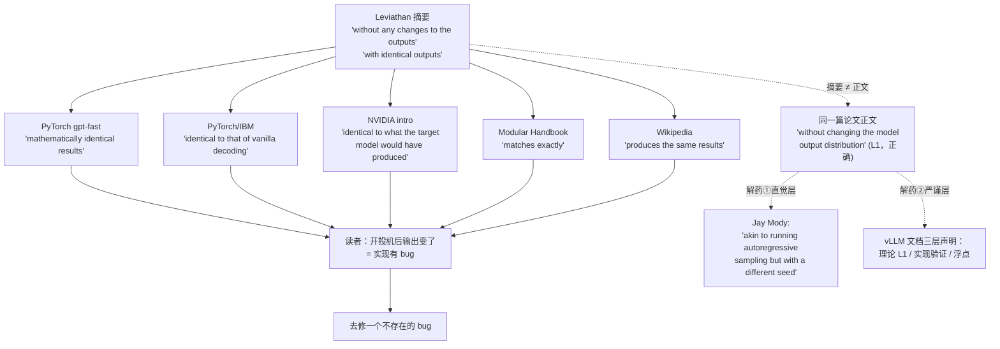
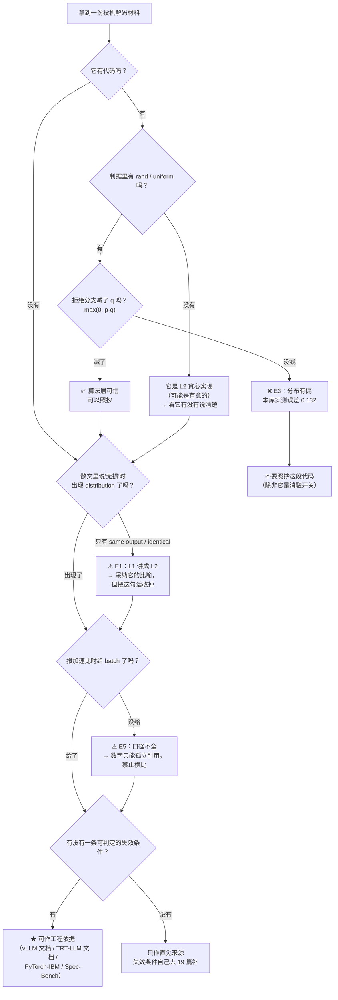

# 26 社区精彩解释精选 —— 好在哪与错在哪

## 1. 一句话

投机采样是少数几个**社区讲得比论文好**的主题：Verity/Drake 的比喻、"换了个随机种子"的类比、√7 的例子，都是原论文里没有的、真正降低理解成本的东西——**这些必须大方地采纳**。但同一批材料在**"到底保证了什么"**和**"什么时候不划算"**上系统性翻车，而且**翻车的重灾区是英文权威源**（NVIDIA 官方博客、PyTorch 官方博客、Wikipedia），不是野生博客。

本篇盘点 **35 份材料**，每份回答两问：**它好在哪（具体到哪个比喻/哪张图/哪段代码解决了什么理解障碍）**、**它有没有讲错（点名到句，引原文）**；再把有真实标本的高频错误做成一个**名人堂**，每条配出处 URL 与本库的判定测试。

---

## 2. 从哪来：一份被引用几万次的官方博客，比喻满分、散文错、代码对

先看一份材料，它一篇就说明了本篇为什么必须存在。

**PyTorch 官方博客《Accelerating Generative AI with PyTorch II: GPT, Fast》**（https://pytorch.org/blog/accelerating-generative-ai-2/ ，Team PyTorch，页面 last updated 2024-11-14）。

**它的比喻是全网最好的，没有之一**（原文）：

> "Imagine you had a senior engineer (called Verity), who makes the right technical decisions but is rather slow at writing code. However, you also have a junior engineer (called Drake), who doesn't always make the right technical decisions but can write code much faster (and cheaper!) than Verity."
> "Upon reviewing the code, Verity might decide that the first 3 technical decisions Drake made are correct, but the last 2 need to be redone. So, Drake goes back, throws away his last 2 decisions, and restarts coding from there."

**好在哪（具体）**：常见的"小模型猜、大模型验"只解决一个理解障碍，Verity/Drake 一次解决三个——
(i) **为什么验证比生成便宜**：review 比重写快；
(ii) **为什么被拒之后后面的全废、而不是只废那一个**：Drake 从第 4 个决策起全部重来，因为技术决策是链式依赖的（这正是"首次拒绝即截断"，见 [[04-拒绝采样修正-无损性的完整证明]] §3.2）；
(iii) **为什么最终质量不降**：Verity 亲自把关。
本库 [[02-最小可跑的投机采样-手算一遍]] 直接采纳这个比喻。

**它的散文错了两处**（原文）：

> "one crucial property of speculative decoding is that **it does not change the quality of the output**"
> "speculative decoding guarantees that we have **mathematically identical results** compared to regular generation"
> "we would generate 8 tokens using the draft model, and then process all eight tokens in parallel using the verifier model, **throwing out the ones that don't match**"

前两句把 **L1 分布无损**说成了 **L2 逐 token 相同**；第三句的 "don't match" 是**贪心比对**的语言，不是 $\min(1,p/q)$ 的语言——判据里的随机数消失了。

**而它自己的代码完全正确**（https://raw.githubusercontent.com/pytorch-labs/gpt-fast/main/generate.py ，记号为 DeepMind 系，`p`=草稿、`q`=目标）：

```python
accept_draft_prob = torch.minimum(torch.ones(()), q[:speculate_k] / p)
rejected_locations = (torch.rand_like(accept_draft_prob) > accept_draft_prob).nonzero()
...
new = q - p
new = torch.where(new > 0, new, 0.0)
new = new / new.sum()
next_token = multinomial_sample_one_no_sync(new)
```

随机数有、$\min(1,\cdot)$ 有、残差分布 $\mathrm{norm}(\max(0,p-q))$ 有。**全对。**

> **一份材料的比喻、散文、代码可以分处三个不同的正确性等级。只读散文的人，会同时学会两个错误；只读代码的人，什么都学对了但不知道为什么。**

这就是本篇的方法论起点：**社区材料要分层读**。

---

## 3. 机制拆解：评点的三层读法与八条高频错误

### 3.1 三层读法

| 层 | 读什么 | 典型病 | 可靠度 |
|---|---|---|---|
| **比喻层** | 类比、图、走查动画 | 类比过度外推（分支预测类比推不出"分布无损"） | 高——本次盘点里比喻几乎没有错的 |
| **散文层** | "它保证了什么""它快多少" | **口径丢失**：L1 写成 L2、加速比裸奔、把 tok/s 叫吞吐 | **最低**——本篇的靶子几乎全在这一层 |
| **代码层** | 接受判据、残差分布、指标分母 | 几乎不出错 | 最高 |

**一条经验判据**：**同一份材料，代码比散文可信；散文比标题可信。** 本次盘点里出现了三次"标题与正文自相矛盾"（NVIDIA 3.6x 博客、tbr8.org 中文长文、AMD "Deep Dive"），零次"代码与散文都错"。

### 3.2 八条高频错误（本库编号 E1–E8）

| 编号 | 错误 | 一句话判据 |
|---|---|---|
| **E1** | 把"无损"讲成"输出和不开投机完全一样" | 它说的是 same output 还是 same output **distribution**？有没有标 $T=0$？ |
| **E2** | 接受判据写成 $p(x)>q(x)$ 就接受 | 判据里有没有**随机数**？没有就是贪心口径 |
| **E3** | 拒绝后直接从 $p$ 重采 | 重采的分布**减没减 $q$**？ |
| **E4** | "草稿模型越小越好" | 它有没有**同时**给 $\alpha$ 和 $c$（草稿单步耗时比）？ |
| **E5** | "投机解码提升吞吐" | 报的是**单请求 tok/s** 还是**系统吞吐**？有没有并发扫描？ |
| **E6** | 把 Medusa 的 typical acceptance 也说成无损（它是 **L3 近似**） | 讲放宽判据时，有没有一句"这会改变分布"？ |
| **E7** | MTP 的训练目标与推理草稿混为一谈 | 有没有区分"训练时预测 $n$ 个"与"推理时要出 $\gamma$ 个"？ |
| **E8** | 用 $E[\tau]=(1-\alpha^{\gamma+1})/(1-\alpha)$ 不提独立性 | 有没有提 i.i.d.？ |

**本次盘点的统计结论（只统计"明确涉及且判定得了"的材料）**：

- **E1 踩坑 8 份、主动纠正 8 份**。踩坑方包含 NVIDIA 官方、PyTorch 官方、Wikipedia、Modular Handbook——**这是权威来源污染率最高的一条**。
- **E2 踩坑 2 份**（都在散文里，对应的代码都是对的）。
- **E3 正文标本 0 份**。所有被逐行核对的实现全部正确——包括三份中文材料。
- **E5 教学向材料集体缺席、引擎向材料集体在场**。
- **E8 的断点极其干净**：Leviathan 原文明写了 i.i.d. 前提，中文长文照抄公式时把这句丢了。

---

## 4. 逐组盘点：六组，每组挑最好的几份

> 说明：下面每份材料的原文引用，均为本次（2026-08-22）实际打开页面后逐字抽取。**凡本次打不开的来源，在 §4.7 单列，不做内容评点。**

### 4.1 入门讲解

#### ★ Google Research《Looking back at speculative decoding》

- https://research.google/blog/looking-back-at-speculative-decoding/ ；Yaniv Leviathan、Matan Kalman、Yossi Matias；**2024-12-06**
- **好在哪**：① **√7 的例子**——同一段生成里"抄一个 7"和"算出 2.646"的难度天差地别，这是"有些 token 是白送的"这个直觉的最短路径，[[01-decode为什么慢-带宽墙与算力空转]] 直接采纳；② **CPU 分支预测类比的权威出处**（"a well-known example of speculative execution is branch prediction in modern pipelined CPUs"）——引类比就该引这里，不要引二手；③ **两段式结构**：先讲确定性投机执行（$f,f^*,g$），再讲"LLM 产出的是分布不是一个 token"，最后引出投机采样。
- **哪里要小心**：文中有一句 "We are guaranteed identical outputs either way."，**它出现在讲确定性投机执行那一段，不是在讲 LLM 采样**；到 LLM 采样那段，用词变成精确的 "the generated samples come from **exactly the same probability distribution** as those produced by naïve decoding"（**L1**）。原文是对的，**但这句话被大量二次引用时脱离了上下文**。加速比 "~2x–3x" 与 "11B T5-XXL + 60M T5-small ~3x" **未给 batch、未给 $\gamma$、未给硬件，口径不全，不可横比**（铁律二）。

#### ☆ NVIDIA《An Introduction to Speculative Decoding》

- https://developer.nvidia.com/blog/an-introduction-to-speculative-decoding-for-reducing-latency-in-ai-inference/ ；Jamie Li、Chenhan Yu、Hao Guo；**2025-09-17**
- **好在哪**：比喻短且好记——"Think of the target as the **meticulous scientist** ensuring correctness, while the draft is the **quick assistant** proposing possibilities that the scientist then verifies."（可采纳为一句话导入）；Figure 1 的走查**把"拒绝之后目标模型还会白送一个 token"画了出来**，这一点很多图解会漏。
- **哪里讲错了**：这是本次核到**错误最集中**的权威来源，见 §5 名人堂 E1/E2/E5 三条标本。采纳它的比喻时**必须紧跟一句纠正**。

#### ☆ Wikipedia《Speculative decoding》

- https://en.wikipedia.org/wiki/Speculative_decoding ；无署名；修订日期本次未取到，标「未查证」
- **好在哪**：**史线干净且日期对**（2018 Stern/Shazeer/Uszkoreit blockwise → 2022-11 Leviathan → 2023-02 Chen → 2023-07 ICML oral），可作时间线交叉校验；用了 "resampled from a **corrected distribution**" 这个词，方向是对的。
- **哪里讲错了**：同一个词条里 "same results" 与 "same distribution" 混用（名人堂 E1 标本）；**只字未提 corrected distribution 具体是什么**——本次通读确认全文没有 $\mathrm{norm}(\max(0,p-q))$ 或任何等价描述，对一个技术词条来说这是把算法的灵魂省掉了。

#### ☆ HF《Assisted Generation》

- https://huggingface.co/blog/assisted-generation ；**Joao Gante**；**2023-05-11**
- **好在哪**：**它是最早把口径写在正文里的一份**——"At the time of the release of this blog post, assisted generation is **limited to a batch size of `1`**." 这一句让读者无法误以为它在讲吞吐。它还给了一句难得的诚实话："it is not a silver bullet – you should benchmark it before applying it to your use case."
- **哪里要小心**：**这句 bs=1 的限定在二手转述里几乎总是被丢掉**（名人堂 E5 的传播机制）。另外本次核验 https://huggingface.co/docs/transformers/en/generation_strategies （v5.15.1）**已无 assisted/speculative decoding 小节**，是否迁往 `custom_generate` 社区方法**本次未核到迁移公告，标「待确认」**——但结论是确定的：**再指向 generation_strategies 页面讲 assisted decoding 已经指不到内容**，[[30-附录-优秀文章与资料清单]] 应改指博客原文。

#### ☆ LLM Inference Handbook（原 BentoML，现挂 Modular）

- https://handbook.modular.com/inference-optimization/speculative-decoding ；页面无日期，标「未查证」
- **好在哪**：**给了一条并发拐点的实测描述**——"With TP = 1, the total throughput **plateaued earlier (around 20–30 concurrent requests)** compared to the baseline."（20–30 并发提前饱和，是个可判定的数字，[[18-batch与吞吐-收益衰减曲线]] 可用）；方法覆盖齐，适合当索引。
- **哪里讲错了**：E1 的措辞是本次见过最强的一种（名人堂标本）；**整篇没有一个公式**，没有 $\min(1,p/q)$、没有残差分布——对一本自称 handbook 的材料是硬伤；把 Medusa 2.2–3.6× 与 EAGLE 3.0–6.5× 并排放，**两组都是各自论文里的最大值、口径互不相同**，属于铁律二明令禁止的横比。

### 4.2 数学推导

#### ★★ Leviathan et al.《Fast Inference from Transformers via Speculative Decoding》

- https://arxiv.org/abs/2211.17192 ；Yaniv Leviathan、Matan Kalman、Yossi Matias（equal contribution）；v1 **2022-11-30**，ICML 2023 oral
- **好在哪**：① **§2.3 从"什么时候拒绝"讲起**——"if $q(x)>p(x)$ we reject the sample with probability $1-\frac{p(x)}{q(x)}$ and sample $x$ again from an adjusted distribution $p'(x)=norm(max(0,p(x)-q(x)))$ instead."**这个叙述顺序比直接甩 $\min(1,p/q)$ 更能让人看出"$\min$ 在防什么"**（[[04-拒绝采样修正-无损性的完整证明]] 采纳）；② **把"两个模型有多像"变成了可计算量**：Definition 3.1 的 $\beta$、Corollary 3.6 的 $\alpha=1-E(D_{LK}(p,q))=E(\min(p,q))$；③ **把"能不能赚"写成可判定不等式**：Corollary 3.9 "If $\alpha>c$, there exists $\gamma$ for which we'll get an improvement"；④ **$E[\tau]$ 的独立性前提原文是写明的**："If we make the simplifying assumption that the $\beta$s are i.i.d., ... a **capped geometric variable**, with success probability $1-\alpha$ and cap $\gamma+1$"。
- **最该看的一张表**（§4.1 实验，CNNDM）：

  | 草稿 | $\gamma$ | $\alpha$ | 加速比 |
  |---|---|---|---|
  | T5-small | 5 | 0.53 | **2.3X** |
  | T5-base | 3 | 0.55 | **2.2X** |
  | T5-large | 3 | 0.56 | **1.7X** |

  **$\alpha$ 单调上升，加速比单调下降。** 一张表同时干掉两个直觉——"草稿越小越好"和"$\alpha$ 越高越快"。（口径：T5X 实现、TPU-v4、bs 未在该表标注，**不可与本篇其它来源横比**。）
- **哪里不严谨**：**摘要与正文口径不一致，而摘要那句是全社区误解的源头**——摘要写 "without any changes to the outputs"、"with **identical outputs**"，正文写 "without changing the model output **distribution**"。差一个词，差的是 **L2 与 L1**。另外它**没有对 i.i.d. 假设做任何实证检验**（[[06-期望接受长度与加速比模型-完整推导]] 接着往下做），且 Theorem 3.8 的 walltime 模型**没有 batch 维度**，搬去解释 bs=64 的生产系统是越界使用。

#### ★★ Chen et al.《Accelerating LLM Decoding with Speculative Sampling》

- https://arxiv.org/abs/2302.01318 ；Charlie Chen、Sebastian Borgeaud、Geoffrey Irving、Jean-Baptiste Lespiau、Laurent Sifre、John Jumper（DeepMind）；v1 **2023-02-02**
- **好在哪**：① **"within hardware numerics" 这个限定词是它发明的**——摘要（本次逐字核对）："a novel modified rejection sampling scheme which **preserves the distribution of the target model within hardware numerics**"。**这是全社区唯一一个把浮点误差写进无损声明的原始出处**，本库 **L1** 的定义继承它；② 明确写出了两条边界："At least one token will always be generated"、"This gives us a maximum of $K+1$ tokens per loop"（**bonus token 的原始出处**）；③ 把独立发现讲得干净："The work in this manuscript was undertaken concurrently and independently of the work on speculative decoding from Leviathan et al. 2022."（[[09-2023奠基-两篇同期论文的异同]] 的定调句）。
- **哪里不严谨**：**记号与 Leviathan 相反**（$p$=草稿、$q$=目标），且**全文没有一句提醒读者这个差异**——这是社区"判据写反了"观感的直接源头。加速比 "2-2.5x decoding speedup in a distributed setup"：**多少芯片、什么 batch、$K$ 取几，摘要都没写，口径不全**。
- 名人堂命中：**一条都没踩**。

#### ★★ Jay Mody《Speculative Sampling》

- https://jaykmody.com/blog/speculative-sampling/ ；**2023-02-08**
- **好在哪**：**这是本次核到把 E1 讲得最透的一份材料，一句话解决问题**（原文逐字）：
  > "Speculative sampling giving a different result than autoregressive sampling is akin to running autoregressive sampling but **with a different seed**."
  > "When `temperature = 0` however, a 100% of the probability is assigned to a single token, so sampling from the distribution becomes deterministic, hence why the outputs are the same."

  **好在哪（具体）**：把"分布相同但结果不同"翻译成了程序员每天都懂的东西——**换个随机种子**。读者不需要懂拒绝采样，就立刻明白"输出不一样"根本不是 bug；而且它**自己补上了 $T=0$ 的例外**，等于把 L1 与 L2 的分界画完整了。[[07-无损的三种口径-分布无损不等于结果相同]] 把这句当题眼采纳。
  它的代码也极简：`if np.random.random() < min(1, q[i][j] / p[i][j])` 加 `sample(max_fn(q[i] - p[i]))`，两行交代整个算法的灵魂；并给了 `autoregressive_sampling()` 与 `speculative_sampling()` 的并排实现供对拍。
- **哪里不足**：**无损性它没自己证，是甩链接给论文的**（"The proof for this is shown in the paper (Theorem 1)"）——[[04-拒绝采样修正-无损性的完整证明]] 补的正是这块；**记号是 DeepMind 系但正文没醒目提醒**，刚读完 Leviathan 的人会以为分子分母写反了；没有 batch、没有 $\gamma$ 怎么选、没有 $E[\tau]$——它讲清了一个算法，没讲清一笔账。

#### ★ Vivien Tran-Thien《An Optimal Lossy Variant of Speculative Decoding》

- https://huggingface.co/blog/vivien/optimal-lossy-variant-of-speculative-decoding ；**2024-06-12**
- **好在哪**：**本次核到唯一一份把"有损投机采样"当成最优化问题正面求解的材料**，而不是随手放宽阈值。在 KL 预算 $D(q\|\pi)\le D$ 下最大化接受概率，解出（DeepMind 记号，$p$=草稿、$q$=目标）：
  $$r_i=\min\Big(1,\ \frac{q_i}{\alpha p_i}\Big),\qquad s_i=\frac{1}{1-\sum_j p_jr_j}\max\Big(0,\ \frac{q_i}{\beta}-p_i\Big)$$
  **令 $\alpha=\beta=1$ 就退回标准投机采样。**
  **好在哪（具体）**：它把"无损"从一个二元属性变成了**一条连续曲线上的端点**。读者第一次能看清：Medusa 的 typical acceptance、各种阈值放宽，本质都是在这条曲线上往右挪 **L1→L3**，只是它们没算过自己挪了多远。数学是真做完了的（KKT、唯一解、二分搜索的单调性保证、GitHub 上的形式化证明、WMT15 上的实验）。
- **哪里要小心**：**约束是 KL 而不是 TV**，而投机采样自然的度量是总变差（$\alpha=1-\mathrm{TV}$，见 [[05-接受率alpha-定义口径与怎么测]] §3.3），两者不能直接换算；**它给了旋钮没给刻度**（没回答 $D$ 该取多少）。影响力有限（HF community blog 位），**这恰恰是该采纳它的理由——它是被埋没的好材料**。

### 4.3 图解与可视化

| 材料 | 那张图好在哪（具体） | 要补的 |
|---|---|---|
| **gpt-fast 的 Verity/Drake 三连图**（`image21/6/15.png`，https://pytorch.org/blog/accelerating-generative-ai-2/ ） | 见 §2。**唯一一个把"链式依赖导致后续全废"画出来的图** | 紧跟纠正其散文的 E1/E2 |
| **vLLM 2.8x 博客 Figure 8**（https://vllm.ai/blog/2024-10-17-spec-decode ） | 草稿给 `["I","like","cooking","and","traveling"]`，第三个被拒并改成 "playing"——**把"拒绝点之后全部作废 + 重采一个"画在一条真实句子上** | 该博客整篇无接受判据数学 |
| **NVIDIA intro 的 Figure 1** | 草稿给 "Brown/Fox/Hopped/Over"，目标接受前两个、拒绝其余、**然后自己再产一个**——把 bonus/recovered token 画了出来 | 见名人堂三条 |
| **Together.ai Medusa 的树图**（https://www.together.ai/blog/medusa ） | 各头 top-k 的**笛卡尔积**构成候选，mask 限制每个 token 只看祖先，"enabling parallel processing of multiple candidates **without increasing batch size**"——**最后半句是要害：树是用 mask 换 batch**（[[16-树形草稿与树注意力-mask构造与验证]] 采纳） | — |
| **Charles Frye 的一句话**（https://charlesfrye.github.io/programming/2023/11/10/llms-systems.html ，2023-11-10） | 不是图，但比图管用："computing the logprobs for a prompt + K tokens can be done in parallel. That makes it much cheaper than sampling K tokens to follow a prompt, which must be done serially."——**它切的是"评分 vs 采样"，不是笼统的"带宽 bound"** | 它**没量化**："几乎免费"在 $K$ 多大时失效，是 [[03-并行验证为什么几乎免费-算术强度与roofline]] 的增量 |

**本次的一条负面发现**：**交互式/可视化讲解一份都没找到**。投机解码的树注意力 mask 极适合做可视化，社区若真的空白，本库 `_lab/tree.py` 输出的 mask 图就是可以补上的东西。

### 4.4 源码级剖析

#### ★★ vLLM `vllm/v1/sample/rejection_sampler.py`

- https://raw.githubusercontent.com/vllm-project/vllm/main/vllm/v1/sample/rejection_sampler.py
- **好在哪**：① docstring 直接把论文钉死："The implementation **strictly follows** the algorithm described in https://arxiv.org/abs/2211.17192."；② 判据写成 `accepted = draft_prob > 0 and target_prob / draft_prob >= uniform_prob`——**没有显式 `min(1,·)`，因为比值 ≥1 时不等式自动成立**，这是"数学写法 vs 工程写法"最好的对照点；③ **残差用 Gumbel-max 而不是显式归一化**（`prob = tl.maximum(target_prob - draft_prob, 0.0)` 后取带扰动的 argmax）——**同时省掉了归一化和逐位置的多项式采样**，是"教学实现 vs 生产实现"的真实差距；④ **术语三分法**：**accepted / recovered / bonus** tokens。本库全库统一采用这套词，"bonus token"比中文常见的"额外 token"精确得多。
- **哪里要小心**：Gumbel-max 与显式归一化**在浮点上并不严格等价**（`prob` 极小时尤甚），这与官方文档那句 "up to the precision limits of hardware numerics" 是同一件事的两面，**源码里没有对此的注释**。

#### ★★ vLLM `vllm/config/speculative.py`

- https://raw.githubusercontent.com/vllm-project/vllm/main/vllm/config/speculative.py
- **好在哪**（这份文件里藏着四条社区材料里几乎找不到的硬事实）：
  1. **草稿采样默认是贪心，草稿概率被当成 one-hot**：`draft_sample_method: DraftSampleMethod = "greedy"`，注释明写 "the draft probabilities are treated as one-hot during rejection sampling"。这仍然是 **L1 无损**（标准算法的合法特例），但**接受率的数学完全换了**（$\beta=p(x^*)$，见 [[05-接受率alpha-定义口径与怎么测]] §7.3）。**社区讲解从来不提"生产系统默认根本不用草稿的完整分布"。**
  2. **$\alpha$ 的工程口径被显式定义为边际概率**："Position i's entry is the **marginal probability that the first i+1 draft tokens are all accepted**"——不是"给定前面都接受了、第 $i$ 个被接受的条件概率"。**两者只有在 i.i.d. 下才互相换算。**
  3. **平均接受长度 → 每位置接受率的换算，用的是"最小方差调度" `[1,1,…,frac,0,…]`，不是 $\alpha^i$ 的几何衰减**。**一个生产系统在同一个平均接受长度下选了完全不同的分布形状，这本身就是 E8 最硬的反证。**
  4. **MTP 复用有明确告警**：`"Enabling num_speculative_tokens > 1 will run multiple times of forward on same MTP layer, which may result in lower acceptance rate"`——这是 E7 在生产系统里的具体表现（[[14-MTP-从训练目标到推理草稿]]）。
- **哪里要小心**："minimum-variance schedule" 这句**没有给推导或引用**，要用就得自己验证。另：本次 grep `disable_by_batch_size` **在 main 分支无任何命中**，V0 时代那个开关已不存在——**仍在教这个参数的材料已过期**（§4.6 中文条目里有标本）。

#### ★ Aleksa Gordić《Inside vLLM》

- https://www.aleksagordic.com/blog/vllm ；**2025-08-29**（vLLM 官方转载 2025-09-05）
- **好在哪**：**接受判据的散文写得比大多数材料的公式还准**——"If the large model's probability for the draft token ≥ the draft's probability, accept it. Otherwise, accept it with probability `p_large(token)/p_draft(token)`"，以及 "If there was a rejection create a new rebalanced distribution at that position (`p_large - p_draft`, clamp min at 0, normalize to sum to 1)"。**它把判据拆成两种情形讲，而不是直接甩一个 $\min$**——对第一次学的人，两情形写法更容易看出 $\min$ 在防什么。它还把投机解码放在整个引擎的语境里（scheduler、KV cache、chunked prefill 之后才讲），读者能看清它在系统里的位置。
- **哪里讲错了**：① **"in expectation" 用错了层次**——"the accept/reject rule guarantees that **in expectation** the sequence is distributed exactly as if we had sampled token by token from the large model."**L1 是逐点的分布相等，不是"在期望意义下成立"**；"in expectation … distributed exactly" 这个搭配自相矛盾，而且恰好会诱导读者以为无损是统计平均意义上的近似。② **一条结论已过期**："vLLM V1 does **not** support the LLM draft model method"——对照 2026-08 的官方文档（"not supported in `vllm<=0.10.0`"，即 0.10.0 之后已支持），`draft_model` 已是一等方法，而 `medusa` 反而退出了文档的方法清单。**引用这篇必须标注"结论截至 2025-08"。**

#### 三个可跑实现（本次逐行核对了判据与残差）

| 仓库 | 好在哪 | 要小心 |
|---|---|---|
| **feifeibear/LLMSpeculativeSampling**（star 923，last update 2023-09-21） | **唯一把两篇论文的算法差异做成两份代码并排放的仓库**，README 明写 "I implement **two slightly different versions** … Google's and Deepmind's"。读者可以直接 diff，亲眼看到差异在 KV cache 回滚与末位处理上（[[09-2023奠基-两篇同期论文的异同]] 推荐读者去 diff） | README 的 benchmark **无硬件、无 $\gamma$、无 batch**，按面值只有 1.29×。**只用于读代码，绝不引用其数字** |
| **romsto/Speculative-Decoding**（star 115） | README 措辞精确（"**without changing the output distribution**"，**L1**）；经典自回归 / beam search / 投机 / NASD 四种解码**在一个仓库里对拍** | **⚠ 它提供了一个可以关掉残差修正的开关**：`if not skip_sample_adjustment: p_p = max_fn(p-q) else: p_p = p[..., n, :]`。**`skip_sample_adjustment=True` 就是 E3 的可执行版本，而 README 对此没有任何警告。** 作为消融开关它极有价值（本库 `_lab/test_lossless.py::test_naive_resample_is_biased` 做的是同一件事），作为默认可用 API 它是陷阱 |
| **shreyansh26/Speculative-Sampling**（star 112） | **唯一把 $T=0$ 与 $T=0.5$ 分开报的仓库**：OPT-13b/1.3b 1.78× vs 1.75×；OPT-6.7b/1.3b 1.46× vs **1.51×**。**"采样一定降低接受率"这句常识在这组数字上不成立**，甚至 6.7b 上 $T=0.5$ 更快 | **无硬件、无 $K$、无 batch，且只有 2 组配置**——统计上不足以下结论。本库对这条做了独立复核，见 §6 |

### 4.5 工程实践

#### ★★ PyTorch/IBM《A Hitchhiker's Guide to Speculative Decoding》

- https://pytorch.org/blog/hitchhikers-guide-speculative-decoding/ ；IBM Research + Team PyTorch；last updated **2024-11-13**
- **好在哪**（本次"上生产"这一档最好的一份）：
  1. **给了一条本库最想要的、可判定的失效条件**（原文）："We begin to observe **throughput reduction beyond a batch size of 64**, which happens rarely in practice."**可判定、有数、有前提**——铁律三要的就是这种句子。
  2. **把"多几个头"讲成一笔账**："If the speculator is not accurate with more heads, it will result in **wasted compute increasing the latency and reducing the throughput**."，并给经验值："we find **3-4 heads works well** in practice, whereas we found that **code models can reap benefits from 6-8 heads**"。**它把 $\gamma$ 的选取和任务类型绑定**（代码可预测性高 → 能吃更长草稿），而不是给一个万能数字（[[17-动态草稿长度与自适应停止]] 从这条出发）。
  3. **是真的生产数据**："We have deployed these speculators in an internal production-grade environment with **thousands of daily users**"，2x（Llama3 8B / Llama2 13B / Granite 7B）、3x（Granite 20B code）。
  4. **指标选得对**：报 **TTFT 与 ITL 随并发用户数变化**的两张图，而不是笼统的 tokens/s——这是铁律二第 6 项的正面范例。
  5. **训练配方可抄**：阶段一小 batch 长序列（4k）走标准 causal LM，阶段二大 batch 短序列（256）用基座生成的数据把头对齐到基座输出，**5:2 的步数配比**（[[21-草稿模型怎么训-对齐与在线蒸馏]] 采纳）。
- **哪里讲错了**：**开篇第一段就踩 E1**（名人堂标本，见 §5）。另有一处内部张力值得记下：正文前半写 "This ensures that **throughput does not reduce at larger batch sizes**"，后半又写 "**throughput reduction beyond a batch size of 64**"——前者说的是 KV cache 维护不再是瓶颈，后者说的是整体收益，**同一篇里两句话读起来打架**。而 "which happens rarely in practice" 这条 2024 年 IBM 内部负载下的判断，**在 2026 年的高并发服务里已不成立**，引用要加时效标注。

#### ★★ vLLM 2.8x 博客 + Issue #10318：一条完整的"数字不可复现"链路

- 博客 https://vllm.ai/blog/2024-10-17-spec-decode ；**2024-10-17**
- **好在哪**：**少数把"反向数字"和"正向数字"并排放出来的官方材料**——正向：Llama3-70B + Qwama-0.5B、ShareGPT、4×H100、**QPS=1 → 1.5x**；n-gram、CNN/DailyMail、4×H100、**QPS=1 → 2.8x**。反向：同配置在**高 QPS 下 ShareGPT 慢 1.4x、CNN/DailyMail 慢 1.8x**。而且**解释是对的**："in **high-QPS environments** … The extra compute required to propose and verify tokens can sometimes slow down the system **when it is already compute-bound**."
- **哪里讲错了**：**"lossless" 无口径**（原文 "accelerates generation without sacrificing accuracy, making it a **lossless** yet highly efficient method"，没标 L1 还是 L2）；**全篇没有接受判据的数学**。
- **配套的元材料**：https://github.com/vllm-project/vllm/issues/10318 （`yeonjoon-jung01`，2024-11）——有人拿博客配置去复现，口径给全了（vLLM 0.6.3、**4×H100 PCIe**、Llama-3-70B-Instruct TP=4、Qwama-0.5B TP=1、ShareGPT、1 QPS、4 个投机 token），**最高只到 1.4x**，bs=256 时端到端延迟 "exceeded 20 seconds"。**issue 被打 stale，90 天后以 "not planned" 关闭，团队未回应复现差距。**
  **必须公允地说**：博客的 4×H100 **未注明 SXM 还是 PCIe**，报告者用的是 PCIe（带宽显著更低）。**所以这是"口径不全导致无法复现"，不能判定博客造假。** 但这条链路本身——**官方给 2.8×、独立复现只到 1.4×、差异源于一个没写出来的口径项、issue 以 stale 收场**——比任何"数字要标口径"的说教都有说服力（[[19-负收益全解-什么时候投机反而更慢]] 引用）。

#### ★★ Red Hat《gpt-oss 上的投机解码》：对本库立场冲击最大的一份

- https://developers.redhat.com/articles/2026/04/16/performance-improvements-speculative-decoding-vllm-gpt-oss ；Harshith Umesh；**2026-04-16**
- **好在哪**：**它给出了"高并发下投机依然赚"的反例，而且口径极全**——目标 `openai/gpt-oss-120b`（**MoE，MXFP4**）、草稿 `nvidia/gpt-oss-120b-Eagle3-v2`、**H200-PCIe-141GB**、TP=1/2、并发 **1/5/25/50/100/200**、ShareGPT+MLPerf+SWE-bench、GuideLLM v0.5.3、vLLM v0.13.0；ShareGPT 输出吞吐峰值 **2574 vs 基线 2024 tok/s（+27.2%）**，几何平均 **+20.7%**，**"consistent throughput and latency improvements that persist with up to 200 concurrent requests"**。它还给了 $\gamma$ 的甜点区与边际成本："**2 or 3 draft tokens is the sweet spot**"、"going from 3 to 4 draft tokens causes a modest **8% output throughput drop**"。
- **它为什么重要**：**本库"投机是笔经常亏的交易"这条立场必须加限定**——当目标是 MoE（激活参数远小于总参数、算力空转更严重）且草稿是高接受率 EAGLE3 时，2026 年的证据表明高并发下依然赚。"大 batch 一定亏"要改写成一条**依赖（激活/总参数比、量化精度、草稿接受率）的判据**。
- **哪里讲错了**：**踩 E1**（"no change to the model's output quality"、"no change to model weights or output quality"，**未标口径**——EAGLE3 在 $T>0$ 下的分布保证与 $T=0$ 的逐 token 一致是两回事）；**它是厂商博客，且 MoE + MXFP4 是一个对投机极其有利的组合**，不能推广到稠密 fp16 模型。

#### ★ Snowflake Arctic Inference：本次最锋利的一句引文

- https://www.snowflake.com/en/engineering-blog/fast-speculative-decoding-vllm-arctic/ ；Ye Wang、Gabriele Oliaro、Jaeseong Lee、Yuxiong He、Aurick Qiao、Samyam Rajbhandari；**2025-05-01**
- **好在哪**：**它把 L1 与 L2 的取舍变成了一次真实的工程决策，并写进了博客**（原文）：
  > "**Switched from rejection sampling to greedy verification** (accept tokens only if they match greedy decoding), ensuring outputs are identical to the base model without lowering acceptance rate."

  **好在哪（具体）**：社区讲 L1 与 L2 永远停在"理论上不一样"。这句话展示了**一个生产团队为什么会主动放弃 L1**：他们要的是"和不开投机时逐 token 一样"的**可复现性**（agent / 代码场景尤其需要），而 L1 给不了这个。**L2 不是退化，是另一种被主动选择的需求**（[[07-无损的三种口径-分布无损不等于结果相同]] 采纳）。
  另外两条硬数字：suffix decoding "on the order of **20 microseconds per token**"——**草稿可以便宜到不占 GPU**（[[11-无模型草稿-promptlookup与ngram与检索]]）；SWE-Bench 上 CodeAct agent 端到端 "**1.8x-4.5x**"。
- **哪里要小心**：**"without lowering acceptance rate" 这句得谨慎读**——贪心验证在数学上**不可能**比拒绝采样有更高的接受概率（$\sum\min(p,q)\ge$ argmax 匹配概率）。他们大概是指在自家草稿上实测差异可忽略，**但博客把它写成了一般性断言**。SWE-Bench 那条 1.8x–4.5x **未标硬件**，口径不全；**全文无并发扫描**。

#### ★ 另外三份可引数字的材料

- **NVIDIA《TensorRT-LLM … 3.6x》**（https://developer.nvidia.com/blog/tensorrt-llm-speculative-decoding-boosts-inference-throughput-by-up-to-3-6x/ ，Carl Putterman 等，**2024-12-02**）：**它无意中给出了"草稿越小越好"最直接的反证**。Llama 3.1 405B 目标、4×H200、FP8、`max_batch_size=32`：无草稿 33.46 tok/s；1B → 111.34（3.33×）；**3B → 120.75（3.61×）**；8B → 101.86（3.04×）。**倒 U 形。** 70B 目标（1×H200）上则是 1B 2.86× > 3B 2.75× > 8B 2.23×——**最优草稿尺寸随目标尺寸变化**，这比倒 U 形本身更有信息量。**但它的标题踩 E5**（见名人堂），且**没给 `max_draft_len`、没有并发扫描、没有失效条件**。
- **AMD ROCm《Speculative Decoding - Deep Dive》**（https://rocm.blogs.amd.com/software-tools-optimization/speculative-decoding---deep-dive/README.html ，Chang Liu，**2025-03-24**）：**厂商博客里口径算齐的**（MI300X、ROCm 6.3.1、vLLM v0.6.7、`--num_speculative_tokens 5`、`max-num-seqs 300`），并**做了 request rate 扫描**：**2.21× @ 0.2 req/s → 2.06× @ 1.4 req/s**；长上下文一条很有价值：70B、输入 32768 / 输出 128、单 MI300X → **2.98×**（[[22-长上下文下的投机采样]] 的切入点）。**但标题叫 Deep Dive 却完全没有算法深度**（无 $\min(1,p/q)$、无残差、无 $E[\tau]$），**只作数字来源、不作原理来源**；且它只说收益随请求率下降，**没解释机制也没给拐点**。
- **LMSYS SpecForge**（https://www.lmsys.org/blog/2025-07-25-spec-forge/ ，**2025-07-25**）：**它把投机解码的真正瓶颈从推理挪到了训练**——"the lack of robust open-source tools for **training draft models** … has significantly hindered its adoption."（[[21-草稿模型怎么训-对齐与在线蒸馏]] 的立论句）；离线训 EAGLE-3 要存 **"~12TB for UltraChat + ShareGPT"** 的 hidden states，这个数字让成本变具体。**但 Llama 4 Scout 2.0× / Maverick 2.18×（MT-Bench）未给硬件、未给 batch、未给接受长度，不可与任何其它来源横比。**

#### ★★ Spec-Bench：铁律二的模范

- https://github.com/hemingkx/Spec-Bench ；榜单 https://raw.githubusercontent.com/hemingkx/Spec-Bench/main/Leaderboard.md ；hemingkx，star 405
- **好在哪**：① **口径写在榜单头上**（本次逐字核对）：RTX 3090 组 "Vicuna-7B-v1.3, greedy decoding, FP16 precision, **batch size = 1**"、"a single NVIDIA GeForce RTX 3090 GPU (24GB) with 12 CPU cores"、"Pytorch 2.5.1, under CUDA 12.1"；A100 组同格式。**"batch size = 1" 明写在榜单上，这一条就把所有引用它的人从铁律二的坑里救出来了。** ② **引入 #MAT（Mean Accepted Tokens）与加速比并列**——**加速比混合了硬件与实现效率，#MAT 只反映草稿质量**，本库 [[05-接受率alpha-定义口径与怎么测]] 采纳"必须同时报两者"这条规范。③ 数据本身可直接引（口径齐）：RTX 3090/Vicuna-7B：SAMD[EAGLE2] **2.38× / 4.61 MAT**、EAGLE2 2.19× / 4.35、EAGLE 2.03× / 3.57；A100/Vicuna-13B：**EAGLE3 3.02× / 5.71 MAT**、SAMD[EAGLE2] 2.77× / 4.52、EAGLE2 2.46× / 4.43。
- **哪里不足**：**榜单本身没有一句"跨论文加速比不可比"的警示**——它靠"自己统一跑"解决可比性，却没把这个道理写出来；**全部是 batch=1 + greedy**，因此**测不出本库最关心的两件事**：大 batch 下的负收益、$T>0$ 下的接受率变化；榜单最后更新 **2025-04-22**，未覆盖 2025 下半年到 2026 的方法。

### 4.6 官方文档与 blog

#### ★★ vLLM 官方文档：本次对"无损"表述最严谨的一份

- https://docs.vllm.ai/en/latest/features/speculative_decoding/ ；核验 2026-08-22
- **好在哪**：**它把无损声明拆成了三层，每层都有限定**（本次逐字核对）：
  > "Speculative decoding sampling is **theoretically lossless up to the precision limits of hardware numerics**."（理论口径 = **L1**）
  > "vLLM's implementation of speculative decoding is **algorithmically validated** to be lossless."（实现口径）
  > "Differences in hardware numerical precision may lead to slight discrepancies in the output distribution."（数值口径）

  **这三句正好对应本库铁律一要的三样东西。** 它还写出了一条几乎没人提的坑：
  > "**Changes in batch size may cause variations in logprobs and output probabilities**, potentially due to non-deterministic behavior in batched operations or numerical instability."

  **实践含义极大：即使算法层面 L1 成立，batch 组成变化会通过浮点归约顺序改变 logprobs，从而改变实际采样结果。"分布无损"在真实系统里还要再打一次折。**
- **哪里不足**："algorithmically validated to be lossless" **没有指向具体的测试文件**，读者无法自查——这恰恰是本库 `_lab/` 存在的理由。

#### ★★ TensorRT-LLM 官方文档：最诚实地承认自己是 L2

- https://nvidia.github.io/TensorRT-LLM/1.2.0rc6/features/speculative-decoding.html
- **好在哪**：① **它直接说了自己只做贪心**（逐字）："A draft token is accepted **if matches the previously decoded token exactly**."、"Currently, **only greedy sampling is supported for speculative decoding**." **这就是 L2，写得明明白白。** 把它与同公司 intro 博客那句"输出与目标模型一致"并排贴出来，是本库最有力的一张对照：**一家公司的博客说的是普遍结论，一家公司的文档说的是"因为我们只支持贪心"。** ② **一条可判定的工程失效条件**："There is currently **no way to dynamically disable speculation**, thus **speed ups are only observable at low batch sizes**."——同时说明了"为什么会亏"和"什么时候亏"（[[19-负收益全解-什么时候投机反而更慢]] 原样引用）。③ one-model vs two-model 的隐性代价："two-model … **do not support overlap scheduler. It will be disabled automatically.**"——**"开了投机就关掉 overlap scheduler"这类代价只有引擎文档会告诉你**（[[20-主流引擎实现-vLLM与SGLang与TensorRTLLM]] 收录）。
- **哪里讲错了**：**MTP 的 `use_relaxed_acceptance_for_thinking` / `relaxed_topk` / `relaxed_delta` 没有任何一句提示它会改变输出分布**。本次逐字核验：文档只说这是给推理模型的 "relaxed decoding"，"a draft token may be accepted if it appears in a candidate set"，**全文未表态是否 lossy**。**放宽接受判据就是 L3**，这是 E6 的同型错误，主角从 Medusa 换成了 MTP（[[14-MTP-从训练目标到推理草稿]] 点名）。

#### ★ SGLang 官方文档

- https://docs.sglang.io/advanced_features/speculative_decoding.html
- **好在哪**：**三个参数的语义被一句话各自钉死**——`--speculative-num-steps`："Depth of autoregressive drafting"（深度）；`--speculative-eagle-topk`："Branching factor per step"（宽度）；`--speculative-num-draft-tokens`："Maximum parallel verification capacity"（总预算）。**社区讲树形草稿常常只说"构造一棵树"，这三个参数把树拆成三维配置空间**（[[16-树形草稿与树注意力-mask构造与验证]] 采纳）。它还写出了隐性代价：`topk>1` 会关掉 overlap scheduler，ngram 会 "disables the overlap scheduler & mixed chunked prefill"——**与 TensorRT-LLM 那条交叉印证**。默认值按模型族分叉（Llama/Grok `steps=5,topk=4,draft-tokens=8`，其余 `steps=3,topk=1,draft-tokens=4`），**这件事本身说明接受率高度依赖模型族**。
- **哪里讲错了**：数字口径不全且用词误导——LLaMA-Instruct 3.1 8B / MT-bench / 1×H100：baseline 158.34 tok/s、EAGLE-2 244.10、EAGLE-3 373.25，**未标 batch**，而把 tok/s 的提升口头描述成 "throughput gains" 会让读者以为是服务吞吐（**按 MT-bench 惯例应为 bs=1；口径不全**）。另外**全篇没有关于 temperature / 是否无损的任何说明**，示例全用 `temperature=0`，读者无从判断 SGLang 的 EAGLE 在 $T>0$ 下是 L1 还是 L2。

#### ★ 两个仓库 README 与一份索引

- **EAGLE**（https://github.com/SafeAILab/EAGLE ，README last update 2025-09-18，star 2.5k）：**三代差异被压缩成三句话，直接可做谱系表**——EAGLE-1 "Extrapolating the **second-top-layer contextual feature vectors**"；EAGLE-2 用 confidence scores 近似接受率、**动态调整草稿树结构**；EAGLE-3 "**Removes the feature prediction constraint** in EAGLE … Replaces top-layer features with **fusion of low-, mid-, and high-level semantic features**"。**"EAGLE-3 把 EAGLE-1 的核心约束删掉了"是 [[13-EAGLE三代-特征级自回归的演进]] "什么被推翻"最干净的一条。** 无损表述用词精确（"provably maintaining the **consistency with vanilla decoding in the distribution** of generated texts"，**L1**）。**但**：README 的 Todo 里仍写着 "Support non-greedy inference (provably maintaining text distribution)"（2026-08 核验）——**仓库自己把"带证明的非贪心推理支持"列为待办**，与正文那句并列出现，**读者无法判断当前实现在 $T>0$ 下到底是 L1 还是 L2**。本库不替它下结论，只点名这条矛盾。加速比 "3x faster than vanilla decoding (13B)"（Vicuna 13B / 2×RTX 3090 / fp16）**未给 batch、未给 temperature、未给树规模**。
- **Medusa**（https://github.com/FasterDecoding/Medusa ，star 2.8k）：Medusa-1 / Medusa-2 的区分写得清楚（冻结基座只训头 vs 全模型训练 + 自蒸馏），报的 2.2–3.6× **明确标了 "single-GPU inference, batch size of 1"**（这一点值得肯定）。**但 README 只写 "a typical acceptance scheme is employed to pick the longest plausible prefix"，一个字都没提这会改变输出分布**——见名人堂 E6。
- **hemingkx/SpeculativeDecodingPapers**（star 1.3k）：**它的分类法本身就是一张谱系图**——`Multi-Token Prediction` / `Speculative Decoding for Diffusion LMs` / `Long-Context` / `Speculative Decoding for Mixture-of-Experts` / **`Analysis`** 等。**`Analysis` 自成一个门类，说明"分析类"已经是一个赛道**。覆盖 500+ 篇。**不足：只列不评，没有"哪些分支已经死了"的标记**——这正是本库的增量。
- **COLING 2025 Tutorial**（https://speculative-decoding.github.io/ ，Heming Xia、Yongqi Li、Wenjie Li、Cunxiao Du、Qian Liu，**2025-01-19**）：**本次找到的唯一一份体系化教学材料**，议程结构（定义 → 史与分类 → 前沿算法 → 下游适配）与本库 A→B→C→D→E 的编排高度一致。**但本次只读到主页，slides 与录像（tinyurl 跳转）未打开，因此不对其内容质量下结论。**

### 4.7 本次打不开的来源（不评点，只记录）

**这一节是本篇诚实性的一部分：下面这些材料本次实际抓取失败，本库没有读过它们的内容，因此不做任何内容评点。**

| 来源 | 状态（2026-08-22 核验） |
|---|---|
| 知乎专栏多篇（`zhuanlan.zhihu.com/p/651359908` 等 7 条） | **HTTP 403**，WebFetch 与 curl 均被拒 |
| CSDN《论文导读 \| 投机解码加速模型推理》 | **HTTP 521** |
| WaytoAGI 飞书《深入LLM投机采样(上)》 | **302 跳登录页** |
| **Andrej Karpathy 的投机执行推文** `x.com/karpathy/status/1697318534555336961` | **HTTP 402**。这条在社区被称为"最清楚的投机解码解释"（Jim Fan 的转发语同样只见于搜索索引）。**本库不逐字引用它**；从各处转述可见其核心是"any tokens that agree with draft predictions"，属**纯贪心框架（L2 口径）**，但**在拿到原文之前不做评点** |
| `openlm.ai/speculative-decoding-in-vllm/` | **HTTP 403** |
| Aphrodite Engine 投机解码文档 | **HTTP 404**，链接已失效 |
| B 站 / 微信公众号 / YouTube 视频讲解 | 本轮 WebSearch 配额用尽，**未能定位到可抓取的 URL，本篇不覆盖视频类来源** |

**另有一条误传必须点名**：中文材料里常把 **Lilian Weng《Large Transformer Model Inference Optimization》** 列为"投机解码必读"。本次逐条抓取该文目录（Methods Overview / Distillation / Quantization / Pruning / Sparsity / Architectural Optimization / Citation / References），**没有任何一节涉及 speculative decoding、speculative sampling 或 parallel decoding**。该文发表 2023-01-10、更新 2023-01-24，早于两篇奠基论文进入主流视野。**把它列为投机解码来源是错误转引，[[30-附录-优秀文章与资料清单]] 不收录它。**（**Sebastian Raschka** 关于投机解码的专文本次未找到，因检索配额受限，**结论标「未查证」，不写入附录**。）

---

## 5. 社区高频错误名人堂

> 规则：只列**有真实标本**的错误，每条给全五样——**错误表述（引原文）/ 出处 URL / 为什么错 / 正确理解 / 本库哪一篇或哪个测试能判定它**。

### E1 把"无损"讲成"输出和不开投机完全一样"（标本最多的一条）

| 标本 | 原文（逐字） | 出处 |
|---|---|---|
| **PyTorch / IBM** | "It incorporates a verification mechanism to ensure the correctness of these speculated tokens, thereby **guaranteeing that the overall output of speculative decoding is identical to that of vanilla decoding**." | https://pytorch.org/blog/hitchhikers-guide-speculative-decoding/ |
| **NVIDIA intro** | "Only when a draft token matches what the target model would have generated, is it accepted … ensuring that the final output is **identical to what the target model would have produced**" | https://developer.nvidia.com/blog/an-introduction-to-speculative-decoding-for-reducing-latency-in-ai-inference/ |
| **Wikipedia** | "The verification preserves the target model's original output distribution, so the technique **produces the same results as standard decoding** while cutting latency by roughly two to three times." | https://en.wikipedia.org/wiki/Speculative_decoding |
| **Modular Handbook** | "This draft-then-verify pattern **guarantees the final output matches exactly what the original target model would have produced on its own**. Therefore, it does not sacrifice output quality." | https://handbook.modular.com/inference-optimization/speculative-decoding |
| **PyTorch gpt-fast** | "speculative decoding guarantees that we have **mathematically identical results** compared to regular generation" | https://pytorch.org/blog/accelerating-generative-ai-2/ |
| **vLLM 博客** | "making it a **lossless** yet highly efficient method"（**未标口径**） | https://vllm.ai/blog/2024-10-17-spec-decode |
| **Red Hat** | "**no change to the model's output quality**"（未标口径） | https://developers.redhat.com/articles/2026/04/16/performance-improvements-speculative-decoding-vllm-gpt-oss |

- **为什么错**：标准投机采样保证的是 **L1 分布无损**——$\Pr[Y=y]=p(y)$ 逐点相等（证明见 [[04-拒绝采样修正-无损性的完整证明]] §4）。**L1 不蕴含 L2**：投机采样改变了随机数的消耗方式（每个位置多消耗一个接受判定的 $R$，拒绝时还要从残差分布再采一次），**即便固定种子，token 序列也必然不同**。
- **正确理解**：$T>0$ 时"输出变了"是 L1 允许的正常现象；**只有 $T=0$（L2）才逐 token 相同**。最好的一句话解药是 Jay Mody 的"**换了个随机种子**"；最严谨的一段是 vLLM 文档的三层声明。
- **一条公允的补充**：**踩坑的材料有一个共同特征——它们自己的实现本来就是贪心验证**（IBM 的 speculator、TensorRT-LLM、Arctic 都是 L2 实现）。**对它们自己而言那句话不错，错在用"投机解码的普遍性质"的口吻说出来。**
- **本库判定**：[[07-无损的三种口径-分布无损不等于结果相同]]；测试 `_lab/test_caliber.py::test_greedy_speculative_equals_greedy`（$T=0$ 下 6 组配置逐 token 相同，argmax 一致率低至 0.500 也成立——**说明 L2 只在 $T=0$ 成立，与草稿好坏无关**）。

**E1 的传播链**（本次核到的部分）：



**这个误解不是社区笨，是原文摘要给了口实。**

### E2 接受判据丢掉随机性（写成确定性匹配）

| 标本 | 原文（逐字） | 出处 |
|---|---|---|
| **PyTorch gpt-fast** | "process all eight tokens in parallel using the verifier model, **throwing out the ones that don't match**" | https://pytorch.org/blog/accelerating-generative-ai-2/ |
| **NVIDIA intro** | "**Only when a draft token matches what the target model would have generated, is it accepted**" | https://developer.nvidia.com/blog/an-introduction-to-speculative-decoding-for-reducing-latency-in-ai-inference/ |

- **为什么错**："don't match" / "matches" 是**贪心逐 token 比对**的语言。真实判据是 $R\sim U(0,1)$，$R<\min(1,\,p(x)/q(x))$ 才接受——$p(x)/q(x)=0.67$ 意味着"有 67% 的概率接受"，**不是"不接受"**。丢掉随机性就丢掉了 L1 的全部机制。NVIDIA 那篇另一处写 "compares the proposed probability … against the actual probability"，**"compares" 是个含糊词，读者会自然理解成 `if p > q`**。
- **正确理解**：判据是随机的；$p\ge q$ 时**无条件**接受，$p<q$ 时**按比值 $p/q$ 的概率**接受。Aleksa Gordić 的两情形式散文是本次见过最好的表述。
- **一条要替 gpt-fast 说的话**：**它的代码完全正确**（§2 已贴）。**散文错、代码对。**
- **本库判定**：[[04-拒绝采样修正-无损性的完整证明]] §3.2；测试 `_lab/test_lossless.py::test_threshold_rule_is_biased`（把判据换成"$p\ge q$ 就接受"，首 token 分布最大逐点误差 **0.2238**——偏了 22 个百分点）。

### E5 把"提升吞吐"当成投机解码的普遍性质

| 标本 | 原文（逐字） | 出处 |
|---|---|---|
| **NVIDIA intro** | "This technique lets the system generate multiple tokens at once, **cutting latency and boosting throughput without any impact on accuracy**."（全文**无任何** batch / 并发讨论） | https://developer.nvidia.com/blog/an-introduction-to-speculative-decoding-for-reducing-latency-in-ai-inference/ |
| **NVIDIA 3.6x 博客** | 标题 "Speculative Decoding Boosts Inference **Throughput** by up to 3.6x"，而报的指标是**单请求 output tokens/second（含 TTFT）**，`max_batch_size=32` 只是上限，**全文无并发扫描** | https://developer.nvidia.com/blog/tensorrt-llm-speculative-decoding-boosts-inference-throughput-by-up-to-3-6x/ |
| **tbr8.org（中文）** | 标题《……将大模型推理**吞吐量**提升 2-3 倍》，而正文给的是"加速比"，且正文自己承认"高并发时投机收益递减" | https://tbr8.org/投机解码深度解析：如何在不牺牲精度的前提下将/ |
| **SGLang 文档** | 把 MT-bench 的 158.34→373.25 tok/s（**未标 batch**）口头描述为 "throughput gains" | https://docs.sglang.io/advanced_features/speculative_decoding.html |

- **为什么错**：投机解码是**用算力换延迟**。在 memory-bound 区（小 batch）验证几乎免费，所以延迟下降而吞吐不亏；一旦进入 compute-bound 区，**每一个被拒的草稿 token 都是白烧的算力**，吞吐会掉。**加速比 ≠ 吞吐量**，单请求 tok/s 也 ≠ 系统吞吐。
- **最刺眼的对照**：**NVIDIA 自家的 intro 博客说"boosting throughput"，NVIDIA 自家的 TensorRT-LLM 文档说 "speed ups are only observable at low batch sizes"。同一家公司，两个相反的口径。**
- **正确理解**：报数字要么给并发扫描，要么明说是 bs=1 的延迟指标（gpt-fast 的 "We will be focusing on latency (i.e. batch size=1)" 是正面范例）。**并且这条本身也有限定**——Red Hat 2026 在 MoE + MXFP4 + EAGLE3 上做到了并发 200 仍有提升，所以正确说法不是"大 batch 一定亏"，而是**"是否亏取决于 (激活/总参数比、量化精度、草稿接受率、上下文长度)"**。
- **本库判定**：[[18-batch与吞吐-收益衰减曲线]]、[[19-负收益全解-什么时候投机反而更慢]]；测试 `_lab/test_speedup.py::test_speedup_collapses_at_large_batch_short_context`（同一个 $E[\tau]=3.0$，8×H100、Llama3-70B + Llama3.2-1B、$\gamma=4$、ctx=1024：**bs=1 → 2.801×（memory bound）；bs=512 → 0.708×（compute bound）**）。

### E6 把放宽后的接受判据也说成无损

| 标本 | 原文（逐字） | 出处 |
|---|---|---|
| **Medusa GitHub README** | "a **typical acceptance scheme** is employed to pick the longest plausible prefix from the candidates"——**全文没有一个字提示这会改变输出分布** | https://github.com/FasterDecoding/Medusa |
| **TensorRT-LLM 文档（同型，主角换成 MTP）** | `use_relaxed_acceptance_for_thinking` / `relaxed_topk` / `relaxed_delta`：只说是给推理模型的 relaxed decoding，"a draft token may be accepted if it appears in a candidate set"，**未标注是否改变分布** | https://nvidia.github.io/TensorRT-LLM/1.2.0rc6/features/speculative-decoding.html |

- **为什么错**：放宽接受判据就是把口径从 **L1** 降到 **L3**。而且这不是"偏一点点"——**判据与补偿必须成对更换**：残差分布 $\mathrm{norm}(\max(0,p-q))$ 是**专为 $\min(1,p/q)$ 配套设计的**，只改判据不改补偿，**"调保守一点"反而更糟**。
- **必须替 Medusa 作者正名**：**Together.ai 的官方博客自己把话说清楚了**（逐字）："**Relaxing the requirement of matching the distribution of the original model** makes the non-greedy generation even faster than greedy decoding." **E6 这个锅不该扣在 Medusa 作者头上，该扣在传播链的断点上**：

```
Medusa 论文 / Together.ai 博客：明写 "Relaxing the requirement of matching the distribution"
        │
        ✂ 断在这里 ✂  ← Medusa GitHub README 只写 "a typical acceptance scheme is employed"
        │
下游二手讲解（含中文长文）：讲了 Medusa，没讲它有损
```

**绝大多数人只读 README。**

- **正确理解**：L3 是**设计选择**，不是 bug——但必须如实标注，并且最好像 Tran-Thien 那样把"挪了多远"量化出来（KL 预算 / TV 距离）。Together.ai 那篇的另一个遗憾是：**说了放宽分布会更快，却没有任何一个指标衡量放宽了多少**（既无 TV，也无下游任务分数对照）。
- **本库判定**：[[12-Medusa-多头草稿与树注意力的诞生]]、[[07-无损的三种口径-分布无损不等于结果相同]] §4.3；测试 `_lab/test_caliber.py::test_typical_acceptance_is_biased`（该**类**判据的简化模型在四个阈值下均有偏；**注意这是机制模型，不是 Medusa 的确切规则**）。

### E8 照抄 $E[\tau]$ 公式，丢掉独立性前提

| 标本 | 情况 | 出处 |
|---|---|---|
| **博客园 · SHICENT《Speculative Decoding 深度全景解析》** | 给出 `E[tokens per round] = (1-α^(γ+1))/(1-α)`，**本次逐字核验：文中未出现 i.i.d. 或独立性假设的任何表述** | https://www.cnblogs.com/SCCQ/p/19837997 |

- **为什么错**：Leviathan 原文明写 "**If we make the simplifying assumption that the $\beta$s are i.i.d.**, … the number of tokens produced by a single run of Algorithm 1 is a **capped geometric variable**"。**抄了结论、丢了前提，读者会以为这是恒等式**，拿去套自己的系统，对不上就以为是实现有 bug。
- **最硬的反证在工程侧**：vLLM 的 `_acceptance_length_to_rates` 把"平均接受长度 → 每位置接受率"实现成**最小方差调度 `[1,1,…,frac,0,…]`，而不是 $\alpha^i$ 的几何衰减**。**一个生产系统在同一个平均接受长度下选了完全不同的分布形状，就说明几何模型只是众多模型之一。**
- **正确理解**：接受事件沿链**通常是正相关的**（难的地方连片难）。相关性会让闭式**系统性高估** $E[\tau]$。
- **本库判定**：[[06-期望接受长度与加速比模型-完整推导]]；测试 `_lab/test_accept.py::test_formula_overestimates_when_sticky`、`::test_formula_accurate_when_uncorrelated`。

### 三条**没找到正文标本**的错误（同样要如实记录）

| 编号 | 本次核查结论 |
|---|---|
| **E3 拒绝后从 $p$ 重采** | **正文标本 0 份。** 本次逐行核对的所有实现——含 gpt-fast、vLLM、feifeibear（两版）、romsto、shreyansh26 与三份中文材料——**接受判据与残差分布全部正确**。唯二的问题：Wikipedia **完全不提残差分布是什么**（漏讲，不是写错）；**romsto 仓库提供了一个可开关的错误变体** `skip_sample_adjustment=True`（直接从 $p$ 重采），**README 无任何警告**——这是 E3 的**可执行陷阱**，不是文字错误。**结论：E3 在 2026 年的社区里基本已被消灭，本库仍保留它，是因为它是最容易在自己动手时复发的一个。** 本库对它的量化：`_lab/test_lossless.py::test_naive_resample_is_biased`（误差 **0.1322**）。 |
| **E4 草稿越小越好** | **没有一份材料明说这句话，但也几乎没人正面反驳。** 它是一条"社区默认假设"而非成文错误。最硬的反证有两处：Leviathan §4.1 的 small/base/large 三行表（$\alpha$ 升、加速比降）与 NVIDIA 405B 的 1B/3B/8B **倒 U 形**（3.33× / **3.61×** / 3.04×）。**判据是 $\alpha>c$ 的联合权衡，只谈 $\alpha$ 的建议都不完整。**（[[05-接受率alpha-定义口径与怎么测]] §8、[[21-草稿模型怎么训-对齐与在线蒸馏]]） |
| **E7 MTP 训练目标 vs 推理草稿** | **本轮材料里几乎无人正面讨论**，因此没有可引的错误表述。唯一的硬证据在 vLLM 源码告警里（§4.4）。**"无人讨论"本身就是一个发现**：MTP 已成新模型标配（vLLM `MTPModelTypes` 列了 27 种模型特化类型），而"训练时预测 $n$ 个"与"推理时要出 $\gamma$ 个草稿"的差别还没有进入社区讲解。（[[14-MTP-从训练目标到推理草稿]]） |

---

## 6. 小数字算例：给社区的错误定价

抽象地说"这样写会有偏"没有说服力。本库用同一组玩具模型（$|V|=5$，$\gamma=3$，target seed=0，草稿扰动 $\varepsilon=1.2$）把每种错法**精确枚举**成一个数（不掷骰子，把所有分支的概率加起来）：

| 社区里的写法 | 对应错误 | 首 token 分布的最大逐点误差 | 判定 |
|---|---|---|---|
| $\min(1,p/q)$ + 残差重采（正确） | — | $1.665\times10^{-16}$ | **L1 无偏** |
| 正确判据但不发 bonus token | — | $8.327\times10^{-17}$ | **L1 无偏（只是慢）** |
| 拒绝后直接从 $p$ 重采 | **E3** | $\mathbf{1.322\times10^{-1}}$ | **有偏** |
| 判据写成 $p\ge q$ 就接受 | **E2** | $\mathbf{2.238\times10^{-1}}$ | **有偏** |
| 绝对阈值 $\varepsilon=0.2$ 就接受 | **E6 型** | $\mathbf{2.201\times10^{-1}}$ | **L3（设计选择）** |
| $T\to0$，正确判据 | — | 0（序列逐 token 相同） | **L2** |

（实测，复跑：`python _lab/spec.py --bias` 与 `python _lab/caliber.py --typical`、`--greedy`）

**三条读法**：

1. **"NVIDIA 那句话错了 22 个百分点"** —— E2 那行不是修辞，是把某个 token 的概率从 $p$ 挪到了别处 0.2238。这不是数值误差，**是把模型换成了另一个模型**。
2. **第 4 行与第 5 行误差量级几乎一样（0.224 vs 0.220），但性质完全不同**：前者是**实现写错了**（作者以为自己在做 L1），后者是**明知会偏、为换速度主动选的**（作者知道自己在做 L3）。**数字分不出它们，只有口径标注能分出来**——这就是铁律一不是形式主义的原因。
3. **第 2 行说明"少发一个 token 只是慢，改分布才是错"**。这条是排查投机解码实现时最有用的一把尺。

**再给加速比裸奔定一次价**（同一个 $E[\tau]=3.0$、$\gamma=4$、8×H100、Llama3-70B 目标 + Llama3.2-1B 草稿，roofline 模型）：

| batch | ctx=1024 加速比 | 验证阶段瓶颈 |
|---|---|---|
| 1 | **2.801×** | memory |
| 16 | 2.772× | memory |
| 64 | 2.693× | memory |
| 256 | **1.020×** | compute |
| 512 | **0.708×** | compute |
| 512（ctx=**16384**） | **2.168×** | **memory** |

（实测，复跑：`python -c "from speedup import spec_throughput, scale, H100; ..."`，见 `_lab/test_speedup.py`）

**读法**：**同一套模型、同一个接受长度，加速比可以是 2.801× 也可以是 0.708×，差别只来自 batch 和上下文长度。** 所以"投机解码 3 倍加速"这句话不带 batch 就等于没说；而**最后一行同时说明"投机在大 batch 下没用"这句流行说法的隐含前提是短上下文**——长上下文下 KV 读把前向钉死在 memory 区，bs=512 仍有 2.168×（[[22-长上下文下的投机采样]]）。

---

## 7. 代码验证

本篇所有对社区材料的"它错了"判断，都不是靠权威，而是靠可复跑的数字：

```python
# _lab/spec.py —— 把三种写法做成同一个函数的三个 variant，精确枚举它们的输出分布
def iteration_dist(target, draft, last, gamma, variant="correct"):
    ...
# variant="naive_p"    -> 拒绝后从 p 重采        （社区高频错误 E3）
# variant="threshold"  -> 判据写成 p>=q 就接受   （社区高频错误 E2）
# variant="no_bonus"   -> 不发 bonus token       （慢但不错，对照组）
```

`_lab/test_lossless.py::test_correct_variant_is_unbiased_where_others_fail` 把三者放在**同一组模型**上对照——只有这样，"它错了"才是一个断言而不是一个观点。

---

## 8. 中文社区的情况

> **前置说明**：本轮中文来源抓取受限严重（知乎 403、CSDN 521、公众号/飞书需登录、B 站未覆盖），以下三份是**实际读到正文**的。中文材料按本库规则标 **C 级来源**，但**评点标准与英文材料完全一致**。

**一个与直觉相反的整体发现**：**这三份中文材料在接受判据和残差分布上全部写对了，比英文侧的 NVIDIA intro 博客、Wikipedia、Modular Handbook 还准。中文社区在"数学怎么写"上并不弱；弱的是口径（无损口径、加速比口径、batch 口径）和时效（参数过期）。**

| 材料 | 好在哪（具体） | 讲错/不足 |
|---|---|---|
| **《探秘Transformer系列之（30）--- 投机解码》**<br/>罗西的思考 / 博客园，**2025-04-23**<br/>https://www.cnblogs.com/rossiXYZ/p/18837229 | ① 判据写成**带随机数**的可执行代码：`r_i = torch.rand_like(probability_ratio); is_accepted = r_i <= probability_ratio`，并配"大于 1 就留，否则以 $1-$ratio 拒"的解释——**与 Leviathan 原文的叙述顺序一致，比直接甩 $\min$ 更好懂**；② 残差给了完整式子 `p'(x) = norm(max(0, p(x) − q(x)))`；③ **无损表述是分布口径（L1），没踩 E1**——"保证和使用原始模型的**采样分布完全相同**"、"这种验证和重采样过程在**理论等价**于直接从目标 LLM 采样"。**这句可以直接与 Wikipedia 的 "produces the same results" 并排对照。** ④ 覆盖面广（Blockwise、两篇奠基、Token Tree Verification、SpecInfer、Medusa、EAGLE），图多 | **完全没有 $E[\tau]$，也没有任何加速比模型**——读者读完知道"怎么做"，不知道"能赚多少、什么时候赚"；**完全没有 batch / 大并发负收益的讨论**（中文长文通病） |
| **《Speculative Decoding 深度全景解析》**<br/>SHICENT / 博客园，**2026-04-09**<br/>https://www.cnblogs.com/SCCQ/p/19837997 | ① 判据与残差全对，写成伪代码：`αᵢ = min(1.0, p_xi / q_xi)`、`if random.uniform(0,1) < α_i:`、`p'(x) = normalize(relu(target_probs[i] - draft_probs[i]))`——**用 `relu` 表达 $\max(0,\cdot)$ 是个好写法**，写过深度学习代码的读者一秒就懂（本库 [[02-最小可跑的投机采样-手算一遍]] 采纳）；② 无损表述是分布口径（**L1**，"数学上严格保证输出分布无损"）；③ **覆盖面是本次中文材料里最广的**（16+ 种方法：SpecInfer、SpecTr、REST、PLD、Medusa、EAGLE-1/2/3、Lookahead、Hydra、Draft&Verify、Ouroboros），当中文侧的方法索引很好用 | **踩 E8**（名人堂标本：照抄 $(1-\alpha^{\gamma+1})/(1-\alpha)$，**未提 i.i.d.**）；**踩 E6（漏讲型）**——讲了 Medusa 但**完全没讨论 typical acceptance 是有损的**；**对大 batch 表述过软**："高 QPS 场景下，额外草稿开销**可能**降低收益"，而 vLLM 官方博客给的是"高 QPS 下慢 1.4×–1.8×"的硬数字；"vLLM 正在开发动态推测解码"在 2026-04 **已过期**（官方文档已把 Dynamic Speculative Decoding 列为既有方法） |
| **《投机解码深度解析……》**<br/>tbr8.org，**2026-08-01**，**作者未注明**<br/>https://tbr8.org/投机解码深度解析：如何在不牺牲精度的前提下将/ | ① 判据与残差全对，且给到伪代码行号级细节（`if random() < accept_prob:`、`corrected = (q[t] - draft_probs[t]).clamp(min=0)`；该文记号为 DeepMind 系）；② 正文无损表述是分布口径（**L1**）；③ **正文明确提了高并发收益递减**，"**投机反噬吞吐**"这个中文表述很有画面感，可以采纳 | **标题直接踩 E5**（名人堂标本）：《……将大模型推理**吞吐量**提升 2-3 倍》，而正文给的是"加速比"，且正文自己承认"高并发时投机收益递减"——**标题与正文自相矛盾**；**配置参数已过期**：文中教 `--speculative-disable-by-batch-size 32`，而本次 grep vLLM main 分支 `vllm/config/speculative.py`（2026-08-22）**`disable_by_batch_size` 无任何命中**，该参数已不存在，能力由 Dynamic Speculative Decoding 承担；**作者未署名**，且"本站文章皆为原创"的声明与文中大量与英文材料高度同构的表述并存，**是否为编译/整合无法判断，标「未查证」** |

**两条给中文读者的具体建议**：

1. **中文材料的公式可以放心读，口径必须自己补。** 遇到"无损"先自己判 L1/L2/L3；遇到加速比先自己问 batch。
2. **中文材料的配置参数必须核到源码。** tbr8.org 那条 `--speculative-disable-by-batch-size` 是个干净的例子：**文章写于 2026-08-01，参数在同月的 main 分支里已经不存在。** 引擎参数的半衰期比文章短得多。

---

## 9. 口径与坑：怎么判断一份材料靠不靠谱

### 9.1 六问鉴别清单（按"成本从低到高"排序）

| # | 问题 | 一眼定性的做法 | 不合格意味着 |
|---|---|---|---|
| **Q1** | 它说"无损"时**标口径了吗**？ | 找 "distribution" 这个词。只有 "same output / same results / identical" 没有 "distribution" → 大概率把 L1 讲成了 L2 | 作者没想清楚，或它自己只是 L2 实现 |
| **Q2** | **拒绝分支从哪个分布重采**？ | 找 `max(0, p-q)` 或 `relu(p-q)` 或 "corrected/adjusted distribution" **并且给了形式**。**减没减 $q$，一眼定性** | 没减 $q$ = E3（错）；只说 "corrected" 不给形式 = 漏讲了算法的灵魂 |
| **Q3** | 判据里**有没有随机数**？ | 找 `rand` / `uniform` / "with probability"。没有 → 它讲的是 L2 贪心 | E2；或它诚实地只做贪心（TensorRT-LLM 那样）——**要看它有没有说清楚** |
| **Q4** | 报加速比时**给 batch 了吗**？ | 找 "batch size" / "concurrency" / "QPS" / "req/s"。**只给 tok/s 不给并发 = 单请求延迟指标** | 铁律二不合格，**不可与任何其它来源横比** |
| **Q5** | 它有没有**一条失效条件**？ | 找 "beyond a batch size of" / "only observable at" / "plateaued" 这类**可判定句式** | 只写优点的材料是宣传稿，不是工程材料 |
| **Q6** | 用 $E[\tau]$ 闭式时**提 i.i.d. 了吗**？ | 找"独立""i.i.d."。没有 → E8 | 它把一个近似模型当成了恒等式 |

**Q1–Q3 判"对不对"，Q4–Q6 判"能不能用"。** 一份材料 Q1–Q3 全过但 Q4–Q6 全挂，它是一份好教材、坏工程指南（Jay Mody 属于这类，而且他自己就是这么定位的）；反过来 Q4–Q6 全过但 Q1–Q3 挂，它是一份好基准、坏原理来源（AMD ROCm 那篇属于这类）。

### 9.2 鉴别流程图



### 9.3 三条速查捷径

1. **看标题与正文是否一致。** 本次三次"标题党"（NVIDIA 3.6x、tbr8.org、AMD "Deep Dive"）全部是正文比标题诚实。**先读正文再信标题。**
2. **看它敢不敢说自己什么时候不行。** 敢写 "throughput reduction beyond a batch size of 64"、"speed ups are only observable at low batch sizes" 的材料，通常整体可信度高一个档次。
3. **看它引擎参数的日期。** 引擎参数半衰期极短（`--speculative-disable-by-batch-size` 已消失、vLLM V1 从"不支持 draft model"变成"支持"、Medusa 退出 vLLM 文档方法清单）。**任何超过一年的引擎配置建议，默认按过期处理，去核源码。**

---

## 10. 失效条件：本篇的评点本身什么时候会过时

铁律三在盘点篇里指向本篇自己。**下面每一条都是本篇结论可能作废的具体方式。**

1. **材料会被修订。** 本篇引用的每一句原文都标了核验日期（**2026-08-22**）。**博客可以悄悄改。** 若你读到的 Wikipedia 词条已经补上了残差分布、若 NVIDIA intro 博客已经把 "identical" 改成 "identical in distribution"，**那是好事，本篇对应条目即作废**。**判定方法**：打开 URL，搜本篇引的那句话；搜不到就说明已改。
2. **本次打不开的来源可能藏着反例。** §4.7 列的 7 类来源（知乎、CSDN、Karpathy 推文、B 站/公众号/YouTube 视频、COLING slides）**本篇一份都没读过**。特别地：**视频类来源完全未覆盖**，而中文社区大量投机解码知识是通过视频传播的。**本篇关于"中文社区的整体水平"的判断，样本只有 3 份，统计上不足以下强结论**——这一点必须说在前面。
3. **引擎与文档的版本会变。** 本篇对 vLLM（main @ 2026-08-22）、TensorRT-LLM（1.2.0rc6）、SGLang（2026-08）源码与文档的所有引用都带版本。**`draft_sample_method` 的默认值、`RejectionSampleMethod` 的取值集合、方法清单里有没有 Medusa，全部可能在下个版本变。**
4. **"大 batch 一定亏"这条判断已经在被修正的路上。** Red Hat 2026-04 在 MoE + MXFP4 + EAGLE3 上做到了并发 200 仍有提升。**如果 2027 年的主流模型都是高稀疏 MoE，本篇（以及 [[19-负收益全解-什么时候投机反而更慢]]）对 E5 的表述需要重写**——从"投机常常不提升吞吐"改成"投机在稠密模型上常常不提升吞吐"。
5. **本篇的某些判断本身可能是错的。** 三处需要点名的不确定：
   - **EAGLE 在 $T>0$ 下到底是 L1 还是 L2**：README 正文说 "provably maintaining … distribution"，Todo 里又把"支持非贪心推理"列为待办。**本篇没有读 EAGLE 源码，因此不下结论，只报告这条矛盾。**
   - **HF assisted generation 是否已迁出 `transformers` 核心 API**：`generation_strategies` 页面已无该小节，但**本次未核到迁移公告，标「待确认」**。
   - **Snowflake 那句 "without lowering acceptance rate"**：本篇判断它是实测观察而非定理（因为贪心匹配概率数学上不可能超过 $\sum\min(p,q)$）。**若他们指的是"接受长度"而非"接受概率"，本篇的这条评点就偏了。**
6. **评点的口径本身可能过严。** 本篇按"是否用普遍口吻说出来"判 E1。**如果一份材料的上下文明确限定在自家 L2 实现上（如 TensorRT-LLM 文档），本篇不判它错。** 这条边界是主观的，读者可以不同意。

---

## 11. 自测题

1. 有人给你转了一句话："PyTorch 官方博客说了，投机解码的输出和普通解码 mathematically identical。"你怎么回应？
   <details><summary>答案要点</summary>① 承认出处属实（gpt-fast 博客原文确有此句，Hitchhiker's Guide 里也有 "identical to that of vanilla decoding"）；② 指出它混淆了 L1 与 L2——标准投机采样保证的是分布逐点相等，$T>0$ 时序列必然不同，因为随机数消耗方式变了；③ 补一句公允话：这两篇的**代码是对的**，IBM 那套实现本身很可能确实是 L2 贪心验证，所以**对它们自己不错，错在用普遍口吻说**；④ 给解药：Jay Mody 的"换了个种子"+ vLLM 文档的三层声明。</details>

2. 一份材料写"投机解码把吞吐提升了 3.6 倍"，配的实验是 4×H200、FP8、`max_batch_size=32`。这个数字能用吗？
   <details><summary>答案要点</summary>不能当吞吐用。`max_batch_size=32` 是**上限**不是实际并发，而报的指标是**单请求 output tokens/second（含 TTFT）**，全文无并发扫描——这是"把延迟指标叫成吞吐"。可以孤立引用为"该配置下单请求 tok/s 提升 3.61×"，但**禁止与任何标了并发的吞吐数字横比**（铁律二）。另外它没给 `max_draft_len`（即 $\gamma$），也没有失效条件。</details>

3. 你在一个仓库里看到 `if not skip_sample_adjustment: p_p = max_fn(p - q) else: p_p = p[..., n, :]`。这是 bug 还是特性？
   <details><summary>答案要点</summary>两面都有。作为**消融实验开关**它极有价值——本库 `_lab/test_lossless.py::test_naive_resample_is_biased` 做的正是同一件事，量出这样做误差 0.1322。作为**默认可用的 API** 它是陷阱：打开它就在不知情的情况下破坏了 L1 无损性，而 README 没有任何警告。正确做法：用它做实验，但在任何生产代码里把这个分支删掉，或至少加一句"打开此项后输出分布不再等于 $p$"。</details>

4. 为什么说"E1 的重灾区是英文权威源而不是中文社区"这个发现，本身要打折看？
   <details><summary>答案要点</summary>因为样本严重不均衡：英文侧核到 30+ 份，中文侧只实际读到 3 份（知乎 403、CSDN 521、公众号需登录、视频类完全未覆盖）。**3 份的样本量不足以支撑"中文社区整体更准"这个结论**，只能说"本次读到的这 3 份在公式上比英文权威源准"。本库踩过"单样本判定"的坑，这条必须标注。</details>

5. 给你一份没见过的投机解码讲解，你只有 30 秒，看哪三处？
   <details><summary>答案要点</summary>① **拒绝分支从哪个分布重采**（减没减 $q$）——一眼定算法对错；② **说"无损"时有没有 "distribution" 这个词**——一眼定口径；③ **报加速比时有没有 batch/并发**——一眼定数字能不能用。这三处覆盖了本库八条高频错误里最要命的三条（E3/E1/E5），且都能在页面里 Ctrl+F 完成。</details>

---

## 12. 延伸与双链

- 本篇引用的判据与证明本体：[[04-拒绝采样修正-无损性的完整证明]]
- 本篇最核心的口径武器：[[07-无损的三种口径-分布无损不等于结果相同]]
- 接受率的四种定义（社区数字打架的根源）：[[05-接受率alpha-定义口径与怎么测]]
- $E[\tau]$ 与 i.i.d. 前提（E8 的展开）：[[06-期望接受长度与加速比模型-完整推导]]
- 比喻的采纳处：[[01-decode为什么慢-带宽墙与算力空转]]、[[02-最小可跑的投机采样-手算一遍]]、[[03-并行验证为什么几乎免费-算术强度与roofline]]
- 加速比与 batch 的真实曲线（E5 的展开）：[[18-batch与吞吐-收益衰减曲线]]、[[19-负收益全解-什么时候投机反而更慢]]
- 引擎源码里的口径事实：[[20-主流引擎实现-vLLM与SGLang与TensorRTLLM]]
- E6 的主角：[[12-Medusa-多头草稿与树注意力的诞生]]；同型错误的新主角：[[14-MTP-从训练目标到推理草稿]]
- README 自相矛盾那条：[[13-EAGLE三代-特征级自回归的演进]]
- 把八条错误做成自查表：[[27-常见误解与判据]]
- 材料清单（含本次打不开的条目）：[[30-附录-优秀文章与资料清单]]

---

### 本篇验证

- `_lab/test_lossless.py::test_naive_resample_is_biased` —— **给 E3 定价**：拒绝后从 $p$ 重采，首 token 分布最大逐点误差 $1.322\times10^{-1}$。本篇 §6 表格第 3 行、§5 "E3 无标本"条的量化依据。
- `_lab/test_lossless.py::test_threshold_rule_is_biased` —— **给 E2 定价**：判据写成 $p\ge q$ 就接受，误差 $2.238\times10^{-1}$。本篇 §5 E2 条与 §6 表格第 4 行的依据。
- `_lab/test_lossless.py::test_no_bonus_token_is_still_lossless` —— 支撑 §6 读法 3（"少发 token 只是慢，改分布才是错"）：误差 $8.327\times10^{-17}$，无偏。
- `_lab/test_lossless.py::test_correct_variant_is_unbiased_where_others_fail` —— **§7 的核心**：三种写法在**同一组模型**上对照，correct 无偏而另两种有偏。这是本篇所有"它错了"判断的方法论基础。
- `_lab/test_caliber.py::test_greedy_speculative_equals_greedy` —— **判定 E1**：$T=0$ 下 6 组 $(V,\varepsilon,\gamma)$ 配置逐 token 相同（L2 成立），而 $T>0$ 不成立。把"identical outputs"这句话的适用范围钉死。
- `_lab/test_caliber.py::test_typical_acceptance_is_biased` —— **判定 E6**：放宽判据（该类判据的简化模型）在四个阈值下均有偏，即 L3。
- `_lab/test_accept.py::test_good_draft_alpha_is_non_monotone_in_temperature` —— **独立复核 shreyansh26 仓库那条"$T=0.5$ 未必比 $T=0$ 差"的观察**：好草稿的 $\alpha$ 随温度呈 U 形（$T=0.02\to0.697$、$T=0.1\to0.657$ 低谷、$T=20\to0.995$），所以"采样一定降低接受率"是错的，但该仓库仅 2 组配置，**统计上不足以下结论**——本库用可控实验补上了机制。
- `_lab/test_speedup.py::test_speedup_collapses_at_large_batch_short_context` —— **判定 E5**：同一个 $E[\tau]=3.0$，bs=1 时 $>2.5\times$、bs=512 时 $<1.0\times$ 且验证阶段转为 compute bound。
- 可复跑：
  - `python _lab/spec.py --bias` —— §6 前四行（`naive_p` 0.132、`threshold` 0.224）
  - `python _lab/caliber.py --typical` —— §6 第 5 行（L3 的阈值-偏差表）
  - `python _lab/caliber.py --greedy` —— §6 第 6 行（16 组 L2 对拍全部"相同"）
  - `python -c "from speedup import spec_throughput, scale, H100; hw=scale(H100,8); print([round(spec_throughput('llama3-70b','llama3.2-1b',hw,b,1024,4,3.0)['speedup'],3) for b in (1,16,64,256,512)])"` —— §6 第二张表，实跑输出 `[2.801, 2.772, 2.693, 1.02, 0.708]`

### 本篇来源

> 全部 URL 于 **2026-08-22** 实际打开并逐字抽取引文。**§4.7 列出的来源本次抓取失败，本篇未读其内容，不做评点。**

**奠基与官方口径**

- Yaniv Leviathan, Matan Kalman, Yossi Matias, *Fast Inference from Transformers via Speculative Decoding* — https://arxiv.org/abs/2211.17192 （2022-11）。**好在**：§2.3 "从拒绝讲起"的判据叙述、Corollary 3.9 的 $\alpha>c$ 判据、§4.1 的 small/base/large 三行表。**问题**：**摘要写 "identical outputs"、正文写 "output distribution"，这是全社区 E1 误解的源头**；walltime 模型无 batch 维度。
- Charlie Chen 等（DeepMind）— https://arxiv.org/abs/2302.01318 （2023-02）。**好在**："preserves the distribution of the target model **within hardware numerics**"（**L1** 定义的原始出处）、bonus token 的原始表述。**问题**：记号与 Leviathan 相反且不提醒；"2-2.5x in a distributed setup" 口径不全。
- Google Research, *Looking back at speculative decoding* — https://research.google/blog/looking-back-at-speculative-decoding/ （2024-12）。**好在**：√7 例子、分支预测类比的权威出处。**问题**："We are guaranteed identical outputs either way." 出现在讲确定性投机执行的段落，**被大量脱离上下文引用**；加速比无 batch/$\gamma$/硬件。
- vLLM 官方文档 — https://docs.vllm.ai/en/latest/features/speculative_decoding/ 。**本次对"无损"最严谨的一份**：三层声明（理论 L1 / 实现验证 / 浮点）+ "Changes in batch size may cause variations in logprobs"。**问题**："algorithmically validated" 未指向具体测试。
- TensorRT-LLM 文档 — https://nvidia.github.io/TensorRT-LLM/1.2.0rc6/features/speculative-decoding.html 。**好在**：诚实承认 "only greedy sampling is supported"（**L2**）、"speed ups are only observable at low batch sizes"。**问题**：MTP 的 relaxed acceptance 三个参数**未标注它会改变分布（L3）**。
- SGLang 文档 — https://docs.sglang.io/advanced_features/speculative_decoding.html 。**好在**：深度/宽度/预算三旋钮。**问题**：tok/s 无 batch 却叫 throughput；对是否无损未表态。
- Wikipedia《Speculative decoding》— https://en.wikipedia.org/wiki/Speculative_decoding 。**好在**：史线日期对。**问题**：E1 标本；不给残差分布形式。

**数学与直觉**

- Jay Mody — https://jaykmody.com/blog/speculative-sampling/ （2023-02-08）。**好在**：**"akin to running autoregressive sampling but with a different seed"，是 E1 全网最好的解药**，并自己补上了 $T=0$ 的例外。**问题**：无损性甩链接未自证；DeepMind 记号未醒目提醒；无 batch/$\gamma$/$E[\tau]$。
- Vivien Tran-Thien — https://huggingface.co/blog/vivien/optimal-lossy-variant-of-speculative-decoding （2024-06-12）。**好在**：把 L1→L3 参数化成一条连续曲线（$r_i=\min(1,q_i/(\alpha p_i))$），是 E6 最好的解药。**问题**：约束是 KL 不是 TV，与 $\alpha$ 不同度量；给了旋钮没给刻度。
- Charles Frye — https://charlesfrye.github.io/programming/2023/11/10/llms-systems.html （2023-11-10）。**好在**：scoring vs sampling 的代价差。**问题**：未量化"几乎免费"何时失效。
- PyTorch, *Accelerating Generative AI II: GPT, Fast* — https://pytorch.org/blog/accelerating-generative-ai-2/ 。**好在**：Verity/Drake 比喻（全网最好）、MBU 叙事、**全程标注 "latency (i.e. batch size=1)" 与 A100-80GB@330W**。**问题**：**散文踩 E1 与 E2，而代码全对**——本篇 §2 的开场案例。
- Aleksa Gordić, *Inside vLLM* — https://www.aleksagordic.com/blog/vllm （2025-08-29）。**好在**：两情形式的判据散文。**问题**："in expectation … distributed exactly" 用词自相矛盾；"vLLM V1 不支持 draft model" 已过期。

**工程与生产**

- PyTorch/IBM, *A Hitchhiker's Guide to Speculative Decoding* — https://pytorch.org/blog/hitchhikers-guide-speculative-decoding/ （2024-11-13）。**好在**："throughput reduction beyond a batch size of 64"、3-4 heads / 6-8 heads（代码）、TTFT+ITL 双指标、5:2 训练配比。**问题**：**开篇第一句踩 E1（名人堂标本）**；"happens rarely in practice" 在 2026 年已不成立。
- vLLM 博客 2.8x — https://vllm.ai/blog/2024-10-17-spec-decode （2024-10-17）+ Issue #10318 — https://github.com/vllm-project/vllm/issues/10318 。**好在**：正反数字并排（QPS=1 赚 1.5×/2.8×，高 QPS 亏 1.4×/1.8×）+ 正确的机制解释。**问题**："lossless" 无口径；**博客未注明 H100 是 SXM 还是 PCIe，独立复现只到 1.4×，issue 以 stale 关闭**。
- Red Hat, gpt-oss 投机解码 — https://developers.redhat.com/articles/2026/04/16/performance-improvements-speculative-decoding-vllm-gpt-oss （2026-04-16）。**好在**：口径极全的并发 1–200 扫描，**给出"高并发仍赚"的反例**；"3 到 4 个草稿 token 掉 8% 吞吐"。**问题**：踩 E1（"no change to output quality" 无口径）；MoE+MXFP4 是对投机极有利的组合，不可推广到稠密 fp16。
- Snowflake Arctic Inference — https://www.snowflake.com/en/engineering-blog/fast-speculative-decoding-vllm-arctic/ （2025-05-01）。**好在**："Switched from rejection sampling to greedy verification"——**证明 L2 是被主动选择的需求**；suffix decoding 20 μs/token。**问题**："without lowering acceptance rate" 被写成了一般性断言；SWE-Bench 的 1.8x–4.5x 未标硬件；无并发扫描。
- NVIDIA, *TensorRT-LLM … 3.6x* — https://developer.nvidia.com/blog/tensorrt-llm-speculative-decoding-boosts-inference-throughput-by-up-to-3-6x/ （2024-12-02）。**好在**：405B 上 1B/3B/8B 草稿的**倒 U 形**（3.33×/3.61×/3.04×），是 E4 最好的反证数据。**问题**：**标题踩 E5**；无 $\gamma$、无并发扫描、无失效条件。
- NVIDIA, *An Introduction to Speculative Decoding* — https://developer.nvidia.com/blog/an-introduction-to-speculative-decoding-for-reducing-latency-in-ai-inference/ （2025-09-17）。**好在**："meticulous scientist / quick assistant" 比喻；Figure 1 画出了 bonus token。**问题**：**本次错误最集中的权威来源，同时踩 E1、E2、E5**。
- AMD ROCm, *Speculative Decoding - Deep Dive* — https://rocm.blogs.amd.com/software-tools-optimization/speculative-decoding---deep-dive/README.html （2025-03-24）。**好在**：request rate 扫描（2.21×@0.2 → 2.06×@1.4 req/s）、长上下文 32768/128 → 2.98×。**问题**：**标题叫 Deep Dive 但完全没有算法深度**，只作数字来源。
- LMSYS SpecForge — https://www.lmsys.org/blog/2025-07-25-spec-forge/ （2025-07-25）。**好在**：把瓶颈指向"没人给你训好的草稿头"；离线 hidden states ~12TB。**问题**：2.0×/2.18× 未给硬件、batch、接受长度。
- Spec-Bench — https://github.com/hemingkx/Spec-Bench ，榜单 https://raw.githubusercontent.com/hemingkx/Spec-Bench/main/Leaderboard.md 。**铁律二的模范**：口径写在榜单头上（"batch size = 1"、GPU 型号、CUDA/PyTorch 版本），并引入 #MAT 与加速比并报。**问题**：未写"跨论文加速比不可比"这层道理；全部 bs=1+greedy，测不出大 batch 负收益与 $T>0$ 的接受率；榜单最后更新 2025-04-22。

**源码与仓库**

- vLLM `rejection_sampler.py` / `config/speculative.py` — https://raw.githubusercontent.com/vllm-project/vllm/main/vllm/v1/sample/rejection_sampler.py 、https://raw.githubusercontent.com/vllm-project/vllm/main/vllm/config/speculative.py 。**好在**：accepted/recovered/bonus 三分法、Gumbel-max 代替显式归一化、`draft_sample_method="greedy"` 默认、$\alpha$ 的边际概率定义、最小方差调度、MTP 复用告警。**问题**："minimum-variance schedule" 无推导或引用；Gumbel-max 与显式归一化浮点上不严格等价且无注释。
- gpt-fast `generate.py` — https://raw.githubusercontent.com/pytorch-labs/gpt-fast/main/generate.py 。**约 50 行的最短正确实现。**
- feifeibear/LLMSpeculativeSampling — https://github.com/feifeibear/LLMSpeculativeSampling 。**好在**：两篇论文的算法差异做成两份代码并排。**问题**：README benchmark 无硬件/$\gamma$/batch，**只读代码不引数字**。
- romsto/Speculative-Decoding — https://github.com/romsto/Speculative-Decoding 。**好在**：README 措辞精确（**L1**）、四种解码同仓对拍。**问题**：**`skip_sample_adjustment=True` 是 E3 的可执行版本且 README 无警告**。
- shreyansh26/Speculative-Sampling — https://github.com/shreyansh26/Speculative-Sampling 。**好在**：唯一把 $T=0$ 与 $T=0.5$ 分开报（OPT-6.7b 上 $T=0.5$ 反而更快）。**问题**：无硬件/$K$/batch，**仅 2 组配置，统计上不足以下结论**。
- Together.ai Medusa 博客 — https://www.together.ai/blog/medusa （2023-09-11）+ Medusa GitHub — https://github.com/FasterDecoding/Medusa 。**好在**：博客**自己承认放宽了分布匹配**（E6 的正名依据）、next-next token top-1 60% / top-5 80%（解释了为什么必须有树）、"without increasing batch size"、明标 A100-80G / batch size 1。**问题**：typical acceptance 的阈值形式未给、放宽了多少未量化；**README 完全不提有损（E6 标本）**。
- EAGLE — https://github.com/SafeAILab/EAGLE 。**好在**：三代差异三句话；无损表述用词精确（分布口径）。**问题**：**Todo 里仍列"支持非贪心推理"，与正文自相矛盾**；3× 无 batch/temperature/树规模。
- hemingkx/SpeculativeDecodingPapers — https://github.com/hemingkx/SpeculativeDecodingPapers 。500+ 篇索引，分类法本身即谱系图。**问题**：只列不评，无"已淘汰"标记。
- COLING 2025 Tutorial — https://speculative-decoding.github.io/ （2025-01-19）。**唯一的体系化教学材料。本次只读到主页，slides 与录像未打开，不对内容质量下结论。**

**中文（C 级来源）**

- 罗西的思考《探秘Transformer系列之（30）--- 投机解码》— https://www.cnblogs.com/rossiXYZ/p/18837229 （2025-04-23）。**好在**：判据带随机数、残差完整、**无损表述是分布口径（L1）**、覆盖面广图多。**问题**：无 $E[\tau]$、无加速比模型、无 batch 讨论。
- SHICENT《Speculative Decoding 深度全景解析》— https://www.cnblogs.com/SCCQ/p/19837997 （2026-04-09）。**好在**：`relu` 表达残差、L1 口径正确、16+ 方法索引。**问题**：**E8 标本（$E[\tau]$ 丢 i.i.d.）**、E6 漏讲、高 QPS 表述过软、"vLLM 正在开发动态推测解码"已过期。
- tbr8.org《投机解码深度解析……》— https://tbr8.org/投机解码深度解析：如何在不牺牲精度的前提下将/ （2026-08-01，**作者未注明**）。**好在**：判据与残差全对、正文 L1 口径、"投机反噬吞吐"这个说法。**问题**：**标题踩 E5（标题与正文自相矛盾）**；`--speculative-disable-by-batch-size` 已在 vLLM main 消失（本次 grep 无命中）；是否原创**未查证**。

**负面发现（必须记录）**

- **Lilian Weng《Large Transformer Model Inference Optimization》该文没有投机解码章节。** 本次逐条抓取其目录确认。中文材料把它列为"投机解码必读"是**错误转引**。
- **Sebastian Raschka** 关于投机解码的专文本次未找到，**因检索配额受限，标「未查证」**。
- **Andrej Karpathy 的投机执行推文（HTTP 402）本次无法访问**，社区影响力最大但**本篇不逐字引用、不评点**。
</content>
</invoke>
