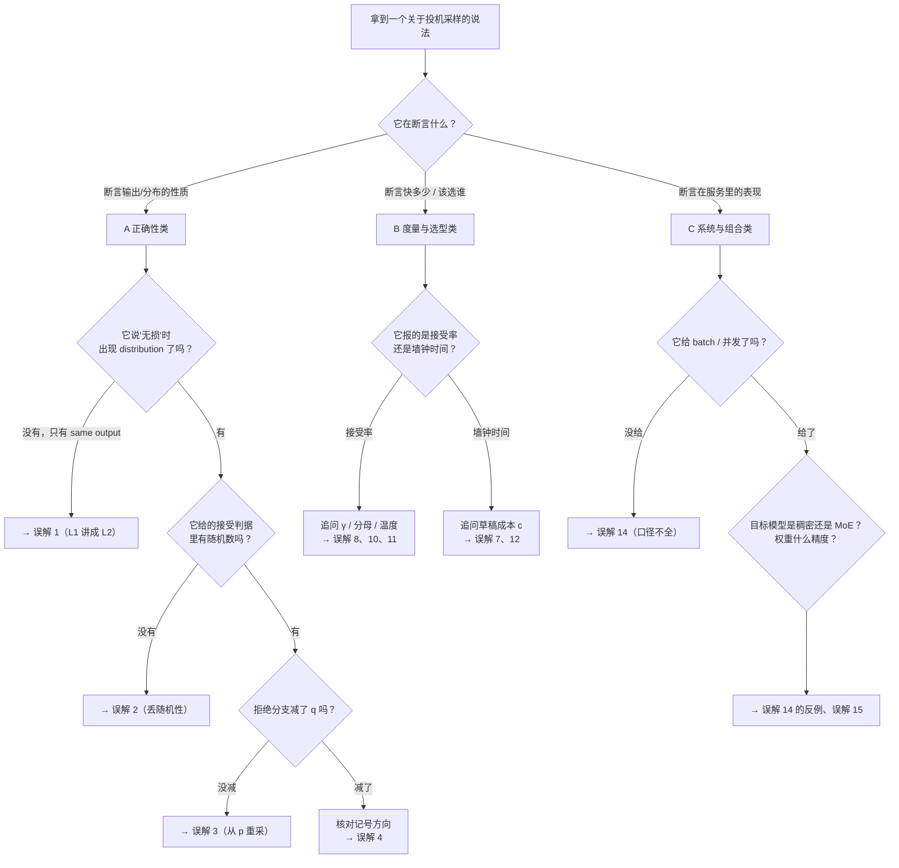

# 27 常见误解与判据

## 1. 一句话

这是一份**可查、可判定**的误解清单：读者遇到一个关于投机采样的说法，能在这里查到**它对不对、错在哪、怎么一句话当场判定**。

全篇 18 条，每条固定五栏（常见表述 / 为什么错 / 正确理解 / 一句话判据 / 本库依据），其中 **12 条有逐字引到的真实标本**（含论文摘要、厂商官方博客、Wikipedia、GitHub README、引擎源码），**4 条是本库自己写下猜想再被自己的数字推翻的**——后面这几条不是社区的错，是**直觉的错**，教学价值更高。

---

## 2. 从哪来：为什么"按材料读"不够，还要"按说法查"

[[26-社区精彩解释精选-好在哪与错在哪]] 已经把 41 份材料逐份评点了一遍，那是**按材料组织**的：给你一份博客，告诉你它好在哪、错在哪。

但工程现场的问法是反过来的（下面三句都是**待判定的原话**，不是本库的断言；第一句里那个没标 L1/L2/L3 口径的"无损"，正是误解 1）：

> "同事说'投机解码是无损的，所以开了以后输出应该一模一样'——这句话对吗？"
> "论文说草稿模型越小越好，我是不是该把 3B 换成 1B？"
> "我们接受率 80%，是不是配置很好了？"

**你手上只有一句话，没有出处。** 按材料组织的评点这时候查不动。所以本篇按**说法**组织，并且每条都收敛到一句**当场能执行**的判定动作——不需要读论文，不需要跑大模型，多数只要看一眼代码里那一行、或者追问对方一个数字。

三条边界，先说清楚，避免与邻篇重复：

| 篇目 | 它回答的问题 | 组织方式 |
|---|---|---|
| [[26-社区精彩解释精选-好在哪与错在哪]] | **这份材料**能不能信 | 按材料 |
| **本篇 27** | **这个说法**对不对 | 按说法 |
| [[19-负收益全解-什么时候投机反而更慢]] | **我这套配置**值不值得开 | 按红黄绿灯 |

---

## 3. 怎么用：先分类，再查条目

投机采样的误解有**三个互不相同的来源**，分清来源就知道该往哪查、以及错了会付出什么代价：

| 类别 | 来源 | 错了的代价 | 本篇条目 |
|---|---|---|---|
| **A 正确性类** | 算法本身的两行修正被写错或被误读 | **跑的已经不是原来那个模型**，而且不报错 | 误解 1–6 |
| **B 度量与选型类** | 指标口径混淆、把过程指标当收益指标 | 做错配置决策，白烧算力 | 误解 7–12 |
| **C 系统与组合类** | 把单请求结论搬到服务化场景 | 上线后吞吐反而掉 | 误解 13–16 |
| **D 直觉类** | 听起来天经地义、但被数字推翻 | 分析走错方向 | 误解 17–18 |



**读法**：本篇 §4 是主体；§7 是"没查到对应条目时的兜底体检"；§5 把几种错法在同一组分布上算成具体数字，用来建立量级感。

---

## 4. 误解清单

> 全篇的数字口径统一声明放在 §8。凡引用第三方数字，**原始来源缺哪一项就标哪一项，本篇不替它补全，也不洗白**。

### A. 正确性类——错了就不是原来那个模型

---

### 误解 1：「无损 = 开投机前后输出一模一样」

- **常见表述**：Wikipedia《Speculative decoding》词条逐字："The verification preserves the target model's original output distribution, so the technique **produces the same results as standard decoding** while cutting latency by roughly two to three times."（https://en.wikipedia.org/wiki/Speculative_decoding ，2026-08-22 核验；**该词条的具体修订日期本库未取到，标「未查证」**）。同一段里"preserves the ... distribution"与"same results"并排出现，正是这个病的典型形态。
- **为什么错**：标准投机采样保证的是 **L1 分布无损**——$\Pr[Y=y]=p(y)$ 逐点相等，证明见 [[04-拒绝采样修正-无损性的完整证明]] §4。**L1 不蕴含 L2 贪心等价**：投机采样改变了随机数的**消耗方式**（每个位置多消耗一个接受判定的 $R\sim U(0,1)$，拒绝时还要从残差分布再采一次，全接受时还要采赠品 token）。**即便固定种子，token 序列也必然不同。**
- **这个误解的源头不在社区，在论文摘要**：Leviathan 等（arXiv 2211.17192，2022-11）摘要写的是 "without any changes to the **outputs**" / "with **identical outputs**"，正文写的是 "without changing the model output **distribution**"。**同一篇论文两种口径并存**，而绝大多数二手讲解只抄了摘要那句。反过来，Chen 等（arXiv 2302.01318，2023-02）§6 把话说死了，逐字："Since pseudo-random seeds are processed differently between ArS and SpS, and because the different computation graphs lead to different numerics, **we cannot not expect identical outputs**."（原文即为 "cannot not"，疑似笔误，语义为"不能期待输出相同"）。
- **正确理解**：$T>0$ 时"开投机后输出变了"是 **L1** 允许的正常现象，不是 bug；**只有 $T=0$ 才逐 token 相同（L2）**，且此时与草稿模型好坏无关（草稿差只是更慢）。最好的一句话解药是 Jay Mody 的比喻："Speculative sampling giving different result than autoregressive sampling is akin to running autoregressive sampling but **with a different seed**."（https://jaykmody.com/blog/speculative-sampling/ ，2023-02-08）。
- **一句话判据**：**在它说"无损/lossless"的那句话里找 "distribution" 这个词。** 只有 same output / same results / identical 而没有 distribution → 它把 L1 讲成了 L2。要验证自己的实现，**把温度设成 0 做逐 token 对拍**，一条输出就能判定；$T>0$ 下对比单条输出，永远只会得到"不一致"，然后你会去修一个不存在的 bug。
- **本库依据**：[[07-无损的三种口径-分布无损不等于结果相同]] §2、§4.1；测试 `_lab/test_caliber.py::test_greedy_speculative_equals_greedy`（6 组 $(V,\varepsilon,\gamma)$ 配置，$T=0$ 逐 token 相同）、`::test_greedy_equivalence_holds_even_when_argmax_disagrees`（argmax 一致率低至 0.500 时 L2 仍成立）。

---

### 误解 2：「接受判据是 $p(x)>q(x)$ 就接受」

- **常见表述**：NVIDIA《An Introduction to Speculative Decoding》逐字："**Only when a draft token matches what the target model would have generated, is it accepted** ... ensuring that the final output is identical to what the target model would have produced."（https://developer.nvidia.com/blog/an-introduction-to-speculative-decoding-for-reducing-latency-in-ai-inference/ ，2025-09-17）。PyTorch gpt-fast 博客正文同型："process all eight tokens in parallel using the verifier model, **throwing out the ones that don't match**"（https://pytorch.org/blog/accelerating-generative-ai-2/ ，页面显示 last updated 2024-11-14）。
- **为什么错**：接受判据是**随机**的——采 $R\sim U(0,1)$，$R<\min(1,p(x)/q(x))$ 才接受。$p(x)/q(x)=0.67$ 意味着"有 67% 的概率接受"，不是"不接受"。把它写成确定性阈值，输出分布立刻有偏。本库用精确枚举量化过：把判据改成 "$p\ge q$ 就接受"，首 token 分布的最大逐点误差 $\mathbf{2.238\times10^{-1}}$——**某个 token 的概率偏了 22 个百分点**，这不是数值误差，是换了个模型。
- **更极端的形态有闭式**：如果判据直接退化成"草稿 token 与目标 argmax 精确匹配才接受"（2018 年 blockwise parallel decoding 的做法，见 [[08-史前史-2018并行解码与非自回归的失败]]），输出分布塌成 $\arg\max p$ 的 one-hot，偏差有闭式 $\mathrm{TV}=1-\max_x p(x)$，**而且与草稿质量完全无关**（换草稿一个小数位都不改）。这条与 L1 的性质正好相反，是"必须换判据"而不是"必须换更好的草稿"的直接证据。
- **正确理解**：$\min(1,p/q)$ 里的 $\min$ 只在"草稿高估了这个 token（$q>p$）"时才起作用，此时按 $1-p/q$ 的概率拒绝；草稿低估时（$p\ge q$）必接受。**先想"什么时候需要拒"，再收成 $\min$ 的紧凑形式**，比直接背公式好记（Leviathan 论文 §2.3 就是这个叙述顺序）。
- **一句话判据**：**在它给的判据里找随机数**——`rand` / `uniform` / "with probability"。一个随机数都没有的判据，讲的一定是贪心口径（L2）；如果它同时又宣称覆盖采样场景，那就是错的。
- **本库依据**：[[04-拒绝采样修正-无损性的完整证明]] §2.1；测试 `_lab/test_lossless.py::test_threshold_rule_is_biased`、`::test_correct_variant_is_unbiased_where_others_fail`、`_lab/test_prehistory.py::test_exact_match_rule_collapses_sampling_to_greedy`、`::test_exact_match_bias_equals_one_minus_max_prob`、`::test_exact_match_bias_is_independent_of_draft_quality`。复跑：`python _lab/spec.py --bias`。

---

### 误解 3：「拒绝之后从 $p$ 重新采一个就行」

- **常见表述**：本库调研的 41 份材料里**没有一份明确这样写**（这是本主题少见的、社区代码质量很高的一块）；最接近的形态是 Wikipedia 只写"the first token that fails is resampled from a **corrected distribution**"却**始终不给这个 corrected distribution 的形式**（同上 URL），以及 romsto/Speculative-Decoding 仓库提供了一个可开关的错误变体（作为消融，非默认）。**因此本条的"标本"是漏讲型，不是写错型——如实记录。**
- **为什么错**：被接受的那部分质量已经按 $\min(p,q)$ 流出去了。拒绝时若再按完整的 $p$ 补，"$q$ 低估的 token"会被补两次，"$q$ 高估的 token"被少补。残差分布 $p'=\mathrm{norm}(\max(0,p-q))$ 的存在，正是为了**把已经流出去的那部分从补偿里扣掉**；而且它的总质量恰好等于拒绝概率 $1-\beta$，所以在证明的最后一步能被约掉。换成 $p$ 之后约不掉，$\Pr[Y=y]=\min(p,q)+(1-\beta)p(y)\ne p(y)$。
- **偏差的方向比大小更值得记**：本库精确枚举（$|V|=5,\gamma=3$）给出最大逐点误差 $\mathbf{1.322\times10^{-1}}$；逐 token 看，草稿**高估**的 token 1 从真值 0.1564 涨到 0.1790（+14%），草稿**低估**的 token 3 从 0.1982 掉到 0.0826（只剩 42%）。**偏差方向恰好是把目标模型往草稿模型的方向拽**——输出仍然通顺，只是悄悄变成了一个介于大模型与小模型之间的东西。
- **正确理解**：拒绝分支必须从 $p'=\mathrm{norm}(\max(0,p-q))$ 采。中文社区有个好写法：`p' = normalize(relu(p - q))`，写过深度学习代码的人一秒就懂。
- **一句话判据**：**看拒绝分支的重采分布里减没减 $q$。** 找 `max(0, p-q)` / `relu(p-q)` / `clamp(min=0)`。只说 "corrected/adjusted distribution" 而不给形式的材料，等于把算法的灵魂省掉了，不能作为实现依据。
- **本库依据**：[[04-拒绝采样修正-无损性的完整证明]] §2.2、§4.2、§5；测试 `_lab/test_lossless.py::test_naive_resample_is_biased`、`::test_residual_mass_equals_rejection_prob`。

---

### 误解 4：「两篇奠基论文的 $p$ / $q$ 是一回事，公式可以互抄」

- **常见表述**：不是某一份材料的错，是**结构性陷阱**。Leviathan 等（2211.17192）用 $p$ = 目标、$q$ = 草稿；Chen 等（2302.01318）用 $q$ = 目标、$p$ = 草稿，原文 Algorithm 2 逐字："Given auto-regressive **target model $q(.|.)$**, and auto-regressive **draft model $p(.|.)$**"。**Chen 论文正文引用了 Leviathan，却没有任何一句提醒读者记号相反。** 社区材料在两套记号之间来回抄（Jay Mody 的博客、gpt-fast 的代码都是 DeepMind 系记号，但都没在显眼处提醒）。
- **为什么错**：接受概率写成 $\min(1,q/p)$ 而实际 $p$ 是目标时，判据的分子分母整个反了。**最阴险的地方是它不会让性能变差**：本库在第 04 篇那组玩具分布上实测，**正确判据的接受率 0.8558，写反之后反而升到 0.9607**——你会以为自己调好了。
- **正确理解**：接受概率永远是 $\min(1,\ \dfrac{\text{目标模型给这个 token 的概率}}{\text{草稿模型给这个 token 的概率}})$。把两套记号映射对之后，两篇论文的判据**逐点相等**，都是 L1 分布无损，没有任何实质差异（差异在 KV cache 回滚方式与最后一个 token 的处理，见 [[09-2023奠基-两篇同期论文的异同]]）。
- **一句话判据**：**别看字母，看角色。** 读任何一段投机采样代码/公式前，先回答一个问题："哪个符号是**目标**模型？"确认之后再看比值方向：**目标在分子**。若一段代码改完之后接受率**上升**了却说不出机制，优先怀疑记号写反，而不是庆祝。
- **本库依据**：[[09-2023奠基-两篇同期论文的异同]]；测试 `_lab/test_notation.py::test_two_papers_give_identical_acceptance_probability`（12 组随机分布上两篇判据逐点相等）、`::test_both_papers_are_l1_lossless`、`::test_swapped_notation_inflates_on_the_article_example`（0.8558 → 0.9607）、`::test_swapped_notation_is_biased`、`::test_swapped_notation_pulls_output_toward_the_draft`。

---

### 误解 5：「Medusa 的 typical acceptance 也是无损的」

- **常见表述**：Medusa 官方仓库 README 逐字："a **typical acceptance scheme** is employed to pick the longest plausible prefix from the candidates."（https://github.com/FasterDecoding/Medusa ，2026-08-22 核验；README 的 last update 本库未取到，标「未查证」）——**一个字都没提这会改变输出分布**。
- **传播链的断点在哪，必须说清**：Medusa 作者自己的 Together.ai 博客写得很清楚，逐字："**Relaxing the requirement of matching the distribution of the original model** makes the non-greedy generation even faster than greedy decoding."（https://www.together.ai/blog/medusa ，2023-09-11）。**这个锅不该扣在 Medusa 作者头上，该扣在"论文/博客说清楚了、README 没说、绝大多数人只读 README"这个断点上。**
- **为什么错**：typical acceptance 放宽了接受判据，输出分布**不再等于目标模型分布**，口径从 **L1 掉到 L3 近似**。本库用一个同类判据的简化模型（"$p(x)\ge\varepsilon$ 就接受"，注意**这不是 Medusa 的确切规则**，Medusa 用的是与熵相关的自适应阈值）量化了这类做法的量级：$\varepsilon=0.2$ 时首 token 最大逐点误差 0.2201。独立证据方面，Hydra 论文的受控实验逐字："**neither Medusa nor Hydra is able to achieve the same quality as random sampling from the base model for any of the posterior thresholds considered**"。
- **同型错误在 2026 年换了主角**：TensorRT-LLM 官方文档的 MTP 参数 `use_relaxed_acceptance_for_thinking` / `relaxed_topk` / `relaxed_delta`（文档版本 1.2.0rc6，2026-08 核验），**同样是放宽接受判据、同样没有任何有损标注**。
- **正确理解**：L3 是**设计选择**不是 bug——用分布正确性换接受长度，在很多场景是划算的。但它必须被如实标注，而且**L3 的 acceptance length 与 L1 的 acceptance length 不是同一量纲的量，不能横比**。
- **一句话判据**：**讲到任何"放宽/relaxed/typical/threshold"的接受方案时，找一句"这会改变输出分布"。** 找不到，就默认它是 L3 但作者没标；同时把它报的接受长度从与 L1 方法的对比表里划掉。
- **本库依据**：[[07-无损的三种口径-分布无损不等于结果相同]] §4.3、[[12-Medusa-多头草稿与树注意力的诞生]] §3.5、§7.2；测试 `_lab/test_caliber.py::test_typical_acceptance_is_biased`（四个阈值下均有偏）、`::test_zero_threshold_reproduces_draft_distribution`（$\varepsilon=0$ 时输出分布就是草稿分布，给出偏差上界）。

---

### 误解 6：「接受率突然塌方，说明无损性被破坏了」

- **常见表述**：这条是**工单区的高频提问**而不是出版物里的说法（本库未找到可逐字引用的公开标本，如实记录为"无标本"）。典型形态是：目标模型开了 top-p、草稿忘了开，接受率从 0.7 掉到 0.1，团队开始怀疑拒绝采样实现错了。
- **为什么错**：把**性能问题**误诊成**正确性问题**，排查方向整个走反。截断参数两侧不一致时，分两种情况，**结论都是"仍然 L1 分布无损，但接受率塌"**：草稿截得更狠（$q(x)=0,p(x)>0$）时，接受概率式子在 $q=0$ 处两边都是 0，定理照常成立，只是那些 token 只能靠残差分布补出来（慢一点）；目标截得更狠（$p(x)=0,q(x)>0$）时草稿采到就恒拒，草稿押在被截 token 上的**全部**质量白费（慢很多）。
- **真正会破坏 L1 的是另一件事**，SGLang 在源码注释里点名了：**草稿采样时用的分布，必须原样交给验证**。逐字："The verify's accept test `coin*q(X) < p(X)` is unbiased **only if q is exactly the distribution X was drawn from**, so callers must hand the returned q (not a recomputed one) to the verify."（`python/sglang/srt/speculative/spec_utils.py`，main 分支，2026-08-22 取）。从截断后的 $q$ 采、却拿未截断的 $q$ 算比值——**这才是 L1 失效**。
- **正确理解**：一条贯穿全库的分类判据——**少发 token、接受率低、$\gamma$ 设得不好 → 慢，分布仍然正确；判据写错、补偿写错、前缀没对齐、$q$ 被重算过 → 错，而且不报错。** 本库把它量化过：不发赠品 token 的实现误差 $8.3\times10^{-17}$（无偏，只是每轮少产出一个），而判据写错的误差是 $10^{-1}$ 量级。
- **一句话判据**：**先做 $T=0$ 逐 token 对拍（判"错"），过了再去调接受率（判"慢"）。** 顺序反了，会把正确性 bug 伪装成性能问题——这是本主题最常见的排查失误。
- **本库依据**：[[05-接受率alpha-定义口径与怎么测]] §7.2、[[04-拒绝采样修正-无损性的完整证明]] §7；测试 `_lab/test_lossless.py::test_no_bonus_token_is_still_lossless`、`::test_lossless_holds_for_terrible_draft`（接受率 <0.4 时仍精确无 L1 偏差）。

---

### B. 度量与选型类——错了会做错配置决策

---

### 误解 7：「草稿模型越小越好」

- **常见表述**：本库调研的 41 份材料里**没有一份明说这句话，但也几乎没有一份正面反驳它**（这是一条"靠沉默传播"的误解）。反驳它的最硬数据反而藏在两份材料自己的表格里。
- **为什么错**：加速比是 $\alpha$ 与草稿相对成本 $c$ 的**联合**函数，$\text{speedup}=\dfrac{1-\alpha^{\gamma+1}}{(1-\alpha)(\gamma c+1)}$。只看一边必然做错决定。两组硬数据：
  - **Leviathan 论文 §4.1（arXiv 2211.17192，2022-11）**，目标 T5-XXL 11B、CNNDM 任务、TPU-v4、**论文全程 batch=1**：T5-small（$\gamma$=5）$\alpha$=0.53 → **2.3X**；T5-base（$\gamma$=3）$\alpha$=0.55 → **2.2X**；T5-large（$\gamma$=3）$\alpha$=0.56 → **1.7X**。**$\alpha$ 单调升，加速比单调降。** ⚠️ **口径提醒：这三行的 $\gamma$ 不同（5/3/3），因此它不是一个严格的受控实验，只能说明"$\alpha$ 高不蕴含更快"，不能用来定量测 $c$ 的影响。本库不替原文补全这一项。**
  - **NVIDIA TensorRT-LLM 3.6x 博客（2024-12-02）**，目标 Llama 3.1 405B、4×H200、FP8、`max_batch_size=32`、`max_num_tokens=8192`：草稿 1B → 111.34 tok/s（3.33×）；**3B → 120.75 tok/s（3.61×，最优）**；8B → 101.86 tok/s（3.04×）——**倒 U 形**。同文 70B 目标（1×H200）上则是 1B 2.86× > 3B 2.75× > 8B 2.23×，**最优草稿尺寸随目标尺寸变化**。⚠️ **口径提醒：NVIDIA 称其为 throughput，实为单请求 output tokens/second（含 TTFT），`max_batch_size=32` 只是上限，全文无并发扫描，且未给 `max_draft_len`。【口径不全，不可与其它来源横比】**
- **正确理解**：换草稿要同时看 $c$ 和 $\alpha$。理想模型上很直观：$\alpha=0.9,c=0.05$ 时最优 $\gamma^\*=13$、加速比 4.674；换个更小的草稿把 $c$ 降到 0.02 但 $\alpha$ 掉到 0.75，最优约 $\gamma^\*\approx9$、加速比约 3.2，**反而更差**（口径：理想模型，batch=1 且落在 memory-bound 区，假设"验证免费"）。行业从"独立小模型"转向"单层草稿头"，本质就是把 $c$ 从 0.1 量级压到 0.02 量级。
- **一句话判据**：**它有没有同时给 $\alpha$ 和 $c$（草稿前向耗时占比）？** 只谈接受率、不谈草稿多贵的选型建议，一律按不完整处理。追问一句就够："你们的草稿前向占一轮迭代的百分之多少？"
- **本库依据**：[[05-接受率alpha-定义口径与怎么测]] §8、[[06-期望接受长度与加速比模型-完整推导]] §4.5、[[21-草稿模型怎么训-对齐与在线蒸馏]]；测试 `_lab/test_accept.py::test_optimal_gamma_decreases_with_cost`、`_lab/test_speedup.py::test_lighter_draft_lowers_breakeven`、`::test_breakeven_always_above_one`。

---

### 误解 8：「接受率高就说明配置好」

- **常见表述**：社区帖子里的"我们接受率 80%，效果很好"；论文里把 acceptance length 与加速比并列当成同向指标。
- **为什么错**：接受率与接受长度是**过程指标**，只有墙钟时间是**收益指标**，两者在同一张表里可以**排序完全相反**。三条硬证据：
  - **《Speculative Decoding Across Languages》（arXiv 2605.30580，2026-05）**，verifier = Qwen 3.5 9B，draft = Qwen 3.5 0.8B，故事生成（域外）任务：任务特定蒸馏草稿 $\bar\alpha$=0.43 → **1.03×**；n-gram $\bar\alpha$=**0.30**（更低）→ **1.39×**（更快）。**唯一原因是草稿前向 0.033 s vs 0.001 s，差 33 倍。接受率相对低 30%，加速比相对高 35%。** ⚠️ **原文未给 batch size（推定为 1）、未给硬件与 $\gamma$。【口径不全】**
  - **《Scaling Up, Speeding Up》（arXiv 2509.04474，2025-09）**，单张 RTX A6000 48GB、float16、**batch size=1**、目标 DeepSeek-R1-Distill-Llama-8B / Qwen3-8B、9 种方法：模型型 SpS 的平均接受 token **7.07（全表最高）**，加速比 **0.87×（比不开投机还慢 13%，全表最差）**。原文归因："draft generation … overhead … limits overall acceleration."
  - **Spec-Bench 榜单**（https://github.com/hemingkx/Spec-Bench ，榜单最后更新 2025-04-22），口径写在榜头：单张 A100 80GB、Vicuna-7B、greedy、FP16、**batch size = 1**：Recycling 的 #MAT 只有 2.73，却拿到 **2.22×**；而 #MAT 4.34 的 EAGLE2 是 2.36×——**接受长度差 1.6 个 token，加速比只差 0.14**。
- **正确理解**：接受率是**必要不充分**条件——它高不保证快，它低一定不快。Leviathan 论文早就给了那条可判定的线：$\alpha>c$ 时才存在能赚的 $\gamma$。
- **一句话判据**：**看到接受率数字，下一个问题不是"这个数好不好"，而是"草稿前向占一轮的多少、batch 多少、验证还免不免费"。** 做决策时把接受率换成两条线：实测墙钟吞吐 + P99 TPOT。
- **本库依据**：[[05-接受率alpha-定义口径与怎么测]] §8、[[19-负收益全解-什么时候投机反而更慢]] §7、[[11-无模型草稿-promptlookup与ngram与检索]]；测试 `_lab/test_accept.py::test_speedup_can_be_below_one`、`_lab/test_speedup.py::test_breakeven_can_exceed_theoretical_max`。

---

### 误解 9：「用 $E[\tau]=\dfrac{1-\alpha^{\gamma+1}}{1-\alpha}$ 就能算出加速比」

- **常见表述**：博客园 SHICENT《Speculative Decoding 深度全景解析》（https://www.cnblogs.com/SCCQ/p/19837997 ，2026-04-09）给出 `E[tokens per round] = (1-α^(γ+1))/(1-α)`，**没有提这个式子成立需要的假设**。这是"照抄公式不照抄前提"的典型断点——Leviathan 原文明写 "If we make the simplifying assumption that the $\beta$s are **i.i.d.**"。
- **为什么错**：这条公式有**两条**前提，而且真实负载上**两条都不成立**：
  1. **前提 A（沿链不相关）**：$\beta_1,\dots,\beta_\gamma$ 互不相关（比 i.i.d. 弱，i.i.d. 只是充分条件）。真实文本里"难的地方连着难"（代码块、长数字串、罕见实体）会破坏它。
  2. **前提 B（起点无偏）**：每轮迭代的起点服从平稳分布。但**迭代的起点是上一轮结束的地方，而一轮在哪里结束由拒绝决定**——这是对更新过程的抽样，难区起点的迭代更短、于是被过采样（经典的**长度偏置**）。
  净效果是**公式高估**：本库在可控的"黏性双区制"玩具模型上实测，$\beta$ 一阶自相关 $\rho$ 从 +0.04 升到 +0.81 时，实测/公式从 1.012 掉到 **0.895**，即最大高估 **10.5%**。
- **工程侧还有一条更硬的反证**：vLLM 把"平均接受长度 → 每位置接受率"的换算实现成了**最小方差调度** `[1,1,...,frac,0,...]`，**而不是 $\alpha^i$ 的几何衰减**（`vllm/config/speculative.py::_acceptance_length_to_rates`，main 分支，2026-08-22 取）。一个生产系统在同一个平均接受长度下选了完全不同的分布形状——说明几何模型只是众多模型之一。
- **正确理解**：这条公式适合做**定性判断**（$\gamma$ 该往哪调、$c$ 降一半值不值、$\alpha$ 提 5 个点收益多大），**不适合预测加速比，也不适合反推 $\alpha$**（反推出的 $\alpha$ 与逐位统计的平均接受率是两个量）。要 $E[\tau]$ 就直接测——引擎都能打这个点。
- **一句话判据**：**看它用这条公式时提没提"独立/i.i.d./不相关"。** 没提，就把它给出的加速比当成上界而非预测值；如果它还用实测 $E[\tau]$ 反推了 $\alpha$，那个 $\alpha$ 直接作废。
- **本库依据**：[[06-期望接受长度与加速比模型-完整推导]] §4.3、§7；测试 `_lab/test_accept.py::test_formula_overestimates_when_sticky`、`::test_iteration_start_is_biased_toward_hard_regime`、`::test_hard_region_iterations_are_shorter`、`::test_renewal_formula_accurate_only_when_sticky`。

---

### 误解 10：「贪心（$T=0$）下接受率总是最高」

- **常见表述**：源头是 Leviathan 论文自己的一句观察，逐字："Interestingly, $\alpha$ and walltime improvement are **higher** for argmax sampling (temp=0)"。**它说的是他们那批实验的观察，不是定理**——而社区把它读成了普遍规律。
- **为什么错**：$T\to0$ 时 $\alpha$ 收敛到"两模型 argmax 一致"的那部分上下文的概率质量 $g$，**这个极限既不是 0 也不是 1**。降温让 $\alpha$ 往 $g$ 走，方向取决于 $g$ 与常温 $\alpha$ 的大小关系，跟"草稿好不好"这个含糊说法没有直接关系。
  - **论文自己的表里就有反例**：Leviathan Table 3，GPT-like 97M/6M 那一行是 $t$=0 的 **0.88 低于** $t$=1 的 **0.89**；LaMDA 137B/2B 那一行 0.71 **持平**（口径：论文原文只给了模型对与采样设置，batch=1、TPU-v4；$\gamma$ 与任务切分见原文 §4）。
  - **本库玩具实验测出了形状**（$|V|=8$ 一阶马尔可夫模型，seed 固定，**batch 概念不适用**）：好草稿（argmax 一致率 0.625）是 **U 形**——$T$=0.02 时 0.6967，$T$=0.1 跌到 **0.6574（低谷）**，再一路升到 $T$=20 的 0.9951；烂草稿（一致率 0.125）是**严格单调上升**——0.0001 一路升到 0.9805，没有低谷。
- **另一个方向的陷阱**：$T\to\infty$ 时两个分布都趋于均匀，$\alpha\to1$，**与草稿好坏无关**。所以"高温下接受率高"不代表草稿好，只代表目标模型自己也在瞎猜。
- **正确理解**：**不报温度的接受率数字没有意义。** $T=0$ 测出的接受率不能外推到 $T=0.7$ 的线上配置，方向和幅度都取决于具体模型对（Leviathan 实测好草稿 0.75→0.62，本库玩具烂草稿 0.0001→0.34）。
- **一句话判据**：**追问三件事：温度、$\gamma$、草稿是贪心取 argmax 还是从 $q$ 随机采。** 第三项尤其容易漏——vLLM 的 `draft_sample_method` 默认就是 `"greedy"`，此时 $q$ 被当 one-hot，$\beta$ 退化成 $p(x^\*)$，**已经是另一个量**。
- **本库依据**：[[05-接受率alpha-定义口径与怎么测]] §6、§7.3；测试 `_lab/test_accept.py::test_good_draft_alpha_is_non_monotone_in_temperature`、`::test_poor_draft_alpha_is_monotone_in_temperature`、`::test_alpha_at_low_temperature_tracks_argmax_agreement`、`::test_alpha_goes_to_one_at_high_temperature`。

---

### 误解 11：「'接受率'就是一个数，报出来大家都懂」

- **常见表述**：任何不带分母说明的"接受率 X%"。**这条有一份官方样例可以逐字对照**：vLLM 文档《Per-Request Acceptance Metrics》给的 `summary` 响应里，`mean_acceptance_length: 1.2325581...`、`draft_acceptance_rate: 0.07751937...`、`acceptance_histogram: [39,1,0,3]`、`num_spec_steps: 43`、`num_accepted_draft_tokens: 10`、`num_draft_tokens: 129`。
- **为什么错**：**同一次运行的同一段统计，能读出三个都被叫"接受率"的数**：`draft_acceptance_rate` = 10/129 = **0.0775**；`mean_acceptance_length` = 1+10/43 = **1.2326**；而真正对应论文里 $\alpha$ 的那个量**这两个字段都不是**——它要从直方图重建"被验证过的位置数" $39\times1+1\times2+0\times3+3\times3=50$，得到 $\hat\alpha=10/50=$ **0.2000**。把 `draft_acceptance_rate` 当 $\alpha$ 代进闭式，$E[\tau]$ 会算成 1.0840，比实测的 1.2326 低 **12.05%**。
- **更麻烦的是分母随 $\gamma$ 变**：固定 $\alpha=0.80$ 不动，只改 $\gamma$，token 级接受比例从 $\gamma$=1 的 **0.8000** 一路掉到 $\gamma$=12 的 **0.3104**。**两个团队报"接受率 41%"和"接受率 80%"，可能是同一对模型。** 原因是结构性的：首次拒绝即截断，拒绝点之后的草稿被起草了、计入分母了，却从未被验证过。
- **正确理解**：四个量要分清——单步接受概率 $\beta$、期望接受率 $\alpha$、token 级接受比例（÷起草总数）、平均接受长度（÷轮数，且**含赠品 token**，vLLM 与 SGLang 口径一致，值域 $[1,\gamma+1]$）。换算恒等式 $\text{(c)}=(\text{(d)}-1)/\bar\gamma$ 是纯计数恒等式，随时可用。
- **一句话判据**：**看到"平均接受长度"，先问它能不能取到小于 1 的值。** 不能（下界 1.0）→ 引擎口径，含赠品；能（下界 0）→ 论文口径，不含赠品，**要加 1 才能和引擎数字比**。看到"接受率"，先问分母是"起草总数"还是"被验证位置数"。
- **本库依据**：[[05-接受率alpha-定义口径与怎么测]] §4、§5.3；vLLM 官方文档 https://raw.githubusercontent.com/vllm-project/vllm/main/docs/features/speculative_decoding/acceptance_metrics.md （2026-08-22 取）。⚠️ **该样例原文未给模型/硬件/batch/温度，只能用来演示口径换算，不可横向比较。**

---

### 误解 12：「$\gamma$ 越大越好；只要边际收益 $\alpha^{g+1}$ 还大于草稿成本 $c$ 就该继续起草」

- **常见表述**：前半句是社区默认；后半句写得更"专业"，也更值得单独拆——它看起来天经地义（多起草一个 token 的期望收益是 $\alpha^{g+1}$，成本是 $c$，收益大于成本就该继续）。
- **为什么错**：$\alpha^{g+1}>c$ **忘了算机会成本**。多花 $c$ 那份时间，你本可以就此结束这一轮、开始下一轮，而下一轮的产出速率就是当前的 $\text{speedup}(g)$。正确判据是"边际比大于平均比"：
  $$\alpha^{g+1}>c\cdot\text{speedup}(g)$$
  本库把两条判据与 $[1,64]$ 上的暴力搜索做了交叉检验（口径：理想模型，batch=1 且落在 memory-bound 区，假设"验证免费"）：**粗网格 16 格上，$\alpha^{g+1}>c$ 是 16/16 全不一致且每次都偏大；正确判据 16/16 全一致。** 细网格 9494 格上，正确判据只有 1 格不同（并列最优的取舍），而 $\alpha^{g+1}>c$ 最差的一格是 $(\alpha,c)=(0.98,0.05)$：暴力搜索给 $\gamma^\*=37$（理想加速比 9.402），它给 $\gamma=148$，**理想加速比只剩 5.659，损失 39.8%**。
- **这条证伪值得记住的形式**：$\alpha$ 越高、$c$ 越小（也就是投机越划算的场景），错判据的错误越大——**它恰好在最需要它的地方最不准**。
- **生产侧的数字同向**：Red Hat 实测 gpt-oss-120b（MXFP4 MoE）+ EAGLE3 草稿，H200-PCIe-141GB、vLLM v0.13.0、GuideLLM v0.5.3、ShareGPT、**并发 1–200 全扫**：$K$=2 时接受率 45.4% / 接受长度 1.91；$K$=3 时 35.6% / **2.07**；$K$=4 时 28.3% / **2.13**。**$K$ 从 3 加到 4，接受长度只涨 0.06，输出吞吐掉 8%。**（https://developers.redhat.com/articles/2026/04/16/performance-improvements-speculative-decoding-vllm-gpt-oss ，2026-04-16）
- **正确理解**：$\text{speedup}$ 对 $\gamma$ **不单调**——分子指数饱和、分母线性增长，存在有限最优 $\gamma^\*$，而且 $\gamma^\*$ 随 $c$ 单调降、随 $\alpha$ 单调升。要动态调 $\gamma$，阈值必须带上当前速率这个因子。
- **一句话判据**：**任何"要不要多起草一个"的判据，右边必须出现当前速率（或等价的机会成本项）。** 只比 $\alpha^{g+1}$ 与 $c$ 的，一律按"会把 $\gamma$ 选大一倍以上"处理。
- **本库依据**：[[17-动态草稿长度与自适应停止]] §4.2–4.3、[[06-期望接受长度与加速比模型-完整推导]] §4.5；测试 `_lab/test_accept.py::test_marginal_criterion_matches_brute_force`、`::test_naive_marginal_criterion_is_wrong`、`::test_naive_criterion_worst_case_loss`、`::test_optimal_gamma_increases_with_alpha`。

---

### C. 系统与组合类——错了会在上线后才发现

---

### 误解 13：「草稿不准，就该把树加宽」

- **常见表述**：树形草稿的默认直觉——单链一步错全废，那就在容易出错的位置多押几个候选。
- **为什么错**：宽度值不值钱，取决于**边际覆盖率增益 $c_k-c_1$**（第 2 候选相对第 1 候选多覆盖多少），**不取决于"草稿好不好"**。本库在一个最小模型上（$|V|=2000$，$p\sim$Zipf(2.0)，**L2 贪心/精确匹配口径**）跑出来的两组：
  - 草稿一致度 agree=0.95：$c_1$=0.608、$c_2$=**0.760**，边际增益 **+0.152** → 预算 $n\ge16$ 时二叉树赢（$n$=16 时 1.7772 vs 链 1.5512）。
  - 草稿一致度 agree=0.80：$c_1$=0.608、$c_2$=**0.608**，边际增益 **0.000** → **无论预算多大，链都赢**。
  也就是说：**一个"整体跑偏"的草稿，它的第 2 名和第 1 名一样不靠谱，宽度救不了它。** 而"知道自己不确定、能把正确答案排进 top-2"的草稿，宽度才有价值。**这两种"不准"完全不同，而流行说法把它们混为一谈了。**
- **另一半也要说**：预算太小时加宽等于砍深度，砍得不值——即使 agree=0.95，预算 $n$=8 时链 1.5227 仍然打赢二叉树 1.3380（二叉树把深度从 8 砍到 2，只换来覆盖率 0.608→0.760）。**树要赢，需要"边际增益显著"且"预算足够大"两个条件，缺一不可。**
- **正确理解**：草稿整体跑偏时该做的是**换/重训草稿**，不是加宽树。另外规则 $k$ 叉树本来就不是最优树——真实系统里兄弟分支概率极不均匀（Zipf 尾很长），最优树是不规则的：深处窄、浅处宽、按概率剪枝。这正是 EAGLE-2 之后转向动态树形状的原因。
- **一句话判据**：**加宽之前先测一个数：草稿的 top-2 覆盖率减 top-1 覆盖率。** 这个差接近 0，就别加宽，加多少都白搭。
- **本库依据**：[[16-树形草稿与树注意力-mask构造与验证]] §5.3；测试 `_lab/test_tree.py::test_budget_needed_grows_as_the_gain_shrinks`、`::test_chain_beats_tree_at_small_budget`、`::test_tree_beats_chain_at_large_budget`、`::test_coverage_increases_with_k`。复跑：`python _lab/tree.py --shape`。

---

### 误解 14：「投机解码提升吞吐」

- **常见表述**：NVIDIA《An Introduction to Speculative Decoding》逐字："cutting latency and **boosting throughput** without any impact on accuracy"（同误解 2 的 URL，2025-09-17），全文没有一句讨论 batch / 并发对收益的影响。同型：NVIDIA 那篇标题《…Boosts Inference **Throughput** by up to 3.6x》报的其实是单请求 output tokens/second；中文侧 tbr8.org 的标题《…将大模型推理**吞吐量**提升 2-3 倍》而正文自己承认"高并发时投机收益递减"。
- **为什么错**：投机采样的收益全部来自"前向处在 memory-bound 区，多喂几个 query token 不要钱"。一旦验证前向进入 compute-bound，成本按 query token 数线性收费，加速比收敛到
  $$\lim_{\text{batch}\to\infty}\text{speedup}=\frac{E[\tau]}{\gamma+1}(1-s)\ <\ 1$$
  （$s$ 为草稿占迭代的比例）。**这个极限恒小于 1，而且调参救不了**：$E[\tau]$ 顶到理论上限 $\gamma+1$ 也只能打平偏亏。本库解析模型实测（口径：target = llama3-70b、draft = llama3.2-1b、$\gamma$=4、$E[\tau]$=3.0 固定、fp16 权重与 KV、8×H100 SXM5 TP=8、seqlen=1024、报的是全 batch 合计吞吐；**忽略 TP 通信与调度，是乐观上界**）：batch=64 时 2.693，batch=384 时 **0.813**，batch=1024 时 **0.566**——与闭式预测 $0.600\times0.944=0.566$ 完全吻合。同期实证：vLLM 官方博客自己报了反向数字，4×H100 上同一套配置在高 QPS 下 ShareGPT 慢 1.4×、CNN/DailyMail 慢 1.8×。
- **但必须写明反例，否则本条会变成新的误解**：Red Hat 2026-04 在 **gpt-oss-120b（MoE + MXFP4 量化）+ EAGLE3 草稿**、H200-PCIe-141GB、vLLM v0.13.0、**并发 1/5/25/50/100/200 全扫**、ShareGPT 上测得输出吞吐峰值 **2574 tok/s vs 基线 2024 tok/s（+27.2%）**，几何平均 **+20.7%**，并且"consistent throughput and latency improvements that persist with up to **200 concurrent requests**"。机制上说得通：MoE 让"每 token 的算力"按激活参数算、而权重读取在大 batch 下趋近全量，访存/算力比远比稠密模型友好；MXFP4 又进一步压缩权重。**本库的渐近线推的是稠密模型那本账，MoE 把"一份算力"的定义改了，账要重列——[[18-batch与吞吐-收益衰减曲线]] 与 [[23-与其它优化的相互作用-量化与KVcache与PD分离]] 均声明未对 MoE 建模。**
- **正确理解**：**正确表述是条件式，不是绝对句。** 稠密模型 + 短上下文 + 大 batch → 吞吐下降，这是算术不是工程失误；长上下文（KV 读把前向钉在 memory-bound）→ 在能装下的全部 batch 范围内都赚；MoE + 低位权重量化 + 高接受率草稿 → 2026 年的证据表明高并发下依然赚。另外**延迟与吞吐会给出相反结论**：batch=384 时吞吐 0.813 倍（亏），但单请求 TPOT 仍可能更好。
- **一句话判据**：**它报的是单请求 tok/s 还是系统吞吐？有没有并发扫描？** 没有并发扫描的"吞吐提升"一律按单请求延迟指标处理，禁止横比。反过来，看到"大 batch 一定亏"的绝对句，追问一句"目标模型是稠密还是 MoE、权重什么精度"。
- **本库依据**：[[18-batch与吞吐-收益衰减曲线]] §4–§5、[[19-负收益全解-什么时候投机反而更慢]] §2、§8；测试 `_lab/test_speedup.py::test_speedup_collapses_at_large_batch_short_context`、`::test_compute_bound_asymptote_equals_wasted_compute_ratio`、`::test_spec_throughput_saturates_while_baseline_keeps_climbing`、`::test_higher_accept_length_raises_but_cannot_save_asymptote`、`::test_long_context_keeps_speedup_at_large_batch`。

---

### 误解 15：「量化和投机可以叠加，各提速一点乘起来」

- **常见表述**：线上配置里"int4 权重 + fp8 KV + 投机解码"同时开，期待收益相乘。加上一条常见的验证方式："我们在 bs=1 上测了，量化前后投机的加速比都是 2.8×，所以完全兼容。"
- **为什么错**：它们抢的是**同一份东西**——decode 阶段"访存已经付过钱、算力还闲着"的那份冗余。权重量化的本职工作就是把访存量砍下去，也就是把前向往 compute-bound 推，**正是在削减投机采样赖以为生的冗余**。本库把它算成了"免费额度"（这一批前向翻进 compute-bound 之前还能再吃下多少个 query token），实测交叉点（加速比跌破 1.0 的最小 batch，seqlen=1024，同 §误解 14 口径）：
  - fp16 权重 + fp16 KV：交叉点 batch **265**，bs=1 加速比 2.801
  - fp8 权重 + fp16 KV：交叉点 batch **133**，bs=1 加速比 2.799
  - int4 权重 + fp8 KV：交叉点 batch **52**，bs=1 加速比 2.799
  **可用 batch 区间从 265 塌到 52，缩小 5.1 倍；而 bs=1 的加速比在 2.795–2.802 之间几乎不动。** 这正是这个坑难被发现的原因：**只在 bs=1 做兼容性测试，会系统性地漏掉全部冲突。**
- **同一张表还给了正确的比较方式**：量化让基线本身快了 4 倍（189.4 → 755.6 tok/s，bs=1）。**一个 int4 的基线（755.6）已经比 fp16 开投机（530.4）更快。** 所以该问的不是"投机还有没有加速"，而是"在给定显存与精度预算下，哪个组合的绝对吞吐/延迟最好"。
- **同类冲突还有几条**：chunked prefill 的一个 chunk（主流引擎 512–2048）就能吃光整份免费额度（batch=128、seqlen=1024 时投机自己就透支 262 个 token）；CUDA graph 要固定形状，与动态草稿长度/动态树天然冲突，只能分桶；PD 分离两个方向都有（decode 侧不再被 prefill 抢额度，但 decode batch 通常被推得更大）；GQA/MLA 压缩 KV，**削弱了"长上下文对投机友好"这个结论**——今天主流模型全是 GQA 或 MLA，MHA 时代的数字不能直接搬。
- **正确理解**：**"竞争关系"不等于"不该一起用"。** 小 batch 下量化 + 投机仍然都是净收益，只是**收益不叠加、可用区间变窄**。结论是**要一起调**（chunk 大小、batch、$\gamma$、精度放在一张账本上），不是二选一。
- **一句话判据**：**兼容性测试必须扫 batch，不能只测 bs=1；而且对照组必须是"量化基线"不是"fp16 基线"。** 拿 fp16 基线去衬托"量化+投机"，会把量化的功劳算到投机头上。
- **本库依据**：[[23-与其它优化的相互作用-量化与KVcache与PD分离]] §4；测试 `_lab/test_speedup.py::test_weight_quantization_shrinks_the_usable_batch_range`、`::test_kv_quantization_also_shrinks_the_range`、`::test_quantization_speeds_up_the_baseline_too`、`::test_free_budget_is_a_few_hundred_query_tokens`、`::test_spec_alone_can_exhaust_the_free_budget`。复跑：`python _lab/speedup.py --quant`。

---

### 误解 16：「MTP 的训练目标就是推理时的草稿用法」

- **常见表述**：讲 MTP（Multi-Token Prediction）时把"训练时多预测几个 token"与"推理时要出 $\gamma$ 个草稿"当成一件事。本库调研的 41 份材料里**几乎无人正面讨论这个区分**（唯一的硬证据在引擎源码里，如实记录）。
- **为什么错**：MTP 头是按训练目标一次预测下一个（或固定第 $k$ 个）token 的；推理时想让它连续吐出 $\gamma>1$ 个草稿，只能**把同一层反复跑**，而这个用法不在训练分布里。vLLM 直接把告警写进了源码：
  > `logger.warning("Enabling num_speculative_tokens > 1 will run multiple times of forward on same MTP layer, which may result in lower acceptance rate")`
  （`vllm/config/speculative.py`，main 分支，2026-08-22 取）
- **另一条：MTP 的接受率数字本身也需要标口径。** DeepSeek-V3 报告（arXiv 2412.19437）§5.4.3 给出的"第二 token 接受率 85–90%"是**基础模型**的数字；Bebop（arXiv 2606.12370，Qwen 团队）证明该接受率与 RL 阶段的熵上升呈清晰的负线性关系，**会系统性退化**。**拿基础模型的 MTP 接受率去预测 RL 后模型的表现，会高估。**
- **正确理解**：训练目标决定的是"这个头在什么条件下被训过"，推理草稿用法决定的是"你实际怎么用它"。两者对不上时，掉的是接受率（性能），不是分布正确性——MTP 草稿本身仍走标准拒绝采样，是 **L1 分布无损**。
- **一句话判据**：**讲 MTP 时，追问"推理时要出 $\gamma$ 个草稿，这 $\gamma$ 步是怎么来的？"** 如果答案是"同一层跑 $\gamma$ 次"，就该同时问"接受率随第几步怎么衰减"；如果引用了接受率数字，追问"是基础模型还是 RL 后的模型"。
- **本库依据**：[[14-MTP-从训练目标到推理草稿]]；引擎源码告警见上（[[20-主流引擎实现-vLLM与SGLang与TensorRTLLM]] 收录）。

---

### D. 直觉类——本库自己写下猜想，又被自己的数字推翻

> 这两条不是社区的错。它们是本库在写第 06、07 篇时**先写下、再跑数字、跑完发现方向反了**的猜想。保留下来，因为"错在哪"比"结论是什么"更有教学价值。

---

### 误解 17：「$\beta$ 在真实模型上波动很大，所以 $E[\tau]$ 闭式一定不准」

- **常见表述**：本库自己的初稿猜想（附带一个更"专业"的版本：$E[\tau]$ 关于 $\alpha$ 是凸函数，由 Jensen 不等式，$\beta$ 有波动时真实值应当**高于**公式值）。
- **为什么错**：推导要的从来不是"$\beta$ 是常数"或"同分布"，而是"$\beta_i$ 沿链**不相关**"——乘积的期望等于期望的乘积，只需要不相关。Jensen 那套推理对应的是另一个量，根本没进到这条推导里。实测（随机马尔可夫玩具模型，**batch 概念不适用**）：$\beta$ 在 0.1763 到 0.4492 之间变化（**差 2.5 倍**），公式与实测的比值仍在 **0.997–1.023** 之间，也就是准到 2%–3% 以内。
- **这次证伪的收获是正的**：它把公式的适用范围**扩大**了——只要接受难度不"连片"，即使各处接受率天差地别，公式仍然精确。真正破坏它的是相关性（误解 9），而且方向是**高估**不是低估。
- **正确理解**：区分"波动"与"相关"。波动大 ≠ 公式失准；**连片才失准**。所以判断一个负载适不适合套这条公式，该测的是接受事件的**自相关**，不是接受率的方差。
- **一句话判据**：**测 $\beta$ 序列的一阶自相关 $\rho$，不测它的方差。** $\rho$ 接近 0 → 公式可用；$\rho$ 明显为正（代码、长数字串、结构化输出）→ 公式高估，本库实测最大 10.5%。
- **本库依据**：[[06-期望接受长度与加速比模型-完整推导]] §7.1；测试 `_lab/test_accept.py::test_formula_accurate_when_uncorrelated`、`::test_stickiness_raises_beta_autocorrelation`。复跑：`python _lab/accept.py --iid`。

---

### 误解 18：「typical acceptance 的阈值调保守一点，偏差就小了」

- **常见表述**：本库 `_lab/caliber.py` 早期版本注释里的原话是"提高阈值会让偏差变小"；社区里的等价说法是"阈值这么小，偏差可以忽略"。
- **为什么错**：**两头都错，而且方向都出人意料。**
  - 阈值很小时（本例 $\varepsilon\le0.10$，因为 $p$ 的最小分量是 0.1045），判据事实上等于"无条件接受草稿"，**输出分布就是草稿分布 $q$**，误差达到 $\max|p-q|=0.1719$——**这是偏差的最大值，不是最小值**。
  - 阈值调大之后误差**反而单调变大**：$\varepsilon$ = 0.05 → 0.20 → 0.50，最大逐点误差 0.1719 → **0.2201** → **0.6598**。
  机制是：被拒绝的质量走的仍然是 $\mathrm{norm}(\max(0,p-q))$ 这条补偿路径，而**那条补偿是专为 $\min(1,p/q)$ 判据配套设计的**。换了判据，补偿就不再匹配；拒绝得越多，走错路的质量越多。
- **正确理解**：**判据与补偿必须成对更换。只改判据不改补偿，"调保守一点"反而更糟。** 这解释了为什么严肃的 L3 方法（SpecTr 的最优传输视角、SpecInfer 的多分支拒绝采样）都要重新推导整套接受-补偿机制，而不是在原判据上加个阈值。
- **一句话判据**：**看它改判据的时候有没有同时改补偿分布。** 只动接受条件、拒绝分支原样保留的实现，一律按"偏差不可控"处理——无论阈值调多保守。
- **本库依据**：[[07-无损的三种口径-分布无损不等于结果相同]] §4.3；测试 `_lab/test_caliber.py::test_raising_threshold_makes_bias_worse_not_better`、`::test_zero_threshold_reproduces_draft_distribution`。复跑：`python _lab/caliber.py --typical`。

---

## 5. 小数字算例：给几种错法定价

全部在**同一对玩具模型**上算（$|V|=5$，$\gamma=3$，起始 token $s_0=0$，target seed=0，draft 扰动 $\varepsilon=1.2$；**batch 概念不适用**）：

$$p=[0.2024,\ 0.1564,\ 0.3386,\ 0.1982,\ 0.1045],\qquad q=[0.2060,\ 0.2330,\ 0.3406,\ 0.0540,\ 0.1664]$$

$\beta=\sum\min(p,q)=0.8558$，残差 $p'=[0,0,0,1,0]$（token 3 是唯一被草稿低估的，全部"欠账"记在它头上）。

| 做法 | 对应误解 | 首 token 分布最大逐点误差 | 口径 | 判定 |
|---|---|---|---|---|
| $\min(1,p/q)$ + 残差重采 | —— | $1.665\times10^{-16}$ | **L1 分布无损** | 正确 |
| 同上但不发赠品 token | 误解 6 | $8.327\times10^{-17}$ | **L1 分布无损** | 无偏，只是每轮少产出一个（**慢，不是错**） |
| 拒绝后直接从 $p$ 重采 | 误解 3 | $\mathbf{1.322\times10^{-1}}$ | 错误实现 | **有偏**，方向是把 $p$ 往 $q$ 拽 |
| 判据写成 $p\ge q$ 就接受 | 误解 2 | $\mathbf{2.238\times10^{-1}}$ | 错误实现 | **有偏** |
| 绝对阈值 $\varepsilon=0.2$ 接受 | 误解 5、18 | $\mathbf{2.201\times10^{-1}}$ | **L3 近似** | 有偏（**设计选择**） |
| 记号写反（$\min(1,q/p)$） | 误解 4 | 有偏，且实测接受率从 0.8558 **升到** 0.9607 | 错误实现 | **有偏且伪装成"变好了"** |
| $T\to0$，标准判据 | 误解 1 | 0（序列逐 token 相同） | **L2 贪心等价** | 正确 |

（实测，复跑：`python _lab/spec.py --bias`、`python _lab/caliber.py --typical`、`python _lab/caliber.py --greedy`）

**这张表最该读的是第 4 行与第 5 行**：误差量级几乎一样（0.224 vs 0.220），**但性质完全不同**——第 4 行是作者以为自己在做 L1、实现写错了；第 5 行是作者知道自己在做 L3、为换速度主动选的。**数字分不出它们，只有口径标注能分出来。** 这就是铁律一不是形式主义的原因。

---

## 6. 代码验证：把这份清单跑成一条命令

本篇的每一条误解都挂着 `_lab/` 里的断言（完整对应关系见文末「本篇验证」）。它们可以被**一次性跑完**，用来在改动实现之后回归整份清单：

```bash
cd _lab && python -m pytest -q -k "biased or greedy_speculative_equals_greedy \
  or raising_threshold or swapped_notation or exact_match \
  or formula_overestimates or formula_accurate or monotone_in_temperature \
  or marginal_criterion or naive_marginal or naive_criterion \
  or width_is_worthless or chain_beats_tree \
  or collapses_at_large_batch or asymptote or quantization or no_bonus_token"
```

实跑输出（2026-08-22，CPU，纯 numpy，无需下载数据、不联网）：

```
77 passed, 114 deselected in 33.81s
```

**这 77 条断言就是本篇 18 条误解的判定层。** 三条使用建议：

1. **接手一份投机解码实现时**，先按 §7 的 C1–C3 读代码定性；定性有疑问，就把对应的 `_lab/` 变体（`spec.py` 的 `naive_p` / `threshold` / `no_bonus`、`notation.py` 的 `accept_prob_swapped`）当**消融开关**，在自己的玩具规模上对拍一遍。
2. **本篇所有"有偏"的结论都来自精确枚举**（把 $\gamma$ 个位置 × $|V|$ 种取值 × 接受/拒绝分支的全部概率加起来），**不是采样统计**——所以误差量级是 $10^{-16}$（无偏）与 $10^{-1}$（有偏）的干净二分，不存在"要不要多采几次"的问题。
3. **统计类命题（误解 9、17）已按本库约定多次重复取平均并固定种子**，单样本判定是本仓库踩过的坑（见 `_meta/写作规范.md` §6）。

---

## 7. 30 秒体检：怎么快速判定一份材料靠不靠谱

[[26-社区精彩解释精选-好在哪与错在哪]] §9 给了一份**六问鉴别清单**（按材料逐份打分）。本节是它的**快版**：5 条动作，都能在 30 秒内做完，用来决定"这份材料值不值得继续读"。第 5 条是本篇独有的。

| # | 检查动作 | 怎么做（30 秒内） | 不合格意味着 |
|---|---|---|---|
| **C1** | **看拒绝分支从哪个分布重采** | 在页面里搜 `max(0`、`relu`、`clamp(min=0)`、`p - q`。**减没减 $q$，一眼定性** | 没减 → 误解 3，分布有偏，代码不可抄；只说 "corrected distribution" 不给形式 → 漏讲了算法的灵魂 |
| **C2** | **看判据里有没有随机数** | 搜 `rand`、`uniform`、"with probability" | 没有 → 它讲的是 L2 贪心口径。**这本身不一定错**（TensorRT-LLM 文档就诚实写了"only greedy sampling is supported"），错在用普遍口吻说出来 |
| **C3** | **看它说"无损"时标没标口径** | 搜 "distribution"。只有 same output / identical / same results → 误解 1 | 它把 L1 讲成了 L2；采纳它的比喻，但把这句话改掉 |
| **C4** | **看数字带没带口径** | 加速比：搜 "batch size" / "concurrency" / "QPS" / "req/s"；接受率：搜 $\gamma$ / "draft tokens" / "temperature" | 缺项的数字**只能孤立引用，禁止横比**（铁律二）。特别地，"tok/s + 无并发" = 单请求延迟指标，不是吞吐 |
| **C5** | **拿它的头条数字去核它自己的表**（本节独有） | 摘要/标题的最大值，在正文表格里找得到吗？表注与正文的硬件一致吗？ | 自相矛盾的材料，任何数字都要降级处理 |

**C5 不是吹毛求疵——本库核到的自相矛盾样本比预想的多**：

| 样本 | 矛盾 | 出处 |
|---|---|---|
| Leviathan 摘要 vs 正文 | 摘要 "with identical outputs"，正文 "without changing the model output distribution" | arXiv 2211.17192（2022-11） |
| Medusa 摘要 vs Table 1 | arXiv abs 页摘要写 "2.3-3.6×"，v3 正文渲染的摘要写 "2.3-2.8×"，**而 Table 1 的最大值只有 2.83×**（Medusa-2，Vicuna-7B/13B，MT-Bench，单卡，**batch size = 1**）。3.6× 无表格支撑 | arXiv 2401.10774（2024-01） |
| EAGLE-3 Table 5 | 正文说 "the results on **RTX3090**"，Table 5 caption 却写 "on **A100**" | arXiv 2503.01840（2025-03） |
| Leviathan Appendix A.5 | lenience 判据印成 $p(x)\le l\cdot\max(p)$，**与它自己的 $\alpha$ 表矛盾**（$l$=1 时该判据恒真 ⇒ $\alpha$ 应为 1.0，而原文报 0.75）；正确形式应为 $\ge$。**已渲染 PDF 目视确认为原文印刷错误** | arXiv 2211.17192 |
| NVIDIA 3.6x 博客标题 vs 指标 | 标题写 Throughput，报的是单请求 output tok/s（含 TTFT），`max_batch_size=32` 只是上限，无并发扫描 | https://developer.nvidia.com/blog/tensorrt-llm-speculative-decoding-boosts-inference-throughput-by-up-to-3-6x/ （2024-12-02） |

**三条速查捷径**（与上面那张体检表配合用）：

1. **先读正文再信标题。** 本库核到的三次"标题党"（NVIDIA 3.6x、tbr8.org、AMD "Deep Dive"），全部是**正文比标题诚实**。
2. **看它敢不敢说自己什么时候不行。** 敢写 "speed ups are only observable at low batch sizes"（TensorRT-LLM 文档）、"throughput reduction beyond a batch size of 64"（PyTorch/IBM）的材料，整体可信度高一个档次。
3. **看引擎参数的日期。** 引擎参数半衰期极短——`--speculative-disable-by-batch-size` 在 vLLM main（2026-08-22 核验）已不存在，仍在教它的中文材料已经过期。**任何超过一年的引擎配置建议，默认按过期处理，去核源码。**

---

## 8. 口径与坑：本篇自己的口径声明

1. **本篇的数字分三类，标注方式不同。**（a）**本库实测**：来自 `_lab/` 的纯 numpy 玩具模型或解析模型，给复跑命令；（b）**第三方引用**：给年月与 URL，口径缺项**原样标注**；（c）**未查证**：明确写出来，不猜。
2. **本库的解析模型（`_lab/speedup.py`）不是硬件实测。** 它忽略 TP 通信、norm/softmax、kernel launch、调度、反量化开销，**是乐观上界**，真实翻转点只会更早。本篇引用它的交叉点数字（265 / 133 / 52）时，它们依赖具体模型/硬件/精度组合，**换一套要重算，不能当配置建议**。
3. **本篇不做跨来源的加速比比较。** 误解 7、8、12、14、15 里出现的第三方数字来自不同论文/博客，batch、$\gamma$、硬件、指标定义各不相同，**只在各自条目内部读，禁止拉到一张表里排序**（铁律二）。
4. **"无标本"要如实写。** 误解 3、6、7、16 这四条，本库调研（41 份材料）**没有找到可逐字引用的公开错误样本**：误解 3 是漏讲型，误解 6 是工单区口头形态，误解 7 是"靠沉默传播"，误解 16 只在引擎源码告警里有硬证据。**不许为了凑标本去编。**
5. **两条"待核验"必须跟着数字走**：Wikipedia 词条的具体修订日期、Medusa README 的 last update，本库均未取到，标「未查证」；EAGLE 官方仓库 README 的 Todo 里仍写着 "Support non-greedy inference"（2026-08 核验），与正文那句 "provably maintaining the consistency ... in the distribution" 并列出现，**本库不替它下结论**。
6. **本篇的口径分类（L1/L2/L3）是本库自己的编号**，不是社区通用术语。引用本篇结论给外部时，要把三者的定义一起带上（[[07-无损的三种口径-分布无损不等于结果相同]] §3）。

---

## 9. 失效条件：这份清单本身什么时候会过时

铁律三在清单篇里指向清单自己。**下面每一条都是本篇作废的具体方式，都给了可执行的判定动作。**

1. **标本会被悄悄修好。** 本篇引用的每一句原文都标了核验日期（**2026-08-22**）。若 Wikipedia 已经补上残差分布的形式、若 NVIDIA intro 博客已经把 "identical" 改成 "identical in distribution"、若 Medusa README 补了有损标注——**那是好事，对应条目即作废**。**判定动作**：打开 URL，搜本篇引的那句话；搜不到就说明已改。
2. **误解 14 的适用边界正在移动。** 本篇（与 [[18-batch与吞吐-收益衰减曲线]]）的渐近线推的是**稠密模型**那本账。2026 年 MoE + 低位量化 + 高接受率草稿的组合已经给出了高并发下仍赚的实证。**若 MoE 成为主流部署形态，误解 14 的"常见表述"与"正确理解"两栏都要重写**（本库明确声明未对 MoE 建模）。**判定动作**：看目标模型的激活参数/总参数比与权重精度，落在稠密 fp16 那一侧才适用本篇的交叉点。
3. **误解 15 的全部交叉点绑定在当代硬件的带宽/算力比上。** 屋脊点 $\text{peak}/\text{BW}\approx295$ FLOP/Byte 是所有结论的基准。**若下一代 GPU 的带宽增长快于算力，屋脊点左移，memory-bound 区变大，所有交叉点右移**，投机采样的可用区间重新变宽。**判定动作**：算一下你那张卡的 $\text{peak}/\text{BW}$，与 295 比。
4. **误解 5 与 16 的"标本"随引擎版本变。** TensorRT-LLM 的 `use_relaxed_acceptance_for_thinking` 未标有损、vLLM 的 MTP 复用告警，都是**特定版本的源码事实**。引擎半年一变。**判定动作**：grep 当前版本的源码，别引本篇的行号。
5. **本库调研的样本有明确缺口，因此"社区高频错误的分布"这个判断是弱的。** 本轮**视频类来源一份都没覆盖**（WebSearch 配额用尽），知乎/CSDN/微信公众号在本环境不可抓（403/521/需登录），Karpathy 那条影响力最大的推文未能直接核验（HTTP 402）。**中文材料实际读到的只有 3 份**——本篇关于"踩 E1 的重灾区是英文权威源"的观察，样本量不足以下强结论。**判定动作**：补一轮视频与知乎的调研之后，本篇 §3 的分类比例要重估。
6. **误解 12、17、18 的数字来自玩具模型与解析模型。** 它们证的是**机制存在**（"忘记机会成本会把 $\gamma$ 选大"、"相关性让公式高估"、"补偿不匹配让偏差随阈值变大"），**不是真实系统上的具体幅度**。**判定动作**：把结论当方向用，幅度到自己的负载上重测。
7. **误解 4 会在两篇论文的记号被后来者统一后失去实用性**（目前 2026-08 未见统一）。若某天社区收敛到单一记号，这条降级为史料。

---

## 10. 自测题

1. 同事说"投机解码是无损的，所以我们可以放心开，输出不会变"。你怎么用一句话拆掉这个说法，又不把他说服到"那就是有损的"另一个极端？
   <details><summary>答案要点</summary>"它保证的是**分布**无损（L1），不是**结果**相同（L2）——就像换了个随机种子，样本不同、分布一样。只有 $T=0$ 时才逐 token 相同。所以你可以放心开，但别拿单条输出去对拍验证；要验证就把温度设成 0 做 L2 对拍，或做大样本分布检验。"（误解 1）</details>

2. 一个实现改完之后，实测接受率从 0.86 涨到 0.96，团队很高兴。你的第一反应是什么？
   <details><summary>答案要点</summary>先怀疑判据的记号写反了（目标应在分子）。本库实测：把 $\min(1,p/q)$ 写成 $\min(1,q/p)$，在同一对玩具分布上接受率恰好从 0.8558 升到 0.9607，同时输出分布被拽向草稿模型。**接受率无机制地上升是警报不是喜讯。** 第二怀疑对象是判据被放宽成了 L3。判定动作：跑 $T=0$ 逐 token 对拍。（误解 4、5）</details>

3. 团队报告"我们的草稿模型接受率 41%"。你需要追问哪三项才能判断这个数是好是坏？
   <details><summary>答案要点</summary>①**分母口径**（÷起草总数，还是÷被验证位置数）；②**$\gamma$**（$\alpha=0.80$ 在 $\gamma=8$ 时 token 级接受比例恰好是 0.4161）；③**温度**，以及草稿是贪心取 argmax 还是从 $q$ 随机采（后者会把 $\beta$ 换成 $p(x^\*)$，是另一个量）。三项对齐后，41% 可能对应一个相当好的草稿。（误解 10、11）</details>

4. 你在两份材料里读到相反的结论：TensorRT-LLM 文档说 "speed ups are only observable at low batch sizes"，Red Hat 说并发 200 仍有 +20% 吞吐。哪份错了？
   <details><summary>答案要点</summary>**都没错，前提不同。** TensorRT-LLM 那句是稠密模型 + 不能动态关投机的语境；Red Hat 那组是 gpt-oss-120b（MoE + MXFP4）+ EAGLE3，MoE 把"一份算力"的定义改了。**正确动作不是选一个信，而是把"目标模型是稠密还是 MoE、权重什么精度、草稿接受率多高"这三项对到自己的部署上。** 这也说明为什么误解 14 的正确表述必须是条件式。（误解 14）</details>

5. 你要给团队写一条"读投机解码材料"的最短规则，只能写一条，写哪条？
   <details><summary>答案要点</summary>合理答案不止一个，但最高性价比的是 **C5：拿它的头条数字去核它自己的表**。理由：C1–C4 需要你已经懂这个领域，C5 不需要——任何人都能做，而且本库实测的命中率高得意外（Leviathan 摘要 vs 正文、Medusa 摘要 vs Table 1、EAGLE-3 正文 vs 表注、Leviathan 附录印刷错误、NVIDIA 标题 vs 指标）。一份**跟自己都对不上**的材料，它的其它数字都要降级。</details>

---

## 11. 延伸与双链

- 每条误解的完整推导与证据：[[04-拒绝采样修正-无损性的完整证明]]、[[05-接受率alpha-定义口径与怎么测]]、[[06-期望接受长度与加速比模型-完整推导]]、[[07-无损的三种口径-分布无损不等于结果相同]]
- 按材料组织的评点（本篇的姊妹篇）：[[26-社区精彩解释精选-好在哪与错在哪]]
- 按红黄绿灯组织的决策清单：[[19-负收益全解-什么时候投机反而更慢]]
- 结构与系统侧：[[16-树形草稿与树注意力-mask构造与验证]]、[[17-动态草稿长度与自适应停止]]、[[18-batch与吞吐-收益衰减曲线]]、[[23-与其它优化的相互作用-量化与KVcache与PD分离]]、[[22-长上下文下的投机采样]]
- 方法侧：[[11-无模型草稿-promptlookup与ngram与检索]]、[[12-Medusa-多头草稿与树注意力的诞生]]、[[13-EAGLE三代-特征级自回归的演进]]、[[14-MTP-从训练目标到推理草稿]]、[[21-草稿模型怎么训-对齐与在线蒸馏]]
- 记号与史料：[[09-2023奠基-两篇同期论文的异同]]、[[08-史前史-2018并行解码与非自回归的失败]]
- 引擎里的真实口径：[[20-主流引擎实现-vLLM与SGLang与TensorRTLLM]]
- 把这些判据变成题：[[28-面试题库]]；收敛成第一性原理：[[29-本质总结-第一性原理]]；材料清单：[[30-附录-优秀文章与资料清单]]

---

### 本篇验证

> 本篇是判据汇总篇，引用的测试较多。全部经 `python -m pytest -q --collect-only` 确认真实存在（191 项收集，全绿）。

**正确性类（误解 1–6）**

- `_lab/test_lossless.py::test_naive_resample_is_biased` —— 误解 3：拒绝后从 $p$ 重采有偏（误差 0.132）。
- `_lab/test_lossless.py::test_threshold_rule_is_biased` —— 误解 2：判据写成 $p\ge q$ 就接受有偏（误差 0.224）。
- `_lab/test_lossless.py::test_correct_variant_is_unbiased_where_others_fail` —— 误解 2、3：正确写法在两种错法失败处无偏。
- `_lab/test_lossless.py::test_no_bonus_token_is_still_lossless` —— 误解 6：不发赠品 token 仍无偏，支撑"慢 vs 错"的分类判据。
- `_lab/test_lossless.py::test_lossless_holds_for_terrible_draft` —— 误解 6：接受率 <0.4 时 L1 仍精确成立（草稿差只影响速度）。
- `_lab/test_caliber.py::test_greedy_speculative_equals_greedy` —— 误解 1：$T=0$ 时投机输出与贪心逐 token 相同（**L2 的判定性验证**）。
- `_lab/test_caliber.py::test_typical_acceptance_is_biased` —— 误解 5：放宽判据在四个阈值下均有偏（L3）。
- `_lab/test_caliber.py::test_raising_threshold_makes_bias_worse_not_better` —— 误解 18：阈值 0.05→0.20→0.50，误差单调**变大**。
- `_lab/test_notation.py::test_two_papers_give_identical_acceptance_probability` —— 误解 4：记号映射对之后两篇判据逐点相等。
- `_lab/test_notation.py::test_swapped_notation_inflates_on_the_article_example` —— 误解 4：写反后实测接受率 0.8558 → 0.9607。
- `_lab/test_notation.py::test_swapped_notation_is_biased` —— 误解 4：写反破坏 L1。
- `_lab/test_prehistory.py::test_exact_match_rule_collapses_sampling_to_greedy` —— 误解 2 的极端形态：精确匹配判据把输出塌成 $\arg\max p$。
- `_lab/test_prehistory.py::test_exact_match_bias_equals_one_minus_max_prob` —— 该偏差有闭式 $1-\max_x p(x)$。

**度量与选型类（误解 7–12）**

- `_lab/test_accept.py::test_formula_overestimates_when_sticky` —— 误解 9：难度连片时公式高估（sticky=0.99 时实测/公式落在 0.85–0.97）。
- `_lab/test_accept.py::test_formula_accurate_when_uncorrelated` —— 误解 17：$\beta$ 在 0.176–0.449 间大幅波动、但沿链不相关时，公式准到 3% 以内。
- `_lab/test_accept.py::test_good_draft_alpha_is_non_monotone_in_temperature` —— 误解 10：好草稿的 $\alpha$-温度曲线是 U 形。
- `_lab/test_accept.py::test_poor_draft_alpha_is_monotone_in_temperature` —— 误解 10：烂草稿单调上升（"非单调"这句话本身要标口径）。
- `_lab/test_accept.py::test_optimal_gamma_decreases_with_cost` —— 误解 7、12：$\gamma^\*$ 随草稿成本单调降。
- `_lab/test_accept.py::test_marginal_criterion_matches_brute_force` —— 误解 12：带机会成本的边际判据与暴力搜索一致。
- `_lab/test_accept.py::test_naive_marginal_criterion_is_wrong` —— 误解 12：$\alpha^{g+1}>c$ 系统性偏大。
- `_lab/test_accept.py::test_naive_criterion_worst_case_loss` —— 误解 12：最差一格理想加速比损失 39.8%。
- `_lab/test_speedup.py::test_lighter_draft_lowers_breakeven` —— 误解 7：草稿越轻，保本线越低（但不是唯一因素）。

**结构与系统类（误解 13–15）**

- `_lab/test_tree.py::test_budget_needed_grows_as_the_gain_shrinks` —— 误解 13：边际覆盖率增益**极小**时，兑现它所需的预算大到不现实。
  （**2026-08-22 更正**：初稿说的"增益为 0"其实是显示精度造成的假象，真实增益约 $10^{-5}$；$c_k>c_1$ 恒成立，正确判据是"增益多大 vs 预算多大"。详见第 16 篇 §5.3 与其勘误。）
- `_lab/test_tree.py::test_chain_beats_tree_at_small_budget` —— 误解 13：预算小时链赢。
- `_lab/test_speedup.py::test_speedup_collapses_at_large_batch_short_context` —— 误解 14：短上下文大 batch 下加速比 <1。
- `_lab/test_speedup.py::test_compute_bound_asymptote_equals_wasted_compute_ratio` —— 误解 14：渐近线 = $E[\tau]/(\gamma+1)\times(1-s)$。
- `_lab/test_speedup.py::test_weight_quantization_shrinks_the_usable_batch_range` —— 误解 15：交叉点 fp16→fp8→int4 单调左移。
- `_lab/test_speedup.py::test_quantization_speeds_up_the_baseline_too` —— 误解 15：正确的比较对象是量化基线。

**可复跑**

- `python _lab/spec.py --bias` —— §5 表格的前四行（`naive_p` 0.132、`threshold` 0.224）
- `python _lab/spec.py --demo` —— §5 的 $p,q$ 与 $\beta=0.8558$、残差 one-hot 在 token 3
- `python _lab/caliber.py --typical` —— 误解 18 的阈值-偏差表（0.1719 → 0.2201 → 0.6598）
- `python _lab/caliber.py --greedy` —— 误解 1 的 L2 对拍（16 组配置全部"相同"）
- `python _lab/accept.py --temp` —— 误解 10 的温度表（好草稿 0.6967 → 0.6574 低谷 → 0.9951）
- `python _lab/accept.py --iid` —— 误解 17 的第一次证伪
- `python _lab/regime.py --sweep` —— 误解 9 的第二次证伪（实测/公式 1.012 → 0.895）
- `python _lab/speedup.py --quant` —— 误解 15 的六组精度组合与交叉点（265 → 52）
- `python _lab/tree.py --shape` —— 误解 13 的深宽比较表

### 本篇来源

> 全部于 **2026-08-22** 核验。标「未查证」的项，本库确实没查到，未做推测填补。

- Yaniv Leviathan, Matan Kalman, Yossi Matias, *Fast Inference from Transformers via Speculative Decoding* — https://arxiv.org/abs/2211.17192 （2022-11，ICML 2023）。误解 1 的**源头样本**（摘要 "with identical outputs" vs 正文 "without changing the model output distribution"）、误解 7 的 §4.1 三行表、误解 9 的 i.i.d. 假设原句、误解 10 的 Table 3 与那句 "Interestingly…" 观察、§7 的 Appendix A.5 印刷错误。**它讲得好的地方**：把 i.i.d. 明写成假设（很多二手讲解丢了这句）。**需要指出的**：摘要与正文口径不一致，且论文没有实证检验 i.i.d.；Appendix A.5 的 lenience 判据与自身数据矛盾。
- Charlie Chen, Sebastian Borgeaud, Geoffrey Irving, Jean-Baptiste Lespiau, Laurent Sifre, John Jumper (DeepMind), *Accelerating Large Language Model Decoding with Speculative Sampling* — https://arxiv.org/abs/2302.01318 （2023-02）。误解 1 的**最硬反证**（§6 "we cannot not expect identical outputs"），以及 "within hardware numerics" 这个限定词的原始出处。**需要指出的**：记号与 Leviathan 相反（$p$=草稿、$q$=目标）且全文未提醒，是社区记号混乱的直接源头（误解 4）。
- Wikipedia《Speculative decoding》— https://en.wikipedia.org/wiki/Speculative_decoding 。误解 1 的标本（"produces the same results as standard decoding"）；同时它只写 "corrected distribution" 不给形式，是误解 3 的漏讲型标本。**修订日期未查证。**
- NVIDIA, Jamie Li / Chenhan Yu / Hao Guo, *An Introduction to Speculative Decoding for Reducing Latency in AI Inference* — https://developer.nvidia.com/blog/an-introduction-to-speculative-decoding-for-reducing-latency-in-ai-inference/ （2025-09-17）。误解 2 与误解 14 的标本（同一句里既取消随机性又宣称输出相同；全文无 batch 讨论）。**它的 "meticulous scientist / quick assistant" 比喻可以采纳**，但必须紧跟纠正。
- NVIDIA, Carl Putterman 等, *TensorRT-LLM Speculative Decoding Boosts Inference Throughput by up to 3.6x* — https://developer.nvidia.com/blog/tensorrt-llm-speculative-decoding-boosts-inference-throughput-by-up-to-3-6x/ （2024-12-02）。误解 7 的**最好反证数据**（405B 上 1B/3B/8B 的倒 U 形）。**同时是误解 14 的标本**：标题说 throughput，报的是单请求 output tok/s。
- Team PyTorch, *Accelerating Generative AI with PyTorch II: GPT, Fast* — https://pytorch.org/blog/accelerating-generative-ai-2/ （页面显示 last updated 2024-11-14）。误解 1、2 的标本（"mathematically identical results"、"throwing out the ones that don't match"）；**但它的代码完全正确**（`torch.minimum` + 残差归一化都在），是"散文错、代码对"的经典案例。全文诚实标注了 batch size=1。
- Jay Mody, *Speculative Sampling* — https://jaykmody.com/blog/speculative-sampling/ （2023-02-08）。误解 1 的**最好解药**（"akin to running autoregressive sampling but with a different seed"）。**需注意**：它用 DeepMind 系记号且未在显眼处提醒（误解 4）。
- Tianle Cai 等, *Medusa* — https://arxiv.org/abs/2401.10774 （2024-01）；Together.ai 博客 https://www.together.ai/blog/medusa （2023-09-11）；官方仓库 https://github.com/FasterDecoding/Medusa 。误解 5 的完整传播链：**博客说清楚了（"Relaxing the requirement of matching the distribution"），README 一个字没提**。摘要 2.3–3.6× 与 Table 1 最大 2.83× 的矛盾见 §7 的 C5 表。**README last update 未查证。**
- vLLM 官方文档 *Per-Request Acceptance Metrics* — https://raw.githubusercontent.com/vllm-project/vllm/main/docs/features/speculative_decoding/acceptance_metrics.md ；vLLM 源码 `vllm/config/speculative.py` — https://raw.githubusercontent.com/vllm-project/vllm/main/vllm/config/speculative.py 。误解 11 的官方样例（同一次运行三个数）、误解 9 的最小方差调度、误解 16 的 MTP 复用告警、误解 10 的 `draft_sample_method="greedy"` 默认值。**它讲得好的地方**：把两个 acceptance 字段的公式都写了出来，同类文档里很少见。**不足**：没有给出"÷验证位置数"那个能直接代进公式的量。
- SGLang 源码 `python/sglang/srt/speculative/spec_utils.py` — https://raw.githubusercontent.com/sgl-project/sglang/main/python/sglang/srt/speculative/spec_utils.py 。误解 6 里那条"必须把采样时那个 $q$ 原样交给验证"的工程侧表述，是本库找到的最好的一句。
- NVIDIA TensorRT-LLM 官方文档 *Speculative Decoding* — https://nvidia.github.io/TensorRT-LLM/1.2.0rc6/features/speculative-decoding.html （文档版本 1.2.0rc6）。误解 14 的**模范**（"speed ups are only observable at low batch sizes"、"only greedy sampling is supported"）；**同时是误解 5 的同型标本**（MTP 的 relaxed acceptance 参数未标有损）。
- Red Hat, Harshith Umesh, *Performance improvements with speculative decoding in vLLM for gpt-oss* — https://developers.redhat.com/articles/2026/04/16/performance-improvements-speculative-decoding-vllm-gpt-oss （2026-04-16）。误解 14 的**关键反例**（MoE + MXFP4 + EAGLE3，并发 200 仍 +20.7%）与误解 12 的 $\gamma$ 边际成本数据（3→4 掉 8%）。**它自己踩了误解 1**（"no change to the model's output quality"，未标口径），且是厂商博客、结论对自家栈有利，**不能推广到稠密 fp16 模型**。
- *Speculative Decoding Across Languages* — https://arxiv.org/html/2605.30580v1 （2026-05）；*Scaling Up, Speeding Up* — https://arxiv.org/html/2509.04474v1 （2025-09）。误解 8 的两组硬数据。**前者未给 batch/硬件/$\gamma$【口径不全】**，后者全程 batch size=1。
- Spec-Bench（hemingkx）— https://github.com/hemingkx/Spec-Bench ，榜单最后更新 2025-04-22。误解 8 的第三组数据，也是本库见过**口径最全**的榜单（batch size = 1 明写在榜头）。**边界**：全部 bs=1 + greedy，测不出大 batch 负收益与 $T>0$ 的接受率变化。
- 博客园 SHICENT《Speculative Decoding（推测解码/投机推断）深度全景解析》— https://www.cnblogs.com/SCCQ/p/19837997 （2026-04-09）。误解 9 的中文标本（照抄闭式、丢掉 i.i.d. 前提）。**公允地说**：这份材料的接受判据与残差分布**全部写对**，本库核到的三份中文长文在数学上都比若干英文权威源更准，弱项在口径与时效。
- 本库调研笔记 `_research/RS-1-历史演化与谱系.md`（史料与自相矛盾样本）、`_research/RS-2-社区讲解盘点与评点.md`（41 份材料的错误命中矩阵）、`_research/RS-4-负收益与基准数据.md`（误解 8 的原始口径）。**三份均不参与双链，也不是正文。**
