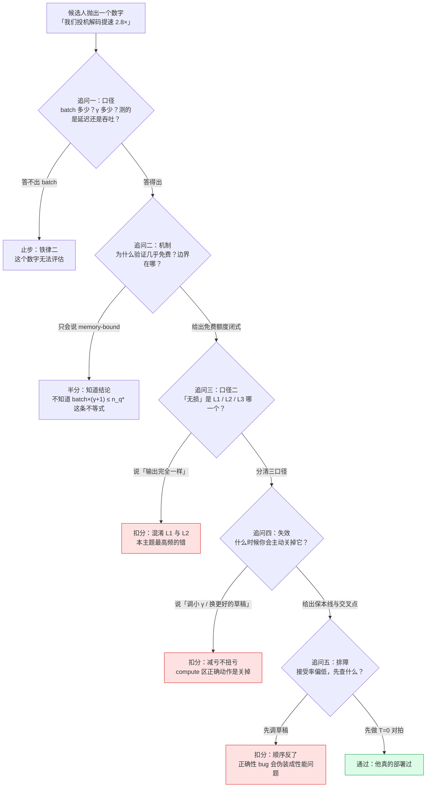

# 28 面试题库 —— 41 道能分出「读过」和「懂了」的题

## 1. 一句话

这一篇不是知识点罗列，是一套**判分工具**：41 道题，每一道都有一个**具体的数字或判据**作为落点，
每一道的答案都能追溯到本库某一篇或 `_lab/` 里的某个测试。
其中最后一组「照妖镜题」是本篇的灵魂 —— 它们被专门设计成**背过标准答案会答错、真懂了才答对**。

---

## 2. 怎么用这份题库

**给自测的人**：先不看答案写下你的回答，再展开对照。判分标准不是"说得对不对"，是**你有没有说出那个判据/那个数字**。
"投机采样是无损的"这句话，说不出 L1／L2／L3 是哪一个，按 0 分算。

**给出题的人**：本篇的题都是**追问型**的 —— 每道题下面附了一条「追问」，那才是真正分层的地方。
第一层答案网上都能查到，第二层要求候选人知道**这个结论什么时候不成立**。

**关于岗位场景**：这类岗位（推理引擎、推理优化、模型部署）常关心的不是"你会不会推公式"，
而是"你会不会在一个已经上线的系统里，判断这个优化该不该开、开了亏在哪、怎么把亏损量出来"。
本篇的题目权重因此偏向工程层与判断层。

> **本篇不含任何面经**。这里没有"某某公司考过"，一条都没有。所有题目由本库的正文与实验反推而来，
> 出处逐题标注；标注不到本库某篇或某个测试的题，本篇一律不出。

### 面试官会顺着哪条线追问

---

## 3. 基础层 —— 能不能说清机制（9 题）

对应 [[01-decode为什么慢-带宽墙与算力空转]]、[[03-并行验证为什么几乎免费-算术强度与roofline]]、[[04-拒绝采样修正-无损性的完整证明]]、[[05-接受率alpha-定义口径与怎么测]]。

**Q1.** 一次投机迭代里目标模型跑几次前向？为什么"验证 $\gamma+1$ 个位置"和"生成 1 个 token"能同价？把这条同价写成一个可判定的不等式。

参考答案

- **一次**。$\gamma$ 次串行草稿前向 + **1 次**目标模型并行验证前向。
- 同价的机制是**一条不对称**：访存 $M=P b_p+\text{batch}\cdot s\cdot\kappa$ **与 query token 数无关**（权重搬一次就够用，KV 只读前缀）；浮点 $F=n_q(2P+4sd)$ **与 query token 数严格成正比**。memory-bound 区里 $T=M/\text{BW}$ 压根不含 $n_q$。
- 可判定形式（免费额度）：$n_q\le n_q^{*}=I^{*}\dfrac{P b_p+\text{batch}\cdot s\cdot\kappa}{2P+4sd}$，即 $\textbf{batch}\times(\gamma+1)\le n_q^{*}$。
- **实测锚点**：llama3-70B、fp16、H100（$I^{*}=295.4$ FLOP/Byte）、seqlen=1024、$\gamma=4$ → $b_{\text{crit}}=68.7$；batch=68 判 memory（强度 292.8），batch=69 判 compute（296.5）。

**追问**：把 $\gamma$ 加倍和把 batch 加倍，对这条不等式的影响一样吗？（一样 —— 它们乘在同一侧，**抢的是同一个额度**。这是全库最省事的一条判据。）
**依据**：第 03 篇 §4.2–4.4；`_lab/test_speedup.py::test_weights_read_once_regardless_of_query_tokens`、`_lab/test_speedup.py::test_verify_is_nearly_free_in_memory_bound_region`

**Q2.** 为什么必须"首次拒绝即截断"？把被拒位置之后已经起草好的 token 留着继续验证，会发生什么？

参考答案

- $x_{i+1}$ 是在"前缀含 $x_i$"的条件下采出来的，而 $x_i$ 已被否掉、实际输出的是 $y\ne x_i$。此时 $q_{i+1}$ 的条件前缀与真实前缀不符，$p_{i+1}$ 也是按错误前缀算的。
- 证明里 $\Pr[Y=y,\text{接受}]=\min(p(y),q(y))$ 的成立依赖 $p_i$ 与 $q_i$ **条件在同一个前缀上**。对齐前提一破，**L1 分布无损**立刻失效。
- 后果的形态是**不报错**：程序照跑，只是输出分布悄悄偏了。

**追问**：这条"对齐前提"在树形草稿里最常见的破坏形态是什么？（position id 用了拍平后的下标而不是节点深度。）
**依据**：第 04 篇 §3.2 / §8 第 1 条；`_lab/test_tree.py::test_tree_attention_breaks_if_position_ids_wrong`

**Q3.** 拒绝之后必须从哪个分布重采？"直接从 $p$ 重采"错在哪，错多少？

参考答案

- 必须从**残差分布** $p'=\mathrm{norm}(\max(0,p-q))$ 采。
- 错在**已经用掉了一次信息**：被接受的部分已按 $\min(p,q)$ 流出去了；再按完整的 $p$ 补，"$q$ 低估的 token"会被补两次，"$q$ 高估的 token"被少补。代数上是 $(1-\beta)$ 约不掉：$\Pr[Y=y]=\min(p,q)+(1-\beta)p(y)\ne p(y)$。
- **量化后果**（口径：玩具马尔可夫模型 $|V|=5$、$\gamma=3$、batch 概念不适用，精确枚举而非采样）：首 token 分布的最大逐点误差，`naive_p` = **0.132**，`threshold`（写成 $p\ge q$ 就接受）= **0.224**，而正确写法是 $1.665\times10^{-16}$。
- 偏差的**方向**很危险：把目标模型往草稿模型的方向拽 —— 输出仍然通顺，只是换了个模型。

**追问**：这两种错法在监控上能看出来吗？（看不出来。它们不报错、不崩、困惑度也未必异常，只能靠精确枚举或大样本分布检验抓。）
**依据**：第 04 篇 §2.1 / §4.2；`_lab/test_lossless.py::test_naive_resample_is_biased`、`_lab/test_lossless.py::test_threshold_rule_is_biased`

**Q4.** "赠品 token"是什么？不发它会破坏 **L1 分布无损**吗？一次迭代的产出 $\tau$ 取值范围是多少？

参考答案

- $\gamma$ 个草稿全部被接受时，$p_{\gamma+1}$ 已经在同一次验证前向里算出来了，从它采一个白拿 —— 这就是 $\tau$ 的上界是 $\gamma+1$ 而不是 $\gamma$ 的原因。
- **不发它不破坏 L1 分布无损**：`no_bonus` 变体的最大逐点误差 $8.327\times10^{-17}$（同 Q3 口径），无偏，只是每轮少产出一个。
- $\tau\in[1,\gamma+1]$，**永远不会是 0**：最坏情况第一个草稿就被拒，仍然产出重采的那一个。这是"最坏也不会比不开慢太多"的结构性保证。
- 由此得到本库反复用的一条分类判据：**少发 token 只是慢，改分布才是错。**

**追问**：有人为了省一次采样，全接受时把最后一个草稿 token 再输出一遍。这算"少发"还是"改分布"？（改分布 —— 把第 $\gamma+1$ 个位置的分布换成了退化点分布，是错，不是慢。）
**依据**：第 04 篇 §2.1 / §3.2 / §7；`_lab/test_lossless.py::test_no_bonus_token_is_still_lossless`、`_lab/test_lossless.py::test_chunk_length_bounds`

**Q5.** $\beta=\sum_x\min(p,q)=1-\mathrm{TV}(p,q)$。为什么"草稿的 top-1 命中率高"**不蕴含**"采样接受率高"？举一个具体的数。

参考答案

- $\beta$ 是两条柱状图的**重叠面积**，它**只认重叠，不认排序**。两个分布可以 top-1 完全相同而 $\beta$ 很低（一个尖一个平），也可以 top-1 完全不同而 $\beta$ 很高（都很平坦）。
- 具体的数（$|V|=5$，batch 概念不适用）：$p=[0.50,0.20,0.15,0.10,0.05]$，$q'=[0.28,0.32,0.20,0.15,0.05]$。$T=1$ 时 $\beta=0.78$；但 $q'$ 的 argmax 是 token 1、$p$ 的 argmax 是 token 0，$T\to0$ 时两个分布塌成**正交**的点分布，$\beta\to\mathbf{0}$。
- 只挪了 **0.02** 的质量，就把两个温度下的接受率拉开到 0.78 与 0.00。

**追问**：那用蒸馏 loss（KL）当草稿质量的代理指标行不行？（有偏。$\beta=1-\mathrm{TV}$ 有界，KL 无界且对 $q$ 在 $p$ 低概率处极敏感；Pinsker 只给很松的单向界 $\beta\ge1-\sqrt{\mathrm{KL}/2}$。训草稿该盯 TV 或直接测接受率。）
**依据**：第 05 篇 §3.4 / §5.2；`_lab/test_lossless.py::test_beta_equals_one_minus_tv`

**Q6.** vLLM 同一次运行的同一段统计里，`mean_acceptance_length` = 1.2326、`draft_acceptance_rate` = 0.0775。它们矛盾吗？论文公式里的 $\alpha$ 是这两个中的哪一个？

参考答案

- **不矛盾，只是分母不同**。同一份 `acceptance_histogram = [39,1,0,3]`、$k=3$、43 轮、接受 10 个、起草 129 个：
  - (d) 平均接受长度 $=1+10/43=\mathbf{1.2326}$（分母是**轮数**，含赠品 token，值域 $[1,k+1]$）；
  - (c) token 级接受比例 $=10/129=\mathbf{0.0775}$（分母是**起草总数**，含拒绝点之后被作废的）。
- **论文里的 $\alpha$ 两个都不是**。它要换成"÷被验证过的位置数"：$39\times1+1\times2+0\times3+3\times3=50$，$\hat\alpha=10/50=\mathbf{0.2000}$。
- 代进闭式检验：$\alpha=0.0775$ 给 $E[\tau]=1.084$（偏 **−12.05%**），$\hat\alpha=0.20$ 给 1.248（偏 +1.25%）。**把 `draft_acceptance_rate` 当 $\alpha$ 用会低估 12%。**
- 口径：vLLM 官方文档样例，method=`ngram`，$k=3$，**模型／硬件／batch／温度原文未给出**，只能用于演示口径换算，不可横向比较。

**追问**：为什么 (c) 恒不大于 $\alpha$ 的无偏估计？（首次拒绝即截断：拒绝点之后的草稿被起草了、计入了分母，却从来没被验证过。$\gamma$ 越大白扔越多。）
**依据**：第 05 篇 §2 / §4 / §5.3

**Q7.** 树注意力是一种新算子吗？说清树形草稿里**必须同时正确**的三个量，以及各自写错的后果。

参考答案

- **不是新算子**。它只是把"可见集合"的定义从"下标序"换成"祖先序"；树退化成链时，祖先链 mask 就是普通下三角因果 mask，一位不差。
- 三个量：**mask**（`mask[i][j]` 为真当且仅当 $j$ 是 $i$ 的祖先含自己；写错 → 分支互相污染）、**position id**（必须是节点**深度**，不是拍平下标；写错 → 位置编码错位）、**KV 索引**（接受后按选中路径压实；写错 → cache 与实际前缀不符）。
- 等价性是可以算成一个数的：树拍平跑一次 vs 每条根到叶路径各跑一次，最大逐元素误差 $4.441\times10^{-16}$；把 position id 换成拍平下标，偏差 $>10^{-3}$。
- **兄弟必须互相不可见** —— 它们是两个互斥猜测，看见对方等于让目标模型在一个不存在的混合前缀上算概率。

**追问**：那真正的工程成本在哪？（不在 attention 计算，在构造 mask、维护 position id、接受后压实 KV 这三件杂活。链式的"压实"只是一行减法，树才需要真的重排 KV 索引。）
**依据**：第 16 篇 §3–§4；`_lab/test_tree.py::test_tree_attention_equals_per_chain`、`_lab/test_tree.py::test_siblings_cannot_see_each_other`、`_lab/test_tree.py::test_chain_mask_is_ordinary_causal_mask`

**Q8.** 加大 batch 也能把算术强度抬上去，为什么还需要投机采样？两者换来的东西一样吗？

参考答案

- **不一样。batch 提吞吐，投机降延迟。**
- 杠杆一（加大 batch）：权重项被 $B$ 条序列摊薄，$I_{\text{weight}}\approx B$。但它抬的是每卡每秒吐多少 token；对**单条请求**而言延迟只涨不降 —— 实测 llama3-70b、seqlen=1024、H100 SXM5、fp16：$B=1$ 时一次前向 42.249 ms，$B=64$ 时 48.560 ms。
- 杠杆二（每序列多喂 query token）：不增加并发，让**同一条请求**一次推进多个位置。
- 关键在于**两条杠杆抢的是同一份空转算力，而那份算力只够被薅一次**。所以适用判据是：**① 延迟敏感（TPOT 有 SLO）且 ② batch 打不满**，缺一条它就从"薅羊毛"变成"抢算力"。

**追问**：attention 那一项的强度能靠加 batch 抬起来吗？（不能。$I_{\text{attn}}=4qd/\kappa=qd/(Ld_{kv})$，$B$ 与 $S$ 全被约掉，唯一杠杆是 $q$。这正是长上下文下大 batch 仍然 memory-bound 的根。）
**依据**：第 01 篇 §4.5 / §4.7；`_lab/test_speedup.py::test_decode_is_memory_bound_at_batch_one`

**Q9.** 为什么 $T=0$ 时草稿模型再差也不会让输出出错，只会让它更慢？把两条路都走一遍。

参考答案

- $T\to0$ 时 $p=\mathbf e_a$（$a=\arg\max p$）、$q=\mathbf e_b$，草稿只会提出 $x=b$。
- **argmax 一致**（$a=b$）：$p(x)=q(x)=1\Rightarrow\min(1,p/q)=1\Rightarrow$ 必接受，输出 $a$。
- **argmax 不一致**：$p(b)=0\Rightarrow\min(1,0/1)=0\Rightarrow$ 必拒绝；残差 $\max(0,\mathbf e_a-\mathbf e_b)=\mathbf e_a$，归一化后仍是 $\mathbf e_a$，输出仍是 $a$。
- 两条路都输出 $\arg\max p$，判据里的随机数 $R$ 从未起作用。草稿差只是让第二种情形更频繁 → 每轮产出更少 → **更慢，但一个 token 都不会错**。这就是 **L2 贪心等价**。
- 实测：$|V|\in\{5,8\}$、草稿扰动 $\varepsilon\in\{0,1,3,8\}$、$\gamma\in\{2,4\}$ 共 16 组配置，argmax 一致率低至 0.500，生成 60 个 token 全部逐 token 相同（口径：玩具模型，batch 概念不适用）。

**追问**：$T=0$ 下有没有可能真的分叉？（有一种：argmax **平局**时，草稿与目标两侧的 tie-breaking 规则必须一致，否则序列会分叉。真实词表上罕见但非不可能，低精度下更容易碰到。）
**依据**：第 07 篇 §4.2 / §8 第 6 条；`_lab/test_caliber.py::test_greedy_speculative_equals_greedy`、`_lab/test_caliber.py::test_greedy_equivalence_holds_even_when_argmax_disagrees`

---

## 4. 数学层 —— 能不能推导与判定（9 题）

对应 [[04-拒绝采样修正-无损性的完整证明]]、[[06-期望接受长度与加速比模型-完整推导]]、[[16-树形草稿与树注意力-mask构造与验证]]、[[17-动态草稿长度与自适应停止]]、[[18-batch与吞吐-收益衰减曲线]]。

**Q10.** 推导 $\beta=\sum_x\min(p(x),q(x))$。为什么这一步必须"对草稿采到哪个 token 取边缘"？

参考答案

- $\beta=\sum_x q(x)\min\!\big(1,\tfrac{p(x)}{q(x)}\big)$（草稿采样与判据用的均匀随机数独立，联合概率相乘，再对互斥事件求和）。
- 逐项化简：$q(x)\le p(x)$ 时括号取 1，乘积 $=q(x)=\min$；$q(x)>p(x)$ 时括号取 $p/q$，乘积 $=p(x)=\min$；$q(x)=0$ 时两边都是 0。三种情形都落在 $\min(p,q)$ 上。
- **必须取边缘**的原因：$\beta$ 是"这个位置被接受"的概率，不是"给定 token $x$ 的接受概率 $\min(1,p(x)/q(x))$"。把这两者混为一谈是社区第二高频的错（第一高频是 Q3 的两种错法）。

**追问**：$\beta=1-\mathrm{TV}(p,q)$ 怎么由它得到？（用 $\min(a,b)=\frac{a+b-|a-b|}{2}$ 代入，两个 $\sum=1$ 提出来，剩下 $-\frac12\sum|p-q|=-\mathrm{TV}$。顺带：Leviathan 论文自造的 $D_{LK}$ 就是全变差距离，换了个名字而已。）
**依据**：第 05 篇 §3.2–3.3；`_lab/test_lossless.py::test_beta_equals_one_minus_tv`

**Q11.** 证明 $\sum_z\max(0,p(z)-q(z))=1-\beta$。这一步为什么必须用到 $\sum_z p(z)=1$？如果 $p$ 没归一化会怎样？

参考答案

- 用恒等式 $\max(0,a-b)=a-\min(a,b)$：$\sum_z\max(0,p-q)=\sum_z p-\sum_z\min(p,q)=1-\beta$。第二个等号处**直接用了 $\sum p=1$**。
- 这条恒等式是整个证明的关键：**残差的总质量恰好等于拒绝概率**，于是最后合并两条路径时 $(1-\beta)$ 被约掉，得到 $\Pr[Y=y]=\min(p,q)+\max(0,p-q)=p(y)$。
- **$p$ 未归一化时**（总质量 $Z\ne1$）：残差总质量变成 $Z-\beta$，而拒绝概率仍是 $1-\beta$，两者不再相等，约分失败，输出分布偏离。
- 工程含义：**接受判据必须在归一化之后的概率上做**，用 logits 或未归一化概率会破坏 **L1 分布无损**。

**追问**：$\beta=1$ 时残差怎么办？（$p=q$，永不拒绝，$p'$ 用不到 —— 代码里的兜底分支永远走不到。）
**依据**：第 04 篇 §4.2 (4.3)；`_lab/test_lossless.py::test_residual_mass_equals_rejection_prob`

**Q12.** $E[\tau]=\dfrac{1-\alpha^{\gamma+1}}{1-\alpha}$ 的前提是什么？Leviathan 论文写的 i.i.d. 是必要条件还是充分条件？

参考答案

- 推导链：$E[A]=\sum_{k=1}^{\gamma}\Pr[A\ge k]$，而 $\Pr[A\ge k]=\mathbb E\big[\prod_{i=1}^{k}\beta_i\big]$。
- 要把它变成 $\alpha^k$，需要**两条**前提（多数二手讲解只提一条甚至一条都不提）：
  - **前提 A（沿链不相关）**：$\beta_1,\dots,\beta_\gamma$ 互不相关 —— 乘积的期望才等于期望的乘积；
  - **前提 B（起点无偏）**：每轮迭代的起始上下文服从平稳分布 $\pi$，故 $\mathbb E[\beta_i]=\alpha$。
- **i.i.d. 是充分条件，不是必要条件。** 推导只用到"不相关"，不需要"同分布"。这个区别不是抠字眼 —— 真实模型里 $\beta$ 的波动幅度很大（远非同分布），但只要不相关，公式依然精确。

**追问**：那"$\beta$ 处处相同"这个说法呢？（更强、更错。它是 i.i.d. 的一个特例，而真实系统里从来不成立。）
**依据**：第 06 篇 §4.2–4.3；`_lab/test_accept.py::test_expected_tokens_matches_geometric_sum`

**Q13.** 有人说"$\beta$ 有波动，由 Jensen 不等式 $E[f(\beta)]\ge f(E[\beta])$，实际 $E[\tau]$ 应当**高于**公式值"。对吗？

参考答案

- **不对**，而且这正是本库第一次写错、被实测推翻的地方。
- 实测（口径：随机马尔可夫玩具模型，batch 概念不适用）：$|V|=8$、eps=3.0、$\gamma=4$ 时 $\beta$ 在 **0.1763–0.4492** 之间变化（跨度很大），而实测 $E[\tau]$ / 公式 $E[\tau]$ = **1.001**；四组配置的比值全部落在 0.997–1.023。**公式准到 2%–3% 以内。**
- 错在哪：推导要的从来不是"$\beta$ 是常数"，而是"$\beta_i$ 沿链不相关"。Jensen 那套推理对应的是另一个量（对 $\alpha$ 求 $f$ 再平均），根本没进到这条推导里。
- **这次证伪的收获是正的**：它把公式的适用范围**扩大**了 —— 只要接受难度不"连片"，即使各处接受率天差地别，公式仍然精确。

**追问**：那什么才会让公式失准？（见下一题：难度**连片**，即 $\beta$ 沿链正相关。）
**依据**：第 06 篇 §7.1；`_lab/test_accept.py::test_formula_accurate_when_uncorrelated`

**Q14.** 真实负载上"难的地方连着难"（代码块、长数字串）。此时公式是高估还是低估 $E[\tau]$？机制是什么？

参考答案

- **高估**。直觉上"正相关 → $E[\prod\beta]>\prod E[\beta]$ → 公式低估"，方向是反的 —— 这是本库第二次被实测推翻。
- 实测（黏性双区制玩具模型，$\gamma=8$，batch 概念不适用）：$\beta$ 一阶自相关 $\rho$ 从 $+0.041$ 升到 $+0.812$，实测/公式从 **1.012** 一路掉到 **0.895**，即最大高估 **10.5%**。
- **真正的机制在前提 B 不在前提 A**：公式里的 $\alpha$ 是平稳分布 $\pi$ 加权的，等价于默认"每轮迭代起点服从 $\pi$"。但迭代起点是上一轮结束的地方，而一轮在哪结束由拒绝决定 —— 这是对**更新过程**的抽样。难区起点的迭代明显更短（$E[\tau\mid$难$]=2.00$ vs $E[\tau\mid$易$]=4.74$），短迭代多 → 按迭代计数时难区被过采样（起点落难区从 0.38 升到 0.69）→ 每轮实际面对的接受率低于 $\alpha$。这是经典的**长度偏置**。
- 关键的对照：**token 流落难区恒为 0.50 = $\pi$** —— 输出流本身没偏，偏的只是"按迭代抽样"这个观测动作。

**追问**：所以这条公式该怎么用？（别用它预测加速比，直接测 acceptance length；别用它反推 $\alpha$；可以用它做定性判断 —— $\gamma$ 往哪调、$c$ 降一半值不值。）
**依据**：第 06 篇 §7.2–7.4；`_lab/test_accept.py::test_formula_overestimates_when_sticky`、`_lab/test_accept.py::test_hard_region_iterations_are_shorter`、`_lab/test_accept.py::test_token_stream_matches_stationary_distribution`

**Q15.** 推导 compute-bound 极限下的加速比渐近线，并说明为什么它**恒小于 1**。把接受长度顶到理论上限会怎样？

参考答案

- compute 区里 $T\propto\text{batch}\cdot n_q$。基线吞吐 $\text{TPS}_{\text{base}}=\text{peak}/F$；投机吞吐 $\text{TPS}_{\text{spec}}=\dfrac{\text{peak}}{F}\cdot\dfrac{E[\tau]}{\gamma+1}(1-s)$，其中 $s$ 为草稿占迭代的比例。两式相除：
$$\lim_{\text{batch}\to\infty}\text{speedup}=\frac{E[\tau]}{\gamma+1}(1-s)$$
- **恒小于 1** 的理由：$\tau$ 的上界就是 $\gamma+1$，故 $E[\tau]/(\gamma+1)\le1$；再乘 $(1-s)<1$，严格小于 1。
- $E[\tau]/(\gamma+1)$ 的物理含义是**算力有效利用率**：你让目标模型算了 $\gamma+1$ 个位置，只有 $E[\tau]$ 个变成产出，其余是为了买信息而故意浪费的算力。memory 区这份浪费不要钱，compute 区按全价收费。
- **顶满会怎样**：$E[\tau]=\gamma+1$ 时比值为 1，再乘 $(1-s)$ —— 只能**打平偏亏**，亏掉的正是草稿的开销（本库实测落在 0.9–1.0 之间）。
- 数值核对（口径：target=llama3-70b，draft=llama3.2-1b，$\gamma=4$，$E[\tau]=3.0$ 固定，fp16，8×H100 TP=8 忽略通信，测吞吐）：$3.0/5\times(1-0.056)=\mathbf{0.566}$，与 batch=1024 的实测完全一致。

**追问**：投机吞吐在 compute 区会随 batch 继续涨吗？（不会，batch 被约掉了 —— 它封顶。实测 batch 从 128 到 1024 涨 8 倍，投机吞吐只从 30 368 涨到 31 166（+2.6%），而基线从 18 628 涨到 55 016（+195%）。所以交叉点必然出现。）
**依据**：第 18 篇 §4；`_lab/test_speedup.py::test_compute_bound_asymptote_equals_wasted_compute_ratio`、`_lab/test_speedup.py::test_higher_accept_length_raises_but_cannot_save_asymptote`、`_lab/test_speedup.py::test_spec_throughput_saturates_while_baseline_keeps_climbing`

**Q16.** 定义保本线 $=T_{\text{iter}}/T_{\text{base}}$（要不亏本，$E[\tau]$ 至少要多大）。为什么它恒大于 1？什么情况下它会超过 $\gamma+1$，那意味着什么？

参考答案

- $T_{\text{iter}}=T_{\text{draft,total}}+T_{\text{verify}}>T_{\text{base}}$ 恒成立（草稿的 $\gamma$ 次前向总要花时间），故保本线 $>1$。$E[\tau]=1$（首个草稿就被拒）必然纯亏。
- 保本线随 batch 迅速抬升。口径：target=llama3-70b，$\gamma=4$，seqlen=1024，fp16，8×H100（TP=8，忽略通信），解析模型非硬件实测：batch=64 → 1.11；128 → 1.84；256 → 2.94；512 → 4.24；768 → 4.97；**1024 → 5.30**。
- $\gamma=4$ 时一次迭代最多产出 5 个 token。**保本线 5.30 > 5 意味着：哪怕草稿 100% 被接受、每轮吃满 5 个，仍然亏本。** 这不是"接受率不够高"，是数学上的不可能。
- 那个工作点上唯一正确的动作是**关掉投机** —— 不是调 $\gamma$、不是换草稿。
- 顺带一条方向性结论：草稿从 1.24B 换成 0.6B 的单层头，batch=1 的保本线从 1.07 掉到 1.03 —— 这就是历史上从"独立小模型草稿"转向"单层草稿头"的物理动力。

**追问**：把 $\gamma$ 从 4 调到 8，上限变成 9，是不是就有空间了？（不是。$E[\tau]=\sum_{k=0}^{\gamma}\alpha^k$ 对 $\gamma$ **指数饱和**，分母 $\gamma+1$ **线性增长**，$E[\tau]/(\gamma+1)$ 随 $\gamma$ 单调下降 —— 调大 $\gamma$ 在 compute 区只会亏得更多。）
**依据**：第 03 篇 §6.3、第 19 篇 §6.4；`_lab/test_speedup.py::test_breakeven_always_above_one`、`_lab/test_speedup.py::test_breakeven_can_exceed_theoretical_max`、`_lab/test_speedup.py::test_lighter_draft_lowers_breakeven`

**Q17.** 动态草稿长度的社区常见停止判据是"累积接受概率 $\alpha^{g+1}$ 降到草稿成本 $c$ 以下就停"。它错在哪？正确形式是什么？错多少？

参考答案

- 它把目标当成了**差值最大化**（收益减成本），而真正要最大化的是**比值** $\text{speedup}=N/D$。对比值而言，加一步划算的条件是 $\frac{\Delta N}{\Delta D}>\frac{N}{D}$，即**边际比大于当前平均比**。
- 代入 $\Delta N=\alpha^{g+1}$、$\Delta D=c$，正确判据是
$$\alpha^{g+1}>c\cdot\text{speedup}(g)$$
$\alpha^{g+1}>c$ 只是它在 $\text{speedup}=1$ 时的特例 —— 而我们开投机就是为了 $\text{speedup}>1$，所以旧判据**系统性过松，一定给出偏大的 $\gamma$**。
- 物理含义比代数更重要：那 $c$ 份时间的**机会成本不是零** —— 你本可以结束这一轮开始下一轮，而下一轮的产出速率就是当前的 speedup。旧判据忘了算机会成本。
- 量化（理想模型，batch 隐含为 1 且落在 memory-bound 区）：粗网格 16 格里旧判据 **16/16 全不一致且全偏大**，新判据 16/16 与暴力搜索一致。$(\alpha,c)=(0.9,0.05)$ 时 $\gamma$ 是 28 vs 13、理想加速比 3.9704 vs 4.6741（损失 **15.1%**）；细网格最差一格 $(0.98,0.05)$ 损失 **39.8%**。
- **它恰好在最需要它的地方最不准**：$\alpha$ 越高、$c$ 越小（越划算的场景），被忽略的机会成本越大。

**追问**：动态版怎么写？（把 $\alpha^{g+1}$ 换成本轮真实的累积接受概率 $R_g\hat\beta_{g+1}$，阈值取 $c\cdot S$，$S$ 是当前实际产出速率。这也给了"累计概率低于 0.3 就停"这类拍脑袋阈值一个物理量纲。）
**依据**：第 17 篇 §4.1–4.4；`_lab/test_accept.py::test_optimal_gamma_decreases_with_cost`、`_lab/test_accept.py::test_optimal_gamma_increases_with_alpha`

**Q18.** 同样的验证预算，该排成深链还是宽树？给出一条**可算的**判据，并说明它为什么不是"草稿好不好"。

参考答案

- 判据：**宽度值不值钱，取决于边际覆盖率增益 $c_k-c_1$**（top-$k$ 候选覆盖目标下一个 token 的概率相对 top-1 的增量），而不是"草稿准不准"。
- 模型（**L2 贪心/精确匹配口径**）：$k$ 叉树在预算 $n$ 下深度 $D$ 由 $\sum_{d=1}^{D}k^d\le n$ 定，期望接受长度 $=\sum_{d=1}^{D}c_k^{\,d}$。加宽度买到 $c_k$ 变大，代价是 $D$ 变小。
- 实测（$|V|=2000$、Zipf(2.0)，batch 概念不适用）：
  - agree=0.95：$c_1=0.608,c_2=0.760$（$c_2-c_1=+0.152$）→ 预算 8 时**链赢**（1.5227 vs 1.3380），预算 $\ge16$ 时**二叉树赢**（1.7772 / 2.1110 / 2.3648）。
  - agree=0.80：$c_2=c_1=0.608$（**边际增益恰好为 0**）→ **无论预算多大，链都赢**。
- 于是两个流行说法都被推翻：「树总是比链好，因为验证同价」（预算太小时加宽等于砍深度，砍得不值）；「草稿不准就该加宽树」（**整体跑偏**的草稿，宽度买不到任何东西）。
- **树要赢，两个条件缺一不可**：(i) 边际覆盖率增益显著 **且** (ii) 预算足够大。

**追问**：为什么真实最优树一定是不规则的？（兄弟分支的概率极不均匀 —— 第 1 个孩子值 0.6，第 8 个可能只值 0.005，给它预算纯属浪费。本表给的是规则树中的最优，是全局最优的**下界**。）
**依据**：第 16 篇 §5；`_lab/test_tree.py::test_width_is_worthless_without_marginal_coverage`、`_lab/test_tree.py::test_chain_beats_tree_at_small_budget`、`_lab/test_tree.py::test_tree_beats_chain_at_large_budget`

---

## 5. 工程层 —— 能不能落地与排障（9 题）

对应 [[19-负收益全解-什么时候投机反而更慢]]、[[20-主流引擎实现-vLLM与SGLang与TensorRTLLM]]、[[23-与其它优化的相互作用-量化与KVcache与PD分离]]。

### 5.1 A 组 · 排障

**Q19.** 你接手一个树形投机解码实现，接受率比论文报告低很多。按什么顺序排查？为什么顺序不能反？

参考答案

1. **树 / 逐链等价性对拍** —— 拿一棵小树拍平跑一次，再把每条根到叶路径当普通因果序列各跑一次，比 logits。mask、position id、KV 压实**任一处写错都会红**，成本极低。
2. 检查接受后 KV cache 有没有按选中路径正确压实。
3. 确认采样参数（温度／top-p／top-k）在目标与草稿两侧一致，且**草稿采样时用的那个 $q$ 被原样交给验证**（不是事后重算的）。
4. 以上都对，再去看树形状与草稿质量（Q18 的两个条件）。
- **顺序不能反的理由**：正确性 bug 会**伪装成性能问题**。position id 用错不会报错、不会崩，唯一表现就是"接受率莫名偏低"，于是人会去调草稿模型 —— 修了几周一个不存在的问题。先做"是错还是慢"的分类，再决定往哪儿使劲。

**追问**：最便宜的一条正确性检查是什么？（把温度设成 0 做逐 token 对拍。**L2 贪心等价**是确定性的，一条输出就能判定，能抓出绝大多数对齐类 bug —— position id、tokenizer、KV 回滚。这应当是上线前的第一项检查。）
**依据**：第 16 篇 §4.1 / §9、第 07 篇 §7 判据一；`_lab/test_tree.py::test_tree_attention_breaks_if_position_ids_wrong`

**Q20.** 两个报告：(a) $T=0.7$ 时开关投机输出序列不同；(b) $T=0$ 时开关投机输出序列不同。哪个是 bug？各自怎么查？

参考答案

- **(a) 不是问题**。**L1 分布无损**保证的是分布逐点相等，不是样本相同。投机改变了随机数的**消耗方式**（每个位置多消耗一个 $R$，拒绝时还要从残差分布再采一次，全接受时还要采赠品 token），固定种子也会得到不同序列。这与实现是否正确无关，是算法结构决定的。
- **(b) 是问题**，违反 **L2 贪心等价**。$T=0$ 下投机与贪心解码必须逐 token 相同（Q9 的两条路推导），不同就去查对齐前提：position id、tokenizer、采样参数两侧一致性、KV 回滚、argmax 平局的 tie-breaking。
- 验证 (a) 那类"分布对不对"的正确方式**不是对比单条输出**，而是二选一：① 大样本下比较 token 频率等统计量；② 在玩具规模上做精确枚举对拍。
- 这个混淆有源头：奠基论文的**摘要**写 "with identical outputs"，**正文**写 "without changing the model output **distribution**" —— 同一篇里两种口径并存，而多数二手讲解只抄了摘要那句。

**追问**：如果业务方就是要求"开关投机逐 token 一致"，你怎么回应？（唯一能做到的配置是 $T=0$。任何 $T>0$ 下要求这一点，是在要求一件数学上做不到的事 —— 先纠正需求，再谈实现。）
**依据**：第 07 篇 §2 / §4.1 / §7

**Q21.** 压测显示开投机后吞吐 +45%，于是上线。三周后用户抱怨变慢，但监控无报错、无 OOM、GPU 利用率正常。先查哪三处？

参考答案

1. **接受长度是否随运行时间退化。** 有一个未修复的公开报告：接受长度"smoothly and monotonically regresses over time"，**不会自行恢复，只有重启服务才立刻回到初始值**（某模型在 batch=4 下从 ~4.5 掉到 ~2.8，即 −38%；同一报告里 TensorRT-LLM 不退化）。动作：看 AL 历史曲线，或直接重启一次做对比。
2. **稳态并发是否已越过交叉点**（业务量涨了）。动作：扫并发画曲线，别用别人的阈值。
3. **prefix cache 命中是否被投机破坏。** 有一例 MTP 让 46 240 token 的 prompt 命中从 32 768 掉到 16 384，多付约 16 384 token 的重算，"the extra prefill cost can outweigh MTP's decode speed benefit"。动作：监控 TTFT 与命中率，不能只看 TPOT；注意某些版本开投机后压根不打 prefix cache 命中日志。
- **为什么第 1 条最重要**：两个区的加速比都对 $E[\tau]$ **线性**，AL 掉 38% 意味着同一工作点上收益也掉约 38%（这是基于本库解析模型的推断，原报告只给 AL 未给吞吐）。你压测 10 分钟看到的 1.8×，跑几小时后可能只剩约 1.1×，而**监控上看不到任何报错** —— 它不是错误，是缓慢的性能漂移。
- 可执行动作：把 AL 做成一等监控指标并设"相对启动值下降超过 X%"的告警；压测必须跑到与生产同量级的时长。

**追问**：为什么"GPU 利用率正常"完全不能排除问题？（decode 阶段的 MFU 天然是 0.3% 量级，该看的是 MBU；而且接受率退化不改变利用率，它改变的是"算出来的东西有多少变成了产出"。）
**依据**：第 19 篇 §9.2 / §9.3、第 01 篇 §7 坑三

### 5.2 B 组 · 口径

**Q22.** 某团队报告"我们的草稿模型接受率 41%"。你必须追问哪三项才能判断这个数字是好是坏？

参考答案

1. **分母口径**：是"÷起草总数"（vLLM 的 `draft_acceptance_rate`）还是"÷被验证过的位置数"（$\alpha$ 的无偏估计）？两者能差 12% 以上（Q6）。
2. **$\gamma$**：同一个 $\alpha=0.80$ 一动不动，只改 $\gamma$，token 级接受比例从 $\gamma=1$ 的 **0.8000** 一路掉到 $\gamma=12$ 的 **0.3104**。$\gamma=8$ 时恰好是 **0.4161** —— 也就是说 41% 可能对应一个相当好的草稿。
3. **温度**（以及草稿是贪心取 argmax 还是从 $q$ 随机采）。温度能改一半：好草稿 $T=0.02$ 时 0.6967、$T=0.1$ 时 0.6574、$T=20$ 时 0.9951；烂草稿从 0.0001 单调升到 0.9805。而 vLLM 的 `draft_sample_method` **默认是 `greedy`**，把 $q$ 当 one-hot，此时 $\beta=p(x^{*})$ —— 那已经是一个完全不同的量。
- 一句话：**只报接受率不报 $\gamma$ 和温度，这个数字无法解读。** 两个团队报 41% 和 80%，可能是同一对模型。

**追问**：接受率高就一定快吗？（不。它是**必要不充分**条件：它高不保证快，它低一定不快。看到接受率数字，正确的下一个问题是"$c$ 多少、batch 多少、验证还免不免费"。）
**依据**：第 05 篇 §4.3 / §6.1 / §7.3 / §8

**Q23.** 你在 vLLM 上量到 `acceptance_length = 2.07`，同事拿论文里的 "average accepted tokens = 2.07" 说"我们持平了"。哪里不对？

参考答案

- **口径差整整 1。** vLLM 算的是 $1+\dfrac{\text{接受的草稿数}}{\text{起草轮数}}$，**含 bonus token**，值域 $[1,K+1]$；多数论文报的"平均接受 token 数"**不含**那个 1，值域从 0 起。
- 同一台机器上，vLLM 的 2.07 对应论文口径的约 1.07。拿 2.07 比 2.07，等于拿 3.07 比 2.07。
- 速查判据：**看到一个"平均接受长度"，先问它能不能取到小于 1 的值。** 不能（下界 1.0）→ 引擎口径含赠品；能（下界 0）→ 论文口径，要加 1 才能比。
- 两大引擎在这一点上口径一致：vLLM 的 `mean_acceptance_length` 与 SGLang 的 `avg_spec_accept_length` 都含赠品（SGLang 源码注释 `num_accept_tokens = num_correct_drafts + 1`）。

**追问**：$K=3$ 时有人报 acceptance length = 4.5，可能吗？（不可能。$K=3$ 的引擎口径上限是 $K+1=4.0$。报出 4.5 的人一定用了别的口径 —— 或者别的 $K$。）
**依据**：第 05 篇 §4.4、第 20 篇 §5

**Q24.** 动态草稿长度上线后，接受长度 $E[\tau]$ 从 3.0 涨到 3.6，团队宣布"提速 20%"。问题在哪？

参考答案

- **没报 $E[\gamma]$**（平均草稿长度）。动态策略在易区把 $\gamma$ 顶满换来更长的接受长度，成本藏在草稿前向次数里，而那一项没进报表。
- 真实速率是 $\dfrac{E[\tau]}{E[\gamma]c+1}$。若 $E[\gamma]$ 同时从 4 涨到 8、$c=0.05$：$3.0/1.2=2.50$ vs $3.6/1.4=2.57$，**实际只有 +2.8%**，不是 +20%。
- 动态 $\gamma$ 下**不要再报 $\alpha$、也不要再套那条闭式**（求和上限成了随机变量，且与 $\beta$ 强正相关）。该报的是三个直接可测量：$E[\tau]$、$E[\gamma]$、以及 $E[\tau]/(E[\gamma]+1)$（算力有效利用率）。
- 另一个常见的做低基线：很多"动态 vs 静态"的对比，静态基线用的是论文默认值（如 $\gamma=5$）而不是**扫过的最优固定 $\gamma$**。看到"动态提升 X%"先问：静态基线调过没有。本库在扫过的强基线上，动态相对它只多 9%–18%。

**追问**：动态 $\gamma$ 会破坏无损性吗？（不会 —— 它只改"起草多少个"，不改接受判据，仍是 **L1 分布无损**。但它让"两次运行逐 token 相同"更难满足（迭代切分不同 → 浮点归约顺序随形状变），要 bit-wise 复现的场景应当锁静态 $\gamma$。）
**依据**：第 17 篇 §4.5 / §7.1 / §9

### 5.3 C 组 · 什么时候不该用投机解码（铁律三专组）

**Q25.** 负收益不止"大 batch"一条。给出**四个互相独立**的亏损通道，每条配一个可测量的触发条件。

参考答案

| # | 通道 | 可测量触发条件 |
|---|---|---|
| ① | **算力账**：验证进入 compute-bound | $\text{batch}\times(\gamma+1)>n_q^{*}$；或直接 profile：query token 数从 1 变 $\gamma+1$ 时耗时按 $\gamma+1$ 线性涨 |
| ② | **草稿账**：草稿前向本身太贵 | 草稿阶段占执行时间 >30%（有实测：独立小模型 Qwen3-0.6B 配 Qwen3-8B，**batch=1 时占 47%**，per-token 显存 ×1.77） |
| ③ | **分布账**：草稿在这段负载上不准 | 接受长度塌到约 1.3（有实测：训练窗口 2048 的草稿头用在 4K–64K 输入、batch=1 时 τ=1.28、**0.81×**） |
| ④ | **系统账**：亏在 decode 之外 | prefix cache 命中率下降 / CUDA graph 回退 eager / attention backend 不支持 `query_len>1` 被迫走 prefill kernel / 批量对齐开销（batch=1 约 13% → batch=32 接近 40%） |

- **关键点**：④ 类最难自查，因为你监控的指标可能根本看不到它 —— 你盯 TPOT 会看到改善，盯 TTFT 才发现总账是亏的。
- 还有一条常被忽略的前提：投机需要的不是 memory-bound，是**有闲置算力可以白拿**。消费级卡算力/带宽比不够时，memory-bound 也没东西可挪用（有实测：某双卡消费级配置上 88.3 → 88.2 tok/s，0%）。

**追问**：这四条里哪一条会让"接受率很高"依然亏？（全都会 —— ① 是接受率一点没变收益就翻转；② 有实测：平均接受 token 数 7.07（全表最高）而加速比 **0.87×**，batch=1，单卡 RTX A6000。）
**依据**：第 19 篇 §2 / §4 / §7.1；`_lab/test_speedup.py::test_speedup_collapses_at_large_batch_short_context`

**Q26.** 稳态并发从 8 涨到 200。请按顺序写出你的动作。为什么"把 $\gamma$ 调小"不是答案？

参考答案

1. **先测自己的交叉点**，不要用公开数字。公开来源的交叉点从 batch 8 到 128+ 都有，**取平均值当阈值是错的用法**。
2. **把解析模型算出的翻转点当上界，实际阈值设在明显更低处** —— 模型系统性忽略了 TP 通信、批内难度不齐、对齐开销、kernel launch，真实交叉点只会更早。
3. **按 batch 动态开关**：引擎自带的阶梯（如并发 ≥129 时 $K=0$）优先；不可用时退回网关层双实例（投机池 + 非投机池）按 QPS 分流。
4. **两条线一起监控**：吞吐与 P99 TPOT。它们在大 batch 下会给出**相反**的结论 —— batch=384 时吞吐是 0.813 倍（亏），但单请求 TPOT 仍可能更好。**先说清优化目标是延迟还是吞吐，再选曲线。**
- **为什么调小 $\gamma$ 不是答案**：$E[\tau]/(\gamma+1)$ 从 $3/5=0.60$ 变成 $2/3=0.667$，**确实变好了，但仍然 $<1$**。降 $\gamma$ 能减亏不能扭亏，因为只要 $E[\tau]<\gamma+1$ 就有浪费；$\gamma\to0$ 就是不开投机。**compute 区里正确的动作是关掉，不是调参。**

**追问**：什么情况下这条结论会反过来？（① 优化目标是 P99 TPOT 而非吞吐；② 长上下文把前向钉回 memory 区（但要 batch 够大，且受显存约束）；③ MoE —— 有实测在 MoE + 低精度权重上并发到 200 仍有约 +20% 吞吐，本库解析模型**未覆盖 MoE**，不对它给数值结论。）
**依据**：第 18 篇 §7 / §8、第 19 篇 §5.3 / §12.5；`_lab/test_speedup.py::test_speedup_is_monotone_decreasing_in_batch`

**Q27.** 有些情况不是"开了亏"，而是"不能开"或"开了就错"。各举两例，并说明怎么在上线前发现。

参考答案

**"不能开"（功能性拦截，会直接报错或跑不了）**
- 需要 beam search / `best_of`：vLLM 直接不支持；TensorRT-LLM 硬 raise。
- HF transformers 的 assisted generation 硬性只支持 `batch_size = 1`（源码 raise）。**它是本地单请求工具，不是服务栈**，拿它的加速比推服务端收益从一开始就错了。
- 昇腾后端的硬约束：`num_speculative_tokens + 1 ≤ 16`。

**"开了就错"（静默的正确性事故，不报错）**
- 树形草稿的 position id 用拍平下标 → 对齐前提破坏，**L1 分布无损**失效，表现只是"接受率莫名偏低"。
- SGLang 的 `--speculative-eagle-topk > 1` 配 `page_size > 1`：只有特定后端支持，其它 paged 后端上源码原话是 "is unstable and **produces incorrect results**"。
- DSpark 的 $K$ 小于 checkpoint block size：源码原话 "yields **incorrect (garbled) output rather than merely lower acceptance**"。
- 草稿从截断后的 $q$ 采样、验证却用未截断的 $q$ 算比值 —— 判据的分母错了，输出分布有偏。这不是效率问题。

**怎么发现**：① $T=0$ 逐 token 对拍（抓静默正确性）；② 树/逐链等价性对拍（抓 mask、position id、KV 压实）；③ 上线前把要用的特性组合逐项在**你自己的版本**上验一遍 —— 引擎文档的"限制"章节比参数表更容易过期，因为限制解除时没人回去删那句话。

**追问**：为什么"看起来能跑"完全不算验证通过？（因为这一类 bug 的定义就是不报错。形状对、程序跑通、输出通顺，唯一的痕迹是分布偏了或接受率低了。）
**依据**：第 20 篇 §7.1 / §7.3 / §8.4、第 05 篇 §7.2 情况三、第 16 篇 §4.1

---

## 6. 判断层 —— 能不能面对没见过的情况（6 题）

这一组是**开放题**，没有标准答案。下面给的是「好答案应当包含的要素」；面试时该看的是候选人**有没有主动问出缺失的口径**，而不是他背了什么。

**Q28.** 下一代硬件带宽翻倍而算力只涨 20%。投机采样的价值会怎么变？本库哪些数字要作废？

参考答案（好答案的要素）

- **抓住唯一的自变量**：屋脊点 $I^{*}=\text{peak}/\text{BW}$ 从约 295 降到约 177 → memory-bound 区变大 → 免费额度变大 → **所有交叉点右移，投机的可用区间变宽**。
- **说清哪些是硬件绑定的**：本库所有交叉点、$b_{\text{crit}}$、$s_{\text{crit}}$、量化冲突矩阵里的具体数字全部要重算；而"渐近线 $E[\tau]/(\gamma+1)(1-s)<1$"这条**不会变**，它不依赖硬件。
- **能区分"结论"和"数值"**：本库自己改一处系数（attention 浮点数补上层数）就让 batch=384 的加速比从 0.827 变成 0.813，而**一条结论都没变**。好的候选人会主动说出"哪些是结构性的、哪些是标定出来的"。
- **不外推没有数据的部分**：按同样逻辑，算力/带宽比继续升高应让窗口变窄 —— 但这是推理不是数据，不能当结论引用。本库对 Blackwell 上的投机实测标的是「未查证」。
- **加分项**：指出屋脊点在一阶近似下是 **TP 不变量**（加卡不能把你从 compute-bound 里救出来，只能让绝对时间变短、装得更多），所以"加卡就不崩了"是错的，而且方向反了（all-reduce 随卡数变差）。
**依据**：第 23 篇 §8 第 2 条、第 03 篇 §4.5、第 19 篇 §13.2

**Q29.** 你要在一个大 MoE 上决定开不开投机。公开来源的结论互相打架（有说 batch=1 就有 1.95×，有说超大 MoE 只有 1.10–1.22×，有说并发 200 仍 +20%）。你怎么决策？

参考答案（好答案的要素）

- **先承认这不是"谁对谁错"**：差异全在 MoE 规模与稀疏度、所处 batch 区间、对照基准三项没对齐。好答案会说"这四方结论口径不同，不能合表"。
- **给出唯一可执行的判据**：测「验证 $\gamma+1$ 个 token 时激活的专家**并集**」÷「验证 1 个 token 时激活的专家数」。比值 ≈1 → MoE 比 dense 更受益；比值接近 $\gamma+1$ → 差得多。**不要用别人的 MoE 结论。**
- **说清机制**：MoE 让"每 token 有效参数量"变小、"总权重读取量"随 batch 增长，两个效应叠加后免费额度的走向要按具体路由行为单独建模。本库的解析模型把 $P$ 当常数，**明确声明不适用于 MoE**，不给数值结论。
- **加分项**：注意到"并发 200 仍有收益"那一例同时叠了 MoE **和**低精度权重（MXFP4），两者对免费额度的作用方向相反 —— 换成 dense fp16，同样的并发早就翻车了。**并发数从来不是判据，"有没有进 compute-bound"才是。**
- **减分项**：把某一家的加速比直接搬到自己的模型上；或者反过来，因为"公开结论打架"就拒绝做判断。
**依据**：第 19 篇 §4.4、第 18 篇 §8 第 5 条、第 23 篇 §4.7、第 20 篇 §7.2 / §8.3

**Q30.** 业务方要求："开投机可以，但输出必须和以前一模一样，我们有回归用例。"你怎么回应？

参考答案（好答案的要素）

- **先纠正需求，再谈实现**。"和以前一模一样"是 **L2** 的要求；投机给的是 **L1 分布无损**。$T>0$ 时逐 token 一致在数学上做不到 —— 随机数消耗方式变了。
- **给出可行方案的分岔**：① 回归用例改成 $T=0$ 跑 → **L2 贪心等价**成立，逐 token 对拍即可，而且这本来就该是上线前的第一项检查；② 回归用例必须带温度 → 改成**分布级**验收（大样本 token 频率／困惑度对拍，或玩具规模精确枚举），不是单条比对。
- **主动说出批量实现的坑**：**L1 分布无损**是一条**理论性质**，**不是实现保证**。有工作指出现有批量投机实现普遍破坏输出等价性（批量下输出与逐条推理不一致）。所以"引擎宣称无损"不能替代你自己的对拍。
- **主动说出会破坏它的开关**：typical acceptance / relaxed acceptance / 静态集成验证（按 $w\,p+(1-w)\,q$ 验证）都是明确的 **L3 近似**；某些引擎在开着默认打开的 overlap scheduler 时会**静默把拒绝采样降级为贪心采样** —— 你什么都没改，$T>0$ 下的分布保证就没了。
- **加分项**：指出动态 $\gamma$ 仍是 L1，但会让 bit-wise 复现更难（迭代切分变 → 浮点归约顺序变），要严格复现就锁静态 $\gamma$。
**依据**：第 07 篇 §3 / §7、第 19 篇 §13.3、第 20 篇 §3.2

**Q31.** 让你设计一套"投机解码收益回归测试"，测什么、多久测一次、判什么标准？

参考答案（好答案的要素）

- **分两类，先正确性后收益**：
  - 正确性（每次改动都跑）：$T=0$ 逐 token 对拍；树/逐链等价性对拍；接受判据的分布对拍（玩具规模精确枚举）。
  - 收益（按周期跑）：在**目标 batch 区间**扫并发画曲线，同时记吞吐与 P99 TPOT 两条线。
- **必须打的四个监控点**：`mean_acceptance_length`（含 bonus，值域 $[1,K+1]$）、每轮实际草稿 token 数（结构化输出会让它小于 $K$）、TPOT P99（不是均值 —— 投机把延迟分布拉得更重尾）、总吞吐。
- **测试时长要与生产同量级**：接受长度存在随运行时间单调退化的未修复报告，只有重启能恢复。**短时压测结论不可信**，只测一次不算测过。
- **判据要绝对不要相对**：拿 `--breakeven` 算出的保本线做闸门 —— 实测接受长度 < 保本值就直接关。比任何定性建议都硬。
- **加分项**：指出量化之后的正确对照是**量化基线**而不是 fp16 基线（否则会把量化的功劳算到投机头上）；以及别只在 bs=1 做兼容性测试。
- **减分项**：只测 bs=1；只跑 10 分钟；只看接受率不看墙钟时间。
**依据**：第 20 篇 §8.5、第 19 篇 §9.2、第 23 篇 §7 第 2 条

**Q32.** 如果让你判断"树形草稿"这条路线未来会不会活下来，你会看哪几个量？

参考答案（好答案的要素）

- **把问题拆成两个可算的量**：树的成本由**节点总数**决定，收益由**被接受路径的深度**决定 —— 这两个量不是一回事，一维闭式 $E[\tau]=(1-\alpha^{\gamma+1})/(1-\alpha)$ 在树上不适用。
- **看边际覆盖率增益 $c_k-c_1$ 的走向**：它决定宽度值不值钱。如果草稿模型越做越准、且"知道自己不确定"（能把正确答案排进 top-2），宽度才继续有价值。
- **看免费额度**：树把 query token 数从 $\gamma+1$ 推到**节点总数**，一棵 64 节点的树在 batch=8 时就吃掉 512 个额度。硬件的算力/带宽比往哪走，直接决定线上树规模的天花板（今天通常只有几十个节点，不是几百）。
- **看工程成本是不是被摊平**：树的真实成本在 mask 构造、position id 维护、KV 压实、以及"接受后重排 KV 索引"这些杂活上，而不是注意力计算；再加上它与 CUDA graph 的天然冲突（形状动态）。这些能不能被引擎吸收掉，比算法本身更决定生死。
- **加分项**：指出"最优形状不是常数"（随预算与当前置信度变），所以静态树一定在某些位置上是错的 —— 这正是路线往"动态树"演化的原因；同时动态化又要付批内不齐的代价。
**依据**：第 16 篇 §5.4 / §7 / §8、第 03 篇 §8 第 7 条、第 17 篇 §7.3

**Q33.** 给你一篇你没见过的新论文（比如"把验证做进稀疏 attention"），你如何在 30 分钟内判断它值不值得试？

参考答案（好答案的要素）

- **第一步查口径，不是查结论**：batch 是多少？$\gamma$／树规模多少？测的是延迟还是吞吐？模型对与硬件精度？任务分布？**找不到 batch 就默认它是 1**，并对服务化收益打对折以上的折扣。
- **第二步查它是 L1 / L2 / L3 哪一个**：看拒绝分支从哪个分布重采，一眼就能定性。不同口径的方法**不能横比 acceptance length** —— L3 用分布正确性换来的接受长度，与 L1 的不是同一个量纲。
- **第三步做"三个量"的分离**：接受率 α、接受长度 τ、加速比。前两个是过程指标，只有第三个是收益指标。看到 3–7 之间的"加速比"先怀疑它其实是 τ。
- **第四步问它改的是哪一项账**：它是降 $c$（草稿更便宜）、升 $E[\tau]$（草稿更准）、还是改了"验证免费"这条前提本身？前两者只是**给整条加速比-batch 曲线乘一个常数**，交叉点右移但不会消失；只有第三类才可能改变结构。
- **第五步找它自己写的失效条件**：好论文会写（如"GQA 目标模型的加速预期更低"）。找不到失效条件的，先按营销文案处理。
- **加分项**：意识到"α → 加速比"之间**没有通用换算公式**（换算需要草稿成本、验证成本、框架开销三项，都是硬件与实现相关的）。**任何给出通用对照表的材料可以直接判定为不可信。**
**依据**：第 19 篇 §6.1 / §7.4 / §12、第 07 篇 §7 判据三、第 05 篇 §7.1

---

## 7. 照妖镜题 —— 专治背过答案但没懂的（8 题）

**这一组是本篇的灵魂。** 每道题都被设计成：按流传最广的说法回答会**错**，真懂了机制才答对。

**Q34.** 同一个 prompt、同一个 seed，开投机之后输出变了。是 bug 吗？

参考答案

**不是 bug**（在 $T>0$ 下）。
- 背错的人会说"投机是无损的，所以输出必须一样" —— 那是把 **L1 分布无损**读成了 **L2 贪心等价**。L1 说的是"输出流的联合分布与目标模型自回归分布逐点相等"，**它不蕴含 L2**。
- 机制：投机改变了随机数的**消耗方式**。朴素解码每产出一个 token 消耗 1 次随机数；投机每个位置要消耗一个接受判定的 $R\sim U(0,1)$，拒绝时还要从残差分布再采一次，全接受时还要采赠品 token。固定种子也走不出同一条路径。
- **只有 $T=0$ 才能要求逐 token 一致**。任何 $T>0$ 下提这个要求，是在要求一件数学上做不到的事。
- 用"对比单条输出"去验证 L1，永远会得到"不一致"，然后你会去修一个不存在的 bug。

**追问（真正分层的地方）**：那什么现象才**是** bug？（$T=0$ 下开关投机输出不同；或者 $T>0$ 下大量样本的分布统计对不上。前者一条输出就能判，后者要分布检验或精确枚举。）
**依据**：第 07 篇 §2 / §4.1 / §7 判据一

**Q35.** 把草稿模型换成一个**完全瞎猜**的模型（甚至故意把概率押在目标模型最不可能的 token 上），输出质量会变差吗？

参考答案

**不会变差，只会变慢。**
- **L1 分布无损与草稿模型的好坏完全无关。** 精确枚举实测（口径：玩具模型 $|V|\in\{3,4,5\}$、$\gamma\in\{1,2,3\}$，batch 概念不适用）：草稿烂到接受率只剩 **0.31**（每三次起草有两次被否），输出流前 3 个 token 的联合分布与目标链式概率的最大逐点误差**仍是 $10^{-17}$ 量级**。
- 推到极端：让草稿把几乎全部概率质量押在目标模型最不可能的 token 上（接受率 $<0.15$），结论不变。
- 机制：判据 $\min(1,p/q)$ 与残差补偿 $\mathrm{norm}(\max(0,p-q))$ 是**成对设计**的，$(1-\beta)$ 在合并两条路径时被约掉。$q$ 从头到尾没有出现在最终分布里。
- 由此得到工程上该往哪儿使劲的判据：**调草稿是调性能，调修正是调正确性。**

**追问**：那"草稿模型越小越好"对吗？（不对，这是另一个方向的错。$c$ 降 → $\gamma^{*}$ 变大、加速比升；但 $\alpha$ 掉下来收益也掉。$\alpha=0.9,c=0.05$ 时理想加速比 4.674；换个更小的草稿使 $c=0.02$ 但 $\alpha$ 掉到 0.75，加速比只有约 3.2 —— **反而更差**。口径：理想模型，batch 隐含为 1 且落在 memory-bound 区。两边都要看。）
**依据**：第 04 篇 §6、第 06 篇 §9 第 2 题；`_lab/test_lossless.py::test_exact_distribution_lossless`、`_lab/test_lossless.py::test_lossless_holds_for_adversarial_draft`

**Q36.** 有人把接受判据从 $\min(1,p/q)$ 改成"$p(x)\ge\varepsilon$ 就接受"，用 $\varepsilon=0.05$，说"阈值这么小，偏差可以忽略"。他若把阈值**调保守一点**（比如 0.5），偏差会变小吗？

参考答案

**两处都错，而且第二处与直觉相反：调保守偏差反而更大。**
- 实测（$|V|=5$、$\gamma=3$、$p=[0.2024,0.1564,0.3386,0.1982,0.1045]$，batch 概念不适用）：首 token 最大逐点误差随阈值 $\varepsilon$ 变化 —— 0.00 / 0.02 / 0.05 / 0.10 都是 **0.1719**；0.20 涨到 **0.2201**；0.50 涨到 **0.6598**。
- **第一处错**：$\varepsilon$ 很小时判据事实上等于"无条件接受草稿"，输出分布**就是草稿分布 $q$**，误差 $=\max|p-q|=0.1719$ —— 这是偏差的**最大值**，不是最小值。$\varepsilon$ 从 0 涨到 0.10 期间误差纹丝不动，因为本例 $p$ 的最小分量是 0.1045，阈值还没够到任何 token。
- **第二处错（照妖镜的核心）**：被拒绝的质量走的是 $\mathrm{norm}(\max(0,p-q))$ 这条补偿路径，而**那条补偿是专为 $\min(1,p/q)$ 判据配套设计的**。换了判据补偿就不再匹配；拒绝得越多，走错路的质量越多，偏差越大。
- 结论写成一条判据：**判据与补偿必须成对更换。只改判据不改补偿，"调保守"反而更糟。**
- 这解释了为什么严肃的近似方法都要**重新推导整套接受-补偿机制**，而不是在原判据上加个阈值。
- 口径声明：上面用的是该**类**判据的简化模型，不是任何一个具体方法的确切规则；数字用来说明机制，不能当作某方法的实测偏差。

**追问**：$\varepsilon=0.2$ 的误差 0.2201，和"判据写成 $p\ge q$ 就接受"的 0.2238 几乎一样。它们是同一类问题吗？（不是。后者是**实现写错了**（作者以为自己在做 L1），前者是**明知会偏、为换速度主动选的 L3**。数字分不出它们，只有意图和文档能分出来 —— 这就是口径标注不是形式主义的原因。）
**依据**：第 07 篇 §4.3 / §5；`_lab/test_caliber.py::test_raising_threshold_makes_bias_worse_not_better`、`_lab/test_caliber.py::test_zero_threshold_reproduces_draft_distribution`

**Q37.** 你把接受率从 0.30 提到 0.43，一定会更快吗？

参考答案

**不一定，而且有实测是反的。**
- 反例（同一任务、同一目标模型，batch 原文未给出、推定为 1，硬件与 $\gamma$ 原文未给出 →【口径不全，不可横向比较】）：蒸馏草稿 $\bar\alpha=0.43$ → 加速 **1.03×**，草稿前向 **0.033 s**；n-gram 草稿 $\bar\alpha=0.30$ → 加速 **1.39×**，草稿前向 **0.001 s**。**接受率低 30%（相对），加速比高 35%（相对），唯一原因是草稿成本差 33 倍。**
- 独立同向证据（batch 全程固定为 1，4×A100，贪心，目标 OPT-66B / LLaMa-65B）：增大草稿模型**持续提升接受率却持续降低吞吐**，OPT-350M / 1.3B / 6.7B 的端到端吞吐都不如 OPT-125M。原文结论是 "The key bottleneck in speculative decoding is the draft model's latency."
- 机制在公式里就写着：$\text{speedup}=E[\tau]/(\gamma c+1)$。$\alpha$ 只进分子，$c$ 进分母。**只看一个必然做错决定。**
- 更极端的一例：某方法平均接受 token 数 **7.07（全表最高）**，加速比 **0.87×**（比不开还慢 13%；口径：单卡 RTX A6000 48GB、float16、batch=1、目标 8B 模型）。同一张表里，两个指标的排序完全相反。
- **该看什么**：接受率与接受长度是**过程指标**，只有实测墙钟时间是**收益指标**。

**追问**：那"$\alpha$ 提 5 个点收益有多大"这个问题能算吗？（能做定性判断，但**没有通用换算公式** —— 换算需要草稿成本、验证成本、框架开销三项，全是硬件与实现相关的。任何给出通用"α → 加速比"对照表的材料，可以直接判定为不可信。）
**依据**：第 19 篇 §7.1–7.4 / §12.6、第 06 篇 §4.5

**Q38.** 在 bs=1 上测出"int4 + 投机"和"fp16 + 投机"加速比都是 2.8×，据此说"量化和投机完全兼容"。对吗？

参考答案

**不对，而且这正是这个坑难被发现的原因。**
- 口径（本库解析模型，非硬件实测）：target=llama3-70b，draft=llama3.2-1b，$\gamma=4$，$E[\tau]=3.0$，seqlen=1024，8×H100（TP=8，忽略通信），测吞吐。
- 六种精度组合的 **bs=1 加速比全在 2.795–2.802 之间**（几乎不变），但**加速比跌破 1.0 的 batch** 从 fp16/fp16 的 **265** 一路塌到 int4/fp8 的 **52** —— 可用区间缩小到约五分之一。
- 机制：投机的收益来自"访存已经付过钱、算力还闲着"这份冗余，而**权重量化的本职工作就是把访存砍下去** —— 它在削减投机赖以为生的那份冗余。免费额度 $n_q^{*}$ 大约随 $b_p$ 等比缩小（int8 减半，int4 减到四分之一）。
- **bs=1 时两者都在 memory-bound 区深处，验证都免费，所以加速比当然相同。差别只在大 batch 才显现。**
- 还有第三条更重要的：**量化让基线本身快了**（bs=1 基线从 189.4 到 755.6 tok/s）。所以正确的比较方式不是"加速比有没有变小"，而是**"两条路各自的绝对吞吐哪个高"** —— 一个 int4 基线（755.6）已经比 fp16 开投机（530.4）更快。在这种情况下问"投机还有没有加速"是问错了问题。
- **判据**：兼容性测试必须扫 batch，不能只测 bs=1；开了量化之后正确的对照是**量化基线**，不是 fp16 基线。

**追问**：那"竞争关系"是不是意味着二选一？（不是。量化 + 投机在小 batch 下仍然都是净收益，只是**收益不叠加、可用区间变窄**。结论是**要一起调**（chunk 大小、batch、$\gamma$ 放在一张账本上），不是二选一。）
**依据**：第 23 篇 §4.1 / §7、第 03 篇 §7.5；`_lab/test_speedup.py::test_weight_quantization_shrinks_the_usable_batch_range`、`_lab/test_speedup.py::test_quantization_speeds_up_the_baseline_too`

**Q39.** 大 batch 下投机开始亏了。把 $\gamma$ 从 4 调到 2 能救吗？

参考答案

**能减亏，不能扭亏。**
- 渐近线是 $\dfrac{E[\tau]}{\gamma+1}(1-s)$。$\gamma$ 从 4 到 2、$E[\tau]$ 相应从 3.0 到 2.0：$3/5=0.60 \to 2/3=0.667$ —— **确实变好了，但仍然小于 1**。
- 只要 $E[\tau]<\gamma+1$ 就有浪费；$\gamma\to0$ 的极限就是不开投机（比值 →1）。**所以大 batch 下正确的动作是关掉投机，而不是调小 $\gamma$。**
- 反方向也别做：调大 $\gamma$ 更糟。$E[\tau]=\sum_{k=0}^{\gamma}\alpha^k$ 对 $\gamma$ **指数饱和**，分母 $\gamma+1$ **线性增长**，$E[\tau]/(\gamma+1)$ 随 $\gamma$ 单调下降。
- 更硬的一条：某些工作点上**保本线本身超过了 $\gamma+1$**（口径：8×H100 TP=8、batch=1024、seqlen=1024、$\gamma=4$ 时保本需 5.30 > 5）。那里哪怕草稿 100% 被接受也亏本 —— **不是接受率不够高，是数学上的不可能**。
- 官方口径也在同一个方向：某引擎的官方动态阶梯示例里，并发 ≥129 时直接把 $K$ 设成 **0**（完全不产草稿）。**官方自己给的"什么时候该关掉"就是这一行。**

**追问**："换个更准的草稿"能救吗？（同样只是右移不是消除。两个区的加速比都对 $E[\tau]$ **线性**，把草稿做准等于给整条曲线乘一个近似常数 —— 有一次样本外核对：用倍率 1.3458 预测新一代方法的交叉点在 batch≈53.6，实测 ≈56.4，误差约 5%。交叉点右移了约一倍，但**它还在那儿**，因为渐近线也被同样地乘了，而它的上限是 $1\cdot(1-s)<1$。）
**依据**：第 18 篇 §9 第 2 题、第 19 篇 §6；`_lab/test_speedup.py::test_higher_accept_length_raises_but_cannot_save_asymptote`、`_lab/test_speedup.py::test_breakeven_can_exceed_theoretical_max`

**Q40.** 扫描表显示：batch 从 64 涨到 1024，"草稿占迭代时间"从 10.2% 掉到 5.7%。有人说"草稿开销占比下降了，说明投机在大 batch 下更划算"。对吗？

参考答案

**彻底的因果倒置。**
- 占比 $=$ 草稿时间 / 迭代时间。**草稿时间几乎没变**（草稿在这些 batch 下仍是 memory-bound），占比掉下去是因为**分母（验证时间）膨胀了** —— 验证进了 compute 区，成本按 $\gamma+1$ 线性涨。
- 对照同一张表的"验证阶段"那一列就能看见：占比开始下降的那一格（batch=128），**恰恰是验证阶段从 `memory` 翻成 `compute` 的那一格**。
- 同一段区间里加速比从 2.693（batch=64）崩到 0.566（batch=1024）。口径：target=llama3-70b，draft=llama3.2-1b，$\gamma=4$，$E[\tau]=3.0$，seqlen=1024，fp16，8×H100（TP=8，忽略通信），测吞吐，解析模型非实测。
- **判据：看"草稿占比"之前，先看"验证阶段"那一列。** 分母在变的比值，读不出任何关于分子的结论。
- 反过来看长上下文那一行：seqlen 从 1024 到 16384，batch=64 那一格草稿占比从 10.2% **涨到 23.3%** —— 这才是真的坏消息（草稿模型也要读自己的 KV，长上下文下这笔开销按比例放大）。**"草稿很便宜"这个前提在长上下文下会松动**，选草稿时要看的不只是参数量，还有它的 KV 结构（层数 × KV 头数）。

**追问**：那"草稿占比 5.7%–23.3%"这个区间是可靠的吗？（是**乐观下界**。它只算了草稿的 GEMM 与 attention 主项；真实系统里草稿的 $\gamma$ 次前向每次都要付一整轮 kernel launch、采样、调度，而草稿单次前向只有 0.09 ms 量级 —— 在这个尺度上固定开销与计算时间同量级。）
**依据**：第 03 篇 §6.2 / §9 第 4 题、第 18 篇 §7 第 5 条

**Q41.** 两个工作点：(a) batch=256、seqlen=1024；(b) batch=16、seqlen=16384。两者的 $N=\text{batch}\times\text{seqlen}$ 相同（262 K），KV 占访存的比例也**完全相同**（37.8%）。为什么加速比一个是 1.020、另一个是 2.510？

参考答案

**因为 $N$ 只决定"KV 流量够不够大"，决定"验证还免不免费"的是另一个条件。**
- 条件 A（KV 流量是否超过权重流量）是 $N>P b/\kappa$，右边是**常数**，与你把 $N$ 切成"大 batch 短序列"还是"小 batch 长序列"完全无关 —— 所以两行的 KV 占比一模一样，这没错。
- 但条件 C（验证前向是否仍 memory-bound）**不是 $N$ 的函数**：算力项是 $\text{batch}\cdot q\cdot(2P+4Sd_{\text{model}})$，其中 $q=\gamma+1$。它对 batch 与 seqlen 的依赖**不对称** —— batch 直接乘在算力项上，seqlen 只进 $4Sd$ 那一小项，却同时把访存项撑大。
- 于是 (a) 的 $\text{batch}\times(\gamma+1)=256\times5=1280$ 早已越过免费额度，验证按全价收费；(b) 的 $16\times5=80$ 还在额度内。
- 口径（两行同一套）：target=llama3-70b，draft=llama3.2-1b，$\gamma=4$，$E[\tau]=3.0$ 固定，fp16，8×H100（TP=8，忽略通信），测吞吐，解析模型非硬件实测。
- **这道题专治"把 batch×seqlen 当成单一自变量"的直觉。** 长上下文对投机友好，靠的不是 $N$ 大，是 **KV 访存把前向钉在 memory 区而算力项没跟着涨**。

**追问**：那"长上下文对投机友好"这句话的完整形式是什么？（**长上下文 + 足够大的 batch 才友好**，两个条件缺一不可。batch=1 时免费额度反而随上下文变长而**缩小**（seqlen 1024 → 8192 时从 291 掉到 261），因为 KV 访存只有 $1\times\text{seqlen}\times\text{kv}$，而 attention 算力项按 $L\cdot\text{seqlen}$ 增长，分母涨得比分子快。而且长上下文换来另一堵墙：**显存装不下大 batch**。）
**依据**：第 22 篇 §3.2 / §4.1、第 23 篇 §4.3；`_lab/test_speedup.py::test_free_budget_shrinks_with_context_at_batch_one`、`_lab/test_speedup.py::test_free_budget_grows_with_context_length`、`_lab/test_speedup.py::test_long_context_large_batch_may_not_fit`

---

## 8. 自评：答对多少算什么水平

| 你能稳定答对 | 说明 | 建议补哪几篇 |
|---|---|---|
| 基础层 < 6 题 | 只读过科普，没读过算法 | [[02-最小可跑的投机采样-手算一遍]] → [[04-拒绝采样修正-无损性的完整证明]] |
| 基础层 ≥ 7，数学层 < 5 | 会用，不会判 | [[05-接受率alpha-定义口径与怎么测]] → [[06-期望接受长度与加速比模型-完整推导]] |
| 数学层 ≥ 7，工程层 < 5 | 会推，没上过线 | [[19-负收益全解-什么时候投机反而更慢]] → [[20-主流引擎实现-vLLM与SGLang与TensorRTLLM]] |
| 工程层 ≥ 7，照妖镜 < 4 | 背过结论，没打通机制 | [[07-无损的三种口径-分布无损不等于结果相同]]、[[18-batch与吞吐-收益衰减曲线]]、[[23-与其它优化的相互作用-量化与KVcache与PD分离]] |
| 照妖镜 ≥ 6 | 你真的部署过，并且被坑过 | [[24-前沿进展-2025到2026]]、[[25-未来判断-哪些方向会活下来]] |

**三条通用扣分项**（不管答的是哪一层）：

1. 说"无损"却说不出是 **L1 分布无损 / L2 贪心等价 / L3 近似**中的哪一个；
2. 报加速比不报 batch（其次是 $\gamma$、测的是延迟还是吞吐）；
3. 只讲这个方法好在哪，讲不出**一条可判定的失效条件**。

---

## 9. 延伸与双链

- 机制与数学：[[01-decode为什么慢-带宽墙与算力空转]]、[[03-并行验证为什么几乎免费-算术强度与roofline]]、[[04-拒绝采样修正-无损性的完整证明]]、[[05-接受率alpha-定义口径与怎么测]]、[[06-期望接受长度与加速比模型-完整推导]]、[[07-无损的三种口径-分布无损不等于结果相同]]
- 工程与系统：[[16-树形草稿与树注意力-mask构造与验证]]、[[17-动态草稿长度与自适应停止]]、[[18-batch与吞吐-收益衰减曲线]]、[[19-负收益全解-什么时候投机反而更慢]]、[[20-主流引擎实现-vLLM与SGLang与TensorRTLLM]]、[[22-长上下文下的投机采样]]、[[23-与其它优化的相互作用-量化与KVcache与PD分离]]
- 误解与判据的完整清单（本篇的姊妹篇）：[[27-常见误解与判据]]、[[26-社区精彩解释精选-好在哪与错在哪]]
- 收束：[[29-本质总结-第一性原理]]、[[00-总览与知识地图]]

---

### 本篇验证

**本篇的验证方式与其它篇不同：本篇没有自己的新数学命题，它的可核验性在于「每道题的依据都指向本库某篇或某个测试」。**
41 道题全部标注了依据，其中 31 道直接指向 `_lab/` 里的具体测试函数，其余指向正文小节。
下面列出本篇引用到的全部测试（**均可在 `_lab/` 下 `python -m pytest -q --collect-only` 中找到**，零虚引）：

**无损性与判据（第 04 / 05 / 07 篇的题）**

- `_lab/test_lossless.py::test_exact_distribution_lossless` —— Q35 的"草稿好坏不影响分布"。
- `_lab/test_lossless.py::test_lossless_holds_for_adversarial_draft` —— Q35 的极端情形（接受率 <0.15 仍精确无损，**L1 分布无损**）。
- `_lab/test_lossless.py::test_naive_resample_is_biased`、`_lab/test_lossless.py::test_threshold_rule_is_biased` —— Q3 的两种错法。
- `_lab/test_lossless.py::test_no_bonus_token_is_still_lossless`、`_lab/test_lossless.py::test_chunk_length_bounds` —— Q4 的"少发 token 只是慢"与 $\tau\in[1,\gamma+1]$。
- `_lab/test_lossless.py::test_beta_equals_one_minus_tv`、`_lab/test_lossless.py::test_residual_mass_equals_rejection_prob` —— Q5、Q10、Q11。
- `_lab/test_caliber.py::test_greedy_speculative_equals_greedy`、`_lab/test_caliber.py::test_greedy_equivalence_holds_even_when_argmax_disagrees` —— Q9、Q20 的 **L2 贪心等价**。
- `_lab/test_caliber.py::test_raising_threshold_makes_bias_worse_not_better`、`_lab/test_caliber.py::test_zero_threshold_reproduces_draft_distribution` —— **Q36 照妖镜的判定性依据**。

**接受率与加速比模型（第 05 / 06 / 17 篇的题）**

- `_lab/test_accept.py::test_expected_tokens_matches_geometric_sum` —— Q12。
- `_lab/test_accept.py::test_formula_accurate_when_uncorrelated` —— **Q13**（$\beta$ 波动大但不相关时公式仍精确）。
- `_lab/test_accept.py::test_formula_overestimates_when_sticky`、`_lab/test_accept.py::test_hard_region_iterations_are_shorter`、`_lab/test_accept.py::test_token_stream_matches_stationary_distribution` —— **Q14**（高估方向与长度偏置机制）。
- `_lab/test_accept.py::test_optimal_gamma_decreases_with_cost`、`_lab/test_accept.py::test_optimal_gamma_increases_with_alpha` —— Q17 的边际判据必须与之一致。

**物理账与负收益（第 01 / 03 / 18 / 19 / 22 / 23 篇的题）**

- `_lab/test_speedup.py::test_weights_read_once_regardless_of_query_tokens`、`_lab/test_speedup.py::test_verify_is_nearly_free_in_memory_bound_region` —— Q1 的核心不对称。
- `_lab/test_speedup.py::test_decode_is_memory_bound_at_batch_one` —— Q8。
- `_lab/test_speedup.py::test_compute_bound_asymptote_equals_wasted_compute_ratio`、`_lab/test_speedup.py::test_spec_throughput_saturates_while_baseline_keeps_climbing`、`_lab/test_speedup.py::test_higher_accept_length_raises_but_cannot_save_asymptote` —— Q15、Q39。
- `_lab/test_speedup.py::test_breakeven_always_above_one`、`_lab/test_speedup.py::test_breakeven_can_exceed_theoretical_max`、`_lab/test_speedup.py::test_lighter_draft_lowers_breakeven` —— Q16。
- `_lab/test_speedup.py::test_speedup_collapses_at_large_batch_short_context`、`_lab/test_speedup.py::test_speedup_is_monotone_decreasing_in_batch` —— Q25、Q26。
- `_lab/test_speedup.py::test_weight_quantization_shrinks_the_usable_batch_range`、`_lab/test_speedup.py::test_quantization_speeds_up_the_baseline_too` —— **Q38 照妖镜**。
- `_lab/test_speedup.py::test_free_budget_shrinks_with_context_at_batch_one`、`_lab/test_speedup.py::test_free_budget_grows_with_context_length`、`_lab/test_speedup.py::test_long_context_large_batch_may_not_fit` —— **Q41 照妖镜**。

**树形草稿（第 16 篇的题）**

- `_lab/test_tree.py::test_tree_attention_equals_per_chain`、`_lab/test_tree.py::test_siblings_cannot_see_each_other`、`_lab/test_tree.py::test_chain_mask_is_ordinary_causal_mask` —— Q7。
- `_lab/test_tree.py::test_tree_attention_breaks_if_position_ids_wrong` —— Q2、Q19。
- `_lab/test_tree.py::test_width_is_worthless_without_marginal_coverage`、`_lab/test_tree.py::test_chain_beats_tree_at_small_budget`、`_lab/test_tree.py::test_tree_beats_chain_at_large_budget` —— Q18。

**可复跑**（在 `_lab/` 目录下执行，用来现场核对本篇引用的数字）：

- `python spec.py --bias` —— Q3 的错法偏差表（`naive_p` 0.132、`threshold` 0.224、`no_bonus` $8.3\times10^{-17}$）
- `python spec.py --proof` —— Q35 的精确枚举误差表（接受率 0.31 时误差仍是 $10^{-17}$ 量级）
- `python caliber.py --greedy` / `--typical` —— Q9 的 16 组 **L2 贪心等价**对拍；Q36 的阈值-偏差表（0.1719 → 0.2201 → 0.6598）
- `python accept.py --table` / `--temp` —— Q17 的 $\gamma^{*}$ 扫描；Q22 的温度表（好草稿 0.6967 → 0.6574 低谷 → 0.9951）
- `python regime.py --sweep` / `--renewal` —— Q14 的两张表（实测/公式 1.012 → 0.895；起点落难区 0.38 → 0.69）
- `python speedup.py --batch` / `--breakeven` / `--quant` —— Q15、Q16、Q38、Q40、Q41 的全部解析数字
- `python tree.py --mask` / `--shape` —— Q7 的等价性误差 $4.441\times10^{-16}$；Q18 的三张深宽比较表
- `python verify.py --tests` —— 强制核对本篇引用的每个测试都真实存在

### 本篇来源

**本篇不引入任何新的外部来源。** 每道题的证据链都止于本库既有篇目，而那些篇目各自的一手出处已在它们的「本篇来源」里逐条给出。
下面只说明各组题的证据主要落在哪里，以及引用时必须一并带上的口径提醒：

- **基础层 / 数学层**：证据是**数学命题 + 精确枚举**，全部来自 `_lab/` 的可复跑实验，与硬件无关，不存在口径不可比的问题。唯一需要声明的是玩具规模（$|V|$ 通常为 5–8，batch 概念不适用）—— 它证明的是**结论的真假**，不是量级。
- **物理账（Q1、Q8、Q15、Q16、Q38、Q40、Q41）**：数字全部来自本库自建解析模型 `_lab/speedup.py`，**不是硬件实测**。它忽略 TP 通信、norm/softmax、kernel launch、调度、反量化开销，是**乐观上界**，真实翻转点只会更早。硬件口径统一为 NVIDIA H100 SXM5：HBM3 带宽 3.35 TB/s、BF16 **稠密**峰值 989.5 TFLOPS（官方页给的 1 979 TFLOPS 带 `* With sparsity` 脚注，不适用于本场景）、屋脊点 295.4 FLOP/Byte。
- **工程层的第三方数字（Q21、Q25、Q37）**：全部转引自第 19 篇与第 20 篇收集的公开来源，**原始 URL、年月、口径缺项与「未查证」标注都在那两篇里**，本篇只复述结论并保留其口径缺项标注（如"batch 原文未给出，推定为 1"）。按铁律二，这些数字**不可与本库解析模型的数字放进同一张表比较**。
- **引擎相关（Q23、Q24、Q27）**：来自第 20 篇对五个栈源码与文档的逐条核实（版本锚点与「未查证」标注见该篇）。**引擎结论过期极快** —— 本篇有意不复述具体版本号与参数默认值，只保留那些不随版本变化的机制与判据；要查参数请回第 20 篇并按它给的 tag 重核。
- **本篇自己的立场**：所有题目由本库正文与实验反推而来，**没有任何一道来自面经或"某某公司考过"**。如果一道题在本库里找不到依据，本篇的做法是不出这道题。
