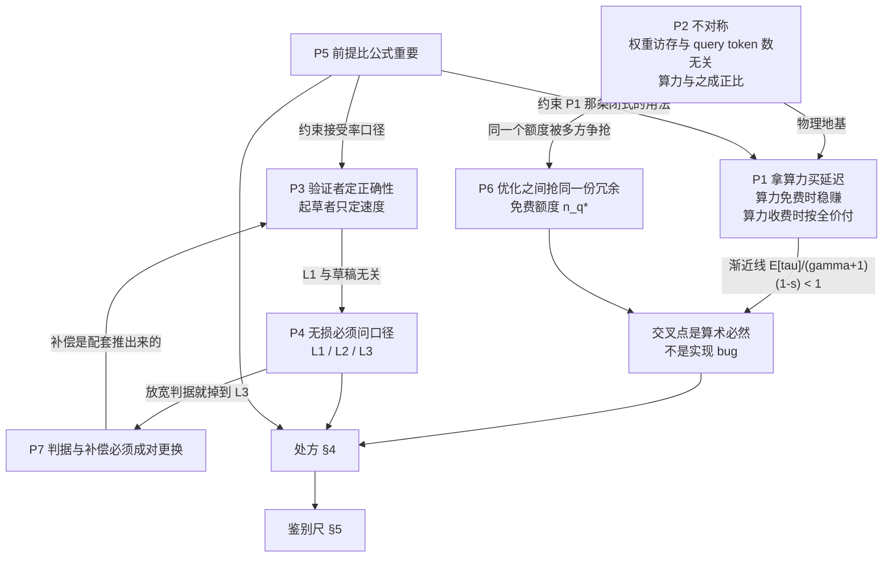
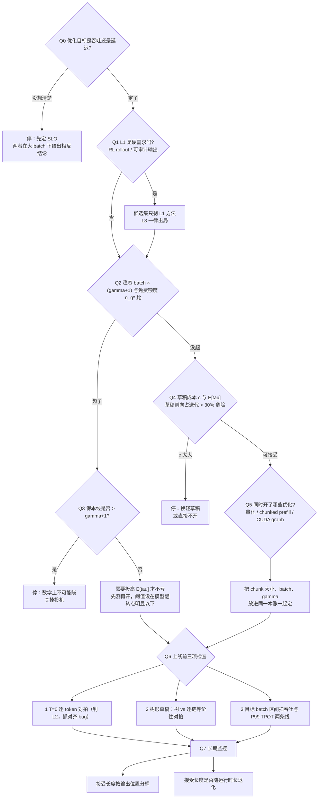

# 29 本质总结 —— 第一性原理

## 1. 一句话

前 28 篇可以压成 **七条原理**。它们的用处不是复述已经学会的方法，而是**判断一个你没见过的方法** —— 新论文、新引擎特性、新硬件，或者别人拍在你脸上的一个加速比数字。本篇给出这七条、一张按顺序问问题的**处方**、一把量新方法的**尺**，外加一份本库自己被实测推翻过的**诚实清单**（八条，其中一条是真 bug）。

---

## 2. 从哪来：为什么收束篇必须是"原理"而不是"要点回顾"

三个理由，都不是修辞：

1. **要点会过期，原理不会。** [[25-未来判断-哪些方向会活下来]] §8.2 给自己的判断标了半衰期：约 6 个月 —— DSpark 论文 2026-07-06 挂出，**同月**进 SGLang 主干、**次月**进 vLLM 主干。任何"目前最好的方法是 X"的清单，读者拿到手时已经在过期。
2. **这个主题的错误是结构性的，不是知识性的。** [[27-常见误解与判据]] 收的那些误解，几乎每一条都能被下面某一条原理**直接判死**。记七条原理比记二十条误解便宜得多，而且能覆盖还没被人犯过的错。
3. **本主题有一条算术硬边界**，这让"下判断"变得可做而不只是嘴硬：[[18-batch与吞吐-收益衰减曲线]] 推出的 $E[\tau]/(\gamma+1)\cdot(1-s)<1$。**有硬边界的领域才配谈第一性原理**；没有硬边界的领域谈的都是品味。

**本篇的自我约束**：不重复任何一篇的推导与表格。凡引用数字，只作为原理的**锚点**，并注明它在哪一篇被推出来、什么口径。

---

## 3. 七条第一性原理

每条给四样东西：**一句话** / **它从哪来** / **它能推出什么** / **一个反直觉推论**。

### P1｜投机采样是拿算力买延迟。算力免费时稳赚，算力收费时按全价付。

**从哪来。** [[01-decode为什么慢-带宽墙与算力空转]]：batch=1 的 decode 算术强度约 $1\ \mathrm{FLOP/Byte}$，而 H100 SXM5 的屋脊点是 $989.5\ \mathrm{TFLOPS}\ (\text{BF16 稠密})/3.35\ \mathrm{TB/s}=295.4$，算力利用率 **0.338%**。那 99.66% 的空转算力就是被拿去买延迟的东西。[[18-batch与吞吐-收益衰减曲线]] §4 把这句话变成闭式：深 compute-bound 区里

$$
\lim_{\text{batch}\to\infty}\text{speedup}=\frac{E[\tau]}{\gamma+1}\,(1-s)\ <\ 1 ,\qquad s=\frac{T_{\text{draft,total}}}{T_{\text{iter}}}
$$

**能推出什么。** $E[\tau]/(\gamma+1)$ 就是**算力有效利用率**：你让目标模型算了 $\gamma+1$ 个位置，只有 $E[\tau]$ 个变成产出，其余是**为了买信息而故意浪费的算力**。memory 区里这份浪费不要钱；compute 区里它按全价收费。于是"交叉点必然存在"不是工程没做好，是算术 —— 投机吞吐在 compute 区**封顶**（batch 被约掉），基线吞吐不封顶。

**反直觉推论。** 既然浪费按 $\gamma+1$ 计价，"大 batch 下把 $\gamma$ 调小一点"看起来该有用。**没用。** $\gamma$ 从 4 降到 2、$E[\tau]$ 从 3.0 降到 2.0，比值只从 $3/5=0.60$ 升到 $2/3=0.667$，**仍然小于 1**；$\gamma\to0$ 时比值 $\to1$，那就是"不开投机"。**大 batch 下正确的动作是关掉它，不是调参。** 更狠的一格：本库解析模型在 TP=8、batch=1024、seqlen=1024、$\gamma=4$ 下算出的保本线是 **5.30 > $\gamma+1$=5**（[[03-并行验证为什么几乎免费-算术强度与roofline]] §6.3 补表；[[19-负收益全解-什么时候投机反而更慢]] §11 用修正后的模型复算同向略升，结论不变）—— **一次迭代最多产出 5 个 token，而保本需要 5.30 个。这不是接受率不够高，是数学上的不可能。**

### P2｜权重访存与 query token 数无关，算力与之成正比。这一条不对称是全部收益与全部崩塌的共同来源。

**从哪来。** [[03-并行验证为什么几乎免费-算术强度与roofline]] §4.2 的枢纽：

$$
M=\underbrace{P\,b_p}_{\text{权重}}+\underbrace{\text{batch}\cdot s\cdot\kappa}_{\text{KV 读}}\ \ (\text{与 }n_q\text{ 无关}),
\qquad
F=n_q\cdot(2P+4Ls\,d)\ \ (\text{与 }n_q\text{ 严格成正比})
$$

权重搬一次，用它乘 1 个 token 还是 5 个 token 是同一批搬运；而浮点数老老实实按 query token 数线性涨。实测锚点：`q` 从 1 变到 9，`t_mem` 差值 $<10^{-15}$。

**能推出什么。** 把不等式 $F/M\le I^\*$ 解开，得到一个**总量**：

$$
n_q^{*}=I^{*}\cdot\frac{P b_p+\text{batch}\cdot s\cdot\kappa}{2P+4Ls\,d}
\qquad\Longrightarrow\qquad
\boxed{\ \text{batch}\times(\gamma+1)\ \le\ n_q^{*}\ }
$$

**batch 和 $\gamma+1$ 在抢同一个额度。** 这条把 P1 的定性交易变成了可判定的边界：70B / fp16 / H100（任意 TP）/ seqlen=1024 / $\gamma=4$ 时 $b_{\text{crit}}=68.7$，batch=68 判 memory、69 判 compute。同一条式子还给出上下文阈值 $s_{\text{crit}}(\gamma+1)\approx 2P(\gamma+1)/(I^{*}\kappa)$，70B/$\gamma=4$ 约 **7307 tokens**（补上层数因子后约 8437）—— 超过它，任何 batch 都不掉出 memory 区。

**反直觉推论。** 屋脊点 $I^{*}=\text{peak}/\text{BW}$ 分子分母同乘卡数后不变，于是 $n_q^{*}$、$b_{\text{crit}}$、$s_{\text{crit}}$ 全是 **TP 不变量**。**加卡救不了你** —— 它只让绝对时间变短、显存变多，不改变你落在哪个区；而真实 all-reduce 随卡数变差，加卡后崩塌只会更早。能动的旋钮只有四个：batch、$\gamma$、seqlen、精度。

### P3｜验证者决定正确性，起草者只决定速度。

**从哪来。** [[04-拒绝采样修正-无损性的完整证明]] 的主定理：接受概率取 $\min(1,p/q)$、拒绝后从 $p'=\mathrm{norm}(\max(0,p-q))$ 重采，则 $\Pr[Y=y]=\min(p,q)+\max(0,p-q)=p(y)$ **逐点相等**（**L1 分布无损**）。证明里 $q$ 只出现在被约掉的位置上，$(1-\beta)$ 在第四步整个消掉 —— **$q$ 好不好从头到尾不进入结论**。精确枚举把它变成一个数：草稿烂到接受率只剩 0.31 时误差仍是 $10^{-17}$ 量级；把草稿做成对抗性的（质量押在目标最不可能的 token 上，接受率 $<0.15$），结论不变。

**能推出什么。** 一条排查顺序，本主题最常被做反的一条：

> **调草稿是性能工程，调修正是正确性工程。先判"错"，再判"慢"。**

配套的分类判据（[[04-拒绝采样修正-无损性的完整证明]] §7）：**少发 token 只是慢，改分布才是错。** 不发赠品 token 误差 $8.3\times10^{-17}$（无偏，只是每轮少产出一个）；而"拒绝后直接从 $p$ 重采"误差 0.132、"判据写成 $p\ge q$ 就接受"误差 0.224 —— 后两者不报错、不崩溃，只是把模型悄悄换成了介于目标与草稿之间的另一个东西。

**反直觉推论。** 顺序反了会把**正确性问题误诊成性能问题**。树形草稿的 position id 用拍平下标而不是节点深度，症状就是"接受率莫名偏低"（等价性偏差 $>10^{-3}$）—— 很多人会去换草稿模型，其实该去查 position id。所以 [[16-树形草稿与树注意力-mask构造与验证]] 的判据是：**上线前先跑"树 vs 逐链"等价性对拍**，成本极低，是唯一能一次抓出这类 bug 的办法。

### P4｜一切"无损"都必须先问口径。

**从哪来。** [[07-无损的三种口径-分布无损不等于结果相同]]：**L1 分布无损**（输出流的联合分布逐点等于 $p$，同 prompt 两次结果可以不同）、**L2 贪心等价**（$T=0$ 下逐 token 相同，是 L1 的退化特例）、**L3 近似**（判据被放宽，分布已经不是 $p$）。混淆的源头在奠基论文自己身上：Leviathan 等（arXiv 2211.17192）**摘要**写 "with identical outputs"，**正文**写 "without changing the model output distribution" —— 二手讲解普遍只抄了摘要那一句。

**能推出什么。** 三条可执行判据：

| 现象 | 是不是问题 | 怎么查 |
|---|---|---|
| $T>0$，开关投机后输出序列不同 | **不是** | 不用查（L1 本来就允许） |
| $T=0$，开关投机后输出序列不同 | **是** | 违反 L2，查前缀对齐 / tokenizer / KV 回滚 |
| $T>0$，大样本统计对不上 | **是** | 违反 L1，做分布检验或精确枚举对拍 |

> **验证 L1 不能靠对比单条输出。** 用单条输出去验 L1，永远会得到"不一致"，然后你会去修一个不存在的 bug。正确做法二选一：大样本统计量比较，或玩具规模上的精确枚举对拍。而**最便宜的第一项检查是 $T=0$ 逐 token 对拍（L2）** —— 它确定性、一条输出就能判、且能抓出绝大多数对齐类 bug。实测：16 组配置、argmax 一致率低至 0.500，$T=0$ 下全部逐 token 相同。

**反直觉推论。** L1 的护城河价值大于它的速度价值。[[25-未来判断-哪些方向会活下来]] §6 的立场：在纯速度维度上投机解码是一笔越来越差的买卖，它今天还站得住靠的是那个分布保证；on-policy RL rollout 是 L1 **数学上不可协商**的场景（rollout 分布 ≠ policy 分布 → 梯度有偏，这是正确性问题不是质量问题）。**赌"投机解码会消失"的人，实际上是在赌"没有人需要 L1"。**

### P5｜闭式公式的前提比公式本身重要。

**从哪来。** [[06-期望接受长度与加速比模型-完整推导]] 把 $E[\tau]=(1-\alpha^{\gamma+1})/(1-\alpha)$ 的前提拆成**两条不是一条**：**A 沿链不相关**（不是 i.i.d.，i.i.d. 只是充分条件）、**B 起点无偏**（每轮迭代的起点服从平稳分布）。本库为验证这两条前提连着猜错两次方向，最后查到真机制在 B 上：**更新过程的长度偏置** —— 难区的迭代更短，按迭代计数时难区被过采样，于是每轮实际面对的接受率低于 $\pi$ 加权的 $\alpha$，公式**高估**，本库实测最大高估 **10.5%**。

**能推出什么。** 三条用法戒律：

- **别用它预测加速比**，直接测 acceptance length（引擎都能打点）；
- **别用它反推 $\alpha$** —— 用一个会高估 $E[\tau]$ 的公式去拟合实测值，解出的 $\alpha$ 必然被补偿掉，方向还取决于负载；
- **可以用它做定性判断**（$\gamma$ 该往哪调、$c$ 降一半值不值），这些结论对前提破坏不敏感。

**反直觉推论。** **拿公式反推参数，比拿公式预测结果更危险。** 预测错了你会怀疑公式；反推错了你会拿着一个假的 $\alpha$ 去做后续所有决策，而且看不出任何异常。同一条戒律在 [[05-接受率alpha-定义口径与怎么测]] 里有一个现成的事故：vLLM 官方文档那份 `summary` 样例里，同一次运行的同一段统计能读出 **0.0775**（`draft_acceptance_rate`）、**1.2326**（`mean_acceptance_length`）、**0.2000**（从 `acceptance_histogram` 重建的 $\hat\alpha$）三个都叫"接受率"的数；把 0.0775 当 $\alpha$ 代进闭式，$E[\tau]$ 偏 **−12.05%**。

### P6｜优化之间抢的是同一份冗余。

**从哪来。** [[23-与其它优化的相互作用-量化与KVcache与PD分离]] 把 P2 的 $n_q^{*}$ 改名叫**免费额度**，然后把所有优化放进同一本账：权重量化、KV 量化、GQA/MLA **砍访存 → 额度变小**；chunked prefill、加大 batch、投机自己 **占用额度**；只有拉长上下文（且 batch 够大）**撑大额度**。实测：权重 fp16→int4 加 fp8 KV，跌破 1.0 的 batch 从 **265 塌到 52**（缩小 5.1 倍）；免费额度只有**几百个 query token** 的量级（batch=1/seqlen=1024 约 291），而主流引擎的 prefill chunk 通常 512–2048 —— **一个 chunk 就吃光**。

**能推出什么。** "每个优化各提速一点，乘起来"这个期待在投机采样这里是**系统性错的**，而且错得有规律：**一半的推理优化，本质工作就是把访存量砍下去，也就是把前向往 compute-bound 推，也就是在削减投机采样赖以为生的那份冗余。**

**反直觉推论。** **只在 bs=1 做兼容性测试会系统性漏掉全部冲突。** 六种精度组合的 bs=1 加速比都落在 2.795–2.802，看不出任何问题；差别全在可用 batch 区间上，差了 5 倍。由此还得到一条比较方式的纠正：**不要比"加速比有没有变小"，要比"两条路各自的绝对吞吐哪个高"** —— 一个 int4 基线（755.6 tok/s）已经比 fp16 开投机（530.4 tok/s）更快，在这里问"投机还有没有加速"是问错了问题（口径：本库解析模型，target llama3-70b、draft llama3.2-1b、$\gamma=4$、$E[\tau]=3.0$、8×H100 TP=8、seqlen=1024、**bs=1**、报吞吐）。

### P7｜判据与补偿必须成对更换。

**从哪来。** [[07-无损的三种口径-分布无损不等于结果相同]] §4.3。残差分布 $p'=\mathrm{norm}(\max(0,p-q))$ **是专为 $\min(1,p/q)$ 判据配套设计的** —— 证明第三步的 $\sum\max(0,p-q)=1-\beta$ 正是这个配套关系。换掉判据而不换补偿，那条"欠账"就走错了路。实测（$|V|=5$ 玩具马尔可夫，随机种子固定，绝对阈值判据）：阈值 $\varepsilon$ 从 0.05 到 0.20 到 0.50，与目标分布的最大逐点偏差 **0.1719 → 0.2201 → 0.6598**。

**能推出什么。** L3 不是"差一点点"，是**换了一个分布**。$\varepsilon=0$（无条件接受）时输出分布**就是草稿分布**，误差 $0.1719=\max|p-q|$ —— 这给了偏差的直观上界：**最坏情况就是"你其实在用草稿模型"**。

**反直觉推论。** **"把阈值调保守一点"会让偏差更大，不是更小。** 拒绝得越多，走错补偿路径的质量越多。这条解释了为什么严肃的 L3/L1 多分支方法（SpecTr 的最优传输视角、SpecInfer 的多分支拒绝采样）都要**重新推导整套接受-补偿机制**，而不是在原判据上加个阈值。它也是 P3 的一个精细化：起草者随便换，判据不能单换。

### 3.8 七条之间的依赖关系

**左半边（P1/P2/P6）是物理，右半边（P3/P4/P7）是数学，P5 横跨两边管的是"你有没有资格用那个公式"。** 一个方法的收益属于左半边，它的正确性属于右半边；**两边不能互相担保** —— 这是本库最想留下的一句话。

---

## 4. 一页纸处方：拿到一个新场景，按什么顺序问什么

顺序是硬的。**任何一步答案为"停"就不要往下走**，因为下一步的调参在上一步的结论面前没有意义。

逐条把"要问什么"写实：

| # | 问题 | 怎么答（可操作） | 答错的后果 |
|---|---|---|---|
| **Q0** | 优化的是吞吐还是单请求延迟？ | 看 SLO 写的是集群 tokens/s 还是 P99 TPOT | 用吞吐曲线设阈值，会关掉本该开着的投机；反之亦然（[[19-负收益全解-什么时候投机反而更慢]] §13.1） |
| **Q1** | L1 是不是硬需求？ | RL rollout / 需要可辩护"这个输出来自这个模型" → 是 | 用 L3 做 on-policy rollout 会让梯度有偏，且不报错 |
| **Q2** | $\text{batch}\times(\gamma+1)$ 与 $n_q^{*}$ 谁大？ | 用 P2 的闭式算，或直接测验证前向的 bound 状态 | 报出的加速比只在你测过的那几个 batch 上成立 |
| **Q3** | 保本线 $T_{\text{iter}}/T_{\text{base}}$ 是否超过 $\gamma+1$？ | 超过 → **无论接受率多高都不可能赚** | 把"不可能"当成"调参没调好"，无限期浪费人力 |
| **Q4** | 草稿成本 $c$ 多少、$E[\tau]$ 多少？ | 草稿前向占迭代 >30% 是危险线；$c\gtrsim1$ 时无论 $\alpha$ 多高都不该开 | 只看接受率选草稿，见 §5 的反例 |
| **Q5** | 还开了哪些优化？ | 量化 / KV 压缩 / chunked prefill 全在抢同一份额度（P6） | 分开调必然次优，且 bs=1 测不出来 |
| **Q6** | 上线前查什么？ | ① $T=0$ 对拍 ② 树/链对拍 ③ 目标 batch 区间的吞吐 + P99 TPOT | 前两条查"错"，第三条查"值不值"，顺序不能反 |
| **Q7** | 上线后盯什么？ | 接受长度按**输出位置**分桶、按**运行时长**看有没有单调退化 | 长 CoT 后段与长时间运行都会让短时压测结论失效 |

**三条硬边界，值得单独抄下来**（口径均为本库解析模型 `_lab/speedup.py`，target llama3-70b、draft llama3.2-1b、fp16、H100 SXM5、$\gamma=4$，**乐观上界**，真实翻转点只会更早）：

- $b_{\text{crit}}=68.7$（seqlen=1024）：过了这条线验证不再免费；
- $s_{\text{crit}}\approx7307$ tokens：过了这条线任何 batch 都不掉出 memory 区（但显存会先拦住你）；
- 保本线 $>\gamma+1$（TP=8、batch=1024、seqlen=1024）：过了这条线**关掉**是唯一正确动作。

**并且：不要把上面任何一个数当配置建议。** 它们绑定在这一组模型/硬件/精度上，换一套要重算。真正可搬运的是那三条**式子**，不是那三个数。

---

## 5. 一把鉴别尺：五问定位一个没见过的新方法

拿到一篇新论文、一个新引擎特性，按下面五问走一遍，十分钟能给它定位。

### 5.1 五问

**问一：它的接受判据是什么？→ 定 L1 / L2 / L3。**
不看摘要，看**拒绝分支从哪个分布重采**：走 $\mathrm{norm}(\max(0,p-q))$ 且判据是 $\min(1,p/q)$ → L1；$T=0$ 下逐 token 对齐 → L2；任何阈值/typical/top-k 匹配 → L3。一篇声称"无损"却不说口径的材料，先默认它没想清楚。**L1 与 L3 的接受长度不是同一个量纲，禁止合表。**

**问二：它抬的是 $E[\tau]/(\gamma+1)$，还是只把 memory-bound 区做大？→ 定轴 A / 轴 B / 轴 C。**
这是 [[25-未来判断-哪些方向会活下来]] §3 的分类轴：

| 轴 | 它改什么 | 对渐近线 | 天花板 |
|---|---|---|---|
| **A** | 提高 $E[\tau]/(\gamma+1)$ 或压低 $s$ | 真的抬高 | $E[\tau]\le\gamma+1$ ⟹ **恒 $<1$**，最好只能打平 |
| **B** | 扩大"验证仍近乎免费"的区间 | **一点没动**，只把悬崖往右推 | 悬崖仍在；显存或口径会先撞上 |
| **C** | 不做这笔交易 | 框架不适用 | 代价是放弃 L1 |

**问三：它的 $c$ 是多少？（草稿的相对成本）**
$c$ 常常比 $\alpha$ 更能决定成败。$\alpha=0.90$ 已经很高，但 $c=1.0$（草稿与目标同价）时最优 $\gamma^\*=1$、理想加速比只有 **0.950 —— 已经小于 1**（口径：理想模型，**bs=1** 且落在 memory-bound 区，假设验证免费，未计工程开销）。

**问四：它在什么 batch / seqlen 区间被测的？**
找不到 batch 就默认它是 1，并按衰减曲线打对折以上的折扣。公开来源里交叉点分布在 batch **8 到 128+**，**取平均值当阈值是错的用法**。同一个方法族（EAGLE 系）在公开来源里的实测值域是 **0.71× 到 4.40×**（跨 batch、跨硬件、跨任务）—— 收益**不是模型属性**，是「模型 × 硬件 × 负载 × 任务」四元组的属性。

**问五：它的失效条件，作者自己说了没有？**
说了 → 加分，而且那句话往往比正文的加速比更有信息量（例如 MagicDec 自陈 *"For the GQA target model, the speed-up is expected to be lower"*，而今天的主流模型**全是** GQA/MLA）。没说 → 你得自己补，而且要假设它是被藏起来的。

### 5.2 三个"当场作废"的信号

1. **把接受长度 $\tau$ 当加速比报。** 反例：某方法平均接受 token **7.07（全表最高）**，加速比 **0.87×（比不开还慢 13%）**（口径：单张 RTX A6000 48GB、fp16、**batch=1**、目标 DeepSeek-R1-Distill-Llama-8B）。同一张表里两个指标**排序完全相反**。
2. **给出"$\alpha$ → 加速比"的通用对照表。** 那个换算必须知道草稿成本、验证成本、框架开销三项，而三项都是硬件与实现相关的。反例：$\alpha=0.30$ 的 n-gram 跑出 **1.39×**，$\alpha=0.43$ 的蒸馏草稿只有 **1.03×**，唯一原因是草稿前向差 33 倍（0.001 s vs 0.033 s；口径：原文未给 batch size，推定为 1）。
3. **把 bs=1（或 max_concurrency=1）的数字当服务化收益。** 这是本主题最高频的口径事故，没有之一。

### 5.3 用一次尺子：为什么 AL=2.2 的方法能打赢 AL=6.54 的方法

- Dustin：接受长度 **2.2**，加速 **9.17×**（口径：H200、bfloat16、pipeline parallel 4×H200、Qwen2.5-72B 目标 / Qwen2.5-0.5B 草稿、**32K 上下文、batch 16**、KV budget 512）。
- DFlash：接受长度 **6.54**，加速约 **4.9×**（口径：Qwen3-8B、greedy、Transformers backend；**batch 原文未给，推测 bs=1，标为推断**）。

按问二，两者根本不在同一条轴上：DFlash 走**轴 A**（每份验证算力换回更多 token），Dustin 走**轴 B**（把每份验证算力本身变便宜 —— 长上下文下 verify 的 KV 读占绝大部分时间，稀疏化直接砍掉它）。按问一，Dustin 的代价写在明处：它**不是 L1**（LongBench 掉 0.58%）。

> **判据：接受长度只在同一条轴上可比。在轴 B 上用接受长度预测加速比会错得离谱。**

这五问加起来还有一个副作用：它们同时是你**自己写报告**时的自查表。少答一问，你的数字就会成为别人清单里的反面教材。

---

## 6. 本库自己被数据推翻过的地方（诚实清单）

这一节是本篇最有价值的部分之一。**共八条**：六条是猜想被实测推翻，一条是文档与实际输出不符，一条是真 bug。全部保留原始的错误方向，不做事后美化。

### 6.1 八条

**① 猜想：$\beta$ 有波动 → Jensen 不等式 → 公式低估。**
- **原本以为**：$E[\tau]$ 关于 $\alpha$ 是凸的，$\beta$ 有波动时真实值应高于公式值。
- **实测**：$\beta$ 在 0.176 到 0.449 之间变化（**差 2.5 倍**），公式却准到 **2%–3% 以内**（4 组配置，实测/公式落在 0.997–1.023）。
- **真机制**：推导 (4.2) 要的从来不是"$\beta$ 是常数"，而是"$\beta_i$ 沿链**不相关**"。乘积的期望等于期望的乘积只需要不相关，不需要同分布。Jensen 那套推理对应的是另一个量，根本没进到这条推导里。
- **收获是正的**：这次证伪把公式的**适用范围扩大**了 —— 只要接受难度不"连片"，各处接受率天差地别公式仍然精确。

**② 猜想：那正相关时公式该低估。**
- **原本以为**：真实模型里"难的地方连着难"（代码块、长数字串、罕见实体），正相关 ⟹ $\mathbb E[\prod\beta]>\prod\mathbb E[\beta]$ ⟹ 公式低估。
- **实测**：造了"黏性双区制"玩具模型（只改粘性、不改各区的 $\beta$），$\beta$ 一阶自相关从 $+0.041$ 升到 $+0.812$，实测/公式从 **1.012 一路掉到 0.895**。**方向和猜想相反：是高估。**
- **真机制**：不在前提 A（不相关）上，在**前提 B（起点无偏）**上 —— 见 ③。

**③ 猜想：偏差来自"输出被拽向难区"。**
- **原本以为**：既然难区更容易被拒，输出流的统计应当偏离目标分布，问题出在输出侧。
- **实测**：**token 流落难区恒等于平稳分布** —— sticky 取 0.50 / 0.85 / 0.99 时分别是 **0.4984 / 0.5034 / 0.4929**，而 $\pi_{\text{难}}=0.50$。输出侧一点没偏。（*本库存档说明：这一条最初的探查记录里另有一组更早的数字，磁盘上已不可复现，本篇只引用 [[06-期望接受长度与加速比模型-完整推导]] §7.3 表格里现存的三个值。*）
- **真机制**：偏的不是 token 流，是"**按迭代抽样**"这个观测动作。难区起点的迭代明显更短（$E[\tau\mid$难$]=2.00$ vs 易起点 4.74），短迭代多 ⟹ 按迭代计数时难区被过采样（起点落难区从 0.38 升到 0.69）⟹ 每轮实际面对的接受率低于 $\pi$ 加权的 $\alpha$ ⟹ 公式高估。这是经典的**更新过程长度偏置**。
- **附带的自查**：更新过程闭式在 sticky=0.99 时预测 0.7033、实测 0.6938（差 1.4%），在 sticky=0.50 时预测 0.6498、实测 0.3792（**完全不准**）—— 因为它自己的假设（"整轮都待在起点那个区"）在低粘性下不成立。本库把这条也做成了断言：**一个模型只在自己的假设成立处才准。**

**④ 猜想：$\alpha$ 随温度总是非单调。**
- **原本以为**：接受率随温度呈 U 形是普遍规律。
- **实测**：好草稿（argmax 一致率 0.625）确实是 U 形：$T=0.02$ 时 0.6967 → $T=0.1$ 的 **0.6574 低谷** → $T=20$ 的 0.9951。但**烂草稿（一致率 0.125）是严格单调上升的**：0.0001 一路到 0.9805，没有低谷。
- **真机制**：$T\to0$ 时 $\alpha$ 收敛到**两模型 argmax 一致的概率质量** $g$，$T\to\infty$ 时 $\alpha\to1$。形状由 $g$ 与常温 $\alpha$ 的大小关系决定：$g<\alpha(T{=}1)$ 则降温先跌（好草稿），反之单调。**"非单调"这句话本身就需要标口径**，本库因此把它拆成两个测试分开断言。
- **可搬走的结论**：**$T=0$ 测的接受率不能外推到线上温度**，方向和幅度都取决于具体模型对。

**⑤ 猜想：提高 typical acceptance 的阈值能减小偏差。**
- **原本以为**："阈值调保守一点"= 接受得更谨慎 = 更接近目标分布。这句话最初写在 `_lab/caliber.py` 的注释里。
- **实测**：阈值 0.05 → 0.20 → 0.50，与目标分布的最大逐点偏差 **0.1719 → 0.2201 → 0.6598**，**单调变大**。
- **真机制**：见 P7。补偿路径是为原判据配套设计的；判据一换，拒绝得越多、走错路的质量越多。**原注释被实测推翻后重写，过程保留在脚本的输出文字里。**

**⑥ 猜想：草稿不准就该把树加宽。**
- **原本以为**：草稿越不可靠，越该多押几个候选。
- **实测**：草稿一致度 agree=0.80 时，top-2 覆盖率 $c_2$ 与 top-1 覆盖率 $c_1$ **都是 0.608** —— 第二候选的边际贡献恰好为 0，于是**无论预算多大，链都赢**。而 agree=0.95 时 $c_2-c_1=+0.152$，预算 $\ge16$ 时树才赢。
- **真机制**：**宽度值不值钱取决于边际覆盖率增益 $c_k-c_1$，而不是"草稿好不好"。** 一个"整体跑偏"的草稿，宽度买不到任何东西；一个"知道自己不确定、能把正确答案排进 top-2"的草稿，宽度才有价值。**这两种"不准"完全不同，流行说法把它们混为一谈了。** 顺带推翻另一条流行说法："树总是比链好，因为验证同价" —— 预算太小时加宽等于砍深度，砍得不值。

**⑦ 一个真 bug：`_lab/speedup.py` 的 attention 浮点数漏乘层数 $L$。**
- **问题**：浮点公式写成 $n_q(2P+4s\,d_{\text{model}})$，按推导应当是 $n_q(2P+4L\,s\,d_{\text{model}})$。
- **怎么发现的**：写 [[03-并行验证为什么几乎免费-算术强度与roofline]] §4.1 逐项重推 FLOPs 时对不上，那一篇把缺口量化后如实记录（70B、$L=80$：seqlen=1024 时 attention 项占 $2P$ 的 0.024% vs 正确的 1.9%；seqlen=32768 时 0.76% vs **60.8%**）。
- **影响与修复**：该 bug 让模型**更乐观**（少算浮点 → 更容易判成 memory-bound → 更容易说"免费"）。修复后 [[18-batch与吞吐-收益衰减曲线]] 与 [[23-与其它优化的相互作用-量化与KVcache与PD分离]] 全部重算：seqlen=1024 下 batch=384 的加速比 0.827→**0.813**、batch=512 的 0.721→**0.708**；保本线 batch=256 的 2.89→**2.94**、batch=512 的 4.16→**4.24**。**结论一条都没变**（交叉点存在、渐近线 <1、batch=1024 保本线仍 >$\gamma+1$）。回归测试：`_lab/test_speedup.py::test_attention_flops_include_layer_count`。
- **修复之后才显现的一条反转**：免费额度在 **batch=1** 时随上下文变长反而**变小**（seqlen=1024 的 291 → seqlen=8192 的 261），要到 batch=32 才转为随上下文变大（312 → 412）。漏乘时算力项被低估近两个数量级，这条根本看不出来。于是"长上下文对投机友好"的完整形式是：**长上下文 + 足够大的 batch，两个条件缺一不可。**

**⑧ 一处文档与实际输出不符（自查，不是猜想）。**
`speedup.py` 的 `--breakeven` 在保本线超过 $\gamma+1$ 时会追加一个 `!` 标记，并在结尾写"带 `!` 的格子意味着无论接受率多高都不可能保本"。但在该函数实际使用的 TP=4 口径下，**`!` 一次都没出现过**，最大值只有 2.89 —— 因为真正会触发它的大 batch 格子在 320 GB 显存下全部是"装不下"。第 03 篇如实记录了这处不符，并另用 TP=8 补出了那张真正出现 `!` 的表。**教训：源码里的"读法"文案描述的可能是一个在该口径下不会出现的现象。**

### 6.2 这八条有一个共同形状

把它们并排看，规律很刺眼：

| | 错在幅度 | **错在方向** |
|---|---|---|
| 条目 | ⑧（一处描述性不符） | ①②④⑤⑥（五条） |
| 说明 | 数值不准，方向对 | **符号反了** —— 补一个修正系数救不回来 |

**五条里有五条是方向错了，不是幅度错了。** 而它们的成因高度一致：

> **每一条都是"用一个模型去预测它没覆盖的东西"。**
> ①②③ 是用闭式去预测它两条前提之外的行为；④ 是把一个依赖 $g$ 的形状当成普适规律；⑤ 是把为 A 判据设计的补偿套到 B 判据上；⑥ 是把"草稿质量"这一个标量当成"边际覆盖率"这个另一个量的代理。⑦ 则是同一个病的代码版：一处推导上的省略，在短上下文下无害，在长上下文下放大到 60% 量级。

这正是 P5 的经验来源，也是本库把"数学断言必须有可执行验证"写成铁律的原因：**这些错误没有一条能靠更仔细地思考避免，全部只能靠跑数字发现。**

还有一条元教训值得留下：**⑥ 之所以能被抓住，是因为本库先把"草稿不准"拆成了两个可测的量**（整体一致度 vs 边际覆盖率增益）。**大多数"直觉错了"的根因，是一个词同时指代了两个不同的量** —— "接受率"（四个量）、"无损"（三个口径）、"草稿不准"（两种不准）、"长上下文友好"（缺 batch 这个共存条件）。**遇到反直觉的实测，第一个动作应当是拆词，不是改模型。**

---

## 7. 口径与坑：本篇自己的

1. **原理不是定理，等级不一样。** P3、P4、P7 有证明也有可执行验证；P1、P2 是物理账，绑定在当代硬件的带宽/算力比上；P5、P6 是方法论，可证伪但没有证明形式。**引用时别把三档混成一档。**
2. **本篇引用的每个数字都在别处有完整口径，这里只留锚点。** 尤其 §4 那三条硬边界全部来自本库解析模型（乐观上界，忽略 TP 通信、norm/softmax、kernel launch 与调度），**不是硬件实测**。要用它们做决策，必须回到 [[03-并行验证为什么几乎免费-算术强度与roofline]] 与 [[18-batch与吞吐-收益衰减曲线]] 看局限声明。
3. **"L1 无损"在低精度下有一个脚注。** $p$ 与 $q$ 由不同精度/不同 kernel 算出时，$p(x)/q(x)$ 在 $p\approx q$ 处对舍入极敏感 —— 此时的无损只在浮点误差意义下成立，**严格说已经不是 L1**。模型跑在 fp8/int4 上时报"无损"必须注明。
4. **本篇的五问尺子只覆盖"消耗算力换 token"这一类方法。** 轴 C（不做这笔交易的路线）落在框架外，用 $E[\tau]/(\gamma+1)$ 去评价它们会得到错误结论。
5. **诚实清单不是自谦，是本库的证据。** 它同时说明两件事：本库的结论是跑出来的不是抄来的；以及本库的其它结论也可能有同类问题 —— **凡是没有对应测试的断言，都应当按"尚未被证伪"而不是"已被证实"来读。**

---

## 8. 失效条件：这些原理在什么条件下会失效

按"失效得有多彻底"排序。

1. **硬件的带宽/算力比大幅变化 —— 影响 P1、P2、P6 的全部数值，不影响它们的形式。**
   屋脊点 $I^{*}=\text{peak}/\text{BW}$ 是所有阈值的基准。若某代硬件带宽增长快于算力，屋脊点左移，memory 区变大，免费额度变大，**所有交叉点右移，投机的可用区间重新变宽**（例：带宽翻倍而算力只涨 20%，H100 口径的 295.4 会降到约 177）。反向趋势同样存在：量化、MoE 路由、以及算力增速快于带宽的代际，都在**缩小** memory 区。**结论：P1/P2/P6 的式子可搬运，本篇与全库的每一个具体阈值都不可搬运。**

2. **MoE —— P2 的"权重只读一次"被路由破坏，本库明确未建模。**
   $\gamma+1$ 个被验证的 token 会各自路由到不同专家，要读的权重量随 $\gamma$ 增长，"多验几个 token 几乎不加成本"这个前提直接松动。而方向在公开来源里是**四方混战**（有报 batch=1 就 1.95× 的，也有报超大 MoE 只剩 1.10–1.22× 的），差异全在 MoE 规模稀疏度、batch 区间、对照基准三项没对齐。**唯一可执行的判据**：测「验证 $\gamma+1$ 个 token 时激活的专家**并集**」÷「验证 1 个 token 时激活的专家数」——比值 $\approx1$ 则 MoE 比稠密更受益，接近 $\gamma+1$ 则差得多。**不要用别人的 MoE 结论。**

3. **非 Transformer 架构 —— P2 的第二项消失。**
   线性注意力 / SSM 类模型的状态大小不随 seqlen 增长，$M$ 里的 $\text{batch}\cdot s\cdot\kappa$ 那一项塌成常数。后果是 $n_q^{*}$ 失去随上下文变大的那条腿，$s_{\text{crit}}$ 不再存在 —— **"长上下文把投机重新救回来"这条推论整个作废**。P3/P4/P7 不受影响（它们只依赖 $p$、$q$ 是同一词表上的分布）。本库未对这类架构建模，标为未覆盖。

4. **验证不再是"多喂 query token" —— P2 的记账方式要重建。**
   把稀疏推进 verify 的路线（改的是**每 token 验证成本**而不是 $\gamma$）不在本框架内。现成反例：接受长度只有 2.2 却拿到 9.17×（口径：H200、4 卡 pipeline parallel、Qwen2.5-72B + 0.5B、32K 上下文、**batch 16**）。**用 $E[\tau]/(\gamma+1)$ 去评价它必然得到错误结论。**

5. **跳出这笔交易的方法 —— P1 不适用。**
   不需要 drafter、不需要验证、把"一次出多 token"直接烧进权重的路线（Jacobi Forcing 一类），不消耗 $\gamma+1$ 份算力去买信息，渐近线管不住它。**它唯一放弃的是 L1**（原文措辞 "minimal generation quality degradation" 即近似口径）。所以 P4 在这里从"格式要求"升级成"生死判据"。

6. **优化目标是延迟而不是吞吐 —— P1 的"亏"要反过来读。**
   本库的交叉点全部按吞吐定义。同一个工作点上吞吐可能是 0.81 倍（亏），而**单请求 TPOT 仍可能更好**（每轮产出多个 token）。SLO 写的是 P99 TPOT 时，"大 batch 下关掉投机"这条推论可能是错的。

7. **一批请求难度不齐 —— 让真实曲线比本篇的原理更差，不会更好。**
   本库的模型假设整批共享同一个 $E[\tau]$，而实测请求间接受长度方差巨大。同步验证意味着整批要等最慢的那条。**这是一个只往坏方向偏的未建模因素**，所以它不构成对原理方向的反驳，只构成对数值的进一步折扣。

8. **接受率随输出位置衰减 —— 让 P1 的 $E[\tau]$ 变成时间的函数。**
   长 CoT 场景下 $E[\tau]$ 不是常数（实测：某模型前 10K 输出 token 上 3.7，后 10K 掉到 1.5；某 speculator 生成约 20K token 后掉到约 1.1）。$E[\tau](t)\to1.1$ 而 $\gamma=7$ 时，$E[\tau]/(\gamma+1)=0.1375$ —— 长 CoT 后段投机是纯亏。**P1 仍然成立，但它的输入变成了一条随位置下滑的曲线**，于是"要不要开投机"从一次性决策变成了逐段决策。

---

## 9. 自测题

1. 有人给你一张表，声称某新方法"在 batch 1 到 16 上全程加速，说明它消除了交叉点"。用哪一条原理、哪一句话回应？
   

答案要点
P1。渐近线 $E[\tau]/(\gamma+1)(1-s)$ 恒 $<1$，且投机吞吐在 compute 区封顶（batch 被约掉）而基线不封顶，所以交叉点是算术必然。"在我测的范围里都赚"与"没有交叉点"是两句完全不同的话。正确的反驳方式是把扫描扫到"基线吞吐仍在明显增长而投机吞吐已经走平"的位置，或直接报出验证前向的 bound 状态。

2. 某实现把接受判据从 $\min(1,p/q)$ 改成"$p(x)\ge0.05$ 就接受"，其余不变，作者认为"阈值这么小，偏差可以忽略；真嫌大就把阈值调到 0.2"。两处都错在哪？
   

答案要点
P7。① 阈值很小时判据事实上等于"无条件接受"，输出分布**就是草稿分布**，误差达到 $\max|p-q|$（本库玩具例 0.1719）——这是偏差的**最大**值不是最小值；② 调大阈值不能改善，因为补偿路径 $\mathrm{norm}(\max(0,p-q))$ 是为原判据配套推出来的，拒绝得越多走错路的质量越多，实测 0.05→0.20→0.50 时偏差 0.1719→0.2201→0.6598 单调变大。正确做法是判据与补偿成对重新推导。口径上这已经从 L1 掉到了 L3。

3. 团队在 bs=1 上测得 "int4 + 投机" 与 "fp16 + 投机" 加速比都是 2.8 倍，据此结论"量化与投机完全兼容"。用哪条原理反驳？还要补测什么？
   

答案要点
P6。bs=1 时两者都在 memory-bound 区深处，验证都免费，加速比自然相同；但权重量化砍掉访存、把可用 batch 区间从 265 压到 52（缩小 5.1 倍）。要补的是**扫 batch**，并且比较方式要换：不比"加速比有没有变小"，比"两条路各自的绝对吞吐哪个高"——量化基线本身已经快了约 4 倍。

4. 某论文报"平均接受长度 6.54，加速约 4.9 倍"，另一篇报"平均接受长度 2.2，加速 9.17 倍"（batch 16、32K 上下文）。你会怎么向同事解释这不矛盾？还要追问什么？
   

答案要点
§5 问二：两者在不同的轴上。前者走轴 A（提高 $E[\tau]$），后者走轴 B（把每份验证算力本身变便宜——长上下文下 verify 的 KV 读占绝大部分时间）。**接受长度只在同一条轴上可比。** 要追问：① 各自的 batch 与 seqlen（前者疑似 bs=1）；② 接受判据是什么（后者是近似口径，LongBench 掉 0.58%，与 L1 方法不能合表）；③ 基线是不开投机还是另一个投机方法。

5. 本篇的诚实清单里，五条被推翻的猜想有四条以上是"方向反了"而不是"数值偏了"。这个观察对你今后怎么做技术判断有什么可操作的含义？
   

答案要点
两条。① **方向性错误补不回来**——它不是可以乘一个修正系数解决的问题，说明模型用在了它没覆盖的地方，正确动作是回去查前提（P5），不是调参；② **大多数反直觉的实测，根因是一个词同时指代了两个量**（"接受率"四个量、"无损"三个口径、"草稿不准"两种不准）。所以遇到直觉与数据冲突时，第一个动作是**拆词**——把那个含糊的词拆成两个可分别测量的量，而不是先去改模型或怀疑数据。

6. 你要给团队写一条"投机解码上线检查项"，只能写三条，写哪三条？为什么是这个顺序？
   

答案要点
① $T=0$ 逐 token 对拍（判 L2，最便宜、能抓出绝大多数对齐类 bug）；② 树形草稿时做"树 vs 逐链"等价性对拍（抓 position id / mask bug）；③ 在**目标 batch 区间**扫吞吐与 P99 TPOT 两条线，确认没落进负收益区。顺序理由是 P3：前两条查"错"，第三条查"值不值"；顺序反了会把正确性问题误诊成性能问题，然后你会去调一个没坏的草稿模型。

---

## 10. 延伸与双链

- 全库入口与阅读路线：[[00-总览与知识地图]]
- **P1 / P2 的地基**：[[01-decode为什么慢-带宽墙与算力空转]]、[[03-并行验证为什么几乎免费-算术强度与roofline]]、[[18-batch与吞吐-收益衰减曲线]]
- **P3 / P4 / P7 的地基**：[[04-拒绝采样修正-无损性的完整证明]]、[[07-无损的三种口径-分布无损不等于结果相同]]
- **P5 的地基（两次自我证伪的完整记录）**：[[06-期望接受长度与加速比模型-完整推导]]、[[05-接受率alpha-定义口径与怎么测]]
- **P6 的地基**：[[23-与其它优化的相互作用-量化与KVcache与PD分离]]、[[22-长上下文下的投机采样]]
- 处方 §4 的实证对应物（红灯/黄灯/绿灯清单与生产陷阱）：[[19-负收益全解-什么时候投机反而更慢]]、[[20-主流引擎实现-vLLM与SGLang与TensorRTLLM]]
- 鉴别尺 §5 的分类轴出处与逐条判断：[[25-未来判断-哪些方向会活下来]]、[[24-前沿进展-2025到2026]]
- 树与动态预算（诚实清单 ⑥ 的出处）：[[16-树形草稿与树注意力-mask构造与验证]]、[[17-动态草稿长度与自适应停止]]
- 想先看直觉再回来看原理：[[02-最小可跑的投机采样-手算一遍]]
- 历史怎么把 $c$ 压下去、哪些分支死了：[[08-史前史-2018并行解码与非自回归的失败]]、[[09-2023奠基-两篇同期论文的异同]]、[[10-自投机-跳层早退与Draft-and-Verify]]、[[11-无模型草稿-promptlookup与ngram与检索]]、[[12-Medusa-多头草稿与树注意力的诞生]]、[[13-EAGLE三代-特征级自回归的演进]]、[[14-MTP-从训练目标到推理草稿]]、[[15-谱系图与被淘汰的分支]]
- 草稿训练侧（为什么该盯 TV 不该盯 KL）：[[21-草稿模型怎么训-对齐与在线蒸馏]]
- 这七条原理能判死的具体误解：[[26-社区精彩解释精选-好在哪与错在哪]]、[[27-常见误解与判据]]
- 拿这七条去答题：[[28-面试题库]]
- 资料清单：[[30-附录-优秀文章与资料清单]]

---

### 本篇验证

本篇不新增代码，它引用的每条原理都由前面篇目的测试支撑。下面是**七条原理各自最硬的那一个断言**（全部在 `_lab/` 下真实存在，可用 `cd _lab && python -m pytest -q --collect-only` 核对）：

- **P1** —— `_lab/test_speedup.py::test_compute_bound_asymptote_equals_wasted_compute_ratio`：compute 极限下加速比 $=E[\tau]/(\gamma+1)\times(1-s)$，实测 0.566 与预测吻合到 0.01 以内（口径：8×H100 TP=8、$\gamma=4$、$E[\tau]=3.0$、**batch=1024**、seqlen=1024）。
  配套：`::test_higher_accept_length_raises_but_cannot_save_asymptote`（$E[\tau]$ 顶到 $\gamma+1$ 也只能打平偏亏）、`::test_spec_throughput_saturates_while_baseline_keeps_climbing`（投机吞吐封顶而基线不封顶 → 交叉点是算术必然）、`::test_breakeven_can_exceed_theoretical_max`（保本线 $>\gamma+1$，**数学上不可能赚**）。
- **P2** —— `_lab/test_speedup.py::test_weights_read_once_regardless_of_query_tokens`：query token 数从 1 变到 9，访存耗时差值 $<10^{-15}$。
  配套：`::test_verify_is_nearly_free_in_memory_bound_region`、`::test_verify_stops_being_free_in_compute_bound_region`、`::test_ridge_point_value`（屋脊点 295.4 FLOP/Byte）。
- **P3** —— `_lab/test_lossless.py::test_lossless_holds_for_adversarial_draft`：草稿把质量押在目标最不可能的 token 上（接受率 $<0.15$），输出分布仍精确无损（**L1**）。
  配套：`::test_exact_distribution_lossless`、`::test_no_bonus_token_is_still_lossless`（少发 token 只是慢）、`::test_naive_resample_is_biased` 与 `::test_threshold_rule_is_biased`（改分布才是错）。
- **P4** —— `_lab/test_caliber.py::test_greedy_speculative_equals_greedy`：**L2 的判定性验证**，$T=0$ 下投机输出与贪心解码逐 token 相同。
  配套：`::test_greedy_equivalence_holds_even_when_argmax_disagrees`（与草稿好坏无关）、`_lab/test_tree.py::test_tree_attention_breaks_if_position_ids_wrong`（对齐前提被破坏时无损性静默失效）。
- **P5** —— `_lab/test_accept.py::test_formula_accurate_when_uncorrelated` 与 `::test_formula_overestimates_when_sticky`：**两次证伪各自的判定性断言**。
  配套：`::test_token_stream_matches_stationary_distribution`（偏的不是输出流）、`::test_hard_region_iterations_are_shorter`（长度偏置的机制）、`::test_renewal_formula_accurate_only_when_sticky`（**一个模型只在自己的假设成立处才准**，本库对自身方法的自查）。
- **P6** —— `_lab/test_speedup.py::test_weight_quantization_shrinks_the_usable_batch_range`：交叉点随权重精度下降单调左移且缩小 3 倍以上。
  配套：`::test_spec_alone_can_exhaust_the_free_budget`（**batch=128** 时投机自己就把免费额度透支）、`::test_free_budget_shrinks_with_context_at_batch_one`（诚实清单 ⑦ 的反转）、`::test_attention_flops_include_layer_count`（那个真 bug 的回归测试）。
- **P7** —— `_lab/test_caliber.py::test_raising_threshold_makes_bias_worse_not_better`：阈值 0.05→0.20→0.50，偏差单调变大（诚实清单 ⑤）。
  配套：`::test_typical_acceptance_is_biased`（近似口径在任何阈值下都有偏）、`::test_zero_threshold_reproduces_draft_distribution`（偏差上界就是"你其实在用草稿模型"）。
- **诚实清单 ⑥** —— `_lab/test_tree.py::test_budget_needed_grows_as_the_gain_shrinks`：边际覆盖率增益**极小**时，兑现它所需的预算大到不现实。
  配套：`::test_chain_beats_tree_at_small_budget`、`::test_tree_beats_chain_at_large_budget`（树赢需要两个条件同时成立）。
- **诚实清单 ④** —— `_lab/test_accept.py::test_good_draft_alpha_is_non_monotone_in_temperature` 与 `::test_poor_draft_alpha_is_monotone_in_temperature`：**两条分开写，正是因为"非单调"这句话本身要标口径**；机制由 `::test_alpha_at_low_temperature_tracks_argmax_agreement` 钉住。
- 可复跑（在 `_lab/` 目录下执行）：
  - `python -m pytest -q` —— 全库测试；`python -m pytest -q --collect-only` 本次收集到 **191 个测试**。
  - `python spec.py --proof` / `--bias` —— P3 的两组数字（无偏 $10^{-17}$ 量级；错法 0.132 与 0.224）。
  - `python caliber.py --greedy` / `--typical` —— P4 与 P7 的两张表。
  - `python accept.py --temp` —— 诚实清单 ④ 的温度表。
  - `python regime.py --sweep` / `--renewal` —— 诚实清单 ②③ 的两张表。
  - `python tree.py --shape` —— 诚实清单 ⑥ 的深宽比较表。
  - `python speedup.py --batch` / `--quant` / `--chunked` / `--breakeven` —— P1、P2、P6 的四张表。
  - `python verify.py` —— 全库自检（双链、测试虚引、五条铁律体检）。

### 本篇来源

本篇是收束篇，**不引入任何新的外部来源**。所有原理与数字的一手出处都在被链的篇目里，此处只列本篇直接依赖的那几处及其口径限制：

- **P1 / P2 / P6 的全部数值** —— 本库自建解析模型 `_lab/speedup.py`（target llama3-70b、draft llama3.2-1b、fp16、H100 SXM5、$\gamma=4$）。**它不是硬件实测，是乐观上界**：忽略 TP 通信、norm/softmax/RoPE、kernel launch 与调度、激活显存与碎片，真实翻转点只会更早。局限逐条声明在 [[03-并行验证为什么几乎免费-算术强度与roofline]] §7 与 [[18-batch与吞吐-收益衰减曲线]] §7–§8。
- **硬件口径** —— NVIDIA H100 SXM5：HBM3 带宽 3.35 TB/s，BF16 **稠密**峰值 989.5 TFLOPS（官方规格页主位给的 1 979 TFLOPS 带 `* With sparsity` 脚注，**不适用于本场景**；错用会让屋脊点从 295.4 翻倍到 590.7，bound 判断整体错一档）。核验过程见 [[01-decode为什么慢-带宽墙与算力空转]] 与 [[03-并行验证为什么几乎免费-算术强度与roofline]]。
- **P3 / P4 / P7 的定理与偏差数字** —— Leviathan 等（arXiv 2211.17192，2022-11）与 Chen 等（arXiv 2302.01318，2023-02）的算法本体，加上本库 `_lab/spec.py`、`_lab/caliber.py` 的**精确枚举**（不掷骰子，把所有分支概率加起来）。玩具规模（$|V|=5$），**只用于说明机制与方向，具体数值不可外推到真实词表**。§3 中"摘要写 identical outputs、正文写 output distribution"的比对来自本库 `_research/RS-2` 的逐字核查，转述见 [[07-无损的三种口径-分布无损不等于结果相同]] §2。
- **P5 的两次证伪** —— 本库 `_lab/accept.py` 与 `_lab/regime.py` 的可控实验（黏性双区制玩具模型，固定随机种子）。原始记录与完整表格在 [[06-期望接受长度与加速比模型-完整推导]] §7，本篇只取结论与方向。
- **§5 与 §8 引用的第三方实测数字**（接受长度 7.07 却 0.87×、$\alpha=0.30$ 却 1.39×、Dustin 的 9.17× 与 DFlash 的 4.9×、长 CoT 的接受长度衰减、交叉点值域 batch 8 到 128+）—— 全部转引自 [[19-负收益全解-什么时候投机反而更慢]] 与 [[25-未来判断-哪些方向会活下来]]，**原始 URL、年月、作者机构与完整七项口径见那两篇**，本篇按铁律二保留 batch 与硬件两项最关键的限定，不做横比。
- **本篇的诚实清单 ⑦⑧** —— 来自本库自身的代码审计：⑦ 的发现与量化在 [[03-并行验证为什么几乎免费-算术强度与roofline]] §7.2，修复与重算记录在 [[18-batch与吞吐-收益衰减曲线]] 的「本篇勘误记录」与 [[19-负收益全解-什么时候投机反而更慢]] §11；⑧ 在 [[03-并行验证为什么几乎免费-算术强度与roofline]] §6.3。**两条都不是从外部材料抄来的，是跑自己的代码跑出来的。**
