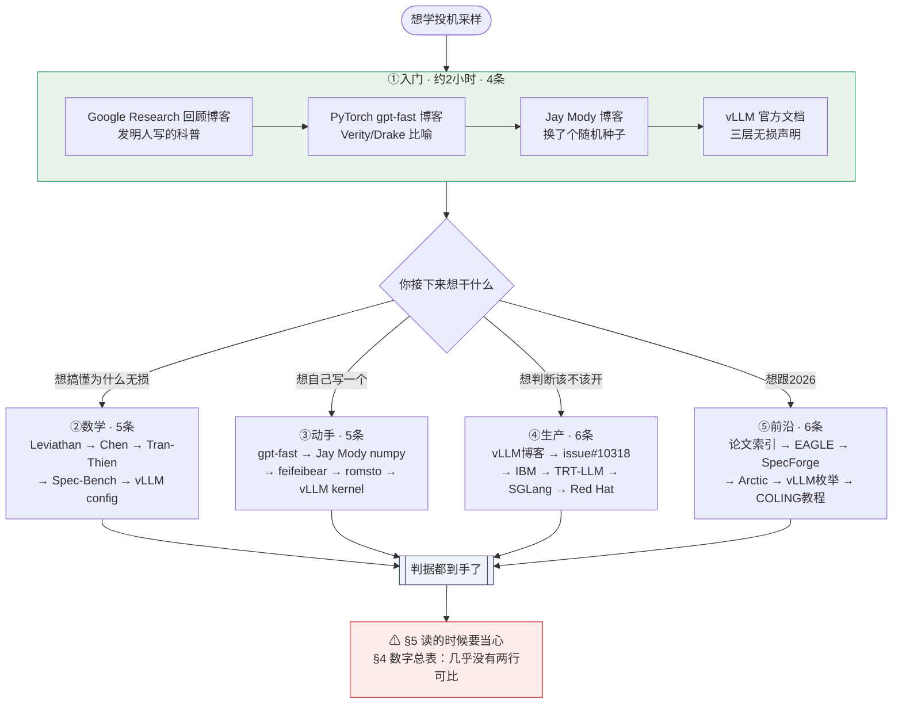

# 30 · 附录 —— 优秀文章与资料清单

> **一句话**：这不是一堆 URL，是一条**最短路径**——按"你现在卡在哪"分成五组，
> 每条都回答三个问题：**我该不该点开它 / 点开之后看什么 / 要小心什么**。

---

## 0. 先读这一节：核验声明与三套标签

### 0.1 核验声明

- 本清单里的每一条 URL，都在 **2026-08-22** 由本库调研环节实际访问过（记录在 `_research/RS-2-社区讲解盘点与评点.md` 与 `_research/RS-2b-优秀文章附录原料.md`）。
- **访问失败的不冒充读过**：一律进 §5.3，就地标注状态码与「链接无法访问（2026-08 核验）」，**不进入任何推荐序列**。
- **只见标题没读正文的，标「未核验」**；检索不充分的，标「未查证」。这两个词在本篇是硬承诺，不是客套。
- 有一条要特别说在前面：**社区广泛流传的"必读清单"里有一条是错的**——Lilian Weng 那篇推理优化综述**根本没有投机解码章节**。详见 §5.2。省你半小时。

### 0.2 三套标签

**(a) 加速比口径标签（对应本库铁律二）**

| 标签 | 含义 |
|---|---|
| 【口径全】 | 加速比同时给了模型组合 / batch 或并发 / γ / 硬件 / 精度 / 指标定义 / 任务；**或者干脆不报数字** |
| 【口径缺】 | 报了数字但缺项，引用时必须加一句"口径不全，不可横向比较" |
| 【口径错】 | 把单请求速率叫成吞吐，或把不同来源的加速比并排比较 |

**(b) 无损口径标签（对应本库铁律一）**

| 标签 | 含义 |
|---|---|
| **L1** | 分布无损：输出是目标分布 $p$ 的精确样本；同 prompt 两次结果**可以不同** |
| **L2** | 贪心等价：$T=0$ 时逐 token 相同 |
| **L3** | 近似：接受判据被放宽，分布已经不等于 $p$ |
| **L?** | 材料自己没说清（**这在权威来源里比想象中常见**） |

**(c) 来源等级**：A = 论文 / 官方文档 / 官方源码；B = 官方或厂商工程博客；C = 个人博客 / 社区长文 / 第三方仓库。

### 0.3 这份清单的失效条件（什么时候不该照它读）

铁律三对一份清单同样成立。**这份清单在下面三种情况下会误导你**：

1. **你的目标是长上下文投机**——本清单的推荐序列几乎全部建立在短上下文材料上；长上下文那条线**截至 2026-08 一个方案都没进三大引擎主干**，只能读论文，见 [[22-长上下文下的投机采样]]。
2. **你的目标是评估自己部署赚不赚**——照读完五组你会拿到一堆别人的数字，而**没有一条能直接外推到你的负载**（§4 的数字总表就是用来堵这个的）。真正要做的是自己扫并发，见 [[18-batch与吞吐-收益衰减曲线]] 与 [[19-负收益全解-什么时候投机反而更慢]]。
3. **距离核验日 2026-08 已经过去半年以上**——引擎参数与方法枚举是本主题变动最快的部分（§5.2 已经记录了一个在 2026-08 就已经失效的参数）。**清单里越靠近"生产"和"前沿"的条目，保鲜期越短。**

---

## 1. 学习路径图

**这张图要读出的一句话**：入门那四条**必须按顺序读**（后一条专治前一条留下的错误认知）；②③④⑤ 四组之间**没有先后**，按你当下的问题挑一组。

---

## 2. 五组推荐阅读顺序（本篇核心）

> 每条给：**标题 / URL / 作者机构 / 年月 / 类型 / 为什么排在这个位置 / 它好在哪 / 已知的坑**。
> **"为什么排在这个位置"必须具体到"它接住了上一条留下的哪个问题"**，否则排序没有价值。

### 2.1 组① 第一次入门（4 条，约 2 小时）

> 目标：看完能回答三个问题——为什么 decode 慢、为什么并行验证几乎免费、"无损"到底保证了什么。

**①-1 Looking back at speculative decoding**
- https://research.google/blog/looking-back-at-speculative-decoding/ ｜ Google Research（Yaniv Leviathan / Matan Kalman / Yossi Matias）｜ 2024-12-06 ｜ B 级 · 官方科普
- **为什么排第一**：这是**发明人自己写的**，而且叙述顺序天然正确——先讲经典投机执行（$f$、$f^*$、$g$）→ 再讲"LLM 输出的是分布不是值" → 才引出 speculative sampling。后面所有材料都默认你已经有了 CPU 分支预测这个心智模型，这条负责把它装进去。
- **好在哪**：$\sqrt{7}$ 的例子（抄一个 7 很容易、算 2.646 很难）三十秒讲清"有些 token 是白送的"。**无损口径 L1**，讲 LLM 采样时用的是精确措辞 "exactly the same probability distribution"。
- **坑**：文中 "We are guaranteed identical outputs either way." 出现在**确定性投机执行**那一段，**不是在讲 LLM 采样**，却被大量断章取义引用。另外 "~2x–3x"、"11B T5-XXL + 60M T5-small → ~3x" 都没给 batch / γ / 硬件，【口径缺】。

**①-2 Accelerating Generative AI with PyTorch II: GPT, Fast（读 Step 3 一节）**
- https://pytorch.org/blog/accelerating-generative-ai-2/ ｜ Team PyTorch ｜ 页面 last updated 2024-11-14 ｜ B 级 · 官方工程博客
- **为什么排第二**：它补上了第 1 条没讲透的那一点——**为什么一个 token 被拒之后，后面的全部作废**。Verity（资深）/ Drake（初级）做 code review 这个比喻，把"链式依赖"讲成了日常经验。前半篇还把 MBU（Model Bandwidth Utilization）算到 72%，让你看清投机解码是被带宽墙逼出来的，不是孤立技巧。
- **好在哪**：【口径全】——全文明写 batch size = 1、A100-80GB power limited to 330W，并给了两组可内部对照的数字：CodeLlama-34B + 7B 约 2×，Llama-7B + TinyLlama-1B 约 1.3×（同一 batch size=1 口径）。
- **坑（重要）**：**这一篇散文错、代码对**。散文里 "mathematically identical results"（把 L1 讲成了 L2）和 "throwing out the ones that don't match"（丢掉了 $\min(1,p/q)$ 的随机性）都是错的；但 `generate.py` 里 `torch.minimum(torch.ones(()), q/p)` 与 `max(0, q-p)` 归一化全对。**入门阶段只看比喻，别记那两句话。**

**①-3 Speculative Sampling（Jay Mody）**
- https://jaykmody.com/blog/speculative-sampling/ ｜ Jay Mody（个人）｜ 2023-02-08 ｜ C 级 · 个人技术博客
- **为什么排第三**：它**专治第 2 条留下的那个错误认知**。一句话解决全社区最高频的误解：> "Speculative sampling giving different result than autoregressive sampling is akin to running autoregressive sampling but **with a different seed**."
- **好在哪**：**"换了个随机种子"是把 L1 讲给程序员听的最短路径**，而且它主动补了例外（$T=0$ 时才逐 token 相同）——即它自己就把 L1 与 L2 分开了。附带的 numpy 实现只有几十行，是你第一次看到**正确的**接受判据与残差分布。不报加速比数字，【口径全】。
- **坑**：记号是 DeepMind 系（`p` = 草稿、`q` = 目标），**与 Leviathan 论文相反**，别以为分子分母写反了。无损性它没自证，甩链接给了论文 Theorem 1。

**①-4 vLLM 官方文档 Speculative Decoding 的 "Lossless guarantees" 部分**
- https://docs.vllm.ai/en/latest/features/speculative_decoding/ ｜ vLLM 项目 ｜ 核验 2026-08 ｜ A 级 · 官方文档
- **为什么排第四**：**收口**。前三条给直觉，这条给正式口径，而且是本次核到最严谨的一份：理论层 "theoretically lossless up to the precision limits of hardware numerics" / 实现层 "algorithmically validated to be lossless" / 数值层 "Changes in batch size may cause variations in logprobs and output probabilities."
- **好在哪**：**三句话正好三层**。尤其最后一句是入门阶段就该听到的警钟——**即使算法层是 L1，真实系统里 batch 组成变化也会通过浮点归约顺序改变结果**。不报加速比，【口径全】；**无损口径 L1，且把限定条件全写了**。
- **坑**：文档随版本变动较快，方法枚举以源码为准（见 §3.3）。

> **入门后应当能判定的三件事**：(a)"输出不一样"不是 bug；(b) 只有 $T=0$ 才谈得上逐 token 相同；(c) 任何不给 batch 的加速比数字都不可信。
> **入门阶段明确不推荐**：Wikipedia 词条、NVIDIA 的 An Introduction to Speculative Decoding。理由见 §5.2。

### 2.2 组② 想搞懂数学（5 条）

> 目标：能自己推出无损性、能算 $\alpha$、能判断"这笔买卖赚不赚"。

**②-1 Fast Inference from Transformers via Speculative Decoding**
- https://arxiv.org/abs/2211.17192 （全文 HTML：https://ar5iv.labs.arxiv.org/html/2211.17192 ）｜ Yaniv Leviathan、Matan Kalman、Yossi Matias，**Google Research** ｜ **v1 2022-11-30**，末版 2023-05-18；ICML 2023 Oral ｜ A 级 · 论文
- **为什么必须从这里开始**：整条数学链上的四个量都是它定义的——§2.3 的接受与修正、Definition 3.1 的 $\beta$ 与 $\alpha$、Corollary 3.6 的 $\alpha=E(\min(p,q))=1-E(D_{LK}(p,q))$、Theorem 3.8 的墙钟提升 $\frac{1-\alpha^{\gamma+1}}{(1-\alpha)(\gamma c+1)}$。**Corollary 3.9（若 $\alpha>c$ 则存在 $\gamma$ 使其获益）是全库最重要的一条判据，必须从原文读到。**
- **好在哪**：Corollary 3.6 是**把"两个模型有多像"变成可计算量**的那一步。§4.1 的 small/base/large 三行表在同一硬件同一设置下内部可比，**同时干掉"草稿越小越好"和"α 越高越快"两个直觉**（该表未标 batch，跨表引用无效）。
- **坑（两条，都很重要）**：
  (a) **摘要与正文口径不一致**——摘要写 "without any changes to the outputs" / "with identical outputs"（L2 措辞），正文写 "without changing the model output **distribution**"（L1）。**社区那个最大误解的源头就在这里**，见 [[07-无损的三种口径-分布无损不等于结果相同]]。
  (b) $E[\tau]$ 的推导**原文明写了 i.i.d. 前提**："If we make the simplifying assumption that the $\beta$s are i.i.d., ... a **capped geometric variable**"。**丢前提的是社区，不是论文。**

**②-2 Accelerating Large Language Model Decoding with Speculative Sampling**
- https://arxiv.org/abs/2302.01318 （全文 HTML：https://ar5iv.labs.arxiv.org/html/2302.01318 ）｜ Charlie Chen、Sebastian Borgeaud、Geoffrey Irving、Jean-Baptiste Lespiau、Laurent Sifre、John Jumper，**DeepMind** ｜ **v1 2023-02-02**（仅 v1，从未修订）｜ A 级 · 论文
- **为什么排第二**：**同一件事的第二个视角**，补上第 1 条没强调的两条边界——"**At least one token will always be generated** from a draft-accept loop" 与 "This gives us a **maximum of $K+1$ tokens per loop**"。**后者就是 vLLM 源码里的 bonus token，手写实现最容易漏。**
- **好在哪**：它发明了那个被所有人继承的限定词——"preserves the distribution of the target model **within hardware numerics**"（**L1**）。附录 Author Contributions 明写 "Modified Rejection Sampling Scheme: **John Jumper**"。
- **坑**：**记号与第 1 条完全相反**（Algorithm 2 原文："Given auto-regressive **target model $q(.|.)$**, and auto-regressive **draft model $p(.|.)$**"）。读这两篇之间必须夹一张记号对照表，否则公式全看反。摘要的 "2-2.5x in a distributed setup" 未给芯片数 / batch / K，【口径缺】。

**②-3 An Optimal Lossy Variant of Speculative Decoding**
- https://huggingface.co/blog/vivien/optimal-lossy-variant-of-speculative-decoding ｜ Vivien Tran-Thien ｜ 2024-06-12 ｜ C 级 · 社区数学博客（**本次核到最严谨的一份社区数学材料**）
- **为什么排第三**：它回答了前两篇留下的那个问题——**"既然无损（L1）是靠 $\min(1,p/q)$ 卡住的，放宽它会怎样？"** 它做成了带约束的最优化问题（KL 预算 $D(q\|\pi)\le D$ 下最大化接受概率），给出闭式解（DeepMind 记号）：$r_i=\min(1,\frac{q_i}{\alpha p_i})$，$s_i=\frac{1}{1-\sum_j p_j r_j}\max(0,\frac{q_i}{\beta}-p_i)$，$\pi_i=p_i r_i+s_i(1-\sum_j p_j r_j)$。**令 $\alpha=\beta=1$ 就退回标准投机采样。**
- **好在哪**：这一步把 L1↔L3 **从二元属性变成一条连续曲线上的位置**——Medusa 的 typical acceptance、各种阈值放宽，本质都是在这条曲线上往右挪，只是它们没算过挪了多远。用了 KKT、给了唯一解存在性与二分搜索算法、链了形式化证明、在 WMT15 上做了实验。
- **坑**：约束用的是 **KL**，而 $\alpha=1-\mathrm{TV}$ 用的是 **TV**，两者不能直接换算。且它给了旋钮没给刻度（KL 预算取多少，没答）。

**②-4 Spec-Bench 榜单**
- https://github.com/hemingkx/Spec-Bench ｜ 榜单原文 https://raw.githubusercontent.com/hemingkx/Spec-Bench/main/Leaderboard.md ｜ hemingkx ｜ 榜单最后更新 **2025-04-22**，405 stars ｜ A 级 · 基准与榜单
- **为什么排第四**：**数学学到这里必须落回数字，而这是唯一一份口径齐全到可以直接验证公式的榜单。** 口径写在榜单头上：单张 A100-80GB / 96 CPU cores（另一组 RTX 3090-24GB），PyTorch 2.5.1，Vicuna-7B/13B/33B-v1.3，greedy decoding，FP16，**batch size = 1**。
- **好在哪**：它**把 #MAT（Mean Accepted Tokens）与加速比并列报**，正好把 $E[\tau]$（草稿质量）与墙钟提升（含实现效率）分开。最该盯的一行：同一张 A100、同为 batch size = 1 的 Vicuna-7B 上，**Recycling 的 #MAT 只有 2.73 却拿到 2.22×，EAGLE2 的 #MAT 是 4.34 只拿到 2.36×**——接受长度差 1.6 倍，加速比只差 6%。这是 $c$（草稿成本）在起作用，是 Corollary 3.9 最好的实证注脚。【口径全】
- **坑**：**全部 batch=1 + greedy**，因此它**测不出**大 batch 负收益与 $T>0$ 的接受率变化；榜单未覆盖 2025 下半年之后的方法；榜单本身没有一句"跨论文加速比不可比"的警示，这层意思要你替它说。

**②-5 vLLM 源码 `vllm/config/speculative.py`**
- https://raw.githubusercontent.com/vllm-project/vllm/main/vllm/config/speculative.py ｜ vLLM 项目 ｜ main 分支，核验 2026-08-22 ｜ A 级 · 官方源码
- **为什么排最后**：它是**"数学在工程里被怎么改写"的答案**，读完前四条才看得懂它在拒绝什么。三处关键：
  (a) **$\alpha$ 的工程定义是"边际"不是"条件"**——"Per-position ***unconditional*** acceptance rates ... Position i's entry is the **marginal probability that the first i+1 draft tokens are all accepted**; ... must be **monotonically non-increasing**."（与 Leviathan 的条件概率定义**只有在 i.i.d. 下才互换**）
  (b) **vLLM 明确不用几何模型**——`_acceptance_length_to_rates` 的 docstring 写 "using the **minimum-variance schedule**"，实现是 `[1.0]*num_full + [frac] + [0.0]*...`，**根本不是 $\alpha^i$ 衰减**。这是"$E[\tau]=(1-\alpha^{\gamma+1})/(1-\alpha)$ 不是恒等式"最硬的证据。
  (c) **草稿默认贪心**——`draft_sample_method: DraftSampleMethod = "greedy"`，"the draft probabilities are treated as **one-hot** during rejection sampling"；`'probabilistic'` 模式 "comes at the cost of additional GPU memory usage"。**即生产系统默认根本不用草稿的完整分布**；这仍是 **L1**，但接受率的数学完全不同。
- **坑**：源码不解释"为什么这个调度方差最小"，要用就得自己验证（本库在 [[06-期望接受长度与加速比模型-完整推导]] 里做了）。

### 2.3 组③ 想动手实现（5 条）

> 目标：从 50 行的最短正确实现，到能读懂生产 kernel。
> **本库逐行核对了这一组的接受判据与残差分布，全部正确。唯一的陷阱是第 4 条里的一个开关。**

**③-1 gpt-fast 的 `speculative_decode`（约 50 行原生 PyTorch）**
- https://raw.githubusercontent.com/pytorch-labs/gpt-fast/main/generate.py ｜ pytorch-labs ｜ 核验 2026-08 ｜ A 级 · 参考实现
- **为什么排第一**：**最短的正确实现**，官方博客用一句话背书："Here's the entirety of the implementation, in about **50 lines** of native PyTorch."
- **好在哪**：三要素齐全——`torch.minimum(torch.ones(()), q[:speculate_k]/p)`（$\min(1,\cdot)$）、`torch.rand_like(...)`（随机性）、`new = q - p; new = torch.where(new>0,new,0.0); new = new/new.sum()`（归一化残差）。记号 `p` = draft、`q` = target。
- **坑**：**别读它的博客散文**（见 ①-2）。它还带 KV cache 回滚与 `torch.compile`，第一次读先跳过这两块。

**③-2 Jay Mody 的 numpy 版**
- https://jaykmody.com/blog/speculative-sampling/ ｜ Jay Mody ｜ 2023-02-08（2023-04-13 有修订）｜ C 级 · 教学实现
- **为什么排第二**：它把第 1 条的 PyTorch 骨架翻译成了**没有框架也能懂**的版本，而且 `autoregressive_sampling()` 与 `speculative_sampling()` 并排放着，**可以直接对拍**。
- **好在哪**：判据 `if np.random.random() < min(1, q[i][j] / p[i][j])`，残差 `sample(max_fn(q[i] - p[i]))`，一眼看全。**2023-04-13 的修订说明也值得看**（去掉了一次多余的草稿模型前向）——**这是"实现里最容易多跑一次前向"这个坑的现成记录**。
- **坑**：`p` = 草稿、`q` = 目标（与 ③-1 同系，与 Leviathan 论文相反）。

**③-3 feifeibear/LLMSpeculativeSampling**
- https://github.com/feifeibear/LLMSpeculativeSampling ｜ 核心文件 https://raw.githubusercontent.com/feifeibear/LLMSpeculativeSampling/main/sampling/speculative_sampling.py ｜ 923 stars，最后更新 2023-09-21 ｜ C 级 · 第三方仓库
- **为什么排第三**：**唯一一个把两篇奠基论文的算法做成两份代码并排放的仓库**。README："I implement **two slightly different versions** of speculative sampling: Google's and Deepmind's."**直接 diff 这两个函数，就能亲眼看到两篇论文的差异在哪（KV cache 回滚方式、最后一个 token 的处理），比读一万字对比文章都快。**
- **好在哪**：两版分别演示了"写成拒绝"（`if r > p_target/p_draft`）与"写成接受"（`if r < torch.min(torch.tensor([1]), p/q)`）两种等价写法。
- **坑**：README 的 benchmark（7b 1084.86 / 70b 329.83 / spec 427.02）**没有硬件、没有 γ、没有 batch，单位也存疑**，按面值只有 1.29×，【口径缺，近乎口径错】。**只读代码，不要引用它的数字。** 2023-09 后基本停更，无树、无 EAGLE。

**③-4 romsto/Speculative-Decoding**
- https://github.com/romsto/Speculative-Decoding ｜ 核心文件 https://raw.githubusercontent.com/romsto/Speculative-Decoding/main/sampling/speculative_decoding.py ｜ 115 stars ｜ C 级 · 第三方仓库
- **为什么排第四**：它做了前三条都没做的事——**把自回归、beam search、投机解码、NASD（N-gram 辅助）放在一个仓库里**，可以直接对拍。README 的措辞也精确："without **changing the output distribution**"（L1）。
- **⚠ 坑（本组唯一的陷阱）**：它带一个开关 `skip_sample_adjustment`，打开后 `p_p = p[..., n, :]`——**"拒绝后直接从 $p$ 重采"这个经典错误的可执行版本，而 README 没有任何警告。**
- **两面看**：作为**消融开关**它非常有价值（可以实测跳过残差修正会把分布偏成什么样）；作为默认可用 API 它是陷阱。本库 `_lab/test_lossless.py::test_naive_resample_is_biased` 做的正是同样的对照实验。

**③-5 vLLM 的 `vllm/v1/sample/rejection_sampler.py`**
- https://raw.githubusercontent.com/vllm-project/vllm/main/vllm/v1/sample/rejection_sampler.py ｜ vLLM 项目 ｜ main 分支，核验 2026-08-22 ｜ A 级 · 官方源码
- **为什么排最后**：它展示了**"数学写法"与"生产写法"的三处真实差距**，读完前四条才有对照。docstring 先钉死出处："The implementation **strictly follows** the algorithm described in https://arxiv.org/abs/2211.17192."
- **好在哪（三处差距）**：
  - **没有显式 `min`**——`accepted = draft_prob > 0 and target_prob / draft_prob >= uniform_prob`（比值 ≥1 时不等式自动成立，`min` 是多余的）。
  - **残差不做归一化，改用 Gumbel-max**——`prob = tl.maximum(target_prob - draft_prob, 0.0); score = prob * inv_q`，然后取 argmax。省掉了 $\sum$ 归一化与逐位置多项式采样。
  - **术语更精确**——accepted / **recovered**（拒绝后补采的）/ **bonus**（全接受时目标模型白送的那个）。**本库统一采用这套术语。**
- **坑**：Gumbel-max 与显式归一化在浮点上不严格等价——这与官方文档那句 "up to the precision limits of hardware numerics" 是同一件事的两面（**仍是 L1，但只到浮点精度**）。

> **动手阶段的建议练习**：拿 ③-1 或 ③-2 的实现做三个消融——(a) 把 $\min(1,p/q)$ 换成 `p > q`；(b) 把残差换成直接采 $p$（即 ③-4 的开关）；(c) 把 $\gamma$ 从 1 扫到 16。跑经验分布对拍，看前两个把分布偏成什么样、第三个的收益曲线在哪里拐头。本库 `_lab/test_lossless.py` 已覆盖前两个。

### 2.4 组④ 想上生产（6 条）

> 目标：能回答"我这个部署到底该不该开投机、开了会不会亏、参数怎么调"。
> **这一组的共同价值：它们全都给了失效条件。教学向材料几乎没有一份给。**

**④-1 How Speculative Decoding Boosts vLLM Performance by up to 2.8x**
- https://vllm.ai/blog/2024-10-17-spec-decode ｜ vLLM Team ｜ 2024-10-17 ｜ B 级 · 官方工程博客
- **为什么排第一**：**唯一一份把"赚的数字"和"亏的数字"并排放出来的官方博客**，一进门就把期望值校准好。赚：4×H100、QPS = 1 下，Llama3-70B + Qwama-0.5B 草稿在 ShareGPT 上 1.5×，n-gram 在 CNN/DailyMail 上 2.8×；亏：**同样配置在高 QPS 下 ShareGPT 慢 1.4×、CNN/DailyMail 慢 1.8×**。
- **好在哪**：机制解释也对——"The extra compute required to propose and verify tokens can sometimes slow down the system **when it is already compute-bound**."【口径全（相对而言）】给了模型对、数据集、GPU 数、QPS，缺 γ。
- **坑**：它把 lossless 写成无口径的一句话（**L?**）；H100 未注明 SXM 还是 PCIe——这一条直接引出下一篇。

**④-2 vLLM Issue #10318：博客数字不可复现**
- https://github.com/vllm-project/vllm/issues/10318 ｜ vLLM 社区 ｜ 2024-11 提出 ｜ A 级 · 官方 issue
- **为什么必须紧跟 ④-1**：**这是本附录里最重要的一次"打预防针"。** 有人拿着官方配置去复现：vLLM 0.6.3、**4×H100 PCIe**、Llama-3-70B（TP=4）+ Qwama-0.5B（TP=1）、ShareGPT、1 QPS、4 个投机 token——**实测最高只到 1.4×（batch size=1 时）**；batch size = 256 时端到端延迟 "exceeded 20 seconds"。**issue 被打 stale 标签，90 天后以 "not planned" 关闭，官方未补实验细节、未回应差距。**
- **好在哪**：读完这一条，你会永久性地不再相信任何不带完整口径的加速比。它本身是本清单里**口径最全的一条记录**（版本、卡型、并行方式、QPS、batch、γ 全给）。
- **坑**：严格说这是"口径不全导致无法复现"（博客未注明 H100 是 SXM 还是 PCIe，PCIe 带宽显著更低），**不能据此判定博客造假**，引用时必须这样表述。

**④-3 A Hitchhiker's Guide to Speculative Decoding**
- https://pytorch.org/blog/hitchhikers-guide-speculative-decoding/ ｜ PyTorch / IBM ｜ 页面 last updated 2024-11-13 ｜ B 级 · 官方工程博客
- **为什么排第三**：**本次核到唯一一份真实生产部署报告**——"deployed these speculators in an internal production-grade environment with **thousands of daily users**"。三条可直接抄进运维手册：
  - **一个具体的失效拐点**："We begin to observe **throughput reduction beyond a batch size of 64**, which happens rarely in practice."
  - **γ 与任务类型绑定**："we find **3-4 heads works well** in practice, whereas we found that **code models can reap benefits from 6-8 heads**"。
  - **指标选得对**：报的是 **TTFT 与 ITL 随并发用户数变化的两张曲线**，不是笼统的 tok/s。
- **好在哪**：还给了草稿头训练配方（两阶段：4k 长序列小 batch 走 causal LM → 256 短序列大 batch 对齐基座输出，5:2 步数配比），是 [[21-草稿模型怎么训-对齐与在线蒸馏]] 的现成材料。
- **坑**：开篇踩了"输出完全一致"（**把 L2 当 L1 说**）；"batch size > 64 很少见"是 2024 年 IBM 内部负载的判断，**2026 年已不成立**（见 ④-6）。

**④-4 TensorRT-LLM 官方文档 Speculative Decoding**
- https://nvidia.github.io/TensorRT-LLM/1.2.0rc6/features/speculative-decoding.html ｜ NVIDIA ｜ 核验 2026-08 ｜ A 级 · 官方文档
- **为什么排第四**：**它最诚实地暴露了引擎的真实约束，而这些约束在厂商博客里一个字都不会写。** 三句话值回票价：
  > "A draft token is accepted **if matches the previously decoded token exactly**."
  > "**only greedy sampling is supported** for speculative decoding"
  > "There is currently **no way to dynamically disable speculation**, thus **speed ups are only observable at low batch sizes**."
- **好在哪**：**它明确承认自己是 L2**，同时给了"为什么会亏（不能动态关）+ 什么时候亏（大 batch）"。还写了隐性代价：two-model 模式 "do not support **overlap scheduler**. It will be disabled automatically."
- **坑**：MTP 的 `use_relaxed_acceptance_for_thinking` / `relaxed_topk` / `relaxed_delta` **是有损（L3）开关，文档没有任何标注**——见 [[14-MTP-从训练目标到推理草稿]]。另有一份更旧的 advanced 页 https://nvidia.github.io/TensorRT-LLM/advanced/speculative-decoding.html **内容停留在 2025-09-15**，落后于实际支持情况，引用须注明版本日期。

**④-5 SGLang 官方文档 Speculative Decoding**
- https://docs.sglang.io/advanced_features/speculative_decoding.html ｜ SGLang 项目 ｜ 核验 2026-08 ｜ A 级 · 官方文档
- **为什么排第五**：**要调树形草稿，只有这份文档把三个旋钮的语义分开写清楚了**：`--speculative-num-steps` = "**Depth** of autoregressive drafting"；`--speculative-eagle-topk` = "**Branching factor** per step"；`--speculative-num-draft-tokens` = "Maximum **parallel verification capacity**"。**深度 / 宽度 / 总预算三维分离，读完才知道"调树"到底在调什么**，见 [[16-树形草稿与树注意力-mask构造与验证]]。
- **好在哪**：默认值按模型族分叉（Llama/Grok：steps=5, topk=4, draft-tokens=8；其他：3/1/4），**这本身说明接受率高度依赖模型族**。隐性代价也写了：`topk>1` 会关掉 overlap scheduler；ngram 会 "disables the overlap scheduler & mixed chunked prefill"。
- **坑**：1×H100、MT-bench、LLaMA-3.1-8B 那组数字（baseline 158.34 tok/s → EAGLE-2 244.10 → EAGLE-3 373.25）**未标 batch**（按 MT-bench 惯例应为 batch size = 1），却用 "throughput gains" 描述，【口径缺 / 近口径错】。**完全没有关于 temperature / 是否无损的表述（L?）**，示例全用 `temperature=0`。

**④-6 Performance improvements with speculative decoding in vLLM for gpt-oss**
- https://developers.redhat.com/articles/2026/04/16/performance-improvements-speculative-decoding-vllm-gpt-oss ｜ Red Hat（Harshith Umesh）｜ 2026-04-16 ｜ B 级 · 厂商工程博客
- **为什么排最后**：**它推翻了前五条读者刚建立起来的直觉，必须最后读、带着前面的判据来读。** 口径是本组最全的：目标 `openai/gpt-oss-120b`（MoE + MXFP4）+ 草稿 `nvidia/gpt-oss-120b-Eagle3-v2`，H200-PCIe-141GB，TP=1/2，**并发 1/5/25/50/100/200 全扫**，GuideLLM v0.5.3 + vLLM v0.13.0。ShareGPT 峰值 2574 vs 2024 tok/s（+27.2%），几何平均 +20.7%，且 "improvements that **persist with up to 200 concurrent requests**"；MLPerf 长 prompt TP=1 +9.5% / TP=2 +16%；SWE-bench +20.5%（并发 100 时 +24%）。
- **好在哪**：给了 γ 的边际成本——"**2 or 3 draft tokens is the sweet spot**"；"going from 3 to 4 draft tokens causes a modest **8% output throughput drop**"。**结论要改写成条件式**："大 batch 一定亏"不成立；正确表述是**收益取决于（激活参数/总参数比、权重精度、草稿接受率）三者**。
- **坑**：厂商博客，结论对自家栈有利；MoE + MXFP4 **不能推广到稠密 fp16 模型**；它也踩了 "no change to output quality"（**L?**）。

> **生产阶段的决策速查**：
>
> | 问题 | 去哪条找答案 |
> |---|---|
> | 我的并发下还赚吗 | ④-1（高 QPS 反向数字）、④-3（batch size > 64 拐点）、④-6（MoE 例外） |
> | 引擎支不支持采样 | ④-4（只支持贪心）、④-5（未表态） |
> | 开了投机会关掉什么 | ④-4、④-5（overlap scheduler） |
> | γ 取几 | ④-3（3-4 / 6-8 按任务）、④-6（2-3，第 4 个掉 8%） |
> | 别人的加速比能不能信 | ④-2（不可复现案例）、②-4（Spec-Bench 才是可比的） |

### 2.5 组⑤ 想跟前沿（6 条）

> 目标：知道 2024 → 2026 这条线上什么变了、什么死了、下一步在哪。

**⑤-1 hemingkx/SpeculativeDecodingPapers**
- https://github.com/hemingkx/SpeculativeDecodingPapers ｜ README 原文 https://raw.githubusercontent.com/hemingkx/SpeculativeDecodingPapers/main/README.md ｜ hemingkx ｜ 1.3k stars，500+ 篇，覆盖 2018 → 2026-06 ｜ A 级 · 论文索引
- **为什么排第一**：**跟前沿的第一步是拿到地图。** 它的分类法本身就是一张谱系：`Survey` / `Seq2Seq` / `LLMs` / **`Multi-Token Prediction`** / **`Diffusion LMs`** / `Multimodal` / **`Long-Context`** / **`Mixture-of-Experts`** / `Alignment` / `Benchmarks` / `Applications` / **`Analysis`** / `Other Techniques`。
- **好在哪**：三个分类值得单独注意——`for MoE`（呼应 ④-6）、`Long-Context`（[[22-长上下文下的投机采样]]）、以及 **`Analysis` 已经自成门类**，说明"分析投机解码到底赚不赚"已是一条独立研究线。
- **坑**：**只列不评，没有"哪些分支已经死了"的标记**——这恰是 [[15-谱系图与被淘汰的分支]] 要补的增量。README last update 本次未取到，标「未查证」。

**⑤-2 EAGLE 官方仓库**
- https://github.com/SafeAILab/EAGLE ｜ SafeAILab ｜ 2.5k stars，README last update 2025-09-18 ｜ A 级 · 官方仓库
- **为什么排第二**：**EAGLE 三代是这条线上唯一一个"每一代都推翻上一代核心假设"的谱系**，README 把差异压成三句：EAGLE-1 外推**倒数第二层的上下文特征向量**；EAGLE-2 用草稿的 confidence 近似接受率、据此**动态调整草稿树结构**；EAGLE-3 **"Removes the feature prediction constraint in EAGLE"**，改用 **training-time test**，并把顶层特征换成低/中/高层语义的融合。
- **好在哪**：**"EAGLE-3 把 EAGLE-1 的核心机制删掉了"是全库最干净的一条"被推翻"记录**，见 [[13-EAGLE三代-特征级自回归的演进]]。
- **坑**：**README 的 Todo 里仍写着 "Support non-greedy inference (provably maintaining text distribution)"（2026-08 核验）**，与正文那句 "provably maintaining the consistency ... in the **distribution** of generated texts" 并列出现，**自相矛盾，无法判定 $T>0$ 下是 L1 还是 L2（L?）**。README 的 "3x faster (13B)"：Vicuna 13B、2×RTX 3090、fp16，**无 batch、无 temperature、无树规模**，【口径缺】。

**⑤-3 SpecForge: Accelerating Speculative Decoding Training for SGLang**
- https://www.lmsys.org/blog/2025-07-25-spec-forge/ ｜ SGLang Team / LMSYS ｜ 2025-07-25 ｜ B 级 · 官方工程博客
- **为什么排第三**：**它标志了这条线的重心转移：从"算法"转到"怎么把草稿模型训出来"。** 立论句："the lack of robust open-source tools for **training draft models** ... has significantly hindered its adoption."
- **好在哪**：两条硬信息——离线模式要 "**~12TB for UltraChat + ShareGPT**" 的磁盘来存 hidden states（**这个数字让"训草稿的成本"变得具体**）；EAGLE-3 的 TTT "makes the draft model robust by **simulating multi-step generation**"，实现难在 "specialized attention masks and recursive data loops"。
- **坑**：Llama 4 Scout 2.0× / Maverick 2.18×（MT-Bench）**无硬件、无 batch、无接受长度**，【口径缺】；只给了 `speculative-eagle-topk=8`、`speculative-num-draft-tokens=10`。配套论文见 §3.1（arXiv:2603.18567，2026-03）。

**⑤-4 Fastest Speculative Decoding in vLLM with Arctic Inference**
- https://www.snowflake.com/en/engineering-blog/fast-speculative-decoding-vllm-arctic/ ｜ Snowflake ｜ 2025-05-01 ｜ B 级 · 厂商工程博客
- **为什么排第四**：**它同时代表了两个 2025-26 的新方向，而且贡献了本库最锋利的一句引文。** 方向一：**草稿可以不要 GPU**——suffix decoding 在 CPU 上 "**20 microseconds per token**"；方向二：**agent 场景是投机解码的新主场**——SWE-Bench 上跑 CodeAct agent（OpenHands LM 32B）端到端 1.8×–4.5×（**该组未标 batch 与硬件，【口径缺】**）。
- **好在哪**：那句引文——"**Switched from rejection sampling to greedy verification** (accept tokens only if they match greedy decoding), ensuring **outputs are identical to the base model** without lowering acceptance rate."**它证明 L2 不是"退化的 L1"，而是被生产团队主动选择的需求（可复现性）**，见 [[07-无损的三种口径-分布无损不等于结果相同]]。主实验【口径较全】：8×H100、TP=2、FP8、0.5 req/s，ShareGPT 179 / HumanEval 217 / 混合 209 tok/s。
- **坑**："without lowering acceptance rate" 是他们的实测，**不是定理**（贪心验证的接受概率数学上不可能高于拒绝采样）。续作见 https://www.snowflake.com/en/engineering-blog/suffixdecoding-arctic-inference-vllm/ （2025-12-02，连 CPU 侧微秒级开销与遗留 10% 开销都写了）。

**⑤-5 vLLM `config/speculative.py` 的方法枚举**
- https://raw.githubusercontent.com/vllm-project/vllm/main/vllm/config/speculative.py ｜ vLLM 项目 ｜ main，核验 2026-08-22 ｜ A 级 · 官方源码
- **为什么排第五**：**"哪些方法活下来了"这个问题，最诚实的答案在生产系统的枚举类型里，不在论文里。** 2026-08 快照：`SpeculativeMethod = ngram / medusa / mlp_speculator / draft_model / suffix / custom_class / eagle / eagle3 / extract_hidden_states / dflash / <MTP 全家> / ngram_gpu / dspark`。
- **好在哪（三条趋势）**：
  - **MTP 已成新模型标配**——`MTPModelTypes` 列了 **27 种**模型特化 MTP。"自带草稿头"从论文技巧变成了模型发布的默认配件。
  - **逐 token 验证不再是唯一方案**——`RejectionSampleMethod = "standard" | "synthetic" | "block"`，block 的注释是 "**block verification (Sun et al.)**, which jointly verifies the draft tokens **as a block instead of one at a time**"。
  - **自适应化**——`enable_adaptive_verification`（"adaptively size the draft-verification budget from per-request confidence"）。
  - 另有一条对 MTP 极重要的告警："Enabling `num_speculative_tokens > 1` will run multiple times of forward on same MTP layer, **which may result in lower acceptance rate**"——**这正是"MTP 的训练目标 ≠ 推理期草稿用法"在生产里的具体表现**。
- **坑**：枚举随 main 分支漂移，引用必须带核验日期。

**⑤-6 COLING 2025 Tutorial：Speculative Decoding for Efficient LLM Inference**
- https://speculative-decoding.github.io/ ｜ Heming Xia、Yongqi Li、Wenjie Li（香港理工大学）、Cunxiao Du（SEA AI Lab）、Qian Liu（TikTok）｜ 2025-01-19 于 Abu Dhabi ｜ A 级 · 学术教程
- **为什么排最后**：**唯一一份体系化教学材料**，适合当"跟完前沿之后回头做整理"的收口。议程：`Introduction & Definition (40min)` → `History and Taxonomy of Methods (45min)` → `Cutting-edge Algorithms (40min)` → `Downstream Adaptations (30min)` → `Final Remarks & Q&A (20min)`。同一批人也是综述 arXiv:2401.07851（Findings of ACL 2024）的作者。
- **坑**：**slides（https://tinyurl.com/speculative-decoding-tutorial ）与录像（https://tinyurl.com/spec-tutorial-recording ）本次未跟进短链跳转，未核验**，因此**不能对其内容质量下结论**。主页对无损的表述是概括性的 "maintaining original distributions"，**未细分 L1/L2/L3**。

---

## 3. 分类全清单

### 3.1 原论文（按时间线）

> 铁律五：年月一律取 arXiv **v1** 的年月。查不到的写「未查证」。

| 年月 | arXiv | 标题 / 通称 | 一作 + 机构 | 它新增了什么 | 无损口径 |
|---|---|---|---|---|---|
| 2018-11 | 1811.03115 | Blockwise Parallel Decoding（NeurIPS 2018） | Mitchell Stern，UC Berkeley（实习于 Google Brain） | 一次前向出多个位置的预测，再逐位置 exact-match 回退 | **L2**（exact-match 变体）/ §5 的三种近似准则是 **L3** |
| 2020-02 | 2002.03629 | Jacobi / Gauss-Seidel 并行解码（ICML 2021） | Yang Song，Stanford | 把自回归解码写成不动点迭代 | 理论 $\epsilon=0$ 时 **L1**，实验用 $\ell_\infty<0.01$ 容差降级为近似 |
| 2022-11 | 2211.17192 | Fast Inference from Transformers via Speculative Decoding（ICML 2023 Oral） | Yaniv Leviathan，Google Research | 定义 $\alpha$、$E[\tau]$、$\alpha>c$ 判据；给出接受-修正规则 | 正文 **L1**；摘要用了 L2 措辞（见 §5.1） |
| 2023-02 | 2302.01318 | Accelerating LLM Decoding with Speculative Sampling | Charlie Chen，DeepMind | "within hardware numerics" 与 bonus token（$K+1$）的出处 | **L1** |
| 2023-02 | 2302.07863 | Big Little Decoder（BiLD，NeurIPS 2023） | Sehoon Kim，UC Berkeley | 回退+回滚的两模型协作 | **L3**（标题有误导性） |
| 2023-05 | 2305.09781 | SpecInfer | Xupeng Miao，CMU | 把单链草稿换成**树**并做树验证 | 未查证（本库按 L1 处理，见 16 篇） |
| 2023-05 | 2305.10427 | Santilli et al. 并行 Jacobi 解码（ACL 2023） | Andrea Santilli，Sapienza University of Rome | 无需额外模型的并行解码 | **L2**（与 greedy AR 结果相同；无法与 beam search 结合） |
| 2023-08 | 2308.04623 | Staged Speculative Decoding | Benjamin Spector，Stanford | 草稿本身再加一层投机（分级） | 未查证 |
| 2023-09 | 2309.08168 | Draft & Verify（自投机） | Jun Zhang，浙江大学 | 跳层早退当草稿，免独立草稿模型 | 未查证 |
| 2023-10 | 2310.15141 | SpecTr | Ziteng Sun，Google Research | 用最优传输把单草稿推广到多草稿 | 未查证 |
| 2023-11 | 无 arXiv | Prompt Lookup Decoding（GitHub 仓库） | Apoorv Saxena | **无模型草稿**：从 prompt 里直接查 n-gram | 未查证（等价 L1） |
| 2023-11 | 2311.08252 | REST | Zhenyu He，北京大学 | 从检索库里取草稿 | 未查证 |
| 2023-12 | 2312.11462 | Cascade Speculative Drafting | Ziyi Chen，UIUC | 级联草稿 | 未查证 |
| 2024-01 | 2401.10774 | Medusa | Tianle Cai，Princeton / Together AI | 多头草稿 + 树注意力；typical acceptance | **L3**（typical acceptance 明确放宽了分布匹配） |
| 2024-01 | 2401.15077 | EAGLE | Yuhui Li，北京大学（+ MSR、Waterloo） | 在**特征层**做自回归外推，而非 token 层 | 论文称分布一致；README 自相矛盾（**L?**，见 ⑤-2） |
| 2024-02 | 2402.02057 | Lookahead Decoding | Yichao Fu，UC San Diego | 用 Jacobi 轨迹造 n-gram 池，免草稿模型（blog 更早：2023-11-21） | 未查证 |
| 2024-02 | 2402.05109 | Hydra | Zachary Ankner，MIT · MosaicML | 让 Medusa 的多头之间也有依赖 | 未查证 |
| 2024-02 | 2402.12374 | Sequoia | Zhuoming Chen，CMU | 树结构的**可扩展/硬件感知**构造 | 未查证 |
| 2024-03 | 2403.09919 | ReDrafter（Recurrent Drafter） | Yunfei Cheng，Apple | 在 beam search 结果上做 **dynamic tree attention** 去重前缀 | 未表态 |
| 2024-04 | 2404.11912 | TriForce | Hanshi Sun，CMU | 长上下文：分层 KV 投机 | 未查证 |
| 2024-04 | 2404.16710 | LayerSkip | Mostafa Elhoushi，Meta | 训练即为早退准备，自投机 | 未查证 |
| 2024-04 | 2404.18911 | Kangaroo | Fangcheng Liu，华为诺亚方舟实验室 | 自投机 + 双早退 | 未查证 |
| 2024-04 | 2404.19737 | Better & Faster LLMs via Multi-token Prediction | Fabian Gloeckle，FAIR at Meta | **MTP 作为训练目标**（推理期可用作草稿） | 未表态（训练目标，非解码算法） |
| 2024-06 | 2406.16858 | EAGLE-2 | 同 EAGLE 四人 | 用 confidence 近似接受率，**动态调树** | 同 EAGLE |
| 2024-08 | 2408.11049 | MagicDec | Ranajoy Sadhukhan，CMU（+ Moffett AI、Together AI） | **推翻"只在小 batch 有用"**：长序列大 batch 下仍可赚 | 未查证 |
| 2024-08 | 2408.15766 | HASS | Lefan Zhang，小红书 | 训练-解码对齐 | 未查证 |
| 2024-11 | 2411.04975 | SuffixDecoding（NeurIPS 2025 Spotlight） | Gabriele Oliaro，CMU + Snowflake | 后缀树/自动机做草稿，CPU 侧微秒级 | **L1** |
| 2024-11 | 2411.10666 | 后缀自动机草稿 | Yuxuan Hu，中国人民大学 | 同上一支线的另一实现 | 未查证 |
| 2024-12 | 2412.19437 | DeepSeek-V3 技术报告 | DeepSeek-AI | **MTP 模块随模型一起发布**，成为"自带草稿头"的样板 | **L1**（作草稿时） |
| 2025-03 | 2503.01840 | EAGLE-3 | 同 EAGLE 四人 | **删掉 EAGLE-1 的特征预测约束**，改 training-time test + 多层特征融合 | 同 EAGLE |
| 2025-10 | 2510.07535 | OWL / HOWL / LongSpecBench | Jaeseong Lee，Snowflake AI Research | 长上下文专用 drafter 与配套 benchmark | 未查证（论文称无损） |
| 2024-01 | 2401.07851 | **综述**：Unlocking Efficiency in LLM Inference（Findings of ACL 2024） | Heming Xia 等，香港理工大学 | Spec-Bench 与 COLING 教程的配套综述 | 未查证（**本次未逐页核验正文** ） |

**2025–2026 前沿论文**（只列本库正文实际用到的；完整清单见 [[24-前沿进展-2025到2026]]）：

| 年月 | arXiv | 通称 | 一句话 |
|---|---|---|---|
| 2025-08 | 2508.08192 | Efficient Speculative Decoding for Llama at Scale（Meta，38 作者） | 大规模生产线上的投机解码工程报告 |
| 2025-10 | 2510.22876 | Batch Speculative Decoding Done Right（eBay） | 主张现有实现在 batch 下违反输出等价（**覆盖范围未查证**） |
| 2026-02 | 2602.01469 | P-EAGLE | 并行化 EAGLE 草稿 |
| 2026-02 | 2602.06036 | DFlash | **草稿从自回归换成块扩散**，2026 年结构性变化 |
| 2026-02 | 2602.07223 | Vegas（v1 疑似名 SpecAttn，ICML 2026） | verification-guided 稀疏，长上下文 |
| 2026-03 | 2603.18567 | SpecForge 论文 | ⑤-3 那篇博客的配套论文 |
| 2026-06 | 2606.24957 | Dustin（ICML 2026） | **有损**：draft 增强的稀疏验证 |
| 2026-07 | 2607.05147 | DSpark（DeepSeek 生产） | **验证侧**的自适应预算分配 |

> ⚠ 上表的"通称"来自本库调研笔记 `_research/RS-5-前沿与未来.md` 的编号-题名对照；**这些条目的完整题名、作者机构与数字口径未逐字回原文核对**，引用前请自行补全（铁律五）。

### 3.2 官方文档与工程博客

| 材料 | URL | 机构 / 年月 | 最值得读的一点 | 无损口径 |
|---|---|---|---|---|
| vLLM 官方文档 Speculative Decoding | https://docs.vllm.ai/en/latest/features/speculative_decoding/ | vLLM，核验 2026-08 | 三层无损声明 + "batch 变化会改变 logprobs" | **L1（限定最完整）** |
| vLLM Dynamic Speculative Decoding | https://docs.vllm.ai/en/latest/features/speculative_decoding/dynamic_speculative_decoding/ | vLLM，核验 2026-08 | 配置语义清楚，**但一个 benchmark 数字都没有** | 未表态 |
| vLLM Suffix Decoding 文档 | https://docs.vllm.ai/en/latest/features/speculative_decoding/suffix/ | vLLM，核验 2026-08 | 无模型草稿的官方入口 | 未表态 |
| vllm-ascend 投机解码指南 | https://docs.vllm.ai/projects/ascend/en/main/user_guide/feature_guide/speculative_decoding.html | 昇腾，核验 2026-08 | **方法矩阵 + 把限制写全了**（`num_spec+1 ≤ 16`；DeepSeek MTP 在 ≥3 时不保证） | 未表态 |
| vLLM 博客 2.8× | https://vllm.ai/blog/2024-10-17-spec-decode | vLLM，2024-10-17 | 赚与亏的数字并排（QPS=1 vs 高 QPS） | **L?** |
| vLLM EAGLE 3.1 | https://vllm.ai/blog/2026-05-26-eagle-3-1 | vLLM + EAGLE Team，2026-05 | 机制讲得清楚；**加速比图注的基线口径没写明**，也未列局限 | 未表态 |
| vLLM P-EAGLE | https://vllm.ai/blog/2026-03-13-p-eagle | vLLM，2026-03 | **本次核到口径最完整的一篇引擎博客**：硬件 / K / 并发 / AL 全给，还主动写了训练显存代价 | 未表态 |
| vLLM Adaptive Verification（DSpark） | https://vllm.ai/blog/2026-08-14-dspark-adaptive-verification | vLLM，2026-08-14 | **拒绝给单一加速倍数、只说"保持在 Pareto 前沿"**；逐位置存活率 >70%/首位、<10%/第七位 | 未表态 |
| SGLang 官方文档 | https://docs.sglang.io/advanced_features/speculative_decoding.html | SGLang，核验 2026-08 | 树的三旋钮语义；overlap scheduler 冲突 | **L?** |
| LMSYS DSpark in SGLang | https://www.lmsys.org/blog/2026-07-06-dspark-sglang | LMSYS，2026-07-06 | 混合流量下 gsm8k 拿 5.24-token 验证窗、poetry 只拿 2.91-token | 未表态 |
| LMSYS SpecForge | https://www.lmsys.org/blog/2025-07-25-spec-forge/ | LMSYS，2025-07-25 | 离线训 EAGLE-3 要 ~12TB 磁盘 | 未表态 |
| TensorRT-LLM 官方文档 | https://nvidia.github.io/TensorRT-LLM/1.2.0rc6/features/speculative-decoding.html | NVIDIA，核验 2026-08 | **明说只支持贪心 + 只在小 batch 有效** | **L2（自己说清楚）** |
| PyTorch gpt-fast 博客 | https://pytorch.org/blog/accelerating-generative-ai-2/ | Team PyTorch，2024-11-14 | Verity/Drake 比喻；MBU 72%；**散文错、代码对** | 散文混淆 L1/L2 |
| PyTorch / IBM Hitchhiker's Guide | https://pytorch.org/blog/hitchhikers-guide-speculative-decoding/ | PyTorch / IBM，2024-11-13 | **真实生产部署**；batch size > 64 掉吞吐；草稿头训练配方 | **踩 L1/L2 混淆** |
| NVIDIA TensorRT-LLM 3.6x | https://developer.nvidia.com/blog/tensorrt-llm-speculative-decoding-boosts-inference-throughput-by-up-to-3-6x/ | NVIDIA，2024-12-02 | **405B 上 1B/3B/8B 草稿的倒 U 形数据**（证伪"草稿越小越好"） | 未表态；**标题口径错** |
| NVIDIA DFlash blog | https://developer.nvidia.com/blog/boost-inference-performance-up-to-15x-on-nvidia-blackwell-using-dflash-speculative-decoding/ | NVIDIA，2026-06-23 | **"15×"是等交互性下的聚合吞吐提升，不是加速比**，标题有误导性 | 未表态 |
| NVIDIA NeMo RL 投机解码 | https://research.nvidia.com/labs/nemotron/rl-speculative-decoding/ | NVIDIA，2026-04-21 | **明确写了 verifier-exact**，RL 场景下少见 | **L1（verifier-exact）** |
| AMD ROCm Deep Dive | https://rocm.blogs.amd.com/software-tools-optimization/speculative-decoding---deep-dive/README.html | AMD（Chang Liu），2025-03-24 | MI300X 基准 + **request rate 衰减曲线**（0.2 → 1.4 req/s 时 2.21× → 2.06×） | 未涉及 |
| Snowflake Arctic Inference | https://www.snowflake.com/en/engineering-blog/fast-speculative-decoding-vllm-arctic/ | Snowflake，2025-05-01 | suffix decoding CPU 20µs/token；主动从 L1 切到 **L2** | **L2（主动选择）** |
| Snowflake SuffixDecoding at Production Scale | https://www.snowflake.com/en/engineering-blog/suffixdecoding-arctic-inference-vllm/ | Snowflake，2025-12-02 | 连遗留的 10% 开销都写了，工程诚实度高 | 未表态 |
| Red Hat gpt-oss 投机解码 | https://developers.redhat.com/articles/2026/04/16/performance-improvements-speculative-decoding-vllm-gpt-oss | Red Hat，2026-04-16 | **并发 1→200 全扫仍 +20%~27% 的反例** | **L?** |
| Red Hat Speculators v0.5.0 | https://developers.redhat.com/articles/2026/06/04/speculators-v050-dflash-support-and-online-training | Red Hat，2026-06-04 | 草稿模型的**格式与在线训练**生态 | 未表态 |
| HF Assisted Generation | https://huggingface.co/blog/assisted-generation | HF（Joao Gante），2023-05-11 | Inception 类比；**明写 "limited to a batch size of 1"**（诚实） | 未宣称无损 |
| HF Whisper 投机解码 | https://huggingface.co/blog/whisper-speculative-decoding | HF（Sanchit Gandhi），2023-12-20 | **给了明确拐点**："Above batch size 4, speculative decoding returns slower inference than the main model alone" | **踩 L1/L2 混淆** |
| HF Universal Assisted Generation | https://huggingface.co/blog/universal_assisted_generation | HF，2024-10-29 | 跨 tokenizer 的 2-way 翻译 | 未表态 |
| HF Dynamic Speculation Lookahead | https://huggingface.co/blog/dynamic_speculation_lookahead | HF，2024-10-08 | 动态 γ 与 `assistant_confidence_threshold` 早停；transformers 4.45.0 起为默认 | 未表态 |
| Together.ai Medusa | https://www.together.ai/blog/medusa | Together.ai，2023-09-11 | **作者自认放宽了分布匹配**；next-next top-1 60% / top-5 80%（树的动机） | **L3（自己说清楚）** |
| Apple ReDrafter | https://machinelearning.apple.com/research/recurrent-drafter | Apple，2024-11 | beam 结果上做 dynamic tree attention 去重前缀；端侧 MLX | 未表态 |
| SpecDecode-Bench（MLSys 2026） | https://specdecode-bench.github.io/ | MLSys 2026，最佳论文荣誉提名 | 2026 年数据最扎实的一份基准 | 未表态 |

### 3.3 源码实现（哪个仓库的哪个文件最值得读）

| 仓库 / 文件 | URL | 最值得读的是什么 | 判据 | 残差 |
|---|---|---|---|---|
| **vLLM `vllm/v1/sample/rejection_sampler.py`** | https://raw.githubusercontent.com/vllm-project/vllm/main/vllm/v1/sample/rejection_sampler.py | 生产写法与数学写法的三处差距：省掉显式 `min`、Gumbel-max 代替归一化、accepted / recovered / bonus 术语 | ✅ | ✅（Gumbel-max） |
| **vLLM `vllm/config/speculative.py`** | https://raw.githubusercontent.com/vllm-project/vllm/main/vllm/config/speculative.py | α 的**边际**口径、`minimum-variance schedule`（**不是几何衰减**）、`draft_sample_method="greedy"` 默认 one-hot、`SpeculativeMethod` 方法枚举、MTP 复用告警 | — | — |
| **pytorch-labs/gpt-fast `generate.py`** | https://raw.githubusercontent.com/pytorch-labs/gpt-fast/main/generate.py | 约 50 行的最短正确实现；`speculative_decode` 函数 | ✅ | ✅ |
| **feifeibear/LLMSpeculativeSampling** | https://raw.githubusercontent.com/feifeibear/LLMSpeculativeSampling/main/sampling/speculative_sampling.py | Google 版与 DeepMind 版**并排**，diff 一下就看到两篇论文的差异 | ✅（两版） | ✅ |
| **romsto/Speculative-Decoding** | https://raw.githubusercontent.com/romsto/Speculative-Decoding/main/sampling/speculative_decoding.py | 自回归 / beam / 投机 / NASD 一站对拍；**`skip_sample_adjustment` 是可执行的错误变体** | ✅ | ✅ 默认路径 |
| **shreyansh26/Speculative-Sampling** | https://github.com/shreyansh26/Speculative-Sampling | 112 stars；**唯一分别报了 $T=0$ 与 $T=0.5$** 的仓库（OPT-13b/1.3b：1.78× / 1.75×；OPT-6.7b/1.3b：1.46× / 1.51×，**均未标 batch 与硬件，【口径缺】**） | ✅ | ✅ |
| **SafeAILab/EAGLE** | https://github.com/SafeAILab/EAGLE | 三代差异的权威表述；训练与推理入口 | — | — |
| **FasterDecoding/Medusa** | https://github.com/FasterDecoding/Medusa | Medusa-1 / Medusa-2 的区分与自蒸馏 | — | — |
| **snowflakedb/ArcticInference** | https://github.com/snowflakedb/ArcticInference | suffix decoding 与 LSTM speculator 的 vLLM 插件实现 | — | — |

> **SGLang 的投机解码源码**（含 EAGLE 相关模块）：本库的引擎调研以官方文档 + 参数语义为主，**未逐文件核到具体路径**，故此处不给文件级链接，标「未查证」。要读源码请从仓库 https://github.com/sgl-project/sglang 的 `speculative` 目录入手，并以自己核验的 commit 为准。

### 3.4 社区讲解

**英文（C 级为主）**

| 材料 | URL | 作者 / 年月 | 好在哪 | 坑 |
|---|---|---|---|---|
| Jay Mody《Speculative Sampling》 | https://jaykmody.com/blog/speculative-sampling/ | Jay Mody，2023-02-08 | "换了个随机种子"——**L1 的最佳直觉解释**，且主动区分 L1/L2 | 记号为 DeepMind 系 |
| Vivien Tran-Thien《An Optimal Lossy Variant》 | https://huggingface.co/blog/vivien/optimal-lossy-variant-of-speculative-decoding | 2024-06-12 | 把 L1→L3 参数化成连续曲线；KKT + 二分搜索 + 形式化证明 | 约束是 KL 不是 TV；给了旋钮没给刻度 |
| Charles Frye《At the Intersection of LLMs and Kernels》 | https://charlesfrye.github.io/programming/2023/11/10/llms-systems.html | 2023-11-10 | 一句话讲清 **scoring 可并行、sampling 必须串行** 的代价差 | 没量化（无算术强度 / roofline / K 多大失效），见 [[03-并行验证为什么几乎免费-算术强度与roofline]] |
| Aleksa Gordić《Inside vLLM》 | https://www.aleksagordic.com/blog/vllm | 2025-08-29（vLLM 转载 2025-09-05） | 两情形式的判据描述；引擎全景 | 措辞 "in expectation" 不精确；其"vLLM V1 不支持独立草稿模型"的结论**截至 2025-08 成立，2026-08 官方文档已写明 draft model 在 >0.10.0 支持**，引用须标时效 |
| LLM Inference Handbook（原 BentoML，现 Modular） | https://handbook.modular.com/inference-optimization/speculative-decoding | 日期未查证 | 方法索引 + 并发拐点（TP=1 时 20–30 并发提前饱和，**该条给了并发口径**） | **踩 L1/L2 混淆**；全篇零公式；把 Medusa 与 EAGLE 的加速比并排（违反铁律二） |

**中文（一律 C 级来源）**

> **一个反常但重要的观察**：本次实际读到的三份中文材料，**在接受判据和残差分布上全部写对了**，比 NVIDIA intro 博客、Wikipedia、Modular Handbook 还准。**中文社区弱的不是公式，是口径（无损口径 L1/L2/L3、加速比口径）和时效（配置参数过期）。**

| 材料 | URL | 年月 | 好在哪 | 坑 |
|---|---|---|---|---|
| 罗西的思考《探秘Transformer系列之（30）--- 投机解码》 | https://www.cnblogs.com/rossiXYZ/p/18837229 | 2025-04-23，约 12000 字 | 判据带随机数（`r_i <= probability_ratio`）；残差给了 $p'=\mathrm{norm}(\max(0,p-q))$；**无损用的是分布口径（L1）** | 无 $E[\tau]$、无加速比模型、无 batch 讨论；MTP 只在参考文献 |
| SHICENT《Speculative Decoding（推测解码/投机推断）深度全景解析》 | https://www.cnblogs.com/SCCQ/p/19837997 | 2026-04-09，约 15000 字 | 判据与残差全对（`normalize(relu(target−draft))` 写法好）；**方法覆盖最广（16+ 种）**，适合当中文索引 | **给了 $E[\tau]=(1-\alpha^{\gamma+1})/(1-\alpha)$ 但丢了 i.i.d. 前提**；讲了 Medusa 但**没说 typical acceptance 是 L3**；高并发只说"可能降低收益"无数字 |
| tbr8.org《投机解码深度解析：如何在不牺牲精度的前提下将大模型推理吞吐量提升2-3倍》 | https://tbr8.org/投机解码深度解析：如何在不牺牲精度的前提下将/ | 2026-08-01，作者未注明 | **正文**判据与残差全对，无损用分布口径（L1）；"投机反噬吞吐"是个好词 | **标题把加速比说成吞吐量（正文自己都不同意）**；`--speculative-disable-by-batch-size 32` **已过期**（见 §5.2）；作者未署名 |

### 3.5 本仓库内的相关材料（边界说明）

> 同一个 `llm-action` 仓库里，投机解码已经以**单章**形式出现过多次。这一节说清**各自讲到哪、和本库的边界在哪**，免得你重复读。

| 文件（相对 `llm-action/`） | 行数 | 它讲到哪 | 与本库的边界 |
|---|---|---|---|
| `attention-optimization/26-speculative-decoding.md` | 448 | 拒绝采样无损性证明（§5.1，写得好）+ roofline 动机 + 手算例子 + i.i.d. 近似说明（§5.5） | **本库不重复推导过程**；本库补的是 [[05-接受率alpha-定义口径与怎么测]] 的口径分歧与 [[18-batch与吞吐-收益衰减曲线]] 的崩塌 |
| `attention-optimization/27-medusa-eagle.md` | 413 | Medusa 树 mask 手画 + EAGLE-2 动态建树手算 + 三代演进对照 | 本库拆成 [[12-Medusa-多头草稿与树注意力的诞生]] 与 [[13-EAGLE三代-特征级自回归的演进]]，逐代做"新增了什么 / 什么被推翻" |
| `vLLM解剖-高吞吐推理系统/02-原理深挖/原理05-投机解码的接受率数学.md` | 357 | 单位置拒绝采样、$\alpha=1-D_{TV}$、$E[N]$ 等比级数、最优 $k$ 的离散判据 | 本库 [[05-接受率alpha-定义口径与怎么测]]、[[06-期望接受长度与加速比模型-完整推导]] 比它更细：**口径分歧 + i.i.d. 假设的证伪** |
| `MLOPS/02-推理服务案例/推理08-投机解码的负收益.md` | 306 | **单个**负收益案例的十段式分诊（现场→分诊→定位→根因→修复），含 batch vs TPOT 双曲线 | 本库 [[19-负收益全解-什么时候投机反而更慢]] 做**系统化**全解，不是单案例 |
| `cuda实战，ai实战/frontier/C4-投机解码全景-从草稿模型到EAGLE与MTP.md` | 312 | 五大流派家谱 + tree attention + batch 经济学 + 8GB 卡能跑的实验 | 本库就是那篇的展开版；它的可跑实验适合先做一遍 |
| `算法/05-LLM算法/LLM11-投机解码.md` | 252 | 算法题视角：一轮流程、分布不变证明、收益模型、面试高频 | 本库 [[28-面试题库]] 与它互补，不重复 |

**判据**：如果一句话在上面六篇里已经说清楚了，本库就一句话带过 + 指路；本库每一页都要有那六篇没有的东西。

---

## 4. 数字总表：引用前必看口径栏

> **严禁把不同行放进同一张对比表**——除非你已核对模型对、batch、γ、硬件、精度、指标定义、任务七项一致（铁律二）。
> **下表的存在目的，正是让人看清"几乎没有两行是可比的"。**

| 数字 | 来源 | 模型对 | batch / 并发 | γ | 硬件 / 精度 | 指标 | 口径评级 |
|---|---|---|---|---|---|---|---|
| 2×–3× | Leviathan 摘要 | T5-XXL 11B + T5-small 60M | **未标** | 表中 3–7 | TPU（T5X） | 墙钟 | 缺 batch |
| 2.3× / 2.2× / 1.7× | Leviathan §4.1 | T5-XXL + small / base / large | **未标** | 5 / 3 / 3 | 同上 | 墙钟（CNNDM） | 缺 batch，**但三行内部可比** |
| 2–2.5× | Chen 摘要 | Chinchilla 70B + 草稿 | **未标** | 未标 | "distributed setup" | 解码加速 | **缺项多** |
| 2.2× / 1.9× | HF Whisper | Whisper large-v2 + distil | **bs=1** | 未标 | T4 16GB | 端到端秒数 | **较全** |
| 2× / 1.3× | gpt-fast | CodeLlama-34B+7B / Llama-7B+TinyLlama-1B | **bs=1** | 未标 | A100-80GB @330W | tok/s | **较全，缺 γ** |
| 1.5× / 2.8× | vLLM 博客 | Llama3-70B + Qwama-0.5B / n-gram | **QPS=1** | 未标 | 4×H100（未标 SXM/PCIe） | 端到端 | 缺 γ、缺卡型 |
| 慢 1.4× / 慢 1.8× | vLLM 博客 | 同上 | **高 QPS（值未标）** | 未标 | 同上 | 端到端 | 缺具体 QPS |
| 最高 1.4× | vLLM issue #10318 | Llama-3-70B TP=4 + Qwama-0.5B | **1 QPS，bs=1** | **4** | 4×H100 **PCIe**，vLLM 0.6.3 | 端到端 | **口径最全的一条** |
| 3.33× / 3.61× / 3.04× | NVIDIA 3.6x | Llama 3.1 405B + 3.2-1B / 3.2-3B / 3.1-8B | `max_batch_size=32`（**非实际并发**） | 未标 | 4×H200，FP8 | "output tokens/s" | **标题称 throughput 实为单请求速率——口径错** |
| 2.31× / 2.13× / 2.98× | AMD ROCm | Llama3.1-70B / 405B + 3.2-1B；70B 长上下文 | `max-num-seqs 300`（上限） | **5** | MI300X，ROCm 6.3.1 | 加速比 | 缺实际并发 |
| 2.21× → 2.06× | AMD ROCm | 同上 | **0.2 → 1.4 req/s** | 5 | 同上 | 加速比 | **衰减曲线，较全** |
| 244.10 / 373.25 vs 158.34 tok/s | SGLang 文档 | LLaMA-3.1-8B + EAGLE-2 / EAGLE-3 | **未标**（MT-bench 惯例 bs=1） | 该表未标 | 1×H100 | tok/s（称 throughput） | **缺 batch，用词误导** |
| 2.0× / 2.18× | LMSYS SpecForge | Llama 4 Scout / Maverick + EAGLE3 | **未标** | topk=8, draft-tokens=10 | **未标** | 加速比（MT-Bench） | **缺项多** |
| +27.2% 峰值 / +20.7% 几何均值 | Red Hat | gpt-oss-120b(MXFP4) + Eagle3-v2 | **并发 1→200 全扫** | **2–3（甜点）** | H200-PCIe-141GB，TP=1/2 | 输出吞吐 tok/s | **最全的一条** |
| 179 / 217 / 209 tok/s | Snowflake Arctic | Llama-3.1-70B + LSTM+Suffix | **0.5 req/s** | 未标 | 8×H100，TP=2，FP8 | tok/s | 较全，缺 γ |
| 1.8×–4.5× | Snowflake Arctic | OpenHands LM 32B（CodeAct agent） | **未标** | 未标 | **未标** | 端到端（SWE-Bench） | **缺项多** |
| 约 2×（7B/13B/33B） | Together.ai Medusa | Vicuna + Medusa 头 | **bs=1** | 树规模未标 | 单张 A100-80G（33B 用 8-bit） | 墙钟（ShareGPT） | 缺 γ |
| 3×（13B） | EAGLE README | Vicuna 13B | **未标** | 未标 | 2×RTX 3090，fp16 | 加速比 | **缺 batch、缺 temperature** |
| 2.8× / 2.3× | Apple ReDrafter | Vicuna + ReDrafter | **未标** | 未标 | H100 / Apple Silicon MLX | 加速比（MT-Bench） | 缺 batch |
| 2.03–2.38×（3090）/ 2.22–3.02×（A100） | Spec-Bench 榜单 | Vicuna-7B/13B/33B-v1.3 + 各方法 | **bs=1** | 各方法自带 | RTX 3090 / A100，FP16，greedy | 加速比 **+ #MAT** | **最全，唯一可横向比较的一组** |
| 1.29×（按面值） | feifeibear README | llama2-70b + llama2-7b | **未标** | 未标 | **未标** | 单位存疑 | **不可用** |

**从这张表能直接读出的三条**：

1. **口径最全的两条（vLLM issue #10318 的 1.4× 与 Spec-Bench 的 2.0–3.0×）都是 batch size = 1**；**所有报出 3× 以上的条目，没有一条给了真实并发扫描**（Red Hat 2026 是唯一给了并发扫描的，它报的提升是 +20%~27% 而不是数倍）。
2. **同一份材料内部的对照，信息量远大于跨材料的数字堆砌**（Leviathan §4.1 三行、NVIDIA 405B 三行、AMD 的 req/s 扫描、Spec-Bench 同硬件横比）。**只看这类内部对照。**
3. **"数倍加速"与"生产吞吐提升"是两个量级**：batch size = 1 的墙钟能到 2–3×，真实并发下的吞吐提升在 +10%~+27% 这个量级。把前者说成后者，就是社区最高频错误之一。

---

## 5. 读的时候要当心的地方

### 5.1 三处"原文自己埋的雷"

**(a) Leviathan 论文摘要与正文口径不一致 —— "无损 = 输出一样"这个错误的源头**

- 摘要：`without any changes to the outputs` / `with identical outputs`（**L2 措辞**）
- 正文：`without changing the model output distribution`（**L1**）

**同一篇论文，摘要说"输出不变"，正文说"输出分布不变"。** 社区绝大多数二手讲解只抄了摘要那句。**这个误解不是社区笨，是原文摘要给了口实。** 传播链（本库调研逐字核过）：Leviathan 摘要 → HF Whisper 博客 → PyTorch gpt-fast 博客 → PyTorch/IBM → NVIDIA intro 博客 → Modular Handbook → Wikipedia。**重灾区是英文权威源，不是中文社区。** 详见 [[07-无损的三种口径-分布无损不等于结果相同]] 与 [[26-社区精彩解释精选-好在哪与错在哪]]。

**(b) gpt-fast 博客"散文错、代码对"**

散文写 "mathematically identical results"（混淆 L1/L2）与 "throwing out the ones that don't match"（丢掉 $\min(1,p/q)$ 的随机性）；但 `generate.py` 的实现完全正确。**读社区材料必须分层读：散文层 / 公式层 / 代码层经常打架。**

**(c) 两篇奠基论文的 $p/q$ 记号完全相反**

| 论文 | 目标模型 | 草稿模型 | 原文出处 |
|---|---|---|---|
| Leviathan 2211.17192（2022-11） | $p$（$M_p$） | $q$（$M_q$） | Algorithm 1 |
| Chen 2302.01318（2023-02） | **$q$** | **$p$** | Algorithm 2 原文 |

社区材料在两套记号之间来回抄，导致大量"接受判据写反了"的观感错误。**本库正文统一用 Leviathan 记号（$p$=目标、$q$=草稿）；引用任何材料的公式前，先判定它用的是哪一套。** 两套记号下接受概率同构这件事，有测试兜底（见「本篇验证」）。

### 5.2 明确不推荐 / 慎读清单

| 材料 | 问题 | 处理方式 |
|---|---|---|
| **Lilian Weng《Large Transformer Model Inference Optimization》** | **该文根本没有投机解码章节。** 本库逐条核了全文目录：Methods Overview / Distillation / Quantization / Pruning / Sparsity / Architectural Optimization / Citation / References。该文发表 2023-01-10、更新 2023-01-24，**早于两篇奠基论文进入主流视野** | **不收录**。把它列为"投机解码必读"是**错误转引**——这条流传很广，写在这里替你省时间 |
| **Wikipedia《Speculative decoding》** | "produces **the same results** as standard decoding"（混淆 L1/L2）；且完全不提残差分布 | **不作为知识来源**，可当 [[27-常见误解与判据]] 的反面靶子 |
| **NVIDIA《An Introduction to Speculative Decoding》**（https://developer.nvidia.com/blog/an-introduction-to-speculative-decoding-for-reducing-latency-in-ai-inference/ ，2025-09-17） | 一句话里同时取消随机性并混淆 L1/L2；另有 "boosting throughput without any impact on accuracy"，全文未讨论 batch 影响 | **只采纳 "meticulous scientist / quick assistant" 比喻，且必须紧跟纠正** |
| **LLM Inference Handbook（Modular）** | "guarantees the final output **matches exactly**..."（L1/L2 混淆）；全篇零公式；把 Medusa 与 EAGLE 的加速比并排 | **只引它的 20–30 并发拐点** |
| **tbr8.org 中文长文的标题与配置参数** | 标题"吞吐量提升 2-3 倍"与正文自相矛盾（该文正文自己承认高并发收益递减）；`--speculative-disable-by-batch-size 32` 在 vLLM main（2026-08-22 核验 `vllm/config/speculative.py`，grep 无命中）**已不存在** | **正文可读，标题与参数不可引** |
| **feifeibear README 的 benchmark 数字** | 无硬件、无 γ、无 batch，单位存疑 | **只读代码，不引数字** |
| **romsto 的 `skip_sample_adjustment=True`** | 打开即变成"拒绝后直接从 $p$ 重采"的错误实现，README 无警告 | **作为消融开关可用，作为默认路径必须警告** |
| **EAGLE README 的无损表述** | 正文说 "provably maintaining ... distribution"，Todo 里却写着 "Support non-greedy inference"（自相矛盾） | **不得据此判定是 L1；要么读源码，要么写「未验证」** |
| **TensorRT-LLM 的 MTP relaxed 参数** | `use_relaxed_acceptance_for_thinking` / `relaxed_topk` / `relaxed_delta` 是 **L3** 开关，文档零标注 | [[14-MTP-从训练目标到推理草稿]] 必须点名 |
| **Aleksa Gordić "vLLM V1 不支持独立草稿模型"** | 截至 2025-08 成立；vLLM 官方文档（2026-08）明写 draft model 在 `>0.10.0` 已支持 | **引用必须标时效** |
| **HF `transformers` 文档 Generation Strategies 页** | https://huggingface.co/docs/transformers/en/generation_strategies （v5.15.1，核验 2026-08）**全文只有 Greedy / Sampling / Beam search + Custom generation methods + Resources，未见 assisted decoding 小节** | **不得再指向此页讲 assisted decoding，改指 HF 博客原文**。是否已迁出核心 API，本次未核到公告，标「待确认」 |

### 5.3 链接无法访问 / 未核验记录

> 本库承诺"每条 URL 都实际访问过"，那么**哪些没访问到，同样是要交代的信息**。

| 材料 | URL | 状态（2026-08-22 核验） |
|---|---|---|
| Andrej Karpathy 投机执行推文 | https://x.com/karpathy/status/1697318534555336961 | **HTTP 402，链接无法访问**。社区引用极广；若要引用必须转引二手并显式标注"原推文未核验" |
| 知乎专栏（共 7 篇，`zhuanlan.zhihu.com/p/651359908`、`/p/15837326799`、`/p/671432448`、`/p/685282553`、`/p/7162909442`、`/p/15575453436`、`/p/27272034867`） | zhuanlan.zhihu.com | **HTTP 403（WebFetch 与 curl 均被拒），链接无法访问**。只见标题，**未读正文，故不评点** |
| CSDN《论文导读｜投机解码加速模型推理》 | https://blog.csdn.net/weixin_48167662/article/details/139006059 | **HTTP 521，链接无法访问** |
| WaytoAGI 飞书《（10）深入LLM投机采样(上)》 | https://waytoagi.feishu.cn/wiki/U1BywrrxTibXOAkqF5Yc2uWynRh | **302 跳登录页，需登录** |
| openlm.ai《Speculative Decoding in vLLM》 | https://openlm.ai/speculative-decoding-in-vllm/ | **HTTP 403，链接无法访问** |
| Aphrodite Engine 投机解码文档 | https://aphrodite.pygmalion.chat/spec-decoding/overview/ | **HTTP 404，链接已失效** |
| COLING 2025 tutorial 的 slides / 录像 | https://tinyurl.com/speculative-decoding-tutorial ／ https://tinyurl.com/spec-tutorial-recording | **未跟进短链跳转，未核验内容** |
| HF《Speeding Up LLM Decoding with Advanced UAG Techniques》 | https://huggingface.co/blog/jmamou/uag-tli | **本次未打开，仅从搜索索引见到标题，标「未核验」** |
| Sebastian Raschka 的投机解码专文 | — | **检索不充分，标「未查证」，不写入清单** |
| E2E Networks 的 EAGLE-3 长文 | — | 本库错误命中矩阵里有这一项的评点（其 batch 衰减表很硬），但**调研笔记未留下 URL**，标「未查证」，故此处不给链接 |

---

## 6. 本清单的缺口（如实交代边界）

> 一份不交代自己缺什么的清单，读者没法判断该不该信它。以下每条都是**本库调研明确记录在案**的缺口。

1. **视频类来源整类未覆盖。** Trelis Research、Efficient NLP、Umar Jamil、Yannic Kilcher、Stanford CS336、MIT 6.5940、B 站 UP 主等，**本次 WebSearch 配额用尽（200/200），未能定位到可抓取 URL**。这意味着：**如果你更适合看视频学，这份清单帮不到你**，需要另找。留给下一轮。
2. **中文社区的主力平台基本抓不动，因此未做任何内容评点。** 知乎（HTTP 403，7 篇只见标题）、CSDN（HTTP 521）、微信公众号、飞书（302 跳登录）、X/Twitter（HTTP 402）——**这些平台上的材料本清单一份都没读过正文，因此既没有推荐也没有批评**。本清单里唯一读到正文的中文材料是博客园的两篇与 tbr8.org 的一篇（见 §3.4），**样本量 = 3，不足以代表中文社区的整体水平**，§3.4 那个"中文公式更准"的观察请按这个样本量打折。
3. **COLING 2025 tutorial 的 slides 与录像未打开。** 只读到主页（议程、讲者、时间地点），**因此不能对这份可能是最好的体系化教学材料下任何质量结论**。⑤-6 的推荐理由只建立在"它是唯一体系化教程 + 议程结构合理"上，**不是建立在内容质量上**。
4. **交互式 / 可视化讲解一份都没找到。** 树注意力 mask 极适合可视化，本次检索为空。**如果社区确实是空白，这是本库可以自建的空白**（`_lab/tree.py` 输出 mask 图）。
5. **SGLang 的投机解码源码未做文件级核验**（见 §3.3 的说明），因此"哪个文件最值得读"这个问题，本清单只对 vLLM 答得出来，对 SGLang 答不出来。
6. **§3.1 的 2025–2026 前沿论文表只核到了编号-年月-通称**，完整题名、作者机构与数字口径未逐字回原文核对；HF 的 UAG-TLI 一篇仅见标题。**引用这些条目前请自行补齐铁律五要求的五项。**
7. **一部分论文的无损口径标为「未查证」**（见 §3.1 表最后一列）。本库没有为了表格好看去猜，**猜出来的 L1/L2/L3 比空着更有害**。

---

## 7. 速查：我要解决 X，读哪一条

| 我想知道 | 读 | 备注 |
|---|---|---|
| 为什么 decode 慢 / 为什么并行验证几乎免费 | ①-1、①-2 前半、②-1 的 Introduction | Leviathan 原文："inference from large models is often not bottlenecked on arithmetic operations, but rather on memory bandwidth and communication" |
| "无损"到底保证了什么 | ①-3（直觉）→ ①-4（正式）→ ②-1 摘要 vs 正文对照 | L1/L2/L3 的全部素材 |
| 接受判据为什么要带随机数 | ②-1 §2.3 → ③-1 或 ③-2 的代码 | **看不到 `rand` 的讲解一律不信** |
| 残差分布为什么是 $\mathrm{norm}(\max(0,p-q))$ | ②-1 §2.3 → 然后打开 ③-4 的消融开关 | 亲手把它关掉看分布怎么偏 |
| $\alpha$ 到底怎么定义、怎么测 | ②-1 Definition 3.1 + Corollary 3.6 → ②-5 的边际口径 → ②-4 的 #MAT | **三处定义不完全一致** |
| $E[\tau]$ 公式能不能直接用 | ②-1（看到 i.i.d. 前提）→ ②-5（看到 vLLM 不用几何模型） | 见 [[06-期望接受长度与加速比模型-完整推导]] |
| γ 取几 | ④-3（3-4 / 6-8 按任务）、④-6（2-3，第 4 个掉 8%）、⑤-3（topk=8/draft-tokens=10） | 没有万能值 |
| 草稿模型选多大 | ②-1 §4.1 的 small/base/large 三行 + NVIDIA 405B 的倒 U 形表 | **两处数据都证伪"越小越好"** |
| 我的并发下还赚吗 | ④-1 → ④-3 → ④-4 → ④-6 | 最后一条会推翻前三条的绝对化结论 |
| 树形草稿怎么调 | ④-5（三旋钮）→ Together.ai Medusa 博客（树的动机） | |
| 别人的加速比能不能信 | ④-2（不可复现案例）→ ②-4（Spec-Bench 才是可比的） | 一个反例 + 一个正例 |
| Medusa / EAGLE / MTP 谁有损 | Medusa：Together 博客自认 **L3**；EAGLE：⑤-2 的 Todo 矛盾（**L?**）；MTP：④-4 的 relaxed 参数（未标注的 **L3**） | |
| 前沿在往哪走 | ⑤-1（地图）→ ⑤-5（生产里活下来的方法枚举）→ ⑤-4（agent + CPU 草稿） | 详见 [[24-前沿进展-2025到2026]]、[[25-未来判断-哪些方向会活下来]] |

---

### 本篇验证

**本篇是资料清单，它的可核验方式与推导篇不同：本篇的可核验单元是「每一条 URL + 它的核验日期（2026-08）」。**
清单里的每条 URL 都在 2026-08-22 由本库调研环节实际访问；访问失败的一律进 §5.3 就地标注状态码，**不冒充读过**。
读者复核本篇的正确做法，是**逐条打开 URL 并对照 §0.2 的三套标签重新打分**，而不是跑一个测试。

**本库自身链接完整性的保障机制**：

- `python _lab/verify.py --links` —— 扫描全库所有 `[[...]]` 双链，逐条比对文件清单，**任何指向不存在文件的双链都会报 ERROR**。本篇的双链全部来自写作规范 §5 清单。
  **注意它的边界**：`--links` 检查的是**库内双链**，**不检查外部 URL 是否还活着**——外部链接的存活只靠本篇 §0.1 的核验日期与 §5.3 的失效记录来承诺，没有自动化兜底。
- `python _lab/verify.py --struct` —— 检查每篇都有「本篇验证」「本篇来源」两节。
- `python _lab/verify.py --rules` —— 铁律一（每处"无损"附近须标 L1/L2/L3）、铁律二（加速比数字附近须出现 batch/并发）的关键词体检。
- `python _lab/verify.py --consistency` —— 跨篇一致性：同一 arXiv 编号在不同篇目里数字打架、缺年月、无主语句式。本篇 §3.1 的年月与编号即受这一项约束。

**本篇正文里几条可判真假的断言，各有对应测试**（这些测试真实存在，可用 `cd _lab && python -m pytest -q --collect-only` 复核）：

- §5.1(c) "两套记号下接受概率同构" —— `_lab/test_notation.py::test_two_papers_give_identical_acceptance_probability`
- §2.3 ③-4 "`skip_sample_adjustment` 打开后分布有偏" —— `_lab/test_lossless.py::test_naive_resample_is_biased`
- §5.2 "把判据换成阈值比较会有偏" —— `_lab/test_lossless.py::test_threshold_rule_is_biased`
- §2.2 ②-1(b) "$E[\tau]$ 的几何公式只在无相关时准" —— `_lab/test_accept.py::test_formula_accurate_when_uncorrelated` 与 `_lab/test_accept.py::test_formula_overestimates_when_sticky`

### 本篇来源

- 本篇的**全部条目、评点与口径判定**来自本库两份调研笔记：`_research/RS-2-社区讲解盘点与评点.md`（41 份材料的逐份评点 + 八条高频错误的 41×8 命中矩阵）与 `_research/RS-2b-优秀文章附录原料.md`（推荐序列与排序理由）。论文时间线来自 `_research/RS-1-历史演化与谱系.md`，官方文档与源码来自 `_research/RS-3-引擎实现现状.md`，2025–2026 前沿条目来自 `_research/RS-5-前沿与未来.md`。这四份都不参与双链。
- Yaniv Leviathan 等 — https://arxiv.org/abs/2211.17192 （2022-11）：本篇 §5.1(a) 的摘要/正文措辞对照逐字取自该文；其 Corollary 3.9 是本篇 ②-1 推荐理由的核心。**它的摘要措辞是社区最大误解的源头，这一点要算在原文头上，不是社区。**
- Charlie Chen 等 — https://arxiv.org/abs/2302.01318 （2023-02）：§5.1(c) 记号对照表的 Chen 侧原文出处；bonus token 的出处。
- vLLM 官方文档 https://docs.vllm.ai/en/latest/features/speculative_decoding/ 与源码 `vllm/config/speculative.py`、`vllm/v1/sample/rejection_sampler.py`（main，核验 2026-08-22）：本篇 ①-4、②-5、③-5 的全部引文与 §3.3 的判断出处。**源码随 main 漂移，引用必须带核验日期，这是本篇反复强调的一条纪律。**
- Jay Mody https://jaykmody.com/blog/speculative-sampling/ （2023-02-08）："换了个随机种子"这句是本清单认为最值得记住的一句社区表述。它的记号与 Leviathan 相反，本篇已就地标注。
- PyTorch https://pytorch.org/blog/accelerating-generative-ai-2/ （2024-11-14）与 https://pytorch.org/blog/hitchhikers-guide-speculative-decoding/ （2024-11-13）：前者是"散文错、代码对"的样本，后者是本次核到唯一的真实生产部署报告；**两篇的散文都踩了 L1/L2 混淆，本篇已分别指出。**
- 关于 **Lilian Weng 那篇推理优化博客没有投机解码章节** 的判定，来自本库调研对该文全文目录的逐条抓取（目录只有 Methods Overview / Distillation / Quantization / Pruning / Sparsity / Architectural Optimization / Citation / References）。**把它列为投机解码必读是错误转引**，本篇 §5.2 点名这一条，是本清单相对社区现有清单最实用的一处增量。
- 本篇 §6 的每一条缺口，均照抄自上述调研笔记明确记录的"本轮未覆盖"项，**没有为了让清单显得完整而隐去任何一条**。
