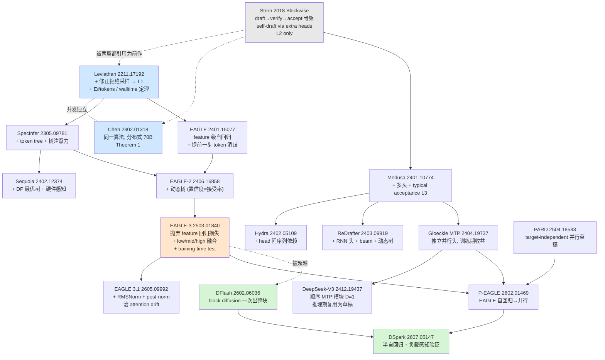

# RS-1 投机采样/投机解码：历史演化与谱系

> **性质**：调研笔记（非成品文章）。保留原始引文、口径核对过程注记与「未查证」标记。
> **核查截止**：2026-08-22。所有 arXiv v1 日期与作者列表取自 `export.arxiv.org` Atom API（权威元数据），机制与数字尽量取自论文正文/PDF 逐字提取。
> **本文最高优先级铁律**：查不到就写「未查证」。全文不使用「最近有研究表明」「业界普遍认为」这类无主语句式。

---

## 0. 阅读须知：三种「无损」口径与加速比记录规范

### 0.1 三级无损标签（全文每个工作都会标）

| 标签 | 含义 | 判定方式 |
|---|---|---|
| **L1 分布无损** | 输出是**目标模型分布的精确样本**（修正拒绝采样）。**不保证逐 token 相同**，只保证同分布 | 论文给出「recovers/preserves the target distribution」的证明 |
| **L2 贪心等价** | T=0 时逐 token 与目标模型 greedy 输出相同 | argmax 逐位比对，遇首个不匹配即停 |
| **L3 近似** | 改变了输出分布（放松接受判据 / 改了模型权重 / 训练了新模型） | 论文自陈放松、或质量指标掉分 |

> ⭐ **必须先讲清的一件事**：L1 从第一天起就**不是**「逐 token 相同」。
> Chen et al.(2023) §6 逐字：*"Even with greedy sampling, a single token deviating due to numerics could result in two sequences diverging wildly. Since pseudo-random seeds are processed differently between ArS and SpS, and because the different computation graphs lead to different numerics, **we cannot not expect identical outputs**."*（原文即为 "cannot not"，疑似笔误，语义为「不能期待输出相同」）
> 摘要中的措辞是 *"preserves the distribution of the target model **within hardware numerics**"*。**「within hardware numerics」这个限定词从奠基论文起就写在摘要里了。**

### 0.2 加速比记录规范

本文报任何加速比，一律尝试同时记录七项：**batch size / γ（草稿长度或树预算）/ 接受率 α 或平均接受长度 τ / draft-target 具体组合 / 硬件 / 延迟 or 吞吐 / 任务数据集**。缺项显式写「原文未给出 X」。

> ⭐ **一句话概括本文最重要的方法论发现**：**这个领域几乎所有头条倍数都是 `batch size = 1` 的 latency 数字**，包括 Stern 2018、Leviathan、Chen、Medusa、EAGLE 1/2/3、Hydra、Lookahead、CLLM、REST、PLD、HASS、GliDe、Falcon。**只有极少数论文做了 batch 扫描，而它们几乎都报出了负收益**（见 §11、§13）。

---

## 1. 谱系图

```mermaid
timeline
    title 投机采样谱系主干（arXiv v1 时间）
    section 史前史
        2017-11 : Gu+ NAT 1711.02281（非自回归翻译，L3）
        2018-11 : Stern+ Blockwise Parallel Decoding 1811.03115（draft-verify-accept 骨架，L2）
        2019-04 : Ghazvininejad+ Mask-Predict 1904.09324
        2020-02 : Song+ Jacobi/GS 2002.03629（并行不动点，ICML21）
    section 奠基
        2022-11 : Leviathan+ 2211.17192（Google Research，ICML23 Oral，L1+完整理论）
        2023-02 : Chen+ 2302.01318（DeepMind，Chinchilla 70B，L1）
        2023-02 : Kim+ BiLD 2302.07863（阈值 fallback/rollback，L3）
        2023-05 : Santilli+ 2305.10427（Jacobi 用于翻译，L2）
    section 结构化草稿
        2023-05 : SpecInfer 2305.09781（token tree + 树注意力，ASPLOS24）
        2023-08 : Staged Spec Decode 2308.04623
        2023-10 : SpecTr 2310.15141（最优传输视角，NeurIPS23）
        2023-12 : Cascade Spec Drafting 2312.11462
        2024-02 : Sequoia 2402.12374（DP 最优树 + 硬件感知）
    section 无模型草稿
        2023-11 : Prompt Lookup Decoding（Saxena，GitHub，无论文）
        2023-11 : REST 2311.08252（检索式，NAACL24）
        2024-02 : Lookahead Decoding 2402.02057（Jacobi 轨迹 n-gram 池，ICML24）
        2024-11 : SAM-Decoding 2411.10666 / SuffixDecoding 2411.04975（后缀自动机/后缀树）
    section 自投机与多头
        2023-09 : Draft & Verify 2309.08168（跳层自投机，ACL24）
        2024-01 : Medusa 2401.10774（多头 + 树注意力 + typical acceptance，L3）
        2024-02 : Hydra 2402.05109（head 间序列依赖，COLM24）
        2024-03 : ReDrafter 2403.09919（RNN 草稿头 + 动态树，Apple）
        2024-04 : LayerSkip 2404.16710（Meta，早退 + 共享 KV）
    section EAGLE 主线
        2024-01 : EAGLE 2401.15077（feature 级自回归 + 提前一步 token，ICML24）
        2024-06 : EAGLE-2 2406.16858（context-aware 动态树，EMNLP24，免训练）
        2024-08 : HASS 2408.15766（训练-解码对齐，ICLR25）
        2025-03 : EAGLE-3 2503.01840（抛弃 feature 回归 + 多层融合，NeurIPS25）
        2026-05 : EAGLE 3.1 / Attention Drift 2605.09992（RMSNorm + post-norm）
    section MTP
        2024-04 : Gloeckle+ MTP 2404.19737（Meta FAIR，独立并行头）
        2024-12 : DeepSeek-V3 2412.19437（顺序 MTP 模块，D=1，推理期复用）
        2025-09 : FastMTP 2509.18362
    section 长上下文
        2024-04 : TriForce 2404.11912（分层 + 稀疏 KV 草稿）
        2024-08 : MagicDec 2408.11049（推翻「大 batch 无用」）
        2025-10 : OWL 2510.07535（长上下文下 EAGLE-3 变 0.81x）
    section 2025-2026 并行草稿革命
        2025-04 : PARD 2504.18583（target-independent 并行草稿，AMD）
        2025-08 : Llama at Scale 2508.08192（Meta，生产规模）
        2026-02 : DFlash 2602.06036（block diffusion 草稿，ICML26）
        2026-02 : P-EAGLE 2602.01469（EAGLE 改并行，Amazon+NVIDIA）
        2026-04 : DDTree 2604.12989
        2026-05 : PARD-2 2605.08632 / Domino 2605.29707 / SpecBlock 2605.07243
        2026-07 : DSpark 2607.05147（半自回归 + 置信度调度验证）
```



**机制谱系（谁继承谁）**：



---

## 2. 第一部分：史前史（2017-2021）

### 2.1 Stern, Shazeer, Uszkoreit — Blockwise Parallel Decoding

| 项 | 值 |
|---|---|
| **年月 / arXiv** | **2018-11**（v1 2018-11-07，仅 v1）· **arXiv:1811.03115** |
| **第一作者 + 机构** | **Mitchell Stern（UC Berkeley）**；Noam Shazeer、Jakob Uszkoreit（**Google Brain**）。论文脚注："Work performed while the author was an intern at Google Brain" |
| **会议** | NeurIPS 2018 |
| **无损标签** | **L2**（exact-match 变体）/ **L3**（§5 三种近似准则） |

**相对前作新增的机制**（此前无同类工作，它是这条线的起点）：

1. **draft → verify → accept 三步循环骨架**。Predict：$k$ 个辅助输出头基于**同一前缀**各自给出 $+1..+k$ 位置的 argmax（第 $i$ 个提案**不** condition 在第 $i-1$ 个上，这正是必须 verify 的原因）。Verify：找最大 $\hat k$ 使 $\hat y_{j+i}=\arg\max_y p_1(y\mid \hat y_{\le j+i-1},x)$。Accept：$j \leftarrow j+\hat k$。
2. **$\hat k \ge 1$ 的保底性质**：因 $\hat y_{j+1}$ 本身就来自 $p_1$，最坏退化为普通 greedy，**永不倒退**。
3. **head 架构**（逐字）："we insert **a single feedforward layer** with hidden size $k\times d_{hidden}$ and output size $k\times d_{model}$ between the decoder output and the final projection layer... A residual connection between the input and each of the $k$ outputs is included. **The original projection layer is identically applied to each of the $k$ outputs**." → 不是 $k$ 个独立 head，而是**一层共享的 multi-output FFN**，vocab projection 完全复用。
4. **Combined scoring and proposal**：朴素版每步 2 次前向（$m\to 2m/k$）；把最终 projection 层维度扩 $k$ 倍、每位置算 $k$ 个 softmax，使第 $n$ 次 verify 与第 $n+1$ 次 predict 合并 → **$m/k + 1$**。

**⭐ 它没有做的事（最常见的误记）**：穷尽检索 NeurIPS camera-ready 全文，`sampl*`（解码语境）**0 次**、`rejection` **0 次**、`temperature` **0 次**、`stochast*` **0 次**。**Stern 2018 完全没有提出拒绝采样，也不支持随机采样。** 说它「提出了 lossless speculative sampling」是错误的；说它贡献了算法骨架与 self-draft 架构是准确的。

**数字（全口径）**：

- **batch size**：全文无 "batch" 一词。Table 4 caption 写 "single-sentence decoding" → **Table 4 是 bs=1**；Figure 4 的 batch size **原文未给出**。
- **推理硬件：原文未给出**（"8 P100 GPUs" 两处均在训练语境）。
- 度量为 **latency**；**不报 acceptance rate**，报 **mean accepted block size**。

| 摘要数字 | 实际对应 | 度量口径 |
|---|---|---|
| "up to 2×, no loss in quality" | Table 1 Distillation 列 block size **1.91** | **迭代次数**，非 wall-clock |
| "up to 7×" | Table 2（超分）Both 列 **6.79** | **迭代次数**，且是 **L3 近似** |
| "wall-clock up to 4×" | **super-res 的 4.0×**（$k$=6，fine-tune + $\epsilon$=2 近似） | latency，**不是 MT** |

Table 4（newstest2014，bs=1，distill+fine-tune，exact match，**L2**）：$k$=2 → 1.72×（BLEU 28.95）；$k$=4 → 2.69×（28.54）；$k$=6 → 3.10×（28.11）；$k$=8 → **3.31×**（27.88）；$k$=10 → 3.04×（27.40，**回落**）。基准 $k$=1 为 BLEU 29.11。

> ⭐ **最重要的空白**：论文**从未发布「冻结基座 + exact greedy」（唯一严格保持原模型质量的配置）的 wall-clock 数字**。该配置 mean block size 仅 1.76。任何「Stern 2018 达成 2× 无损 wall-clock 加速」的说法都**超出原文证据**。
>
> ⭐ **脚注 1 揭示的口径**："the final decoder layer is processed by a learned transformation for **all** predictions $p_1,\dots,p_k$... Using an identity transformation for $p_1$ instead would result in identical BLEU scores." → 即使冻结基座，$p_1 \ne$ 原 baseline 的 $p$。Table 1 中 Regular $k{=}1$ 是 **26.00** 而 baseline greedy 是 **25.56**。**"lossless" 的准确表述是：相对增广模型自身的 $p_1$ 是 greedy-exact，而非相对原始 Transformer。**
>
> ⭐ **distillation 常见误记**：teacher **不是**原模型自己的 greedy 输出。原文："The distilled data is produced via **beam decoding** using a pre-trained model with the same hyperparameters as the baseline but **a different random seed**." 且**仅 MT 做了 distillation**，super-res 没做。

**后来被推翻/淘汰的主张**：
- 「近似准则 Minimum Block Size（每步至少接受 $\ell$ 个 token）有用」——**被作者自己在同一篇里否掉**："much larger drops in BLEU with only minor improvements... **the ability to accept just one token on occasion is important**"。
- 「$k$ 越大越好」——被自己的 Table 4 否掉（$k$=10 回落）。原文归因："larger block sizes $k$ continue to improve in terms of iteration count, but **start to decline in terms of wall-clock improvement due to their higher computational cost**"（总运算量 quadratic in the number of predictions）。这条**在 2026 年依然成立**（见 §11.3 DSpark 的 per-position 接受率衰减）。
- 「exact-match 验证够用」——超分任务上 Table 2 Regular 列 mean block size **仅 1.07–1.10**，原文自认 "**overly stringent, barely allowing for any speedup**"。

### 2.2 非自回归翻译 NAT 系列

| 论文 | arXiv / v1 | 会议 | 一作 + 机构 |
|---|---|---|---|
| Gu, Bradbury, Xiong, Li, Socher — Non-Autoregressive NMT | **1711.02281** / **2017-11** | ICLR 2018 | Jiatao Gu（**HKU**，Salesforce Research 实习期间完成）；Bradbury/Xiong/Socher = **Salesforce Research** |
| Lee, Mansimov, Cho — Deterministic NAT by Iterative Refinement | **1802.06901** / **2018-02** | EMNLP 2018 | Jason Lee（**NYU**） |
| Ghazvininejad, Levy, Liu, Zettlemoyer — Mask-Predict | **1904.09324** / **2019-04** | EMNLP-IJCNLP 2019 | Marjan Ghazvininejad（**FAIR Seattle**） |

**无损标签：全部 L3**（训练全新模型，条件独立假设直接改变分布）。

**新增机制**：一次前向并行产出整个目标序列（Gu 2018）；迭代式 refinement（Lee 2018）；conditional masked LM + mask-predict 迭代（Ghazvininejad 2019）。

**⭐ multimodality problem 的原始定义**（Gu+ 2018 §2.3 逐字，这是整条线的死因）：
> "such a model exhibits **complete conditional independence**... **Intuitively, such a decoder is akin to a panel of human translators each asked to provide a single word of a translation independently of the words their colleagues choose.**"
> "'Thank you.' ... can be accurately translated into German as any one of 'Danke.', 'Danke schön.', or 'Vielen Dank.' ... This target distribution **cannot be represented as a product of independent probability distributions**... because a conditionally independent distribution cannot allow 'Danke schön.' and 'Vielen Dank.' **without also licensing 'Danke Dank.' and 'Vielen schön.'** We call this the '**multimodality problem**'."

**数字与 caveat**（Gu+ Table 1）：NAT 纯版 WMT14 En→De **17.35 BLEU**（AR beam=4 为 23.45，**掉 6.10**）；最好档 NAT+FT+NPD(s=100) 19.17（仍掉 4.28）。摘要的 "as little as 2.0 BLEU" 是最好那一档（Ro→En 仅 −0.32）。Latency 口径逐字："time to decode a single sentence **without minibatching**... on **a single NVIDIA Tesla P100**" → **bs=1**。15.6× 的基线是 beam=4；对 greedy 只有 **10.5×**。

**Mask-Predict 对蒸馏的硬依赖**（Table 6，WMT14 EN-DE）：T=1 时 Raw **10.64** vs Dist **18.05**（差 7.41）；T=10 时 24.61 vs 27.03。原文结论逐字："**Overall, it appears as though CMLMs are heavily dependent on model distillation.**" 速度口径：**batch size = 10**；解码 GPU 型号未给出；⭐ **缓存不对称** —— "Caching reduces the baseline's decoding speed from 210 seconds to 128.5; **CMLMs do not use cached decoding.**"

**⭐ 这条线为什么对 LLM 死了 —— 四条独立死因**：
1. **multimodality problem 是模型族的表达力缺陷**，不是工程问题，加算力不解决。
2. **对 AR teacher 的 sequence-level KD 硬依赖（自我拆台）**：要加速一个 LLM，得先有 AR LLM 当 teacher，再用它的输出重新训练一个更差的模型。质量天花板被 teacher 焊死。
3. **L3 且必须训练新模型**：不是 drop-in 加速器，不能套在已有权重上。
4. **⭐ 速度优势只在 bs=1 成立** —— Helcl, Haddow, Birch, "Non-Autoregressive Machine Translation: It's Not as Fast as it Seems"，**arXiv 2205.01966，NAACL 2022** 逐字：
   > "although NAR models are faster on GPUs, **with small batch sizes**, they are **almost always slower under more realistic usage conditions**." / "**GPU decoding latency is the only scenario in which non-autoregressive models outperform autoregressive models.**" / "there is currently **no compelling scenario that warrants the deployment of NAR models**."
   >
   > Table 5（A100）：优化过的 AR（Edinburgh base）batched GPU **140 秒**，比 NAR-Large（782s）快 **5.6×**、比 NAR-Micro（311s）快 2.2×，**且质量全面更好**（COMET 0.527 vs 0.149 / −0.008）。

> **一句话**：LLM serving 的经济学是 throughput / continuous batching，而 NAT 的全部优势恰好只存在于 bs=1 的 latency 场景。**投机采样赢在它把「并行」放在了 draft 侧而不是 output 侧，从而保住了 target 的自回归分布。**

**旁证（质量数字本身可信度存疑）**：Schmidt+ "NAT: A Call for Clarity"，**arXiv 2205.10577，EMNLP 2022** —— NAT 文献 tokenized BLEU 口径不一致导致高达 **1.7 BLEU** 偏差。

### 2.3 Jacobi / Gauss-Seidel 解码

#### Song, Meng, Liao, Ermon

| 项 | 值 |
|---|---|
| **年月 / arXiv** | **2020-02**（v1 2020-02-10，v2 2021-06-11）· **arXiv:2002.03629** |
| **一作 + 机构** | Yang Song（**Stanford**）；Chenlin Meng、Stefano Ermon = Stanford；**Renjie Liao = U. Toronto + Vector Institute** |
| **会议** | ICML 2021, PMLR v139, pp.9791–9800 |
| **无损标签** | **L1（理论，$\epsilon=0$）** → 实验用 $\ell_\infty<0.01$ 容差降级为近似 |

**新增机制**：把自回归递推 $\mathbf s_t=h_t(\mathbf u,\mathbf s_{1:t-1})$ 写成**三角非线性方程组** $h_t(\mathbf u,\mathbf s_{1:t-1})-\mathbf s_t=0$，用 Jacobi/Gauss-Seidel 并行迭代求不动点。

**⭐ 最关键的洞察**："**running one iteration of GS is the same as performing standard feedforward computation**" —— **标准自回归解码 = Gauss-Seidel 迭代一步**。这给了整个「并行解码」方向一个统一的数学框架。

**Proposition 1**："converges and yields **the same result as standard feedforward computation in at most $T$ parallel iterations** for any initialization **if $\epsilon=0$**." 归纳可证第 $t$ 轮后前 $t$ 个 token 正确。

**任务不含 LLM 文本**：RNN 反向传播 / DenseNet 前向 / MADE 与 PixelCNN++ 图像自回归采样。摘要 "speedup factors between 2.1 and 26"。DenseNet 的 2.1× 原文自认 "**this is a theoretical speedup. The actual speedup might be smaller due to overheads**" 且是 simulate 的。PixelCNN++ 硬件 **单张 V100 32GB**，**batch size = 16 (MNIST) / 4 (CIFAR-10)**。

**⭐ 本文自己埋下了 LLM 失败的伏笔**（§5.3.2 逐字）：
> "**parallel Jacobi updates cannot leverage these caches** for faster sampling, and therefore **one parallel update can be slower than one sequential update** of feedforward sampling."

CIFAR-10 当场应验：纯 Jacobi **26.16s（1.18×）** < 带 cache 的顺序基线 **17.76s（1.74×）**。**LLM 的 KV cache 正是同一机制。**

#### Santilli et al.

| 项 | 值 |
|---|---|
| **年月 / arXiv** | **2023-05**（v1 2023-05-17，仅 v1）· **arXiv:2305.10427** |
| **一作 + 机构** | Andrea Santilli，**Sapienza University of Rome**（全体作者同机构） |
| **会议** | ACL 2023 main |
| **无损标签** | **L2**（定理：≤$m$ 次迭代内与 **greedy** AR 结果相同；无法与 beam search 结合） |

**新增机制**：**PJ**（整句 Jacobi）、**PGJ**（block 内 Jacobi、block 间 GS）、**HGJ**（不需预知长度，可用于真实场景）、停机条件 $\mathbf y^{k-1}-\mathbf y^k=\mathbf 0$、可视化工具 DDGviz。

**⭐ Table 1 —— 这张表本身就是「Jacobi 不管用」的最强证据**（bs=1，基线**带 KV cache**）：

| 算法 | Opus/**CPU** en→de | de→en | MBart50/**GPU** en→de | de→en |
|---|---|---|---|---|
| Greedy AR | 1.00× | 1.00× | 1.00× | 1.00× |
| Beam (b=5) | 0.71× | 0.72× | 0.76× | 0.77× |
| **PJ（纯 Jacobi）** | **0.73×** | **0.75×** | **0.88×** | **0.88×** |
| PGJ (b=3) | **1.34×** | **1.37×** | **1.06×** | **1.08×** |
| HGJ (b=3) | 1.34× | 1.37× | 1.05× | 1.07× |

必须一起讲的三件事：① **纯 Jacobi 全线是「减速」**（CPU 0.66–0.75×、GPU 0.85–0.88×）；② 摘要的 **"38%" 只来自 Opus/CPU**，**GPU 上最好仅 1.03–1.08×**；③ BLEU 全列相同（加速与质量解耦），但**加速本身近乎不存在**。

Caveat：⚠️ 逐字 "For the Jacobi and GS-Jacobi algorithms, we **assume to know beforehand the length $m$** of the target and measure the speedup **in the ideal condition**"；硬件 MBart50 → Ryzen 9 3900X + **Nvidia 3090**，Opus/CPU 机器规格未给出；"nearly 2×" 是 **122 核 CPU** 的 proof-of-concept，原文自限 "**this experiment does not simulate a real production system**"，8 核时 PJ 掉到 **0.46×**。

论文亦记录了两条线的并行性："While this work was under submission and anonymity period, **Leviathan et al. 2022, Chen et al. 2023 and Kim et al. 2023 concurrently proposed**..."

#### ⭐ vanilla Jacobi 在 LLM 上为什么基本不加速 —— 量化铁证

**CLLM (Consistency Large Language Models)**，**arXiv 2403.00835**，v1 **2024-02-28**，Siqi Kou, Lanxiang Hu, Zhezhi He, Zhijie Deng, Hao Zhang，**ICML 2024**。

摘要逐字："it achieves **little speedup**... primarily because **Jacobi decoding seldom accurately predicts more than one token in a single fixed-point iteration step**"
§1 逐字："**vanilla Jacobi decoding for LLMs shows only marginal speedup over AR decoding in practice, e.g., an average of 1.05× speedup in Santilli et al. 2023.** This is because **a LLM can rarely yield a correct token when there are incorrection in its preceding tokens due to the attention mechanism**"

**⭐ Table 3 fast-forward token count**（表注明示"includes the one token that will be predicted right even without fast-forwarding"）：

| 数据集 | 原 fine-tuned 模型 | CLLM |
|---|---|---|
| Spider / Code-Search-Net / GSM8K / ShareGPT | **全部 = 1.1** | 5.7 / 4.0 / 2.8 / 2.2 |

→ **净收益仅约 0.1 token/iteration**（1.1 中的 1.0 是不用 Jacobi 也白拿的）。这就是「每次迭代只前进 1 个 token」的原始出处。

**⭐ CLLM 的无损性必须精确刻画**：CLLM **修改了模型权重**。相对 CLLM 自身 = **L2**（"CLLM+AR" 与 "CLLM+Jacobi" metric 完全相同：56.4/56.4、6.4/6.4、69.3/69.3）；相对**原模型** = **L3**：GSM8K **59.1 → 56.4（−2.7）**、Spider 70.0 → 69.3、MT-bench 6.5 → 6.4。**CLLM 不是 drop-in 无损加速器。** 口径：bs=1；8× A100 40GB；**仅 greedy**；训练仅约 1M tokens。

**四条机理小结**：①一错全废（attention 下前缀错则后续必错）②位置错配 + 反复覆写 ③净前进 ≈0.1 token/iter ④与 KV cache 结构性冲突且每步成本上升。

---

## 3. 第二部分：2022-2023 奠基 —— Leviathan vs Chen 精确对比

### 3.0 元数据对照

| | **Leviathan, Kalman, Matias** | **Chen, Borgeaud, Irving, Lespiau, Sifre, Jumper** |
|---|---|---|
| **年月 / arXiv** | **2022-11**（v1 2022-11-30，v2 2023-05-18）· **2211.17192** | **2023-02**（v1 2023-02-02，**仅 v1，从未修订**）· **2302.01318** |
| **一作 + 机构** | Yaniv Leviathan，**Google Research**, Mountain View | Charlie Chen，**DeepMind**（"All authors from DeepMind"） |
| **会议** | **ICML 2023 Oral**，PMLR v202, pp.19274–19286 | **无会议**（arXiv-only 技术报告） |
| **命名** | speculative decoding / speculative sampling | **speculative sampling (SpS)** |
| **无损标签** | **L1**（Appendix A.1，$l$=1 时）；带 lenience $l<1$ 降为**有界 L3** | **L1**（Theorem 1，"within hardware numerics"） |

> Chen 附录 Author Contributions 逐字："Initial proposal: Charlie Chen, John Jumper and Geoffrey Irving / **Modified Rejection Sampling Scheme: John Jumper**"（AlphaFold 的 John Jumper 设计了拒绝采样方案）。

### 3.1 ⚠️ 最大的坑：两篇的 p/q 记号完全相反

| | Leviathan | Chen |
|---|---|---|
| **target** | $p$ / $M_p$ | **$q$** |
| **draft** | $q$ / $M_q$ | **$p$** |
| 草稿长度 | $\gamma$ | $K$（lookahead） |

**跨论文抄公式必错。** 中文库写公式时必须先声明采用哪一套记号。

### 3.2 (a) 算法差异 —— 结论：**接受规则完全同构**

**Leviathan Algorithm 1（逐字）**：
```
n ← min({i−1 | 1≤i≤γ, r_i > p_i(x)/q_i(x)} ∪ {γ})
p′(x) ← p_{n+1}(x)
if n < γ then  p′(x) ← norm(max(0, p_{n+1}(x) − q_{n+1}(x)))
t ∼ p′(x);  return prefix + [x_1,…,x_n, t]
```

**Chen Algorithm 2（逐字）**：
```
if r < min(1, q(x̃|x_1..x_{n+t−1}) / p(x̃|x_1..x_{n+t−1})) then accept
else  x_{n+t} ∼ (q(x|·) − p(x|·))_+   and exit for loop
若全部 K 个都接受: 额外采样 x_{n+K+1} ∼ q(x|·)
其中 (f(x))_+ = max(0,f(x)) / Σ_x max(0,f(x))
```

代入 Leviathan 记号，Chen 的接受条件 $r<\min(1,q_{\text{target}}/p_{\text{draft}})$ 就是 Leviathan 的 $r_i \le p_i/q_i$；残差分布 $(q_{\text{target}}-p_{\text{draft}})_+$ 就是 $\text{norm}(\max(0,p-q))$。**两者是同一个算法。**

**每轮产出 token 数：两者都是 1 到 $\gamma+1$（$K+1$）。** 差异只在写法：Leviathan 把「额外 token」统一进 $p'$ 的定义（无分支）；Chen 写成显式 if-else。Chen 明示两点（逐字）：
> "**At least one token will always be generated** from a draft-accept loop – if the first token is rejected, a valid token is resampled."
> "Since the final token of the draft gives us the logits for the next token, if every drafted token is accepted, we can sample from it normally. This gives us a maximum of **K+1** tokens per loop, over the naive implementation which would only return K tokens."

#### Lenience（**只有 Leviathan 有**，Appendix A.5）

参数 $l\in[0,1]$，比较前把 $q(x)$ 乘以 $l$。**破坏 L1，降为有界 L3**：保留的保证是 "**no token can be sampled with probability greater than $p(x)/l$**"，原文警告 "**there is no guarantee on the minimum probability, so lenience could hurt the diversity of the samples**"。$\alpha=\sum_x \min(p(x)/l, q(x))$。

> ⭐ **关键界定（逐字）**："**Note that the results in this paper except for this section use the strictest version of Algorithm 1 and don't allow lenience of any kind.**"
> → **正文所有 2.6×/3.4× 数字都是 $l=1$ 的严格 L1。** Table 5 中 5× 那一档是 $l$=0.1 的 L3，不能混用。

Table 5（$M_p$=T5-XXL，EnDe，standard sampling）：T5-SMALL 的 α 随 $l$ 从 1→0.5→0.3→0.1 为 **0.62 → 0.71 → 0.76 → 0.84**，$c$=0.015 时改进因子 **2.5× / 3.1× / 3.6× / 5×**。

> ⚠️ **已确认的原文印刷错误**：论文写作 "we could accept the token $x$ sampled from $M_q$ in case **$p(x) \le l\cdot\max(p)$**"。这与其自身数据矛盾（$l$=1 时该判据恒真 ⇒ α 应为 1.0，而原文报 0.75；且 $l$ 减小应更宽松而 "≤" 会更严格）。**正确形式应为 $p(x) \ge l\cdot\max(p)$。** 已渲染 PDF 第 13 页目视确认为原文如此印刷，非文本抽取失真。

#### top-k / nucleus / temperature 的处理

Leviathan §2.2 "Standardized Sampling" 逐字："while there are many methods and parameters of sampling, like argmax, top-k, nucleus, and setting a temperature... **they can all easily be cast into standard sampling from an adjusted probability distribution**."
Chen 对应："we can **modify the probabilities accordingly before applying this rejection sampling scheme**. We have observed that the overall acceptance rate is **robust to the exact parameters used**."

> **重要推论**：因 Appendix A.1 的证明对**任意** $q$ 成立，给 draft 施加**不同**的截断**不会**破坏 L1 —— 无损性始终是相对「调整后的 target 分布」而言。真正的风险只在于 target 一侧的截断是否正确施加、残差归一化是否在截断之后。

#### Beam search

**只有 Leviathan 有**（Appendix A.4）：beam width $w$，用 $M_q$ 以宽度 $u\ge w$ 跑 $\gamma$ 步，只要 $\text{top}_w(M_p)\subseteq\text{top}_u(M_q)$ 即接受。原文称分析 "more involved and we leave it for future work"。

### 3.3 (b) 证明写法差异 —— **Leviathan 有完整定量理论，Chen 只有正确性**

**Leviathan §3（全部逐字核验）**：

| 编号 | 内容 |
|---|---|
| Definition 3.2 | $D_{LK}(p,q)=\sum_x\lvert p(x)-M(x)\rvert$，$M=(p+q)/2$ |
| Lemma 3.3 | $D_{LK}(p,q)=1-\sum_x\min(p(x),q(x))$ |
| Theorem 3.5 | $\beta=1-D_{LK}(p,q)$ |
| Corollary 3.6 | $\alpha=1-E(D_{LK}(p,q))=E(\min(p,q))$ |
| **Equation (1)** | $E(\#\text{tokens})=\dfrac{1-\alpha^{\gamma+1}}{1-\alpha}$ |
| Definition 3.7 | cost coefficient $c$ = 单次 $M_q$ 与单次 $M_p$ 的时间比 |
| **Theorem 3.8** | $\text{walltime improvement}=\dfrac{1-\alpha^{\gamma+1}}{(1-\alpha)(\gamma c+1)}$ |
| Corollary 3.9 | 若 $\alpha>c$，存在 $\gamma$ 可改进，改进因子至少 $\dfrac{1+\alpha}{1+c}$ |
| Theorem 3.11 | 总运算量增加因子 $=\dfrac{(1-\alpha)(\gamma\hat c+\gamma+1)}{1-\alpha^{\gamma+1}}$ |

> ⭐ **Equation (1) 的隐含假设（原文自陈，逐字）**："If we make the **simplifying assumption that the $\beta$s are i.i.d.**, and denote $\alpha=E(\beta)$, then the number of tokens produced by a single run of Algorithm 1 is **a capped geometric variable**, with success probability $1-\alpha$ and cap $\gamma+1$"。论文后文亦承认 "since the $\beta$s aren't constant"，并指出用 oracle 动态调 $\gamma$ 可达 $E=\frac{1}{1-\alpha}$，比固定 $\gamma$ 再高 **~60%**。**这不是被后人「揭露」的隐藏假设，是作者自己标注的。**
>
> ⭐ **Theorem 3.11 是全领域最被忽视的定理**：它明确写出投机解码**增加**总运算量。这是「compute-bound 时有害」的理论根源，也是 2026 年 DSpark 一类「负载感知验证」工作的出发点。

**Chen 侧**：Theorem 1 位于 Supplementary Materials → Proofs（**不在正文**），标题 "Modified Rejection Sampling recovers the target distribution"，同样是**单 token 命题**：
$$P(X=x)=\min(p(x),q(x))+\max(0,q(x)-p(x))=q(x)$$
Chen **没有** acceptance rate 闭式、$E(\#\text{tokens})$ 公式、walltime 模型、cost coefficient、最优 $\gamma$ 分析。用**经验曲线**（Figure 1）代替。

> ⭐ **两篇论文共同的理论缺口**：两个正确性证明**都是单 token 的**，均**未显式证明整条序列的联合分布**等同于 target 的自回归联合分布。这正是后续 block verification 工作的切入点（见 §13.4）。

### 3.4 (c) 实验规模差异

#### Leviathan：多 draft 尺度扫描，无 70B 级实测

**Setup**：T5 v1.1，target **T5-XXL (11B)**；draft **T5-large (800M) / T5-base (250M) / T5-small (77M)**，全部用现成 checkpoint。任务 WMT EnDe + CCN/DM 摘要。**硬件与 batch 逐字：`batch size of 1` on a `single TPU-v4`**。基线 T5X 实现，度量 walltime latency。

Table 2 完整：

| TASK | $M_q$ | TEMP | $\gamma$ | $\alpha$ | SPEED |
|---|---|---|---|---|---|
| ENDE | **T5-SMALL** | 0 | 7 | 0.75 | **3.4×** |
| ENDE | T5-BASE | 0 | 7 | 0.80 | 2.8× |
| ENDE | T5-LARGE | 0 | 7 | **0.82** | **1.7×** |
| ENDE | **T5-SMALL** | 1 | 7 | 0.62 | **2.6×** |
| ENDE | T5-BASE | 1 | 5 | 0.68 | 2.4× |
| ENDE | T5-LARGE | 1 | 3 | 0.71 | 1.4× |
| CNNDM | T5-SMALL | 0 | 5 | 0.65 | 3.1× |
| CNNDM | T5-BASE | 0 | 5 | 0.73 | 3.0× |
| CNNDM | T5-LARGE | 0 | 3 | 0.74 | 2.2× |
| CNNDM | T5-SMALL | 1 | 5 | 0.53 | 2.3× |
| CNNDM | T5-BASE | 1 | 3 | 0.55 | 2.2× |
| CNNDM | T5-LARGE | 1 | 3 | 0.56 | 1.7× |

> ⭐ **该表最重要的教学点：draft 越强 ≠ 越快。** T5-large 的 α 最高（0.82）却最慢（1.7×），T5-small α=0.75 却最快（3.4×）—— 因为 $c$ 主导（Theorem 3.8 的 $\gamma c$ 项）。原文经验法则："choosing $M_q$ to be **around two orders of magnitude smaller** than $M_p$ usually performed best"。
>
> **趣味结论**：bigram 这种平凡模型在 EnDe 上 α≈0.2，因 $c\approx0$ 仍带来 **1.25× 加速**（$\gamma$=3）。这是 n-gram 类无模型草稿的最早理论辩护。

Table 3 另给 **LaMDA (137B)** 的 α：draft 100M/2B/8B → 0.61/0.71/0.75 (T=0)。⚠️ **LaMDA 只测了 α，未做 walltime 实现**（"While we only implemented our method for T5"）。

#### Chen：单一 70B 目标，分布式实测

**Setup**：target **Chinchilla 70B**（$d_{model}$ 8192, 64 heads, 80 layers）；draft **4B**（$d_{model}$ **6144**, **48 heads**, **仅 8 层**）。

> **draft 训练方式逐字**："This model was trained with **the same tokeniser and dataset as Chinchilla**, with a slightly smaller width and with only 8 layers."
>
> ⭐ **为何是「宽而浅」而非直接取小模型**（重要工程洞察）：Chinchilla 70B 最优部署是 16 TPU v4（14.1ms/token），而 chinchilla-optimal 7B 的最优拓扑是 **4 TPU v4**（5ms/token）—— "serving a 7B on 16 TPUs actually **increases** the latency"。故必须 "training a **wider model with a relatively few number of layers** in order to minimise communication overhead"。**这条至今有效：分布式 serving 下 draft 的最优形状由通信而非参数量决定。**

| | 值 |
|---|---|
| **硬件** | **16 TPU v4**，Megatron-style sharding |
| **batch size** | **1**（逐字 "We run the tasks at batch size 1 with SpS and ArS"） |
| **$K$（=γ）** | **4** |
| 速度基准 | Chinchilla **14.1 ms/token**；draft **1.8 ms/token** |
| 度量 | latency（mean token time） |

Table 1 完整（caption：batch size 1, K=4；XSum nucleus p=0.8；HumanEval p=0.95 + temperature 0.8）：

| 方法 | Benchmark | Result | Mean Token Time | Speed Up |
|---|---|---|---|---|
| ArS (Nucleus) | XSum (ROUGE-2) | 0.112 | 14.1 ms | 1× |
| **SpS (Nucleus)** | XSum | **0.114** | 7.52 ms | **1.92×** |
| ArS (Greedy) | XSum | 0.157 | 14.1 ms | 1× |
| **SpS (Greedy)** | XSum | **0.156** | 7.00 ms | **2.01×** |
| ArS (Nucleus) | HumanEval (100-shot) | 45.1% | 14.1 ms | 1× |
| **SpS (Nucleus)** | HumanEval | **47.0%** | 5.73 ms | **2.46×** |

任务规模：XSum 1-shot、11,305 条、max len 128；HumanEval 100-shot、16,400 条、max len 512。

> ⭐ **acceptance rate：Chen 未以表格给出数值。** Figure 1 中间子图画的是 "average number of tokens accepted **divided by $K+1$**"，纵轴 0.5–1.0。**原文未给出具体 α 数值** —— 这是与 Leviathan 的重要差异。
>
> ⭐ **Chen 独有的实用洞察（Leviathan 没有）**：§8 逐字 "even though larger values of $K$ may yield marginally greater mean speedups... it also **increases variance** of the time to generate a full sequence. This could be problematic for settings where the **P90, P99** latencies of concern." Figure 1 显示 "**as $K$ increases, the overall speedup plateaus or even regresses, with XSum being optimal at $K=3$**"。**投机解码是拿延迟方差换延迟均值** —— 这条对生产 SLO 至关重要。

### 3.5 (d) 谁先谁后

```
2018-11-07  Stern+ Blockwise (1811.03115)
2022-11-30  Leviathan+ v1 (2211.17192)          ← 早 2 个月
2023-02-02  Chen+ v1 (2302.01318)
2023-02-15  Kim+ BiLD v1 (2302.07863，原名 "Big Little Transformer Decoder")
2023-05-17  Santilli+ v1 (2305.10427)
2023-05-18  Leviathan+ v2（加入对 Chen 的致谢）
2024-12-06  Google Research 博客 "Looking back at speculative decoding"
```

**Chen → Leviathan（Related Work 逐字）**：
> "**Coincidentally, the work in this manuscript was undertaken concurrently and independently of the work on speculative decoding from Leviathan et al. (2022).** We focus more heavily the distributed serving setting for large models and offer some incremental optimisations, but **otherwise the core underlying idea is the same**."

**Leviathan v2 → Chen（§5 末尾，v1 中不存在）**：
> "**After we initially published our work, an independent implementation of speculative decoding (Chen et al., 2023) showed similar 2X-2.5X improvements on Chinchilla 70B.**"

> **裁定**：Leviathan arXiv v1 早 2 个月；Chen 主张并发且独立。**两种表述不冲突**（一个讲发表次序，一个讲研究过程），双方都承认核心思想相同，**无优先权争议**。

**两篇都引用了 Stern 2018，且都给出了批评**：
- Leviathan §5 逐字三点："**(1) it only supports greedy decoding (temperature=0) and not the general stochastic setting, (2) it requires additional training of a custom model, and (3) focuses on preserving down-stream task quality, instead of guaranteeing identical outputs.**"
- Chen 逐字："These methods have yet to be adapted to typical language model use-cases since they **either only work with greedy sampling, bias the results or are focused on other modalities**. Further, to our knowledge **none of these techniques have been scaled to distributed setups**."

**Google 官方博客**（research.google/blog，**2024-12-06**，Leviathan/Kalman/Matias）：称 Stern 2018 为 "a precursor to our work"；灵感来源明示为 CPU 分支预测的 speculative execution；部署于 **AI Overviews in Google Search**；**完全未提及 Chen et al./DeepMind**。⚠️ 博客称用 "**60M** T5-small"，但**论文中 T5-small 是 77M** —— 两处数字不一致，**以论文为准**。

### 3.6 Kim et al. — Big Little Decoder（BiLD）⚠️ 标题有误导性

| 项 | 值 |
|---|---|
| **年月 / arXiv** | **2023-02**（v1 2023-02-15）· **arXiv:2302.07863** |
| **一作 + 机构** | Sehoon Kim，**UC Berkeley**（与 Mangalam、Malik、Mahoney、Gholami、Keutzer 同） |
| **会议** | NeurIPS 2023 |
| **无损标签** | **L3** |

**v1 标题是 "Big Little Transformer Decoder"，「Speculative Decoding」是至迟 v4（2023-10-12）才改上去的。** 引用时最容易出错的地方。

**机制**：**两个确定性阈值，无 rejection sampling**。Fallback Policy：若 $\max_y p_S(y\mid y_{1:n-1}) < \alpha_{FB}$ 交给大模型；Rollback Policy：若存在最小 $m$ 使 $d(p_S, p_L) > \alpha_{RB}$（$d$ 用 cross-entropy loss）则回滚。

**自陈定位（逐字）**："While **[Leviathan, Chen] offer unbiased estimators that match the stronger model's probability distributions**, our extensive empirical evaluation shows that our approach can deliver superior latency-performance trade-offs, due to its **non-random rollback (i.e., rejection) policy**"

**数字**：**NVIDIA T4 GPU**，**batch size 1**；IWSLT2017 De-En、WMT2014 De-En、XSUM、CNN/DailyMail。**1.85×** 无质量退化；**2.12×** —— ⚠️ **以约 1 个 BLEU/ROUGE 点为代价**。

**被淘汰的主张**：「确定性阈值优于随机拒绝采样」这一主张未被后续采纳。2024 年之后主流全部回到 L1 拒绝采样（EAGLE 系）或明确的 L3（Medusa typical acceptance），BiLD 式的双阈值方案在 vLLM/SGLang/TensorRT-LLM 中**均未实现**（截至 2026-08 核查）。

---

## 4. 第三部分：树形草稿与结构优化（2023-2024）

**这一代解决的瓶颈**：Leviathan/Chen 的草稿是**一条链**，一旦第 $i$ 个 token 被拒，后面 $\gamma-i$ 个全部作废。期望产出被 $\frac{1-\alpha^{\gamma+1}}{1-\alpha}$ 死死卡住。**这一代的共同思路：把草稿从「一条链」变成「一棵树」，用一次 target 前向验证多条路径。**

### 4.1 SpecInfer

| 项 | 值 |
|---|---|
| **年月 / arXiv** | **2023-05**（v1 2023-05-16，v4 2024-04-01）· **arXiv:2305.09781** |
| **一作 + 机构** | Xupeng Miao（**CMU**，通讯 Zhihao Jia @ CMU）。合作者含 CMU / FlexFlow 团队 |
| **会议** | **ASPLOS 2024** |
| **无损标签** | **L1**（摘要称 "provably preserving model quality"；多步投机采样的树验证算法设计为保分布。⚠️ 我未逐字提取其证明文本，标注为「论文声称 L1，证明文本未逐字核对」） |

**新增机制**：
1. **token tree 而非 token sequence** —— 节点各代表一条候选 token 序列，树形组织多条候选。
2. **多个小 draft model 的集合（learning-based speculator）+ boost-tuning** —— 用多个「投机器」共同提议以提升覆盖，而非单一 draft。
3. **tree-based parallel decoding**：topology-aware causal mask，使一次 target 前向同时验证树上所有分支，**不需要扩展 batch 维度**。
4. **multi-step speculative sampling**：把 Leviathan 的单链拒绝采样推广到树。

**数字**：摘要 "outperforms existing LLM serving systems by **1.5-2.8×** for distributed LLM inference and by **2.6-3.5×** for offloading-based LLM inference"。⚠️ **batch size / 树大小与深度 / 硬件 / 数据集：摘要未给出**（我未提取正文实验表）。

**它奠定的东西**：**tree attention + topology-aware causal mask** 成为此后 Medusa / EAGLE / Sequoia / ReDrafter 的标准零件。这是 SpecInfer 最持久的遗产 —— **机制活下来了，SpecInfer 这个系统本身没有成为主流引擎**。

### 4.2 SpecTr

| 项 | 值 |
|---|---|
| **年月 / arXiv** | **2023-10**（v1 2023-10-23）· **arXiv:2310.15141** |
| **一作 + 机构** | Ziteng Sun，**Google Research**（同 Ananda Theertha Suresh, Jae Hun Ro, Ahmad Beirami, Himanshu Jain, Felix Yu） |
| **会议** | NeurIPS 2023 |
| **无损标签** | **L1** |

**新增机制**：用**带 membership cost 的最优传输（optimal transport）**给投机解码一个原理性刻画 —— 单 draft 情形下 Leviathan/Chen 的接受规则就是最优传输解（**maximal coupling 问题的推广**）。据此把方法推广到 **token 级 $k$ 个候选**（multi-draft），并给出：最优 draft 选择（transport plan）可由线性规划求解但运行时**关于 $k$ 指数级**；提出一个可在近线性时间计算、接受概率 **$(1-1/e)$-最优（乘性）** 的实用算法。

**数字**：wall clock **2.13×**，比标准投机解码再快 **1.37×**。⚠️ **batch size / γ / 接受率 / draft-target 组合 / 硬件 / 数据集：我未从正文提取，标注未查证。**

**遗产与淘汰**：**理论框架活了下来**（「投机解码 = 最优传输 / maximal coupling」成为标准视角），但 SpecTr 的具体 multi-draft 算法未被主流引擎实现（vLLM / SGLang / TensorRT-LLM 截至 2026-08 均无 SpecTr 方法）。

### 4.3 Staged Speculative Decoding

| 项 | 值 |
|---|---|
| **年月 / arXiv** | **2023-08**（v1 2023-08-08）· **arXiv:2308.04623** |
| **一作 + 机构** | Benjamin Spector（**Stanford**，与 Chris Ré 同） |
| **无损标签** | **L1**（"perfectly preserving output quality"） |

**新增机制**：两条，且都被后人继承 —— ① **把 speculative batch 重构成树**（与 SpecInfer 并发）；② **给草稿过程本身再加一层投机**（second stage of speculative decoding，即草稿模型自己也用更小的模型加速）。

**数字**：**3.16×** 单 batch 解码延迟，**762M 参数的 GPT-2-L**。定位明确写在摘要里：*"accelerate LLM inference in **small-batch, on-device** scenarios"*。⚠️ **硬件 / γ / 接受率 / 数据集：摘要未给出。**

### 4.4 Cascade Speculative Drafting

| 项 | 值 |
|---|---|
| **年月 / arXiv** | **2023-12**（v1 2023-12-18）· **arXiv:2312.11462** |
| **一作 + 机构** | Ziyi Chen（**UIUC**，与 Kevin Chen-Chuan Chang 同组） |
| **无损标签** | **L1**（"preserving the same output distribution as the target model"） |

**新增机制**：两种级联 —— **Vertical Cascade**：把神经网络的自回归生成从 draft 链条里彻底去掉（最底层用统计模型）；**Horizontal Cascade**：**按 token 重要性分配草稿时间**（越靠前的草稿 token 越重要，值得用更强的模型；越靠后越可能被拒，用更弱更快的）。

> ⭐ Horizontal Cascade 的洞察 —— **「草稿位置越靠后，接受概率越低，因此不该给它同等算力」** —— 是 2026 年 DSpark「按 survival probability 分配验证预算」的直接思想前身。**这个思路当年没做成产品，三年后以另一种形式回来了。**

⚠️ **数字口径：我未提取正文实验表，标注未查证。**

### 4.5 Sequoia

| 项 | 值 |
|---|---|
| **年月 / arXiv** | **2024-02**（v1 2024-02-19，v3 2025-07-05）· **arXiv:2402.12374** |
| **一作 + 机构** | Zhuoming Chen（**CMU**）；合作者含 Avner May（**Together AI**）、Max Ryabinin、Zhihao Jia（CMU）、Beidi Chen（CMU） |
| **无损标签** | **L1**（称 "exact" inference） |

**新增三个机制**（相对 SpecInfer 的固定树）：
1. **动态规划求最优树 topology** —— 在给定节点预算下最大化期望接受长度，而非手工设计树形。
2. **sampling without replacement 的验证算法** —— 使性能在**不同温度**下稳健（这是对 Leviathan Table 2「T=1 加速比明显低于 T=0」的直接回应）。
3. **硬件感知的树优化器** —— 针对具体硬件自动选择树的**大小与深度**。

**数字**：Llama2-7B / A100 **4.04×**；Llama2-13B / A100 **3.73×**；Vicuna-33B / A100 **2.27×**；Llama2-70B / L40 **offloading** 场景 **0.56 s/token（9.96× vs 其优化基线）**。⚠️ **batch size（应为 1）/ 树大小 / 温度 / 数据集：我未从正文提取，标注未查证。**

**遗产与被取代**：
- **活下来的**：「树形状应该由数据决定而非手工设计」这一主张。
- **被取代的**：Sequoia 的**离线 DP 求静态最优树**被 **EAGLE-2 的在线动态树**取代 —— EAGLE-2 用 draft 的 confidence 做 per-request 的树构造，不需要离线优化，且 **无需重新训练**。
- **⭐ 但「硬件感知」这一维度在 2024-2025 主流工作里被丢掉了，直到 2025-2026 才回来**：CAST（arXiv 2510.26577，2025-10-30）明确批评 EAGLE-2/3 的树 *"neglect… crucial system variables such as **GPU devices and batch sizes**"*；vLLM 2026 的 Dynamic Speculative Decoding 与 Adaptive Verification 本质上是 Sequoia「硬件感知树优化器」的在线版。**Sequoia 的问题意识是对的，只是它的离线静态解法不适合 serving。**

---

## 5. 第四部分：自投机 / 层跳过（2023-2024）

**这一代解决的瓶颈**：独立 draft model 需要**额外训练**、额外显存、且与 target 的**词表/分布不匹配**。自投机的主张是：**target 模型自己的浅层就是一个现成的 draft**。

### 5.1 Draft & Verify

| 项 | 值 |
|---|---|
| **年月 / arXiv** | **2023-09**（v1 2023-09-15，v2 2024-05-20）· **arXiv:2309.08168** |
| **一作 + 机构** | Jun Zhang（**浙江大学**；合作者含 UC Irvine 的 Sharad Mehrotra。⚠️ 逐人机构对应未逐字核实） |
| **会议** | ACL 2024 |
| **无损标签** | **L1**（"ensures the final output remains identical to that produced by the unaltered LLM"。⚠️ 是否覆盖随机采样，摘要未明说） |

**新增机制**：草稿由**跳过同一模型的部分中间层**产生 —— **无需训练、无额外显存、无额外模型**。层跳过集合由贝叶斯优化选择；配自适应 draft-exiting 机制决定何时停止 drafting。

**数字**：LLaMA-2 及变体上 **up to 1.99×**。⚠️ **batch size / 硬件 / 数据集 / 平均接受长度：摘要未给出。**

### 5.2 LayerSkip

| 项 | 值 |
|---|---|
| **年月 / arXiv** | **2024-04**（v1 2024-04-25，v4 2024-10-18）· **arXiv:2404.16710** |
| **一作 + 机构** | Mostafa Elhoushi，**Meta**（合作者含 Bram Wasti、Beidi Chen、Carole-Jean Wu） |
| **会议** | ACL 2024 |
| **无损标签** | **L1**（早退草稿被剩余层验证纠正） |

**新增机制（三段式配方，相对 Draft&Verify 的关键改进在第三条）**：
1. **训练期 layer dropout**：浅层低丢弃率、深层高丢弃率。
2. **early exit loss**：**所有 transformer 层共享同一个 LM head**（而非每层一个出口头）。
3. **推理期自投机**：draft = 前 $E$ 层，verify = 剩余层，**关键技巧是 draft 与 verify 共享前 $E$ 层的 KV cache 与计算** —— 不必为 draft 单独重算。

> **这是 LayerSkip 比 Draft&Verify 便宜的原因**：Draft&Verify 的跳层草稿仍要走一遍（跳层的）完整前向；LayerSkip 的 verify 直接**接着** draft 的前 $E$ 层继续算后面的层，前 $E$ 层的计算与 KV **只做一次**。

**数字**：CNN/DailyMail 摘要 **up to 2.16×**；HumanEval 代码 **1.82×**；TOPv2 语义解析 **2.0×**；模型覆盖 Llama2 7B/13B/70B 与 Llama3 8B。⚠️ **batch size / 硬件 / 延迟 or 吞吐：我未从正文提取，标注未查证。**

**⭐ 采用障碍（也是这一分支的死因之一）**：LayerSkip 需要**改变训练配方**。原文称适用于 "pretraining from scratch, continual pretraining, finetuning on specific data domain, and finetuning on specific task" 四种场景 —— 即最轻也要做一次**继续预训练**。对「给一个已有 checkpoint 加速」的部署场景，这个前提比训一个 EAGLE draft head（68k 对话、几张卡 1-2 天、backbone 完全不动）**贵得多**。

### 5.3 Kangaroo

| 项 | 值 |
|---|---|
| **年月 / arXiv** | **2024-04**（v1 2024-04-29）· **arXiv:2404.18911** |
| **一作 + 机构** | Fangcheng Liu（**华为诺亚方舟实验室**，合作者 Yehui Tang / Kai Han / Yunhe Wang 均为诺亚 GhostNet 系。⚠️ 机构由作者归属推断，未从正文脚注核实） |
| **无损标签** | **L1**（标题即 "Lossless Self-Speculative Decoding"） |

**新增机制**：固定的浅层子网络当 self-draft，其上训一个**轻量 adapter** 弥补子网与全模型的表达力差距；并引入**第二次早退**（double early exiting）—— 当草稿阶段当前 token 的置信度低于阈值时**立即停止继续 drafting**（因为 self-draft 的延迟已不可忽略）。

**数字**：Spec-Bench 单序列验证下 **up to 1.68×**，超过 Medusa-1 且**额外参数少 88.7%（67M vs 591M）**。⚠️ **batch size / 硬件 / 数据集细分：摘要未给出。**

> ⭐ Kangaroo 提出的问题至今有效：*"the inference latency of the self-draft model may **no longer be negligible** compared to the large model"* —— **草稿成本本身是主要矛盾**。这正是 2026 年并行草稿革命（P-EAGLE / DFlash）的核心动机。

### 5.4 这一分支的判决（2026-08）

**没有死，但在数据中心主线上输了；在边缘/端侧活得很好。**

- **输的原因**：加速比天花板明显低（1.68×–2.16×），而同期 EAGLE-2 已 3-4×、EAGLE-3 已 4-5×。根因是**跳层草稿太弱**（接受率上不去），而且 draft 与 verify 共享参数意味着**没法通过「把 draft 做得更小更快」来压低 $c$**。
- **活下来的地方**：显存与部署约束严苛的场景。2026 年的复兴代表（均由子代理核实 arXiv ID，⚠️ 细节口径未逐字核对）：
  - *A Sparse Glimpse of the Whole: Train-Free Self-Speculative Decoding*，arXiv **2607.27735**
  - *Cassandra: Enabling Reasoning LLMs at Edge via Self-Speculative Decoding*，arXiv **2605.26558**
  - *SPORK: Self-Speculative Forking to Accelerate Agentic LLM Inference*，arXiv **2607.03333**
  - *S2-MoE*，arXiv **2608.15018**（2026-08-15，Haochen Huang / Shengxuan Qiu / Meng Li，⚠️机构推断为北大）—— **在 llama.cpp 中实现**的边缘 MoE 自投机，routing-aware 自适应推测 + reuse-aware expert gating，**up to 5.3×（平均约 2.0×）**
- **⭐ 一个有意思的回旋**：MagicDec（§10.2）论证了在**长序列大 batch**下应该用 **self-speculation + 压缩 KV** 而非小 draft model —— 因为此时 draft model 自己的 KV 能占到 target 的 38~140% 显存。**自投机在它最初的战场（bs=1 低延迟）输了，却在长上下文高吞吐这个新战场上赢回来一局。**

---

## 6. 第五部分：无模型草稿（n-gram / 检索 / Jacobi 轨迹）

**这一代解决的瓶颈**：任何需要 draft model 的方案都要**训练**、要**对齐词表**、要**占显存**、且**每换一个 target 就得重训一次**。无模型草稿的主张是：**很多场景下，下一段 token 已经出现在上下文里了，直接抄就行。**

### 6.1 Prompt Lookup Decoding（PLD）

| 项 | 值 |
|---|---|
| **年月** | **2023-11**（GitHub 仓库，**无 arXiv 论文** —— 这本身是这条线的特征） |
| **作者** | **Apoorv Saxena**（`github.com/apoorvumang/prompt-lookup-decoding`）。⚠️ 机构：仓库未标注，**未查证** |
| **无损标签** | **L2**（greedy 等价；匹配是确定性的） |

**新增机制**：把 draft model 换成**在 prompt 里做字符串/n-gram 匹配** —— 用当前已生成序列的后缀去 prompt 里找 n-gram 匹配，把匹配位置之后的 token 当草稿。参数只有 `max_ngram_size` 与 `num_pred_tokens`。**零训练、零额外参数、零外部数据存储，任何 decoder 模型即插即用。**

**数字**：摘要/QA 上 "relatively consistent **2.4× speedup** (on average)"；MT-Bench 多轮对话第 1 轮有类似增益、第 0 轮较小。测试条件：**Mistral-7B-Instruct-v0.1，greedy decoding，A100 40GB**。⚠️ **batch size 仓库未明说（按用法推断为 1）**；**接受长度未给出**。
**明确的失效场景**（作者自陈）：prompt 与输出重叠低时收益消失（roleplay 任务基本无增益）。

**集成**：HuggingFace `transformers`（`prompt_lookup_num_tokens=10`）与 vLLM（早期 `speculative_model="[ngram]"`，现 `--speculative-config '{"method":"ngram"}'`）。

### 6.2 REST

| 项 | 值 |
|---|---|
| **年月 / arXiv** | **2023-11**（v1 2023-11-14，v2 2024-04-04）· **arXiv:2311.08252** |
| **一作 + 机构** | Zhenyu He（**北京大学**；合作者含 Zexuan Zhong / Tianle Cai / Jason D. Lee @ **Princeton**、Di He @ 北大。⚠️ 逐人对应未逐字核实） |
| **会议** | NAACL 2024 |
| **无损标签** | **L1**（树验证保分布） |

**相对 PLD 新增**：草稿来源从 **prompt 本身**换成**外部语料库构建的 datastore**（后缀数组/精确匹配检索），把检索到的多条续写组织成 **Trie**，再用 tree attention 一次验证。→ **不依赖 prompt 与输出的重叠**，可加速任意生成。

**数字**：摘要称 7B/13B 模型在 **single-batch** 设定下 code 或 text 生成 **1.62×–2.36×**。⚠️ **datastore 规模 / 硬件 / 平均接受长度 / 具体模型-数据集配对：我未从正文提取，标注未查证。**

**第三方实测（Spec-Bench，A100/Vicuna-13B，bs=1，greedy，FP16）**：REST **1.38×** —— 排在 PLD(1.56×) 与 SpS(1.54×) 之后。

### 6.3 Lookahead Decoding

| 项 | 值 |
|---|---|
| **年月 / arXiv** | **2024-02**（v1 2024-02-03）· **arXiv:2402.02057**。博客更早：lmsys.org，**2023-11-21** |
| **一作 + 机构** | Yichao Fu（**UC San Diego**，与 Hao Zhang 同组）；合作者 Peter Bailis、**Ion Stoica**（UC Berkeley） |
| **会议** | ICML 2024 |
| **无损标签** | **L1 / L2**（称 "exact"，verification branch 保分布） |

**新增机制**：**不需要任何 draft model** —— 用 Jacobi 迭代的**历史轨迹**攒出一个 n-gram 池，每步同时做两件事：① lookahead branch 用 Jacobi 并行推进多条轨迹产生新 n-gram；② verification branch 从池中取候选 n-gram 交给 target 验证。

**它对 vanilla Jacobi 的诊断（§2 逐字，本文 §2.3 已引）**：
> "**Jacobi decoding can hardly reduce decoding steps**, even if it can generate multiple tokens per step. This is because **the generated tokens are often put in the wrong positions of the sequence, and correctly placed tokens are frequently replaced by subsequent Jacobi iterations. These prevent it from achieving wall-clock speedup.**"

**数字**：**bs=1，A100 80GB，基线 HF greedy**；跨数据集 **1.5×–2.3×**；**采样模式仅 1.46×–1.60×**（原文："Using sampling gives **smaller speedups** as the acceptance ratio is lower"）；消融最差档 $(5,1,30)$ 无 prompt-ref 仅 **1.04×**。

**⭐ 后来被数据推翻的部分**：Lookahead 是本文覆盖的所有方法里**第三方实测最差**的。Spec-Bench 统一条件（bs=1 / greedy / FP16）：

| 硬件/模型 | Lookahead Overall | 同表最强 |
|---|---|---|
| A100 / Vicuna-13B | **1.30×** | EAGLE-3 3.02× |
| RTX 3090 / Vicuna-7B | **1.13×** | SAMD[EAGLE2] 2.38× |
| A100 / Vicuna-7B | **1.34×** | SAMD[EAGLE2] 2.73× |
| A100 / Vicuna-33B | **1.25×** | EAGLE2 / SAMD 2.59× |

EAGLE-3 论文 Table 1（Vicuna-13B，T=0）也给出 Lookahead 均值仅 **1.62×/τ1.67**，是全表最低。**失败原因：没有学习出来的草稿 → 接受率天然低；同时 Jacobi 分支的 FLOPs 开销要照付。** 它的正面价值在 Spec-Bench 榜单的注释里被承认：*"PLD, Lookahead, and Recycling are **plug-and-play** methods that require minimal extra parameters"*。

**生产状态**：TensorRT-LLM 已把 **Lookahead decoding 移入 legacy 文档**（不在当前 features 文档中）。vLLM 当前方法清单**无 lookahead**（文档中 "Lookahead" 一词只出现在 "What is Lookahead Scheduling in vLLM?" 这个**语义完全不同**的资源链接里 —— ⚠️ 这是一个容易误判的同名陷阱）。

### 6.4 后缀自动机 / 后缀树一代

#### SAM Decoding

| 项 | 值 |
|---|---|
| **年月 / arXiv** | **2024-11**（v1 2024-11-16，v3）· **arXiv:2411.10666** |
| **一作 + 机构** | Yuxuan Hu（**中国人民大学**，合作者 Cuiping Li / Hong Chen 为人大；含 Fanjin Zhang。⚠️ 逐人对应未核实） |
| **无损标签** | **L1** |

**相对 n-gram 匹配新增**：用**后缀自动机（suffix automaton）**找**精确最长后缀匹配**，SAM 更新与后缀检索均摊 **O(1)/step**（n-gram 匹配是固定长度窗口，且复杂度更高）。同时**自适应选择草稿生成策略**（按匹配长度在检索式与模型式之间切换）以泛化到更广领域。

**数字**：Spec-Bench 上比其他 retrieval-based SD 快 **18%+**；与 **EAGLE-2 组合**再带来 **3.28%–11.13%** 额外加速。⚠️ **硬件 / batch size / 模型对：我未从正文提取。**
**第三方实测**：Spec-Bench 榜单上 **SAMD[EAGLE2] 是多个配置下的第一或第二名**（RTX3090/Vicuna-7B **2.38×** 榜首；A100/Vicuna-13B **2.77×** 第二，仅次于 EAGLE-3）。

#### SuffixDecoding ⭐

| 项 | 值 |
|---|---|
| **年月 / arXiv** | **2024-11**（v1 2024-11-07，v3 2025-10-07）· **arXiv:2411.04975** |
| **一作 + 机构** | Gabriele Oliaro（**CMU**）；Zhihao Jia（CMU）、Daniel Campos & Aurick Qiao（**Snowflake AI Research**） |
| **会议** | **NeurIPS 2025 (Spotlight)** |
| **无损标签** | **L1**（称 exactly preserves the output distribution，并用 greedy 输出一致性验证） |
| **标题变更** | v1 副标题为 "A Model-Free Approach..."，当前 v3 为 "**Extreme** Speculative Decoding for Emerging AI Applications" |

**相对 PLD/REST/SAM 新增的三点**：
1. **后缀树（suffix tree）索引两处语料**：(a) 当前请求的 prompt + 已生成 token（per-request tree）；(b) **历史请求的输出（global tree）** —— 这是关键，它把「跨请求的重复性」变成了草稿来源。
2. 节点带**频次计数**，贪心扩展构建 speculation tree。
3. **自适应推测长度** `MAX_SPEC(p) = α·p`（$p$ = 匹配前缀长度，$\alpha\in[1,4]$）—— 接受概率高时多推测，低时少推测。

**⭐ 它瞄准的是一个新出现的负载特征**（摘要逐字）：agentic 框架提交的**不是**多样的独立请求，而是**重复性请求**（multi-agent pipeline 做相似子任务、self-refinement 循环反复改输出），产生「长且高度可预测」的序列。

**数字**：SWE-Bench / Text-to-SQL 等 agentic benchmark 上 **up to 5.3×**；比 model-based 的 **EAGLE-2/3 快 2.8×**；比 model-free 的 **Token Recycling 快 1.9×**。⚠️ 子代理报告的补充口径（AgenticSQL 专有 workflow / **bs=1** / 单张 **H100** / target = Llama-3.1-8B-Instruct）**未回原文逐字核对**。

**已 SHIPPED**：vLLM 原生 `"method": "suffix"`（源码 `vllm/v1/spec_decode/suffix_decoding.py`，需 `pip install arctic-inference`）；参数 `suffix_decoding_max_tree_depth`(默认 24)、`suffix_decoding_max_cached_requests`(默认 10000)、`suffix_decoding_max_spec_factor`(默认 1.0)、`suffix_decoding_min_token_prob`(默认 0.1)。vLLM 文档逐字：*"can achieve better performance for tasks with high repetition, such as **code-editing, agentic loops (e.g. self-reflection, self-consistency), and RL rollouts**"*。TensorRT-LLM 以 **`SA`（Suffix Automaton）enhancement** 形式支持，可与 Eagle3 / MTP / PARD **叠加**（`use_sa_spec: true`）。

### 6.5 这一分支的判决（2026-08）：**没死，而且在特定负载上打败了学习型草稿**

三条独立证据：

1. **SuffixDecoding 在 agentic 负载上比 EAGLE-2/3 快 2.8×**（NeurIPS 2025 Spotlight，见上）。
2. **OWL 论文的长上下文实测**（arXiv 2510.07535，逐字核对，见 §10.3）：Llama-3.3-70B 上 wall-clock speedup —— Suffix Decoding **2.18×** / SAMD **2.16×** / PLD **1.59×** / Token Recycling 1.75× vs **EAGLE3 0.81×（负收益）**。**长上下文下无模型草稿全面碾压 EAGLE-3。**
3. **测试时扩展（test-time scaling）负载**：*Scaling Up, Speeding Up: A Benchmark of Speculative Decoding for Efficient LLM Test-Time Scaling*，**arXiv 2509.04474**，v1 **2025-08-30**，一作 Shengyin Sun（⚠️ 机构未查证；合作者含华为诺亚系的 Hui-Ling Zhen / Xianzhi Yu / Mingxuan Yuan）。结论逐字：*"**simple n-gram-based methods effectively capture repetitive patterns, demonstrating unique potential in accelerating test-time scaling**"*，并建议把 n-gram 与 model-based 方法**组合**使用。

> **准确表述**：n-gram / 检索式草稿**不是**「过时的简陋方案」，而是**占据了一个学习型草稿打不进去的生态位** —— 输入输出高度重叠（摘要、文档 QA、代码编辑、RAG）、跨请求重复（agentic pipeline、RL rollout、Best-of-N）、超长上下文（学习型 drafter 的窗口依赖崩溃）。**它的边界条件恰好与 EAGLE 系互补，所以两者共存而非替代 —— 甚至可以叠加（SAMD+EAGLE2、TRT-LLM 的 SA+Eagle3）。**

---

## 7. 第六部分：多头草稿（2024）

**这一代解决的瓶颈**：独立 draft model 要**单独部署、单独训练、词表要对齐**，$c$（草稿/目标成本比）压不下去。多头草稿的主张：**在 target 的最后一层 hidden state 上挂几个轻量头，直接并行预测未来若干位置。** 本质是 Stern 2018 的复活。

### 7.1 Medusa

| 项 | 值 |
|---|---|
| **年月 / arXiv** | **2024-01**（v1 2024-01-19，v3 2024-06-14）· **arXiv:2401.10774** |
| **一作 + 机构** | Tianle Cai（**Princeton University / Together AI**）；Yuhong Li & Deming Chen（**UIUC**）、Zhengyang Geng（**CMU**）、Hongwu Peng（**University of Connecticut**）、Jason D. Lee（Princeton）、Tri Dao（Princeton / Together AI）<br>⚠️ 机构来自 arXiv HTML 头部标注；子代理独立核查 ICML poster 页与 arXiv HTML **未见机构标注**，两次抓取结果不一致。**以我这次直接抓到的 HTML 头部为准，但标注为「单一来源」** |
| **会议** | ICML 2024（PMLR v235, pp.5209–5235） |
| **无损标签** | **L3**（默认 typical acceptance，T>0）/ **L2**（T=0 特例）/ **L1**（若改用拒绝采样，但作者说这样无加速收益） |

**相对 Stern 2018 新增的机制**（Medusa 明确承接 Stern，逐字："**Following the approach of Stern et al. 2018, we utilize a single layer of feed-forward network with a residual connection for each head**"）：

| 维度 | Stern 2018 | Medusa 2024 |
|---|---|---|
| head 形态 | **一层**共享 multi-output FFN，共享 vocab projection | **每 head 一层** FFN + residual；$W_2^{(k)}$ 初始化为原 LM head，$W_1^{(k)}$ 初始化为 **0** |
| 候选结构 | **单条链**，每 head 只出 top-1 | **候选树**：各 head top-$s_k$ 的 **笛卡尔积** |
| 验证 | 单次并行验证一条链的最长前缀 | **Tree attention**（稀疏 mask + 调整 positional indices），逐字 "**without the need to expand the batch size**" |
| 接受判据 | exact argmax（L2）/ 三种近似（L3） | **typical acceptance**（L3） |
| 是否动 backbone | 两种都做 | **Medusa-1 冻结 backbone**；**Medusa-2 联合训练**（LoRA，head lr = backbone 的 4×） |
| 蒸馏 | 另一随机种子模型 + beam search | **self-distillation**（模型自身），Medusa-2 用 KL loss |

**⭐ typical acceptance 的原文（这是判 L3 的一手证据，逐字）**：

接受判据（§2.3.1）：$p_{\text{original}}(x_{n+k}\mid \cdot) > \min\!\big(\varepsilon,\ \delta\exp(-H(p_{\text{original}}(\cdot\mid\cdot)))\big)$，$H$ 为熵。

作者三处直白自认：
> "we can **reuse the rejection sampling scheme**… to generate consistent responses with the same distribution as the original model. **However, it cannot further enhance the acceleration rate.**"
> "**We ascertain that it is typically unnecessary to match the distribution of the original model.** Thus, we propose employing a typical acceptance scheme… **rather than using rejection sampling**."
> （Appendix A，最直白）"**we do not insist on an exact correspondence between the output and language model distribution.**"
> 关于 T=0："**when the temperature is set to 0, it reverts to greedy decoding**, as only the most probable token possesses non-zero probability."
> 关于动机："rejection sampling introduces extra overhead, as the draft model and the original model are sampled independently" / "rejection sampling strategy results in **diminished efficiency as the sampling temperature increases**"

**数字（Table 1, Medusa-2, MT-Bench）**：Vicuna-7B **2.83×**（τ 3.47，质量 +0.01）、Zephyr-7B 2.66×（τ 3.14，质量 **−0.07**）、Vicuna-13B **2.83×**（τ 3.51，质量 **−0.14**）、Vicuna-33B 2.35×（τ 3.01）。Medusa-1 只有 **2.18×**。配置：**5 个 head，每个 1 层**，$\lambda_k = 0.8^k$。
🔴 **batch size 原文未给出；评测 GPU 原文未给出**（全文 GPU 只出现在训练 "5 hours… a single NVIDIA A100 PCIE GPU" 与 Appendix G 的 roofline）。
⚠️ **论文自相矛盾**：arXiv abs 页摘要字段写 Medusa-2 "**2.3-3.6x**"，v3 正文渲染的摘要写 "**2.3-2.8×**"，Table 1 最大值仅 **2.83×**。**3.6× 无表格支撑**（最接近的是 Vicuna-7B "Extraction" 单类目 3.62×）。**应以 2.3–2.8× 为准，引用时必须注明版本。**

**⭐ 后来被数据推翻的主张（三条）**：

1. **「2.3–3.6× 加速」在统一条件下缩水到 1.44–1.80×。** Spec-Bench 第三方实测（bs=1 / greedy / FP16 / 同设备）：A100 + Vicuna-13B **1.80×**；RTX3090 + Vicuna-7B **1.44×**。
2. **「typical acceptance 维持生成质量」被 Hydra 的独立实验否定。** Hydra 论文固定 $\tau$=0.7、$\varepsilon\in\{0.05,\dots,0.25\}$、$\alpha=\sqrt\varepsilon$，在 MT-Bench Writing/Roleplay 上用 LLM-as-a-judge 打分，结论逐字：*"**neither Medusa nor Hydra is able to achieve the same quality as random sampling from the base model for any of the posterior thresholds considered**"*（Hydra++ 在 $\varepsilon$=0.15 时才达到）。
3. **「head 之间可以序列独立」被 Hydra 直接证伪**（见 §7.2）。EAGLE-1 §2 测得 **Medusa draft accuracy ≈ 0.6 vs EAGLE ≈ 0.8**。

**⭐ 关于「vLLM 是否弃用/移除 Medusa」—— 必须纠正一个常见误判**：

子代理直接核查 vLLM `main` 分支（2026-08-22）：

| 检查项 | 结果 |
|---|---|
| `vllm/model_executor/models/medusa.py` | **存在** |
| `vllm/v1/spec_decode/medusa.py` | **存在**（V1 引擎的 proposer） |
| `SpeculativeMethod` 枚举 | **仍含 `"medusa"`** |
| `vllm/model_executor/layers/typical_acceptance_sampler.py` | **404 —— 已随 V0 移除** |
| PR #17956 "[Model] vLLM v1 supports Medusa" | **2025-05-11 merged**（是**移植进 V1**，不是丢弃） |
| `[RFC]: Deprecating vLLM V0` (#18571) 的停用清单 | 含 encoder-decoder、**draft model-based spec decode**、Neuron、HPU… **完全未提 Medusa** |
| 检索 "Medusa deprecation / remove Medusa" | **无结果，该事件不存在** |
| `medusa.py` 近期提交 | 2026-06-14 (#32374)、2026-01-30、2026-01-24、2025-12-10 (#29723) —— **仍在维护** |
| 官方文档方法清单 | **Medusa 一次都不出现** |

但真正的判决在实现里。`vllm/v1/spec_decode/medusa.py` 的 `propose()` 核心只有一行：
```python
draft_tokens = torch.stack([logit.argmax(dim=-1) for logit in logits], dim=1)
```
**每个 head 只取 top-1 拼成一条线性链 —— 没有 tree attention、没有多候选、没有 typical acceptance。** 加上 `typical_acceptance_sampler.py` 已 404，可以确定 **vLLM V1 跑的是「阉割版 Medusa」，论文三大组件只保留了 head**。副作用是它反而变成 **L1**，但接受率被压到论文下限之下。

> ✅ **准确表述**：vLLM 对 Medusa 是「**代码在、能跑、还在修，但已退出官方推荐清单，且实现是无树无 typical acceptance 的最弱形态**」。写成「vLLM 删除/弃用了 Medusa」是**事实错误**。
> ✅ **TensorRT-LLM 的处置更明确**：Medusa 已被移入 `docs/source/legacy/advanced/speculative-decoding.md`，**不在当前 features 文档中**。这是最硬的「被降级」证据。
> ✅ **SGLang 从未支持过 Medusa**：`SpeculativeAlgorithm` 枚举为 `DFLASH, DSPARK, EAGLE, EAGLE3, FROZEN_KV_MTP, STANDALONE, NGRAM, NONE` —— 无 MEDUSA。仅有 issue #859 "[Feature] plan to support medusa?"（2024-08-01，已 closed）。

### 7.2 Hydra

| 项 | 值 |
|---|---|
| **年月 / arXiv** | **2024-02**（v1 2024-02-07，比 EAGLE v1 晚 12 天，正文称 EAGLE 为 concurrent work）· **arXiv:2402.05109** |
| **一作 + 机构** | Zachary Ankner（**MIT · MosaicML**，ankner@mit.edu）；含 Jonathan Ragan-Kelley、William Brandon |
| **会议** | **COLM 2024** |
| **无损标签** | **L2**（greedy 主结果，base 显式冻结，"identical to the base model"）/ **L3**（加 typical acceptance 时，作者自称 "a non-distribution-preserving verification criterion"） |

**相对 Medusa 新增的唯一结构差别 —— head 之间的序列依赖**（逐字）：
> "there is **no sequential dependence between draft heads**: when we use a draft head to speculate the i-th token, **it is unaware of the 1st,…,(i−1)-th tokens** in the candidate continuation. Because of the strong statistical dependencies between neighboring tokens in language, this **sequential independence limits the prediction accuracy**."

Medusa：$p_{\text{draft}}(\hat x_{t+i}\mid \cdot) = p_{\text{draft}}(\hat x_{t+i}\mid x_{\le t-1})$（所有 head 条件在**同一个** $h_{t-1}$ 上）
Hydra：$p_{\text{draft}}(\hat x_{t+i}\mid \cdot) = f_{\text{Hydra},i}(h_{t-1},\, x_t,\, \hat x_{t+1},\dots,\hat x_{t+i-1})$

**Hydra++ 三个正交改动**：① 每个 head 的 MLP 从 1 层扩到 **4 层**；② **teacher loss** —— 拟合 base model 的 next-token 分布而非微调数据真值（逐字："during inference, the goal of the draft heads is only to predict the token which **the base LLM would have** autoregressively predicted"）；③ **prefix attention** —— 给 base LLM 加一个专门为 draft 产生更好输入表示的 decoder layer。

**⭐ 被作者自己实验否掉的设计（与 EAGLE 结论相反，值得记）**：
> "the most performant intervention is to **just train on the teacher loss without any additional embedding noise**… we find that **any addition of noise to the input sequence degrades the acceptance length**."

**而 EAGLE 明确使用了 $U(-0.1, 0.1)$ 的 feature 噪声做数据增强。同一设计维度上两篇独立工作得出相反结论 —— 差别在于 Hydra 加噪在 token embedding 上，EAGLE 加噪在 feature 上。**

**数字**（bs=1，MT-Bench，**greedy**，base 冻结的 Vicuna；训练 8×A100-80GB；推理 7B/13B 单卡 A100-40GB、33B 单卡 A100-80GB；tree 上限 N=100 节点）：

| | Vicuna-7B | Vicuna-13B | Vicuna-33B |
|---|---|---|---|
| Hydra vs Medusa | 1.11× | 1.10× | 1.11× |
| **Hydra++ vs Medusa** | 1.27× | 1.27× | **1.31×** |
| **Hydra++ vs autoregressive** | **2.70×** | 2.50× | 2.53× |

Batched：Hydra++ **2.70×(bs=1) → 1.63×(bs=8)**。
⚠️ **训练预算不对等**：Medusa/Hydra 训 1 epoch，**Hydra++ 训 10 epochs**，作者未讨论这对 1.27–1.31× 的贡献 —— **未被控制的混淆变量**。

**⭐⭐ Hydra 论文里的 EAGLE 受控对比（本次调研最有价值的发现之一）**

Hydra 作者**独立训练并评测了 EAGLE**（Appendix C, Figure 10，base = Vicuna-7B），逐字：
> "We **independently train and evaluate EAGLE draft heads** using Vicuna 7B… we find that while **EAGLE achieves a higher average acceptance length, both EAGLE and Hydra++ achieve comparable decoding throughput.** We attribute this to the added overhead of EAGLE draft heads, as they require **querying a full self-attention block for each position**, whereas Hydra++ only queries an additional self-attention block **once per decoding step**."

以及对整条主线的定性：
> "Given that EAGLE was developed entirely independently of Hydra, we believe that **Hydra and EAGLE, taken together, constitute valuable evidence that the benefits of sequential dependence in speculative decoding are robust and replicable.**"

> ⭐ **给知识库的核心张力**：EAGLE 声称比 Medusa 快 1.5–1.6×，但那是**抄来的跨论文数字**（见 §8.1）；Hydra 声称比 Medusa 快 1.27–1.31×，是**自跑的**；而 Hydra **自跑的 EAGLE 与 Hydra++ 吞吐相当**。最可能的解释是 EAGLE 论文里的 Medusa 基线与 Hydra 论文里自训的 Medusa 基线**不是同一个东西**。
> **应标注**：「EAGLE 比 Medusa 快 1.6×」是**论文自报、非受控**；被两篇独立工作共同验证的真结论是「**序列依赖 > 序列独立**」。
> ⚠️ Figure 10 的精确 τ / tokens-s 数值**原文只以图给出，未列表 → 未查证**。

### 7.3 ReDrafter（Apple）

| 项 | 值 |
|---|---|
| **年月 / arXiv** | **2024-03**（v1 2024-03-14，v5 2024-12-13）· **arXiv:2403.09919** |
| **一作 + 机构** | Yunfei Cheng，**Apple**（Aonan Zhang, Xuanyu Zhang, Chong Wang, Yi Wang 同） |
| **无损标签** | **L1** |

**相对 Medusa 新增三点（v5 摘要逐字）**：① **RNN 做 draft model，条件于 LLM 的 hidden states**（而非 Medusa 的多个独立 MLP head）；② **dynamic tree attention over beam search results** —— 对 beam search 结果动态构树以**消除候选序列中的重复前缀**；③ 从 LLM **知识蒸馏**训练。

⚠️ **常见说法「ReDrafter 初期不需要 tree attention」我未能核实**：当前 v5 摘要**明确把 dynamic tree attention 列为三大支柱之一**。若 v1 确实无 tree attention，**未查证**。建议按 v5 表述写。

**数字**：Vicuna 在 **MT-Bench** 上 **up to 2.8×**（PyTorch 实现，**NVIDIA H100**）；MLX 实现在 **Apple Silicon Metal GPU** 上 **up to 2.3×**。⚠️ **batch size（应为 1）/ beam width / acceptance rate / tree size：摘要未给出。**

**NVIDIA TensorRT-LLM 集成**（blog *NVIDIA TensorRT-LLM Now Supports Recurrent Drafting for Optimizing LLM Inference*，**2024-12-18**，Rakib Hasan 等）：两项改造 —— ① **inflight-batching 兼容**（engine 把 batch 拆成 context-phase / generation-phase 分别处理再合并，要求算子支持空张量）；② **把 validation 和 drafting 搬进 TensorRT engine 内部**（Medusa 是放在 runtime 做的）。数字：*"up to **2.7×** throughput improvements on **NVIDIA H100** GPUs with **TP8** over the base LLM"* —— ⚠️ **batch size / 模型名 / 数据集 / acceptance rate 均未给出**；blog 自带 caveat：最适合 "**low-traffic scenarios**"。

**⭐ 被淘汰**：如 §12 所述，**ReDrafter 在 2026 年的 TensorRT-LLM 里已被降为 legacy 文档**。这是一个「厂商亲自集成、发过联合 blog、两年后仍被降级」的完整案例。

### 7.4 Clover（百川）

- **Clover**：arXiv **2405.00263**，v1 **2024-05-01**，Bin Xiao 等，**Baichuan Inc. + 北京大学**。会议未查证。
- **Clover-2**：arXiv **2408.00264**，v1 **2024-08-01**，Bin Xiao, Lujun Gui, Lei Su, Weipeng Chen，**Baichuan Inc. + 北京理工大学**。会议未查证。⚠️ arXiv HTML 构建损坏，须用 PDF。
- **无损标签：两篇均未声明 → 未查证。**

**Clover-1 相对 Medusa 新增**：给并行 head 注入序列知识的三件套 —— **Regressive Connection**（把上一个 head 推测出的 token 喂给下一个 head）+ **Attention Decoder**（cross-attention 融合最后一层 hidden state 与前一个推测 token 的 embedding）+ **Augmenting Block**（在 target 后加一层 transformer，把 hidden state 从「预测下一个 token」重塑为「面向推测生成」）。

**⭐ Clover-1 是本文覆盖范围内唯一做了大 batch 扫描、并诚实报出负收益的多头草稿论文**（Baichuan-Small 7B / Baichuan-Large >100B，**3 个 head，token tree size 仅 4**，指标 tokens/s）：

| | bs=4 | bs=8 | bs=16 | bs=32 | **bs=48** |
|---|---|---|---|---|---|
| Small / Math | **+91%** | +76% | +57% | **−5%** | **−21%** |
| Small / 对话 | +44% | +40% | +22% | +14% | **−39%** |
| Large / Math | **+146%** | +103% | +81% | +63% | +36% |

作者归因：变成 compute-bound + *"a not fully optimized implementation of our engine"*。
⚠️ 模型与数据集**均为百川内部、不可复现**（内部 SFT 集 ~0.15B token，**95% 中文**）；**推理硬件原文未给出**。

**Clover-2 四点改动**：Attention Decoder **前置**到 Augmenting Block 之前；Medusa 的 ResBlock → **纯 FC**；Augmenting Block 加到 **2 层**；引入 **EAGLE 的回归损失**治 Clover-1 的严重过拟合。架构论点值得记：Clover-2 的 Attention Decoder *"approximately **2.5 times lighter** than a single layer of EAGLE"*，且 **EAGLE 的每个新增算子会被 head 数量乘一遍，Clover-2 的 Augmenting Block 只跑一次**。
🔴 **但 Clover-2 的基线是 EAGLE-1，不是 EAGLE-2**：相对 EAGLE 只 **最多 +9.3% 速度**（均值 2.9–5.3%）。作者自警：*"The framework is not an efficient implementation, the provided data is for reference purposes only."*

---

## 8. 第七部分：EAGLE 谱系（2024-2026）

### 8.1 EAGLE（EAGLE-1）

| 项 | 值 |
|---|---|
| **年月 / arXiv** | **2024-01**（v1 2024-01-26，v3 2025-03-04）· **arXiv:2401.15077** |
| **一作 + 机构** | Yuhui Li（**北京大学**）；Fangyun Wei（**Microsoft Research**）；Chao Zhang（北京大学）；Hongyang Zhang（**University of Waterloo & Vector Institute**） |
| **会议** | ICML 2024 |
| **无损标签** | **L1**（逐字："ensuring that the distribution of the generated text remains unchanged for both the greedy and non-greedy settings"；"**EAGLE does not employ any relaxations**"） |
| **时间线注记** | 仓库 news log 记 `2023.12.8 EAGLE v1.0 released` —— **代码早于论文一个半月** |

**相对 Medusa 新增的机制（三点，且第三点是关键）**：

1. **自回归的对象是 feature 而非 token。** 论文 Notations 逐字："'Feature' generally signifies the **second-to-top-layer feature** of a LLM, **the hidden state before the LM head**."
   ⚠️ **口径必须写清**：所谓「倒数第二层」是把 **LM head 记作最顶层**之后的计数，实际就是**最后一个 decoder layer 的输出**。中文写成「倒数第二个 transformer block」是**错的**。
2. **⭐ feature uncertainty 与「提前一步的 token 序列」。** 论文 Figure 3 逐字：
   > "sampling different tokens like "am" or "always" leads to distinct feature sequences, introducing ambiguity into the feature-level autoregression. **Medusa faces a similar issue** in predicting spaced tokens, where it is uncertain whether the true target for the input $f_I$ should be $p_{am}$ or $p_{always}$. To address this issue, EAGLE inputs the **token sequence from one time step ahead**, which includes the **sampling outcomes**, into the draft model."

   即：$f_I$ 单独无法决定下一个 feature（因为采样有随机性），但 $(f_I, t_{always})$ 可以。**shifted token 序列的唯一作用就是把采样结果告诉 draft model。**
3. **draft head = FC + 一个 transformer decoder layer**（embedding layer 与 LM head 直接复用 target 的冻结权重）。输入 feature 序列 ⊕ 提前一步的 token embedding → FC 降维 → **单层 decoder layer** 预测下一个 feature → 送 target 的 LM Head 采样出 token → 拼回输入继续自回归。

**训练**：$L = L_{reg} + w_{cls}\cdot L_{cls}$，$L_{reg}$ 是 feature 上的 **Smooth L1**，$L_{cls}$ 是 token 上的 cross-entropy，**$w_{cls}=0.1$**。训练时对 feature 加 **$U(-0.1,0.1)$ 均匀噪声**做数据增强。ShareGPT 68k 对话；AdamW；lr **3e-5**。
**draft tree = 静态（static）**，深度 $m$ 的树用 $m$ 次 draft forward 生成 >$m$ 个 token；形状与 context 无关 —— **这正是 EAGLE-2 要打的靶子**。
**Autoregression Head 参数量**：7B → 0.24B，13B → 0.37B，70B → 0.99B，Mixtral 8x7B → 0.28B。

**数字（全口径）**：**batch size = 1**、**FP16**、指标为 **latency**（论文自述 "EAGLE primarily focuses on latency rather than throughput"）；数据集 MT-bench / HumanEval / GSM8K / Alpaca；T=0 与 T=1 都测。硬件：§4.4 明确 Vicuna-7B 用**单卡 RTX 3090 24G**，LLaMA2-Chat-70B 用 **4× A100 40G**。

| 项目 | 数值 | 口径 |
|---|---|---|
| 头条 | LLaMA2-Chat 70B **2.7×–3.5×** | latency, bs=1, 四数据集范围 |
| vs Lookahead | **1.7×–2.1×** | ⚠️ 见下方 caveat |
| vs Medusa | **1.5×–1.6×** | ⚠️ 见下方 caveat |
| τ / 逐位接受率 | Vicuna 7B τ=**3.94**，0-α .79 / 1-α .74 / 2-α .72 / 3-α .73；LLaMA2-70B τ=**3.81**，.75/.69/.65/.64 | MT-bench, T=0 |
| draft 准确率 | EAGLE **≈0.8** vs Medusa **≈0.6** | 论文 §2 |
| gpt-fast 组合 | LLaMA2-Chat 7B **160.4 tokens/s** | 单卡 RTX 3090 |

**⭐ 消融阶梯（EAGLE-1 全篇最有教学价值的三个数，Vicuna-7B / MT-bench / T=0）**：
`token-level 自回归 1.5×` → `feature-level 自回归 1.9×` → `feature + shifted-token 2.8×`
逐字："autoregressively predicting features yields better performance, demonstrated by a higher speedup ratio of **1.9x compared to 1.5x**"；"by addressing the uncertainty, the speedup ratio further increases from **1.9x to 2.8x**"。

**🔴 必须与「1.6× vs Medusa」一起写的 caveat**：EAGLE Figure 1 脚注逐字 —— *"Speedup ratio of Medusa and Lookahead are **copied from their original technical reports**."* **EAGLE 团队没有自己复跑 Medusa。**

**🔴 Batch size 衰减（Table 7，MT-bench，T=0）—— 头条 3× 的有效期极短**：

| | bs=1 | bs=2 | bs=3 | bs=4 | Throughput |
|---|---|---|---|---|---|
| Vicuna 7B | 2.90× | 2.87× | 2.65× | 2.76× | **1.97×** |
| LLaMA2-Chat 70B | 3.01× | 2.81× | 2.50× | 2.40× | **1.99×** |

且「doubled throughput」是在**各自最大 batch** 上取的：RTX 3090 24G 上 vanilla 最大 bs=8、EAGLE 只有 **bs=7**。更关键的一句逐字：*"At bs=7, the computational resources are less abundant, making the **non-use of tree attention** more advantageous."* —— **那个 2× 吞吐是关掉 tree attention 测出来的。**

### 8.2 EAGLE-2

| 项 | 值 |
|---|---|
| **年月 / arXiv** | **2024-06**（v1 2024-06-24，v2 2024-06-30）· **arXiv:2406.16858** |
| **一作 + 机构** | 同 EAGLE-1 四人 |
| **会议** | **EMNLP 2024**（ACL Anthology 2024.emnlp-main.422） |
| **无损标签** | **L1** |

**相对 EAGLE-1 新增：context-aware 动态草稿树。**

打击的假设：静态树隐含 *"the acceptance rate of draft tokens depends **only on their position**"*。EAGLE-2 发现接受率还**依赖上下文**。

**支点 —— draft model 的 confidence ≈ acceptance rate（well-calibrated）**，§3.2 逐字 + 实测：
> "there is a **strong positive correlation** between the draft model's confidence score and the acceptance rate of the token. Draft tokens with confidence score **below 0.05 have an acceptance rate of approximately 0.04**, while those with confidence score **above 0.95 have an acceptance rate of about 0.98**."
> （Figure 6，Alpaca 数据集，target = Vicuna 7B。并注明 GLIDE and CAPE 观察到同样现象。）

**两阶段**：**Expand** —— 从当前层选 value 最高的 top-$k$ 节点送进 draft model，节点 value = 路径上接受率的连乘，用 confidence 近似 $V_i=\prod_{t_j\in \text{Path}(root,t_i)} c_j$；**Rerank** —— 对**全树所有节点**按 value 排序取 top-$m$，压平成一维序列，按树结构构造 attention mask 送去验证。

> ⭐ **关键工程性质：EAGLE-2 不需要重新训练。** 逐字：*"EAGLE-2 **does not require training any extra models**… EAGLE-2 requires **no additional training**."* **纯推理期改动，直接复用 EAGLE-1 权重。** 这是它能迅速铺开的原因。

**树预算**：7B/8B → 60 个 draft token；13B → 50；70B → 48；统一 **depth 6，top-10 扩展**。

**数字**（MT-bench 平均 τ：T=0 **4.65**，T=1 **4.26**；摘要口径 **3.05×–4.26×，比 EAGLE-1 快 20%–40%**）：

| Target | T=0 speedup / τ | T=1 speedup |
|---|---|---|
| Vicuna 13B | **4.26× / 4.83** | 3.80× |
| Vicuna 7B | 3.62× / 4.98 | 3.05× |
| LLaMA2-Chat 13B | 4.21× / 4.75 | 3.92× |
| LLaMA2-Chat 7B | 3.43× / 4.70 | 3.19× |
| LLaMA2-Chat 70B | 3.51× | — |
| LLaMA3-Instruct 70B / 8B | 3.29× / 3.46× | — |

**🔴 口径缺失（子代理对全文做了 grep，确认不存在）**：**硬件原文未给出**（全文无 GPU/RTX/A100/H100 字样，只说 "The speedup ratio is hardware-dependent, so we tested different methods on the same devices to ensure fairness"）；**batch size 原文未给出**。

### 8.3 EAGLE-3 —— ⭐ 对 EAGLE-1 核心主张的自我推翻

| 项 | 值 |
|---|---|
| **年月 / arXiv** | **2025-03**（v1 2025-03-03，v3 2025-04-23）· **arXiv:2503.01840** |
| **一作 + 机构** | 同 EAGLE-1 四人 |
| **会议** | **NeurIPS 2025** |
| **无损标签** | **L1** |

**⭐ 自我推翻的逐字原文（本文最重要的引文之一，建议原样进库）**：

摘要：
> "we observe that **scaling up data provides limited improvements for EAGLE**. We identify that this limitation **arises from EAGLE's feature prediction constraints**. In this paper, we introduce EAGLE-3, which **abandons feature prediction in favor of direct token prediction**…"

正文 §3：
> "EAGLE's loss function consists of two components: the feature prediction loss $l_{fea}$ and the token prediction loss $l_{token}$. Thanks to the feature prediction loss, the draft model trained only at Step 1 can adapt to Step 2 and acquire multi-step prediction capabilities. **However, with token prediction as the ultimate goal, feature prediction can be seen as an additional constraint, which limits the expressiveness of the draft model and makes it difficult to benefit from increased data.** After removing the feature constraint and expanding the training data… the acceptance rate 0-α of the first draft token improves significantly. However, the output of the draft model in Step 1, $\hat a_{t+1}$, is **far away from the ground-truth** $f_{t+1}$, causing the input sequence in Step 2 to **deviate significantly from the training distribution**, resulting in a very low acceptance rate 1-α for the second draft token."

Figure 1 标题：*"The new architectural designs in EAGLE-3 enable an increasing scaling curve, **which was never observed in the previous works**."*

> **这是对 EAGLE-1 标题命题（"Speculative Sampling Requires Rethinking Feature Uncertainty" —— 即：应该在 feature 上做自回归）的直接推翻。** 由**同一组作者**在 14 个月后完成。

**🔴 中文库最容易写错的一点 —— 必须精确化「抛弃 feature」**：
EAGLE-3 抛弃的是 **feature prediction（把 feature 当回归目标 / $l_{fea}$ 损失）**，**不是抛弃 feature 本身**。EAGLE-3 的 draft model **仍然吃 target 的 feature 作输入**（融合后的 $g$）。原文 §3.2 逐字界定：
> "**EAGLE-3 no longer requires the draft model's output to fit the top-layer features of the target model**, thus avoiding error accumulation. After removing the feature prediction, the input to EAGLE-3 is **completely free**, and it is replaced by a **fusion of features from different layers**."

**即：输出端解绑，输入端反而更重了。写成「EAGLE-3 不再用 feature」是事实错误。**

**两项新机制**：

**(a) 多层特征融合（low / mid / high）**：
> "We record the **low, middle, and high-level** feature sequences from the target model's forward pass, denoted as $l$, $m$, $h$. We **concatenate** the $k$-dimensional vectors to form a **3$k$-dimensional** vector, then pass it through a **fully connected (FC) layer to reduce it to $k$-dimensions**, obtaining a feature $g$."

⚠️ **具体层号：原文未给出**（正文与附录都只写 "low, middle, high-level"，无层索引）。工程侧由配置决定：vLLM 的配置键是 **`eagle_aux_hidden_state_layer_ids`**（Qwen3-8B 文档示例 `[1,2,3,4]`），`llama_eagle3.py` 源码 `fc_input_size = target_hidden_size * num_aux_hidden_states`，**默认 num_aux_hidden_states = 3**。

**(b) Training-time test —— 训练时模拟多步 drafting**：Step 1 正常；Step 2 中「I」尚未被 target 验证、拿不到 $g_I$ → **用上一步 draft 自己的输出 $a_I$ 替代**，与采样出的 token embedding 拼接后入 draft；Step 3 同理。Attention mask 逐字："All attention masks are **diagonal**, except when the original training data is used as the key"。

**⭐ HASS 优先权 —— EAGLE-3 自己主动划界（逐字）**：
> "**HASS (Zhang et al., 2024) and EAGLE-3 both make similar modifications to the attention mechanism to simulate the testing process during training**, but this is not the main focus of EAGLE-3. … The motivation behind HASS is to mitigate the error accumulation caused by inaccurate feature predictions in EAGLE. **HASS still performs feature prediction, includes a feature prediction loss $l_{fea}$, and the input to the draft model must be the top-layer features.** In contrast, the motivation behind EAGLE-3 is to remove unnecessary constraints… The removal of the feature prediction loss also enables us to discover a new scaling law for inference acceleration which was never found before."

**训练配方**：AdamW，grad clip 0.5，**lr 5e-5**；数据 **ShareGPT 68K + UltraChat-200K 464K ≈ 532K**；**由 target model 现场生成 response，不用固定数据集**。

**🔴 「6.5×」里有多少是架构、多少是数据？** 论文自己写：*"EAGLE-3, **trained with approximately 8× more data than EAGLE**, achieves a 1.4× latency speedup over EAGLE-2 **at batch size 1**."* —— **6.5× = 新架构 + 8 倍数据的合力，不能归因给架构单项。**

**数字（Table 1，T=0，bs=1，Vicuna 13B 全行）**：

| Method | MT-bench | HumanEval | GSM8K | Alpaca | CNN/DM | Mean |
|---|---|---|---|---|---|---|
| SpS (Vicuna-68M) | 1.93×/2.27 | 2.23×/2.57 | 1.77×/2.01 | 1.76×/2.03 | 1.93×/2.33 | 1.92×/2.24 |
| PLD | 1.58×/1.63 | 1.85×/1.93 | 1.68×/1.73 | 1.16×/1.19 | 2.42×/2.50 | 1.74×/1.80 |
| **Medusa** | 2.07×/2.59 | 2.50×/2.78 | 2.23×/2.64 | 2.08×/2.45 | 1.71×/2.09 | **2.12×/2.51** |
| **Lookahead** | 1.65×/1.69 | 1.71×/1.75 | 1.81×/1.90 | 1.46×/1.51 | 1.46×/1.50 | **1.62×/1.67** |
| **Hydra** | 2.88×/3.65 | 3.28×/3.87 | 2.93×/3.66 | 2.86×/3.53 | 2.05×/2.81 | **2.80×/3.50** |
| **EAGLE** | 3.07×/3.98 | 3.58×/4.39 | 3.08×/3.97 | 3.03×/3.95 | 2.49×/3.52 | **3.05×/3.96** |
| **EAGLE-2** | 4.26×/4.83 | 4.96×/5.41 | 4.22×/4.79 | 4.25×/4.89 | 3.40×/4.21 | **4.22×/4.83** |
| **EAGLE-3** | 5.58×/6.65 | **6.47×/7.54** | 5.32×/6.29 | 5.16×/6.17 | 5.01×/6.47 | **5.51×/6.62** |

→ **摘要里的「6.5×」= Vicuna 13B / HumanEval / T=0 / bs=1 的单点，τ=7.54。** 论文自己解释：*"Due to the presence of many fixed templates in code generation tasks, generating drafts is the easiest, which is why EAGLE-3 performs best on HumanEval."*

**🔴 Table 1 的硬件：原文未给出**（子代理对全文 grep `3090|H100|A100|GPU|device|precision` 确认）。仓库 README 对 13B 的 5.6× 标注 **2× RTX 3090 fp16**。

**🔴 Table 1 caption 对 Medusa 的判决（决定 L3 标签的一手证据）**：
> "**Methods like Medusa relax acceptance conditions under non-greedy settings, which do not guarantee lossless acceleration. Therefore, we do not compare EAGLE-3 with these methods when temperature=1.**"

**⭐⭐ 生产框架里的真相 —— 大 batch 下 EAGLE-1 是负收益**（SGLang v0.4.4，单卡 **H100**，LLaMA-3.1-8B，MT-Bench，⚠️ 该实验 **`did not use the tree structure, the chain length was set to 3`**）：

| Batch size | 2 | 4 | 8 | 16 | **24** | 32 | 48 | 56 | **64** |
|---|---|---|---|---|---|---|---|---|---|
| EAGLE | 1.40× | 1.38× | 1.23× | 1.02× | **0.93×** | 0.94× | 0.88× | 0.99× | **0.99×** |
| EAGLE-3 | 1.81× | 1.82× | 1.62× | 1.48× | 1.39× | 1.32× | 1.38× | 1.34× | **1.38×** |

bs=1 绝对吞吐（H100）：无投机 **158.34 tok/s** → EAGLE-2 **244.10** → EAGLE-3 **373.25**。
**vLLM 侧**（`did not use the tree structure, max chain length = 2`）：EAGLE **1.30×(bs=2) → 0.71×(bs=56)**；EAGLE-3 1.75×(bs=2) → 1.36×(bs=32)。
⚠️ **论文内部矛盾**：正文说 *"the results on **RTX3090**"*，Table 5 caption 却写 *"on **A100**"*。**引用该表时应标注此矛盾。**

### 8.4 HASS 与「训练-解码对齐」这条支线

| 项 | 值 |
|---|---|
| **年月 / arXiv** | **2024-08**（v1 2024-08-28）· **arXiv:2408.15766** |
| **一作 + 机构** | Lefan Zhang，**小红书 Xiaohongshu Inc.**（全体作者同） |
| **会议** | **ICLR 2025** |
| **无损标签** | **L1**（逐字："HASS neither fine-tunes the target LLMs' weights during training nor relaxes the acceptance conditions during decoding, making it a **lossless** acceleration method"） |

**HASS 指出 EAGLE 有两个 misalignment**：
**(a) Context misalignment = exposure bias**：逐字 "due to the auto-regressive decoding, the draft model **only accesses the target LLM's features at the beginning**… It uses the features **produced by itself** as input for subsequent steps. This context misalignment… leads to **error accumulation**." 并点名 EAGLE-2 没解决："EAGLE-2 changed only the drafting structure… the aforementioned issue **remains unresolved**."
**(b) Objective misalignment（独立的第二个）**：训练用全词表蒸馏，但解码时只关心 draft 的提议是否落在 target 的**高概率集合**里，尾部排序无关。逐字："the draft model should focus more on **recalling** the desired tokens, while the **specific order** of these tokens can be somewhat **de-emphasized**."

**机制**：**Harmonized objective distillation** —— 借 recommender system 的 ranking distillation，只在 target 的 **Top-K（K=10）** 上算 CE，**零额外训练成本、零推理开销**；**Harmonized context alignment** —— $n$ 步训练（默认 **n=3**），人为制造推理期才会出现的「不准确 feature」，**解码开销不变**。

**数字**（bs=1，单卡 **H800**，dynamic tree depth 6 / 60 tokens，ShareGPT 68k，latency）：

| Target | T | EAGLE-2 SR / τ | **HASS SR / τ** | ΔSR |
|---|---|---|---|---|
| LLaMA2-Chat 7B | 0 | 2.81× / 4.61 | **3.24× / 5.15** | +15.3% |
| LLaMA2-Chat 13B | 0 | 3.30× / 5.16 | **3.65× / 5.58** | +10.6% |
| LLaMA3-Inst 8B | 0 | 2.83× / 4.52 | **3.09× / 5.08** | +9.2% |
| LLaMA3-Inst 70B | 0 | 3.37× / 4.50 | **4.05× / 5.21** | +20.2% |
| LLaMA3-Inst 70B | 1 | 3.28× / 4.43 | **3.85× / 5.16** | +17.4% |

⚠️ 论文只写 "NVIDIA H800 GPU"（单数），但 70B fp16 装不进单卡 80G → **70B 的 GPU 数未查证**。

**同支线的其他工作**（均由子代理核实 arXiv ID 与日期；⚠️ 部分口径未逐字核对）：

| 工作 | arXiv / v1 | 机构 | 诊断的「错位」 | 核心数字 |
|---|---|---|---|---|
| **CORAL** | 2502.16880 / **2025-02-24**，**ACL 2025 main** | **Lenovo Research AI Lab** | HASS 的多步训练**本身**让收敛变难 | CSRA（跨步表示 InfoNCE 对齐）+ **LM head router**。⚠️ CSRA 相对 HASS 增益**极小**（+0.03×~+0.09× SR）；真正的赢家是 router：**τ 4.90→4.63 反而降，SR 2.68×→2.87× 升**。硬件 A6000（≠HASS 的 H800，绝对值不可比） |
| **GTO** | 2509.22134 / 2025-09-26 | Fudan / NUS / SMU | **第三种错位**：训练只优化单条 greedy path，解码却走 **tree policy** | Draft Tree Reward + group-based 训练。**+7.4% AL、+7.7% speedup over EAGLE-3**。A100 80GB，bs=1 |
| **Mixture of Attentions** | 2410.03804 / 2024-10-04，**ICLR 2025** | 未查证 | *"lack of **on-policyness** during training and **partial observability**"* | **+9.5% speedup、+25% AL over EAGLE-2**（单机）。完整口径未查证 |
| **GRIFFIN** | 2502.11018 / 2025-02-16 | 复旦 / NUS / SMU（⚠️推断） | 训练与解码阶段的 **token misalignment** | loss masking 排除高度错配 token + token-alignable draft model。口径未查证 |
| **C2T** | 2502.13652 / 2025-02-19 | PKU + Meituan | EAGLE-2 剪枝**只用联合概率** | 加 2 层 FFN 分类器，输入 = 联合概率 + **分布熵** + 节点深度。候选 token 少 25%，LLaMA-2-70B **wall-clock −18%** |
| **CAST** | 2510.26577 / 2025-10-30 | 未查证 | EAGLE-2/3 的树 *"neglect… crucial system variables such as **GPU devices and batch sizes**"* | up to 5.2× vs vanilla。**是少数正面处理 batch size 的** |

### 8.5 EAGLE 3.1（2026）

| 项 | 值 |
|---|---|
| **年月** | **2026-05**。vLLM blog **2026-05-26**：`https://vllm.ai/blog/2026-05-26-eagle-3-1`，署名 **EAGLE Team + vLLM Team + TorchSpec Team** |
| **背后论文** | **arXiv:2605.09992**，*Attention Drift: What Autoregressive Speculative Decoding Models Learn*，v1 **2026-05-11** |
| **一作 + 机构** | Doğaç Eldenk；合作者含 Payal Mohapatra、Yigitcan Comlek、Kaan Oktay、**Hongyang Zhang**（EAGLE 原作者之一）、Stephen Xia。⚠️ **机构未查证** |
| **无损标签** | **L1（推定）** —— 只改 proposal，verifier 不动；**blog 与论文均未表态 → 严格说未查证** |

⚠️ **重要的诚实标注：官方 `github.com/SafeAILab/EAGLE` 仓库里没有 EAGLE-3.1。** 该 repo 的 news 停在 2025.9.18。**EAGLE 3.1 是以 vLLM 侧发布 + HF checkpoint 形式存在的，不是 canonical EAGLE repo 的一个版本号。**

**诊断出的新现象 —— attention drift**（论文摘要逐字）：
> "as the drafter generates successive tokens within a speculation chain, attention **progressively moves from the prompt onto its own recently-generated tokens**. We observe this across both **EAGLE3 drafters and MTP heads**, suggesting drift is a **property of drafter designs**. We trace this to the **un-normalized residual path** between chain steps: the drafter's hidden state magnitude **grows monotonically with chain depth**, which exhibits dynamics consistent with **additional pre-norm transformer layers stacked on the target** rather than as a standalone autoregressive predictor."

**两处架构改动（就这两处）**：① **per-hidden-state RMSNorm**（每个 target hidden state 被捕获后、送入 FC 前归一化）；② **post-norm** —— 把 post-norm 后的 hidden state 喂给下一个 decoding step。blog 的直觉：*"the post-norm design makes the method behave more like **recursively invoking the drafter across decoding steps**, rather than simply appending additional layers to the target model."*

**vLLM 源码交叉印证**（子代理直接读 `llama_eagle3.py`）：`norm_before_fc` → `input_norm = RMSNorm(fc_input_size)`；`use_fc_norm` → 每个 aux hidden state 一个 RMSNorm；`norm_output`（默认 False）→ post-norm 开关。**`method` 字符串仍是 `"eagle3"`，vLLM 官方文档全文不出现 "EAGLE 3.1"**，向后兼容 EAGLE-3 checkpoint。vLLM PR **#42764**（2026-05-15 开、**2026-05-19 merged**，随 **v0.22.0**）；TorchSpec PR **#97** "feat: support post-norm architecture"（2026-05-13 merged）。

**🔴 数字：blog 与论文口径冲突，不要照抄 blog**

| 来源 | 表述 |
|---|---|
| **blog** | *"In **long-context workloads**, EAGLE 3.1 achieves **up to 2× longer acceptance length** compared with EAGLE 3."* |
| **论文摘要** | *"improve acceptance length over… pre-norm EAGLE3, by **up to 2× under template perturbation**, **1.18× on long-context tasks**, and **1.10× on seven standard benchmarks**"* |

→ **2× 挂的是 template perturbation（模板扰动），不是 long-context；long-context 只有 1.18×，常规 benchmark 只有 1.10×。** 这三个数的 batch size / γ / 模型对 / 硬件**两处均未给出 → 未查证**。

**blog 的吞吐数（口径完整版）**：**2.03× @ concurrency 1 / 1.71× @ C=4 / 1.66× @ C=16**，⚠️ **对照基线是完全不投机的 no-spec baseline，不是 EAGLE-3**。drafter `lightseekorg/kimi-k2.6-eagle3.1-mla` / target `nvidia/Kimi-K2.6-NVFP4`（NVFP4 量化）；硬件 **GB200，TP=4**；数据集 **SPEED-Bench coding**；指标是 **per-user output throughput（≈1/TPOT，延迟侧）**；γ 与 tree/chain **原文未给出**；温度、接受率**未给出**。

> ⭐ **最该进库的一条（PR #42764 自带实测，blog 没提）**：旧实现 mean acceptance length **2.359**（6590 drafts）vs 新实现 **2.346**（7431 drafts）—— **常规场景基本持平甚至略低**，收益全在更深位置与 OOD / 长上下文 / 模板扰动。
> **EAGLE 3.1 不是普涨，是拿常规场景的持平换鲁棒性。**（该测试的模型/硬件/数据集 PR 未给出。）

### 8.6 ⭐ 第三方同硬件基准：Spec-Bench —— 论文数字的现实折扣

[hemingkx/Spec-Bench Leaderboard](https://github.com/hemingkx/Spec-Bench/blob/main/Leaderboard.md)。**评测条件：batch size = 1，greedy decoding，FP16，3 次运行取均值，同设备。** 6 个子任务（多轮对话/翻译/摘要/QA/数学推理/RAG）。最近更新 **2025-04-22**。

**A100 80GB / Vicuna-13B-v1.3**：

| Method | Conv | Trans | Summ | QA | Math | RAG | #MAT | **Overall** |
|---|---|---|---|---|---|---|---|---|
| **EAGLE3** 🥇 | 3.48 | 2.36 | 3.14 | 2.94 | 3.42 | 2.78 | 5.71 | **3.02×** |
| SAMD[EAGLE2] 🥈 | 3.38 | 2.11 | 2.96 | 2.35 | 3.16 | 2.67 | 4.52 | **2.77×** |
| EAGLE2 🥉 | 2.95 | 1.96 | 2.43 | 2.20 | 2.95 | 2.25 | 4.43 | 2.46× |
| Hydra | 2.58 | 1.99 | 1.94 | 2.08 | 2.62 | 1.95 | 3.35 | 2.20× |
| Token Recycling | 2.30 | 2.02 | 2.10 | 2.05 | 2.60 | 1.94 | 2.73 | 2.17× |
| EAGLE | 2.52 | 1.84 | 2.12 | 1.91 | 2.52 | 2.01 | 3.64 | 2.16× |
| **Medusa** | 2.05 | 1.71 | 1.62 | 1.69 | 2.08 | 1.61 | 2.39 | **1.80×** |
| PLD | 1.54 | 1.03 | 2.30 | 1.05 | 1.65 | 1.82 | 1.67 | 1.56× |
| SpS | 1.67 | 1.15 | 1.71 | 1.43 | 1.58 | 1.70 | 2.19 | 1.54× |
| REST | 1.52 | 1.17 | 1.37 | 1.53 | 1.19 | 1.55 | 1.82 | 1.38× |
| **Lookahead** | 1.43 | 1.09 | 1.28 | 1.18 | 1.59 | 1.21 | 1.63 | **1.30×** |

**RTX 3090 / Vicuna-7B**：SAMD[EAGLE2] 2.38× > EAGLE2 2.19× > EAGLE 2.03× > Hydra 1.91× > SpS 1.79× > PLD 1.64× > **Medusa 1.44×** > Recycling 1.40× > REST 1.28× > **Lookahead 1.13×**。
**A100 / Vicuna-33B**：EAGLE2 与 SAMD 并列 2.59×。

> ⭐ **对照论文自报**：EAGLE-1 ~3.0× → Spec-Bench **2.03–2.16×**；EAGLE-2 4.26× → **2.19–2.46×**；EAGLE-3 5.51×(mean) → **3.02×**；Medusa 2.83× → **1.44–1.80×**；Lookahead 1.5–2.3× → **1.13–1.34×**。
> **排序完全保持**（EAGLE3 > EAGLE2 > EAGLE > Hydra > Medusa > Lookahead），**绝对值普遍打对折**。差异主因：Spec-Bench 平均了翻译/RAG 等难任务，而论文常报 MT-bench/HumanEval。
> 榜单自带警告（逐字）：*"model speedup rates may differ across various devices. For more precise speedup metrics, we recommend conducting evaluations of specific models on your intended devices."*
> 另一条 nuance：*"while speedup is the primary metric… other benefits are worth considering. For example, **PLD, Lookahead, and Recycling are plug-and-play methods that require minimal extra parameters**"*

---

## 9. 第八部分：MTP（Multi-Token Prediction）

**这一代解决的瓶颈**：所有 draft head 方案都是**事后加装** —— 在一个只被训练做 next-token prediction 的 backbone 上外挂一个头，头的能力天然受限于 backbone 表示里「有没有关于未来第 2、3 个 token 的信息」。**MTP 的主张：在预训练阶段就把多 token 预测写进目标函数，让 backbone 自己长出这个能力，推理时草稿头是「顺手的副产品」。**

### 9.1 Gloeckle 等（Meta FAIR）

| 项 | 值 |
|---|---|
| **年月 / arXiv** | **2024-04**（v1 2024-04-30，仅 v1）· **arXiv:2404.19737** |
| **一作 + 机构** | Fabian Gloeckle，**FAIR at Meta**（兼 CERMICS, École des Ponts ParisTech）；Badr Youbi Idrissi（FAIR at Meta 兼 LISN, Université Paris-Saclay）；Baptiste Rozière、David Lopez-Paz、Gabriel Synnaeve（**FAIR at Meta**）。作者标注 Equal contribution |
| **无损标签** | **L2**（明确使用 "**greedy** self-speculative decoding"，即 Stern 2018 的 blockwise 验证） |

**机制**：$n$ 个**独立输出头（independent output heads）**架在**共享 trunk** 上，每个位置同时预测未来 $n$ 个 token。关键工程点是 forward/backward 的顺序安排（Figure 2）使得**训练无时间与显存开销**。

**推理期用法（逐字）**：
> "the additional output heads can be leveraged to speed up decoding from the next-token prediction head with self-speculative decoding methods such as **blockwise parallel decoding (Stern et al. 2018)** —a variant of speculative decoding (Leviathan et al. 2023) **without the need for an additional draft model**— and speculative decoding with **Medusa-like tree attention (Cai et al. 2024)**."

**数字（全口径，逐字提取）**：
- 实现：**greedy self-speculative decoding，xFormers，heterogeneous batch sizes**
- 模型：**7B 参数、4-token prediction**，code 模型训 **1T tokens of code**，text 模型训 500B tokens
- 评测：**4200 条 512-token 序列，生成 512 token**
- 结果：**code 3.0×（3 个提议里平均接受 2.5 个）**，**text 2.7×**

Table S2 完整（$k$ = 使用的 head 数，相对 $k$=1 自回归基线）：

| # Heads | Wikipedia 加速 / tok-per-forward | Books | Code |
|---|---|---|---|
| 1 | 1.00 / 1.00 | 1.00 / 1.00 | 1.00 / 1.00 |
| 2 | 1.79 / 1.88 | 1.77 / 1.87 | 1.85 / 1.94 |
| 3 | 2.35 / 2.57 | 2.32 / 2.56 | 2.54 / 2.78 |
| 4 | **2.74 / 3.12** | **2.67 / 3.09** | **3.05 / 3.50** |

**⭐⭐ 最重要的一句（对「大 batch 无用论」的早期反证，Table S2 注逐字）**：
> "The speedup was evaluated at the **maximal batch size of 42**, but is **constant across batch sizes** (Figure S10)."

摘要亦写："models trained with 4-token prediction are up to **3× faster at inference, even with large batch sizes**."

> ⚠️ **但这里的 batch 上限只有 42，且是 7B 模型 + greedy blockwise 验证（无树）**。这与 §12 中「60-token tree 的 EAGLE-3 在 concurrency 32 掉到 0.5×」并不矛盾 —— **树越大越吃算力，链式草稿则便宜**。这条对比本身就是本文 §13 的核心论点之一。

**训练侧的结论（与投机采样正交，但决定了这条路能不能走通）**：
- 摘要："The method is **increasingly useful for larger model sizes**"；13B 模型 HumanEval +12%、MBPP +17%
- 结论段逐字："Our experiments (up to 7B parameters and 1T tokens) show that this is **increasingly useful for larger models** and in particular show **strong improvements for code tasks**. We posit that our method **reduces distribution mismatch between teacher-forced training and autoregressive generation**."
- 未解决问题（作者自陈）："we would like to better understand how to **automatically choose $n$**"

⚠️ **「MTP 对小模型有害、对大模型有益，具体阈值」**：摘要只说 "increasingly useful for larger model sizes"，**具体的规模阈值未查证**。

### 9.2 DeepSeek-V3 的 MTP 模块

| 项 | 值 |
|---|---|
| **年月 / arXiv** | **2024-12**（v1 2024-12-27，v2 2025-02-18）· **arXiv:2412.19437** |
| **机构** | **DeepSeek-AI**（200 位作者的机构署名） |
| **无损标签** | **L1**（推理期与 speculative decoding 框架结合，论文引 Leviathan et al. 2023 与 Xia et al. 2023） |

**相对 Gloeckle 新增的机制（就一条，但很关键）**：**顺序（sequential）MTP 模块，保持完整因果链**，而非独立并行头。原文逐字：
> "we use **D sequential modules** to predict D additional tokens" / 保持 "**the complete causal chain**"
> 与 Gloeckle 的对比（论文自己写的）："[Gloeckle et al.] **parallelly predicts D additional tokens using independent output heads**."

每个 MTP 模块：**共享 embedding 层与 output head**，各自有一个 Transformer block。**深度 D = 1**（即只多预测 1 个 token，总共 next 2 tokens）。MTP 模块为 671B 主模型增加 **14B 参数**（该数字来自子代理二手来源，⚠️ **我未从论文正文核对**）。

**推理期用法（§2.2 逐字）**：
> "during inference, we can **directly discard the MTP modules** and the main model can function independently and normally. Additionally, we can also **repurpose these MTP modules for speculative decoding** to further improve the generation latency."

**⭐ 权威数字（§5.4.3「Multi-Token Prediction Evaluation」全段逐字，我已直接从 arXiv HTML 提取核对）**：
> "Instead of predicting just the next single token, DeepSeek-V3 predicts the **next 2 tokens** through the MTP technique. Combined with the framework of speculative decoding (Leviathan et al. 2023; Xia et al. 2023), it can significantly accelerate the decoding speed of the model. A natural question arises concerning the acceptance rate of the additionally predicted token. Based on our evaluation, **the acceptance rate of the second token prediction ranges between 85% and 90% across various generation topics**, demonstrating consistent reliability. This high acceptance rate enables DeepSeek-V3 to achieve a significantly improved decoding speed, delivering **1.8 times TPS (Tokens Per Second)**."

> 🔴 **这个 1.8× 是一个「裸数字」**：**batch size 未给出、硬件未给出、数据集未给出、γ 未给出（虽可从 D=1 推断草稿长度为 1）、延迟 or 吞吐虽写 TPS 但未说明是 per-user 还是系统总吞吐**。
> **它被大量二手文章引用为「MTP 带来 1.8× 加速」，但引用时几乎从不带这些空缺。这是全领域被引用最广、口径最不完整的数字之一。**

**它对整个领域的影响（这条比数字本身重要）**：DeepSeek-V3 之后，**「模型自带 MTP 头」成为新模型的标配交付物**。vLLM 把 `mtp` 列为一等公民方法并标注 *"Best when the target model has native MTP support"*；TensorRT-LLM 的 MTP 支持已扩展到 **DeepSeek + Qwen3.8 MoE / Qwen3.5 MoE / Step-3.x**；SGLang 有 `FROZEN_KV_MTP`。**这是投机采样从「推理侧的补丁」变成「模型架构的一部分」的转折点。**

### 9.3 MTP 的后续修正

| 工作 | arXiv / v1 | 机构 | 新增机制 / 结论 |
|---|---|---|---|
| **FastMTP** | **2509.18362** / **2025-09-16** | Yuxuan Cai 等（⚠️ 机构未查证） | 诊断：MTP 的**训练模式与推理模式不对齐**。用 **position-shared 权重的单个 MTP head** 在**自蒸馏数据**上微调，捕捉连续未来 token 之间的依赖并维持高接受率。⚠️ **具体数字口径未查证** |
| **Bebop（Qwen 团队）** | **2606.12370** / **2026-06-10** | **Qwen 团队**（Rui Men, An Yang, Bowen Yu, Junyang Lin, Dayiheng Liu, Jingren Zhou）+ 微软 Huiqiang Jiang | ⭐ **最重要发现：MTP 接受率被模型熵的波动根本性地限制住，与 RL 阶段熵上升呈清晰负线性关系** —— 解释了长期观察到的「RL 训练中 MTP 接受率退化」。解法：(a) 概率性 rejection sampling 而非 greedy draft sampling；(b) **端到端 TV loss 直接优化多步 rejection sampling 接受率**（指出 CE/KL 训练目标次优）→ 接受率 **+~10%，最高达 95%**，额外吞吐 **+25%**；(c) **pre-RL 训练 MTP 即可全程稳定，无需昂贵的在线 MTP 更新**。Qwen3.5/3.6/3.7 异步 RL 端到端 **up to 1.8×**。⚠️ 数字来自子代理，**未逐字核对** |
| **Windowed-MTP** | **2607.21535** / **2026-07-23** | 单作者 Alagappan Valliappan（⚠️ 机构未查证） | ⭐ 长上下文的尖锐发现：**内置 MTP draft head 每个 draft step 都对整个 KV cache 做 full attention，读取量随上下文线性增长；百万 token 上下文下 draft 成本反超，"a deep native draft can turn net-negative, slower than no speculation"**。解法极简：只对 draft 的 attention 加 StreamingLLM 式滑窗 + attention sink（**verification 保持 full attention**）→ **训练无关、drop-in、构造上无损（L1）**。1M 上下文下丢弃约 99% KV。SGLang 单卡上测 Qwen GDN-MoE 35B/122B 与 Mamba2-hybrid NoPE 120B。⚠️ 具体倍数**未查证** |
| **Attention Drift** | 2605.09992 / 2026-05-11 | 见 §8.5 | ⭐ **attention drift 在 EAGLE3 drafter 和 MTP head 上都观察到 → 是 drafter 设计的通性问题，不是 EAGLE 特有** |

> ⭐ **MTP 分支的三条「后来被数据修正」的结论**：
> 1. Gloeckle「加速在各 batch size 上恒定」—— 在**最大 batch 42、无树、7B、greedy**的条件下成立；在**大树 + 高并发**下不成立（见 §12）。
> 2. DeepSeek-V3「第二 token 接受率 85–90%」—— 这是**基础模型**的数字。**Bebop 证明该接受率在 RL 训练过程中会随熵上升而系统性退化**。
> 3. 「MTP head 因为是原生的所以最省」—— **Windowed-MTP 证明在超长上下文下原生 MTP 反而可能是净负收益**，因为 draft 的 full attention 成本随上下文线性增长。

---

## 10. 第九部分：长上下文

**这一代解决的瓶颈**：前面所有工作的实验上下文基本在 2K 以内。当上下文到 32K–1M 时，**瓶颈从「加载模型权重」转移到「加载 KV cache」**，投机采样的全部成本模型都要重算。

### 10.1 TriForce

| 项 | 值 |
|---|---|
| **年月 / arXiv** | **2024-04**（v1 2024-04-18，v3 2024-08-04）· **arXiv:2404.11912** |
| **一作 + 机构** | Hanshi Sun（**CMU**）；含 **Yuandong Tian（Meta AI）**、**Beidi Chen（CMU）**。⚠️ 逐人机构由已知归属推断，未从论文正文脚注核实 |
| **会议** | **COLM 2024** |
| **无损标签** | **L1**（标题即 "Lossless Acceleration"） |

**新增机制 —— 分层（hierarchical）投机，为什么需要两层**：
- 第一层瓶颈：长序列下 **KV cache 线性增长且每生成一个 token 都要全量加载**。所以中间层 draft = **原始模型权重 + retrieval-based 动态稀疏 KV cache**（权重全量、KV 稀疏）。
- 第二层问题：这个中间 draft 本身还是要跑全量权重，**drafting 延迟太高**。所以再用一个**更小的模型**去 speculate 这个中间 draft。
- 最后由 full-KV 的 target 验证。

**数字**：Llama2-7B-128K 在 **A100** 上 **2.31×**；**两张 RTX 4090 offloading** 下 **0.108 s/token**（约为 A100 自回归基线的一半慢），offloading 系统上 **7.78×**；**单张 4090** 上比 DeepSpeed-Zero-Inference 快 **4.86×**。原文强调 "across various temperatures" 鲁棒。
⚠️ **batch size（应为 1）/ γ / acceptance rate / 数据集：摘要未给出。**

### 10.2 MagicDec ⭐ 推翻「只在小 batch 有用」的那一篇

| 项 | 值 |
|---|---|
| **年月 / arXiv** | **2024-08**（v1 2024-08-20，v5 2025-04-02）· **arXiv:2408.11049** |
| **一作 + 机构** | Ranajoy Sadhukhan（**CMU**）；**CMU**（Jian Chen, Zhuoming Chen, Vashisth Tiwari, Ruihang Lai, Tianqi Chen, Beidi Chen）、**Moffett AI**（Jinyuan Shi, Ian En-Hsu Yen）、**Together AI**（Avner May）。⚠️ 机构划分来自子代理二手来源，未回正文核对 |
| **无损标签** | **L1** |

**它推翻的民间智慧（逐字核对）**：
> "But the **conventional wisdom** suggests that its efficacy is limited to small batch sizes."
> "Hence, existing research… has **discouraged** the use of speculative decoding to serve large batches."

**⭐ 核心论证（这是本节最该写进库的一段）**：

瓶颈会随 (batch size, seq len) **迁移**：
- **短序列 + 大 batch** → compute-bound → 验证很贵 → 投机解码亏。（这是民间智慧成立的区间）
- **长序列** → **KV cache loading 取代权重成为主瓶颈，而 KV cache 大小随 batch size 线性增长** → 这个 memory-bound 状态在大 batch 下**持续存在**。因为验证和解码共享同样的 KV 读取成本，$T_V(\gamma)/T_T \approx 1$，**验证近乎免费** →
- **⇒ speedup 随 batch size 增大而增大**（与所有人的直觉相反）。

**推论（同样反直觉）**：此时**不该用小 draft model，该用 self-speculation + 压缩 KV** —— 因为 draft 的参数加载成本相对 KV 节省已可忽略，而 **draft model 自己的 KV 能占到 target 的 38~140% 显存**。

**临界点（逐字）**：
> "on **8×A100**, when the sequence length exceeds **4000**, speculative decoding achieves speedup, which **increases with batch size**."

原文明说 $S_{\text{inflection}}$ "depends on factors like the model architecture, hardware configuration, and drafting strategy"，**没有给一个全局数值**。

**主结果**：
> "SnapKV-based self-speculation achieves up to **2.51× speedup**" —— **LLaMA-3.1-8B，batch size 41，context 100,000，8×H100，CWE 任务，throughput 口径**
> 摘要另称："up to 2.51x speedup for Llama3.1-8B when serving **batch sizes ranging from 32 to 256**"

**drafting 策略**：self-speculation + 稀疏 KV，**SnapKV 优于 StreamingLLM**（接受率更高）。

**⭐ 它自己承认不 work 的地方（关键，别漏）**：
- **短序列 + 大 batch** → compute-bound，原文有 **0.95 / 1.00 / 0.94** 这类 ≤1.0 的数（8×A100，1024 tokens，batch 32–128）
- 小 batch + 中等序列 → **小 draft model 反而优于 self-speculation**
- 低端硬件（FLOPS/带宽比低）→ 收益受限

> ⚠️ **核实过程注记**：子代理第一轮 WebFetch 曾返回一张 12 行详表（含每行 acceptance rate ~0.85 等），回原文 grep **未能确认**，判定为摘要器编造并**已全部剔除**。上面保留的都是原文核对过的。**这是本次调研中发现的最典型的一次「小模型摘要器编表格」，值得警惕。**

### 10.3 OWL

| 项 | 值 |
|---|---|
| **年月 / arXiv** | **2025-10**（v1 2025-10-08，仅 v1）· **arXiv:2510.07535** |
| **一作 + 机构** | Jaeseong Lee（**Snowflake AI Research**）；Seung-won Hwang（**首尔大学 Seoul National University**，通讯，"work done while visiting Snowflake"）；Aurick Qiao / Ye Wang / Samyam Rajbhandari（Snowflake）；**Gabriele Oliaro（CMU**，即 SuffixDecoding 一作） |
| **无损标签** | **L1（声称，未实证）** —— 原文称 "tree- or non-tree decoding algorithm will accept proper tokens to keep the output distribution"，但**未给出任何分布等价的实证检验**（无 KL / χ² / greedy 一致性测试） |

**⭐ 它的核心发现：EAGLE-3 在长上下文下是负收益**（逐字）：
> "Surprisingly, the state-of-the-art method, **EAGLE3, makes the generation speed even slower, to 0.81×**, due to their small acceptance length and drafting overhead."

**诊断 —— window length-dependence**：EAGLE-3 这类 transformer drafter 吃**全部输入 token**，训练窗口按惯例设在 2K，超出即分布漂移 + position bias，drafting 质量崩塌。
**⭐ 关键反驳点：这不是「多训长序列」能解决的** —— 他们训了 EAGLE3-L（32K 序列，用 LongAlign/LongWriter，SpecForge，16 epochs）仍只有 **3.23** AL，低于 OWL 的 **4.00**。

**三个机制**：① **LSTM drafter，只吃最后一个 token 的 hidden state $h_N$** → 架构上与 context length 无关，**训练序列长度仅 256，泛化到 64K**；② verifier 里加特殊 token **`[SPEC]`**（prefill/decode 阶段各追加，给 drafter 更富的表示；为保持算力恒定把 tree size 减半）；③ **HOWL：tree + non-tree 混合** —— 用打分估计 non-tree（Suffix Decoding）的接受长度，超阈值就走 non-tree。

**LongSpecBench**：**200 条样本，采自 WildChat-4.8M**（真实 ChatGPT 对话），输入长度 **4K–64K**（对比：Spec-Bench 集中在 2K 以内）。

**数字（逐字核对，Table 1 / Table 2）**

Acceptance length：

| Method | Llama-3.1-8B | Llama-3.3-70B |
|---|---|---|
| PLD | 2.75 | 2.24 |
| Suffix Decoding | 3.41 | 2.61 |
| SAMD | 3.18 | 2.48 |
| Token Recycling | 3.16 | 2.97 |
| **EAGLE3** | **1.28** | **1.35** |
| **OWL** | **4.00** | **4.27** |
| SAMD + Token Recycling | 4.98 | 4.05 |
| **HOWL** | **6.14** | **5.31** |

Wall-clock speedup（Table 2，**Llama-3.3-70B-Instruct**，tokens/sec）：baseline 1.00× / PLD 1.59× / **Suffix Decoding 2.18×** / SAMD 2.16× / Token Recycling 1.75× / **EAGLE3 0.81×** / OWL w/o [SPEC] 2.00× / **OWL 2.35×** / SAMD+Recycling 2.77× / **HOWL 3.08×**

**Caveats（原文 A.1 逐字）**：**batch size = 1，fp16，Llama-3.1-8B 用 1×H200，Llama-3.3-70B 用 8×H200。** 所有方法统一用 SAMD 的 static cache 设计优化过。
消融：EAGLE3 1.28 → RNN-based 2.99 → OWL w/o [SPEC] 3.14 → OWL 4.00 → HOWL 6.14。
⚠️ 子代理未核对 Table 3（SpecBench 上 OWL 4.14 / EAGLE3 5.79），**建议不要采用该组数字**。

---

## 11. 第十部分：2025-2026 —— 并行草稿革命

> **这是本文时间跨度里最清晰的一次范式转移**，而且它是**双重的**：
> 1. **草稿侧**：autoregressive drafting → **parallel / block drafting**（一次 forward 出整块）
> 2. **验证侧**：静态固定长度验证 → **自适应、负载感知的验证预算分配**

vLLM 官方 blog *Parallel Drafting*（2026-07-28，Red Hat AI：Alexandre Marques, Megan Flynn, Helen Zhao, Krishna Teja Chitty Venkata, Chibueze Ukachi）把这一转向说得最直白：
> 传统投机采样框架面临 "a **structural ceiling** rooted in the way draft tokens are generated"，因为 "auto-regressive drafting" 迫使 "the speculator architecture must generate them **sequentially, executing a separate forward pass for every single token**."

DFlash 论文的判词更狠：autoregressive drafting *"is not only inherently inefficient but also susceptible to error accumulation, which effectively **caps achievable speedups at approximately 2−3×**"*。

⚠️ **该 vLLM blog 自带 Errata**：*"The plots in Figure 1 were **updated on 7/29/26**. The numbers in the original plots proved to be **inconsistent with the reported benchmarking conditions due to an erroneous environment setup**."* → **引用任何 vLLM blog 数字都应记录取回日期。**

### 11.1 PARD / PARD-2（AMD）—— 独立 draft model 的复活

| 项 | 值 |
|---|---|
| **PARD** | **2025-04**（v1 2025-04-23，v4）· **arXiv:2504.18583** · *PARD: Accelerating LLM Inference with Low-Cost PARallel Draft Model Adaptation* |
| **一作 + 机构** | Zihao An；含 **Emad Barsoum（AMD CTO）**、Dong Li。代码 `github.com/AMD-AGI/PARD` → **AMD** |
| **PARD-2** | **2026-05**（v1 2026-05-09）· **arXiv:2605.08632** · *PARD-2: Target-Aligned Parallel Draft Model for Dual-Mode Speculative Decoding* |
| **PARD-2 作者** | Zihao An, Taichi Liu, Ziqiong Liu, Dong Li, Ruofeng Liu, **Emad Barsoum**（AMD） |
| **无损标签** | **L1**（PARD-2 摘要称 "lossless acceleration"） |

**PARD 相对 EAGLE 新增两点（摘要逐字）**：
> "While the EAGLE series achieves strong acceleration, its requirement of **training a separate draft head for each target model** introduces substantial adaptation costs. … we propose **PARD (PARallel Draft)**, a novel speculative decoding method featuring **target-independence** and **parallel token prediction**. Specifically, PARD enables **a single draft model to be applied across an entire family of target models** without requiring separate training for each variant…"

外加 **COD（COnditional Drop-token）**：基于 prefix KV 状态完整性，把自回归 draft model 低成本地改造成并行 draft model，**训练效率相对传统 masked prediction 提升 3×**。

**PARD-2 相对 PARD 新增**：**重新定义 draft 的训练目标 —— 从「token 预测准确率」改为「整体接受长度」**（摘要逐字："shifting the focus from token prediction accuracy to the overall acceptance length"），用 **Confidence-Adaptive Token (CAT) optimization** 自适应重加权每个 token；并支持**单个 draft model 同时服务 target-dependent 与 target-independent 两种模式**。

**数字**：PARD-2 摘要 —— **up to 6.94× lossless acceleration，在 Llama3.1-8B 上比 EAGLE-3 快 1.9×、比 PARD 快 1.3×**。
⚠️ **batch size / 硬件 / γ / 接受长度 / 数据集：我未从正文提取，标注未查证。**

**⭐ 这条线的意义（直接回答「独立 draft model 是否已死」）**：
- **PARD 已被 vLLM 收为一等公民方法**（`Parallel Draft Model (PARD)`，官方选型表标注 **"High gain @ low QPS / Medium to high gain @ high QPS"**，备注 "Low draft model latency"），也被 **TensorRT-LLM** 支持（`PARD`）。
- **「一个 draft model 服务整个 target 家族」正是独立 draft model 相对 EAGLE 系的结构性优势** —— EAGLE 每换一个 target 就要重训一个 head，PARD 不用。
- ⚠️ **注**：vLLM P-EAGLE blog 曾把 "Position sampling [An et al., 2025](arxiv.org/pdf/2504.18583)" 这样引用 PARD，但 PARD 的训练技巧叫 **COD (conditional drop token)**，不叫 "position sampling" —— **术语错配，非编造**。

### 11.2 DFlash ⭐ 2026 年最强单篇

| 项 | 值 |
|---|---|
| **年月 / arXiv** | **2026-02**（v1 2026-02-05，v2 2026-05-28）· **arXiv:2602.06036** |
| **一作 + 机构** | Jian Chen、Yesheng Liang、**Zhijian Liu（UC San Diego**，通讯 zhijian@ucsd.edu，z-lab） |
| **会议** | **ICML 2026**（camera-ready）。代码 `github.com/z-lab/dflash` |
| **无损标签** | **L1**（"6× **lossless** acceleration"，用 standard rejection sampling 验证） |

**机制 —— 用 block diffusion 模型做 draft**：
- **一次 forward 出整块 draft token**（block size **16**，LLaMA 3.1 用 10）
- **非因果 / 双向 attention mask**：*"Tokens attend bidirectionally within the same block and to the corresponding injected target context features, while attention across different blocks is disallowed."*
- **条件于 target 的 hidden feature**：从冻结 target 的 **5 个均匀采样层**抽特征，拼接后投影，**直接注入每个 draft 层的 Key 与 Value 投影**（⭐ 这比 EAGLE-3 式的「只在输入层融合」更深）
- draft 网络 **5 层**（Qwen3 Coder 用 8 层），target **完全冻结**
- ⚠️ **推理时的 diffusion 去噪步数：原文未明确给出**

**数字（含完整 caveats）**：

| 场景 | 数值 |
|---|---|
| **Transformers backend**（Table 1，Qwen3-8B，greedy，block 16）⚠️ **这是很慢的基线** | Math 4.65–6.08× / Code 5.14–5.62× / Chat 2.75× / **均值 4.86×，τ=6.49** |
| 单点最高 | Qwen3-8B **6.1×** |
| vs EAGLE-3（同 tree/block size 16） | *"nearly **2.5× faster** than the state-of-the-art EAGLE-3 across most benchmarks"*；GSM8K (T=0) **DFlash 5.15× vs EAGLE-3 1.99×** |
| **SGLang + 单张 B200 + FA4 + Spec-v2 overlap**（Table 3，**真实生产条件**） | Qwen3-4B/Math500 **4.8×(c=1) → 2.9×(c=32)**，τ=8.01；Qwen3-8B/Math500 **5.1×(c=1) → 2.8×(c=32)**，τ=8.01；Qwen3-Coder-30B-A3B/HumanEval 3.5×(c=1) → **3.1×(c=32)**，τ=8.09 |
| 消融 | **5 层 draft 平均加速最好**；大 block size 训练可泛化到小 block size 推理 |

原文自认限制（逐字）：*"large blocks can increase verification cost under compute-bound settings (e.g., large batch sizes); **reducing the block size in such cases can therefore yield better overall speedup**"*，自适应调度留作 future work（→ 正是 DSpark 做的事）。

**⭐⭐ DFlash 论文 Table 5：本文找到的「树越大、并发越高、亏得越狠」最干净的证据**（SGLang + 单张 **B200**，LLaMA-3.1-8B-Instruct，Spec-v1）：

| 任务 | 方法 | c=1 | c=4 | c=8 | c=16 | **c=32** | avg τ |
|---|---|---|---|---|---|---|---|
| GSM8K | baseline TPS | 249 | 923 | 1739 | 3245 | 5349 | — |
| | EAGLE-3 (10 tok) | 1.6× | 1.5× | 1.4× | 1.2× | **1.0×** | 3.49 |
| | **EAGLE-3 (60 tok)** | 1.9× | 1.6× | 1.3× | **0.9×** | **0.6×** | **4.55** |
| | DFlash (10) | 2.4× | 2.2× | 2.1× | 1.8× | **1.6×** | 4.32 |
| HumanEval | EAGLE-3 (60) | 2.0× | 1.7× | 1.3× | **0.9×** | **0.6×** | **4.65** |
| Alpaca | EAGLE-3 (60) | 1.8× | 1.5× | 1.2× | **0.8×** | **0.5×** | **4.07** |

> ⭐ **60-token tree 的 EAGLE-3 在 concurrency 32 上掉到 0.5–0.6×，即比不用投机慢一倍。而它的 τ（4.07–4.65）恰恰是全表最高的。**
> **⇒ 接受长度高 ≠ 端到端快。这是本文反复出现的第一号反直觉结论。**

**已 SHIPPED（三大引擎全收）**：vLLM（`method: dflash`，`vllm/v1/spec_decode/dflash.py`）、SGLang（`--speculative-algorithm DFLASH`）、TensorRT-LLM（`DFlashDecodingConfig`）。vLLM Speculators **v0.5.0（2026-05-28）**加了 DFlash 训练支持。
⚠️ **TRT-LLM 文档把 DFlash 引成 "DFlash: Distilled Flash Speculative Decoding"，而官方标题是 "Block Diffusion for Flash Speculative Decoding" —— 文档笔误。**

**衍生工作**：
- **DDTree**（*Accelerating Speculative Decoding with Block Diffusion Draft Trees*，**arXiv 2604.12989**，v1 **2026-04-14**，Liran Ringel, Yaniv Romano）：指出 vanilla DFlash **每轮只验证一条草稿轨迹**，用 best-first heap 从 block diffusion drafter 的**逐位置边缘分布**直接建树，ancestor-only attention mask 一次验证。
- **CaDDTree**（*Cost-Aware Diffusion Draft Trees*，**arXiv 2606.01813**，v1 **2026-06-01**）：⭐ 批评 DDTree —— *"acceptance length is **non-decreasing in budget**: it always favors larger trees regardless of verification cost, offering **no principled basis for budget selection**"*。改为直接优化 **throughput**（期望 token / 单位时间），证明在凸验证成本下吞吐函数**单峰**，可用贪心停止规则。Qwen3-4B/8B，8 个 benchmark。
- **TreeFlash**（**arXiv 2606.03819**，v1 2026-06-02，Rheinboldt/Berdoz/Wattenhofer @ **ETH**，⚠️机构推断）：指出 one-shot block drafter 的根本问题 —— 每个 draft token 只条件于 prefix，与 verifier 真实自回归分布**随深度发散**，tree 场景下不同分支被迫共享同一边缘分布；用 MLP 近似 AR 分布，block efficiency +12%、speedup +9%。
- **Spec-AUF**（**arXiv 2607.01893**，v1 2026-07-02，Tianjian Yang, Meng Li）：block drafter 用 full-block CE 训练，但**推理时第一次拒绝之后的 token 全被丢弃**。AUF 只保留到 drafter 首次预测失败为止的 CE 支撑。Qwen3-8B 上把 DFlash 的平均 τ 从 **2.40 → 2.61**（6 个 benchmark 全部提升），迁移到 Domino 的双分支 head 上 2.56 → 2.68。⭐ 附带一条反直觉："the **decay-only baseline reaches higher token accuracy** on…"（原文在此截断，⚠️ 完整句未查证）—— 即**token 准确率更高的方案接受长度反而更低**。

### 11.3 P-EAGLE（Amazon + NVIDIA）

| 项 | 值 |
|---|---|
| **年月 / arXiv** | **2026-02**（v1 2026-02-01）· **arXiv:2602.01469** · *P-EAGLE: Parallel-Drafting EAGLE with Scalable Training* |
| **blog** | vLLM **2026-03-13**：`https://vllm.ai/blog/2026-03-13-p-eagle`，署名 **Amazon and NVIDIA Team**（AWS 官方博客同步转载） |
| **一作 + 机构** | Mude Hui；含 Xiang Song、Ashish Khetan、**George Karypis（AWS）** |
| **无损标签** | **L1（推定）/ L2（已验证）** —— 机制上只改 proposal，但**全部实测在 `--temperature 0.0`**，T>0 未测 |

**⚠️ P = Parallel，不是 Pipelined。**

**机制**：把 EAGLE 从 autoregressive drafting 改成 parallel drafting —— **K 个 draft token 在 drafter 的一次 forward 内全部产出**。
- **位置 1（NTP）**：`emb(new) ⊕ h_context` —— **与标准 EAGLE 完全一致**
- **位置 2..K（MTP）**：token embedding 与 hidden state 都还不存在 → 用**两个可学习参数**填充：共享的 **mask token embedding** 与共享的 **`h_shared`**，blog 称 "fixed vectors learned during training that serve as **neutral placeholders**"
- 所有位置一起过 N 层 transformer + LM head，**一次吐出 $t_1..t_K$**

> **与 Medusa 的分野**：Medusa 是 K 个**独立 head**；P-EAGLE 是**一个共享 backbone + 学到的 mask 占位符**，且仍吃 verifier 的 hidden state。

**⭐ 真正的贡献在训练侧**：并行 drafting 让训练开销随 **seq-len × parallel positions 二次增长**。N=8192、K=8 → 单条样本 **65,536 个位置，attention 在 bf16 下需 8GB**。解法 = attention mask 预计算 + **sequence partition**（把 N×K 切成连续 chunk，跨 chunk 维持正确依赖，**在同一条序列内累积梯度**）。动机明确写着 *"**Reasoning LLMs produce longer outputs**, requiring drafters trained on extended sequences"* —— 论文举例 GPT-OSS 120B 在 UltraChat 上生成序列**中位数 3,891 token、P90 10,800 token**。

**数字（全口径）**：target `openai/gpt-oss-20b`；P-EAGLE drafter `amazon/GPT-OSS-20B-P-EAGLE`（**4 层**）；⚠️ **EAGLE-3 基线用的是第三方公开 checkpoint** `RedHatAI/gpt-oss-20b-speculator.eagle3`，**不是作者自训的**，公平性存疑；硬件 **1× NVIDIA B200**；**K ∈ {3,5,7}，比值是 best-K vs best-K**；**两者都是 chain drafting，无 tree**；**T=0.0 greedy**；指标 throughput；`--kv-cache-dtype fp8`。

| Concurrency | MT-Bench | HumanEval | SPEED-Bench |
|---|---|---|---|
| 1 | 1.55× | 1.55× | **1.69×** |
| 2 | 1.29× | 1.53× | 1.61× |
| 4 | 1.35× | 1.45× | 1.54× |
| 8 | 1.28× | 1.35× | 1.45× |
| 16 | 1.27× | 1.31× | 1.40× |
| 32 | 1.09× | 1.37× | 1.22× |
| **64** | **1.05×** | 1.23× | 1.25× |

**Acceptance Length（同 K=7 比较）**：HumanEval P-EAGLE **3.94** vs EAGLE-3 **3.03**（+30%）；SPEED-Bench 3.38 vs 2.59（+31%）；MT-Bench 3.70 vs 3.27（+13%）。K=3→K=7 的 AL 增量 P-EAGLE **+0.92**，EAGLE-3 仅 **+0.38**。

> ⭐ **最有价值的观察**：*"P-EAGLE achieves peak TPS at **K=7** across all concurrency levels. In contrast, vanilla EAGLE-3 reaches its highest TPS at **K=3**"* —— **并行 drafting 让「加深推测」几乎免费，因此最优 γ 整体右移。**
> ⭐ **另一个反直觉**：一般预期并行草稿的接受长度应低于自回归草稿（因为位置 2..K 看不到前面的实际 token），但 P-EAGLE 的 AL **反而比 EAGLE-3 高 13–31%**。⚠️ 最可能的解释是 EAGLE-3 基线是第三方 checkpoint 而非自训，**但论文/blog 未讨论此点 → 存疑，未查证**。

**🔴 blog vs 论文冲突**：blog 宣称 up to **1.69×**，论文摘要只给 *"speedups of **1.10-1.36×** over autoregressive EAGLE-3 across GPT-OSS 120B, 20B, and Qwen3-Coder 30B"*。差异来源：blog 只报 GPT-OSS-20B、只在 B200、只在 C=1、且 best-K vs best-K。**引用必须写清这个约束链。**
**🟡 blog 内部不一致（子代理发现）**：blog 把 AL 定义为「每轮被接受的 draft token 数」（不含 bonus token），但表中 P-EAGLE K=3 = **3.02 > 3**，定义不自洽。数字只在**含 bonus token** 时成立（vLLM 官方定义 `mean_acceptance_length = 1 + num_accepted_draft_tokens / num_spec_steps`）。

**配置**：`{"method": "eagle3", "model": "amazon/gpt-oss-20b-p-eagle", "num_speculative_tokens": 5, "parallel_drafting": true}`，vLLM PR **#32887**（2026-02-05 merged，随 **v0.16.0**）。vLLM 文档：*"Only compatible with **EAGLE and draft-model** methods."*

### 11.4 DSpark（DeepSeek）—— 验证侧的革命

| 项 | 值 |
|---|---|
| **年月 / arXiv** | **2026-07**（v1 2026-07-06）· **arXiv:2607.05147** · *DSpark: Confidence-Scheduled Speculative Decoding with Semi-Autoregressive Generation* |
| **一作 + 机构** | Xin Cheng；作者列表含 **Damai Dai、Chenze Shao、Runxin Xu、Chengqi Deng、Yu Wu、Zhengyan Zhang** 等 —— **DeepSeek 团队**（共 33 人） |
| **无损标签** | **L1**（vLLM 侧作为标准投机方法接入） |

**新增两个机制**：
1. **半自回归（semi-autoregressive）架构** —— 并行 backbone + 轻量序列模块，解决纯并行 drafter 的**接受率快速衰减**（摘要逐字："recent parallel drafters… suffer from **rapid acceptance decay due to a lack of inter-token dependencies**"）。**这是对 DFlash/P-EAGLE 式纯并行草稿的直接修正。**
2. **confidence-scheduled verification** —— 摘要逐字："**indiscriminately verifying these extended blocks wastes critical batch capacity on tokens with high rejection risks, severely degrading throughput in high-concurrency serving systems**"。按 prefix survival probability + 引擎吞吐 profile **动态决定每请求的验证长度**。

**数字**：**在 DeepSeek-V4 生产系统真实用户流量下，相对既有生产基线 MTP-1，等吞吐下单用户生成速度 +60~85%**。⚠️ 该数字来自子代理，**未回原文逐字核对**。

**⭐ vLLM 的 Adaptive Verification（2026-08-14 blog，我已直接抓取核对）**

作者：vLLM Team（Lucas Wilkinson @ Red Hat；Benjamin Chislett @ NVIDIA）。

问题陈述（逐字，写得极好）：
> "**Per-position acceptance decays fast: on DeepSeek-V4-Pro-0813 the last drafted token of a 7-token block survives less than 10% of the time, against more than 70% for the first.**"
> "At batch size 1 that is a good trade: the GPU is memory-bound with spare compute, so the extra draft tokens are close to free. **At batch size 256 it is a much more delicate one.** Draft tokens now compete with real tokens for the same compute, and every rejected token is compute wasted; with enough of them, throughput drops."
> "The crossover moves with load and with workload-dependent acceptance rates, so **no static `num_speculative_tokens` is right across concurrencies**."

机制：confidence head 给每个 (request, position) 的 draft slot 打分 → 转成**累积 survival probability**（沿每个 request 的连乘）→ **全局 top-B 择优**（⭐ **slot 跨请求竞争**：一个高置信请求的第 5 位可以压过一个可疑请求的第 1 位）→ 最大化「每单位 step 时间的期望 token 数」。预算 B 来自启动时 profile 的成本模型（每个 CUDA graph shape 跑 5 次取中位数，成本曲线强制单调）；预算计算在 CPU 上跑（延迟一步）与 GPU 执行重叠，per-request 分配用 PyTorch/Triton kernel。

实测口径：**DeepSeek-V4-Pro-0813，TP=8，8×B300 (SM100)，expert parallel，FP8 KV cache**，`max_model_len` 16384，`max_cudagraph_capture_size` 4096，`num_speculative_tokens` **7**，**880 prompts，temperature 1.0，输出 ≤2048，并发扫 1→256**。
结果表述：adaptive verification *"stays on the edge of the Pareto curve for the whole sweep, and well outside no speculation at both ends"*，*"behaves like a **long fixed block at low concurrency and a short one at high concurrency**"*，无需手动调参。⚠️ **blog 未给出具体的 tok/s 或 ms 数值，只有 Pareto 前沿图。**
限制：需 `AttentionCGSupport.ALWAYS`；**不兼容 `--enforce-eager`、LoRA、pipeline parallelism**；启用时拒绝输出 logprobs。**目前仅 DSpark 支持**。

### 11.5 其他 2026 并行/块草稿工作（均已核实 arXiv ID 与 v1 日期；⚠️ 数字口径未逐字核对）

| 工作 | arXiv / v1 | 新增机制 | 数字 |
|---|---|---|---|
| **Domino** | **2605.29707** / 2026-05-28，Jianuo Huang 等（含 Linfeng Zhang） | **解耦因果建模与自回归执行**：先用并行 draft backbone 出整块初步分布，再用轻量 Domino head 用 prefix-dependent 因果信息**修正**它；base-anchored 训练课程 | Qwen3 上 Transformers 后端 **up to 5.49×**，**SGLang serving 吞吐 up to 5.8×** |
| **SpecBlock** | **2605.07243** / 2026-05-08，Weijie Shi 等 | **block-iterative**：每次 drafter forward 出 K 个**有依赖**的位置（block），树通过重复 block 扩展生长；block 内 **layer-wise shift** 把前一位置 hidden state 带进每个 decoder 层，block 间继承 hidden state；**co-trained rank head** 替代固定 top-k 做 per-position 分支分配；valid-prefix mask | ⚠️ 未查证 |
| **HyperDFlash** | **2606.26744** / 2026-06-25，Luxi Lin 等 | 针对 **DeepSeek-V4 的 Hyper-Connections (HC)**：⭐ 指出 **V4 原生 MTP 模块在初始 token 上很强，但 draft 准确率在靠后位置急剧退化**；用 **pre-collapse residual states** 作唯一条件信号，用继承自 target `hc_head` 的**轻量 gated residual reducer** 替代重型线性压缩器（参数少三个数量级） | ⚠️ 未查证 |
| **MineDraft** | **2603.18016** / 2026-02-24，**ICML 2026**，Zhenwei Tang 等（NUS + MIT，含 **Daniela Rus**） | batch-parallel：维护两批请求，**一批 drafting 与另一批 verification 重叠**以隐藏 drafting 延迟 | 吞吐 **up to +75%**，端到端延迟 **up to −39%**。**已实现为 vLLM plugin** |
| **PTP** | **2512.21323** / 2025-12-24，**ICLR 2026**，Felix Draxler 等（含 Sameer Singh, Stephan Mandt） | **Parallel Token Prediction**：把随机性从 post-hoc 采样移到**随机输入变量**，使未来 token 成为这些输入的确定性函数、从而在一次 forward 内联合可预测。**证明单次 PTP 调用可表示 token 间任意依赖** | 多任务投机解码 benchmark **2.4×** |

### 11.6 Meta：Efficient Speculative Decoding for Llama at Scale

| 项 | 值 |
|---|---|
| **年月 / arXiv** | **2025-08**（v1 2025-08-11，仅 v1）· **arXiv:2508.08192** |
| **完整标题** | *Efficient Speculative Decoding for Llama at Scale: **Challenges and Solutions*** |
| **署名** | **"GenAI and Infra Teams at Meta"**（机构署名）。列表首位 Bangsheng Tang，共 **38 人**。通讯 Sachin Mehta `sacmehta@meta.com` |
| **无损标签** | **L1** —— 原文逐字："The 'losslessness' aspect of speculative decoding is that **the draft model's quality does not affect the final output; it only impacts the speed**."（这也是他们敢用 **INT4 量化 draft** 的依据） |
| ⚠️ | 论文 HTML 的 date 宏写成 "August 11, **2026**"，与 arXiv 权威 v1 日期 **2025-08-11** 冲突，是论文自身 LaTeX 笔误，以 arXiv 为准 |

**机制**：EAGLE-based（**不是 EAGLE-3**）。
- **训练三改**：(a) online distillation；(b) longer training（**48k iters × 2M tokens/iter**）；(c) **multi-layer dense draft model** —— 消融显示 1→3 层 dense 使 TPC 从 2.75/2.79 提到 **2.87**，>3 层收益递减；⭐ **Llama4 用 dense FFN 而非 MoE 做 draft，参数少约 10×**
- **推理工程**：tree attention 的 prefix-suffix 拆分（免显式 mask）、multi-round speculative sampling 用 PyTorch-2 编译（**1.5×**）、pre-computed static trees + **tree dispatcher（按 batch size 选树）**、draft KV cache alignment、**整模型级 CUDA graph 捕获**（明确对比 vLLM-v1 把 attention 拆出 graph 的做法）、paged KV + tree attention、persistent KV、**INT4 FFN 量化 draft**、guided decoding、iRoPE for Llama4、**disaggregated prefill/decode**

**⭐ 高 batch 下的核心发现（逐字核对）**：
> "when the batch size is increased **from 2 to 48**, the speed-up (measured using vLLM) of EAGLE-based speculative decoding compared to non-speculative decoding **drops from 1.3× to 0.7×** (see Table 5 in v3 of Li et al. 2025). Similar behaviour was also observed with SGLang"

⚠️ **关键 nuance：这个 1.3×→0.7× 不是 Meta 自己测的，是 Meta 引用 EAGLE-3 论文 v3 的 Table 5。** Meta 自己的贡献是主张**这是工程问题不是算法问题**，修好之后：
> "at large batch sizes, our optimizations for EAGLE-based speculative decoding further enable a speed-up **between 1.4× and 2×**"

**数字全表**：

| 指标 | 数值 | batch | 硬件 | 模型 | 任务 | 口径 |
|---|---|---|---|---|---|---|
| TTIT | **~4 ms/token**，比已知最优快 **10%** | **1** | **8×H100** | Llama4 Maverick (400B total / 17B active) | 未给出 | latency |
| vs vLLM 解码速度 | **+10~30%** | 1 | 8×H100 | Llama 系列 | 未给出 | latency |
| **大 batch 加速比** | **1.4×–2.0×** | "large"，**具体 batch 值未给出** | **未给出** | **未给出** | **未给出** | **未明确 latency/throughput** |
| TPC | Llama3.3 70B **2.94**；Llama4 Maverick **2.75** ⚠️ | 1 | — | — | MT-Bench | 平均接受 token 数 |
| TPC 消融 | 3 层 dense **2.87**(MT-Bench) / **2.71**(内部集) | 1 | — | Llama4 Scout | MT-Bench + 私有集 | — |
| TTFT | 降低 **8–30%** ⚠️ | — | — | — | — | — |
| Guided decoding | **2.6×** ⚠️ | — | — | — | — | — |

其他口径：**chain-like draft，speculation length = 3，temperature=0，top-p=0.9**；原文用 **TPC** 而非 acceptance rate，**未给出逐位置接受率**。
⚠️ 标 ⚠️ 的三项（TPC 2.94/2.75、TTFT 8-30%、guided decoding 2.6×）来自摘要器，**未回原文逐字核对**。

### 11.7 2026 年的其他新方向（简表）

**推理模型 / 长 CoT**：
- **SpecReason**，**arXiv 2504.07891**，v1 **2025-04-10**，Rui Pan 等（含 Gabriele Oliaro、Zhihao Jia、Ravi Netravali，Princeton + CMU⚠️推断）。⭐ **与 token 级投机采样正交的一条路**：核心洞察是 **LRM 的推理过程对近似高度容忍** —— 每个中间 step 的价值在于它给下游提供的**语义洞察**，而非精确 token。用小模型**投机性地执行简单中间推理步**，大模型只负责**评估并可能纠正**。**1.4–3.0× 加速，同时准确率提升 0.4–9.0%**。**L3（step 级近似），但准确率反而上升。**
- 其他：*From Tokens to Steps: Verification-Aware Speculative Decoding for Efficient Multi-Step Reasoning*（2604.15244）；*Breaking the Reward Barrier: Accelerating Tree-of-Thought Reasoning via Speculative Exploration*（2605.10195）；*Acceptance Dynamics Across Cognitive Domains in Speculative Decoding*（2604.14682）。工程侧对应：TensorRT-LLM 的 **`use_relaxed_acceptance_for_thinking`**（推理模型思考阶段放宽接受 → **这是 L3**，配 `relaxed_topk` / `relaxed_delta`）。

**RL rollout —— 2026 年最热的应用场景**：

| 论文 | arXiv / v1 | 要点 |
|---|---|---|
| **Accelerating RL Post-Training Rollouts via System-Integrated Speculative Decoding** | **2604.26779** / 2026-04-29 | **NVIDIA**（Benjamin Chislett, Izzy Putterman, Ashwath Aithal, Bita Rouhani 等）。在 **NeMo-RL + vLLM backend** 实装。**8B 规模同步 RL 下 rollout 吞吐 +1.8×**；用性能模拟器**外推 235B + 异步 RL 可达 2.5× 端到端训练加速**（⚠️ **后者是模拟外推，不是实测**）。支持 MTP head / 小 draft model / EAGLE-3。**L1**（"lossless acceleration primitive… preserves the target model's output distribution"） |
| **Bebop**（Qwen） | 2606.12370 / 2026-06-10 | 见 §9.3 |
| **SpecRoll** | **2608.04962** / 2026-08-05 | 双时间尺度适应解决 **drafter 陈旧**问题：Reflex 模块用延迟 verifier 反馈做**无需反向传播的**轨迹局部 hidden-state 修正（快），参数更新只在检测到持续退化时触发（慢）。5 个模型 1.5B–14B，3 个数学数据集：生成 **1.26–2.15×**，端到端 **1.21–2.04×**（vs vanilla GRPO）。**保持 GRPO 目标与 rollout 分布不变 → L1** |
| **EfficientRollout** | 2606.18967 / 2026-06-17 | system-aware self-speculative for RL rollouts |
| **WAR** | **2607.17299** / 2026-07-19 | ⭐ 观察：**最优 rollout 优化策略取决于运行时负载** —— 低负载用 SuffixDecoding（无 draft model、不与 rollout 抢 GPU），**高负载下"saturated batched decoding leaves limited room for speculative speedup"**，转而做 cache-aware 调度 |

**MoE 专项**：
- **EcoSpec**（*Less Experts, Faster Decoding*，**arXiv 2607.12696**，2026-07-14）：⭐ 发现 **expert scattering** —— 高概率 draft token 可能路由到**互不相交的 expert**，**增加 expert 权重内存流量从而吃掉投机收益**。把预测的边际 expert 激活成本纳入 draft tree 选择。DeepSeek-V3.1 (671B) / Qwen3-235B-A22B / GPT-OSS-120B 上 **up to 1.62×**，不改 target 验证规则（→ **L1**）。
- AcceptMoE (2608.02989)、DraftExpert (2607.24434)、S2-MoE (2608.15018)。

**端侧 / 边缘 / 异构**：S2-MoE (2608.15018，llama.cpp，up to 5.3×/均值 ~2.0×)；*Speculation at a Distance: Where Edge-Cloud Speculative Decoding **Actually Pays Off***（2606.25091，2026-06-23）；Cassandra (2605.26558)；SPADE (2608.13076)、MemSpec (2608.10362)、EdgeXpert (2608.05303)、AsymSpec (2608.04974)、BALANCE (2608.05926)、CoVSpec (2605.02218)。

**新角度**：
- *Benchmarking the Energy Savings with Speculative Decoding Strategies*，**arXiv 2602.09113**，v1 **2026-02-09**，Rohit Dutta 等（IIT KGP + Accenture Labs），**EACL Findings 2026** —— ⭐ **能耗**视角，此前几乎无人测。
- *Leaky Language Models: Stealing Architecture and Inference Optimizations via Per-Token Timing*，**arXiv 2607.20723**，2026-07-21 —— ⭐ **安全**：从逐 token 时序侧信道**反推出对方用了什么投机采样**。
- *Adversarial Prompts for Acceptance Collapse in Speculative Decoding*，**arXiv 2607.21804**，2026-07-23 —— 可构造 prompt 让接受率崩塌。
- *Speculative Decoding and the Curse of Multilinguality*，**arXiv 2605.30580**，2026-05-28。

---

## 12. 特别问题一：哪些分支死了？（死因逐条）

> **判据**：以三大生产引擎（vLLM / SGLang / TensorRT-LLM）2026-08 的官方文档方法清单为「活着」的操作性定义，辅以论文层面的被超越证据。

### 12.1 生产引擎方法清单快照（2026-08-22）

| 方法 | vLLM | SGLang | TensorRT-LLM |
|---|---|---|---|
| **EAGLE / EAGLE3** | ✅ `eagle`, `eagle3` | ✅ `EAGLE`, `EAGLE3` | ✅ `Eagle3`（**EAGLE v1/v2 checkpoint 不兼容**） |
| **MTP** | ✅ `mtp` | ✅ `FROZEN_KV_MTP` | ✅ `MTP`（DeepSeek + Qwen3.8/3.5 MoE + Step-3.x） |
| **DFlash** | ✅ `dflash` | ✅ `DFLASH` | ✅ `DFlashDecodingConfig` |
| **独立 draft model** | ✅ `draft_model`（**`vllm<=0.10.0` 不支持**） | ✅ `STANDALONE` | ✅ `DraftTarget` |
| **PARD（并行 draft model）** | ✅ | ❌ | ✅ `PARD` |
| **n-gram** | ✅ `ngram`, `ngram_gpu` | ✅ `NGRAM`（仅 CUDA） | ✅ `NGram` |
| **Suffix / SAM** | ✅ `suffix` | ❌ | ✅ `SA`（可与 Eagle3/MTP/PARD **叠加**） |
| **DSpark（自适应验证）** | ✅ `dspark` + `enable_adaptive_verification` | ✅ `DSPARK` | ❌ |
| **MLP Speculator** | ✅ `mlp_speculator` | ❌ | ❌ |
| **Medusa** | ⚠️ 代码在、**文档不列**、实现被阉割 | ❌ **从未支持** | ⚠️ **legacy 文档** |
| **ReDrafter** | ❌ | ❌ | ⚠️ **legacy 文档** |
| **Lookahead Decoding** | ❌ | ❌ | ⚠️ **legacy 文档** |
| **EAGLE v1/v2** | （被 eagle3 路径吸收） | ✅ EAGLE(=v2) | ⚠️ **legacy 文档** |

vLLM 源码 `vllm/v1/spec_decode/` 实际文件：`custom_class_proposer.py`, `dflash.py`, `draft_model.py`, `dynamic/`, `eagle.py`, `extract_hidden_states.py`, `gemma4.py`, `llm_base_proposer.py`, `medusa.py`, `metadata.py`, `metrics.py`, `ngram_proposer.py`, `ngram_proposer_gpu.py`, `step3p5.py`, `suffix_decoding.py`, `utils.py`, `vocab_mapping.py`。

### 12.2 ☠️ 真正死掉的：非自回归解码（NAT / 纯 Jacobi）

**死因（四条，见 §2.2 / §2.3）**：① multimodality problem 是表达力缺陷不是工程问题；② 对 AR teacher 的 KD 硬依赖构成自我拆台；③ L3 且必须训练新模型，不是 drop-in；④ **速度优势只在 bs=1 成立**（Helcl+ NAACL 2022：优化过的 AR 在 batched GPU 上比 NAR 快 2.2–5.6× 且质量更好）。
纯 Jacobi 另加：⑤ 净前进仅 ~0.1 token/iteration（CLLM Table 3）；⑥ 与 KV cache 结构性冲突（Song+ 2020 自己预言，CIFAR-10 上当场应验）。

**遗产**：Jacobi 的**数学框架**（自回归 = Gauss-Seidel 一步）活了下来，Lookahead Decoding 用它的**轨迹**攒 n-gram 池。但 Jacobi 迭代**本身**作为加速手段已死。

### 12.3 ☠️ 事实上死掉的：Lookahead Decoding

**死因**：① **没有学习出来的草稿 → 接受率天然低**，同时 Jacobi 分支的 FLOPs 要照付；② 第三方统一实测全榜最弱（Spec-Bench **1.13–1.34×**；EAGLE-3 论文 Table 1 均值 **1.62×/τ1.67**）；③ TensorRT-LLM 已移入 legacy，vLLM / SGLang 均无此方法。
**⚠️ 同名陷阱**：vLLM 文档中的 "Lookahead Scheduling" 是**完全不同的东西**（KV 块预留调度），不要混淆。

### 12.4 ☠️ 事实上死掉的：Medusa 的完整形态

**必须精确表述**（详见 §7.1）：
- **不能说「vLLM 删除/弃用了 Medusa」** —— 代码在（`vllm/v1/spec_decode/medusa.py`）、仍在维护（最近提交 2026-06-14）、`SpeculativeMethod` 枚举仍含 `"medusa"`、V0→V1 停用 RFC (#18571) 完全未提 Medusa、检索不到任何 deprecation 声明。
- **可以说的是**：① Medusa **已从 vLLM 官方文档方法清单中消失**；② vLLM V1 的实现是**阉割版** —— `propose()` 核心只有 `torch.stack([logit.argmax(dim=-1) for logit in logits], dim=1)`，**每 head 只取 top-1 拼成线性链，无 tree attention、无多候选、无 typical acceptance**，且 `typical_acceptance_sampler.py` 已随 V0 移除（404）。副作用是它反而变成 L1，但接受率被压到论文下限之下；③ **TensorRT-LLM 已把 Medusa 移入 legacy 文档**；④ **SGLang 从未支持过**（仅 issue #859，2024-08-01 closed）。

**死因（三条，均有一手证据）**：
1. **typical acceptance 不保分布**，被 EAGLE 两代直接拿来当排除理由。EAGLE-1 Figure 2 caption 逐字："**the non-greedy generation of Medusa does not guarantee lossless performance. Therefore, EAGLE is not compared with these methods.**" EAGLE-3 Table 1 caption 同样把 Medusa 排除在 T=1 之外。
2. **head 之间序列独立**导致精度随 $k$ 崩塌（Hydra 用公式写清；EAGLE-1 测得 Medusa draft accuracy ≈0.6 vs EAGLE ≈0.8）。
3. **最好的 2.83× 需要 Medusa-2 联合微调 backbone**（对「给已有模型加速」的部署场景不可接受），且实测有质量掉分（Vicuna-13B −0.14、Zephyr-7B −0.07）。

**⭐ 但机制没死**：**tree attention** 是 Medusa（与 SpecInfer 并发）留下的、至今每个方法都在用的零件。**「Medusa 死了」指的是它的完整方案，不是它的部件。**

### 12.5 ☠️ 被降级的：ReDrafter

**厂商亲自集成、发过 NVIDIA 联合 blog（2024-12-18）、两年后仍被 TensorRT-LLM 降为 legacy 文档。** 这是本文最完整的一个「有资源也救不活」的案例。
**死因（推断，⚠️ 无官方声明）**：RNN 草稿头 + beam search + 动态树的组合，在 EAGLE-3 与并行草稿面前既不更快也不更简单；且 Apple 的主场（MLX / Apple Silicon）不是数据中心引擎的优化重点。

### 12.6 ⚖️ 「独立小模型做 draft」是否被自带草稿头取代？—— **答案是「先被取代，后又回来了」**

**取代阶段（2024–2025）的证据**：
- **vLLM 文档逐字**：*"Speculative decoding with draft models is **not supported in `vllm<=0.10.0`**"* —— **即 V1 引擎在相当长一段时间里根本没有独立 draft model 这条路**，只有 ngram / EAGLE / Medusa。
- **vLLM V0 停用 RFC (#18571) 的停用清单明确包含 "draft model-based spec decode"。**
- 原因：① 每个 target 都要配一个词表对齐的 draft model，工程成本高；② draft model 自己的 KV cache 占显存（MagicDec 测得可达 target 的 **38~140%**）；③ EAGLE draft head <1B 参数、68k 对话就能训好，$c$ 更低。

**回来阶段（2025–2026）的证据**：
- **vLLM 已重新支持 `draft_model`**，并在官方选型表里标注 **"High gain @ low QPS / Medium gain @ high QPS"**；SGLang 有 `STANDALONE`；TensorRT-LLM 有 `DraftTarget`。
- **PARD / PARD-2（AMD）给了独立 draft model 一个 EAGLE 系没有的结构性优势**：**target-independence** —— *"a single draft model to be applied across an entire family of target models without requiring separate training for each variant"*。PARD 已被 vLLM 与 TensorRT-LLM 双双收编。
- **跨词表也解决了**：vLLM 的 `use_heterogeneous_vocab: true`（TLI）允许 draft 与 target **不同 tokenizer**（如 Qwen3-8B + SmolLM2-135M），启动时建词表交集并约束 draft logits。⚠️ **仅 `method=draft_model`，且目前只支持 greedy draft sampling。**
- **Meta 的生产方案（2508.08192）本身就是 EAGLE-based 的外挂 draft**，且用 **INT4 量化 draft**、**dense FFN 而非 MoE**。

> **准确表述**：**独立 draft model 没死。** 它在 2024–2025 一度被自带草稿头挤到边缘（vLLM V1 甚至一度不支持），但在 2025–2026 靠 **target-independence（一个 draft 服务一整个模型家族）** 与 **异构词表支持** 重新拿回位置。**真正被淘汰的是「随便找一个同族小模型当 draft」这种朴素做法** —— Decoding Speculative Decoding（2402.01528）证明**语言建模能力与投机解码表现不强相关，真正决定性的是 draft 的延迟**，因此 draft 必须是**为投机采样专门设计的浅而宽的模型**（Chen et al. 2023 早在 Chinchilla 4B/8 层上就给出了同一结论）。

### 12.7 ⚖️ 纯 n-gram 方法现在还有什么位置？—— **一个 EAGLE 打不进去的生态位**

**没死，且在特定负载上打败学习型草稿**（详见 §6.5）：

| 负载类型 | 证据 |
|---|---|
| **输入输出高度重叠**（摘要 / 文档 QA / 代码编辑 / RAG） | PLD 2.4×（Mistral-7B, greedy, A100）；vLLM 2024 blog：prompt lookup 在 CNN/DailyMail 上 **2.8×**，是当时全博客最高的数字 |
| **agentic / self-refinement 循环** | SuffixDecoding（NeurIPS 2025 Spotlight）在 SWE-Bench / Text-to-SQL 上 **up to 5.3×，比 EAGLE-2/3 快 2.8×** |
| **超长上下文** | OWL 实测（Llama-3.3-70B，8×H200，bs=1）：Suffix Decoding **2.18×** / SAMD 2.16× / PLD 1.59× **vs EAGLE3 0.81×** |
| **test-time scaling / Best-of-N / 多轮思考** | arXiv 2509.04474 逐字："**simple n-gram-based methods effectively capture repetitive patterns, demonstrating unique potential in accelerating test-time scaling**" |
| **RL rollout** | vLLM 文档把 suffix decoding 的适用场景写为 "code-editing, agentic loops…, and **RL rollouts**"；WAR（2607.17299）在低负载下用 SuffixDecoding |

**它的结构性优势**：零训练、零额外参数、**与 target 完全解耦**（换模型不用重训）、可与学习型草稿**叠加**（SAMD+EAGLE2 在 Spec-Bench 上是榜首/榜眼；TensorRT-LLM 的 `SA` 可叠加 Eagle3/MTP/PARD）。
**它的边界**：prompt 与输出重叠低时收益消失（PLD 作者自陈 roleplay 任务基本无增益）；Spec-Bench 通用负载上只有 1.28–1.64×。

### 12.8 ⚖️ 自投机 / 层跳过：主线输了，边缘赢了

见 §5.4。**加速比天花板 1.68–2.16× 打不过 EAGLE 系的 3–5×**；LayerSkip 还要改训练配方。但在**边缘/端侧**（S2-MoE、Cassandra）与**长序列大 batch**（MagicDec 论证此时应该用 self-speculation + 压缩 KV）活得很好。

### 12.9 ⚖️ 「最优树形状」这条线：被吸收，不是被淘汰

- **SpecTr 的最优传输框架**活了下来（成为标准理论视角），但其 multi-draft 算法未被任何主流引擎实现。
- **Sequoia 的离线 DP 静态最优树**被 **EAGLE-2 的在线动态树**取代（EAGLE-2 无需重训、per-request 构树）。
- **⭐ 但 Sequoia 的「硬件感知」维度在 2024-2025 被丢掉了，2026 年回来了**：CAST（2510.26577）批评 EAGLE-2/3 忽略 GPU 与 batch size；vLLM 的 Dynamic Speculative Decoding 与 Adaptive Verification 本质上就是 Sequoia「硬件感知树优化器」的**在线版**。**Sequoia 的问题意识是对的，只是离线静态解法不适合 serving。**

---

## 13. 特别问题二：每一代解决的是前一代的什么瓶颈？

用「前一代卡在哪 → 这一代怎么绕过」的句式：

| 代 | 前一代卡在哪 | 这一代怎么绕过 |
|---|---|---|
| **Stern 2018** | 自回归解码每次前向只出 1 个 token，且 GPU 严重欠载 | 加 $k$ 个辅助输出头并行提议，用**原模型一次前向验证**并接受最长匹配前缀；且合并 verify 与 predict 把每步 2 次前向降到 1 次 |
| **Leviathan / Chen 2022-23** | Stern **只支持 greedy**、**要改并重训模型**、**只保下游指标不保输出** | 引入**修正拒绝采样**：接受概率 $\min(1,p/q)$，拒绝时从残差 $\text{norm}(\max(0,p-q))$ 重采样 → **支持任意温度/top-k/nucleus，且证明输出是 target 分布的精确样本**；draft 用**现成的**小模型，target **零改动** |
| **SpecInfer / Staged 2023** | 草稿是**一条链**，第 $i$ 个被拒则后面 $\gamma-i$ 个全废，期望产出被 $\frac{1-\alpha^{\gamma+1}}{1-\alpha}$ 卡死 | 把草稿变成**树**，用 topology-aware causal mask 让**一次 target 前向同时验证多条路径**，且不扩 batch 维 |
| **Sequoia 2024** | 树的形状是**手工设计的常数**，与硬件、与温度无关 | **DP 求最优 topology** + **sampling without replacement**（跨温度稳健）+ **硬件感知**选树大小/深度 |
| **Medusa 2024** | 独立 draft model 要单独部署/训练/对齐词表，$c$ 压不下去 | 回到 Stern 的自带草稿头，但加上 **tree attention** 与 **typical acceptance**；Medusa-1 **冻结 backbone** |
| **Hydra 2024** | Medusa 的 head **彼此序列独立**，第 $i$ 个 head 看不见第 $1..i-1$ 个草稿 token → 精度随 $k$ 崩塌 | Hydra head **条件于前面已提议的 token**（序列依赖） |
| **EAGLE 2024-01** | Medusa/Hydra 在 **token 层面**做草稿，丢掉了 target 已经算好的丰富表示；且 feature 层自回归有**采样歧义**（同一 feature 可能对应多个采样结果） | ① 在 **feature（LM head 之前的 hidden state）层面**自回归；② **把提前一步的 token 序列一并喂进去**，用采样结果消解 feature uncertainty。消融：1.5× → 1.9× → **2.8×** |
| **EAGLE-2 2024-06** | EAGLE-1 的树是**静态**的，隐含「接受率只依赖位置」 | 发现 **draft confidence 与 acceptance rate 强正相关**（<0.05 → 接受率 0.04；>0.95 → 0.98），据此做 **expand + rerank** 的 per-request 动态树。**且无需重新训练** |
| **HASS 2024-08** | EAGLE 训练时永远吃 target 的真 feature，推理时从第 2 步起吃自己的输出 → **exposure bias**；且全词表蒸馏与「只要提议落在 target 高概率集合」的解码目标**不一致** | ① **多步训练**人为制造推理期才有的不准确 feature；② 只在 target **Top-10** 上算 CE（recall 优先于 order）。**零推理开销** |
| **EAGLE-3 2025-03** | ⭐ **EAGLE 的 feature prediction loss 本身成了瓶颈** —— 它是「额外约束，限制 draft 表达力，使其难以从更多数据受益」，加数据不涨 | **删掉 feature 回归损失**，只做 token 预测；输入端改成 **low/mid/high 三层特征融合**；用 **training-time test** 补回多步能力。→ 发现了**此前从未观察到的 scaling 曲线** |
| **MTP（Gloeckle / DeepSeek-V3）** | 所有草稿头都是**事后加装**在只训过 next-token 的 backbone 上，能力受限于 backbone 表示里有没有未来 token 的信息 | **把多 token 预测写进预训练目标**，让 backbone 自己长出这个能力；推理时草稿头是顺手的副产品（DeepSeek-V3：*"we can also **repurpose** these MTP modules for speculative decoding"*） |
| **TriForce / MagicDec 2024** | 长上下文下瓶颈从**权重加载**转移到 **KV cache 加载**，前面所有成本模型失效；且民间智慧认为大 batch 无用 | TriForce：**分层投机**（稀疏 KV 的中间 draft + 更小模型的一级 draft）；MagicDec：论证 **KV 瓶颈随 batch 线性增长故 memory-bound 状态持续**，验证近乎免费 → **speedup 随 batch 增大而增大**；且此时应用 **self-speculation + 压缩 KV** 而非小 draft model |
| **OWL 2025-10** | EAGLE-3 这类 transformer drafter 吃**全部输入 token**，训练窗口 2K，长上下文下分布漂移 → **0.81× 负收益**，且「多训长序列」也救不回来（EAGLE3-L 仍只有 3.23 AL） | **LSTM drafter 只吃最后一个 token 的 hidden state** → 架构上与 context length 无关，**训练序列仅 256 就泛化到 64K**；加 `[SPEC]` token；tree/non-tree 混合 |
| **P-EAGLE / DFlash 2026** | ⭐ **自回归草稿的结构性天花板** —— 要出 K 个草稿 token 就要跑 K 次 drafter 前向，**drafter 延迟随推测深度线性增长**，DFlash 称这把加速比"effectively caps at approximately 2−3×" | **一次 forward 出整块**：P-EAGLE 用可学习的 shared hidden state + mask token 占位；DFlash 用 **block diffusion + 双向 attention + KV 级特征注入**。结果：最优 γ 右移（EAGLE-3 峰值在 K=3，P-EAGLE 在 K=7），DFlash 在 c=32 仍有 2.8–3.1× |
| **DSpark / vLLM Adaptive Verification 2026** | 纯并行草稿**缺 token 间依赖 → 接受率快速衰减**；且**固定验证长度**在高并发下把算力浪费在高拒绝风险的 token 上（DeepSeek-V4-Pro 上 7-token block 的最后一个存活率 <10%，第一个 >70%） | ① **半自回归**（并行 backbone + 轻量序列模块）补回依赖；② **confidence-scheduled / 全局 top-B 验证预算分配**，slot **跨请求竞争**，按 survival probability 排序 → 低并发时表现得像长 block、高并发时像短 block，无需手调 |

---

## 14. 特别问题三：哪些当年的结论后来被数据推翻？

### 14.1 ⭐ EAGLE-1 的核心主张被 EAGLE-3 自己推翻（同一组作者，14 个月）

EAGLE-1 的标题就是命题：*"Speculative Sampling **Requires Rethinking Feature Uncertainty**"* —— 主张应该在 feature 层面自回归、用 feature prediction loss 获得多步能力。
EAGLE-3 §3 逐字推翻：*"with token prediction as the ultimate goal, **feature prediction can be seen as an additional constraint, which limits the expressiveness of the draft model and makes it difficult to benefit from increased data**."* + Figure 1 标题："enable an increasing scaling curve, **which was never observed in the previous works**"。
⚠️ **精确化**：推翻的是**输出端拟合 feature 的约束**，**不是 feature 输入** —— EAGLE-3 反而把输入端从单层 feature 升级成 low/mid/high 三层融合。

### 14.2 ⭐ 「speculative decoding 只在 bs=1 有用」—— 被**双向**修正

**建立方**（都不是民间传说，是有出处的）：
- Leviathan **Theorem 3.11** 就写明投机解码**增加**总运算量 → compute-bound 时有害。
- **vLLM 官方 blog（2024-10-17）实测**：*"In **high-QPS environments**, speculative decoding may introduce performance trade-offs. The extra compute required to propose and verify tokens can sometimes slow down the system when it is already compute-bound."* 具体数字：**"As high QPS, we see 1.4x slowdown Llama3-70B on ShareGPT with 4xH100, 1.8x slowdown Llama3-70B on CNN Dailymail with 4xH100"**。
- **SmartSpec / TurboSpec**（**arXiv 2406.14066**，v1 **2024-06-20**，Xiaoxuan Liu, **Cade Daniel**, Langxiang Hu, **Woosuk Kwon**, Zhuohan Li, Xiangxi Mo, Alvin Cheung, Zhijie Deng, **Ion Stoica**, **Hao Zhang** —— UC Berkeley + Anyscale；v3 2025-07-27 改名 TurboSpec）逐字：*"deploying SD in real online LLM serving systems (**with continuous batching**) does not always yield improvement -- **under higher request rates or low speculation accuracy, it paradoxically increases latency**. Furthermore, there is **no best speculation length** work for all workloads under different system loads."* → 提出 **Goodput** 概念与**每请求动态推测长度（可为 0）**，*"reduces average request latency by up to **3.2×**"*。
- **EAGLE-3 论文 Table 5 自己的数据**：SGLang H100 上 EAGLE-1 在 bs≥24 时 **0.88–0.94×**；vLLM 上 bs=56 时 **0.71×**。
- **DFlash Table 5**：60-token tree 的 EAGLE-3 在 concurrency 32 上 **0.5–0.6×**。

**推翻/条件化方**：
- **Gloeckle MTP（2024-04）**：Table S2 注逐字 "The speedup was evaluated at the maximal batch size of **42**, but is **constant across batch sizes**"，摘要称 "up to 3× faster at inference, **even with large batch sizes**"。⚠️ 条件：7B、**greedy blockwise、无树**、batch 上限 42。
- **MagicDec（2024-08）**：**长序列下 KV cache 成为瓶颈且随 batch 线性增长 → memory-bound 状态持续 → speedup 随 batch 增大而增大**。8×A100 上序列超 **4000** 时开始有收益；LLaMA-3.1-8B、**batch 41、context 100K、8×H100** 上 **2.51×**。
- **Meta（2025-08）**：主张 1.3×→0.7× 是**工程问题不是算法问题**，优化后大 batch 仍有 **1.4–2.0×**。
- **DFlash（2026-02）**：DFlash(10) 在 c=32 上仍有 **1.4–1.8×**，而同期 EAGLE-3(60) 只有 0.5–0.6× → **不是「投机采样在高并发无用」，是「大树在高并发无用」**。
- **vLLM Dynamic SD + Adaptive Verification（2026）**：把「该不该投机、投多少」变成**运行时决策**，官方选型表里 EAGLE/MTP/PARD 在 High QPS 一栏是 **"Medium to high gain"** 而非 "no gain"。

> **⭐ 2026 年的准确表述**：投机采样用 **FLOPs 换 latency**。它在 memory-bound 区间有效、compute-bound 区间有害。**「大 batch 一定失效」是过度简化** —— 三个条件会把 memory-bound 状态维持到大 batch：**长上下文（KV 主导）、小草稿预算（链而非大树）、并行草稿（drafter 前向次数少）**。真正被推翻的不是「compute-bound 时有害」，而是**「batch size 是判断依据」** —— 判断依据应该是**每步的实际算力占用与接受率的联合结果**，这正是 SmartSpec 的 Goodput 与 vLLM Adaptive Verification 在做的事。
>
> ⚠️ **两家引擎至今立场分歧**：**TensorRT-LLM 官方文档仍写** *"Speculative decoding is a technique for accelerating LLM inference **at low batch sizes**"* 与 *"There is currently **no way to dynamically disable speculation**, thus speed ups are only observable at low batch sizes"*；而 **vLLM 已上线 dynamic K 与 adaptive verification**。**这是一条可以直接写进知识库的路线分歧。**

### 14.3 ⭐ 「接受长度 τ 越高越快」—— 被至少四次独立证伪

| 证据 | 内容 |
|---|---|
| **DFlash Table 5** | 60-token tree 的 EAGLE-3 **τ 最高（4.07–4.65）**，却在 c=32 上 **0.5–0.6×**（全表最差）；10-token 的 τ 更低（3.49）却 1.0× |
| **Falcon (2412.12639)** | Vicuna-7B/MT-Bench 上 **Falcon τ=3.34 < EAGLE τ=3.94，但 Falcon 更快（3.10× vs 2.82×）** —— semi-autoregressive drafting 砍掉的是 **drafter forward 次数** |
| **CORAL (2502.16880)** | LM head router 让 **τ 从 4.90 降到 4.63，speedup 反而从 2.68× 升到 2.87×** |
| **EAGLE 3.1 (PR #42764)** | 新实现 mean acceptance length **2.346 < 旧实现 2.359**，但整体是升级 |
| **Leviathan Table 2** | T5-large **α 最高（0.82）却最慢（1.7×）**，T5-small α=0.75 却 3.4× |

> **中介变量是 drafter 每步成本与验证算力占用。任何把 τ / α 当作 speedup 唯一代理的论述都是错的。**

### 14.4 ⭐ 「draft model 的语言建模能力越强越好」—— 被 Decoding Speculative Decoding 证伪

**arXiv 2402.01528**，v1 **2024-02-02**（v4 2025-02-05，**NAACL 2025**），Minghao Yan, Saurabh Agarwal, Shivaram Venkataraman（**UW-Madison**，⚠️机构推断）。**350+ 组实验，LLaMA-65B 与 OPT-66B。**

摘要逐字：
> "the performance of speculative decoding depends heavily on the **latency of the draft model**, and **the draft model's capability in language modeling does not correlate strongly with its performance in speculative decoding**"

**反直觉发现：浅而宽 > 深而窄。** NoFT-Wide-796M（**5 层，32 heads，hidden 4096**）吞吐超过 Sheared-LLaMA-1.3B（24 层，16 heads）—— **层数砍半、宽度加大 → 接受率基本不变，latency 降 49%**。**新 draft model 吞吐比现有 draft model 高 111%**，且仅训 **0.4B tokens**（对比全量微调 50B）。
口径：target = LLaMA，**4× A100 80GB，batch size 1，greedy**，数据集 MMLU / HellaSwag / Chatbot Arena。⚠️ 具体层数/head 数来自摘要器，**建议再核原文**。

> **这条其实在 2023 年就被 Chen et al. 预告过**：Chinchilla 的 4B draft 是 $d_{model}$ 6144 / 48 heads / **仅 8 层**的「宽而浅」形状，理由是 *"training a **wider model with a relatively few number of layers** in order to minimise communication overhead"*。**两篇独立工作、两套理由（一个是通信开销、一个是纯延迟），指向同一个设计结论。**

### 14.5 ⭐ 「token-by-token 验证是最优的」—— 被 Leviathan 本人参与的工作推翻

**Block Verification Accelerates Speculative Decoding**，**arXiv 2403.10444**，v1 **2024-03-15**，Ziteng Sun, Uri Mendlovic, **Yaniv Leviathan**, Asaf Aharoni, Jae Hun Ro, Ahmad Beirami, Ananda Theertha Suresh。

摘要逐字：
> "In prior works, draft verification is performed **independently token-by-token**. **Surprisingly, we show that this approach is not optimal.** We propose Block Verification… **We prove that the proposed mechanism is optimal in the expected number of tokens produced each iteration** and specifically is **never worse** than the standard token-level verification. Empirically, block verification provides **modest but consistent wall-clock speedups… of 5%-8%**… **maintains the strong lossless guarantee**."

> **这精确回答了「两篇奠基论文的定理有无被修正」**：**接受规则本身没错（L1 成立）**，但在「每轮期望产出 token 数」这个目标上，token-by-token 的贪心验证是**次优**的。这也补上了 §3.3 指出的「两篇都只证了单 token」的缺口 —— **序列/块层面的最优性是一个独立的、原论文未触及的问题。**
> **树解码版本的同一批评**：*Traversal Verification for Speculative Tree Decoding*，**arXiv 2505.12398（2025-05）**（NeurIPS 2025 poster）—— "**the probability distribution of a sequence differs from that of individual tokens, leading to suboptimal acceptance length**"。

### 14.6 ⭐ 「投机采样无损」在工程上的三次降级

1. **原文自己就限定了**（Chen et al. §6）："**we cannot not expect identical outputs**"，只保证 "same distribution **within numerics**"，验证方式是**下游 benchmark 指标打平**（XSum ROUGE-2 0.112→0.114、0.157→0.156；HumanEval 45.1%→47.0%）。
2. **vLLM 官方文档的三层口径**：
   - Theoretical Losslessness — *"lossless **up to the precision limits of hardware numerics**"*（直接引 Chen et al.）
   - Algorithmic Losslessness — 两项测试：Rejection Sampler Convergence + **Greedy Sampling Equality**
   - **vLLM Logprob Stability** — *"vLLM does **not** currently guarantee stable token log probabilities… This can result in **different outputs for the same request across runs**."* 且明说 *"**Batch Size and Numerical Stability**: Changes in batch size may cause variations in logprobs and output probabilities."*
3. **实证反驳 —— Batch Speculative Decoding Done Right**：**arXiv 2510.22876**，v1 **2025-10-26**，Ranran Haoran Zhang 等（**eBay**），代码 `github.com/eBay/spec_dec`。
   > "**We demonstrate that all existing batch speculative decoding implementations violate this fundamental requirement, producing corrupted outputs ranging from repetitive tokens to gibberish.** These failures stem from the **ragged tensor problem**: sequences in the same batch accept different numbers of draft tokens, **desynchronizing position IDs, attention masks, and KV-cache state**."

   Table 1 output equivalence（exact match %，**A100 80GB，PyTorch 2.7，HF Transformers 4.51.3，5 draft tokens，greedy**）：

   | 模型对 | EqSpec (BS=1/4) | DSD (BS=1/4) | BSP (BS=1/4) |
   |---|---|---|---|
   | Vicuna-7B/68M | **97.3% / 92.1%** | **0.0% / 0.0%** | 1.9% / 0.2% |
   | Qwen3-8B/0.6B | 94.6% / 92.3% | 0.2% / 0.0% | 3.5% / 2.1% |
   | GLM-4-9B/0.6B | 96.7% / 96.5% | 0.0% / 0.0% | 1.0% / 0.6% |

   残余偏差归因："residual divergence attributable to **floating-point non-determinism in GPU inference**"。
   ⚠️ **必须做的诚实降级**：摘要说「**所有**现有 batch 投机解码实现都违反」，但实际对照的 **BSP 与 DSD 是研究原型，不是 vLLM / HF 生产系统**。论文自己也承认 *"the widely used HuggingFace implementation preserves output equivalence, **but only for batch size 1**"*。**准确表述是：batch>1 的投机解码在研究原型中普遍是坏的；HF 只在 bs=1 保证等价；且即使修好同步问题，浮点非确定性仍留下 3–8% 的不匹配。**
4. **GitHub 层面的实证**（子代理实际抓取确认）：
   - **vllm-project/vllm issue #41758**（open，带 stale 标记）："[Bug]: ngram speculative decoding changes greedy output on Qwen3-0.6B / A100"。vLLM 0.20.1，**A100-SXM4-40GB**，temperature=0、top_p=1、seed=42、max_tokens=32，ngram 4 个投机 token。报告者称 **20/20 次对比全部不匹配**。**根因未定位，维护者未回复。** ⚠️ ngram drafting 在精确算术下**应当**是 L2 保持的，故这正是数值/实现层问题的直接体现。
   - **vllm-project/vllm PR #52522**（open，**2026-08-16**）："[Feature] Batch-invariant support for speculative decoding" —— 为随机投机解码引入 batch invariance：*"a seeded request now follows the same sampling and speculative-decoding path when **batch size, request order, or scheduling changes, including KV-cache preemption**"*。做法：为 proposal sampling / acceptance / residual sampling **各配独立 RNG 流**（由 request seed 与 token position 派生）。GSM8K 上达到 "Exact BI"，0 mismatch。→ **反证：未经此改造的投机解码在 batch size / 调度变化下不可复现。**
5. **消费级硬件上的实测解剖** —— *Lossless but Not Free: An Empirical Anatomy of Speculative Decoding on Consumer Hardware*，**arXiv 2607.17283**，v1 **2026-07-19**，单作者 Param Chordiya。**5 组配置里 3 组反而变慢**；最优仅 **1.61×（K=6）**；接受率从 K=1 的 **69.7%** 衰减到 K=6 的 **37.8%**。⭐ **分布等价三级验证：χ²=162.5, dof=200, p=0.976，~9200 token 双样本检验 + greedy 序列精确一致**（这是我见到的最严格的 L1 实证）。失败原因：draft 跑不过小 target；**量化 Metal 后端把「并行」验证串行执行了**。金句：*"speculative decoding pays off only when **verification is genuinely batch-parallel** and the **draft/target latency gap is real**."*

### 14.7 其他被推翻/修正的具体主张

| 当年主张 | 出处 | 推翻证据 |
|---|---|---|
| Stern：「Minimum Block Size 近似准则有用」 | Stern 2018 §5 | **被作者自己同篇否定**："much larger drops in BLEU with only minor improvements… **the ability to accept just one token on occasion is important**" |
| Medusa：「2.3–3.6× 加速」 | 2401.10774 arXiv abs 页 | ① 论文自身版本不一致（v3 正文写 2.3–2.8×，Table 1 最大 2.83×）；② Spec-Bench 统一条件下 **1.44–1.80×** |
| Medusa：「typical acceptance 维持生成质量」 | 2401.10774 | Hydra 独立实验：*"**neither Medusa nor Hydra is able to achieve the same quality as random sampling from the base model for any of the posterior thresholds considered**"* |
| EAGLE：「比 Medusa 快 1.5–1.6×」 | 2401.15077 | ⚠️ 该数字是**从各自技术报告抄来的**（EAGLE Figure 1 脚注自陈）；Hydra 自训的受控对比显示 **EAGLE 与 Hydra++ 吞吐相当** |
| EAGLE：「训练时给 feature 加噪有益」 | 2401.15077（$U(-0.1,0.1)$） | Hydra 相反结论：*"**any addition of noise to the input sequence degrades the acceptance length**"*（⚠️ 二者加噪位置不同：Hydra 在 token embedding，EAGLE 在 feature） |
| BiLD：「确定性阈值优于随机拒绝采样」 | 2302.07863 | 未被任何主流引擎采纳；且其 2.12× 是**以约 1 个 BLEU/ROUGE 点为代价**换的 |
| DeepSeek-V3：「MTP 第二 token 接受率 85–90%」 | 2412.19437 §5.4.3 | 是**基础模型**的数字。**Bebop（2606.12370，Qwen 团队）证明该接受率与 RL 阶段的熵上升呈清晰负线性关系，会系统性退化** |
| 「原生 MTP head 最省」 | — | **Windowed-MTP（2607.21535）**：百万 token 上下文下原生 MTP 的 draft 每步都对全 KV 做 full attention，**"a deep native draft can turn net-negative, slower than no speculation"** |
| EAGLE-3：「SOTA 通用加速」 | 2503.01840 | **OWL（2510.07535）实测长上下文下 EAGLE3 = 0.81×（负收益）**，且被 Suffix Decoding(2.18×) / SAMD(2.16×) / PLD(1.59×) 全面击败 |
| DDTree：「按固定节点预算最大化接受长度」 | 2604.12989 | **CaDDTree（2606.01813）**：*"acceptance length is **non-decreasing in budget**: it always favors larger trees regardless of verification cost, offering **no principled basis for budget selection**"* → 应直接优化 throughput |
| 「lossy verification（L3）是免费的加速」 | Medusa 一系 | *Revisiting Lossy Verification in Speculative Decoding*，**arXiv 2607.26627**，2026-07-29，Tianyu Wang 等：把所有 L3 方法归为 **truncation-based 与 collaborative** 两类，指出 truncation 类有**根本缺陷** —— 相对**真 truncation sampling 基线**质量显著退化 |
| Leviathan Appendix A.5 的 lenience 判据印作 $p(x)\le l\cdot\max(p)$ | 2211.17192 | **与其自身数据矛盾**（$l$=1 时判据恒真 ⇒ α 应为 1.0，而原文报 0.75）。**正确形式应为 $\ge$**。已渲染 PDF 目视确认为原文印刷错误 |
| EAGLE-3 Table 5 硬件 | 2503.01840 | **论文内部矛盾**：正文说 RTX3090，caption 说 A100 |
| Google blog 称用「60M T5-small」 | research.google/blog 2024-12-06 | **论文中 T5-small 是 77M**，两处不一致，以论文为准 |
| vLLM P-EAGLE blog Figure 1 数字 | 2026-03-13 | 同库 2026-07-28 blog 自带 Errata：*"updated on 7/29/26… **inconsistent with the reported benchmarking conditions due to an erroneous environment setup**"* |

---

## 15. 横切铁律（给写正文时用）

1. **所有头条倍数几乎都是 `batch size = 1` 的 latency 数字。** 极少数例外：Gloeckle MTP（bs≤42）、Clover-1（bs 4→48）、MagicDec（bs 32–256）、EAGLE-3 的 SGLang/vLLM 附表、DFlash Table 3/5、P-EAGLE（c 1→64）、DSpark/vLLM Adaptive Verification（c 1→256）。**这几篇恰好是全领域最有信息量的。**
2. **接受长度 τ 与端到端 speedup 可以反向移动**（§14.3，四次独立证实）。中介变量是 **drafter 每步成本 + 验证算力占用**。
3. **基线漂移严重，百分比增益不可叠加、不可互比**：Clover-2 打 EAGLE-1；HASS / CORAL / C2T 打 EAGLE-2；GTO / P-EAGLE / DFlash / PARD-2 打 EAGLE-3；DDTree / Spec-AUF / CaDDTree 打 DFlash。
4. **硬件把这些论文切成互不可比的几组**：HASS / Falcon / GliDe = H800；CORAL = A6000；GTO / C2T / Hydra = A100；EAGLE-1 = RTX3090 + 4×A100；OWL = H200；DFlash / P-EAGLE = B200；DSpark = B300；EAGLE 3.1 = GB200；**EAGLE-2 与 EAGLE-3 Table 1、Medusa、Clover 的硬件均未给出**。**只有表内 delta 有意义。**
5. **Spec-Bench 是目前唯一的同硬件横向基准**（bs=1 / greedy / FP16 / 同设备）。论文自报数字相对它**普遍打对折，但排序保持**。中文库引用论文倍数时应并列 Spec-Bench 那一列。
6. **EAGLE-3 的自我推翻要写准**：抛弃的是 **feature prediction loss / 输出端拟合 top-layer feature 的约束**，**不是 feature 输入**。
7. **命名撞车**：投机采样的 **Falcon**（2412.12639, Bestpay 翼支付）≠ TII 的 Falcon LLM；**Clover** 另有多篇无关论文；vLLM 的 "**Lookahead Scheduling**" ≠ Lookahead Decoding；**P-EAGLE 的 P = Parallel 不是 Pipelined**；**BiLD v1 原名 "Big Little Transformer Decoder"**，"Speculative Decoding" 是后改的；**SuffixDecoding 用后缀树，SAM-Decoding 才用后缀自动机**。
8. **URL 迁移**：`blog.vllm.ai/YYYY/MM/DD/slug.html` 现 **301** 到 `vllm.ai/blog/YYYY-MM-DD-slug`；`docs.vllm.ai/en/latest/features/spec_decode.html` **301** 到 `/features/speculative_decoding/`；`docs.sglang.ai` **301** 到 `docs.sglang.io`。
9. **引用 vLLM blog 数字必须记录取回日期**（有过一次因环境配置错误的数字撤换）。
10. **两篇奠基论文 p/q 记号相反**（Leviathan p=target；Chen q=target）。跨论文抄公式必错。

---

## 16. 未查证清单（明确列出，勿臆补）

**元数据类**
- Medusa 作者机构：我抓到的 arXiv HTML 头部有标注（Princeton/Together/UIUC/CMU/UConn），但子代理独立核查 ICML poster 页与 arXiv HTML **未见标注** —— **两次抓取结果不一致，标为单一来源**
- TriForce / MagicDec / Decoding-Spec-Decoding / DFlash / OWL 部分作者的**逐人机构对应**：多为按已知归属推断，**未从论文正文 affiliation 脚注逐一核实**
- Clover-1 / Clover-2 的发表 venue；GliDe 的 PMLR 精确页码
- Prompt Lookup Decoding 作者 Apoorv Saxena 的机构
- EAGLE 3.1 论文（2605.09992）作者机构
- 2509.04474（test-time scaling benchmark）作者机构

**口径类（原文未给出）**
- **Medusa**：评测 batch size、评测 GPU、各行的 draft tree 大小
- **EAGLE-2**：全部硬件与 batch size（全文 grep 确认不存在）
- **EAGLE-3 Table 1**：硬件（README 标 2× RTX 3090 fp16）；low/mid/high 的具体层索引
- **EAGLE-3 Table 5**：正文说 RTX3090、caption 说 A100 —— **论文内部矛盾**
- **EAGLE 3.1**：训练配方（数据集/数据量/步数/lr/draft 层数/loss/是否用 tree）全部未给出；1.18×/1.10×/2× 三个数的 batch size / γ / 模型对 / 硬件
- **EAGLE 3.1 与 P-EAGLE 两篇 blog 对 losslessness 的表态** —— 均无
- **DeepSeek-V3 的 1.8× TPS**：batch size / 硬件 / 数据集 / 是 per-user 还是系统吞吐 —— **全部未给出**
- **Meta 2508.08192 的 1.4–2.0×**：具体 batch 值 / 硬件 / 模型 / 数据集 / latency-or-throughput 全未给出
- **SpecInfer / SpecTr / Staged / Cascade / Sequoia / TriForce / REST / SAM-Decoding**：batch size、树大小、接受率、硬件等，我**未从正文提取**（仅取摘要）
- **HASS LLaMA3-70B 的 GPU 数**（论文写单数 "H800"，70B fp16 装不下单卡 80G）
- **Hydra Figure 2 / Figure 10 的精确 τ 与 tokens/s**（只有图）
- **DFlash 推理时的 diffusion 去噪步数**
- **ReDrafter**：batch size / beam width / acceptance rate / tree size；**v1 是否确实无 tree attention**
- **PARD / PARD-2**：全部实验口径

**未回原文逐字核对（来自摘要器，建议复核后再用）**
- Meta 2508.08192 的 TPC 2.94/2.75、TTFT 8–30%、guided decoding 2.6×
- SuffixDecoding 5.3× 的具体条件（bs=1 / H100 / Llama-3.1-8B / AgenticSQL）
- P-EAGLE blog 的逐 concurrency 数字（论文摘要的 1.10–1.36× 已核实）
- DSpark 的 +60~85%
- Bebop / Windowed-MTP / FastMTP / GRIFFIN / CAST / GTO / Mixture-of-Attentions 的完整口径
- DeepSeek-V3 MTP 模块「增加 14B 参数」
- Decoding Speculative Decoding 的具体层数/head 数配置

**明确判定为错误信息、已剔除**
- MagicDec 的一张 12 行详表（含逐行 acceptance rate ~0.85 等）—— 回原文 grep 未能确认，**判定为 WebFetch 摘要器编造**
- OWL 在 SpecBench 上的 4.14 / EAGLE3 5.79（Table 3）—— **未核实，不要采用**

**未能覆盖**
- HuggingFace `transformers` assisted generation / TGI 的**当前**状态（本会话 WebSearch 配额 200/200 用尽）
- llama.cpp 官方投机采样文档（仅从 S2-MoE 论文间接得知有该能力）
- vLLM V0→V1 迁移中**具体删除了哪些** spec decode 方法的官方声明 —— 只找到 `vllm<=0.10.0`（draft model）与 `vllm<=0.15.0`（pipeline parallelism）两条版本门槛
- 「top-k / top-p 截断导致 L1 失效」的明确文献陈述 —— **未找到**。两篇原文都说明了正确做法；且因证明对任意 $q$ 成立，draft 侧用不同截断在数学上**不破坏** L1
- HF `transformers` 中拒绝采样实现错误的具体 issue —— **未找到可确认的 URL**

---

## 17. 实际访问过的 URL 清单（后续「优秀文章附录」的原料）

### 17.1 一手论文（arXiv abs / html / pdf，含 API 元数据核验）

**奠基与史前史**
- https://arxiv.org/abs/1811.03115 · https://papers.nips.cc/paper_files/paper/2018/hash/c4127b9194fe8562c64dc0f5bf2c93bc-Abstract.html （Stern 2018，含 NeurIPS PDF）
- https://arxiv.org/abs/2211.17192 · https://arxiv.org/pdf/2211.17192v2 · https://arxiv.org/html/2211.17192v2 · https://proceedings.mlr.press/v202/leviathan23a.html （Leviathan）
- https://arxiv.org/abs/2302.01318 · https://arxiv.org/pdf/2302.01318v1 （Chen / DeepMind，**全文 PDF 已本地解析**）
- https://arxiv.org/abs/2302.07863 · https://arxiv.org/pdf/2302.07863v4 （BiLD）
- https://arxiv.org/abs/1711.02281 · https://arxiv.org/abs/1802.06901 · https://arxiv.org/abs/1904.09324 （NAT 三篇）· https://aclanthology.org/D18-1149/ · https://aclanthology.org/D19-1633/
- https://arxiv.org/abs/2205.01966 （Helcl+ "It's Not as Fast as it Seems"）· https://arxiv.org/abs/2205.10577 （NAT: A Call for Clarity）
- https://arxiv.org/abs/2002.03629 · https://proceedings.mlr.press/v139/song21a.html （Song+ Jacobi/GS）
- https://arxiv.org/abs/2305.10427 （Santilli）· https://arxiv.org/abs/2403.00835 （CLLM）
- https://research.google/blog/looking-back-at-speculative-decoding/ （Google 官方回顾，2024-12-06）

**树形与结构**
- https://arxiv.org/abs/2305.09781 （SpecInfer）· https://arxiv.org/abs/2310.15141 （SpecTr）· https://arxiv.org/abs/2308.04623 （Staged）· https://arxiv.org/abs/2312.11462 （Cascade）· https://arxiv.org/abs/2402.12374 （Sequoia）
- https://arxiv.org/abs/2403.10444 （Block Verification，**Leviathan 本人参与的自我修正**）· https://arxiv.org/abs/2505.12398 （Traversal Verification）

**多头 / EAGLE**
- https://arxiv.org/abs/2401.10774 · https://arxiv.org/html/2401.10774v3 · https://proceedings.mlr.press/v235/cai24b.html · https://icml.cc/virtual/2024/poster/34133 （Medusa）
- https://arxiv.org/abs/2402.05109 （Hydra）· https://2024.colmweb.org/AcceptedPapers.html
- https://arxiv.org/abs/2403.09919 （ReDrafter）· https://developer.nvidia.com/blog/nvidia-tensorrt-llm-now-supports-recurrent-drafting-for-optimizing-llm-inference/
- https://arxiv.org/abs/2405.00263 · https://arxiv.org/abs/2408.00264 （Clover 1/2）
- https://arxiv.org/abs/2401.15077 · https://arxiv.org/html/2401.15077v3 （EAGLE-1）
- https://arxiv.org/abs/2406.16858 · https://arxiv.org/html/2406.16858v2 · https://aclanthology.org/2024.emnlp-main.422/ （EAGLE-2）
- https://arxiv.org/abs/2503.01840 · https://arxiv.org/html/2503.01840v3 （EAGLE-3）
- https://arxiv.org/abs/2605.09992 （Attention Drift / EAGLE 3.1 背后论文）
- https://arxiv.org/abs/2408.15766 （HASS）· https://arxiv.org/abs/2502.16880 （CORAL）· https://arxiv.org/abs/2509.22134 （GTO）· https://arxiv.org/abs/2410.03804 （Mixture of Attentions）· https://arxiv.org/abs/2502.11018 （GRIFFIN）· https://arxiv.org/abs/2502.13652 （C2T）· https://arxiv.org/abs/2510.26577 （CAST）
- https://arxiv.org/abs/2412.12639 （Falcon / Bestpay）· https://arxiv.org/abs/2402.02082 （GliDe with a CaPE）
- https://github.com/SafeAILab/EAGLE

**自投机 / 无模型草稿**
- https://arxiv.org/abs/2309.08168 （Draft & Verify）· https://arxiv.org/abs/2404.16710 （LayerSkip）· https://arxiv.org/abs/2404.18911 （Kangaroo）
- https://github.com/apoorvumang/prompt-lookup-decoding · https://github.com/apoorvumang/prompt-lookup-decoding/blob/main/README.md
- https://arxiv.org/abs/2311.08252 （REST）· https://arxiv.org/abs/2402.02057 · https://lmsys.org/blog/2023-11-21-lookahead-decoding/ （Lookahead）
- https://arxiv.org/abs/2411.10666 （SAM Decoding）· https://arxiv.org/abs/2411.04975 · https://arxiv.org/html/2411.04975v3 （SuffixDecoding）· https://github.com/snowflakedb/ArcticInference

**MTP**
- https://arxiv.org/abs/2404.19737 · https://arxiv.org/html/2404.19737v1 （Gloeckle，**全文已本地解析**）
- https://arxiv.org/abs/2412.19437 · https://arxiv.org/html/2412.19437v2 （DeepSeek-V3，**§5.4.3 已逐字核对**）
- https://arxiv.org/abs/2509.18362 （FastMTP）· https://arxiv.org/abs/2606.12370 （Bebop / Qwen）· https://arxiv.org/abs/2607.21535 （Windowed-MTP）

**长上下文**
- https://arxiv.org/abs/2404.11912 （TriForce）· https://arxiv.org/abs/2408.11049 · https://arxiv.org/html/2408.11049v5 （MagicDec）· https://arxiv.org/abs/2510.07535 · https://arxiv.org/html/2510.07535v1 （OWL，**已逐字核对**）

**2025-2026**
- https://arxiv.org/abs/2504.18583 （PARD）· https://arxiv.org/abs/2605.08632 （PARD-2）
- https://arxiv.org/abs/2602.06036 · https://arxiv.org/html/2602.06036v2 （DFlash，**Table 3/5 已核对**）· https://github.com/z-lab/dflash · https://icml.cc/virtual/2026/poster/64301
- https://arxiv.org/abs/2604.12989 （DDTree）· https://arxiv.org/abs/2606.01813 （CaDDTree）· https://arxiv.org/abs/2606.03819 （TreeFlash）· https://arxiv.org/abs/2607.01893 （Spec-AUF）
- https://arxiv.org/abs/2602.01469 （P-EAGLE）· https://arxiv.org/abs/2607.05147 （DSpark）· https://arxiv.org/abs/2605.29707 （Domino）· https://arxiv.org/abs/2605.07243 （SpecBlock）· https://arxiv.org/abs/2606.26744 （HyperDFlash）· https://arxiv.org/abs/2603.18016 （MineDraft）· https://arxiv.org/abs/2512.21323 （PTP）
- https://arxiv.org/abs/2508.08192 · https://arxiv.org/html/2508.08192v1 （Meta at Scale）
- https://arxiv.org/abs/2504.07891 （SpecReason）· https://arxiv.org/abs/2604.26779 （NVIDIA RL rollouts）· https://arxiv.org/abs/2608.04962 （SpecRoll）· https://arxiv.org/abs/2606.18967 （EfficientRollout）· https://arxiv.org/abs/2607.17299 （WAR）
- https://arxiv.org/abs/2607.12696 （EcoSpec）· https://arxiv.org/abs/2608.15018 （S2-MoE）· https://arxiv.org/abs/2606.25091 （Edge-Cloud）· https://arxiv.org/abs/2605.26558 （Cassandra）· https://arxiv.org/abs/2607.27735 （Sparse Glimpse）· https://arxiv.org/abs/2607.03333 （SPORK）

**综述 / benchmark / 反驳**
- https://arxiv.org/abs/2401.07851 （Xia+ 综述，ACL 2024 Findings）· https://arxiv.org/abs/2502.19732 （Speculative Decoding and Beyond）· https://arxiv.org/abs/2411.13157 （Closer Look）· https://arxiv.org/abs/2602.09113 （能耗 benchmark）
- https://arxiv.org/abs/2402.01528 · https://arxiv.org/html/2402.01528v4 （Decoding Speculative Decoding）
- https://arxiv.org/abs/2406.14066 · https://arxiv.org/abs/2406.14066v1 （SmartSpec / TurboSpec）
- https://arxiv.org/abs/2510.22876 · https://arxiv.org/html/2510.22876v3 （Batch Spec Decoding Done Right / eBay）· https://github.com/eBay/spec_dec
- https://arxiv.org/abs/2607.17283 （Lossless but Not Free）· https://arxiv.org/abs/2607.26627 （Revisiting Lossy Verification）· https://arxiv.org/abs/2608.03447 （ASD）· https://arxiv.org/abs/2606.30265 （When Is a Draft Accepted）· https://arxiv.org/abs/2607.21804 （Adversarial Prompts）· https://arxiv.org/abs/2605.30580 （Curse of Multilinguality）· https://arxiv.org/abs/2607.20723 （Leaky Language Models）
- https://arxiv.org/abs/2509.04474 （test-time scaling benchmark）· https://arxiv.org/abs/2601.17768 （LLM-42）· https://arxiv.org/abs/2504.06419 （SPIRe）
- **https://github.com/hemingkx/Spec-Bench** · **https://github.com/hemingkx/Spec-Bench/blob/main/Leaderboard.md** ⭐（唯一同硬件横向基准）

### 17.2 生产引擎文档与源码

**vLLM**
- **https://docs.vllm.ai/en/latest/features/speculative_decoding/** ⭐（当前规范 URL；旧 `spec_decode.html` 301 重定向）
- 各子页：`.../eagle/`、`.../mtp/`、`.../suffix/`、`.../dynamic_speculative_decoding/`、`.../parallel_draft_model/`、`.../adaptive_verification/`、`.../mlp/`、`.../n_gram/`、`.../extract_hidden_states/`
- 源码：`raw.githubusercontent.com/vllm-project/vllm/main/` 下 `vllm/v1/spec_decode/{dflash,medusa,eagle}.py`、`vllm/model_executor/models/{medusa,llama_eagle3}.py`、`vllm/config/speculative.py`、`vllm/v1/sample/rejection_sampler.py`、`docs/features/speculative_decoding/README.md`
- Issue/PR：https://github.com/vllm-project/vllm/issues/18571 （V0 停用 RFC）· https://github.com/vllm-project/vllm/issues/41758 （ngram 改变 greedy 输出）· https://github.com/vllm-project/vllm/pull/52522 （batch-invariant 投机解码）· PR #17956（Medusa 进 V1）· PR #42764（EAGLE 3.1）· PR #32887（P-EAGLE）
- https://docs.vllm.ai/projects/speculators/en/latest/user_guide/algorithms/dflash/

**vLLM blog（全部 speculative-decoding 标签）**
- https://vllm.ai/blog/tags/speculative-decoding
- **https://vllm.ai/blog/2024-10-17-spec-decode** ⭐（"高 QPS 下 1.4×/1.8× slowdown" 的原始出处）
- https://vllm.ai/blog/2025-12-13-speculators-v030
- **https://vllm.ai/blog/2026-03-13-p-eagle** ⭐
- https://vllm.ai/blog/2026-03-30-extract-hidden-states
- **https://vllm.ai/blog/2026-05-26-eagle-3-1** ⭐
- https://vllm.ai/blog/2026-05-28-speculators-v050 · https://vllm.ai/blog/2026-05-28-laguna-xs2-dflash-llm-compressor
- **https://vllm.ai/blog/2026-07-28-speculators-parallel-drafting** ⭐（含 Errata）
- **https://vllm.ai/blog/2026-08-14-dspark-adaptive-verification** ⭐
- https://vllm.ai/blog/2026-07-23-glm-5.2-nvfp4-b300-pd · https://vllm.ai/blog/2026-07-15-inkling · https://vllm.ai/blog/2025-09-05-anatomy-of-vllm · https://vllm.ai/blog/2026-07-13-eagle-3-amd-instinct

**SGLang**
- https://docs.sglang.io/advanced_features/speculative_decoding.html （旧 `docs.sglang.ai` 301 迁移）
- `raw.githubusercontent.com/sgl-project/sglang/main/python/sglang/srt/speculative/spec_info.py` · https://github.com/sgl-project/sglang/issues/859

**TensorRT-LLM**
- https://nvidia.github.io/TensorRT-LLM/features/speculative-decoding.html
- `raw.githubusercontent.com/NVIDIA/TensorRT-LLM/main/docs/source/features/speculative-decoding.md`
- **`raw.githubusercontent.com/NVIDIA/TensorRT-LLM/main/docs/source/legacy/advanced/speculative-decoding.md`** ⭐（Medusa / ReDrafter / EAGLE v1-v2 / Lookahead 的降级证据）

**其他**
- https://raw.githubusercontent.com/huggingface/blog/main/assisted-generation.md （HF assisted generation 原文）
- https://thinkingmachines.ai/blog/defeating-nondeterminism-in-llm-inference/ （Horace He, 2025-09-10；⚠️ **该文通篇未提投机解码**，与本主题的关联是推论）
- https://pytorch.org/blog/torchspec-speculative-decoding-training-at-scale/ · https://github.com/lightseekorg/TorchSpec/pull/97

### 17.3 抓取失败 / 被拦（如实记录）
- `https://dl.acm.org/doi/10.5555/3692070.3692535` — HTTP 403
- `https://openreview.net/forum?id=FbhjirzvJG` — Cloudflare 人机校验拦截
- `https://api.semanticscholar.org/...` — HTTP 429
- `https://arxiv.org/html/2408.00264v1` — arXiv HTML 构建损坏（渲染成 LaTeX 作者回复模板），须用 PDF
- `ar5iv.labs.arxiv.org` — 会话后半段 DNS 解析失败
- `https://api.github.com/**` — 未认证 60 次/小时限额后 403
- **本会话 WebSearch 配额 200/200 已用尽**，后段全部改用 arXiv API + 直接 WebFetch/curl 完成

---

## 18. 后续可写的选题（本调研的副产品）

1. **《一张表看懂投机采样的所有加速比为什么不能互相比较》** —— 硬件 / batch / 基线 / 树预算四维交叉表
2. **《τ 高不等于快：投机采样里最普遍的误读》** —— §14.3 的四个反例
3. **《"无损"的三次降级：从 Chen et al. 的 "within hardware numerics" 到 vLLM 的 logprob 不稳定》** —— §14.6
4. **《2026：草稿从自回归走向并行，验证从静态走向自适应》** —— §11 全章
5. **《n-gram 没有死：一份关于生态位的辩护》** —— §12.7
6. **《EAGLE-3 如何推翻 EAGLE-1：同一批作者的 14 个月》** —— §14.1
