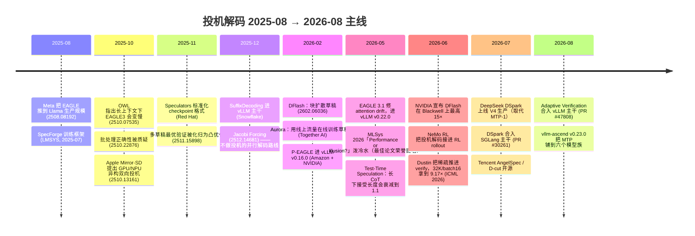

# RS-5 前沿与未来：投机解码 2025H2 – 2026H1 调研笔记

> 调研日：**2026-08-22**。本文是 `_research/` 下的调研原料，**不参与双链**，供 `24-前沿进展-2025到2026` 与 `25-未来判断-哪些方向会活下来` 取用。
> 全文遵守本库铁律二（加速比不许裸奔）与铁律五（史料可追溯、禁止无主语句子）。**查不到的一律写「未查证」。**

---

## 0. 怎么读这份笔记

### 0.1 证据分级（本篇自定，写正文时请沿用）

| 级别 | 含义 | 本篇标记 |
|---|---|---|
| **A** | 一手来源：论文原文 / 官方引擎 blog / 官方 repo 文档，且我本次实际抓取过页面 | 「**A**」 |
| **B** | 一手来源存在，但我只拿到检索摘要或二手转述，未逐字核对原文 | 「**B**」 |
| **C** | 第三方博客、个人实测、媒体报道 | 「**C**」 |
| **未查证** | 找过但没找到可信来源 | 「**未查证**」 |

### 0.2 落地状态分级（用户点名要求区分）

| 状态 | 含义 |
|---|---|
| **[已落地]** | 已进入 vLLM / SGLang / TensorRT-LLM / vllm-ascend 主干，或已在某厂生产线上服务真实流量 |
| **[有开源实现]** | 有官方 repo / HF checkpoint，但未进主流引擎主干 |
| **[论文]** | 只在论文里 |

### 0.3 本篇沿用的「无损」口径（见铁律一）

- **L1 分布无损**：输出是目标分布 $p$ 的精确样本。
- **L2 贪心等价**：$T=0$ 下逐 token 与目标模型相同。
- **L3 近似**：接受判据被放宽，分布 $\neq p$。

**本篇的一个重要观察**：2026 年最猛的几个加速数字，有相当一部分悄悄从 L1 滑到了 L3（步级语义验收、Jacobi 蒸馏、typical acceptance 的变体）。写正文时**必须逐个标口径**，否则会把 L3 的 4× 和 L1 的 2× 放在一张表里比较。

---

## 1. 一页速览：这一年发生了什么



**一句话总结这一年**：投机解码的战场从「怎么把草稿做准」转移到了**「怎么在真实并发下不亏钱」**。
三条主线同时落地：① 草稿从自回归改成**并行/块扩散**（DFlash → DSpark → DFly）；② 验证预算从固定 γ 改成**跨请求全局分配**（DSpark 的 confidence 调度已进 SGLang 与 vLLM 主干）；③ 草稿头从离线训练改成**用线上流量在线训练**（Aurora）。

**同时留下一个巨大的缺口**：学术界在长上下文方向已经把 verify 侧稀疏化推到 9.17×（Dustin, ICML 2026），而**三大引擎主干里一个长上下文专用实现都没有**——vLLM 的官方投机文档全文对长上下文零陈述。**这是本篇发现的最大落差。**

---

## 2. EAGLE 线：EAGLE-3 之后是什么

### 2.1 EAGLE 3.1（2026-05）**[已落地]**「**A**」

- **来源**：vLLM 官方 blog《EAGLE 3.1: Advancing Speculative Decoding Through Collaboration Between the EAGLE Team, vLLM, and TorchSpec》，2026-05-26，<https://vllm.ai/blog/2026-05-26-eagle-3-1>
- **署名**：blog 正文只署 "EAGLE Team, vLLM Team, and TorchSpec Team"，**未列个人作者名**（我核对了 GitHub 上的 markdown 源文件 `_posts/2026-05-26-eagle-3-1.md`，同样只有团队署名）。致谢里点名感谢 NVIDIA 提供 GPU 与合作。
- **它要解决什么**：blog 说，投机解码在受控实验里表现很好，但一换 chat template、一上长上下文、一换 out-of-distribution 的 system prompt，性能就掉。EAGLE 团队把这个脆弱性归因到一个现象——**attention drift**。

**attention drift 的机制**（blog 给的两条根因）：
1. 融合输入表示随着推进变得不平衡，**高层 hidden state 主导了 drafter 的输入**；
2. 由于残差路径没有归一化，**hidden state 的幅度随投机步数增长**。

结果是：随着投机深度增加，drafter 的注意力逐渐**从 sink token 移开、转向它自己刚生成的 token**。

**EAGLE 3.1 的两处结构改动**（这就是「新增了什么」）：
1. **FC normalization**：在每个 target hidden state 之后、进入 FC 层之前加一层 LayerNorm；
2. **post-norm hidden states**：把**归一化后**的 hidden state 喂进下一个解码步，而不是原始 state。

blog 对这个设计的解释值得引用：这个递归设计让 drafter 表现得像**反复调用自己**，而不是简单地在 target 上再叠几层。

**数字（严格按铁律二列口径）**「**A**」：

| 项 | 值 |
|---|---|
| 模型 | Kimi-K2.6-NVFP4（target）+ `lightseekorg/kimi-k2.6-eagle3.1-mla`（draft） |
| 引擎 / 硬件 | vLLM，TP=4，GB200，non-disaggregated |
| 数据集 | SPEED-Bench coding |
| γ | `num_speculative_tokens: 3` |
| 指标 | **per-user output throughput（TPS）加速比** |
| C=1 | 2.03× |
| C=4 | 1.71× |
| C=16 | 1.66× |
| 接受长度 | blog 只给定性："长上下文下接受长度最多 **2×** 于 EAGLE 3"，**未给具体表** |
| 对照基线 | 图注未明写是 vs AR 还是 vs EAGLE 3 —— **口径不全**，正文引用时须标注 |

**工程属性**：合并进 main，随 **vLLM v0.22.0** 发布；配置驱动扩展，`method` 仍写 `eagle3`；**与已有 EAGLE 3 checkpoint 完全向后兼容**。

启动命令（blog 原文）：
```bash
vllm serve nvidia/Kimi-K2.6-NVFP4 \
  --tensor-parallel-size 4 \
  --attention-backend tokenspeed_mla \
  --speculative-config '{"model":"lightseekorg/kimi-k2.6-eagle3.1-mla","method":"eagle3","num_speculative_tokens":3}'
```

**TorchSpec 是什么**：blog 说它是一个训练基础设施项目，为 EAGLE 3.1 及后续投机算法提供高效训练支持，降低训练开销、简化实验流程。Kimi K2.6 的 EAGLE 3.1 草稿模型就是用 TorchSpec + vLLM 训练并开源的。「**A**」

**blog 未声明任何遗留局限**——这本身是一个要在正文里点出来的问题（违反本库铁律三的精神）。

### 2.2 Attention Drift 的学术版（2026-05）**[论文]**「**A**」

- **arXiv:2605.09992v1**，2026-05-11，《Attention Drift: What Autoregressive Speculative Decoding Models Learn》
- **作者/机构**：Doğaç Eldenk（Northwestern University）、Payal Mohapatra（Northwestern）、Yigitcan Comlek（GE Aerospace）、Kaan Oktay（fal）、**Hongyang Zhang（University of Waterloo，EAGLE 系列共同作者）**、Stephen Xia（Northwestern）。代码：github.com/Dogacel/Attention-Drift
- **怎么量化**：可视化 query×key 注意力热图，统计**投机深度上 sink token 注意力占比 vs 最近生成 token 注意力占比**的此消彼长。
- **谁有这个毛病**：EAGLE-3 drafter **和 Qwen3.5 9B 的 MTP head 都有**。→ 这说明 drift 不是 EAGLE 特有，而是**「自回归 drafter 吃自己输出」这类设计的通病**。这条对正文很重要。
- **根因**：**投机步之间的残差连接没有归一化**，hidden state 幅度随链深单调增长，使 drafter 行为退化成「在 target 上再叠几层 transformer」，学到的是深度相关的 refinement，而不是稳定的 token 预测。
- **解法**：post-norm 结构 + 在采集 target state 前做 per-hidden-state RMSNorm。

**数字（vs pre-norm EAGLE-3）**「**A**」：

| 场景 | 增益 | 口径 |
|---|---|---|
| template perturbation | **最高 2×** 接受长度 | 原文未给出硬件/batch |
| 长上下文任务 | **1.18×** | 原文未给出硬件/batch |
| 七个标准 benchmark（chat/math/coding） | **1.10×** | 原文未给出硬件/batch |
| 训练成本 | TTT 深度从 8 降到 4 而不掉精度 | — |

> ⚠️ **口径冲突，正文必须点出来**：vLLM blog 说「长上下文下接受长度最多 2×」，而这篇论文给的长上下文数字是 **1.18×**，2× 出现在 **template perturbation** 场景。两者不是同一个实验。把 blog 的「2×」直接说成「长上下文 2×」是错的。

### 2.3 P-EAGLE（2026-03）**[已落地]**「**A**」

- **来源**：vLLM blog《P-EAGLE: Faster LLM inference with Parallel Speculative Decoding in vLLM》，2026-03-13，<https://vllm.ai/blog/2026-03-13-p-eagle>；论文 arXiv:2602.01469
- **作者/机构**：Amazon（Xin Huang, Florian Saupe, Jaime Campos Salas, Ashish Khetan, George Karypis）+ NVIDIA（Benjamin Chislett, Max Xu, Zeyuan (Faradawn) Yang, Kaihang Jiang, Xin Li, Omri Almog）
- **它卡在哪**：EAGLE 的 drafter 是**自回归**的，要出 K 个草稿 token 就得跑 K 次 drafter 前向，K 越大 drafting 开销越线性增长。

**机制（新增的东西）**：一次 drafter 前向出全部 K 个 token。
- 位置 1（NTP）：用新生成 token 的 embedding + `h_context`（target 对该新 token 的 hidden state）；
- 位置 2..K（MTP）：因为未来 token 还不存在，用**可学习的共享 mask token embedding + 共享 hidden state `h_shared`** 占位；
- K 个位置一次性过 drafter 的 transformer 层。

**与 Medusa 的区别**：blog 没有直接对比 Medusa。但机制上关键差别是 P-EAGLE 仍走 EAGLE-3 的 target-hidden-state 条件化路线，只是把**序列展开换成了并行占位**；Medusa 是纯多头、不吃 target hidden state。（这句是我的归纳，标为**推断**。）

**数字**「**A**」：

| 口径项 | 值 |
|---|---|
| 硬件 | 单卡 NVIDIA **B200** |
| 模型 | GPT-OSS 20B |
| γ | K ∈ {3, 5, 7} |
| 并发 C | 1 / 2 / 4 / 8 / 16 / 32 / 64（最大 1024 seq，100k max batched tokens）|
| 基线 | **vs EAGLE-3**（不是 vs AR） |
| 指标 | blog 表格标为峰值加速（未明写延迟还是吞吐，**口径不全**）|

vs EAGLE-3 的加速比：

| 数据集 | C=1 | C=4 | C=16 | C=64 |
|---|---|---|---|---|
| MT-Bench | 1.55× | 1.35× | 1.27× | **1.05×** |
| HumanEval | 1.55× | 1.45× | 1.31× | **1.23×** |
| SPEED-Bench | **1.69×** | 1.54× | 1.40× | **1.25×** |

接受长度 AL（K=7）：

| 方法 | HumanEval | SPEED-Bench | MT-Bench |
|---|---|---|---|
| P-EAGLE | 3.94 | 3.38 | 3.70 |
| EAGLE-3 | 3.03 | 2.59 | 3.27 |

→ **并行草稿不但没掉接受长度，反而涨了 13–31%**。这条反直觉，值得在正文里专门讲：因为并行 drafter 可以做得更深（把原本花在 K 次串行前向的算力堆到一次更深的前向里）。

**工程属性**：vLLM **v0.16.0** 起支持（PR #32887），配置项 `"parallel_drafting": true`。HF 上有官方 checkpoint：`amazon/gpt-oss-120b-p-eagle`、`amazon/GPT-OSS-20B-P-EAGLE`、`amazon/Qwen3-Coder-30B-A3B-Instruct-P-EAGLE`。SGLang 有 feature request（issue #23171）但**截至查证日未合入**「**B**」。

**失效条件与代价（blog 明说的）**「**A**」：
1. **必须专门训练**，不能复用 vanilla EAGLE-3 checkpoint；
2. **训练显存爆炸**：N=8192、K=8 时注意力要 65K×65K 元素，bf16 下约 **8 GB**；靠 sequence partition 算法 + position sampling 缓解；
3. **收益随并发衰减**：1.69×(C=1) → 1.05–1.25×(C=64)，因为并发高了以后 drafting 开销本来就相对变小了。

---

## 3. 2026 年真正的结构性变化：草稿从「自回归」换成「块扩散」

这是我这次调研**最意外的发现**，也是正文第 24 篇应该给最大篇幅的一条线。

### 3.1 DFlash（2026-02）**[已落地，三大引擎全支持]**「**A**」

- **arXiv:2602.06036**（v1 2026-02-05，v2 2026-05-28）《DFlash: Block Diffusion for Flash Speculative Decoding》
- **作者**：Jian Chen、Yesheng Liang、Zhijian Liu（z-lab）。代码 github.com/z-lab/dflash，HF 上 `z-lab/*-DFlash` 系列 checkpoint。「**B**」（作者列表来自 HF papers 页与 GitHub，**机构归属我未在论文首页逐字确认**）
- **abstract 原文关键句**「**A**」：

> "existing methods still rely on autoregressive drafting, which remains sequential and constrains practical speedups. Diffusion LLMs offer a promising alternative by enabling parallel generation, but current diffusion models typically underperform compared with autoregressive models. In this paper, we introduce DFlash, a speculative decoding framework that employs a lightweight block diffusion model for parallel drafting."

- **机制（新增了什么）**：用一个**轻量块扩散（block diffusion）模型**做 drafter，**一次前向出一整块草稿 token**；drafter 用**双向注意力**；关键是**以 target 模型抽出的 context feature 为条件**，这是它能把扩散模型的质量拉到可用的原因。
- **口径**：论文自称 **lossless**（对应本库 L1；但我**未逐行核对它的验收算法**，正文引用时请标「作者自称 L1，未独立复核」）。

**论文数字**「**B**」（来自 HF papers 页摘要与图表转述）：

| 口径项 | 值 |
|---|---|
| 综述性结论 | 「6× 以上无损加速」「最高比 EAGLE-3 快 2.5×」 |
| Qwen3-8B，greedy，Transformers backend | 平均 **4.9×** vs AR；接受长度 τ=**6.54** |
| Qwen3-8B，SGLang | **5.1×** |
| Qwen3-8B，temperature=1 | τ=**5.48** |
| τ 跨任务范围 | 4.24 – 7.87 |
| batch size | **原文未给出**（从"Transformers backend / greedy"推测是 bs=1，**标为推断**）|
| 评测集 | GSM8K, Math500, AIME25, HumanEval, MBPP, LiveCodeBench, MT-Bench |

**NVIDIA 官方 blog 的数字**（2026-06-23，《Boost Inference Performance up to 15x on NVIDIA Blackwell Using DFlash Speculative Decoding》，作者 Elmeleegy, Chislett, Xiong, Iovine, Almog, Zhang, Liu）「**A**」：

| 口径项 | 值 |
|---|---|
| **「15×」的完整口径** | gpt-oss-120b；**8× NVIDIA DGX B300（Blackwell Ultra）**；**TensorRT-LLM**；SPEED-Bench coding；**在 500–600 tok/s/user 的高交互性区间**，**吞吐**提升最高 15×；**基线是 AR 解码** |
| gpt-oss-120b vs EAGLE-3（等并发） | 平均 **2.3×** 交互性 |
| Llama 3.1 8B Instruct vs EAGLE-3（等并发） | 平均 **2.8×**；SPEED-Bench multilingual 上"接近翻倍交互性" |
| 跨数据集范围 vs EAGLE-3 | 1.5× – 3.1× |
| Gemma 4 31B，**vLLM**，单卡 Blackwell Ultra，**batch 1** | Math500 5.8× / HumanEval 5.6× / GSM8K 5.3×（vs AR）|
| Qwen3-8B，**SGLang**，单卡 **B200**，**batch 1** | Math500 5.1× / HumanEval 4.2×（vs AR）|

> ⚠️ **「15×」不是加速比意义上的 15×**：它是**在固定 per-user 交互性（500–600 tok/s/user）下的聚合吞吐提升**。AR 解码要维持 500–600 tok/s/user 只能跑极低并发，所以分母被压得很低。正文引用这个数字**必须带上这句解释**，否则就是裸奔。

**工程属性**：HF 上 **20 个 checkpoint**（z-lab collection）；SGLang / vLLM / TensorRT-LLM 三家都支持；NVIDIA 说法是「把 EAGLE-3 checkpoint 换成 DFlash checkpoint，**无需改代码**」；Blackwell 与 Hopper 都有 recipe。vLLM 侧通过 `speculators` 库集成，`method: dflash`。

**一条来自个人博主的相反观测**「**C**，低可信度，未复现」：Medium 上 Allen Kuo 的本地实测称，DFlash 在 greedy(T=0) 下首位接受率 ~80%、约 3× 加速，但 **T≥0.7 时接受率掉到 ~5%，加速比崩塌**。这与 DFlash 论文自己给的 T=1 时 τ=5.48、以及 DSpark 论文里 T=1 的表格**矛盾**。我倾向于认为是本地配置问题，但正文可以作为「社区实测踩坑」提一句并注明矛盾。

### 3.2 DSpark（2026-07）**[已落地：DeepSeek V4 生产线]**「**A**」

这是本次调研里**唯一一个明确写着「已经替换掉生产环境旧方案、在真实用户流量上跑」**的工作。

- **arXiv:2607.05147v1**，2026-07-06，《DSpark: Confidence-Scheduled Speculative Decoding with Semi-Autoregressive Generation》
- **作者/机构**：Xin Cheng、Xingkai Yu、Chenze Shao、Jiashi Li、Yunfan Xiong 等 20+ 人，**Peking University + DeepSeek-AI**
- **它要解决什么——「suffix decay」**：纯并行 drafter（如 DFlash、P-EAGLE）每个位置**独立预测**、不以前面已采样的 token 为条件，于是发生「多模态碰撞（multi-modal collision）」——模型在多个都合理的续写之间做边缘化，吐出像 "of problem" 这样自相矛盾的组合。后果是**后面位置的接受率快速衰减**。

**位置级证据（论文 Figure 2）**「**A**」——这张图是整条线的关键：

| 位置 | 自回归 drafter（Eagle3） | 并行 drafter（DFlash） |
|---|---|---|
| 位置 1 | 0.81（Math） | **0.88（Math）**——并行更强，因为架构更深 |
| 位置 2–7 | **稳定** | **快速衰减**（Chat 上 0.72 → 0.63）|

→ **一句话**：并行 drafter 赢在第一位，自回归 drafter 赢在后面几位。DSpark 就是把两者缝起来。

**机制（新增了什么）**：
1. **并行阶段**：一个**基于 DFlash 的深层并行 backbone**，一次前向出全部 γ 个草稿 token 的 hidden state 与 base logits；
2. **串行阶段**：一个**轻量因果模块**，给每个位置加 per-position transition bias，让后面的 token 能以前面已采样的 token 为条件。两种变体：
   - **Markov head**：低秩分解（r=256）近似一阶转移，$B(x_{k-1},\cdot)=W_1[x_{k-1}]W_2$；
   - **RNN head**：块内维护递归状态，累积完整前缀历史；
3. **confidence head**：输出标量 $c_k\in(0,1)$，估计「在前面都被接受的条件下，位置 k 的草稿 token 通过验证的条件概率」。训练目标用 draft/target 分布的 **total variation distance** 推出的解析接受率；
4. **Sequential Temperature Scaling (STS)** 后校准：对累积乘积 $\prod_{i\le k}c_i$ 从左到右校准，把 ECE 压到 ~1%；
5. **Hardware-Aware Prefix Scheduler**（这是最有系统味的一块）：不是设静态阈值，而是
   - 算每个请求每个前缀的存活概率 $a_{r,j}=\prod_{i\le j}c_{r,i}$；
   - **跨请求全局排序**；
   - 贪心地把 token 放进验证预算，最大化系统吞吐 $\Theta=\tau^\*\cdot \mathrm{SPS}(B)$，其中 $\mathrm{SPS}(B)$ 是**实测**的 batch=B 下的 steps-per-second；
   - 吞吐开始掉就 early stop。

**离线数字**「**A**」（Qwen3-4B/8B/14B、Gemma4-12B；math/code/chat 共 9 个集）：

| 对照 | Qwen3-4B | Qwen3-8B | Qwen3-14B |
|---|---|---|---|
| vs 自回归 Eagle3（接受长度） | +30.9% | +26.7% | +30.0% |
| vs 并行 DFlash（接受长度） | +16.3% | +18.4% | +18.3% |

领域差异：**math/code 约 5.5τ，chat 约 3.5τ**（这条和第 9 节「长 CoT 更好投机还是更差」直接相关）。

**生产数字**「**A**」（DSpark-5，γ=5，vs 生产基线 **MTP-1**，DeepSeek-V4-Flash / V4-Pro preview，**live user traffic**）：

| 场景 | 结果 |
|---|---|
| V4-Flash，80 tok/s/user SLA | **聚合吞吐 +51%** |
| V4-Flash，等吞吐 | **per-user 生成速度 +60% ~ +85%** |
| V4-Flash，120 tok/s/user 严格 SLA | MTP-1 已接近极限、并发批量极小；DSpark 仍能维持吞吐 |
| V4-Pro，35 tok/s/user SLA | **聚合吞吐 +52%** |
| V4-Pro，50 tok/s/user SLA，等系统容量 | **per-user +57% ~ +78%** |
| 负载自适应 | 中并发（V4-Flash <200 请求 / V4-Pro <150）时分配 4–6 token 验证预算；高并发时自动收缩以保批量 |
| 硬件 | **原文未给出**（生产集群配置未披露）|

**开源**：checkpoint 发在 HF；训练框架 **DeepSpec** 开源，内含 Eagle3 / DFlash / DSpark 三种实现；训练数据 Open-PerfectBlend（1.3M 条：chat 17.6%、math 39.4%、code 38.9%、instruction 4.1%）。

> 📌 **这条对「MTP 是不是终点」的判断至关重要**：**DeepSeek 自己在 V4 生产线上把 MTP-1 换掉了**。所以「模型自带 MTP 头 = 投机解码问题已解决」这个说法，被提出 MTP 的那家公司亲手证伪。

### 3.3 Tencent AngelSpec / DFly / D-cut（2026-07）**[有开源实现 + 腾讯生产验证]**「**A**」

- **arXiv:2607.25852v2**，2026-07-29，《AngelSpec: Towards Real-World High Performance Inference with Speculative Decoding》
- **作者/机构**：Hong Liu, Rui Cen, Junhan Shi, Guangshuo Qin, Jiebin Zhang, Tianyu Liu, Runzhi Fan, Guoliang Zhao, Ruobing Xie, Kai Zhang, Song Liu, Guanghua Yu, Jianchen Zhu（**Tencent Inc**）。代码 github.com/Tencent/AngelSpec
- **配套论文**：**arXiv:2607.14647**（2026-07-16）《D-cut: Adaptive Verification Depth Pruning for Batched Speculative Decoding》

**核心论点（很值得正文引用）**：**没有任何一种草稿结构在所有真实负载上都最好**。
- **MTP（自回归，3 token）**：适合**高熵对话**——因为对话里接受率衰减快，短候选反而划算；
- **DFly（块并行扩散，8 token）**：适合 **code / math** 这类结构化负载——有更长的可预测跨度。

于是 AngelSpec 把「负载异质性」当成一等设计约束：**结构、训练数据、验证深度全部按负载分化**。MTP 喂丰富多样的对话数据，DFly 喂 code/math 数据。

**DFly 相对 DFlash 的三处改进**「**A**」：
1. **hybrid target-conditioning backbone**：全局跨层变换 + 层特定 target view，让不同草稿层用适配自己深度的 target 特征；
2. **predecessor-conditioned autoregressive head**：用更早草稿位置已选定的 token 修正边缘预测（和 DSpark 的思路同源）；
3. **acceptance-aware 训练目标**：直接优化多 token 接受。

**D-cut 机制**：把 target 验证当成**批级共享资源**。用 token confidence 估每个请求的接受概率 → 先估各种 keep depth 的收益 → 结合 profile 出来的运行时代价，选吞吐/成本比最大的工作点；从 4 档预算比（0.25–1.00）里按当前 batch size 和实测 step latency 选。

**数字**「**A**」：

| 口径项 | 值 |
|---|---|
| Target | **Hy3-A21B**（295B MoE，激活 21B） |
| 硬件 | **8× NVIDIA H20，TP=8** |
| 温度 | T=1 |
| 基线 | AR 解码 |

| 并发 | DFly vs AR | MTP vs AR | DFly vs DFlash |
|---|---|---|---|
| c4 | 1.98× | 1.60× | +10.5% |
| c8 | 2.26× | 1.66× | +10.9% |
| c16 | 2.50× | 1.64× | +11.6% |
| c32 | **2.75×** | 1.86× | +11.6% |
| c64 | 2.44× | 2.08× | +11.8% |

> 注意这张表的形状**和 P-EAGLE / MLSys 那张相反**：AngelSpec 的加速比在 c32 达到峰值而不是单调下降。原因大概率是 **Hy3-A21B 是 21B 激活的 MoE，在 H20 上 decode 长期处于带宽瓶颈**，所以带宽红利延续到更高并发。**这条差异必须在正文里讲清楚，否则会给读者「投机在高并发也很好」的错觉。**（因果解释部分标为**我的推断**。）

D-cut 在线上流量下：等 per-user 解码速度 ~15.3 tok/s 时，**聚合吞吐 981 tok/s vs DFly 858 tok/s（+14%）**；代价是接受率平均掉 1.5%（c64 掉 2.8%），换来吞吐 +15.7%。平均接受长度：MTP ~3.0、DFly ~4.8、DFly+D-cut ~4.6。

单点例子：Hy3-A21B，T=0，GSM8K，MTP 接受率 56.8% → 80.6%（+23.8pp）。

---

## 4. MTP 作为原生能力：是不是「默认配置」了？

### 4.1 已确认把 MTP 写进预训练/后训练的模型

| 模型 | 证据 | 机制细节 | 级别 |
|---|---|---|---|
| **DeepSeek-V3** | arXiv:2412.19437 技术报告 | MTP 模块；报告称第二 token 接受率 **85%–90%**，TPS **1.8×** | 「**B**」（数字来自检索摘要转述报告，未逐字核原文页码）|
| **MiniMax-M2** | **arXiv:2605.26494**（v2 2026-07-30） | 62 层 decoder-only，229.9B 总参 / **9.8B 激活**；在**持续预训练的 decay 阶段**把 MTP 模块**从 1 个扩到 3 个（K=3）**以支持多步投机；MTP 模块**用主模型权重拷贝初始化**而非随机初始化 | 「**B**」 |
| **DeepSeek-V4** | vllm-ascend v0.23.0 release notes + DSpark 论文 | V4 生产线原基线就是 **MTP-1** | 「**A**」 |
| **Qwen3.5** | 第三方（mlx-lm PR #990、个人博客） | checkpoint 自带 MTP head，config 里 `mtp_num_hidden_layers: 1`；从 t 位置 backbone hidden state + token t 的 embedding 预测 **t+2** | 「**C**」——**官方技术报告我未查证** |
| **GLM-5.1** | 第三方博客 | 原生 MTP head；SGLang 里走 **NEXTN** 算法；建议把 MTP 层（第 78 层）留 **BF16**（~19 GB）以保接受率 | 「**C**」 |
| **Kimi K2.5** | 第三方 | **没有原生 MTP**，要投机就得上 EAGLE | 「**C**」 |
| **Kimi K2.6** | vLLM blog | 官方推荐的是 **EAGLE 3.1 draft**（`lightseekorg/kimi-k2.6-eagle3.1-mla`），不是自带 MTP | 「**A**」 |

### 4.2 最硬的落地证据：vllm-ascend 的支持面

vllm-ascend release notes（<https://docs.vllm.ai/projects/ascend/zh-cn/main/user_guide/release_notes.html>）「**A**」：

> **v0.23.0（2026.08.16）**：MTP 支持扩展到 **DeepSeek V4、Qwen3.5/3.6、MiniMax 2.x、Step3、Gemma4**。

一个 NPU 后端的适配层要为**六个不同厂商的模型族**分别做 MTP 支持，说明**「模型自带草稿头」在 2026 年已经是主流开源模型的标配**，而不是 DeepSeek 一家的特色。这是本节最有力的一条证据。

### 4.3 但「自带 MTP」**不是**终点——三条反证

1. **DeepSeek 自己换掉了 MTP-1**：V4 生产线用 DSpark 取代，per-user 提速 57–85%（见 §3.2）。「**A**」
2. **MTP 的训练目标和投机用法是错配的**：Nebius 的 LK Losses 论文（arXiv:2602.23881（2026-02），ICML 2026）明确指出——**DeepSeek-V3 的 MTP 模块主要是为「预测第一个 token」训练的，推理时却被自回归地反复复用到后面位置，导致后面位置接受率退化**。「**B**」
3. **MTP head 一样有 attention drift**：arXiv:2605.09992 在 Qwen3.5 9B 的 MTP head 上观察到了和 EAGLE-3 drafter 一样的漂移。「**A**」

**结论（我的判断，标为推断）**：**MTP 已经成为"地板"而不是"天花板"**——它是模型交付时应当自带的最低配置，但一线厂商的生产线普遍在 MTP 之上再叠一层专门训练的 drafter。

---

## 5. 训练侧：草稿头怎么训，2026 年的四个流派

### 5.1 SpecForge（LMSYS / SGLang）**[已落地]**「**B**」

- blog：<https://www.lmsys.org/blog/2025-07-25-spec-forge/>（2025-07-25）；论文 **arXiv:2603.18567**《SpecForge: A Flexible and Efficient Open-Source Training Framework for Speculative Decoding》
- **两种训练模式**（这是这个框架最该被记住的设计）：
  - **Online**：冻结 target，**边跑边生成 aux hidden state**，同时训 draft。需要多卡，但不落盘。
  - **Offline**：先用 target 把 hidden state 全部生成并**存盘**，再单独训 draft。**最少一张卡**就能训，但**吃海量磁盘**。
- 技术点：target-draft 解耦、混合并行、优化训练 kernel、与生产级推理引擎打通。
- 数字：Qwen3-235B-A22B 的 EAGLE-3 训练**最高快 9.9×**；训出的 draft 在 SGLang 上端到端**最高 4.48×**（**batch/硬件口径原文未给出**，正文引用须标注）。
- AMD ROCm 官方教程收录（rocm.docs.amd.com AI Developer Hub），说明 SpecForge 已经是跨厂商的事实标准之一。

### 5.2 Speculators（vLLM 项目 / Red Hat）**[已落地]**「**B**」

- repo：github.com/vllm-project/speculators；文档 docs.vllm.ai/projects/speculators
- **它解决的是「格式」问题**：基于标准 HuggingFace 模型格式，把所有投机细节收进 `config.json` 里的 `speculators_config`，训完的 checkpoint **直接插进 vLLM 的投机流水线，服务栈不用改一行**。
- **v0.5.0（2026-06-04）**：新增 **DFlash 支持**与**在线训练**。「**B**」——我未抓到该文详细机制。
- Red Hat 发布过 Gemma 4 31B-it 的 DFlash 与 EAGLE-3 两套 speculator。

**Red Hat 的 cross-distillation 发现（2026-07-06）**「**B**」，这条很实用：

> 训 speculator 的标准做法是 **self-distillation**（用 verifier 自己在一批 prompt 上生成回答，让 speculator 学着预测）。典型要 **~50 万条**样本，让一个巨大的 verifier 生成这么多回答是主要算力开销。Red Hat 试了 **cross-distillation**——用**更大的模型**生成的回答来训。

结果：
- Qwen3-30B-A3B：用 Qwen3-235B 的数据做 cross-distillation，**七个负载全面胜过 self-distillation**，平均接受长度 **2.77 → 3.05（约 +10%）**，增益最大的是 math reasoning 和 HumanEval；
- instruct 变体：整体领先但增益温和，集中在 HumanEval / QA / RAG（约 +4–5%）。
- **硬件/batch 口径原文未给出。**

### 5.3 Aurora（Together AI）：用线上流量在线训练草稿头 **[有开源实现]**「**A**」

这是用户点名要问的「用线上流量持续训练草稿头」的直接答案。

- **arXiv:2602.06932（2026-02）**，**ICML 2026**；项目页 <https://aurora-spec-ai.github.io/>；博客 <https://www.together.ai/blog/aurora>；代码 **github.com/togethercomputer/aurora**
- **作者**：Junxiong Wang, Fengxiang Bie, Jisen Li, Zelei Shao, Yubo Wang, Yinghui Liu, Qingyang Wu, Avner May, Sri Yanamandra, Ce Zhang, **Tri Dao**, **Percy Liang**, Ben Athiwaratkun, Shuaiwen Leon Song, Zhongzhu Zhou, Chenfeng Xu, Xiaoxia Wu。主机构 **Together AI**（含 Stanford / CMU 等）。

**机制（新增了什么）**：把在线 speculator 学习**重述成异步强化学习问题**。
- 两组件解耦：**SGLang 推理服务器** + **异步训练服务器**；
- 每个请求的**被接受 token 和被拒绝 token 都**流进分布式 data buffer；
- RL 形式化：**draft model = 策略 π，target + verifier = 环境**；
- 两个损失：**acceptance loss**（在被接受 token 上的交叉熵）+ **rejection loss**（基于 KL 的目标，用 Discard Sampling 把概率质量推离错误预测）；
- 训练服务器在 draft 的副本上做梯度更新，**热插拔（hot-swap）**权重回推理服务器，**不中断请求**；**lazy synchronization** 在「适应速度」和「服务稳定」之间取平衡。

**数字**「**A**」：

| 场景 | 模型 | batch | 接受长度 | 加速 | 收敛所需 |
|---|---|---|---|---|---|
| Day-0 从零 | Qwen3-Coder-Next-FP8 | 8 | 3.0 | **1.21× 吞吐** | ~1k warmup + 10k steps |
| Day-0 从零 | MiniMax M2.1 | 4/8 | 2.8 | **1.45× 吞吐** | 原文未给出 |
| 域漂移恢复 | Qwen3-8B | 4 | 约 10k 请求内恢复 | — | ~10,000 请求 |
| vs 训好的静态 speculator | Qwen3-8B | 多 batch | — | **额外 1.25×** | — |
| 前沿模型混合数据 | MiniMax M2.1 / Qwen3-Coder-Next | 生产设置 | — | **1.57×** | — |
| 硬件 | **原文未给出** | | | | |

**三条经验结论（blog 明说）**「**B**」：
1. **简单的在线微调就能拿到大部分可得收益**；
2. **lazy synchronization** 在适应速度与服务稳定之间平衡最好；
3. **day-0 从零部署是可行的**——一个没训过的 speculator 在**几千个请求内**就能达到有竞争力的接受率，**离线预训练这个瓶颈可以被绕过**。

**它想干掉的东西**：离线蒸馏流水线的 activation 采集与 replay，**可以到 PB 级存储**，内存/带宽/运维成本都很高。

### 5.4 直接优化接受率的损失函数：LK Losses（Nebius）**[论文]**「**B**」

- **arXiv:2602.23881**，**ICML 2026**，《LK Losses: Direct Acceptance Rate Optimization for Speculative Decoding》
- 作者：Alexander Samarin, Sergei Krutikov, Anton Shevtsov, Sergei Skvortsov, Filipp Fisin, Alexander Golubev（Nebius）。博客 <https://nebius.com/blog/posts/lk-losses>
- **机制**：不再用 **KL 散度做代理**，而是设计**直接以接受率为目标**的训练损失。
- 覆盖 **4 种 draft 架构 × 6 个 target 模型（8B–685B）**，接受指标一致提升。**具体数值我未拿到，标为待补。**
- 顺带指出了 DeepSeek-V3 MTP 的训练/推理错配（见 §4.3）。

### 5.5 这一节的骨架结论

**草稿模型训练在 2026 年完成了从「手工活」到「基础设施」的转变**，标志是三件事同时发生：
1. **格式标准化**（Speculators 的 `speculators_config`）；
2. **训练框架产品化**（SpecForge / TorchSpec / DeepSpec / AngelSpec 各家都开源了）；
3. **训练在线化**（Aurora 把它变成服务的一部分，而不是发版前的一道工序）。

---

## 6. 长上下文专用方案

**这是本次调研里证据最完整、也最有正文价值的一节。**核心结论先放这里：

> **长上下文投机的失败，不是「训练数据不够长」，而是 drafter 架构对窗口有依赖；而长上下文下真正吃掉时间的是 verify 侧的 KV 读带宽——学术界已经把这一侧推到 9.17×，但三大引擎主干一个都没接。**

### 6.1 OWL（2025-10）**[论文，未进任何引擎主干]**「**A**」

- **arXiv:2510.07535**，**2025-10-08，仅 v1**（请求 v2 返回 404，可确认截至查证日无 v2）
- **作者/机构**：Jaeseong Lee、Seung-won Hwang（**首尔大学 SNU**）、Aurick Qiao、Gabriele Oliaro、Ye Wang、Samyam Rajbhandari（**Snowflake AI Research**，另有 **CMU**）
  → 注意 Qiao / Oliaro / Rajbhandari 三人也是 Snowflake SuffixDecoding 的作者，**是同一批人**，这解释了 OWL 的第三个创新为什么是「和 suffix decoding 混合」。
- **venue**：论文页**未标注**任何会议，截至查证日仍是 preprint。
- **代码**：v1 只给了匿名链接 `anonymous.4open.science/r/owl-BFB8`；**正式 GitHub / LongSpecBench 数据集地址未查证**。

**它捅破的窗户纸**：benchmark 通常假设短上下文（SpecBench 典型 ≤2K），真实负载是长上下文；**在长上下文上 EAGLE3 会把生成速度拖慢到 0.81×**——即**负收益**。这是本库铁律三的头号素材。

**LongSpecBench 是什么**：从 **WildChat-4.8M**（真实 ChatGPT 对话日志）采样出 **200 条**样本，上下文 **4K–64K token**。

**三项创新（全部核实）**：

1. **LSTM drafter（长度无关的起草器）**——用 LSTM 替换 EAGLE3 的 transformer draft head。关键机制：**只吃最后一个 token 的 hidden state $h_N$**（$E(t_{N+1})$ + $h_N$ 经 $W^f/W^i/W^o/W^c$ 投影进标准 LSTM 门），递归预测时复用同一套权重。**因为不看窗口，训练序列只要 256 token 就能支撑长上下文推理。**
2. **`[SPEC]` 特殊 token 塞进 verifier（不是塞进 drafter）**——在 **target LLM** 的输入里追加 `[SPEC]`，让**大模型自己**吐出一个「超出已接受 token 之后」的富表示，再喂给 drafter。三阶段各自实现：prefill 在输入起始追加；decode 在每条 tree path 后各追加一个（数量 = tree 节点数），靠**改写 position id 与 attention mask** 实现；training 单次 forward 对所有可能前缀追加，用改造的 mask 一次算完。原文措辞：**在传给 verifier 的 token 数不变、latency intact 的前提下显著提升 acceptance length。**
3. **HOWL = 树/非树混合解码**——把 OWL 的 tree decoding 与 **SuffixDecoding 的非树方法**按分数阈值路由：score > 阈值走 non-tree（**不加 `[SPEC]`**），否则走 OWL。动机：非树方法平均接受低，但**偶发极高**，两者互补。

**数字（全口径）**「**A**」——测量条件：**batch size = 1**、tree size 60、tree depth 8、top-k 10、**fp16**、**1×H200（8B）/ 8×H200（70B）**、SAMD 框架 static cache；训练用 8×H200、batch 2048、lr 1e-3、3000 iter、**训练序列仅 256 token**、数据 Ultrachat-200k + Magicoder。

Table 1，LongSpecBench 上的**接受长度**：

| 方法 | Llama-3.1-8B | Llama-3.3-70B |
|---|---|---|
| PLD | 2.75 | 2.24 |
| Suffix Decoding | 3.41 | 2.61 |
| SAMD | 3.18 | 2.48 |
| Token Recycling | 3.16 | 2.97 |
| **EAGLE3** | **1.28** | **1.35** |
| **OWL** | **4.00** | **4.27** |
| SAMD + Token Recycling | 4.98 | 4.05 |
| **HOWL** | **6.14** | **5.31** |

Table 2，**token/s**（**注意：这一列全部是 Llama-3.3-70B，不是 8B**）：
baseline 1.00× ｜ PLD 1.59× ｜ Suffix Decoding 2.18× ｜ SAMD 2.16× ｜ Token Recycling 1.75× ｜ **EAGLE3 0.81×（负加速）** ｜ OWL w/o [SPEC] 2.00× ｜ **OWL 2.35×** ｜ SAMD+Token Recycling 2.77× ｜ **HOWL 3.08×**

> ⚠️ **口径校正（按其表格自算，非原文表述）**：摘要说「比 EAGLE3 接受长度高约 5×」。核算 Table 1：**OWL 单独只有 4.00/1.28 = 3.13×**；**6.14/1.28 = 4.80× ≈ 5× 对应的是 HOWL，不是 OWL。** 引用这条**必须写清是哪个变体**。

**Table 4 是全文最硬的一张表**（正文务必引用）：

| 配置 | LongSpecBench 接受长度 |
|---|---|
| EAGLE3（训练 ctx 2,048，短数据） | 1.28 |
| **EAGLE3-L（训练 ctx 32,768，LongAlign+LongWriter 长数据）** | **3.23** |
| **OWL（训练 ctx 仅 256，短数据）** | **4.00** |

→ **把 EAGLE3 也拿长文本训（而且训到 32K，再长就 OOM），仍然打不过用 256 token 短数据训的 OWL。** 这条直接证伪了「长上下文投机不行是因为训练数据不够长」这个最常见的解释。**病根在架构对窗口的依赖。**

Table 3（跨基准泛化）：EAGLE3 在 SpecBench 上 5.79、在 LongSpecBench 上 1.28；OWL 是 4.14 / 4.00。**EAGLE3 掉了 4.5×，OWL 几乎不掉。**
Table 5（8B 消融）：EAGLE3 1.28 → 纯 RNN 2.99 → OWL w/o [SPEC] 3.14 → +[SPEC] 4.00 → +Hybrid(HOWL) 6.14。

### 6.2 TriForce / MagicDec 之后：四条后继线

2024 年两篇奠基：**TriForce**（arXiv:2404.11912（2024-04），分层投机 + 检索起草）、**MagicDec**（arXiv:2408.11049（2024-08），大 batch 长上下文下**用稀疏 KV 起草、full-KV 验证**）。2025–2026 的后继分成四条：

**线 1：为长上下文重做 drafter（verify 仍读 full KV，保持无损）**

| 工作 | arXiv / 年月 | 作者·venue | 新机制 | 数字 + 条件 |
|---|---|---|---|---|
| **LongSpec** | 2502.17421，2025-02（v4 2026-04） | Yang Penghui, Cunxiao Du, Fengzhuo Zhang, Haonan Wang, Tianyu Pang, Chao Du, Bo An（Sea AI Lab / NTU）；**ACL 2026 Long**（aclanthology.org/2026.acl-long.83）⚠️ arXiv comment 字段写 "ACL'25"，与 Anthology 卷号冲突，本篇按 Anthology 采信 | ① **常数大小 KV cache 的 draft model**（不随上下文增长）② 新 position index 缓解短训长推 mismatch ③ attention aggregation：快速前缀计算 + 标准 tree attention | 5 个长上下文理解数据集**最高 3.26×**（vs Flash Attention baseline）；QwQ 在 AIME24 上 **2.25× wall-clock**。**硬件/batch/上下文长度原文摘要未给出**。代码 github.com/sail-sg/LongSpec |
| **OWL / HOWL** | 见 §6.1 | | | |
| **SpecExtend** | 2505.20776，2025-05（v4 2026-01） | Jungyoub Cha, Hyunjong Kim, Sungzoon Cho（首尔大学） | **免训练 drop-in**：① FlashAttention + Hybrid Tree Attention 加速 prefill/verify ② **Cross-model Retrieval**——**用 target 模型的 attention score 给 draft 模型做 KV 驱逐/选择** | 16K 长文摘要**最高 2.84×**；长推理任务**最高 3.86×**。**硬件/batch 原文摘要未给出** |
| **RACER** | 2604.14885，2026-04，**Findings of ACL 2026** | Zihong Zhang, Zuchao Li, Lefei Zhang, Ping Wang, Hai Zhao | 免训练：把**检索到的精确 pattern**（可靠锚点）与 **logits 驱动的未来线索**（灵活外推）融合成草稿树 | Spec-Bench / HumanEval / MGSM-ZH 上 **>2×**。⚠️**这三个都不是长上下文基准**；硬件/上下文长度/batch 原文未给出 |
| **Graft**（Draft Less, Retrieve More） | 2605.20104，2026-05 | 作者/机构**未核验**（仅搜索摘要） | 剪掉低置信度 draft 分支，把释放的预算**嫁接**成检索分支，再用不变的 target 验证规则验合并树；免训练、无损 | 短上下文最高 **5.41×**；Qwen3-235B 上比 EAGLE-3 再高 21.8%。⚠️**短上下文结论**，未逐表核验 |

**线 2：直接对 verify 下手**——见 §6.3，这才是 TriForce/MagicDec 的正统继承线。

**线 3：自投机 + 量化 KV**——**QuantSpec**（arXiv:2502.10424，2025-02）：draft 与 target **同架构**，draft 侧用**分层 4-bit 量化 KV cache + 4-bit 权重**；报告接受率 **>90%**、端到端最高约 **2.5×**、跨多个上下文长度 **>1.78×**。⚠️硬件/模型对/batch **未从原文核实**。

**线 4：验证长度自适应**——见 §7.3（DSpark / D-cut / ECHO / vLLM Adaptive Verification）。这条不是长上下文专用，但**是 2026 年引擎侧真正落地的那条**。

### 6.3 Dustin（2026-06）：把稀疏推进 verify，代价是不再无损 **[论文]**「**A**」

- **arXiv:2606.24957**，**2026-06-23**，**已被 ICML 2026 接收**
- **作者/机构**：WenHung Lee, Jian-Jia Chen, Xiaolin Lin, Pei-Shuo Wang, Chi-Chih Chang, Chun-Che Yang, Ning-Chi Huang, Grace Li Zhang, Kai-Chiang Wu —— **国立阳明交通大学（NYCU）+ TU Darmstadt + Cornell**
- **问题陈述**（正是用户问题里的那条张力）：多 batch 长上下文下，投机采样被 **verification bottleneck** 卡住，**KV cache 读取主导 latency**。现有 KV 压缩在这个 regime 都不行——静态驱逐因 **saliency shift** 掉精度；动态选择在**验证路径上**开销过高。

**机制（新增了什么）**：
1. **Draft-Augmented 混合打分**：把 **draft model 的 lookahead attention 信号**（跨 Γ 个草稿 token）与 **target 上一次 forward 的历史 attention** 聚合成 $S_{\text{Draft}}$ 与 $S_{\text{Target}}$。**关键点**：单靠 target 的历史 attention 无法预知**多步验证窗口内**哪些 token 会变重要，draft 的前瞻正好补上这个信息。
2. **分层预算分配**：先保 attention sink + recent window，再填 top-m 的 draft 选中 token，最后填 target 选中 token。
3. **Semantic Retrieval Heads (SRH) 稀疏估计**：不物化完整 attention 张量，**每层只在离线选出的极少数 head 上算重要性分数**；Qwen2.5-72B/0.5B 配置下开销降到全量混合计算的 **约 0.8%**。SRH 选择走三阶段搜索：贪心选 target 层 → 迭代加 draft 层 → **Optuna 贝叶斯优化预算**。

**数字（全口径）**「**A**」——硬件 **NVIDIA H200，bfloat16**；72B/70B 用 **pipeline parallel 4×H200**；模型对 **Qwen2.5-72B（target）/ Qwen2.5-0.5B（draft）**；KV budget 典型 **512**（4 sink + 16 recent + 选中）：

| 上下文 | batch | Vanilla (tok/s) | Dustin (tok/s) | 加速 | 接受长度 |
|---|---|---|---|---|---|
| **32K** | **16** | 25.70 | 235.81 | **9.17×** | 2.2 |
| 32K | 8 | 23.26 | 153.67 | 6.61× | 2.2 |
| 16K | 16 | 46.03 | 324.86 | 7.06× | 2.2 |
| 8K | 16 | 76.23 | 362.50 | 4.76× | 2.2 |

- self-attention 单算子加速 **27.85×**（32K, batch 16）。
- **精度代价（LongBench，KV budget 512）**：Qwen2.5-72B — Dustin 55.23% vs Vanilla 55.81%（**−0.58%**），StreamingLLM 35.25%，Quest 47.69%；Llama-3.3-70B — Dustin 53.23% vs Vanilla 50.94%（+2.29%）。budget 降到 **128** 时 Qwen2.5-72B 掉到 52.41%。
- **决定性的对照**：同硬件同模型下，**ClassicSD（full-KV 验证）只有 1.76–1.91×，MagicDec（稀疏起草 + full-KV 验证）只有 1.70–1.96×**，而 Dustin 是 **9.17×**。

> 📌 **这组对照是本节最有价值的数字**：**「只稀疏 draft」= 1.9×，「把稀疏推进 verify」= 9.17×。这 5 倍的差距，就是长上下文下 verify 侧 KV 读取所占的规模。** 代价是**不再无损**（LongBench 掉 0.58%）。正文第 22 篇应当直接用这组数。

### 6.4 verify 侧稀疏化的两个阵营（按是否无损分类）

**这是本节唯一重要的分类轴。**

**阵营 A：坚持无损——稀疏只用在 draft，verify 仍读 full KV**

| 工作 | arXiv / 年月 | 作者·venue | 新机制 | 数字 + 条件 |
|---|---|---|---|---|
| **Vegas**（v1 名为 **SpecAttn: Co-Designing Sparse Attention with Self-Speculative Decoding**，**改过名，引用须注意**） | 2602.07223，v1 2026-02 / v2 2026-05 | Yikang Yue, Yuqi Xue, Jian Huang；**ICML 2026 poster**；代码 github.com/platformxlab/vegas | **verification-guided sparse attention**：核心洞察是**「每个 KV entry 的重要性在 verify 时本来就已经被算出来了」**，把它当**副产物**捞出来，下一轮起草只对这些 entry 算 attention。同时提升接受率、降低选择开销 | **2×H100 NVL(94GB)**；Qwen3-4B/8B/30B-A3B-Thinking-FP8/gpt-oss-20b(MXFP4)；**稀疏率 7%**；γ=5–9。**短上下文**（AIME25/CodeElo，输入 ~182 token，batch 至 128）：比默认 vLLM 吞吐 **1.25×–2.81×**；**长上下文**（LongBench-v2，**96K–120K token**，batch 4–20）：**仅 +18%–29%**。KV 选择开销 Vegas 5.9–9.4% vs MagicDec-Quest 21.7% vs SpecExtend 11.2–29.1%。基于 vLLM 实现但**未上游** |
| **VeriCache** | 2605.17613，2026-05 | Jiayi Yao, Samuel Shen, Kuntai Du, Shaoting Feng, Dongjoo Seo, Rui Zhang, Yuyang Huang, Yuhan Liu, Shan Lu, Junchen Jiang（LMCache / 芝加哥大学系） | **把有损 KV 压缩变成无损推理**：用压缩 KV 起草、**full KV 验证**；关键工程点是**把压缩 KV 解码（HBM 带宽 bound）与 full KV 换入（PCIe/网络 bound）重叠**，长起草 horizon 摊薄换入开销。立论：几乎所有 KV 压缩都是有损的，**输出越长偏离越大，代码生成与 tool calling 会灾难性失败** | **最高 4× 吞吐**（vs full-KV 推理），且**输出逐字相同**。**硬件/模型/batch/上下文长度原文摘要未给出** |
| **SparseSpec** | 2512.01278，2025-12 | Yilong Zhao, Jiaming Tang, Kan Zhu, Zihao Ye, Chi-Chih Chang, Chaofan Lin, Jongseok Park, Guangxuan Xiao, Mohamed S. Abdelfattah, Mingyu Gao, Baris Kasikci, Song Han, Ion Stoica（MIT/UW/Berkeley/清华） | 自投机 + **PillarAttn**：复用 verification 阶段的信息来选关键 token；配 draft/verify 统一调度、**delayed verification** 做 CPU/GPU overlap、动态 KV 管理 | **最高 2.13× 吞吐**。**硬件/模型/上下文/batch 原文摘要未给出** |
| **SparseSpec-L**（A Sparse Glimpse of the Whole） | 2607.27735，2026-07 | Yuesong Liu, Yuan Zeng, Min Lyu, Ruilin Liu, Yu Guo, Yinlong Xu | ① 给出统一效率分析：**当边际接受概率低于相对起草成本时，拉长投机步长反而降速** ② 免训练自投机，用**动态稀疏且可召回的 KV cache** 从 target 起草 ③ **回收 full-context verify 产生的 per-head attention 统计**作为**零额外 forward** 的重要性信号，让关键历史 token 可被**召回**而非永久丢弃 ④ 在线**熵驱动控制器**选投机长度。声明**保持 target 输出分布**（L1） | ⚠️ 摘要写 "up to ___ speedup"，**数值位缺失（疑似排版占位符未填）**，全部实验条件**未查证** |

**阵营 B：接受有损——把稀疏推进 verify 本身**

| 工作 | arXiv / 年月 | 作者 | 新机制 | 数字 + 条件 |
|---|---|---|---|---|
| **Dustin** | 2606.24957，2026-06，ICML 2026 | 见 §6.3 | draft lookahead + target 历史 attention 混合选 KV；SRH 稀疏打分 | 9.17×（32K/batch16/4×H200/Qwen2.5-72B+0.5B），LongBench −0.58% |
| **SpecPV** | 2512.02337，2025-12 | Zhendong Tan, Xingjun Zhang, Chaoyi Hu, Junjie Peng, Kun Xia（西安交大） | 明确指出「**随上下文增长，verification 成为主导瓶颈**」。用 **partial KV 做快速验证，周期性插入 full 验证消除累积误差** | **最高 6×**（vs 标准 AR），"minor degradation"。模型 LLaMA-3.1-8B-Instruct + Qwen3 系列。**硬件/上下文/batch 未给出** |
| **SSV**（v1 疑似名为 SpecSA） | 2605.19893，2026-05 | Zhibin Wang, Ziyu Zhong, Nuo Shen, Yuhang Zhou, Rong Gu, Sheng Zhong（南京大学） | 指出**投机验证与动态稀疏注意力存在结构性不兼容**：投机依赖 **cross-query 规整性**（多个 verifier query 共享 prefix、走同一片 KV 区域从而摊薄 KV 读），而动态稀疏引入 **query-specific 稀疏 layout**，两者互斥。解法：① overlap-aware grouped-query execution 提升跨 query 的 KV block 复用 ② refresh/reuse 的 NSA kernel 融合 ③ profile-guided、prompt-adaptive 编排 | **NVIDIA H100**；端到端吞吐**最高 3.49×**（vs 自回归 NSA 解码）；稀疏投机验证 kernel **最高 6.86×**。模型/上下文/batch 未给出 |
| **STS** | 2605.15508，2026-05 | Ceyu Xu, Jiangnan Yu, Yongji Wu, Yuan Xie | 免训练。洞察：**小 draft 模型认为重要的 token，对大 target 模型也高度预测性**。把 draft 的 attention score 复用成 token- 与 head-wise **稀疏 mask**，直接剪掉 target 的 attention 计算 | **2.67×**，约 **90% 稀疏度**，NarrativeQA，"negligible accuracy degradation"。硬件/模型/batch 未给出 |
| **BudgetDraft** | 2606.00144，2026-05 | Liang He, Jingbo Wen, Qishi Zhan, Yixiong Chen, Kangning Cui, Qizhen Lan, Xilu Wang | 针对「drafter 用稀疏 KV、verifier 用 full KV」的 **sparse/full mismatch**——上下文一长接受率就崩。训练时把 drafter 暴露给**多个采样出的 KV budget（multi-view）**，让每个稀疏视图都对齐**同一个 full-cache teacher**；full-cache 分支上用 acceptance-aware loss，sparse 分支上用 multi-view loss，产出**单个 budget-robust drafter，推理时零额外组件** | **4K：6.55× ｜ 8K：4.46× ｜ 16K：2.10×**（vs AR）。⚠️ 加速比**随上下文变长单调下降**，与 Dustin 相反——因为它**只省 drafter 的 KV，verify 仍是 full** |

**两个容易撞车的坑（正文务必避开）**：
1. **同名不同篇**：arXiv:2510.27641《SpecAttn: Speculating Sparse Attention》（2025-10，单作者 Harsh Shah，NeurIPS 2025 Workshop）与 arXiv:2602.07223 的 SpecAttn/Vegas **是完全不同的两篇**。前者机制是 draft-target 的 KL 层对齐 + 免排序 GPU top-p 选择 + 动态 KV 剪枝，**KV 访问减少 >75%，但 PG-19 上 perplexity 上升 15.29%**（代价不小）。
2. **不是投机解码**：arXiv:2606.30389《PRR: Predict, Reuse, and Repair》（2026-06，HPE 系）用 EMA 预测器投机的是 **attention block 的选择**，不是 token；per-token 解码延迟最多降 40%。这是**投机执行**，别和投机解码混。

### 6.5 长上下文的物理本质（我的归纳，标为推断，但已被上面数据支持）

短上下文 decode 的瓶颈是**读权重**；长上下文 decode 的瓶颈变成**读 KV cache**。这两件事对投机解码的意义完全相反：
- 读权重是**与验证 token 数无关的固定成本**，一次验证 γ+1 个 token 能把它摊薄 → **投机划算**；
- 读 KV cache 的成本**随被验证 token 数成正比增长**（每个 verifier query 都要扫一遍 KV）→ **「并行验证几乎免费」这个前提直接失效**。

**SSV 论文给了这条最精确的表述**：投机之所以在短上下文划算，是因为 **cross-query 规整性**——多个 verifier query 共享 prefix、走同一片 KV 区域，KV 读被摊薄；长上下文下一旦引入 query-specific 的动态稀疏，这个摊薄就没了。

**Dustin 的对照量化了它**：只稀疏 draft = 1.9×，把稀疏推进 verify = 9.17×。

**正文第 22 篇应当以这条为主轴，并配 §6.6 的三条判据。**

### 6.6 三条可直接下笔的判据

1. **长上下文投机的失败不是「训练数据不够长」，是 drafter 架构对窗口有依赖。**
   证据：OWL Table 4——EAGLE3 用 32K 长数据训（EAGLE3-L）只到 3.23，OWL 用 **256 token 短数据**训就到 4.00。（另注：原文说训 EAGLE3 长上下文版**最大只能到 32K，再长就 OOM**。）想反驳这条，得先解释这个对照。
2. **长上下文下 verify 的 KV 读取占了几乎全部时间。**
   量化证据：同硬件同模型（Qwen2.5-72B，32K，batch 16，4×H200），**只稀疏 draft（MagicDec）= 1.70–1.96×，把稀疏推进 verify（Dustin）= 9.17×**。
3. **代价是无损性，而且目前无人免费拿到。**
   把稀疏推进 verify 的（Dustin / SpecPV / STS / SSV）**全部有损**；坚持无损的（Vegas / VeriCache / SparseSpec-L）只能稀疏 draft，长上下文收益立刻缩水——**Vegas 自己的数据最诚实：短上下文 1.25–2.81×，长上下文（96K–120K）只剩 +18%–29%。**
   → **判据：任何声称「长上下文 + 无损 + 大幅加速」三者兼得的说法，先去查它把稀疏用在了 draft 还是 verify。**

---

## 7. 大规模服务化：大厂到底怎么用

### 7.1 Meta：arXiv 2508.08192 讲了什么 **[生产]**「**A**」

- 《Efficient Speculative Decoding for Llama at Scale: Challenges and Solutions》，**2025-08-11**
- **38 位作者**，含 Bangsheng Tang、Carl Chengyan Fu、Fei Kou、Grigory Sizov。arXiv 页面**未逐一列出机构归属**；Meta AI Research 官网收录了这篇（ai.meta.com/research/publications/...），可认定为 Meta。
- **abstract 原句**：

> "scaling it for production environments poses several engineering challenges, including efficiently implementing different operations (e.g., tree attention and multi-round speculative decoding) on GPU."

- **它的贡献是工程而非算法**：GPU 上高效实现 **tree attention** 与 **multi-round speculative decoding**，以及配套的训练/推理优化，把 EAGLE 推到 Llama 生产规模。
- **数字**「**A**」：
  - Llama4 Maverick：**~4 ms/token，batch size = 1，8× NVIDIA H100**，比此前已知最好方法快 **10%**；
  - EAGLE-based 投机解码在**生产规模的大 batch** 下取得 **1.4× – 2.0×** 加速。
  - **注意**：论文摘要**没有**把「自适应开关 / 按负载调 γ / 按请求调树形状」列为独立贡献。用户问题里的这三项，**在这篇里未查证**；它们的出处在别处（见 §7.3）。

### 7.2 三家厂的生产实践对照

| 厂 | 方案 | 状态 | 关键数字（带口径） |
|---|---|---|---|
| **Meta** | EAGLE + tree attention + multi-round | 生产 | Llama4 Maverick 4 ms/token @ bs=1, 8×H100；大 batch 1.4–2.0× |
| **DeepSeek** | MTP-1 → **DSpark**（半自回归 + confidence 调度） | **生产已切换** | V4-Flash per-user +60–85% @ 等吞吐；聚合吞吐 +51% @ 80 tok/s/user |
| **Tencent** | **MTP + DFly 双结构 + D-cut** | 开源 + 线上流量验证 | Hy3-A21B，8×H20 TP=8：DFly 1.98–2.75× vs AR（c4–c64）；D-cut 再 +14% 聚合吞吐 |
| **Snowflake** | **SuffixDecoding**（无草稿模型） | 已进 vLLM 主干 | 见 §7.4 |
| **Together AI** | **Aurora**（在线训练 speculator） | 开源 | day-0 1.21–1.45× 吞吐；vs 静态 speculator 额外 1.25× |

### 7.3 自适应开关 / 按负载调 γ：这是 2026 年真正被工业界解决的问题

**vLLM 官方支持的方法全表**「**A**」（<https://docs.vllm.ai/en/latest/features/speculative_decoding/>，页面标为 latest developer preview，**无版本号**）：
EAGLE、MTP、Draft Model、**PARD（Parallel Draft Model）**、MLP speculator、N-Gram、**Suffix Decoding**、Hidden State Extraction、Custom Proposer Backend（实验）、**Dynamic Speculative Decoding**、**Adaptive Verification**、**Per-Request Acceptance Metrics**。

> 📌 **一条重要的阴性结论**：这份官方文档**全文没有任何一句**关于长上下文行为、稀疏 KV 与投机的交互、长上下文接受率衰减、或长上下文专用 drafter。**引擎侧对第 6 节那一整摊问题是零覆盖的。**

**Dynamic Speculative Decoding**「**A**」，文档 <https://docs.vllm.ai/en/latest/features/speculative_decoding/dynamic_speculative_decoding/>：

- 配置键 **`num_speculative_tokens_per_batch_size`**，取值是 `[start_bs, end_bs, optimal_K]` 的列表：
```json
"num_speculative_tokens_per_batch_size": [
  [1, 64, 3],
  [65, 128, 1],
  [129, 512, 0]
]
```
即并发 1–64 用 K=3，65–128 用 K=1，**129–512 用 K=0（完全关闭投机）**。
- 另有 **`eagle_dynamic`** 方法：自适应调整 k，针对「低接受率序列上高 k 是浪费、高可预测序列上低 k 是错失」这个矛盾。
- **官方文档明确说测过的只有 Eagle / Eagle-3 / DFlash，其它方法不保证 out of the box**。
- **限制**：Full CUDA Graph 只在 Model Runner V2 下工作。
- **该文档页未给任何 benchmark 数字。**

（另有第三方博客提到旧的 `--speculative-disable-by-batch-size` 开关和「阈值约 32」的经验值「**C**」，我**未在 vLLM 官方文档中核实**，正文引用需标 C 级。）

#### 7.3.1 最新落地：DSpark 的 confidence 调度已经进了 vLLM 和 SGLang 主干 **[已落地]**「**A**」

这是本次调研时间线上**最新的一条**，也是「研究 → 生产 → 上游引擎」闭环速度的一个标本：DSpark 论文 2026-07-06 挂出，**同月进 SGLang，次月进 vLLM**。

**vLLM：Adaptive Verification（官方 blog 2026-08-14，<https://vllm.ai/blog/2026-08-14-dspark-adaptive-verification>）**
- **PR #47808** 引入 `enable_adaptive_verification`，**已在 main**（blog 测于 commit `73b8394`）。
- **机制**：用 **DSpark 的 confidence head** 给每个草稿 token 打「存活概率」→ 按位置累乘得到前缀存活概率 → **在全 batch 范围内全局选 top-B 个草稿槽**（预算来自 profiled step cost）→ 用 PyTorch/Triton kernel 分配回各请求。
  效果上**低并发时表现得像长固定 block，高并发时像短 block**，**免去手调 `num_speculative_tokens`**。
- **测量条件**：**8×NVIDIA B300（SM100）**、TP=8、EP 开启、模型 **DeepSeek-V4-Pro-0813**、**FP8 KV cache**、`max_model_len 16384`、880 prompts、temperature 1.0、输出至 2048 token、**并发 1–256**。
- **结论表述**：「全 sweep 保持在 Pareto 前沿」，**未给出单一加速倍数**（这点比多数 blog 诚实）。
- **逐位置接受率（非常有用的一个数）**：**第 1 个草稿 token 存活 >70%，第 7 个 <10%。**
- ⚠️ **长上下文？** profiling 用的是「合成 KV context，默认 8192 token」，**未单独 benchmark 长上下文输入**。

**SGLang：DSpark 已合入**——PR **#30261**（commit `692c5f7d`），LMSYS 官方 blog **2026-07-06**（`lmsys.org/blog/2026-07-06-dspark-sglang`）。
- 测量条件：**H200（TP4-DP4）跑 DeepSeek-V4-Flash**、**B300（TP8）跑 DeepSeek-V4-Pro**。
- **B300 上 batch=1 达 383.7 tok/s，接受长度 ≈5**。
- **混合流量下的按请求差异化**（这个数据很说明问题）：**gsm8k 拿到 5.24-token 的验证窗口，poetry 只拿 2.91-token**；对接受上限的利用率 0.88–0.97。
- 跨 batch 1–256 均优于 MTP 与非投机。

**SGLang 支持的方法**：EAGLE / EAGLE3 / **DFLASH** / STANDALONE / NGRAM（+ 已合入的 DSpark）。
**SGLang 投机采样 2026 Q2 roadmap**（issue #23005，2026-04-16）六项：Spec V2 增强、Piecewise CUDA Graph 兼容、DFlash 支持、Adaptive Spec（#23705）、Parallel Spec/SPECTRE（#27462）、Ngram 增强（#21052）。
> ⚠️ **六项里没有任何一项针对长上下文、稀疏 KV 或验证成本。** 与 §6 的阴性结论一致。

**学术侧的自适应工作**：

| 工作 | arXiv / 出处 | 机制 | 状态 |
|---|---|---|---|
| **Nightjar** | 2512.22420（Rui Li, Zhaoning Zhang, Libo Zhang, Huaimin Wang, Xiang Fu, Zhiquan Lai） | **多臂老虎机（MAB）planner** 按当前 batch size 连续调投机深度；判定不划算时**主动关掉投机**，并在 GPU 显存吃紧时**把草稿模型 offload 到 CPU**，把显存还给 KV cache 以支持更大 batch | 「**B**」[论文]，另见 ScienceDirect 期刊版 |
| **D-cut**（Tencent） | 2607.14647 | **跨请求剪枝**：并发请求的接受长度差异很大，所以按草稿置信度**跨请求**分配验证预算 | 「**B**」[有开源实现] |
| **ECHO** | 2604.09603，**ICML 2026** | 集成进 **SGLang**；把投机执行重述成**预算调度问题**，用 sparse confidence gating 把整个 batch 当成**一棵统一的 super-tree**，在**深度与宽度之间弹性调配预算** | 「**B**」 |
| **Learning to Draft (LTD)** | 2603.01639，**ICLR 2026** | 把「草稿深度」和「验证规模」两个策略做成 **RL 环境里两个共同适应的策略**，直接优化每个 draft-and-verify 周期的吞吐（而非代理指标）。加速 2.24×–4.32×，最高比 Eagle3 高 **36.4%**（**硬件/batch 口径未拿到**）| 「**B**」 |
| **AdaSD** | 2512.11280 | 自适应投机解码 | 「**B**」未深核 |
| vLLM PR #26504 | GitHub | `DynamicProposer`，**per-sequence** 动态投机 | 「**B**」 |
| vLLM issue #44506 | GitHub | `Cascade`：面向 MoE 的效用驱动自适应 k。两阶段：**test phase** 探测不同 k，**set phase** 锁定效用最大的 K；**效用 < 1.0 就对该请求关闭投机**，但不驱逐草稿模型 | 「**B**」 |

**Nightjar 数字**：比标准投机解码最高 **+14.76% 吞吐**、**−20.18% 延迟**，在动态请求到达率的实时服务场景下。**硬件/模型口径未拿到。**

### 7.4 SuffixDecoding：无草稿模型路线在 agentic 负载上翻身 **[已进 vLLM 主干]**「**A**」

- Snowflake AI Research，NeurIPS 2025 Spotlight（论文 arXiv:2411.04975；项目页 suffix-decoding.github.io）
- 生产化 blog：<https://www.snowflake.com/en/engineering-blog/suffixdecoding-arctic-inference-vllm/>，**2025-12-02**，作者 Aurick Qiao、Gabriele Oliaro、Samyam Rajbhandari
- **机制**：在**当前请求的 token** 和**此前请求的缓存回答**上同时维护**后缀树**；检测到请求开始重复已见模式时，按**历史频次**推测续写。固定树深 **64 token**，每步**动态决定投机多少个 token**。
- **与 n-gram 的三点区别**（blog 明说）：① 能同时对 **prompt 和历史生成**做模式匹配；② 用**频次**选最可能的续写；③ **每请求每步自适应投机长度**。

**数字（全口径）**「**A**」：

| 项 | 值 |
|---|---|
| 投机延迟 | **20–30 微秒/token，在 CPU 上** |
| 优化前问题 | 并发 64 时**被 CPU 卡住** |
| 优化后 | 自定义 hashmap：投机速度 3.4×、更新 1.5×、内存 −2.3×；两级链表：投机再 2.2× |
| Spec-Bench，并发 1 | SuffixDecoding ~5.6 ms vs N-gram[5,5] 5.63 ms |
| Spec-Bench，并发 64 | ~11.57 ms vs N-gram[3,5] 13.14 ms（**1.11–1.17×** vs n-gram） |
| BlazeEdit（代码编辑） | **1.96×–3.12×** vs 原生解码；1.02–1.31× vs 最好 n-gram 配置 |
| 更早的 Arctic Inference blog 口径 | LLM agent 场景（SWE-Bench 平均）**4× 更快**；开放式交互负载 **最高 2.8×** vs 无投机的 vLLM「**B**」|
| 遗留开销 | 并发 64 时仍有 ~10% 开销（CPU 受限的投机与树更新）|

**工程属性**：已合入 vLLM（**PR #25784**），配置 `{"method": "suffix", "num_speculative_tokens": 32}`，**需同时装 vLLM 与 Arctic Inference**；SGLang "coming soon"。

> 这条对本库很重要：**投机解码不是只有「训一个草稿模型」一条路**。在 agentic / 代码编辑 / RL rollout 这类**高重复**负载上，一棵 CPU 上的后缀树打得过神经网络 drafter。

### 7.5 批处理下的正确性：一个被长期忽视的坑 **[论文]**「**B**」

- **arXiv:2510.22876（2025-10）**《Batch Speculative Decoding Done Right》，代码 **github.com/eBay/spec_dec**
- **论点**：投机解码必须产出**与标准自回归逐点相同的分布**——这是**有效性的定义**，不是优化目标。
- **ragged tensor 问题**：同一 batch 里不同序列接受的草稿 token 数不同，导致 **position id、attention mask、KV-cache 状态失同步**。论文主张**所有现有的批量投机解码实现都违反了输出等价性**，产出从重复 token 到乱码不等。
- **贡献**：① 形式化批量投机必须满足的同步不变量；② **EQSPEC**——第一个保证输出等价的算法，并分析其代价结构：对齐开销**超线性增长，最高吃掉 40% 计算**；③ **EXSPEC**。
- ⚠️ **正文引用注意**：「所有现有实现都错」这个说法的**适用范围我未核实**。vLLM 的 rejection sampler 是按 L1 无损设计的，是否落在这篇的批评范围内需要单独确认。**建议正文写成「该文主张……，其覆盖的实现清单我未核实」**，不要照搬。

---

## 8. 与其它范式的结合

### 8.1 MoE

| 工作 | arXiv | 机制 | 数字 | 级别 |
|---|---|---|---|---|
| **MoE-Spec** | 2602.16052 | **训练无关的验证期专家预算**：MoE 下大草稿树会激活很多不同专家，显存压力剧增、把投机收益吃掉。做法是**每层强制固定专家容量上限**，只装载对验证贡献最大的专家，丢掉长尾少用专家，从而**把投机深度和显存代价解耦** | 比 EAGLE-3 高 **10–30% 吞吐**（口径未拿到） | 「**B**」 |
| MoE-SpeQ | 2511.14102 | 投机式量化解码 + 主动专家预取/卸载 | 未拿到 | 「**B**」 |
| Cascade（vLLM #44506） | — | 面向 MoE 的效用驱动自适应 k | — | 「**B**」 |
| Less Experts, Faster Decoding | 2607.12696 | 面向 MoE 的成本感知投机解码 | 未拿到 | 「**B**」未深核 |

**MoE 与投机解码的根本张力（我的归纳，推断）**：投机解码的经济学建立在「**多验几个 token 几乎不加成本**」上，而这个前提在 dense 模型上成立（读一次权重摊给 γ+1 个 token）。**MoE 破坏了这个前提**——γ+1 个 token 会各自路由到不同专家，**要读的权重量随 γ 增长**。所以 MoE 上的投机解码必须额外做专家预算管理。这条**在本库现有篇目里没写过，值得进第 23 篇**。

### 8.2 量化

| 观察 | 来源 | 级别 |
|---|---|---|
| vLLM 官方 blog《EAGLE-3 Speculative Decoding on AMD Instinct GPUs: Training and Serving with vLLM and AMD Quark》，2026-07-13 | vllm.ai/blog/2026-07-13-eagle-3-amd-instinct | 「**B**」**我未抓取该页详情**，机制与数字待补 |
| vllm-ascend v0.18.0：Eagle3 支持 **QuaRot 量化（不含 embedding）** | vllm-ascend release notes | 「**A**」 |
| EAGLE 3.1 的旗舰演示 target 就是 **NVFP4 量化**的 Kimi-K2.6 | vLLM blog | 「**A**」 |
| GLM-5.1 的 MTP 层（第 78 层）**建议留 BF16（~19 GB）**以保接受率 | 第三方博客 | 「**C**」 |
| 「量化 Q/K/V 会让接受率崩塌，所以生产实现避免量化这几项」 | 第三方 repo 文档（local-inference-lab/rtx6kpro） | 「**C**」——**说法合理但未经一手验证**，正文引用须标 C |
| 《Speculative Decoding Meets Quantization: Compatibility Evaluation and Hierarchical Framework Design》 | arXiv:2505.22179（2025-05） | 「**B**」未深核 |
| 《Quantize the Target, Quantize the Drafter: Efficient Inference with Qwen3.5-4B》 | arXiv:2607.04244（2026-07） | 「**B**」未深核 |

**可提炼的判据（推断）**：量化和投机解码的交互点在**「接受率对 draft/target 分布差异极其敏感」**。量化 target 会移动 $p$，量化 draft 会移动 $q$，$\beta=1-\mathrm{TV}(p,q)$ 对两者都敏感。**两边分别量化、量化方案不一致时，接受率的损失可能超过量化本身带来的带宽收益。** 这条应该在第 23 篇做成可判定的失效条件。

### 8.3 PD 分离（prefill-decode disaggregation）

- **TensorRT-LLM**：支持 **EAGLE3 + 分离式服务（two model approach，PyTorch backend）**，官方给了 Llama 4 Maverick 的 disaggregated + EAGLE3 例子。「**B**」
- **StreamServe**，arXiv:**2604.09562**《Adaptive Speculative Flows for Low-Latency Disaggregated LLM Serving》，作者 Satyam Kumar, Arpit Singh Gautam, Kailash Talreja, Saurabh Jha。四个组件：StreamScheduler（编排）、FlowGuard（多信号路由）、PipeServe Engine（多卡 PD 分离执行）、**SpecuStream（运行时自适应投机深度）**。「**B**」
  - ⚠️ 声称「相对张量并行 vLLM 基线降低延迟 **11–18×**」，硬件是 **4× A800-40GB**，评测 ALPACA/GSM8K/HUMANEVAL/SUM 各 80 条共 320 条。**这个数字远超本领域其它所有工作，且团队不是主流引擎团队，我判断为高度存疑，正文若引用必须显式标注「量级异常，未经独立复现」。**
  - 检索摘要给的提交日期（2026-02-11）与 arXiv 编号（2604 → 2026-04）**互相矛盾**，日期**未查证**。
- **PD 分离与投机的结构性问题（推断）**：投机解码的 drafter 需要 target 的 hidden state（EAGLE 系）或 KV（自投机），**这在 PD 分离架构下意味着跨节点传输**。这是个真问题，但我**没找到专门研究它的论文**——**这是一个开放问题**（见 §14）。

---

## 9. 推理模型时代：长 CoT 让投机解码更值钱还是更不值钱？

用户问的是这份笔记里**最值得写的一节**，因为答案**违反直觉**。

### 9.1 直觉说「更值钱」

推理模型输出动辄上万 token，decode 阶段的绝对时长暴涨，而 decode 是带宽瓶颈——按第一性原理，投机解码的价值应当放大。

### 9.2 但实测说「随着输出变长，投机会自己失效」

**关键证据：Test-Time Speculation，arXiv:2605.09329**（v1 2026-05-10，v2 2026-05-20）「**A**」
- 作者：Avinash Kumar、Sujay Sanghavi、Poulami Das（通讯邮箱后缀 `@utexas.edu`，**机构我按邮箱推断为 UT Austin，未在论文首页确认**）
- **核心发现：接受长度随输出位置单调衰减。**

| 观测 | 数字 | 口径 |
|---|---|---|
| MATH-500 / Qwen3-8B | 平均接受长度 **前 10K 输出 token 为 3.7**，**最后 10K 输出 token 掉到 1.5** | 硬件/batch **原文未给出** |
| EAGLE-3，跨任务 | 生成约 **20K token 后接受长度掉到 ~1.1**，**实际上已经没有加速** | 同上 |
| 被测 speculator | **EAGLE-3、DFlash、PARD 三者都有这个现象** | — |
| AIME-2025 / Qwen3.6-35B | 检索摘要给出「接受长度从 15 降到 1.7」 | **该条数字我未在原文核实，标为待核** |
| 原因 | 论文**没有给出完整的因果解释**，只指出后段位置的预测更发散 | — |

> 📌 **这条把用户的问题打了个对折**：长 CoT 让 decode 变长 → 投机的**绝对收益基数**变大；但接受长度**随位置衰减** → 投机的**边际收益**趋零。两个效应方向相反。**这是第 24/25 篇最该写的张力。**

**它与 attention drift 是同一个病吗？**——我的推断：**很可能是**。arXiv:2605.09992 说 drafter 会逐渐把注意力从 prompt 挪到自己生成的 token 上；输出越长，drafter 可依附的自身生成内容越多、prompt 占比越小，drift 越严重。**但没有论文明确把这两件事连起来，这是一个未被验证的假说，正文要标清楚。**

### 9.3 领域差异：math/code vs chat，两份证据互相矛盾

| 来源 | 结论 | 规模 | 级别 |
|---|---|---|---|
| **DSpark**（arXiv:2607.05147，PKU + DeepSeek） | **math/code ~5.5τ，chat ~3.5τ** —— 推理类**更好投机** | Qwen3-4B/8B/14B、Gemma4-12B，9 个数据集 | 「**A**」 |
| **Acceptance Dynamics Across Cognitive Domains**（arXiv:2604.14682，2026-04-16，Saif Mahmoud，Al Ain University UAE） | **chat 接受率最高 0.565 > code 0.538 > reasoning 0.532 > math 0.518** —— 推理类**更难投机** | **TinyLlama-1.1B draft + Llama-2-7B-Chat-GPTQ target**，树深≤3、分支≤2，200 prompt / 99,768 节点 | 「**A**」 |

**怎么调和（我的判断，推断）**：这两份结论用的是**完全不同世代的模型**。2604.14682 用的是 TinyLlama-1.1B / Llama-2-7B，**草稿模型根本不会算数**——该文自己也给了这个解释：数学域"对哪些 token 数值正确有强约束"，1B 草稿缺乏算术精度，导致与 7B target 的 token 重合度低。而 DSpark 用的是**同族、专门训练、以 target hidden state 为条件**的现代 drafter，在 code/math 的**高结构性**上反而占便宜。

→ **结论：「推理任务好不好投机」不是任务属性，而是「drafter 有没有被训到能跟上这个任务」的属性。** 这条判断很有价值，建议进正文。

2604.14682 另外两个反直觉发现（值得进正文，但要标明其小规模/老模型的局限）：
- **熵与接受率的相关性只是弱负相关**，ρ ∈ [−0.20, −0.15]。高熵**不能**可靠预测拒绝。
- **「Chat 悖论」**：chat 同时是**熵最高**和**接受率最高**的域。该文解释：chat 的概率质量摊在很多语义上都对的 token 上（所以熵高），但 draft 和 target **在同一批常用对话 token 上峰值重合**（所以接受率高）。→ **接受率取决于「峰值是否对齐」，不取决于「分布是否尖锐」。** 这条对本库第 05 篇（接受率 α 的口径）非常有用。
- 深度效应反直觉：接受概率随树深**略微上升**（+0.011 到 +0.021），该文归因为"context-commitment effect"——第一个 token 是语义枢纽（最难），后续 token 只是把已确立的短语补完。

### 9.4 面向 reasoning 的专门方案：把投机从 token 级提到步骤级

**Lookahead Reasoning，arXiv:2506.19830**，2025-06-24，**NeurIPS 2025**「**B**」
- 作者：Yichao Fu、Rui Ge、Zelei Shao、Zhijie Deng、Hao Zhang（Hao AI Lab @ UCSD；代码 github.com/hao-ai-lab/LookaheadReasoning）
- **论点**：token 级投机的收益有天花板——**整个 γ-token 猜对的概率随 γ 指数下降**。
- **机制（新增了什么）**：利用**第二层并行性——步骤级**。轻量 draft 提出**若干个未来推理步骤**；target **一个 batched pass 展开每个提案**；verifier **保留语义上正确的步骤**，让 target 重新生成失败的。
- **数字**：GSM8K 上把 token 级投机的峰值加速从 **1.4× 提到 2.1×**（组合后）。**硬件/batch 口径未拿到。**
- ⚠️ **口径警告（重要）**：「每个步骤只需要**语义正确**，不需要 token 精确匹配」——这意味着 **Lookahead Reasoning 的验收是 L3（近似），不是 L1**。它和 EAGLE/MTP 的 2× **不能放在同一张表里比**。正文必须点名。

**Scaling Up, Speeding Up（SpecTTS-Bench），arXiv:2509.04474**，2025-08-30，**ICLR 2026**「**B**」
- 作者：Shengyin Sun, Yiming Li, Xing Li, Yingzhao Lian, Weizhe Lin, Hui-Ling Zhen, Zhiyuan Yang, Chen Chen, Xianzhi Yu, Mingxuan Yuan, Chen Ma。代码 github.com/sunshy-1/SpecTTS-Bench
- 第一个针对 **test-time scaling**（Best-of-N 采样、多轮思考）的投机解码 benchmark，统一协议对比 model-based / training-based / n-gram 三类方法。**具体数字未拿到。**

### 9.5 投机解码进 RL rollout：2026 年的新战场

RLVR/RLHF 训练里 rollout 生成占大头，这是投机解码的天然战场。

**NVIDIA NeMo RL（2026-04-21）**「**A**」，<https://research.nvidia.com/labs/nemotron/rl-speculative-decoding/>
- 作者：Hayate Iso, Tiyasa Mitra, Sudipta Mondal, Rasoul Shafipour, Venmugil Elango, Terry Kong, Yuki Huang, Seonjin Na, Izzy Putterman, Benjamin Chislett, Maor Ashkenazi, Joseph Guman, Gerald Shen, Tugrul Konuk, Ashwath Aithal, Ritika Borkar, Ran Zilberstein, Bita Rouhani
- 自称**「投机解码第一次被集成进开源生产级 RL 框架」**（NeMo RL + vLLM backend，github.com/NVIDIA-NeMo/RL）
- **正确性（关键）**：原文说 "the rejection procedure guarantees rollouts still follow the verifier policy"、"verifier-exact semantics are preserved"。→ **rollout 仍严格服从 verifier 策略分布（L1）**，这对 on-policy RL 的正确性是必要条件。
- **核心结论：「draft-policy 对齐是主变量」**，三条抓手：in-domain 初始化、在线适应、drafter 选择。把训练数据换成 in-domain 后训练数据，RL-Zero 的加速从 **1.5× 提到 1.8×**。
- **数字（8B 模型）**「**A**」：

| 项 | 值 |
|---|---|
| RL-Zero rollout 延迟 | 100.0 s → **56.6 s（1.8×）**/step |
| RL-Think rollout 延迟 | 133.6 s → **87.0 s（1.5×）**/step |
| 端到端 RL step | RL-Zero **1.4×**，RL-Think **1.3×** |
| rollout 占 step 时间 | 基线下 **65–72%** |
| 235B 规模 | **~2.5× 端到端**，512× GB200，同步 RL —— **这是外推投影，不是实测**，正文必须标 |

**SPEC-RL，arXiv:2509.23232**（2025-09-27，v3 2026-01-12）「**A**」
- 作者：Bingshuai Liu, Ante Wang, Zijun Min, Liang Yao, Haibo Zhang, Yang Liu, Xu Han, Peng Li, Anxiang Zeng, Jinsong Su
- **机制（很巧）**：**把上一个 epoch 的轨迹片段当成投机前缀**，用 draft-and-verify 机制延展。相邻 epoch 之间的轨迹本来就大量重叠，这部分计算原本是白扔的。
- **数字**：rollout 时间**减少 2–3×**，在 AIME24 / MATH-500 / OlympiadBench / MMLU-STEM 上；**未报告策略质量下降**。纯 rollout 阶段增强，**兼容 PPO / GRPO / DAPO**。
- 硬件/batch **原文未给出**。

**EfficientRollout，arXiv:2606.18967**（2026-06-17）「**B**」
- 作者：Minseo Kim 等 10 人；代码 github.com/**furiosa-ai**/EfficientRollout
- **它指出的两个 RL 特有难点**（很重要）：
  1. **target 策略在演化**，任何固定 drafter 都会越来越不匹配 → 接受率随训练下降；
  2. **rollout 过程中活跃 batch 会不断缩小**（长尾生成决定完成时间），系统**从 compute-bound 漂移到 memory-bound**。
- **机制**：从 target 模型**诱导出一个量化的 drafter（自投机）**，天然跟着策略走，不需要单独预训练或在线适应；三个组件：(a) 每步刷新 self-drafter；(b) 按 regime 在 AR 与 SD 之间切换；(c) 自适应草稿长度。

**其它未深核的线索**「**B**」：
- arXiv:2604.26779《Accelerating RL Post-Training Rollouts via System-Integrated Speculative Decoding》（2026-04-30）
- arXiv:2512.04752《RLHFSpec: Breaking the Efficiency Bottleneck in RLHF Training via Adaptive Drafting》
- arXiv:2606.12370《Breaking Entropy Bounds: Accelerating RL Training via MTP with Rejection Sampling》（2026-06-11）
- arXiv:2511.16193《Fast LLM Post-training via Decoupled and Fastest-of-N Speculation》

---

## 10. 硬件协同

### 10.1 kernel / 引擎层

| 项 | 内容 | 级别 |
|---|---|---|
| Meta 2508.08192 | 把 **tree attention** 和 **multi-round 投机**在 GPU 上高效实现列为核心工程挑战 | 「**A**」 |
| TensorRT-LLM | 1.2.0rc6 的 features 页支持 EAGLE3（含面向 Llama 4 的**更快的 one-model 实现**）；**MTP 目前只支持 DeepSeek**；分离式服务下的 EAGLE3 走 two-model 路线（PyTorch backend） | 「**B**」 |
| TensorRT-LLM（advanced 页） | <nvidia.github.io/TensorRT-LLM/advanced/speculative-decoding.html>，**页面日期 2025-09-15，commit 0c9430e**，只列 Draft-Target-Model / NGram / Medusa / ReDrafter / EAGLE / Lookahead Decoding，**未把 EAGLE3 / MTP / Suffix 列为独立方法**。该页对**长上下文投机、验证期稀疏 KV、chunked/paged KV 与投机的交互全部零陈述** | 「**A**」 |
| SGLang | EAGLE / EAGLE3 / **DFLASH** / STANDALONE / NGRAM，另已合入 **DSpark**（PR #30261）；MTP 走 **NEXTN**；CUDA graph 消除 kernel launch 的 CPU 开销（`--cuda-graph-max-bs`）；ECHO 已集成 | 「**A/B**」 |
| vLLM | 方法全表见 §7.3；`speculators` 提供统一 checkpoint 格式；**Adaptive Verification** 已进 main（PR #47808） | 「**A**」 |
| **Arctic Inference**（Snowflake 的 vLLM 插件） | 发布 **Arctic LSTM Speculator（1.8B，接受率 44.5%）**、MLP-Speculator（2.1B）、**Suffix Decoding**，并明确把 suffix decoding **与优化过的 draft model 投机组合**使用——**这恰好是 OWL 创新 ①（LSTM drafter）与 ③（树/非树混合）的工程对应物**，但 README 与 blog **均未提及 OWL / `[SPEC]` token / LongSpecBench**。数字（**8×H100、FP8、TP=2–8、0.5 req/s、tok/s 吞吐口径**，blog 2025-05-01）：SWE-Bench 解码 2.3–6.3×、端到端任务完成 1.8–4.5×；ShareGPT + Llama-3.1-70B：76.0 → 179 tok/s（vs 非投机 2.05×，vs vLLM 内 EAGLE 1.69×）；HumanEval 77.2 → 217 tok/s（2.45× / 1.84×）。blog 里有一句很关键：**「EAGLE 无法在 SWE-Bench 与 Mixed 上跑，因为其 draft model 只支持 2K 序列长度」** | 「**A**」 |
| MLSys 2026 实测 | **验证占执行时间 42–95%**；Llama-3-70B bs=512 用 n-gram 时验证占 **~95%**，drafting **基本免费** → **kernel 优化的重点应该在验证侧而不是草稿侧** | 「**A**」 |

**FlashInfer / FlashAttention 对 tree mask 的原生支持情况：未查证**（本次未抓到 FlashInfer 官方文档的投机/tree attention 页面）。

### 10.2 NVIDIA Blackwell

- GB200 / B200 / DGX B300（Blackwell Ultra）是 2026 年所有旗舰投机数字的测试平台：EAGLE 3.1（GB200 TP=4）、P-EAGLE（B200）、DFlash（8×DGX B300 与单卡 B200/Blackwell Ultra）。
- **NVFP4** 与投机解码组合已是官方演示配置（`nvidia/Kimi-K2.6-NVFP4` + EAGLE 3.1）。「**A**」

### 10.3 AMD

- vLLM 官方 blog《EAGLE-3 Speculative Decoding on AMD Instinct GPUs: Training and Serving with vLLM and AMD Quark》，2026-07-13。「**B**」**详情未抓取**。
- SpecForge 有 AMD ROCm 官方教程（rocm.docs.amd.com AI Developer Hub，多个版本 v7–v14）。「**B**」
- **PARD** 出自 **AMD-AGI**（github.com/AMD-AGI/PARD，ICLR 2026）。「**B**」

### 10.4 昇腾 / Ascend（国产栈里唯一有硬证据的）

**vllm-ascend 官方文档的投机解码方法矩阵**「**A**」，<https://docs.vllm.ai/projects/ascend/en/main/user_guide/feature_guide/speculative_decoding.html>：

| method | 说明 |
|---|---|
| `ngram` | 基于 prompt 的 n-gram 匹配 |
| `suffix` | 后缀匹配（**需要 Arctic Inference**）|
| `medusa` | Medusa 头 |
| `eagle` / `eagle3` | EAGLE 系草稿模型 |
| `mtp` | 共享 embedding head 的 Multi-Token Prediction |
| `dflash` | **块扩散并行草稿模型** |
| `dspark` | **半自回归块草稿 + Markov logit-bias head** |
| `draft_model` | 通用外部草稿 LLM |
| `extract_hidden_states` | 为 EAGLE 训练抽 hidden state |

**这是一个非常强的信号**：一个国产 NPU 后端在 2026-08 已经把 **DFlash 和 DSpark 这两个 2026 年才出的方法都做进去了**，说明国产栈在投机解码上的跟进速度**基本与上游同步**。

**明确的限制（官方文档原文）**「**A**」：
1. **`(num_speculative_tokens + 1) ≤ 16`**，原因是 **NPU attention 算子的限制**。→ 这是一条硬的硬件约束，直接限制了树的规模，**值得进第 20/23 篇**。
2. **DeepSeek MTP**：`num_speculative_tokens > 1`（尤其 ≥3）时 **"精度与性能都无法有效保证"**，因为**只暴露了单层权重**。
3. **DSpark dynamic 模式**：目前只针对 model runner v1；DSpark 系模型里**只支持 Qwen 系**。
4. **文档未给硬件支持矩阵，也未给性能数字。**

**版本时间线（release notes）**「**A**」：

| 版本 | 日期 | 投机相关内容 |
|---|---|---|
| v0.18.0 | 2026.04.30 | MTP 的 merged graph 支持；Eagle3 支持 **QuaRot 量化（不含 embedding）**；310P 的 ngram graph replay 精度错误修复 |
| v0.21.0rc1 | 2026.06.16 | DeepSeek V4 的 **MTP 层 KV cache 分片**；**Eagle3 + chunked pipeline parallelism** |
| v0.22.1rc1 | 2026.06.30 | **P-Eagle 与 PARD** 被列为 "stable parallel speculative decoding methods" |
| v0.23.0 | 2026.08.16 | MTP 扩展到 **DeepSeek V4 / Qwen3.5 / Qwen3.6 / MiniMax 2.x / Step3 / Gemma4**；MTP/Eagle3 支持 **zero-bubble 异步调度**；Eagle3 + MiniMax-M2.5 |

硬件：Atlas 800 A2/A3 系列（主力）、Atlas 300I DUO（v0.23.0）、**Ascend 950**（v0.17.0rc1 起，v0.23.0 支持端到端 DeepSeek V4）、Ascend 310P（v0.18.0 起，W8A8）。

> ⚠️ 一处**需要在正文里谨慎处理的歧义**：release notes 里另有 "DFlash backend FULL_DECODE_ONLY mode"、"multimodal DFlash" 等条目。**"DFlash" 在昇腾语境下可能同时是一个 attention backend 的名字和一个投机方法的名字**，我**无法从 release notes 判断哪些条目指的是投机解码**。正文引用时不要把这些条目当作投机解码的证据。

### 10.5 其它国产芯片（寒武纪 / 摩尔线程 / 海光 / 沐曦 / 壁仞）

**未查证。** 我用中文检索过「寒武纪 摩尔线程 海光 沐曦 投机解码 MTP EAGLE 支持 推理框架 2026」，返回的全是市值/业绩/选型类财经与科普文章，**没有任何一条涉及这些厂商推理栈对投机解码的支持情况**。

→ **正文应当直接写「除昇腾外，国产芯片栈对投机解码的支持情况未查证」**，并把这作为一个**信息透明度问题**指出来（与本仓库 `ai-chip-compare-kb` 的透明度结论一致）。

### 10.6 异构与端侧

| 工作 | 出处 | 机制 | 级别 |
|---|---|---|---|
| **Mirror-SD** | arXiv:**2510.13161**，**Apple**（machinelearning.apple.com/research/mirror） | **打破 draft/verify 的串行依赖**：从 early-exit 信号发起 branch-complete rollout，与 target 处理后缀**并行**；**显式把计算映射到异构加速器（GPU 与 NPU）**。draft 为 target 猜前向续写的同时，**target 也在为 draft 猜纠正路径**——把投机变成两条互补的执行流水线 | 「**B**」 |
| sd.npu | arXiv:2510.15312（2025-10） | 移动端 NPU 协同执行 + 投机解码；渐进图调度 | 「**B**」 |
| 端侧扩散 LLM | arXiv:2606.13740（2026-06） | 移动 NPU 上的 block-wise dLLM 推理：**multi-block 投机解码** + dual-path progressive revision + swap 优化内存 | 「**B**」 |
| 多 LoRA 端侧 | arXiv:2604.18655（2026-04） | 新型**自投机**解码 | 「**B**」 |
| 边缘网络 | arXiv:2510.11331（2025-10） | 异构边缘网络上的投机解码 | 「**B**」 |
| SpecEdge | arXiv:2505.17052（2025-05） | 边缘辅助的交互式 LLM 服务 | 「**B**」 |

**没有找到「为投机验证专门做的芯片/silicon 层设计」**——Mirror-SD 是**调度层**的异构映射，不是硬件改造。**「有没有芯片层面为投机验证做的专门优化」→ 未查证（倾向于「没有」）。**

---

## 11. 理论侧新结果

### 11.1 多草稿验证的最优性：2025-11 被解决了（理论上）

这条线的完整脉络：

| 年月 | 工作 | 结论 |
|---|---|---|
| 2023 | **SpecTr**（Ziteng Sun 等，NeurIPS 2023） | 把多草稿验证看成**最优传输（OT）**问题 |
| 2024-10 | arXiv:**2410.18234**《Multi-Draft Speculative Sampling: Canonical Decomposition and Theoretical Limits》，**ICLR 2025** | **典范分解**：最优传输可以拆成 **importance sampling + 单草稿投机采样** 两步 |
| 2025-02 | arXiv:**2502.18779**《Towards Optimal Multi-draft Speculative Decoding》 | 讨论 OT 问题的**对偶**，从而能高效计算最优接受率；在词表规模上千的情形下**测出了 MDSD 效率的理论上界**，并量化现有验证算法与该上界的差距。发现：**草稿采样方式强烈影响最优接受率，无放回采样优于有放回采样** |
| 2025-11 | arXiv:**2511.15898**《Global Resolution: Optimal Multi-Draft Speculative Sampling via Convex Minimization》，**ICLR 2026** | 见下 |

**Global Resolution（2025-11-19，Rahul Krishna Thomas、Arka Pal）**「**A**」：
- 证明现有的 importance sampling 与 subset selection 形式**等价于一个指数规模的松弛 OTLP，所以依然不可解**；
- **新做法**：把 subset selection **反向工程成一个 max-flow 问题**，再用 **polymatroid 理论**把它归约成**至多 V 个变量的凸优化问题**（V 是词表大小）；
- 给出可调精度的 n-草稿最优投机采样算法。
- **数字**：「90% 接受率，每生成 token 开销 **不到 100 ms**，与目标分布偏差可忽略」。
- ⚠️ **正文必须点出**：**100 ms/token 的开销在工程上是灾难性的**——现代引擎的整个 decode step 也就 5–20 ms。所以这是一个**理论问题被解决、工程上仍完全不可用**的典型。**这正是「理论最优 ≠ 能用」的好教材。**

### 11.2 多模型级联的最优时间：Polybasic

- arXiv:**2510.26527**《Polybasic Speculative Decoding Through a Theoretical Perspective》，**ICML 2025**
- 作者：Ruilin Wang, Huixia Li, Yuexiao Ma, Xiawu Zheng, Fei Chao, Xuefeng Xiao, Rongrong Ji「**B**」
- **贡献**：现有工作都是**二元的 draft-verify** 框架且缺乏理论基础。该文提出 **polybasic（多元）**框架，证明了**刻画多模型投机系统最优推理时间的定理**，推出最优推理时间方程，给出**"何时值得再加一个模型"的条件**，并证明**投机采样会稳定 token 接受**。
- **数字**：LLaMA / Vicuna 上 **3.16×–4.43×**，输出质量不变。**batch/硬件口径未拿到。**

### 11.3 隐藏 drafting 延迟：Speculative Speculative Decoding

- arXiv:**2603.03251**《Speculative Speculative Decoding》，作者 **Tanishq Kumar、Tri Dao、Avner May**；代码 github.com/tanishqkumar/ssd（实现名 **Saguaro**）「**B**」
- **机制**：打破 drafting 与 verification 之间的串行依赖——**让 draft 模型预测「验证会得到什么结果」，并针对这些结果提前并行生成投机**，与 target 的验证 pass 同时进行。于是 **drafting 延迟被藏进 verification 的计算里**。
- **数字**：比优化过的投机解码基线最高 **2×**，比标准 AR 最高 **5×**。**口径未拿到。**

### 11.4 缩放律：草稿模型应该有多小

- arXiv:**2603.11053**《Speculative Decoding Scaling Laws (SDSL): Throughput Optimization Made Simple》，2026-02-25，作者 Amirhossein Bozorgkhoo、Igor Molybog「**B**」
- **贡献**：把「选草稿模型」从**调参问题**变成**可预测的系统问题**——在预训练之前就能预测吞吐最优的超参。
- **头条结论**：**吞吐最优的草稿模型比 target 小约 200×**。对 Llama-3-70B 而言是一个 **189M 参数**的模型，而不是从业者常用的 1B–8B。
- ⚠️ 这条**与本库铁律三相关**：它是「草稿模型越小越好」这个社区说法的**部分平反**，但前提是「吞吐最优」而不是「延迟最优」。**正文要把「吞吐最优」和「延迟最优」的最优草稿大小分开讲**，否则又会造出一条新的社区误解。

### 11.5 其它理论/训练目标线（未深核，供正文取用）

| 工作 | arXiv | 一句话 |
|---|---|---|
| Variational Speculative Decoding | 2602.05774 | 训练目标从 token likelihood 改成 **sequence acceptance** |
| Flatter Tokens are More Valuable | 2601.18902 | 草稿训练中哪些 token 更值钱 |
| Judge Decoding | 2501.19309 | 「更快的投机采样需要超越模型对齐」——用 judge 放宽验收（**L3**）|
| Reject Only Critical Tokens | 2511.00351 | pivot-aware 验收（**L3**）|
| Speculative Sampling via Exponential Races | 2504.15475 | 用指数竞赛重述投机采样 |
| Speculative Vocabulary | 2602.13836 | 用「投机词表」缩小 draft 的 lm_head |
| SlimSpec | 2605.10453 | 低秩 draft lm-head |
| HiSpec | 2510.01336 | **层级式**投机（草稿自己也有草稿）|
| Domino | 2605.29707 | 把因果建模与自回归 drafting 解耦 |
| MineDraft | 2603.18016 | 批并行投机框架 |
| Draft-OPD | 2605.29343 | 草稿模型的 **on-policy distillation** |
| When Drafts Evolve | 2603.12617 | 投机解码 + 在线学习 |
| FastMTP | 2509.18362 | 增强的 MTP |
| StarSD | 2601.21622 | **一个草稿模型服务多个 target**（星型拓扑，跨节点共享 drafting）|

---

## 12. 反方：投机解码会被取代吗

用户要求把反方论点也找出来。我找到了**四条不同强度的反方论证**，其中两条我认为是认真的。

### 12.1 反方论证一（最强）：在真实并发下，收益本来就没那么大

**《Speculative Decoding: Performance or Illusion?》，MLSys 2026 Oral，最佳论文荣誉提名**「**A**」
- 作者：**Xiaoxuan Liu、Jiaxiang Yu、Jongseok Park、Ion Stoica、Alvin Cheung**（UC Berkeley 系）
- 项目页 <https://specdecode-bench.github.io/>；proceedings.mlsys.org 2026
- **abstract 原句**：

> "its real-world effectiveness remains unclear as prior evaluations rely on research prototypes and unrealistically small batch sizes."

- **实验规模**：**5 种 SD 变体**（n-gram、EAGLE、EAGLE-3、Draft-Model、MTP）× **4 个模型**（Llama-3.1-8B、Llama-3-70B、Qwen3-8B、GLM-4.5-Air-106B）× **6 种负载** × **batch 1–128**（profiling 到 512）；硬件 **NVIDIA H100 80GB**（8B 单卡，70B/106B 用 4 卡 TP）。

**它测出来的东西（全口径）**「**A**」：

| 发现 | 数字 |
|---|---|
| **验证吃掉大部分时间** | **42%–95%** 的执行时间；Llama-3-70B bs=512 + n-gram 时验证占 **~95%**，drafting 基本免费 |
| Llama-3-70B + EAGLE，ShareGPT | bs=1 时 **1.96×** |
| Llama-3.1-8B + EAGLE，GSM8K | bs=128 时 **1.21×** |
| **Qwen3-8B + EAGLE，GSM8K（tree k=21）** | bs=1 **1.65×** → **bs=128 时 < 1×（负收益）** |
| Llama-3-70B + EAGLE，GPQA/AIME（推理负载） | 1.64–1.80× |
| **树 vs 链** | 树在 bs=1 有微弱优势，**bs=64 时掉到 1× 以下** |
| **请求间接受长度方差巨大** | InstructCoder + Llama-3-70B：EAGLE **2.7–7.4**，n-gram **1.1–15.0**，draft-model **5.6–18.3** |
| n-gram 什么时候赢 | prompt-output 的 **BLEU-4 重合度 > ~0.6** 时，n-gram 比 EAGLE/EAGLE-3 **最高快 100%** |
| draft-model 什么时候赢 | target 越大越赢：draft 前向占 target 的 **~12.5%（70B）** vs **~37.5%（8B）** |
| **理论上界与实测的差距** | InstructCoder bs=1：**oracle ~2.75×**，而固定提案方法只有 **~2.1×**；**Oracle Combine 最高 4.9×**，最好单方法 oracle 只有 ~2.2× |

**这篇的结论不是「投机没用」，而是三条**：
1. **投机在生产里确实有用，但加速随 batch 增大而收缩**（系统变成 compute-bound）；
2. **瓶颈已经不在草稿侧，在验证侧**；
3. **实测离理论上界还有巨大空间，尤其是"按请求/按位置动态选方法"**（Oracle Combine 4.9× vs 单方法 2.2×）。

→ 所以这篇既是**最强的反方**，又给出了**最明确的开放方向**。

### 12.2 反方论证二（次强）：扩散 LLM 会不会直接取代自回归

**事实核对**「**B/C**」：
- Inception Labs 于 **2026-02-25** 发布 **Mercury 2**。
- **厂商口径**：单张 Blackwell GPU 上 **~1009 tok/s**。
- **第三方口径**：Artificial Analysis 独立测得 **1196 tok/s** 输出速度，并称是同价位档次里次快模型的 3 倍以上；智能指数排名 **134 个模型里第 18**。
- OpenRouter 定价 **$0.25/M 输入、$0.75/M 输出**。
- ⚠️ 上述数字全部来自媒体转述与 Artificial Analysis 的社交发布，**我未抓取 Artificial Analysis 原始榜单页面核对**。

**为什么这不构成对投机解码的取代（两条硬理由）**：

**理由 A：扩散 LLM 的并行解码有一个信息论意义上的质量代价。**
- **ParallelBench，arXiv:2510.04767（2025-10），ICLR 2026，furiosa-ai**「**B**」
- 论点：dLLM 的**条件独立假设**使得并行解码**必然忽略 token 之间的依赖**，当依赖强时质量必然退化；而 **math/coding 这类标准 benchmark 根本抓不出这种退化**，所以现有评测高估了 dLLM。
- → 这是对「扩散更快所以更好」的**直接反驳**，而且是 ICLR 2026 收录。

**理由 B（决定性）：扩散没有取代投机解码，而是被投机解码吸收成了「草稿器」。**

这是我这次调研最强的一条判断，证据链完整：

| 工作 | arXiv/出处 | 扩散扮演什么角色 |
|---|---|---|
| **DFlash** | 2602.06036 | **块扩散做 drafter**，AR 模型做 verifier。**已进 vLLM / SGLang / TensorRT-LLM** |
| **DSpark** | 2607.05147 | 并行（扩散式）backbone + 轻量因果 head。**已上 DeepSeek V4 生产** |
| **DFly**（AngelSpec） | 2607.25852 | 块并行扩散草稿，腾讯 Hy3 上比 DFlash 再快 10.5–11.8% |
| **vllm-ascend** | 官方文档 | `dflash` 被描述为 "Block diffusion-based parallel draft model"，是**一等公民 method** |
| DEER | 2512.15176 | 《Draft with Diffusion, Verify with Autoregressive Models》——标题即结论 |
| FailFast | 2512.20573（Rui Pan, Zhuofu Chen, Hongyi Liu, Arvind Krishnamurthy, Ravi Netravali） | **明确论证**：dLLM 单独用受制于效率-质量权衡，但**用作 drafter 是优势**——并行解码的速度大幅降低了「被拒绝」的代价，从而**让长草稿真正可行**（很多情况下一次投机并接受 **70 个 token**）|
| SpecDiff-2 | 2511.00606 | 扩散 drafter 的对齐 scaling |
| BlockPilot | 2606.31315 | 扩散式投机解码的实例自适应策略学习 |
| SimSD | 2606.02544 | 扩散 LM **内部**的投机解码 |
| Nemotron-Labs-Diffusion | 2607.05722 | **三模式**统一：自回归 / 扩散 / **自投机** |
| PSD | 2605.15609 | 用**并行投机解码**推 dLLM 的帕累托前沿 |

→ **结论：2026 年扩散与投机解码的关系不是替代，是合流。** 扩散提供「一次前向出一块」的能力，自回归验证提供「分布无损」的保证。**FailFast 那句话是这条线的最佳注脚：并行草稿让"猜错"变便宜，于是"猜长"第一次变得划算。**

（另注：**dLLM 自身也需要一个迭代 refine / remask 的过程**，SimSD 这类工作就是在 dLLM 内部再做投机。所以「扩散没有 verify 步骤」是不成立的。）

### 12.3 反方论证三：Jacobi/并行解码路线——真正可能取代投机的那条

- **arXiv:2512.14681（2025-12）**《Fast and Accurate Causal Parallel Decoding using Jacobi Forcing》，**Hao AI Lab @ UCSD**（github.com/hao-ai-lab/JacobiForcing），Snowflake 工程博客也做了介绍「**B**」
- **它诊断的问题**：现有并行解码方法加速有限，因为存在 **pretrain-to-posttrain 失配**——后训练里的掩码数据分布与预训练见到的真实分布差很远；而且 dLLM 依赖**双向注意力**，与预训练学到的因果先验冲突，**也妨碍精确的 KV cache 复用**。
- **机制**：**Jacobi Forcing (JF)** 是一个**渐进蒸馏**框架——训练模型沿着它自己的 Jacobi 解码轨迹去处理带噪的未来块，**保留因果 AR backbone**，从而保住精确 KV cache 复用。
- **效果**：得到的 AR 模型「表现得像扩散式解码器——一次出多个 token，但仍然从左到右」，**最高 4× 以上加速**。
- ⚠️ **关键口径**：原文说 **"with minimal generation quality degradation"** —— 也就是说 **它不是无损的（L3）**。

→ **这条路线才是投机解码真正的竞争者**：它不需要额外的 drafter、不需要验证、KV cache 语义干净。**它的代价是放弃了 L1 无损。** 投机解码的护城河从来不是速度，是**「与不开优化时分布逐点相同」这个保证**。谁愿意放弃这个保证，谁就能走这条路。

### 12.4 反方论证四（最弱）：「模型自带 MTP，投机解码被吸收进模型了」

这个论点在社区里流传，但**证据是反的**（见 §4.3）：
- DeepSeek 在 V4 生产线上**用 DSpark 替换了 MTP-1**；
- Nebius 指出 MTP 的训练目标与投机用法**本来就错配**；
- MTP head **同样有 attention drift**；
- 昇腾文档明确写 **DeepSeek MTP 在 `num_speculative_tokens ≥ 3` 时精度性能都不保证**。

→ **「自带 MTP」把投机解码变成了模型的默认能力，但没有让它变成"已解决的问题"。**

### 12.5 我没找到的东西

**没有找到任何一篇点名的论文或博客，明确论证「投机解码是一个过渡性 hack、终将被淘汰」。** 我检索过相关表述。最接近的是 MLSys 2026 的「Performance or Illusion?」，但那篇的结论是「有用但被高估、且离上界还远」，**不是**「应当被淘汰」。→ **这一条写「未查证」。**

---

## 13. 已落地 vs 只在论文里（总表）

### 13.1 已进主流引擎主干或生产线

| 方法 | 引擎/生产线 | 版本/日期 | 口径 |
|---|---|---|---|
| **EAGLE / EAGLE-3** | vLLM, SGLang, TensorRT-LLM, vllm-ascend | 全线 | L1 |
| **EAGLE 3.1** | vLLM | **v0.22.0**（2026-05） | L1 |
| **P-EAGLE** | vLLM **v0.16.0**（2026-03）；vllm-ascend v0.22.1rc1 列为 stable | | L1 |
| **MTP** | vLLM, SGLang(NEXTN), TensorRT-LLM(仅 DeepSeek), vllm-ascend（六个模型族） | | L1 |
| **DFlash（块扩散草稿）** | vLLM(speculators) + SGLang + TensorRT-LLM + vllm-ascend | 2026 上半年 | 作者自称 lossless(L1)，未独立复核 |
| **DSpark** | **DeepSeek V4 生产线** → **SGLang main（PR #30261，2026-07）** → **vLLM main（Adaptive Verification，PR #47808，2026-08）**；vllm-ascend 有 `dspark` method | 2026-06 ~ 2026-08 | L1（未独立复核）|
| **SuffixDecoding** | vLLM 主干（PR #25784，需 Arctic Inference） | 2025-12 | L1 |
| **PARD** | vLLM 官方方法列表；vllm-ascend v0.22.1rc1 列为 stable | 2026 | L1 |
| **Arctic LSTM Speculator** | Arctic Inference（vLLM 插件），非主干 | 2025-05 | L1 |
| **n-gram / prompt lookup** | 所有引擎 | 早已 | L1 |
| **Medusa** | vLLM, vllm-ascend, TensorRT-LLM | 早已 | typical acceptance 是 **L3** |
| **动态 γ / 按并发关投机** | vLLM `num_speculative_tokens_per_batch_size` + `eagle_dynamic` | 2026 | 不改 L1 |
| **Adaptive Verification（跨请求验证预算）** | **vLLM main**，`enable_adaptive_verification` | 2026-08 | 不改 L1 |
| **ECHO** | 集成进 **SGLang** | ICML 2026 | 「**B**」 |
| **Speculators 格式** | vLLM 生态标准 | v0.5.0（2026-06） | — |
| **SpecForge / TorchSpec / DeepSpec / AngelSpec** | 训练侧，均开源 | 2025-07 ~ 2026-07 | — |
| **投机解码进 RL rollout** | **NeMo RL**（NVIDIA，开源） | 2026-04 | L1（verifier-exact）|
| **Aurora 在线训练** | 基于 SGLang，开源 | ICML 2026 | — |

### 13.2 只在论文里（截至 2026-08-22 未见进主干）

**长上下文全线**（这条最刺眼）：OWL / HOWL、Dustin、LongSpec、SpecExtend、RACER、Graft、Vegas（自建 vLLM fork，明确未上游）、SSV、SparseSpec-L、SparseSpec、VeriCache、SpecPV、BudgetDraft、STS、QuantSpec、TriForce、MagicDec —— **全部只有论文或独立仓库**。

其余：Mirror-SD、Speculative Speculative Decoding (Saguaro)、HiSpec、Polybasic、Global Resolution、SDSL、Nightjar、AdaSD、StreamServe、MoE-Spec、MoE-SpeQ、Learning to Draft、Batch SD Done Right (EQSPEC/EXSPEC)、Lookahead Reasoning、SPEC-RL、EfficientRollout、Test-Time Speculation、StarSD、FailFast、Jacobi Forcing、DEER、SimSD、SpecDiff-2、BlockPilot、PARD-2、D-cut（有开源实现但未进第三方引擎）。

### 13.3 落地格局的一句话总结（我的判断）

> **2026 年 8 月，三大引擎主干里没有任何一个「长上下文专用」的投机采样实现。** 引擎侧 2026 年的全部动作（vLLM Adaptive Verification、SGLang DSpark、ECHO）都在解**高并发下的验证预算分配**，**不是**解**长上下文下的 KV 读带宽**。学术界已经把 verify 侧稀疏化推到 9.17×（Dustin），**工程侧一个都没接**——**这是当前学研与工程之间最大的落差，也是正文最该点名的一件事。**

---

## 14. 方向判断

> **本节严格区分**：〔证据〕= 有本篇列出的一手/二手来源支撑；〔推断〕= 我基于证据的判断，**没有直接来源**。

### 14.1 哪些方向已经赢了（成为默认配置）

**1. 「模型交付时自带草稿能力」赢了。**〔证据〕
DeepSeek-V3/V4、MiniMax-M2、Qwen3.5、GLM-5.1 都带 MTP；vllm-ascend v0.23.0 一次性为六个模型族做 MTP 适配。**发一个开源大模型不带草稿头，在 2026 年已经算交付不完整。**

**2. EAGLE 系 + hidden-state 条件化赢了。**〔证据〕
EAGLE-3 → EAGLE 3.1 → P-EAGLE 全在 vLLM 主干；「以 target hidden state 为条件」这个设计被 DFlash、DSpark、DFly 全部继承。**没有任何一个 2026 年的主流方案回到"独立小模型当草稿"的老路。**

**3. 并行/块草稿赢了自回归草稿。**〔证据〕
P-EAGLE 比 EAGLE-3 快 1.05–1.69×且接受长度更高；DFlash 比 EAGLE-3 快 1.5–3.1×；DFly 比 DFlash 再快 10.5–11.8%；DeepSeek 生产线换成了半自回归的 DSpark。**「一次前向出一块」已经是新基线。**

**4. 「按负载动态调 γ、必要时直接关掉」赢了；而且在 2026 年 Q3 升级成了「跨请求分配验证预算」。**〔证据〕
vLLM 把动态 K 做进官方配置（`num_speculative_tokens_per_batch_size`，允许 K=0）；更进一步，**DSpark 的 confidence 调度在 2026-07 进 SGLang 主干、2026-08 进 vLLM 主干（`enable_adaptive_verification`，PR #47808）**，官方说法是**免去手调 `num_speculative_tokens`**。同方向还有 D-cut 的跨请求剪枝、ECHO 的 super-tree 预算、Nightjar 的 MAB。
**「固定 γ」在 2026 年已经是明确的过时做法**；更准确地说，**「per-request 固定 γ」也过时了，新基线是「全 batch 全局分配验证预算」**。
支撑这个转变的一个数（vLLM blog 实测，8×B300、DeepSeek-V4-Pro-0813、并发 1–256）：**第 1 个草稿 token 存活 >70%，第 7 个 <10%**——收益在草稿内部就极度不均匀，固定 γ 必然在两头都错。

**5. 训练侧基础设施化赢了。**〔证据〕
Speculators 统一 checkpoint 格式、SpecForge/TorchSpec/DeepSpec/AngelSpec 四家开源训练框架、Red Hat 的 cross-distillation 数据配方、Aurora 的在线训练。**训 drafter 不再是研究项目，是一条流水线。**

**6. 「重复性负载用无模型草稿」赢了。**〔证据〕
SuffixDecoding 进 vLLM 主干；MLSys 2026 测出 prompt-output BLEU-4 重合 > 0.6 时 n-gram 最高比 EAGLE 快 100%。**agentic / 代码编辑 / RL rollout 场景不需要神经网络 drafter。**

### 14.2 哪些方向正在死掉，为什么

**1. 固定形状的大树（tree attention 的激进用法）。**〔证据〕
MLSys 2026 实测：树在 bs=1 只有微弱优势，**bs=64 就掉到 1× 以下**；Qwen3-8B + EAGLE + tree(k=21) 在 bs=128 是**负收益**。〔推断〕树的浪费（大部分分支必被拒）在 compute-bound 区间是纯亏损，而生产并发正在越走越高。**树没有死，但"固定的大树"死了，活下来的是"按预算动态裁剪的树"（D-cut / ECHO）。**

**2. 「独立的小模型当草稿」（draft_model 路线）。**〔证据〕
MLSys 2026 给了它唯一的生存位——target 足够大时（70B 上 draft 前向只占 12.5%，8B 上要占 37.5%）。〔推断〕但 EAGLE 系头只有一两层，成本比任何独立小模型都低一个量级；draft_model 路线只在「拿不到 target hidden state」或「跨 tokenizer」时还有意义。

**3. 纯并行、无位置间依赖的草稿（Medusa 式）。**〔证据〕
DSpark 论文给出的位置级曲线是直接判决：并行 drafter 在位置 1 更强（0.88 vs 0.81），但位置 2–7 **快速衰减**（Chat 上 0.72→0.63），而自回归 drafter 稳定。DSpark / DFly 都在并行 backbone 后**补一个轻量因果 head**。〔推断〕**「纯并行」这一档已经被"并行 backbone + 轻量串行修正"取代了，纯 Medusa 式多头没有前途。**

**4. 「离线一次性训好 drafter 就发布」的做法。**〔证据〕
Aurora 显示 day-0 从零起步几千个请求就能达到有竞争力的接受率，而域漂移下静态 speculator 会落后 1.25×；Red Hat 显示训练数据的选择（cross-distillation）比模型结构影响还大。〔推断〕**离线训 drafter 会变成「冷启动」而不是「交付物」。**

**5. 不带口径的加速比宣传。**〔证据〕
MLSys 2026 明确点名 "prior evaluations rely on research prototypes and unrealistically small batch sizes"，并拿了最佳论文荣誉提名。〔推断〕这条社区规范正在被强制建立——本库铁律二押对了。

### 14.3 三个真正的开放问题

**开放问题一：长输出下接受率的衰减，能不能治？**
- 〔证据〕Test-Time Speculation（2605.09329）测出 MATH-500 上接受长度从前 10K token 的 3.7 掉到后 10K 的 1.5，EAGLE-3 在 ~20K token 后掉到 1.1（**等于没有加速**）；attention drift 论文（2605.09992）给了一个可能的机制（残差未归一化 → hidden state 幅度随链深增长）；EAGLE 3.1 的 post-norm 是第一个针对性修补，但它给的长上下文增益只有 **1.18×**。
- 〔推断〕**这是投机解码在 reasoning 时代的头号存亡问题**。推理模型的输出长度只会继续涨，而接受率随位置衰减是一条会把收益归零的曲线。EAGLE 3.1 缓解了症状，**没有证据表明根因已被解决**。
- 具体子问题：接受率衰减是 drafter 的病（drift），还是**任务本身在后段变难**（推理后段是收束与计算，本来就更不可预测）？**没有论文把这两个因素分开测过。**
- 〔证据，来自长上下文那条线的旁证〕OWL Table 4 已经在**输入侧**证明了同类问题的病根是架构而不是数据：EAGLE3 用 32K 长数据训只到 3.23，OWL 用 **256 token 短数据**训就到 4.00。〔推断〕**如果输出侧的衰减也是架构病（drafter 对「自己生成了多长」有依赖），那么按 OWL 的路子换成长度无关的递归 drafter（LSTM/RNN 类）可能同样有效——但我没有找到任何一篇把 OWL 那套思路用在"长输出"而非"长输入"上的工作。这是一个具体的、可立即开工的空白。**

**开放问题二：验证侧的算法与 kernel。**
- 〔证据〕MLSys 2026：验证占执行时间 **42–95%**，drafting 在大 batch 下基本免费；同一篇的 oracle 分析显示实测 ~2.1× vs oracle ~2.75×，**Oracle Combine 高达 4.9×** 而最好单方法 oracle 只有 2.2×。
- 〔推断〕这意味着**最大的一块钱不在"把草稿做得更准"，而在"每个请求每个位置该用哪种投机、验多深"**。DSpark 的 confidence scheduler、D-cut 的跨请求剪枝、ECHO 的 super-tree 预算是第一批答案，**且已经进了 vLLM/SGLang 主干**（§7.3.1），但它们离 4.9× 的 oracle 还很远。
- **长上下文子问题（证据已经很硬了）**：〔证据〕Dustin 在同硬件同模型下测出——只稀疏 draft（MagicDec）**1.70–1.96×**，把稀疏推进 verify **9.17×**（32K，batch 16，4×H200，Qwen2.5-72B+0.5B）。〔证据〕SSV 给了机制解释：投机的经济性建立在 **cross-query 规整性**（多 query 共享 prefix、扫同一片 KV）上，动态稀疏引入 query-specific layout 就把它破坏了。〔证据〕**但三大引擎主干里一个长上下文专用实现都没有**，vLLM 官方投机文档全文对长上下文零陈述。
- 〔推断〕→ **这是本领域当前最大的一块「已知在哪、但没人捡」的钱**。挡路的不是不知道怎么做，是**把稀疏推进 verify 就不再无损**（见开放问题一之外的第三条判据）。

**开放问题三：PD 分离与投机解码怎么共存。**
- 〔证据〕TensorRT-LLM 用 two-model 方式支持 EAGLE3 + disaggregated serving；StreamServe 提出 SpecuStream。
- 〔推断，这条是我最有把握的"没人做"〕：EAGLE 系 drafter 依赖 target 的 hidden state，自投机依赖 target 的 KV。在 PD 分离架构下，**这些中间量要么跨节点传输、要么重算**。我**没有找到任何一篇专门研究「投机解码在 PD 分离下的状态传输代价」的论文**。随着 PD 分离成为大规模服务的标配，这会变成一个必须回答的系统问题。

**（备选第四个）多草稿的理论最优与工程可用之间的鸿沟。**
〔证据〕Global Resolution（2511.15898）已经把最优 n-草稿验证化归成 V 个变量的凸优化，但代价是**每 token 100 ms 以下的开销**——而现代 decode step 本身只有 5–20 ms。〔推断〕理论上界已知，**工程上如何逼近它仍完全没有答案**。

### 14.4 什么条件会让投机解码整体变得不重要

我列四条，按可能性从高到低：

**条件一（最可能）：有人拿出一个"不需要验证、又不掉质量"的多 token 输出模型。**
- 〔证据〕Jacobi Forcing（2512.14681）已经做到「保留因果 backbone + 精确 KV 复用 + 一次出多 token + 4× 以上」，代价是 **"minimal generation quality degradation"（即 L3）**。
- 〔推断〕**投机解码的护城河不是速度，是 L1 无损。** 如果某个并行解码模型能在质量上做到与 AR 逐点不可区分（哪怕只是统计意义上通不过检验），投机解码这一层就没有存在理由了——因为投机解码本身就是「用一层额外复杂度买 L1 保证」的交易。
- 判据（可写进正文）：**当"并行解码模型的质量损失"< "用户能感知的阈值"时，投机解码的边际价值 → 0。**

**条件二：生产并发继续往上走，且模型继续往 MoE 稀疏化走。**
- 〔证据〕MLSys 2026：Qwen3-8B + EAGLE 在 bs=128 已经是负收益，树在 bs=64 掉到 1× 以下；MoE-Spec 指出大草稿树在 MoE 下会激活大量专家、显存压力吃掉收益。
- 〔推断〕投机解码的经济学前提是「多验几个 token 几乎不加成本」。**compute-bound 破坏这个前提一次，MoE 的专家路由再破坏一次。** 两个趋势同时推进的话，投机解码会退化成「只在低并发/低延迟档位开启」的一个开关——而这正是 vLLM 已经在做的事（K=0 关闭）。
- 〔证据反向〕但 AngelSpec 在 Hy3-A21B（21B 激活 MoE）+ 8×H20 上测到加速比在 c32 达到 **2.75× 峰值**而非单调下降。〔推断〕说明这个条件强烈依赖「模型激活量 / 硬件带宽」的比值——**在带宽相对算力更紧张的硬件（如 H20、国产卡）上，投机解码的寿命更长**。这是一个有意思的地缘推论。

**条件三：硬件的带宽/算力比大幅改善。**
- 〔推断，无直接来源〕投机解码存在的根本原因是 decode 阶段算力空转（本库第 01/03 篇）。若某代硬件把内存带宽相对算力大幅提升（HBM4/HBM5、大 SRAM、近存计算），decode 的算术强度门槛下降，「免费的并行验证」这个红利就变薄。**我没有找到任何量化这个门槛的工作，这本身是个空白。**

**条件四（最不可能）：扩散 LLM 全面取代自回归。**
- 〔证据〕ParallelBench（ICLR 2026）证明并行解码在强依赖场景下必然掉质量，且标准 benchmark 抓不出来；Mercury 2 智能指数排 134 个模型里第 18（**不在前沿**）。同时扩散已经被**吸收成 drafter**（DFlash/DSpark/DFly 全进了生产）。
- 〔推断〕**这个条件在 2026 年已经基本被证伪了。** 扩散赢的是「草稿器」这个生态位，不是「取代自回归」。

### 14.5 给正文第 25 篇的一句话结论（我的判断）

> **投机解码在 2026 年不是变得更重要或更不重要，而是变了形态**：它从「一个可选的推理加速开关」变成了「模型交付规格的一部分（自带草稿头）+ 服务调度器的一个预算维度（动态 γ）」。它面临的真正威胁不是扩散 LLM，而是**任何愿意放弃 L1 无损保证的并行解码路线**——因为投机解码的全部溢价都押在那个保证上。而它面临的真正难题不是「草稿不够准」，而是**「长输出下接受率会自己衰减到 1」**和**「验证侧吃掉 42–95% 的时间却还没被认真优化」**。

---

## 15. 未查证清单（正文引用前需补）

> 本次调研中**已被解决**并从此清单移除的项：OWL 的三项创新与全部数字口径、Dustin 的机制与数字、vLLM 官方方法矩阵。

1. **OWL 的公开代码与 LongSpecBench 数据集地址**——v1 只给匿名 4open.science 链接，多次检索未找到正式 GitHub / HuggingFace 仓库。论文承诺 "release all code and datasets"，**发布位置未查证**。
2. **SparseSpec-L（2607.27735）的具体加速数值**——摘要原文写 "with up to speedup"，**数字位缺失（疑似排版占位符未填）**，全部实验条件未查证。
3. **QuantSpec（2502.10424）的硬件 / 模型对 / batch / 上下文长度**——只从摘要拿到 >90% 接受率、~2.5×、>1.78×。
4. **Graft（2605.20104）的作者、机构、完整实验表**——仅搜索摘要；且其 5.41× 是**短上下文**结论，与长上下文主题相关性存疑。
5. **LongSpec 的 venue 年份冲突**——arXiv comment 写 "ACL'25 Main"，ACL Anthology 收录为 **2026.acl-long.83（ACL 2026）**。本篇按 Anthology 采信，冲突未消解。
6. **SSV（2605.19893）v1 是否名为 SpecSA**——改名高度疑似但未由版本历史页确认（Vegas 的改名已确认）。
7. **Dustin 是否有代码发布**——原文未见仓库地址。
8. **vLLM issue #37435**（2026-03-18，「投机/MTP 的 draft config 丢失 target 的 `--hf-overrides`，导致长上下文 YaRN/RoPE 扩展失效，超出原生上下文后 draft 接受率塌到 ~0%」）——**这是找到的唯一一条引擎侧长上下文投机的真实 bug 报告**，但 github.com 抓取被网络策略拦截，**仅来自搜索摘要，未核验 issue 正文与状态**。若属实，这是正文第 19/22 篇极好的"负收益"实例。
9. **vLLM RFC #33980**（Sparse attention KV cache offloading，据称 2026-02 提出）——github 抓取失败，状态与是否和投机交互均未核验。
10. **SGLang roadmap issue #22949 中的「HiSparse for Long-Context Sparse Serving」**——仅搜索摘要，未核验是否涉及投机验证路径。
11. **AMD Instinct + EAGLE-3 + Quark 那篇 vLLM blog 的机制与数字**（2026-07-13）。
12. **FlashInfer / FlashAttention 对 tree mask / spec mask 的原生支持情况**。
13. **除昇腾外的国产芯片栈（寒武纪 / 摩尔线程 / 海光 / 沐曦 / 壁仞）对投机解码的支持**——检索无果，倾向于「公开文档中不存在」。
14. **LK Losses 的具体数值增益**。
15. **Test-Time Speculation 里 "AIME-2025 / Qwen3.6-35B 接受长度从 15 降到 1.7"**——数字来自检索摘要，未在原文核实。
16. **StreamServe（2604.09562）的提交日期**（arXiv 编号与检索摘要给的日期矛盾）与其 **11–18× 延迟降低**的可信度。
17. **Batch SD Done Right（2510.22876）「所有现有实现都违反输出等价」的覆盖范围**——是否包含 vLLM 的 rejection sampler。
18. **Breaking Entropy Bounds（2606.12370）** 的具体机制。
19. **"投机解码是过渡性 hack" 的点名批评者**——检索无果。
20. **Mercury 2 数字的一手核对**（Artificial Analysis 原始榜单页）。
21. **DFlash 在高温度（T≥0.7）下接受率是否崩塌**——个人博主实测与论文/DSpark 数据矛盾，需要独立复现。
22. **「投机解码在 PD 分离下的 hidden-state / KV 传输代价」**——检索无果，判断为真空白。

> ⚠️ **本次调研的检索预算已用尽**（200/200 次 WebSearch）。以上各项需要新会话继续。

---

## 16. 来源清单（按本篇引用顺序）

### 官方 blog / 文档（A 级）

- **EAGLE 3.1** — <https://vllm.ai/blog/2026-05-26-eagle-3-1>（2026-05；机制讲得很清楚，但**加速比图注的基线口径没写明**，且未列任何局限，引用时须补口径）
- **P-EAGLE** — <https://vllm.ai/blog/2026-03-13-p-eagle>（2026-03；**本次调研中口径最完整的一篇引擎 blog**：硬件、K、并发、AL 全给了，还主动写了训练显存爆炸这个代价，值得作为「怎么写加速比」的正面范例）
- **vLLM Dynamic Speculative Decoding** — <https://docs.vllm.ai/en/latest/features/speculative_decoding/dynamic_speculative_decoding/>（配置语义清楚，**但一个 benchmark 数字都没有**）
- **vllm-ascend 投机解码指南** — <https://docs.vllm.ai/projects/ascend/en/main/user_guide/feature_guide/speculative_decoding.html>（**方法矩阵是本次最有价值的一手材料**；难得地把限制写全了：`num_spec+1 ≤ 16`、DeepSeek MTP 在 ≥3 时不保证）
- **vllm-ascend release notes** — <https://docs.vllm.ai/projects/ascend/zh-cn/main/user_guide/release_notes.html>
- **NVIDIA DFlash blog** — <https://developer.nvidia.com/blog/boost-inference-performance-up-to-15x-on-nvidia-blackwell-using-dflash-speculative-decoding/>（2026-06-23；**「15×」是等交互性下的吞吐提升，不是加速比**，标题有误导性，正文引用必须解释）
- **NVIDIA NeMo RL 投机解码** — <https://research.nvidia.com/labs/nemotron/rl-speculative-decoding/>（2026-04-21；**明确写了 verifier-exact，是 RL 场景下少见的把正确性讲清楚的材料**；但 235B 的 2.5× 是外推投影，标注得不够醒目）
- **Snowflake SuffixDecoding at Production Scale** — <https://www.snowflake.com/en/engineering-blog/suffixdecoding-arctic-inference-vllm/>（2025-12-02；**连 CPU 侧微秒级开销和遗留的 10% 开销都写了，工程诚实度很高**）
- **Together AI Aurora** — <https://www.together.ai/blog/aurora> + <https://aurora-spec-ai.github.io/>（ICML 2026）
- **LMSYS SpecForge** — <https://www.lmsys.org/blog/2025-07-25-spec-forge/>（2025-07-25）
- **Red Hat Speculators v0.5.0** — <https://developers.redhat.com/articles/2026/06/04/speculators-v050-dflash-support-and-online-training>
- **Red Hat cross-distillation** — <https://developers.redhat.com/articles/2026/07/06/smarter-data-generation-faster-speculator-training>
- **SpecDecode-Bench（MLSys 2026）** — <https://specdecode-bench.github.io/> + <https://mlsys.org/virtual/2026/oral/3782>（**本次调研中数据最扎实的一篇，最佳论文荣誉提名，正文第 18/19 篇应大量引用**）
- **vLLM Adaptive Verification** — <https://vllm.ai/blog/2026-08-14-dspark-adaptive-verification>（2026-08-14；**难得地拒绝给单一加速倍数、只说"保持在 Pareto 前沿"，是本次见到最克制的引擎 blog**；逐位置存活率 >70%/首位、<10%/第七位 这个数极有价值）
- **LMSYS DSpark in SGLang** — <https://www.lmsys.org/blog/2026-07-06-dspark-sglang>（2026-07-06；混合流量下 gsm8k 拿 5.24-token 验证窗、poetry 只拿 2.91-token 这个对比，是"按请求分配预算"最直观的证据）
- **vLLM 投机解码方法总览** — <https://docs.vllm.ai/en/latest/features/speculative_decoding/>（**全文对长上下文零陈述，这个阴性结论本身就是素材**）
- **vLLM Suffix Decoding 文档** — <https://docs.vllm.ai/en/latest/features/speculative_decoding/suffix/>
- **TensorRT-LLM speculative decoding（advanced）** — <https://nvidia.github.io/TensorRT-LLM/advanced/speculative-decoding.html>（**页面停留在 2025-09-15，落后于 EAGLE3/MTP 的实际支持情况，引用须注明版本日期**）
- **Arctic Inference** — <https://github.com/snowflakedb/ArcticInference> + <https://www.snowflake.com/en/engineering-blog/fast-speculative-decoding-vllm-arctic/>（2025-05-01；那句「EAGLE 的 draft model 只支持 2K 序列长度所以跑不了 SWE-Bench」是长上下文问题最早的工程侧证词之一）
- **SGLang 投机采样 2026 Q2 roadmap** — github.com/sgl-project/sglang/issues/23005（2026-04-16）
- **ACL Anthology 2026.acl-long.83（LongSpec）** — <https://aclanthology.org/2026.acl-long.83/>

### 论文（arXiv 编号 + 年月）

| 编号 | 年月 | 题名（简） | 用在本篇哪节 |
|---|---|---|---|
| 2503.01840 | 2025-03 | EAGLE-3 | §2 |
| 2508.08192 | 2025-08 | Efficient Speculative Decoding for Llama at Scale（Meta，38 作者） | §7.1 |
| 2509.04474 | 2025-08 | Scaling Up, Speeding Up（SpecTTS-Bench，ICLR 2026） | §9.4 |
| 2509.23232 | 2025-09 | SPEC-RL | §9.5 |
| 2510.01336 | 2025-10 | HiSpec | §11.5 |
| 2510.04767 | 2025-10 | ParallelBench（ICLR 2026） | §12.2 |
| 2510.07535 | 2025-10 | OWL / LongSpecBench | §6.1 |
| 2510.13161 | 2025-10 | Mirror-SD（Apple） | §10.6 |
| 2510.22876 | 2025-10 | Batch Speculative Decoding Done Right（eBay） | §7.5 |
| 2510.26527 | 2025-10 | Polybasic（ICML 2025） | §11.2 |
| 2511.15898 | 2025-11 | Global Resolution（ICLR 2026） | §11.1 |
| 2512.14681 | 2025-12 | Jacobi Forcing（Hao AI Lab） | §12.3 |
| 2512.20573 | 2025-12 | FailFast | §12.2 |
| 2512.22420 | 2025-12 | Nightjar | §7.3 |
| 2601.21622 | 2026-01 | StarSD | §11.5 |
| 2602.01469 | 2026-02 | P-EAGLE 论文 | §2.3 |
| 2602.06036 | 2026-02 | **DFlash** | §3.1 |
| 2602.06932 | 2026-02 | **Aurora**（ICML 2026） | §5.3 |
| 2602.16052 | 2026-02 | MoE-Spec | §8.1 |
| 2602.23881 | 2026-02 | **LK Losses**（ICML 2026，Nebius） | §5.4 |
| 2603.01639 | 2026-03 | Learning to Draft（ICLR 2026） | §7.3 |
| 2603.03251 | 2026-03 | Speculative Speculative Decoding（Kumar/Dao/May） | §11.3 |
| 2603.11053 | 2026-02 | SDSL 缩放律 | §11.4 |
| 2603.18567 | 2026-03 | SpecForge 论文 | §5.1 |
| 2604.09603 | 2026-04 | ECHO（ICML 2026，进 SGLang） | §7.3 |
| 2604.14682 | 2026-04 | Acceptance Dynamics Across Cognitive Domains | §9.3 |
| 2605.08632 | 2026-05 | PARD-2（AMD） | §10.3 |
| 2605.09329 | 2026-05 | **Test-Time Speculation** | §9.2 |
| 2605.09992 | 2026-05 | **Attention Drift** | §2.2 |
| 2605.26494 | 2026-05 | MiniMax-M2 系列 | §4.1 |
| 2606.18967 | 2026-06 | EfficientRollout | §9.5 |
| 2607.05147 | 2026-07 | **DSpark（DeepSeek 生产）** | §3.2 |
| 2607.14647 | 2026-07 | D-cut（Tencent） | §7.3 |
| 2607.25852 | 2026-07 | **AngelSpec / DFly（Tencent）** | §3.3 |
| 2506.19830 | 2025-06 | Lookahead Reasoning（NeurIPS 2025） | §9.4 |
| 2411.04975 | 2024-11 | SuffixDecoding（NeurIPS 2025 Spotlight） | §7.4 |
| 2410.18234 | 2024-10 | Multi-Draft 典范分解（ICLR 2025） | §11.1 |
| 2502.18779 | 2025-02 | Towards Optimal Multi-draft SD | §11.1 |

**长上下文专线（§6）的编号**：

| 编号 | 年月 | 题名（简） | 归类 |
|---|---|---|---|
| 2404.11912 | 2024-04 | TriForce | 奠基 |
| 2408.11049 | 2024-08 | MagicDec | 奠基 |
| 2502.17421 | 2025-02 | LongSpec（ACL 2026 Long） | 重做 drafter，无损 |
| 2502.10424 | 2025-02 | QuantSpec | 自投机 + 量化 KV |
| 2505.20776 | 2025-05 | SpecExtend | 重做 drafter，免训练 |
| **2510.07535** | **2025-10** | **OWL / HOWL / LongSpecBench** | 重做 drafter，无损 |
| 2510.27641 | 2025-10 | SpecAttn（workshop，**与 2602.07223 同名不同篇**） | 有损稀疏 |
| 2512.01278 | 2025-12 | SparseSpec（MIT/UW/Berkeley/清华） | 无损，稀疏 draft |
| 2512.02337 | 2025-12 | SpecPV | **有损**，partial-KV 验证 |
| **2602.07223** | **2026-02** | **Vegas**（v1 名 SpecAttn，ICML 2026） | 无损，verification-guided 稀疏 |
| 2604.14885 | 2026-04 | RACER（Findings of ACL 2026） | 检索 + logits 融合树 |
| 2605.15508 | 2026-05 | STS | **有损**，用 draft attention 剪 target |
| 2605.17613 | 2026-05 | VeriCache（LMCache 系） | 无损，压缩起草 + full 验证 |
| 2605.19893 | 2026-05 | SSV（v1 疑似 SpecSA） | **有损**，稀疏投机验证 kernel |
| 2605.20104 | 2026-05 | Graft | 剪枝 + 检索嫁接 |
| 2606.00144 | 2026-05 | BudgetDraft | 无损，budget-robust drafter |
| **2606.24957** | **2026-06** | **Dustin（ICML 2026）** | **有损**，draft 增强稀疏验证 |
| 2606.30389 | 2026-06 | PRR（**投机执行，不是投机解码**） | 边界条目 |
| 2607.27735 | 2026-07 | SparseSpec-L | 无损，可召回稀疏 KV |

（第 11.5 节表格与第 13.2 节列出的其余编号同为本篇来源，此处不重复。）

### 三方来源（C 级，引用须标注）

- Allen Kuo（Medium）关于 DFlash 在本地 LLM 上高温度接受率崩塌的实测 —— **与论文数据矛盾，未复现**
- local-inference-lab/rtx6kpro 仓库文档中关于「量化 Q/K/V 会让接受率崩塌」「Qwen3.5 MTP head 配置」「GLM-5.1 MTP 层保 BF16」的说法
- glukhov.org / spheron / SqueezeBits 等博客关于 `--speculative-disable-by-batch-size` 与阈值 32 的经验值
- 关于 Mercury 2 速度与 Artificial Analysis 排名的媒体转述

---

## 附：写正文时最容易踩的六个坑（本次调研实际踩到的）

1. **把 vLLM blog 的「长上下文接受长度 2×」直接写进正文** —— Attention Drift 论文原文的长上下文数字是 **1.18×**，**2× 出现在 template perturbation 场景**。两者不是同一个实验。
2. **把 NVIDIA 的「15×」当成加速比** —— 那是 gpt-oss-120b 在 **8×DGX B300 上、等 per-user 交互性（500–600 tok/s/user）下的聚合吞吐提升**，分母是被压到极低并发的 AR 基线。
3. **把 Lookahead Reasoning 的 2.1× 和 EAGLE 的 2× 放一张表比** —— 前者是**步骤级语义验收（L3）**，后者是 **token 级分布无损（L1）**，含义完全不同。
4. **把 OWL 的「~5× 接受长度」写成 OWL 的成绩** —— 按其 Table 1 核算，**OWL 单独是 3.13×（4.00/1.28），4.80× 是混合版 HOWL 的**。
5. **把 OWL Table 2 的加速比当成 8B 的数字** —— **那一整列都是 Llama-3.3-70B**，8B 的对应速度表原文未给。
6. **把 SpecAttn 当成一篇论文** —— arXiv:2510.27641（workshop，单作者）与 arXiv:2602.07223（后改名 Vegas，ICML 2026）**同名但完全无关**；引用 Vegas 时还要注意它 v1/v2 换过名字。

### 附二：本篇最值得进正文的六个数

| 数字 | 说明 | 出处 |
|---|---|---|
| **EAGLE3 在 LongSpecBench 上 0.81×** | 长上下文下投机是**负收益**，铁律三的最佳素材 | OWL Table 2 |
| **EAGLE3-L（32K 长数据训）3.23 < OWL（256 token 短数据训）4.00** | 病根是架构不是数据 | OWL Table 4 |
| **MagicDec 1.9× vs Dustin 9.17×**（同硬件同模型同上下文） | 长上下文下 verify 侧 KV 读的规模 | Dustin |
| **验证占执行时间 42–95%** | 优化重点在验证侧不在草稿侧 | MLSys 2026 |
| **第 1 个草稿 token 存活 >70%，第 7 个 <10%** | 固定 γ 必然两头都错 | vLLM Adaptive Verification blog |
| **MATH-500 上接受长度 3.7（前 10K）→ 1.5（后 10K）；EAGLE-3 在 ~20K token 后掉到 1.1** | 长 CoT 会自己把投机收益归零 | Test-Time Speculation |
